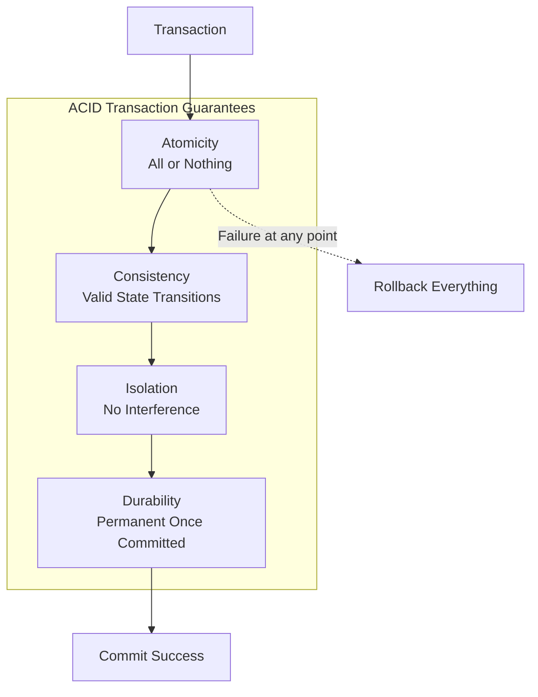
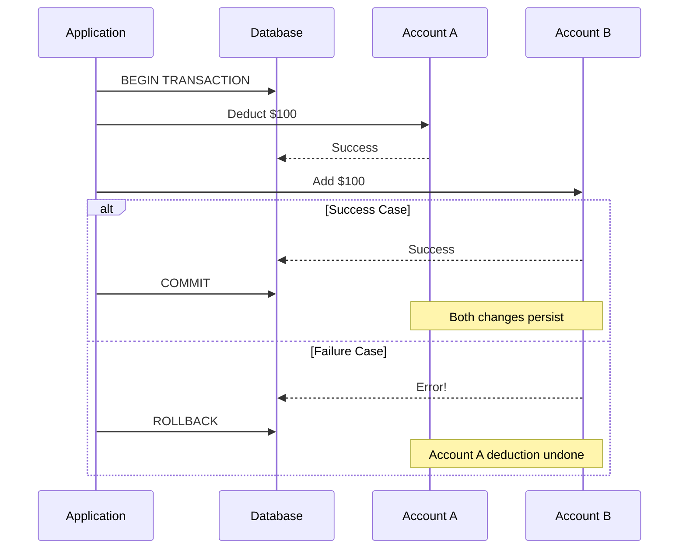
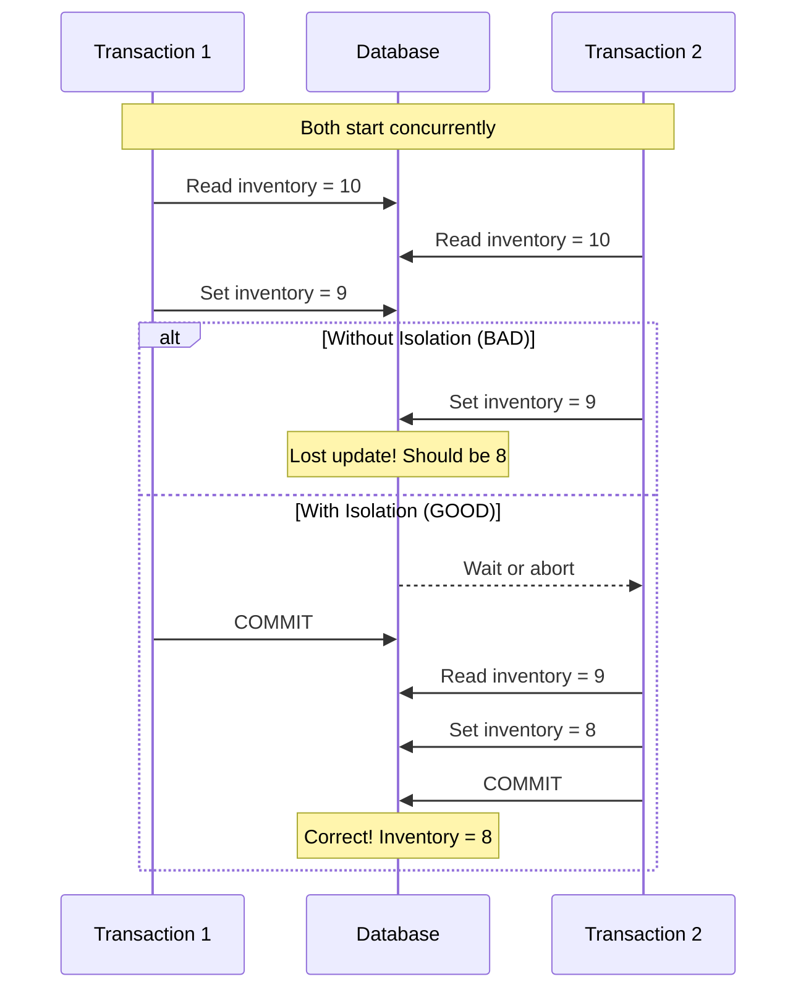
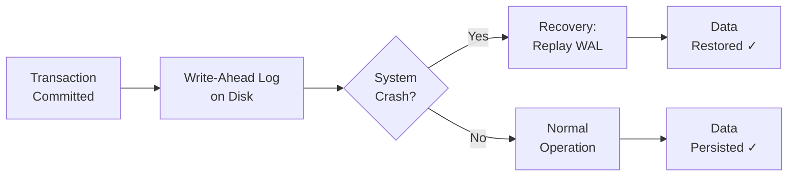
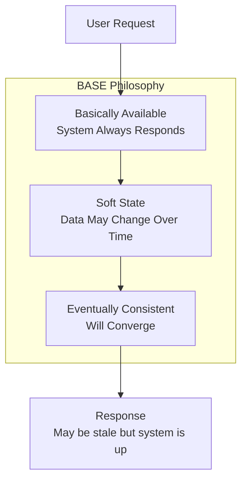
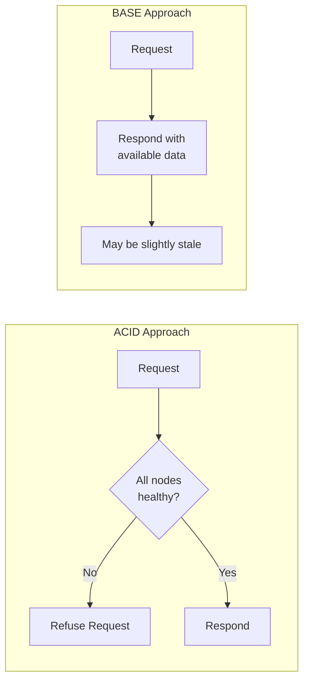
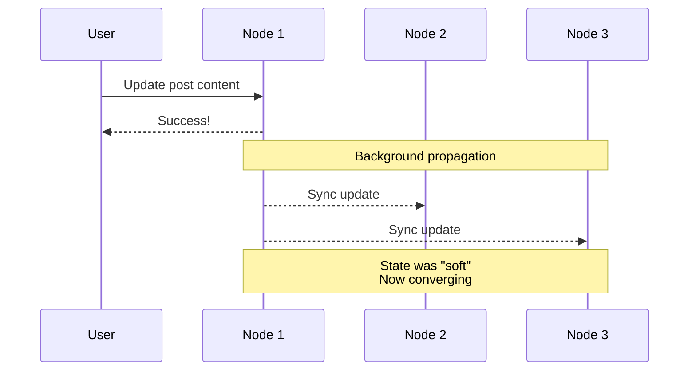
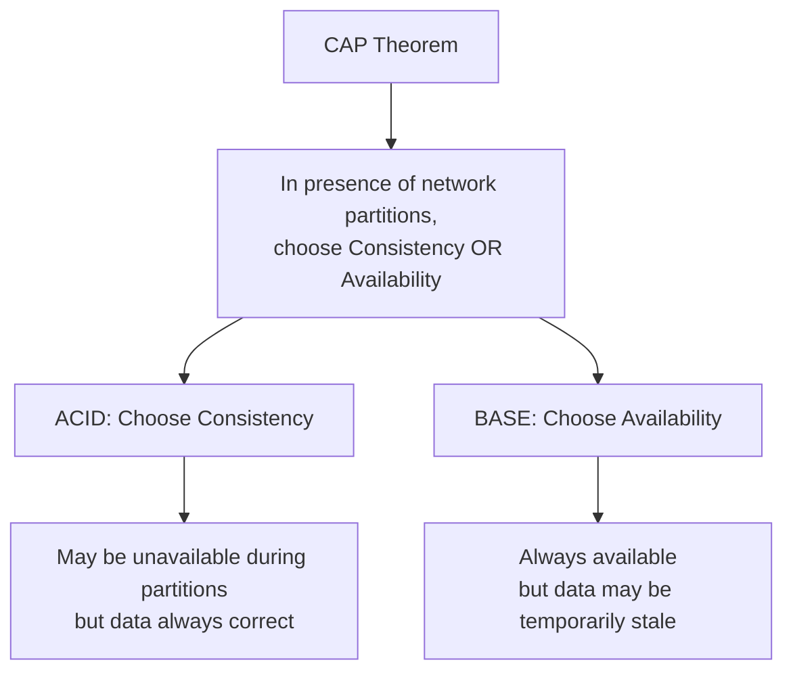
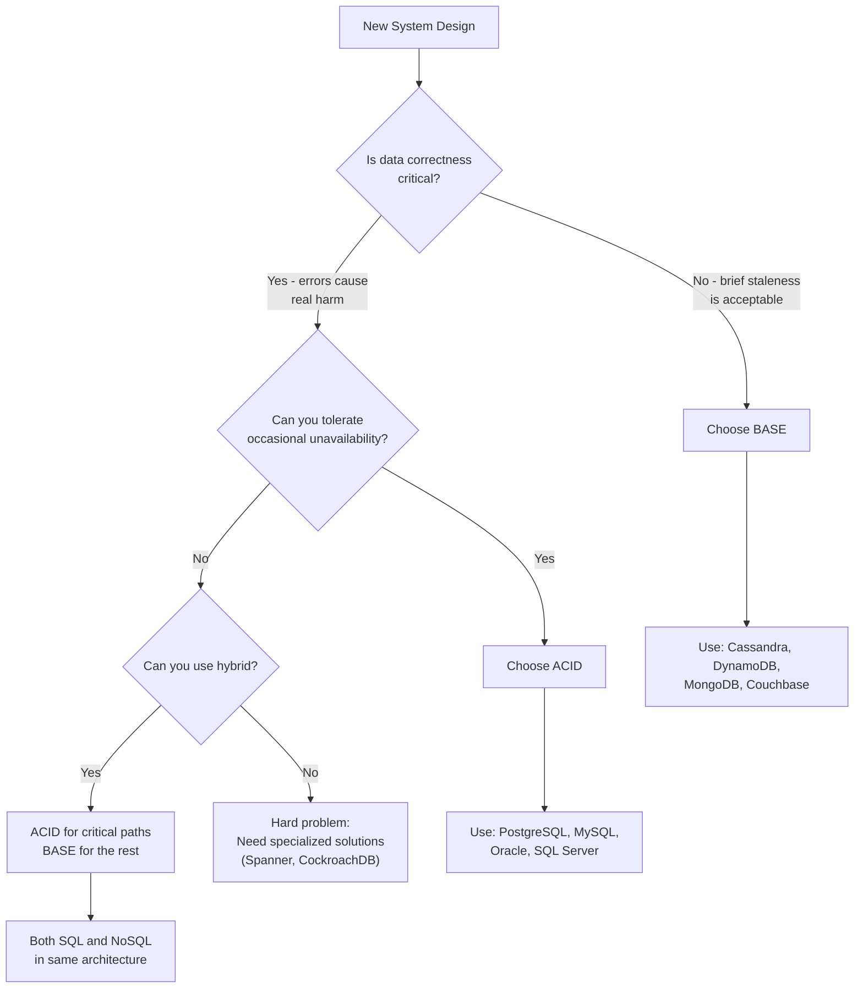

# 02 - ACID vs BASE Properties

## Transactional Guarantees in Database Systems

---

## Concept Overview

**Why This Matters**

When you use an application—whether online banking or a shopping site—you expect the data to be correct and the system to work reliably. If you transfer money and a glitch happens, you wouldn't want the bank to deduct money from your account without adding it to the recipient's account.

**The Two Philosophies**

ACID and BASE represent different priorities in database design:
- **ACID**: Keep transactions strictly correct and reliable
- **BASE**: Keep the system basically available and scalable

```
┌────────────────────────────────────────────────────────────────────────┐
│                                                                        │
│          ACID                            vs           BASE             │
│   (Strict Correctness)                        (Scalable Availability)  │
│                                                                        │
│   ✓ Strong guarantees                         ✓ High availability      │
│   ✓ Simple to reason about                    ✓ Horizontal scaling     │
│   ✗ Performance overhead                      ✗ Temporary inconsistency│
│   ✗ Harder to scale                           ✗ Complex app logic      │
│                                                                        │
└────────────────────────────────────────────────────────────────────────┘
```

---

## Mental Models

### ACID: The Bank Vault

Think of ACID like a bank vault transaction. When you transfer money:
1. Either the entire transfer happens, or nothing happens (no half-transfers)
2. The total money in the system stays constant
3. No one else sees your in-progress transfer
4. Once complete, the record survives even if the power goes out

### BASE: The Social Feed

Think of BASE like posting on social media. When you post:
1. Your post shows up immediately (to you, at least)
2. Friends might see it a few seconds later
3. The system prioritizes letting you post over perfect synchronization
4. Eventually, everyone sees the same feed

---

## Technical Deep-Dive

### ACID Properties



#### Atomicity: All-or-Nothing

A transaction executes completely or not at all—no partial completions.



**Example**: Bank transfer of $100 from Account A to Account B
- ✓ Both deduction and addition succeed → commit
- ✗ Addition fails → rollback the deduction too
- Never: Money deducted but not added (or vice versa)

#### Consistency: Valid State Transitions

Every transaction brings the database from one valid state to another, respecting all defined rules (constraints).

```
Before Transaction:
┌────────────────────────────────────────┐
│  Account A: $500    Account B: $100    │
│  Total: $600 ✓ (invariant maintained)  │
└────────────────────────────────────────┘
                    │
                    ▼ Transfer $100
                    
After Transaction:
┌────────────────────────────────────────┐
│  Account A: $400    Account B: $200    │
│  Total: $600 ✓ (invariant maintained)  │
└────────────────────────────────────────┘
```

**Example**: Total money across accounts must remain constant. Balance cannot go negative.

#### Isolation: No Interference

Concurrent transactions behave as if they run sequentially—intermediate states are hidden.



**Isolation Levels** (from strictest to loosest):

| Level | Dirty Reads | Non-Repeatable Reads | Phantom Reads |
|-------|-------------|---------------------|---------------|
| Serializable | ✗ | ✗ | ✗ |
| Repeatable Read | ✗ | ✗ | ✓ |
| Read Committed | ✗ | ✓ | ✓ |
| Read Uncommitted | ✓ | ✓ | ✓ |

#### Durability: Permanent Once Committed

Once a transaction commits, changes persist even through crashes, power failures, or errors.



**Mechanism**: Write-Ahead Logging (WAL)
- Changes written to durable log before applied to data
- On crash recovery, replay log to restore committed transactions

---

### BASE Properties



#### Basically Available

The system guarantees availability—it always tries to respond, even under heavy load or partial failures.



**Example**: During a massive sale, an e-commerce site using BASE continues accepting orders even if inventory counts lag slightly. Users might place an order for an item that just sold out, but the system handles that gracefully rather than going down.

#### Soft State

The system's state may change over time even without input, as updates propagate through the system.



**Example**: When you edit a social media post, you see the update immediately. Your friend's app might show the old version for a few seconds until the update propagates.

#### Eventually Consistent

Given enough time (and no new updates), all replicas will converge to the same state.

**Key insight**: No guarantee *when* consistency is reached, only that it *will* be reached.

---

## Trade-Off Analysis

### ACID vs BASE Comparison

| Aspect | ACID | BASE |
|--------|------|------|
| **Primary Goal** | Correctness | Availability |
| **Consistency** | Immediate, strong | Eventual |
| **Availability** | May sacrifice for consistency | Prioritized over consistency |
| **Scaling** | Typically vertical (single node) | Horizontal (distributed) |
| **Transaction Model** | All-or-nothing with rollback | Optimistic, handle conflicts later |
| **Performance** | Coordination overhead | Fast local operations |
| **Developer Burden** | Database handles consistency | Application handles inconsistency |

### The CAP Theorem Connection



### Decision Matrix



---

## Real-World Database Examples

### ACID-Compliant Databases

| Database | Type | Notable ACID Features |
|----------|------|----------------------|
| **PostgreSQL** | Relational SQL | Full ACID, MVCC isolation |
| **MySQL (InnoDB)** | Relational SQL | Full ACID, row-level locking |
| **Oracle** | Relational SQL | Full ACID, distributed transactions |
| **SQL Server** | Relational SQL | Full ACID, snapshot isolation |
| **SQLite** | Embedded SQL | ACID with WAL mode |
| **CockroachDB** | Distributed SQL | ACID at global scale |
| **Google Spanner** | Distributed SQL | Global ACID with TrueTime |

### BASE-Oriented Databases

| Database | Type | Consistency Model |
|----------|------|-------------------|
| **Apache Cassandra** | Wide-column | Tunable consistency (eventual default) |
| **Amazon DynamoDB** | Key-value | Eventual (strong available per-request) |
| **MongoDB** | Document | Eventual (configurable write concern) |
| **Redis** | In-memory KV | Eventual (async replication) |
| **Couchbase** | Document | Eventual with tunable durability |
| **Apache HBase** | Wide-column | Strong per-row, eventual across rows |
| **Riak** | Key-value | Eventual with vector clocks |

---

## When to Use Which

### Use ACID When:

| Scenario | Why ACID | Example |
|----------|----------|---------|
| **Financial transactions** | Cannot risk incorrect balances | Banking, trading |
| **Inventory management** | Overselling causes real cost | E-commerce checkout |
| **Healthcare records** | Patient safety depends on accuracy | Medical systems |
| **Booking systems** | Double-booking destroys trust | Hotels, airlines |
| **Compliance requirements** | Regulations mandate audit trails | SOX, HIPAA |

### Use BASE When:

| Scenario | Why BASE | Example |
|----------|----------|---------|
| **Social media** | Engagement trumps perfect sync | Feeds, likes, shares |
| **IoT data ingestion** | Volume matters more than order | Sensor readings |
| **Analytics/BI** | Approximate counts are acceptable | Dashboards, metrics |
| **Content delivery** | Speed matters more than freshness | CDN, media streaming |
| **Gaming leaderboards** | Eventual accuracy is fine | Scores, achievements |

### The Hybrid Approach (Common in Practice)

```
┌─────────────────────────────────────────────────────────────────┐
│                  E-COMMERCE ARCHITECTURE                        │
├─────────────────────────────────────────────────────────────────┤
│                                                                  │
│  ┌─────────────────────┐    ┌─────────────────────────────────┐ │
│  │   ACID (PostgreSQL) │    │    BASE (Cassandra/Redis)       │ │
│  │   ─────────────────  │    │    ─────────────────────        │ │
│  │   • User accounts    │    │    • Product catalog cache     │ │
│  │   • Orders           │    │    • Session storage           │ │
│  │   • Payments         │    │    • Recommendations           │ │
│  │   • Inventory        │    │    • Analytics events          │ │
│  │     (at checkout)    │    │    • Search index              │ │
│  └─────────────────────┘    └─────────────────────────────────┘ │
│                                                                  │
│  Rule: Use ACID for "money and commitments"                      │
│        Use BASE for "content and engagement"                     │
│                                                                  │
└─────────────────────────────────────────────────────────────────┘
```

---

## Interview Patterns

### How to Discuss in 30 Seconds

> "ACID guarantees transactions are atomic, consistent, isolated, and durable—essential for banking where you can't have partial transfers. BASE prioritizes availability and accepts eventual consistency—better for social feeds where brief staleness is acceptable. Most large systems use both: ACID for critical transactions, BASE for scalable content."

### How to Discuss in 2 Minutes

Add:
- Explain each ACID property with the bank transfer example
- Explain BASE with the social feed example
- Connect to CAP theorem
- Mention the hybrid approach is common

### Common Follow-Up Questions

| Question | Key Points to Cover |
|----------|---------------------|
| "What happens if a transaction fails mid-way?" | Atomicity guarantees rollback; explain WAL |
| "How do you handle transactions across microservices?" | Saga pattern, eventual consistency with compensation |
| "What's the performance cost of ACID?" | Locking overhead, write amplification, coordination |
| "Can NoSQL databases do ACID?" | Some can (MongoDB 4.0+, Cassandra LWT), but trade-offs |
| "How do you test ACID compliance?" | Jepsen testing, transaction replay, isolation tests |

### Red Flags to Avoid

❌ Saying "NoSQL means no transactions"  
✓ Many NoSQL DBs support transactions with trade-offs

❌ Saying "ACID is always better for important data"  
✓ Availability may be more critical than consistency for some "important" data

❌ Ignoring the performance implications of ACID  
✓ Acknowledge the coordination overhead

---

## Connections to Other Concepts

| Related Topic | Connection |
|---------------|------------|
| [Consistency Models](./01_CONSISTENCY_MODELS.md) | ACID requires strong consistency; BASE embraces eventual |
| [Database Selection](./05_DATABASE_SELECTION.md) | SQL typically ACID; NoSQL often BASE |
| [Replication Patterns](./06_REPLICATION_PATTERNS.md) | Sync replication for ACID; async for BASE |
| [Batch vs Stream](./15_BATCH_VS_STREAM.md) | Stream processing often uses BASE semantics |
| [Read/Write Optimization](./14_READ_WRITE_OPTIMIZATION.md) | CQRS bridges ACID writes with BASE reads |

---

## Quick Reference Card

```
┌─────────────────────────────────────────────────────────────────┐
│                  ACID vs BASE QUICK REFERENCE                    │
├─────────────────────────────────────────────────────────────────┤
│                                                                  │
│  ACID (Atomicity, Consistency, Isolation, Durability)           │
│  ────────────────────────────────────────────────────           │
│  • Philosophy: Correctness above all                             │
│  • Transactions: All-or-nothing with rollback                    │
│  • Scaling: Primarily vertical                                   │
│  • Use for: Financial, healthcare, inventory                     │
│  • Systems: PostgreSQL, MySQL, Oracle                            │
│                                                                  │
│  BASE (Basically Available, Soft state, Eventually consistent)  │
│  ────────────────────────────────────────────────────────────── │
│  • Philosophy: Availability above all                            │
│  • Transactions: Optimistic, resolve conflicts later             │
│  • Scaling: Horizontal by design                                 │
│  • Use for: Social, analytics, IoT, content                      │
│  • Systems: Cassandra, DynamoDB, MongoDB                         │
│                                                                  │
│  DECISION RULE                                                   │
│  ─────────────                                                   │
│  "Would incorrect data cause immediate, real-world harm?"        │
│  • Yes → ACID                                                    │
│  • No  → BASE (and enjoy the scale)                              │
│  • Both → Hybrid architecture                                    │
│                                                                  │
└─────────────────────────────────────────────────────────────────┘
```

---

*Previous: [01 - Consistency Models](./01_CONSISTENCY_MODELS.md) | Next: [03 - Latency vs Throughput](./03_LATENCY_VS_THROUGHPUT.md)*
