# 08 - API Design: REST vs RPC

## Overview

API design determines how clients and services communicate. The choice between REST and RPC paradigms (including gRPC and GraphQL) affects developer experience, performance, evolvability, and operational complexity. This document provides a systematic framework for evaluating API styles and designing APIs that scale.

---

## Core Mental Model

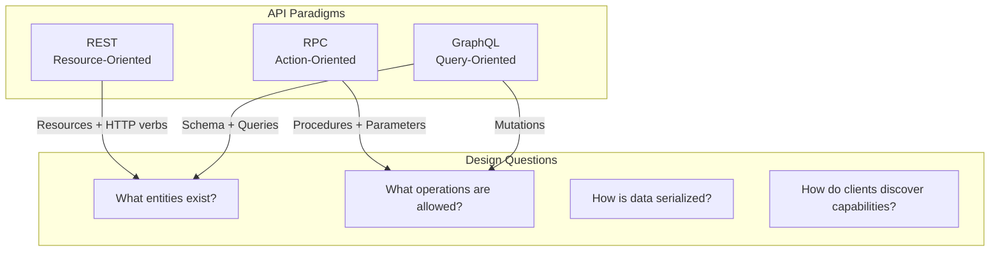

**Key Insight**: REST models "things" (nouns), RPC models "actions" (verbs), GraphQL lets clients specify exactly what they need.

---

## REST (Representational State Transfer)

### Core Principles

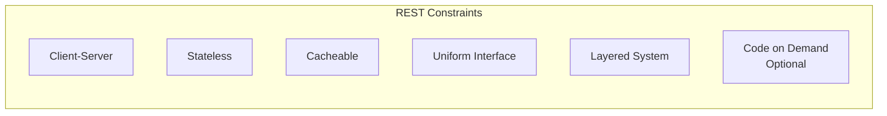

### Resource-Oriented Design

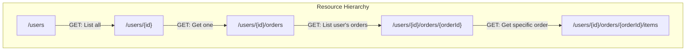

### HTTP Methods Mapping

| Method | Operation | Idempotent | Safe | Example |
|--------|-----------|------------|------|---------|
| GET | Read | Yes | Yes | `GET /users/123` |
| POST | Create | No | No | `POST /users` |
| PUT | Replace | Yes | No | `PUT /users/123` |
| PATCH | Partial Update | No* | No | `PATCH /users/123` |
| DELETE | Remove | Yes | No | `DELETE /users/123` |

*PATCH can be idempotent if using JSON Patch with specific operations.

### Status Codes

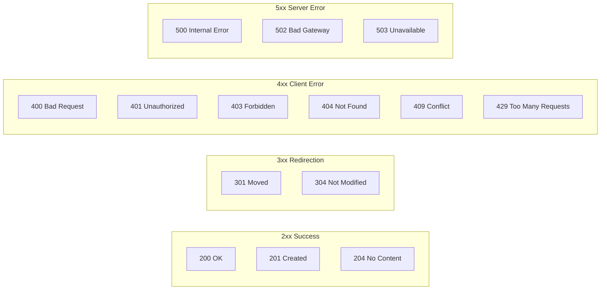

### HATEOAS (Hypermedia)

```json
{
  "id": 123,
  "name": "John Doe",
  "email": "john@example.com",
  "_links": {
    "self": { "href": "/users/123" },
    "orders": { "href": "/users/123/orders" },
    "update": { "href": "/users/123", "method": "PUT" },
    "delete": { "href": "/users/123", "method": "DELETE" }
  }
}
```

**Interview Point**: HATEOAS makes APIs self-documenting and evolvable, but is rarely fully implemented in practice.

---

## REST Best Practices

### URL Design

```
✅ Good:
GET  /users                     # List users
GET  /users/123                 # Get user 123
GET  /users/123/orders          # Get user's orders
POST /users/123/orders          # Create order for user

❌ Bad:
GET  /getUsers                  # Verb in URL
GET  /user/123                  # Inconsistent plural/singular
POST /users/123/createOrder     # Action in URL
GET  /users/123/orders/active   # Filter as path segment
```

### Filtering, Pagination, Sorting

```
# Filtering
GET /users?status=active&role=admin

# Pagination (offset-based)
GET /users?offset=20&limit=10

# Pagination (cursor-based - preferred for large datasets)
GET /users?cursor=eyJpZCI6MTIzfQ&limit=10

# Sorting
GET /users?sort=-created_at,name  # Descending created_at, ascending name
```

### Cursor vs Offset Pagination

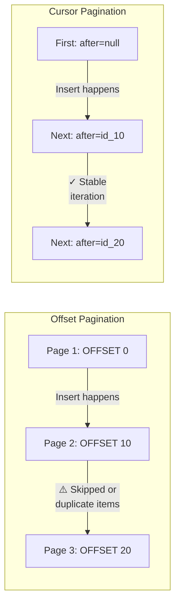

| Aspect | Offset | Cursor |
|--------|--------|--------|
| Random access | Yes (`?page=50`) | No |
| Performance | O(n) skip | O(1) seek |
| Consistency | Unstable with mutations | Stable |
| Implementation | Simple | Complex |

---

## RPC (Remote Procedure Call)

### Paradigm

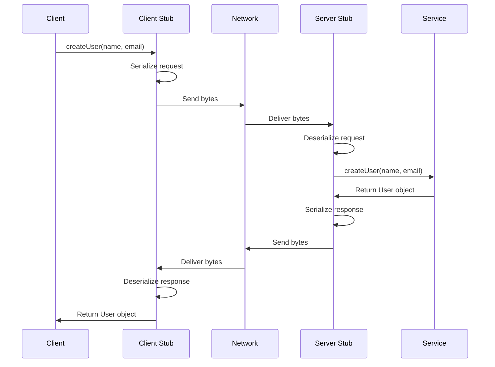

### gRPC Architecture

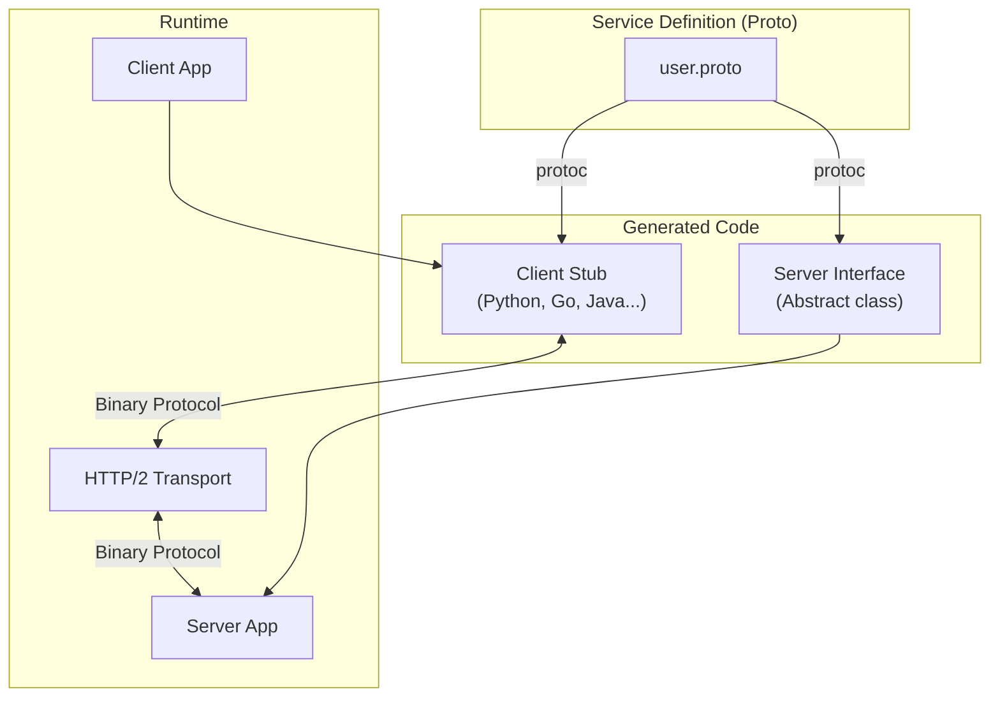

### Protocol Buffers (Protobuf)

```protobuf
syntax = "proto3";

package user;

service UserService {
  rpc CreateUser(CreateUserRequest) returns (User);
  rpc GetUser(GetUserRequest) returns (User);
  rpc ListUsers(ListUsersRequest) returns (stream User);  // Server streaming
  rpc UpdateUsers(stream User) returns (UpdateResponse);   // Client streaming
  rpc Chat(stream Message) returns (stream Message);       // Bidirectional
}

message User {
  int64 id = 1;
  string name = 2;
  string email = 3;
  repeated string roles = 4;
  google.protobuf.Timestamp created_at = 5;
}

message CreateUserRequest {
  string name = 1;
  string email = 2;
}

message GetUserRequest {
  int64 id = 1;
}
```

### gRPC Streaming Patterns

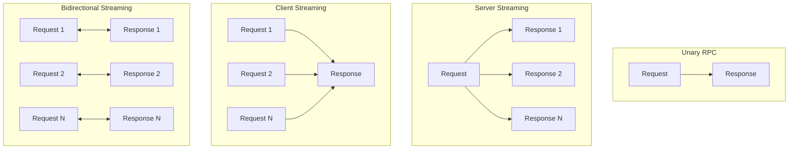

| Pattern | Use Case |
|---------|----------|
| Unary | Simple request-response |
| Server Streaming | Large result sets, real-time feeds |
| Client Streaming | File upload, aggregation |
| Bidirectional | Chat, gaming, collaborative editing |

---

## GraphQL

### Architecture

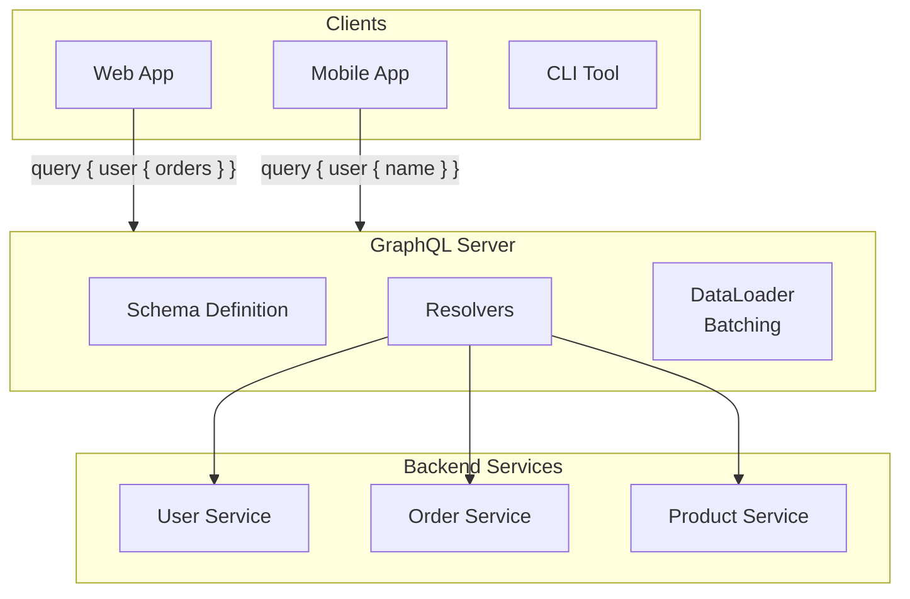

### Schema Definition

```graphql
type Query {
  user(id: ID!): User
  users(filter: UserFilter, first: Int, after: String): UserConnection!
}

type Mutation {
  createUser(input: CreateUserInput!): User!
  updateUser(id: ID!, input: UpdateUserInput!): User!
  deleteUser(id: ID!): Boolean!
}

type Subscription {
  userCreated: User!
  orderStatusChanged(userId: ID!): Order!
}

type User {
  id: ID!
  name: String!
  email: String!
  orders(first: Int): [Order!]!
  createdAt: DateTime!
}

type Order {
  id: ID!
  user: User!
  items: [OrderItem!]!
  total: Money!
  status: OrderStatus!
}

input CreateUserInput {
  name: String!
  email: String!
}

type UserConnection {
  edges: [UserEdge!]!
  pageInfo: PageInfo!
}
```

### Query Examples

```graphql
# Fetch exactly what's needed
query GetUserWithOrders {
  user(id: "123") {
    name
    email
    orders(first: 5) {
      id
      total {
        amount
        currency
      }
      status
    }
  }
}

# Response matches query shape exactly
{
  "data": {
    "user": {
      "name": "John Doe",
      "email": "john@example.com",
      "orders": [
        {
          "id": "order-1",
          "total": { "amount": 99.99, "currency": "USD" },
          "status": "DELIVERED"
        }
      ]
    }
  }
}
```

### N+1 Problem and DataLoader

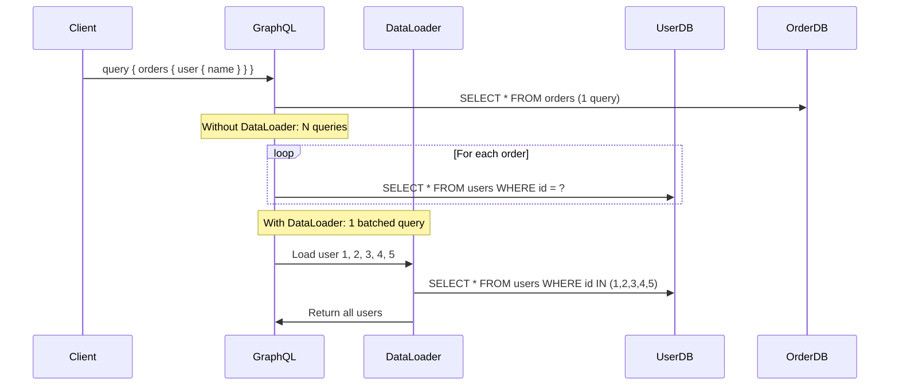

---

## Comparison Matrix

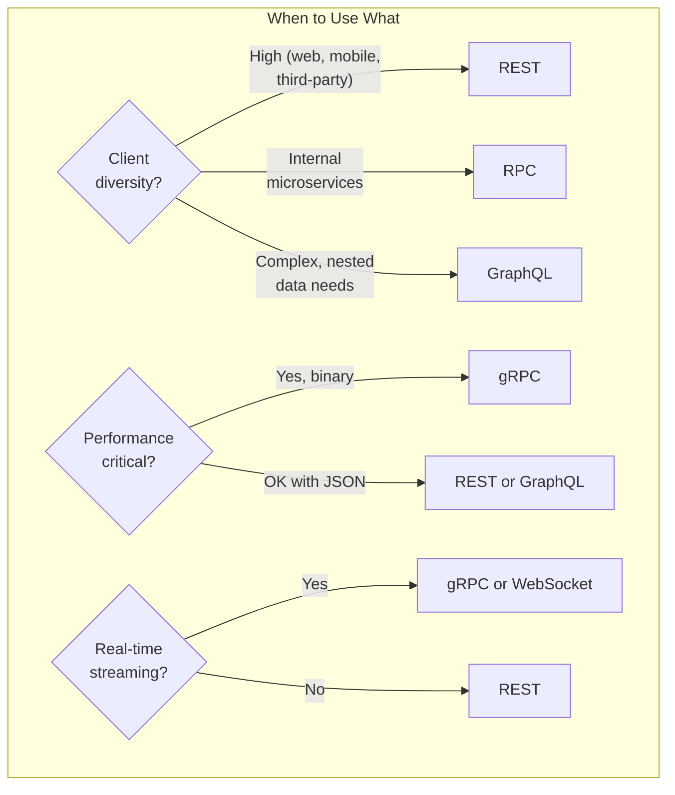

| Aspect | REST | gRPC | GraphQL |
|--------|------|------|---------|
| **Protocol** | HTTP/1.1 or HTTP/2 | HTTP/2 | HTTP (typically 1.1) |
| **Serialization** | JSON (text) | Protobuf (binary) | JSON (text) |
| **Contract** | OpenAPI/Swagger | Proto files | GraphQL Schema |
| **Caching** | HTTP caching built-in | Custom | Requires effort |
| **Browser support** | Native | Requires gRPC-Web | Native |
| **Streaming** | Limited (SSE) | Native | Subscriptions |
| **Discoverability** | HATEOAS | Reflection | Introspection |
| **Learning curve** | Low | Medium | Medium-High |
| **Overfetching** | Common | Unlikely | Solved |
| **Underfetching** | Common | Unlikely | Solved |

---

## API Versioning

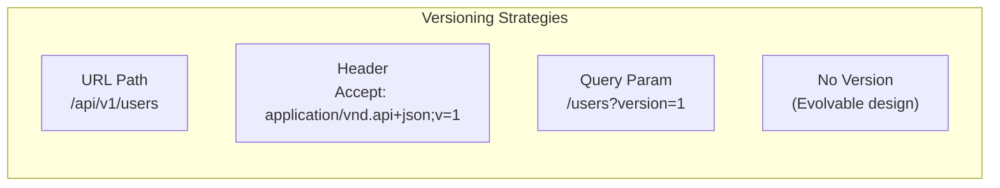

### Strategy Comparison

| Strategy | Pros | Cons |
|----------|------|------|
| **URL Path** | Clear, cacheable, simple | Breaks URLs on version change |
| **Header** | Clean URLs | Hidden, harder to test |
| **Query Param** | Easy to switch | Pollutes query string |
| **Evolvable** | No version management | Requires discipline |

### Backward-Compatible Changes

```
✅ Safe Changes (No version bump):
- Add new optional field to response
- Add new endpoint
- Add new optional query parameter
- Add new enum value (if clients handle unknown)

❌ Breaking Changes (Require version):
- Remove or rename field
- Change field type
- Change URL structure
- Change authentication mechanism
- Change error format
```

### Evolution Pattern

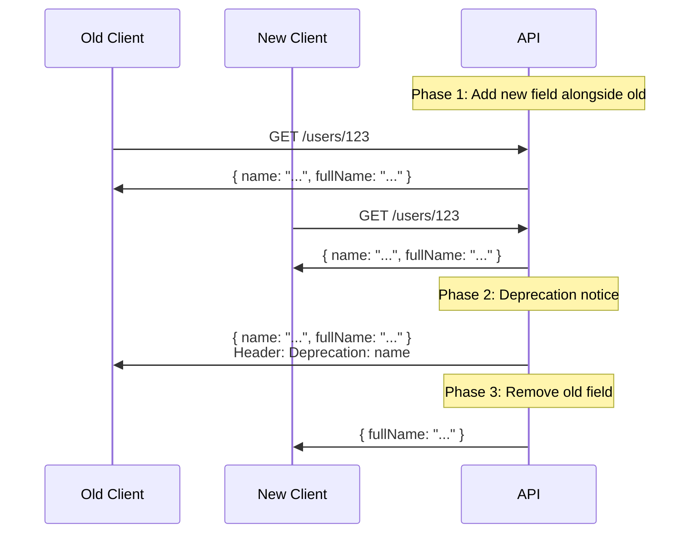

---

## Error Handling

### REST Error Response

```json
{
  "error": {
    "code": "VALIDATION_ERROR",
    "message": "Request validation failed",
    "details": [
      {
        "field": "email",
        "issue": "Invalid email format",
        "value": "not-an-email"
      }
    ],
    "request_id": "req_abc123",
    "documentation_url": "https://api.example.com/docs/errors#VALIDATION_ERROR"
  }
}
```

### gRPC Status Codes

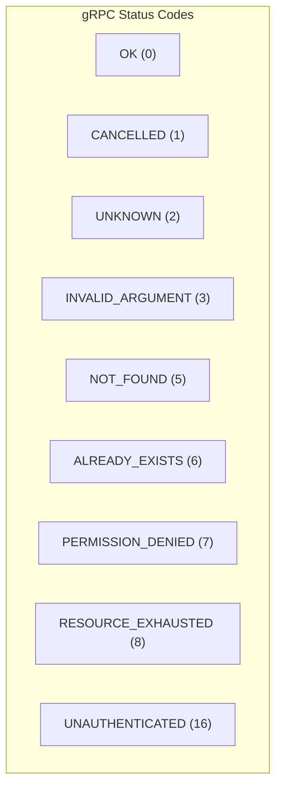

```protobuf
// Rich error details
import "google/rpc/error_details.proto";

rpc CreateUser(CreateUserRequest) returns (User) {
  // On error, return:
  // - status: INVALID_ARGUMENT
  // - details: [BadRequest { field_violations: [...] }]
}
```

### GraphQL Errors

```json
{
  "data": {
    "user": null
  },
  "errors": [
    {
      "message": "User not found",
      "locations": [{ "line": 2, "column": 3 }],
      "path": ["user"],
      "extensions": {
        "code": "NOT_FOUND",
        "timestamp": "2024-01-15T10:30:00Z"
      }
    }
  ]
}
```

---

## Security Considerations

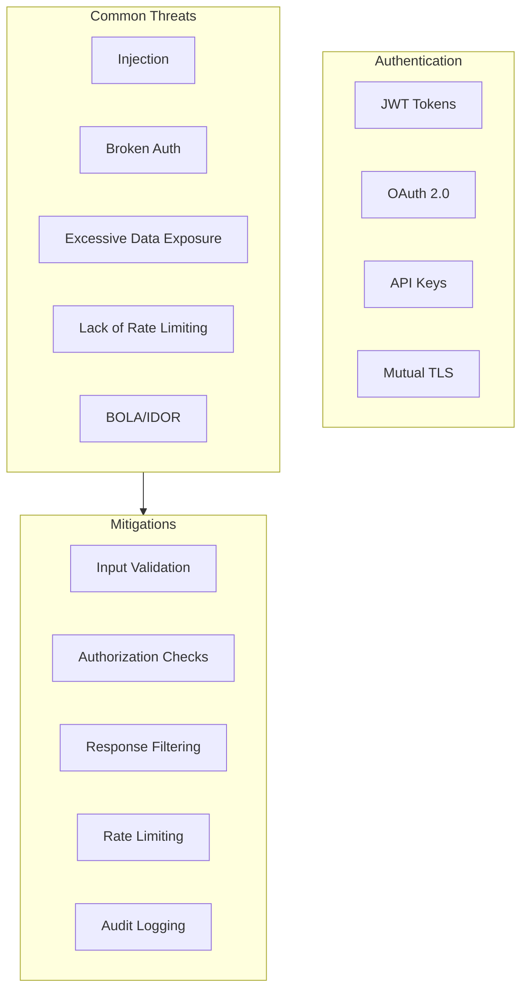

### GraphQL-Specific Security

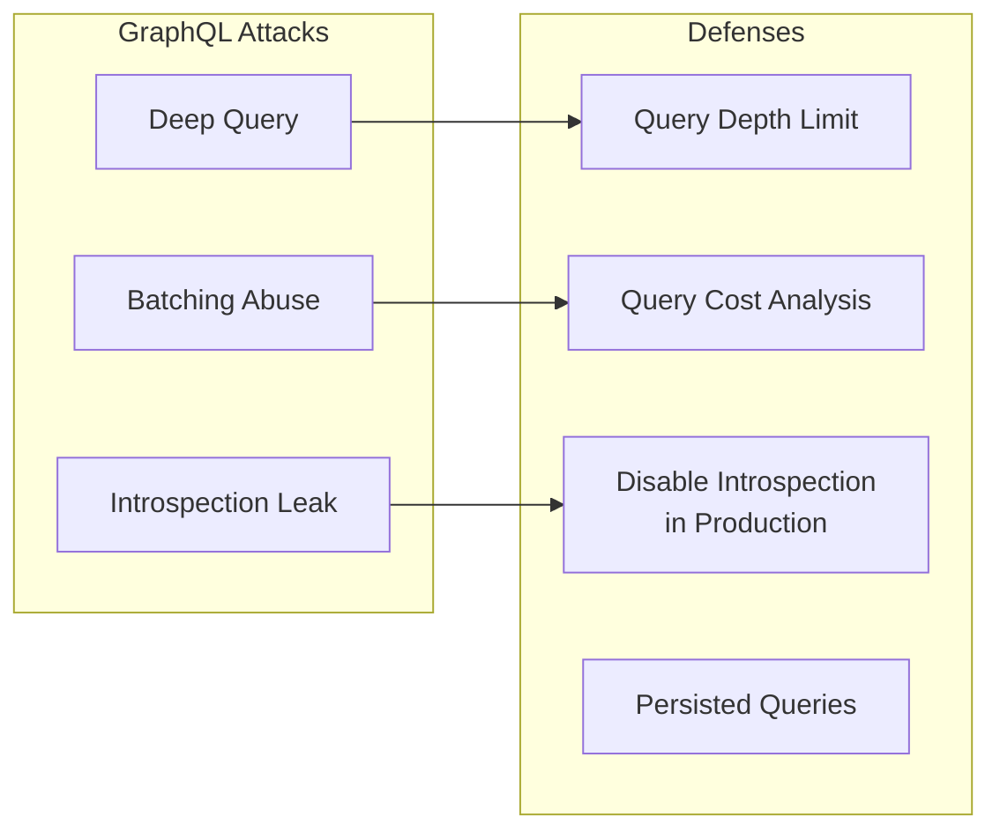

```graphql
# Malicious deep query
query EvilQuery {
  user(id: "1") {
    friends {
      friends {
        friends {
          friends {
            friends {
              # ... recursively
            }
          }
        }
      }
    }
  }
}
```

**Defense**: Implement query depth limiting (e.g., max depth = 5) and query cost analysis.

---

## Interview Scenarios

### Scenario 1: Public Developer API

**Context**: Building a public API for third-party developers

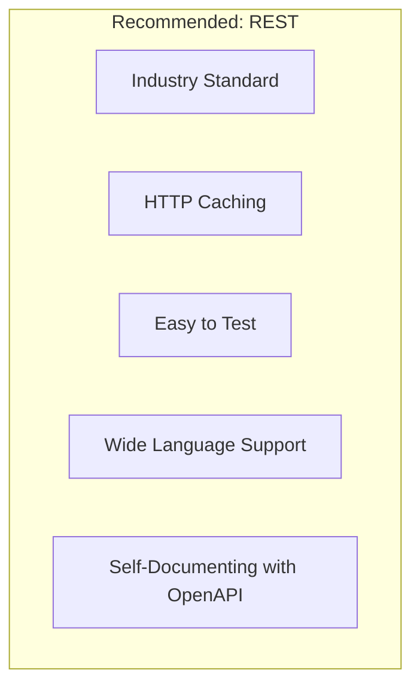

**Talking Points**:
- REST is universally understood
- HTTP caching reduces load
- OpenAPI enables SDK generation
- Versioning via URL path for clarity

### Scenario 2: Microservices Communication

**Context**: Internal service-to-service communication

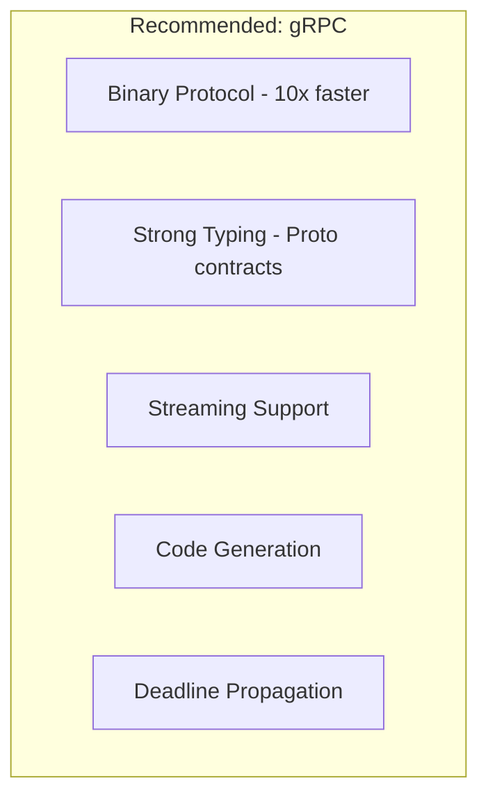

**Talking Points**:
- Performance critical for internal calls
- Proto files serve as contracts
- Built-in deadline propagation
- Bidirectional streaming for real-time needs

### Scenario 3: Mobile App with Complex UI

**Context**: Mobile app with varied data needs per screen

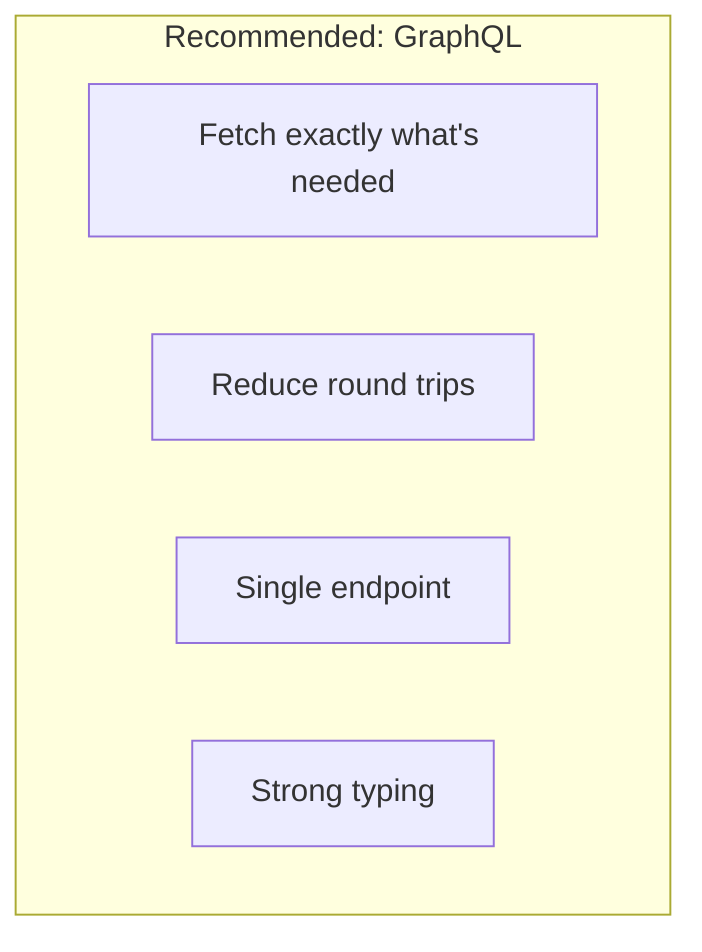

**Talking Points**:
- Mobile bandwidth constraints → no overfetching
- Different screens need different data shapes
- Single endpoint simplifies client
- Schema serves as documentation

---

## API Design Checklist

```
┌─────────────────────────────────────────────────────────────────┐
│                    API DESIGN CHECKLIST                          │
├─────────────────────────────────────────────────────────────────┤
│ NAMING                                                          │
│ □ Use nouns for REST resources (/users not /getUsers)           │
│ □ Consistent plural/singular (/users, not /user)                │
│ □ Use kebab-case for URLs (/user-profiles)                      │
│ □ Use snake_case for JSON fields (user_name)                    │
├─────────────────────────────────────────────────────────────────┤
│ OPERATIONS                                                       │
│ □ Correct HTTP methods (GET=read, POST=create, etc.)            │
│ □ Idempotent operations where possible                          │
│ □ Appropriate status codes (201 for create, 204 for delete)     │
├─────────────────────────────────────────────────────────────────┤
│ DATA                                                            │
│ □ Pagination for list endpoints                                 │
│ □ Filtering and sorting support                                 │
│ □ Consistent error format                                       │
│ □ Request validation with clear messages                        │
├─────────────────────────────────────────────────────────────────┤
│ SECURITY                                                        │
│ □ Authentication on all endpoints                               │
│ □ Authorization checks (not just authentication)                │
│ □ Rate limiting                                                 │
│ □ Input validation                                              │
│ □ Audit logging                                                 │
├─────────────────────────────────────────────────────────────────┤
│ DOCUMENTATION                                                   │
│ □ OpenAPI/Swagger spec                                          │
│ □ Example requests and responses                                │
│ □ Error code documentation                                      │
│ □ Authentication guide                                          │
└─────────────────────────────────────────────────────────────────┘
```

---

## Quick Reference Card

```
┌─────────────────────────────────────────────────────────────────┐
│                   API DESIGN CHEAT SHEET                         │
├─────────────────────────────────────────────────────────────────┤
│ REST:                                                           │
│   • Resource-oriented (nouns, not verbs)                        │
│   • HTTP verbs: GET, POST, PUT, PATCH, DELETE                   │
│   • Stateless, cacheable                                        │
│   • Best for: Public APIs, web applications                     │
├─────────────────────────────────────────────────────────────────┤
│ gRPC:                                                           │
│   • Action-oriented (procedures)                                │
│   • Binary protocol (Protobuf), HTTP/2                          │
│   • Strong typing, code generation                              │
│   • Best for: Microservices, performance-critical               │
├─────────────────────────────────────────────────────────────────┤
│ GraphQL:                                                        │
│   • Query-oriented (ask for exactly what you need)              │
│   • Single endpoint, client-driven                              │
│   • Solves over/under-fetching                                  │
│   • Best for: Complex UIs, mobile apps                          │
├─────────────────────────────────────────────────────────────────┤
│ DECISION HEURISTIC:                                             │
│   • External developers? → REST                                 │
│   • Internal microservices? → gRPC                              │
│   • Complex client data needs? → GraphQL                        │
│   • Need all three? → BFF pattern (Backend for Frontend)        │
└─────────────────────────────────────────────────────────────────┘
```

---

## Practice Questions

1. Design an API for a file storage service (like Dropbox). Would you use REST, gRPC, or GraphQL? Why?
2. How would you handle API versioning for a mobile app where you can't force users to update?
3. Explain the trade-offs between cursor-based and offset-based pagination.
4. Design the API for a real-time collaborative document editor. What protocols would you use?
5. How would you prevent abuse of a GraphQL API? Discuss query complexity analysis.
