# 11 - Architecture Paradigms: Serverless vs Traditional, Stateful vs Stateless

## Overview

Architecture paradigms define how systems are structured, deployed, and scaled. The choice between serverless and traditional architectures, and between stateful and stateless designs, fundamentally affects operational complexity, cost, scalability, and developer experience. This document provides a systematic framework for evaluating these architectural decisions.

---

## Core Mental Model

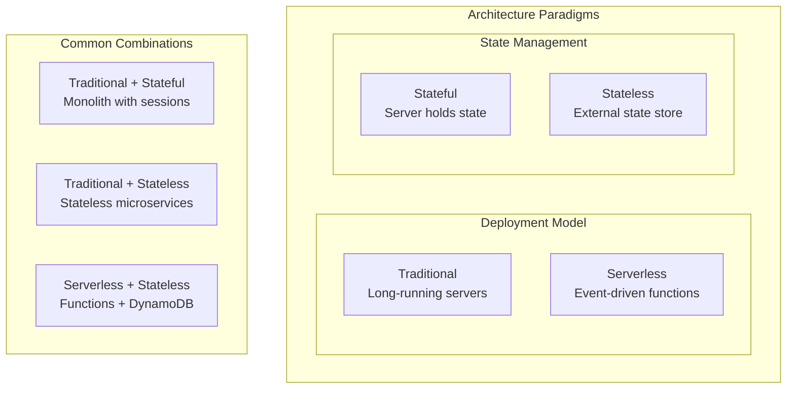

**Key Insight**: These paradigms are orthogonal. Serverless can be stateful (with external state), and traditional servers can be stateless. The combination you choose depends on your specific requirements.

---

## Stateless vs Stateful Services

### Fundamental Difference

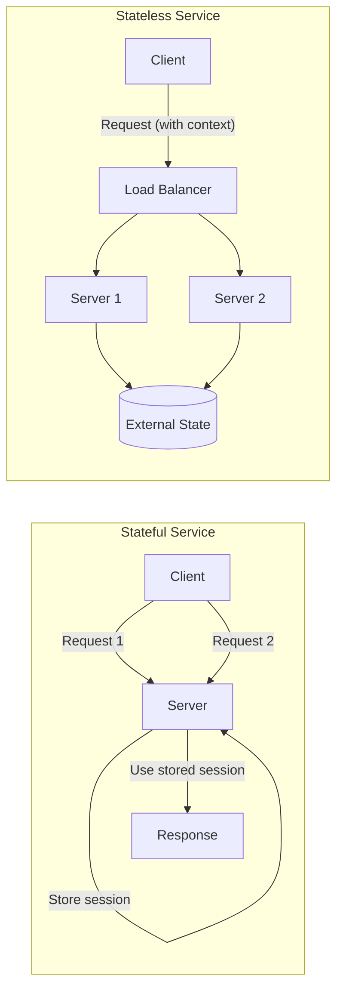

### Comparison

| Aspect | Stateful | Stateless |
|--------|----------|-----------|
| **Scaling** | Complex (session affinity) | Simple (any instance) |
| **Failure handling** | State lost on crash | No state to lose |
| **Load balancing** | Sticky sessions required | Round-robin works |
| **Deployment** | Drain sessions first | Replace anytime |
| **Memory usage** | Higher (holds state) | Lower |
| **Latency** | Lower (local state) | Higher (external lookup) |

### Stateless Design Pattern

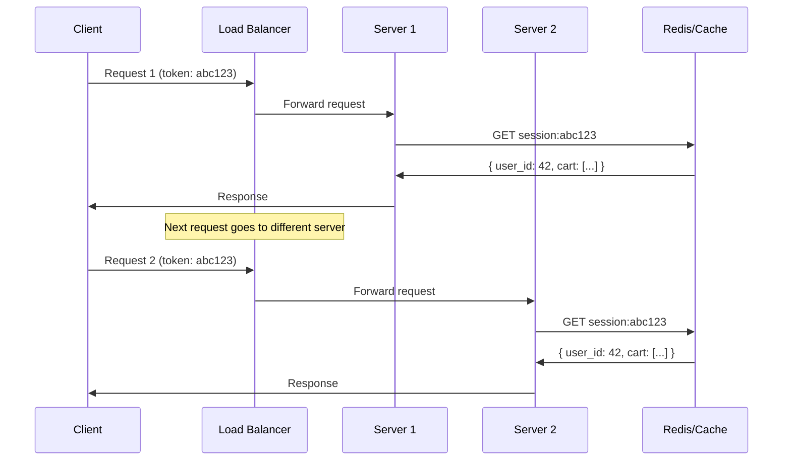

### Making Services Stateless

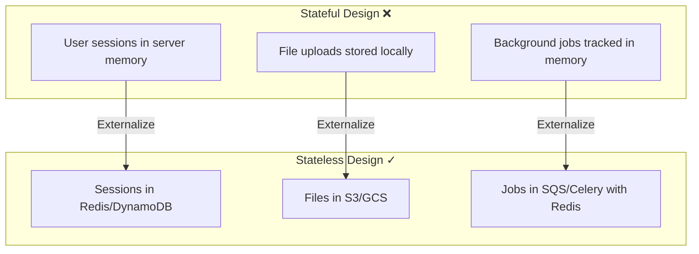

### State Externalization Strategies

| State Type | Solution |
|------------|----------|
| **User sessions** | Redis, Memcached, DynamoDB |
| **Shopping carts** | Redis with persistence, database |
| **File uploads** | S3, GCS, Azure Blob |
| **Background job state** | Message queue + database |
| **In-memory cache** | Distributed cache (Redis) |
| **Locks/coordination** | Redis, ZooKeeper, etcd |

---

## Traditional Architecture

### Characteristics

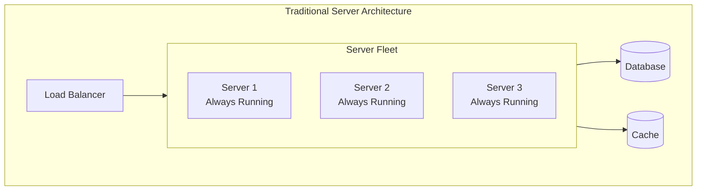

### Deployment Models

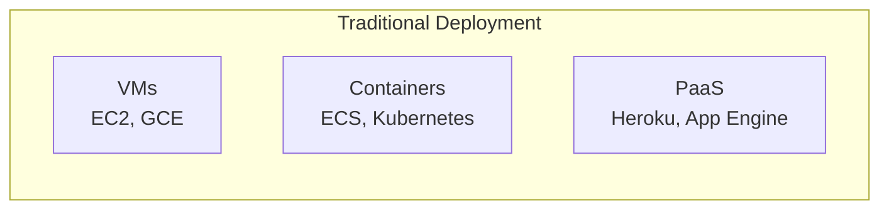

| Model | Control | Complexity | Use Case |
|-------|---------|------------|----------|
| **VMs** | Full | High | Legacy, specific OS needs |
| **Containers** | Application-level | Medium | Microservices, portability |
| **PaaS** | Minimal | Low | Rapid development, small teams |

### Scaling Traditional Services

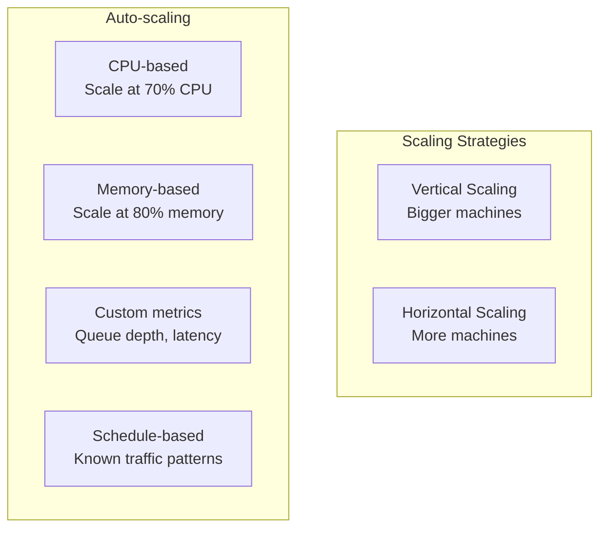

```yaml
# Kubernetes HPA example
apiVersion: autoscaling/v2
kind: HorizontalPodAutoscaler
metadata:
  name: api-server
spec:
  scaleTargetRef:
    apiVersion: apps/v1
    kind: Deployment
    name: api-server
  minReplicas: 3
  maxReplicas: 100
  metrics:
  - type: Resource
    resource:
      name: cpu
      target:
        type: Utilization
        averageUtilization: 70
  - type: Pods
    pods:
      metric:
        name: requests_per_second
      target:
        type: AverageValue
        averageValue: 1000
```

---

## Serverless Architecture

### Characteristics

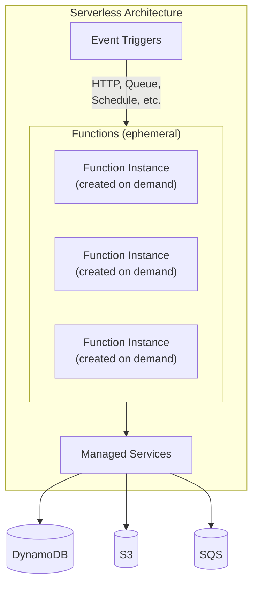

### Function Lifecycle

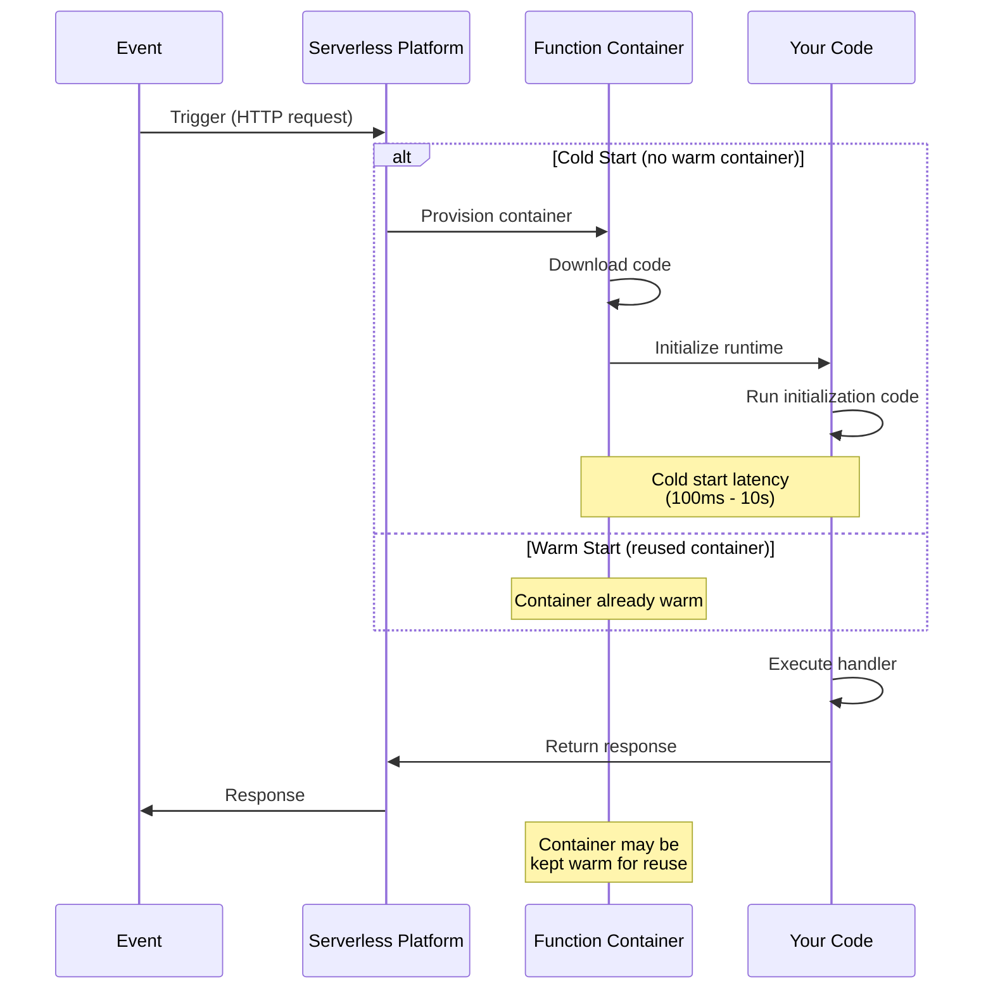

### Cold Start Mitigation

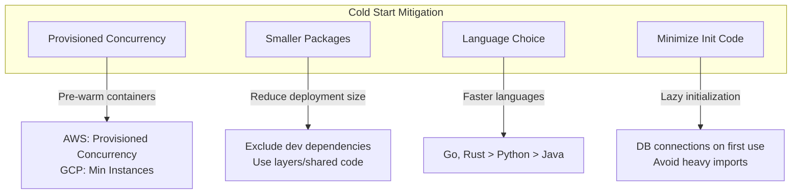

### Serverless Patterns

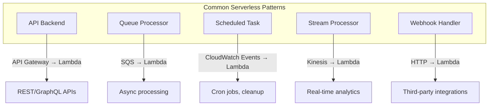

---

## Serverless vs Traditional: Detailed Comparison

### Cost Model

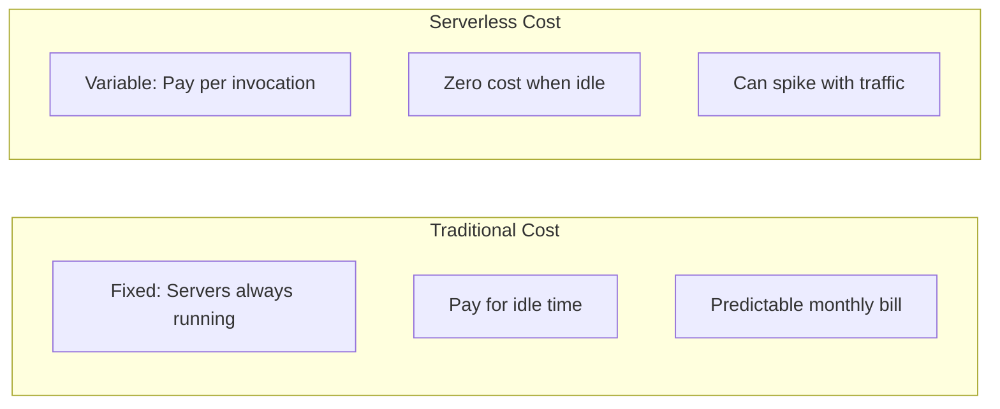

```
Traditional Cost Example:
- 3 x t3.medium EC2 instances
- Running 24/7 for 30 days
- Cost: 3 × $0.0416/hr × 720 hrs = ~$90/month
- Even if handling 0 requests

Serverless Cost Example (AWS Lambda):
- 1 million requests/month
- 200ms average duration, 256MB memory
- Compute: 1M × 0.2s × 256MB = 50,000 GB-seconds
- Cost: $0.0000166667 × 50,000 + $0.20 = ~$1.03/month

Crossover point: Where serverless becomes more expensive
- Depends on traffic patterns and execution time
- Typically: High, consistent traffic favors traditional
```

### Comparison Matrix

| Aspect | Traditional | Serverless |
|--------|-------------|------------|
| **Scaling** | Manual/auto-scaling config | Automatic, instant |
| **Cold start** | None (always running) | Can be 100ms-10s |
| **Max execution** | Unlimited | Limited (15 min Lambda) |
| **State** | Can be stateful | Must be stateless |
| **Debugging** | SSH, local reproduction | CloudWatch, harder to debug |
| **Vendor lock-in** | Lower (portable containers) | Higher (proprietary triggers) |
| **Cost at scale** | More predictable | Can be surprising |
| **Ops overhead** | Higher (patching, scaling) | Lower (managed) |
| **Development speed** | Slower setup | Faster prototyping |

### Decision Framework

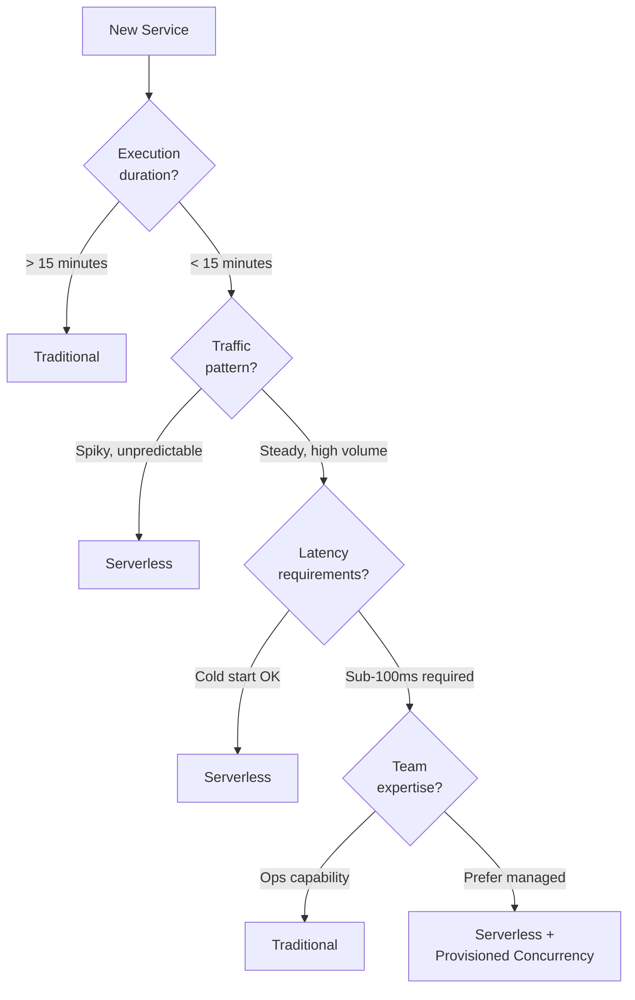

---

## Hybrid Architectures

### Real-World Pattern

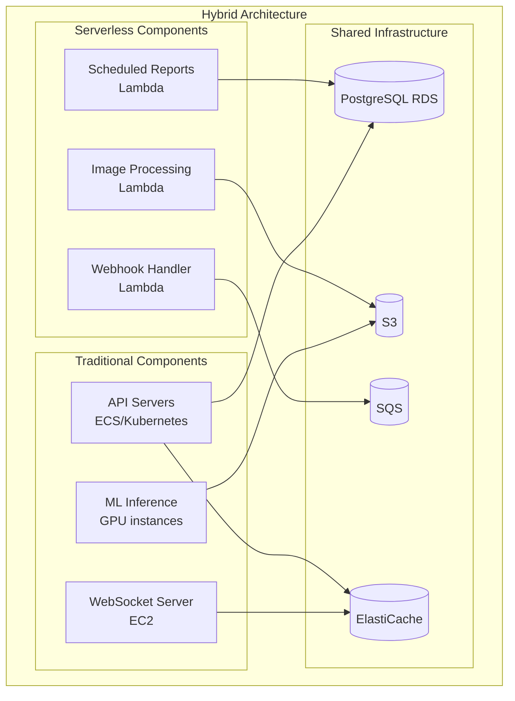

### When to Mix

| Use Serverless For | Use Traditional For |
|--------------------|--------------------|
| Event-driven processing | Long-running processes |
| Variable/spiky workloads | Steady high throughput |
| Cron jobs, scheduled tasks | WebSocket connections |
| Webhooks, integrations | GPU/specialized hardware |
| Quick prototypes | Latency-critical paths |
| Infrequent batch jobs | Stateful applications |

---

## Stateful Serverless Patterns

### Durable Functions / Step Functions

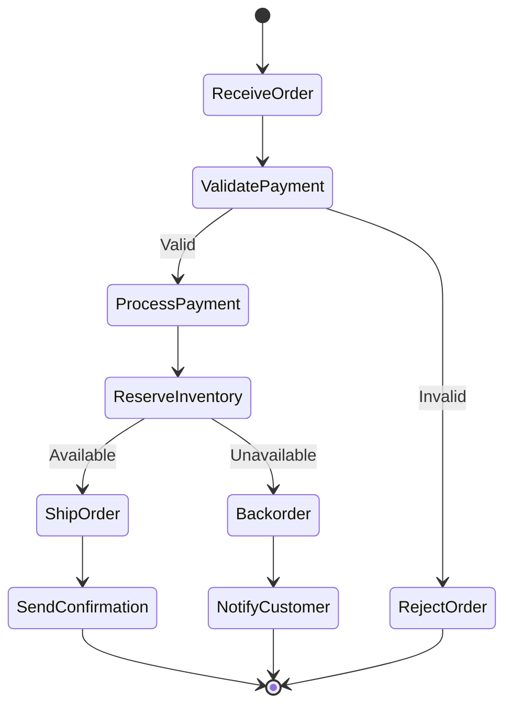

```python
# AWS Step Functions definition
{
    "Comment": "Order Processing Workflow",
    "StartAt": "ValidatePayment",
    "States": {
        "ValidatePayment": {
            "Type": "Task",
            "Resource": "arn:aws:lambda:...:validate-payment",
            "Next": "ProcessPayment",
            "Catch": [{
                "ErrorEquals": ["PaymentError"],
                "Next": "RejectOrder"
            }]
        },
        "ProcessPayment": {
            "Type": "Task",
            "Resource": "arn:aws:lambda:...:process-payment",
            "Next": "ReserveInventory"
        },
        "ReserveInventory": {
            "Type": "Task",
            "Resource": "arn:aws:lambda:...:reserve-inventory",
            "Next": "ShipOrder",
            "Catch": [{
                "ErrorEquals": ["OutOfStockError"],
                "Next": "Backorder"
            }]
        }
        // ... more states
    }
}
```

### Actor Model (Durable Entities)

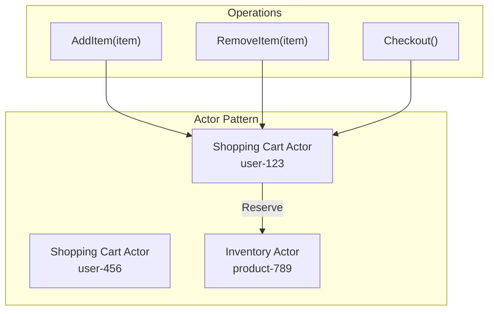

---

## Interview Scenarios

### Scenario 1: Image Processing Pipeline

**Requirements**: Users upload images, need thumbnails and multiple sizes

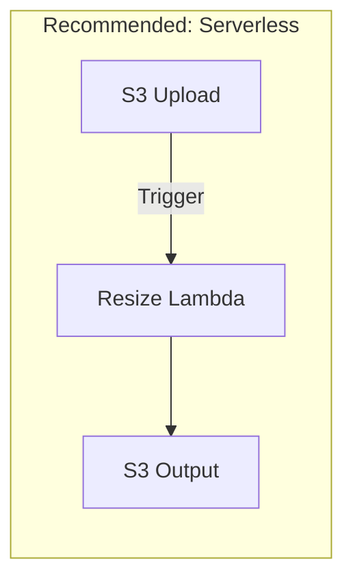

**Talking Points**:
- Event-driven (S3 trigger)
- Variable workload (uploads are spiky)
- No state needed between invocations
- Pay only for processing time
- Easy to parallelize

### Scenario 2: Real-Time Gaming Server

**Requirements**: Multiplayer game, 60 FPS updates, persistent connections

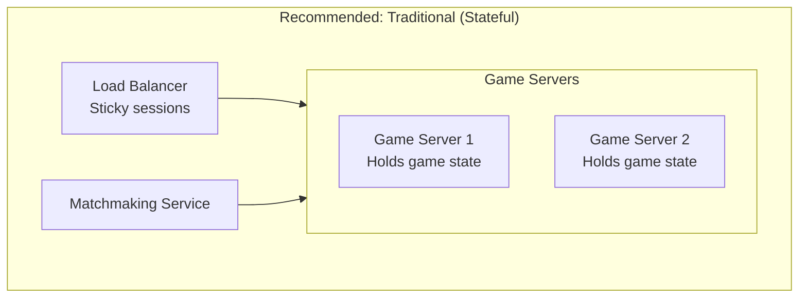

**Talking Points**:
- Persistent WebSocket connections
- Sub-millisecond latency required
- In-memory game state for performance
- Serverless cold starts unacceptable
- Long-running connections

### Scenario 3: E-Commerce API

**Requirements**: Product catalog, cart, checkout

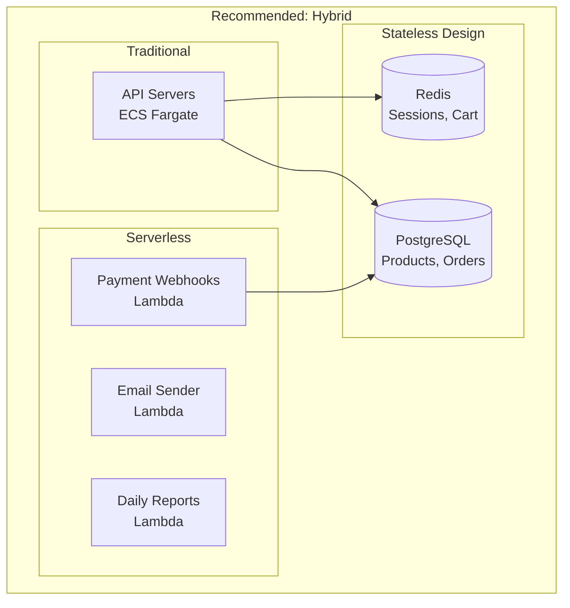

**Talking Points**:
- Core API: Traditional for consistent latency
- Webhooks: Serverless (event-driven, variable load)
- Background jobs: Serverless (pay per use)
- Stateless API servers with external state
- Can scale API horizontally

---

## Migration Strategies

### Monolith to Stateless Microservices

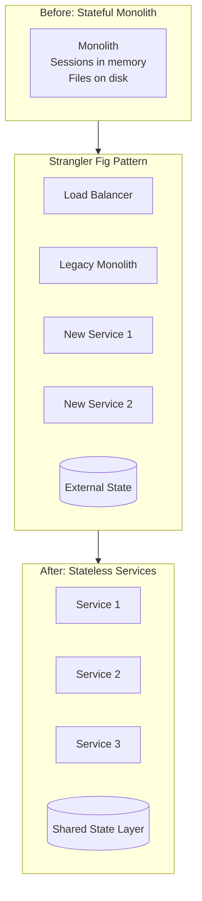

### Traditional to Serverless

```mermaid
flowchart LR
    subgraph Steps["Migration Steps"]
        S1["1. Identify stateless<br/>components"]
        S2["2. Extract to<br/>functions"]
        S3["3. Update triggers<br/>(API GW, events)"]
        S4["4. Migrate state<br/>to managed services"]
        S5["5. Decommission<br/>servers"]
    end
    
    S1 --> S2 --> S3 --> S4 --> S5
```

---

## Quick Reference Card

```
┌─────────────────────────────────────────────────────────────────┐
│              ARCHITECTURE PARADIGMS CHEAT SHEET                  │
├─────────────────────────────────────────────────────────────────┤
│ STATELESS DESIGN:                                               │
│   • No server-side session state                                │
│   • Any instance can handle any request                         │
│   • Externalize state: Redis, S3, DynamoDB                      │
│   • Benefits: Easy scaling, deployment, failure recovery        │
├─────────────────────────────────────────────────────────────────┤
│ STATEFUL DESIGN:                                                │
│   • Server maintains state between requests                     │
│   • Requires sticky sessions or session replication             │
│   • Use for: Gaming, real-time collaboration                    │
│   • Trade-off: Performance vs. operational complexity           │
├─────────────────────────────────────────────────────────────────┤
│ SERVERLESS:                                                     │
│   • Event-driven, pay-per-invocation                            │
│   • Auto-scaling, zero ops                                      │
│   • Watch for: Cold starts, execution limits, vendor lock-in    │
│   • Best for: Variable workloads, event processing              │
├─────────────────────────────────────────────────────────────────┤
│ TRADITIONAL:                                                    │
│   • Long-running servers, predictable costs                     │
│   • Full control, any runtime/language                          │
│   • More ops: Patching, scaling, monitoring                     │
│   • Best for: Steady traffic, low-latency, long processes       │
├─────────────────────────────────────────────────────────────────┤
│ DECISION HEURISTIC:                                             │
│   • Spiky traffic? → Serverless                                 │
│   • Long-running? → Traditional                                 │
│   • Real-time? → Traditional (often stateful)                   │
│   • Event-driven? → Serverless                                  │
│   • Need easy scaling? → Stateless                              │
│   • Performance-critical state? → Stateful (carefully)          │
└─────────────────────────────────────────────────────────────────┘
```

---

## Practice Questions

1. How would you migrate a monolithic application with in-memory sessions to a stateless microservices architecture?
2. Design a notification system. Would you use serverless or traditional architecture? Justify your choice.
3. Explain the trade-offs of using provisioned concurrency in AWS Lambda vs. running containers in ECS.
4. Your serverless function has cold starts of 3 seconds. How would you mitigate this?
5. Design a system that needs both real-time WebSocket communication and batch processing. How would you architect it?
