# 15 - Batch vs Stream Processing

## Overview

Data processing paradigms fall into two categories: batch processing (processing bounded datasets periodically) and stream processing (processing unbounded data continuously). Modern systems often combine both in Lambda or Kappa architectures. This document covers the patterns, technologies, and trade-offs for each approach.

---

## Core Mental Model

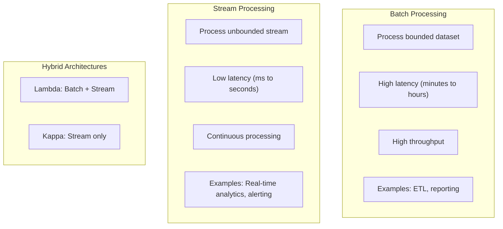

---

## Batch Processing

### Characteristics

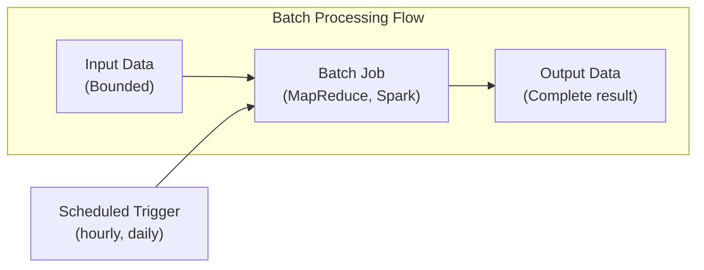

| Aspect | Description |
|--------|-------------|
| **Data** | Bounded, known size |
| **Latency** | Minutes to hours |
| **Throughput** | Very high |
| **Processing** | Complete dataset at once |
| **Fault tolerance** | Rerun entire job |
| **State** | Typically stateless |

### MapReduce Pattern

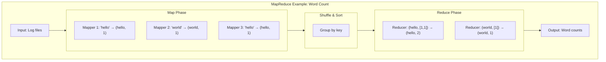

### Spark Example

```python
from pyspark.sql import SparkSession
from pyspark.sql.functions import col, sum, avg

spark = SparkSession.builder.appName("DailyAnalytics").getOrCreate()

# Read day's data
orders = spark.read.parquet("s3://data/orders/date=2024-01-15/")

# Aggregate
daily_stats = orders.groupBy("product_id").agg(
    sum("quantity").alias("total_sold"),
    avg("price").alias("avg_price"),
    sum("revenue").alias("total_revenue")
)

# Write results
daily_stats.write.mode("overwrite").parquet("s3://analytics/daily/date=2024-01-15/")
```

### Batch Use Cases

| Use Case | Description |
|----------|-------------|
| **ETL** | Extract, Transform, Load for data warehousing |
| **ML Training** | Train models on historical data |
| **Daily Reports** | Generate business reports |
| **Data Backfill** | Reprocess historical data |
| **Data Validation** | Verify data quality |

---

## Stream Processing

### Characteristics

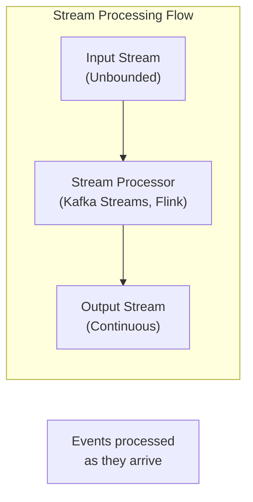

| Aspect | Description |
|--------|-------------|
| **Data** | Unbounded, continuous |
| **Latency** | Milliseconds to seconds |
| **Throughput** | Moderate (per-event overhead) |
| **Processing** | Event by event |
| **Fault tolerance** | Checkpointing, exactly-once |
| **State** | Often stateful (windows, aggregations) |

### Stream Processing Concepts

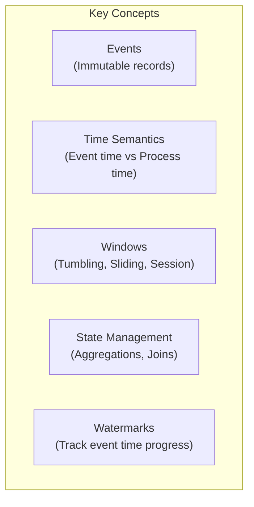

### Windowing Strategies

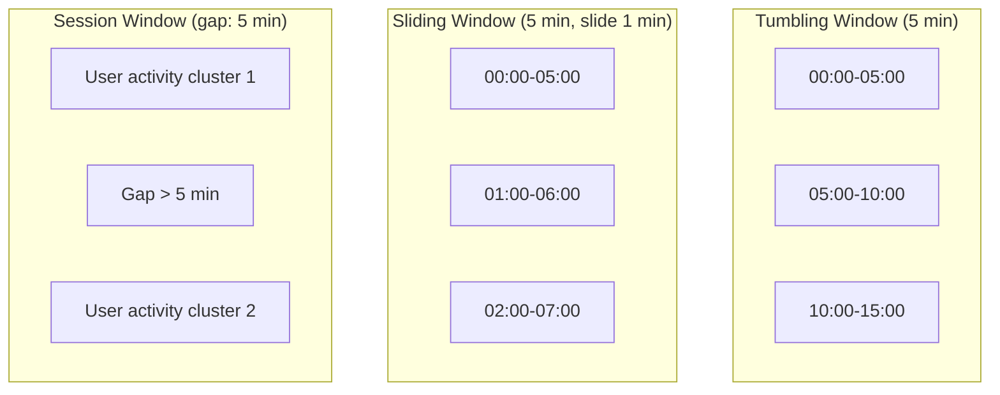

| Window Type | Description | Use Case |
|-------------|-------------|----------|
| **Tumbling** | Fixed, non-overlapping | Hourly aggregates |
| **Sliding** | Fixed, overlapping | Moving averages |
| **Session** | Dynamic, activity-based | User sessions |

### Event Time vs Processing Time

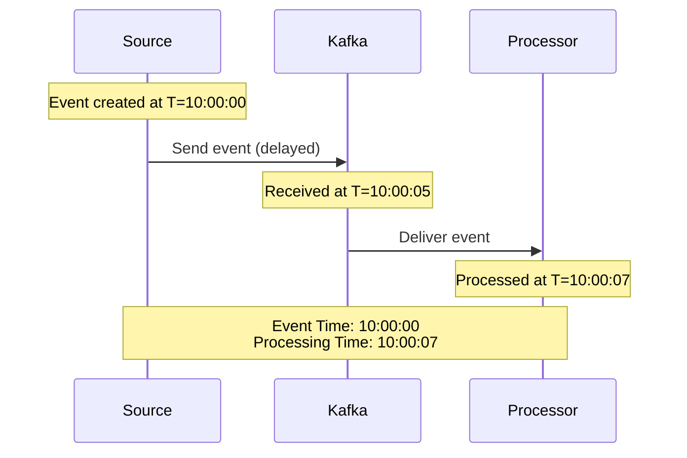

**Event Time**: When the event actually occurred (embedded in event)
**Processing Time**: When the system processes the event

**Why it matters**: Late-arriving events, out-of-order events

### Watermarks

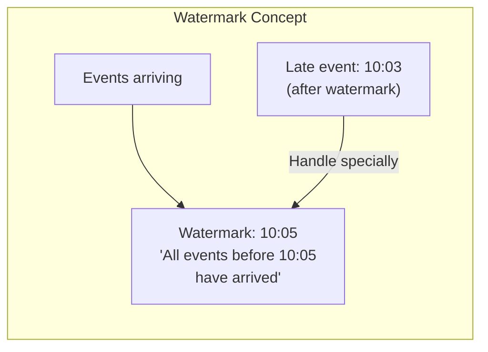

### Flink Example

```java
// Real-time click analytics
DataStream<Click> clicks = env
    .addSource(new FlinkKafkaConsumer<>("clicks", schema, props));

DataStream<ClickStats> stats = clicks
    // Use event time
    .assignTimestampsAndWatermarks(
        WatermarkStrategy.<Click>forBoundedOutOfOrderness(Duration.ofSeconds(5))
            .withTimestampAssigner((click, ts) -> click.getTimestamp())
    )
    // Group by page
    .keyBy(Click::getPageId)
    // 5-minute tumbling window
    .window(TumblingEventTimeWindows.of(Time.minutes(5)))
    // Aggregate
    .aggregate(new ClickCountAggregate());

stats.addSink(new FlinkKafkaProducer<>("click-stats", schema, props));
```

### Kafka Streams Example

```java
StreamsBuilder builder = new StreamsBuilder();

KStream<String, Order> orders = builder.stream("orders");

// Real-time revenue per product
KTable<Windowed<String>, Double> revenuePerProduct = orders
    .groupBy((key, order) -> order.getProductId())
    .windowedBy(TimeWindows.of(Duration.ofMinutes(5)))
    .aggregate(
        () -> 0.0,
        (key, order, total) -> total + order.getRevenue(),
        Materialized.with(Serdes.String(), Serdes.Double())
    );

revenuePerProduct.toStream()
    .to("revenue-by-product");
```

### Stream Use Cases

| Use Case | Description |
|----------|-------------|
| **Real-time analytics** | Live dashboards, monitoring |
| **Fraud detection** | Immediate anomaly detection |
| **Alerting** | Threshold-based notifications |
| **Event-driven apps** | Microservices communication |
| **IoT processing** | Sensor data analysis |

---

## Exactly-Once Semantics

### Delivery Guarantees

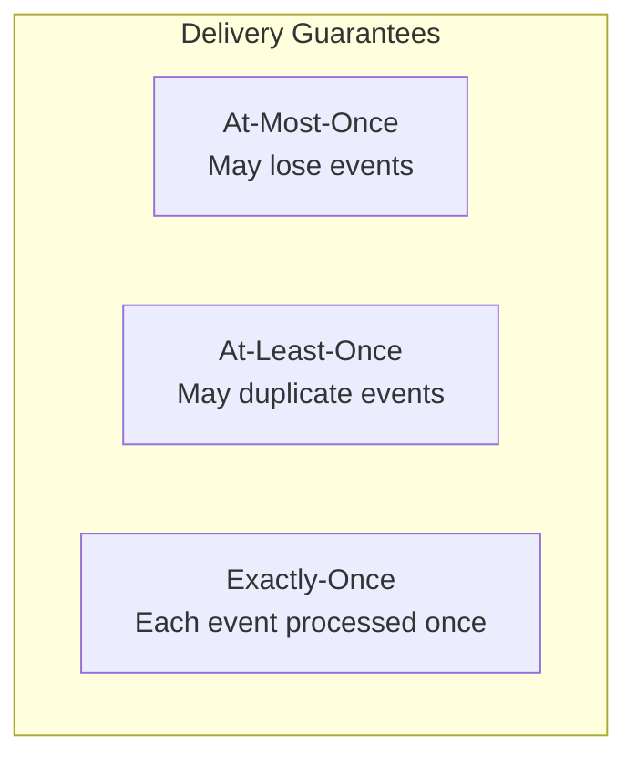

| Guarantee | Description | Trade-off |
|-----------|-------------|-----------|
| **At-most-once** | Fire and forget | Fast, may lose data |
| **At-least-once** | Retry on failure | Safe, may duplicate |
| **Exactly-once** | Transactional | Slow, complex |

### Achieving Exactly-Once

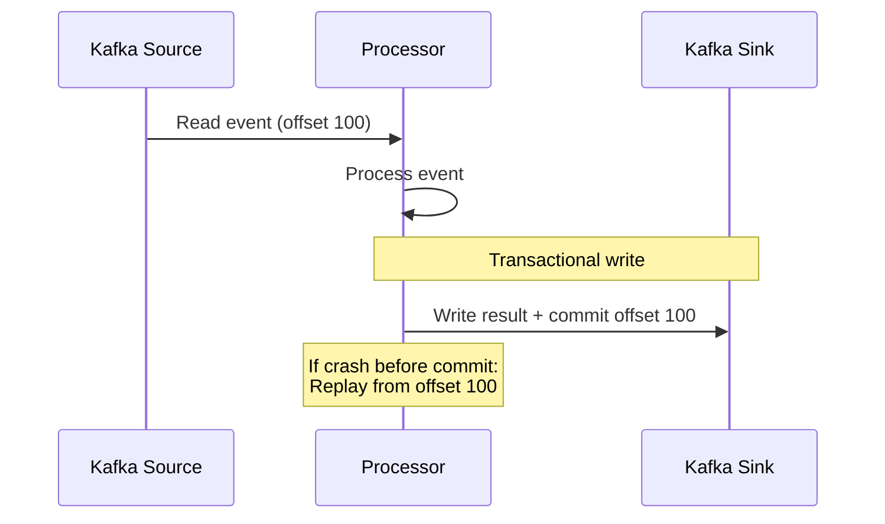

**Key techniques**:
1. **Idempotent operations**: Same input always produces same output
2. **Transactional commits**: Output + offset committed together
3. **Checkpointing**: Periodic state snapshots

---

## Lambda Architecture

### Pattern

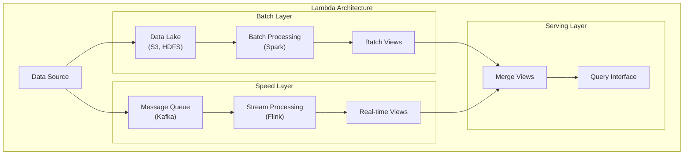

### Characteristics

| Aspect | Batch Layer | Speed Layer |
|--------|-------------|-------------|
| **Latency** | High (hours) | Low (seconds) |
| **Accuracy** | High (complete data) | Approximate |
| **Complexity** | Lower | Higher |
| **Data** | All historical | Recent only |

### Pros and Cons

| Pros | Cons |
|------|------|
| Best of both worlds | Code duplication (batch + stream) |
| Accurate historical data | Operational complexity |
| Low-latency real-time | Two systems to maintain |
| Fault tolerant | Debugging across layers |

---

## Kappa Architecture

### Pattern

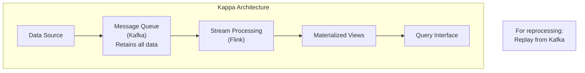

### Reprocessing in Kappa

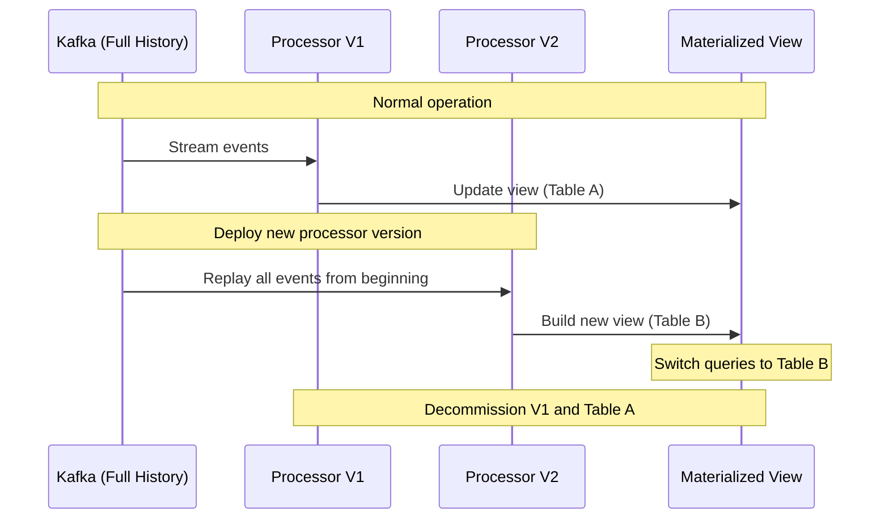

### Lambda vs Kappa

| Aspect | Lambda | Kappa |
|--------|--------|-------|
| **Complexity** | Two codebases | One codebase |
| **Reprocessing** | Batch job | Replay stream |
| **Storage** | Data lake + queue | Queue with retention |
| **Accuracy** | Batch is source of truth | Stream is source of truth |
| **Use case** | Complex historical queries | Event-driven systems |

---

## Choosing Batch vs Stream

### Decision Framework

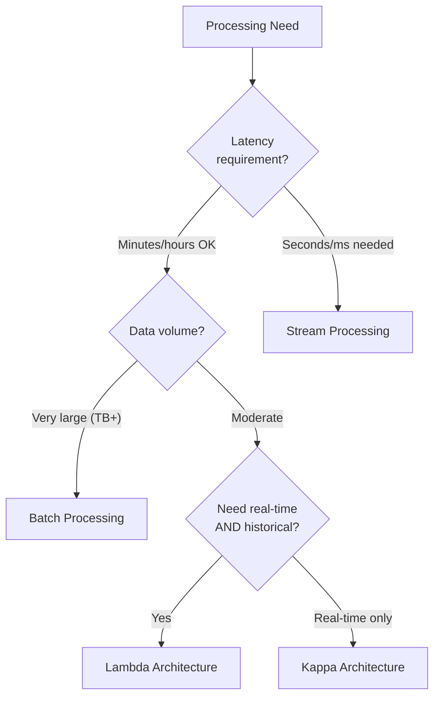

### Comparison

| Aspect | Batch | Stream |
|--------|-------|--------|
| **Latency** | Minutes to hours | Milliseconds to seconds |
| **Throughput** | Very high | Moderate |
| **Data completeness** | Always complete | May have late events |
| **Fault tolerance** | Rerun job | Checkpointing |
| **Complexity** | Lower | Higher (state, time) |
| **Cost efficiency** | Better for large volumes | Better for continuous |

---

## Technology Comparison

### Batch Technologies

| Technology | Description | Best For |
|------------|-------------|----------|
| **Apache Spark** | General-purpose, fast | ML, ETL, SQL |
| **Hadoop MapReduce** | Original big data | Legacy, very large scale |
| **AWS Glue** | Serverless ETL | AWS-native workloads |
| **dbt** | SQL-based transforms | Data warehouse transforms |

### Stream Technologies

| Technology | Description | Best For |
|------------|-------------|----------|
| **Apache Kafka Streams** | Library, Kafka-native | Simple streaming |
| **Apache Flink** | Stateful, exactly-once | Complex event processing |
| **Apache Spark Streaming** | Micro-batch | Spark ecosystem |
| **AWS Kinesis** | Managed streaming | AWS-native |

---

## Interview Scenarios

### Scenario 1: Real-Time Fraud Detection

**Requirements**: Detect fraudulent transactions within seconds

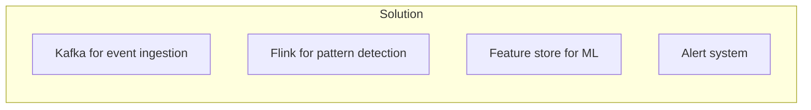

**Design**:
- Stream processing (Flink) for real-time
- Windowed aggregations (last 1 hour of user activity)
- ML model scoring per transaction
- Sub-second latency requirement

### Scenario 2: Daily Business Reports

**Requirements**: Generate reports from billions of events

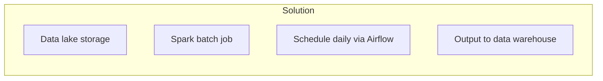

**Design**:
- Batch processing (Spark) - latency not critical
- Run overnight when resources cheap
- Full historical data available
- Accurate aggregations

### Scenario 3: Real-Time Dashboard + Historical Analytics

**Requirements**: Live metrics AND historical analysis

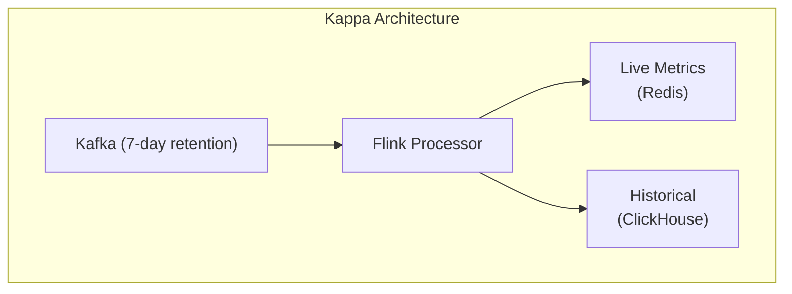

**Design**:
- Single stream processor
- Output to multiple sinks
- Replay from Kafka for reprocessing
- ClickHouse for historical queries

---

## Quick Reference

```
┌─────────────────────────────────────────────────────────────────┐
│             BATCH VS STREAM PROCESSING CHEAT SHEET              │
├─────────────────────────────────────────────────────────────────┤
│ BATCH PROCESSING:                                               │
│   • Bounded data, high latency (hours)                          │
│   • Very high throughput, cost efficient                        │
│   • Technologies: Spark, Hadoop, AWS Glue                       │
│   • Use for: ETL, reports, ML training, backfill                │
├─────────────────────────────────────────────────────────────────┤
│ STREAM PROCESSING:                                              │
│   • Unbounded data, low latency (seconds)                       │
│   • Event-by-event, stateful processing                         │
│   • Technologies: Flink, Kafka Streams, Kinesis                 │
│   • Use for: Real-time analytics, alerting, fraud detection     │
├─────────────────────────────────────────────────────────────────┤
│ KEY CONCEPTS:                                                   │
│   • Event Time vs Processing Time                               │
│   • Watermarks (track late events)                              │
│   • Windows (tumbling, sliding, session)                        │
│   • Exactly-once semantics                                      │
├─────────────────────────────────────────────────────────────────┤
│ ARCHITECTURES:                                                  │
│   • Lambda: Batch + Stream (accuracy + speed)                   │
│   • Kappa: Stream only (simpler, replay for reprocess)          │
├─────────────────────────────────────────────────────────────────┤
│ DECISION:                                                       │
│   • Latency critical? → Stream                                  │
│   • Massive historical data? → Batch                            │
│   • Need both? → Lambda or Kappa                                │
└─────────────────────────────────────────────────────────────────┘
```

---

## Practice Questions

1. Design a system to detect credit card fraud in real-time. What processing paradigm would you use?
2. How would you handle late-arriving events in a stream processing system?
3. Compare Lambda and Kappa architectures. When would you choose each?
4. Design a real-time leaderboard for an online game with millions of players.
5. How would you reprocess historical data when your stream processing logic changes?
