# 04 — Caching & CDN

> The most effective way to improve performance is to avoid doing work—caching stores the results of expensive operations for reuse.

**Prerequisites:** [01 — Foundational Concepts](./01-FOUNDATIONAL-CONCEPTS.md), [03 — Data Management](./03-DATA-MANAGEMENT.md)  
**Builds toward:** [07 — Load Balancing & Scaling](./07-LOAD-BALANCING-SCALING.md)  
**Estimated study time:** 2-3 hours

---

## Chapter Overview

This module covers caching strategies, invalidation patterns, CDN architecture, and probabilistic data structures for membership testing.

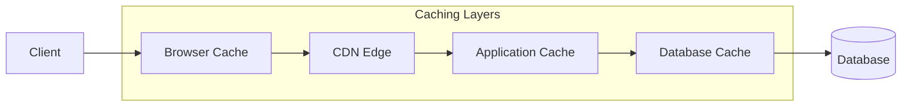

---

## 1. Why Caching?

### The Latency Hierarchy

| Storage Layer | Latency | Relative Speed |
|---------------|---------|----------------|
| L1 Cache | 0.5 ns | 1x |
| L2 Cache | 7 ns | 14x slower |
| RAM | 100 ns | 200x slower |
| SSD | 150 μs | 300,000x slower |
| HDD | 10 ms | 20,000,000x slower |
| Network (datacenter) | 500 μs | 1,000,000x slower |
| Network (cross-region) | 150 ms | 300,000,000x slower |

**Key insight:** Each layer of the memory hierarchy is ~10-100x slower than the previous. Caching moves data closer to computation.

### Caching Benefits

| Benefit | Mechanism |
|---------|-----------|
| **Reduced latency** | Serve from faster storage |
| **Reduced load** | Fewer requests to origin |
| **Increased throughput** | Origin handles less |
| **Cost savings** | Fewer database/API calls |
| **Improved availability** | Serve cached data during origin failure |

---

## 2. Caching Strategies

### Where to Cache

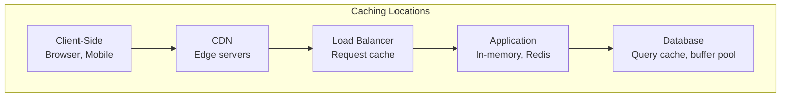

### Cache-Aside (Lazy Loading)

Application manages cache explicitly. Most common pattern.

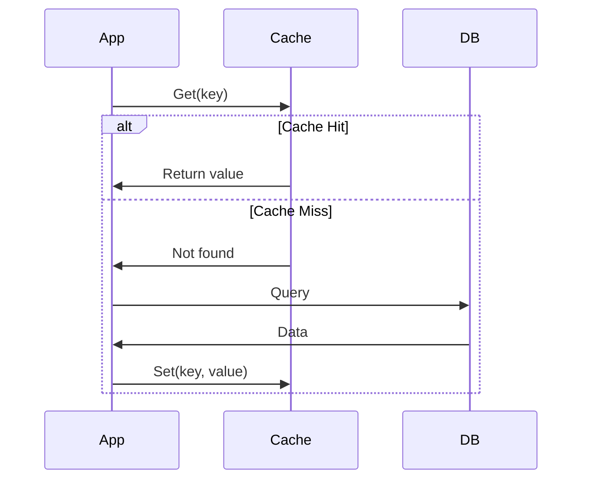

**Pros:** Only caches what's needed, cache failure doesn't break system  
**Cons:** Cache miss penalty (3 round trips), potential for stale data

**Code pattern:**
```python
data = cache.get(key)
if data is None:
    data = db.query(key)
    cache.set(key, data, ttl=300)
return data
```

### Read-Through

Cache sits between app and database, handles misses automatically.

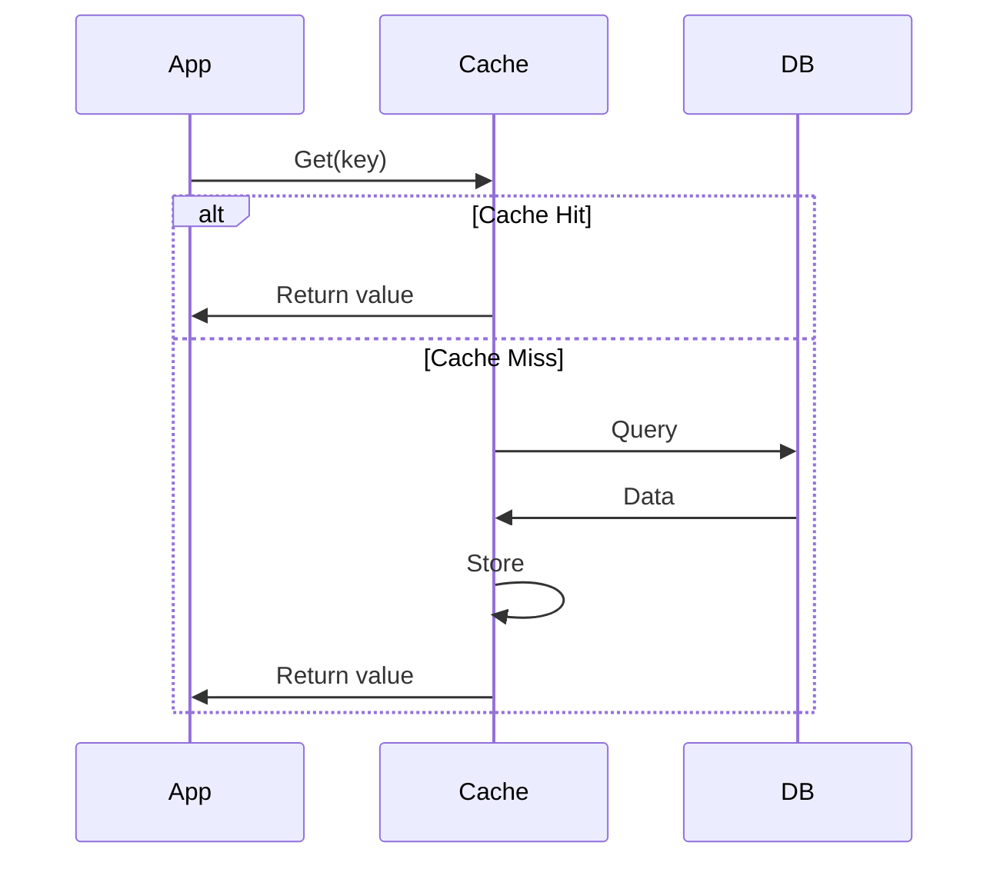

**Pros:** Simpler application code  
**Cons:** Cache library must understand data source

### Write-Through

Every write goes through cache to database synchronously.

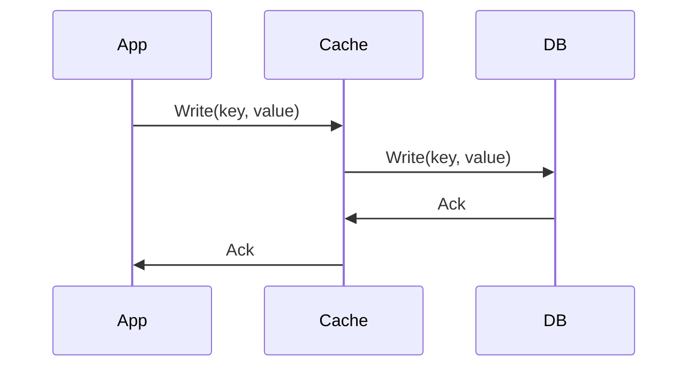

**Pros:** Cache always consistent with DB  
**Cons:** Higher write latency (two writes), may cache unread data

### Write-Behind (Write-Back)

Write to cache immediately, async write to database.

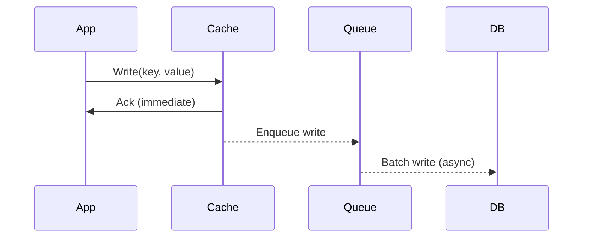

**Pros:** Very fast writes, batching reduces DB load  
**Cons:** Risk of data loss if cache fails before DB write

### Write-Around

Write directly to database, invalidate or skip cache.

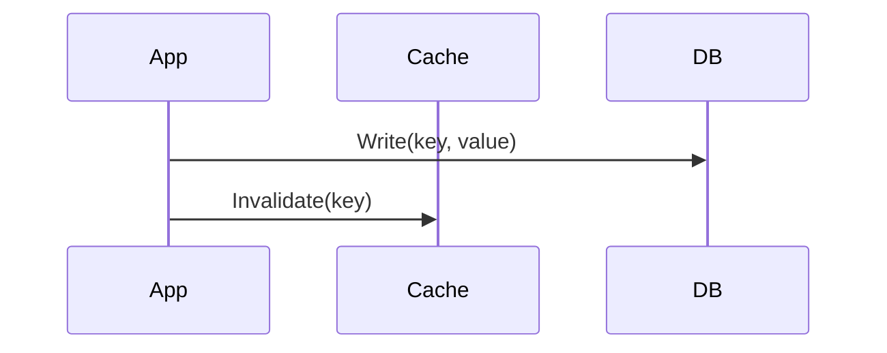

**Pros:** Doesn't pollute cache with write-heavy data  
**Cons:** Subsequent read will miss (cold cache after write)

### Strategy Comparison Table

| Strategy | Read Perf | Write Perf | Consistency | Data Loss Risk | Complexity |
|----------|-----------|------------|-------------|----------------|------------|
| **Cache-Aside** | Good (warm) | N/A | App-managed | Low | Low |
| **Read-Through** | Good | N/A | Good | Low | Medium |
| **Write-Through** | Good | Slow | Strong | Low | Medium |
| **Write-Behind** | Good | Fast | Eventual | Higher | High |
| **Write-Around** | Miss after write | Fast | Strong | Low | Low |

### Strategy Selection Framework

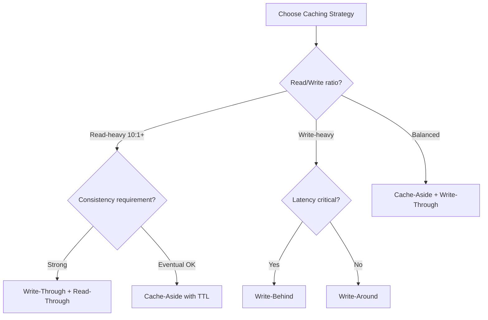

---

## 3. Cache Invalidation

### The Fundamental Challenge

> "There are only two hard things in Computer Science: cache invalidation and naming things." — Phil Karlton

Stale data in cache creates consistency problems. Three main approaches:

### TTL-Based Expiration

Data automatically expires after a set duration.

```python
cache.set("user:123", user_data, ttl=3600)  # Expires in 1 hour
```

| TTL Length | Pros | Cons |
|------------|------|------|
| Short (seconds) | Fresh data | High origin load |
| Medium (minutes) | Balanced | Some staleness |
| Long (hours/days) | Low origin load | Stale data risk |

**Guideline:** Set TTL based on how often data changes and how much staleness is acceptable.

### Event-Based Invalidation

Invalidate cache when data changes.

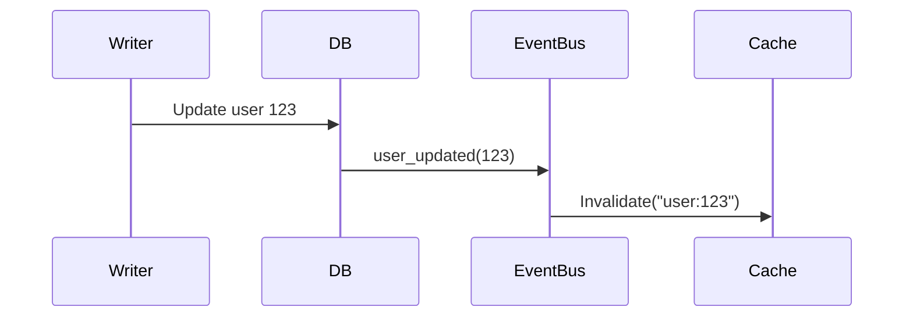

**Pros:** Immediate consistency  
**Cons:** Requires event infrastructure, ordering challenges

### Version-Based Keys

Include version or timestamp in cache key.

```python
# Instead of: cache.get("user:123")
# Use: cache.get("user:123:v42") or cache.get("user:123:1705123456")
```

**Pros:** No explicit invalidation needed  
**Cons:** Key management complexity, orphaned cache entries

### Invalidation Patterns

| Pattern | When to Use | Implementation |
|---------|-------------|----------------|
| **Delete on write** | Strong consistency needed | Writer deletes cache key |
| **Refresh on write** | Read-after-write common | Writer updates cache |
| **TTL + lazy refresh** | Staleness acceptable | Background refresh before expiry |
| **Pub/sub invalidation** | Distributed caches | Broadcast invalidation events |

---

## 4. Cache Coherence in Distributed Systems

### The Multi-Cache Problem

With multiple cache instances, how do we keep them synchronized?

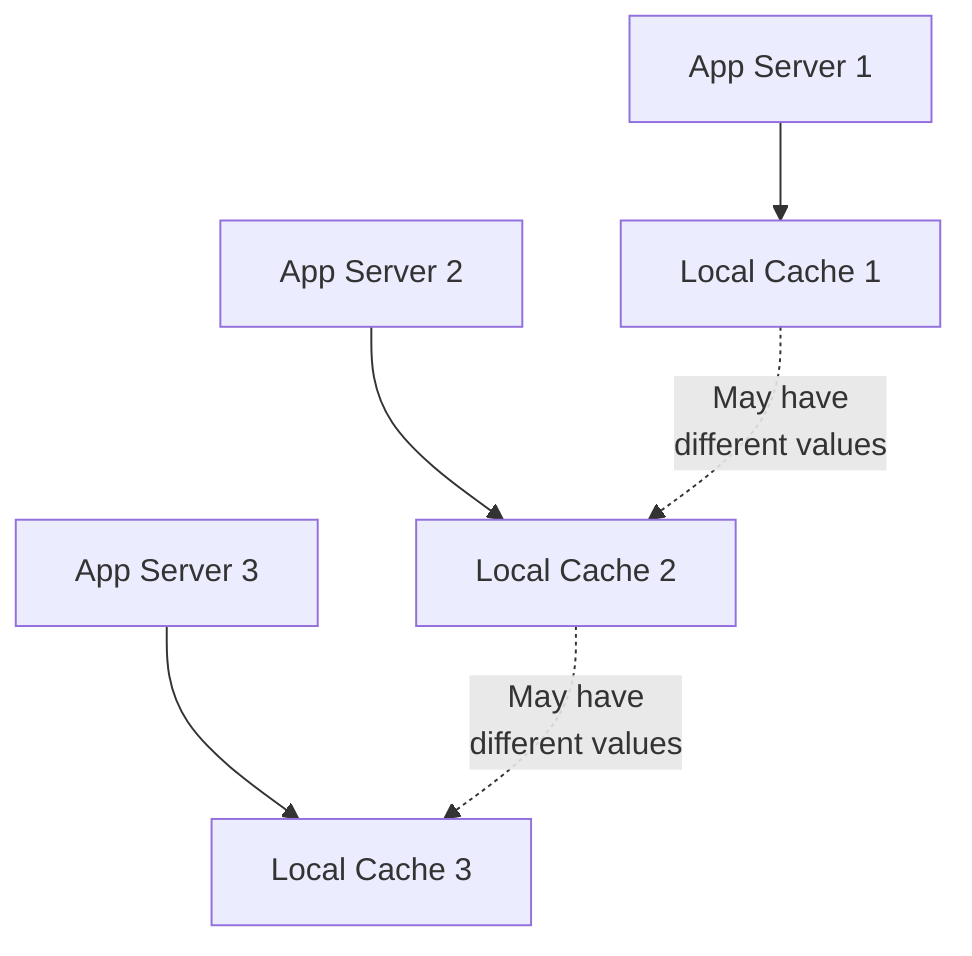

### Solution 1: Centralized Cache

Use a shared cache (Redis, Memcached) instead of local caches.

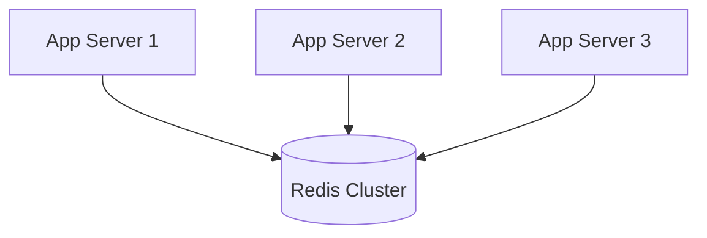

**Trade-off:** Network hop for every access, but consistency is simple.

### Solution 2: Write-Invalidate Protocol

On write, broadcast invalidation to all caches.

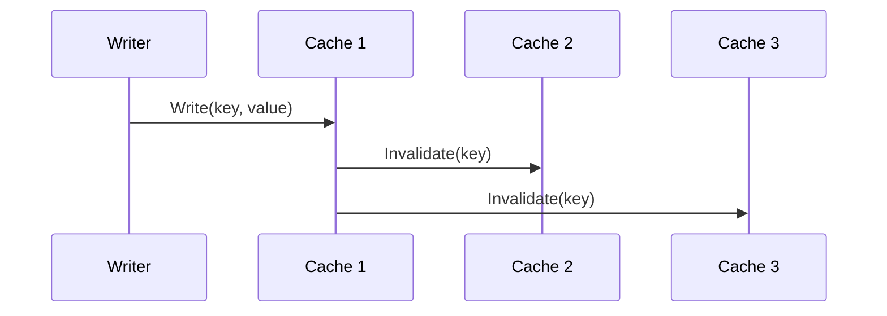

### Solution 3: Write-Update Protocol

On write, broadcast new value to all caches.

**Pros:** No miss penalty after write  
**Cons:** High bandwidth, wasted if value rarely read elsewhere

### Practical Recommendation

For most systems: **Use centralized cache (Redis) + local L1 cache with very short TTL**

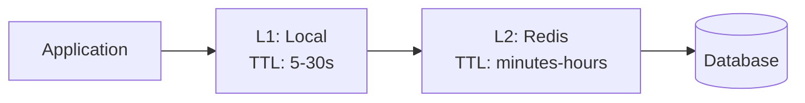

---

## 5. Content Delivery Networks (CDN)

### What Is a CDN?

A geographically distributed network of edge servers that cache content close to users.

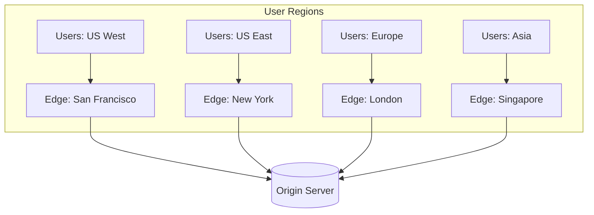

### CDN Benefits

| Benefit | Mechanism |
|---------|-----------|
| **Lower latency** | Content served from nearby edge |
| **Reduced origin load** | Edges absorb majority of traffic |
| **DDoS protection** | Distributed network absorbs attacks |
| **High availability** | Redundant edges, automatic failover |
| **SSL offloading** | Edges handle TLS termination |

### CDN Request Flow

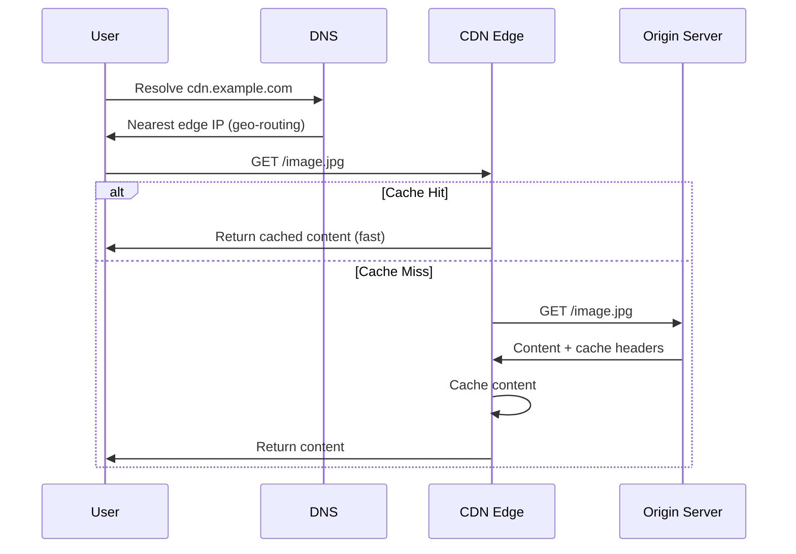

### Push vs Pull CDN

| Aspect | Pull CDN | Push CDN |
|--------|----------|----------|
| **Content upload** | Edge fetches on first request | Origin pushes proactively |
| **Cache warming** | First request is slow (miss) | Pre-warmed, fast from start |
| **Storage** | Only caches requested content | May cache unused content |
| **Control** | Less control over what's cached | Full control |
| **Best for** | Unpredictable access patterns | Known high-value content |

#### Pull CDN Flow

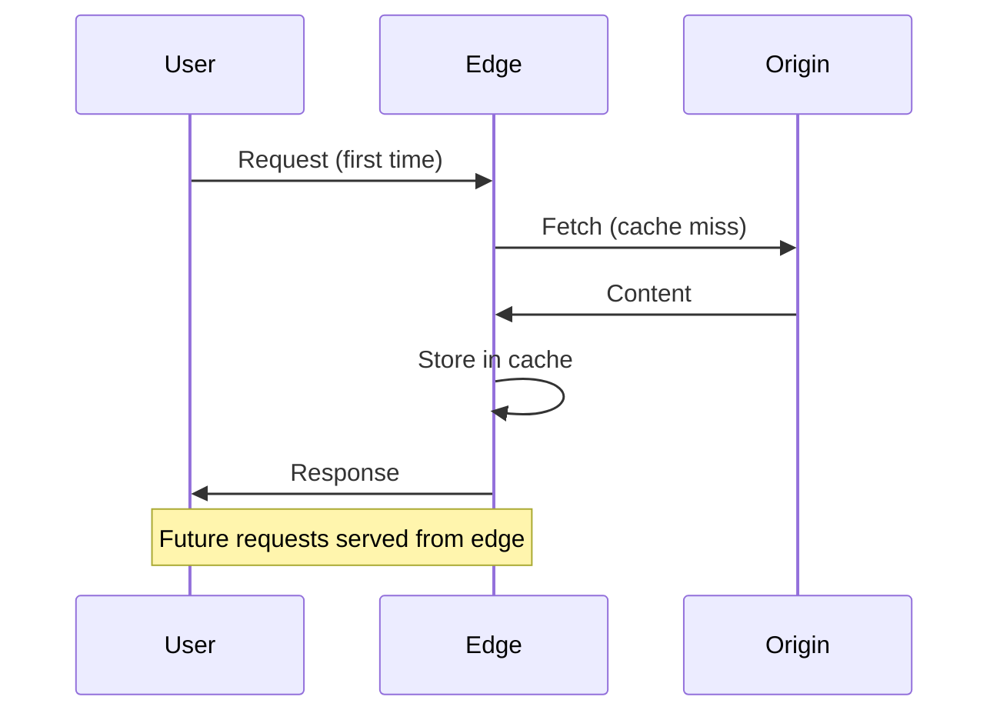

#### Push CDN Flow

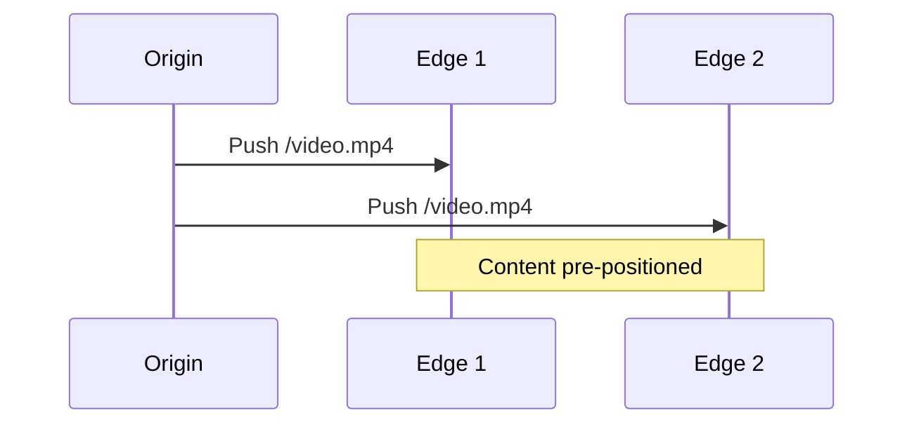

### CDN Routing Strategies

| Strategy | How It Works | Best For |
|----------|--------------|----------|
| **GeoDNS** | Return nearest edge IP based on user location | General use |
| **Anycast** | Same IP, network routes to nearest | Very low latency |
| **Latency-based** | Measure and route to fastest edge | Performance-critical |
| **Load-based** | Route to least loaded edge | Even distribution |

### What to Cache on CDN

| Content Type | Cache Strategy | TTL |
|--------------|----------------|-----|
| Static assets (JS, CSS, images) | Aggressive | Long (days-years) with versioning |
| API responses (public) | Selective | Short (seconds-minutes) |
| HTML pages | Careful | Varies, consider ESI |
| Personalized content | Don't cache | N/A |
| Video/media | Aggressive | Long, segment-based |

---

## 6. Bloom Filters

### The Problem

How do you check if an item is in a very large set without storing the entire set in memory?

**Example scenarios:**
- "Has this user seen this ad?" (billions of user-ad pairs)
- "Is this URL in our blocklist?" (millions of URLs)
- "Does this key exist in the database?" (avoid expensive disk lookup)

### What Is a Bloom Filter?

A **space-efficient probabilistic data structure** for set membership testing.

**Key properties:**
- **No false negatives:** If it says "not in set," it's definitely not
- **Possible false positives:** If it says "maybe in set," it might not be
- **Cannot enumerate:** Can't list what's in the set
- **Cannot delete:** Standard version (Counting Bloom Filters can)
- **Fixed size:** Doesn't grow with number of items

### How It Works

**Structure:** Bit array of size m, initialized to all 0s, with k hash functions

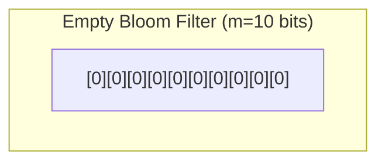

**Adding an item:**

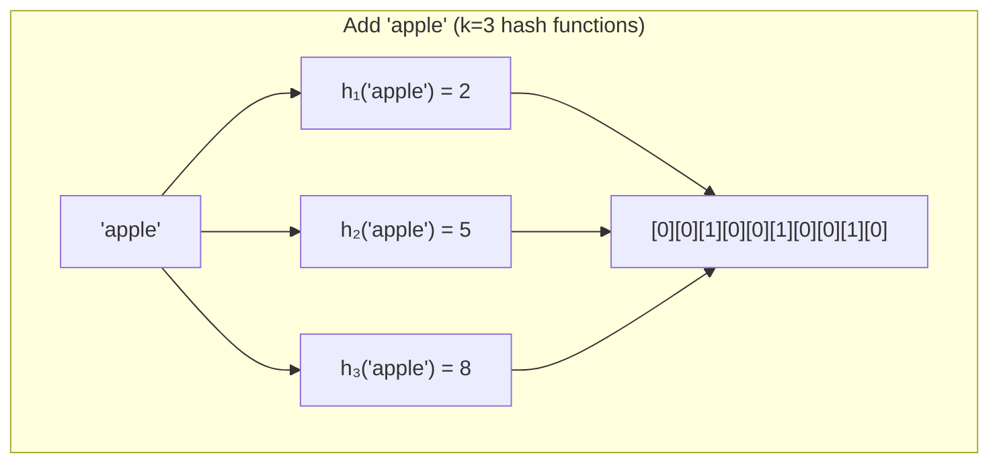

**Checking membership:**

1. Hash item with same k functions
2. Check all k bit positions
3. If ALL bits are 1 → "possibly in set"
4. If ANY bit is 0 → "definitely NOT in set"

### Why False Positives Happen

When many items are added, bits get set by multiple items. A new item might happen to hash to positions already set by other items.

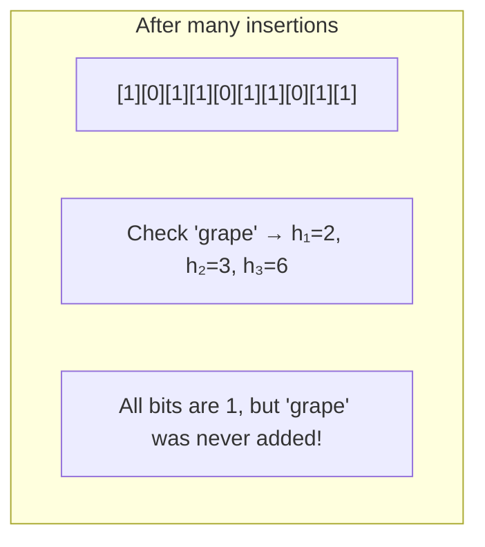

### False Positive Rate

```
P(false positive) ≈ (1 - e^(-kn/m))^k
```

**Practical guidelines:**

| Bits per item (m/n) | False Positive Rate |
|---------------------|---------------------|
| 8 | ~2% |
| 10 | ~1% |
| 15 | ~0.1% |
| 20 | ~0.01% |

**Optimal k:** For a given m and n, optimal k ≈ (m/n) × ln(2) ≈ 0.7 × (m/n)

### Bloom Filter Use Cases

| Application | How It Helps |
|-------------|--------------|
| **Database queries** | Skip disk read if key definitely doesn't exist |
| **Web crawlers** | Avoid re-crawling visited URLs |
| **Spell checkers** | Fast dictionary lookup |
| **CDN/Cache** | Check if content cached before fetching |
| **Network routers** | Packet classification |
| **Duplicate detection** | Detect seen items in streams |

### Bloom Filter in System Design

```mermaid
sequenceDiagram
    participant App
    participant BF as Bloom Filter
    participant Cache
    participant DB
    
    App->>BF: Contains(key)?
    alt Definitely Not
        BF->>App: No (guaranteed)
        Note over App: Skip DB lookup entirely
    else Maybe Yes
        BF->>App: Maybe
        App->>Cache: Get(key)
        alt Cache Hit
            Cache->>App: Value
        else Cache Miss
            App->>DB: Query(key)
            DB->>App: Value or Not Found
        end
    end
```

### Counting Bloom Filters

Variant that supports deletion by using counters instead of single bits.

| Aspect | Standard Bloom | Counting Bloom |
|--------|----------------|----------------|
| Storage | 1 bit per position | 3-4 bits per position |
| Deletion | Not supported | Supported |
| Overflow | N/A | Counter can overflow |

---

## 7. Cache Eviction Policies

When cache is full, which item to remove?

### Common Eviction Policies

| Policy | Rule | Pros | Cons |
|--------|------|------|------|
| **LRU** | Remove least recently used | Good for temporal locality | Memory overhead (tracking) |
| **LFU** | Remove least frequently used | Good for frequency patterns | Doesn't adapt to changes |
| **FIFO** | Remove oldest added | Simple, predictable | Ignores access patterns |
| **Random** | Remove random item | Simple, no overhead | May evict hot items |
| **TTL** | Remove expired items | Time-based freshness | Requires time tracking |

### LRU (Least Recently Used)

Most common policy. Based on assumption: recently accessed items likely to be accessed again.

```mermaid
graph LR
    subgraph "LRU Cache (capacity=4)"
        Head[Most Recent]
        A[A]
        B[B]
        C[C]
        D[D]
        Tail[Least Recent]
        
        Head --> A --> B --> C --> D --> Tail
    end
```

**Operations:**
- Access B → Move B to head
- Add E (full) → Evict D (tail), add E at head

**Implementation:** HashMap + Doubly Linked List = O(1) for get/put

### LFU (Least Frequently Used)

Remove items with lowest access count.

**Challenge:** New items have low count, may be evicted before proving value  
**Solution:** LFU with aging (decay counts over time)

### Choosing Eviction Policy

```mermaid
flowchart TD
    A[Choose Eviction Policy] --> B{Access pattern?}
    
    B -->|Temporal locality| C[LRU]
    B -->|Frequency matters| D[LFU]
    B -->|Time-sensitive data| E[TTL-based]
    B -->|Unknown/simple| F[LRU or Random]
    
    C --> G{Memory constrained?}
    G -->|Yes| H[Approximate LRU<br/>Sampling-based]
    G -->|No| I[Full LRU]
```

---

## 8. Caching Anti-Patterns

### Thundering Herd

When cache expires, many requests simultaneously hit origin.

```mermaid
sequenceDiagram
    participant C1 as Client 1
    participant C2 as Client 2
    participant C3 as Client 3
    participant Cache
    participant DB
    
    Note over Cache: Key expires
    C1->>Cache: Get (miss)
    C2->>Cache: Get (miss)
    C3->>Cache: Get (miss)
    C1->>DB: Query
    C2->>DB: Query
    C3->>DB: Query
    Note over DB: Overloaded!
```

**Solutions:**
- **Locking:** First request locks, others wait
- **Probabilistic early expiry:** Refresh before actual expiry
- **Background refresh:** Async refresh before expiry

### Cache Stampede Prevention

```python
def get_with_lock(key):
    value = cache.get(key)
    if value is not None:
        return value
    
    # Try to acquire lock
    if cache.add(f"lock:{key}", 1, ttl=10):
        # Won the lock, fetch from DB
        value = db.query(key)
        cache.set(key, value, ttl=300)
        cache.delete(f"lock:{key}")
        return value
    else:
        # Lost the lock, wait and retry
        time.sleep(0.1)
        return get_with_lock(key)
```

### Hot Key Problem

Single cache key receives disproportionate traffic.

**Solutions:**
- **Replicate hot keys** across multiple cache nodes
- **Local caching** for hot keys
- **Key spreading** (append random suffix, aggregate on read)

---

## 9. Chapter Summary

### Key Concepts

| Concept | One-Line Definition |
|---------|---------------------|
| Cache-Aside | App manages cache; load on miss, store after fetch |
| Write-Through | Sync write to cache and DB together |
| Write-Behind | Async write to DB after caching |
| CDN | Geographically distributed edge cache |
| Bloom Filter | Probabilistic "definitely not" or "maybe yes" structure |
| LRU | Evict least recently accessed item |

### Caching Decision Checklist

```
1. WHAT to cache?
   → Expensive to compute, frequently accessed, tolerates staleness

2. WHERE to cache?
   → As close to consumer as possible (browser > CDN > app > DB)

3. HOW LONG to cache?
   → Balance freshness requirement vs cache hit rate

4. HOW to invalidate?
   → TTL for simplicity, events for consistency

5. WHAT to evict?
   → LRU for most workloads
```

### Interview Articulation Patterns

> "Why use a CDN?"

"CDN reduces latency by serving content from geographically closer edge servers, offloads origin traffic, and provides DDoS protection. The trade-off is cache invalidation complexity and cost."

> "How would you prevent cache stampede?"

"I'd use probabilistic early refresh—regenerate cache entries slightly before expiry using a background process. Alternatively, implement locking so only one request fetches from origin while others wait."

> "When would you use a Bloom Filter?"

"When I need fast membership testing on a large set and can tolerate false positives. Classic example: checking if a key exists in a database before doing an expensive disk lookup."

---

## Navigation

**Previous:** [03 — Data Management](./03-DATA-MANAGEMENT.md)  
**Next:** [05 — Distributed Patterns](./05-DISTRIBUTED-PATTERNS.md)  
**Index:** [00 — Handbook Index](./00-INDEX.md)
