# 04 - Caching Strategies

## Read-Through, Write-Through, and Caching Patterns

---

## Concept Overview

**What is Caching?**

Caching is storing frequently accessed data in a fast-access layer to reduce latency and backend load. The cache sits between the requester and the source of truth, serving data faster than fetching from the primary storage.

**Why Caching Matters**

- **Latency**: Reading from cache (microseconds) vs database (milliseconds)
- **Throughput**: Reduces load on primary storage
- **Cost**: Fewer expensive database operations
- **Availability**: Can serve data even if backend is slow/down

**The Core Trade-Off**

```
┌────────────────────────────────────────────────────────────────────────┐
│                                                                        │
│         DATA FRESHNESS                    vs         PERFORMANCE       │
│                                                                        │
│    "How up-to-date is the data?"              "How fast is access?"    │
│                                                                        │
│    ✓ Always current                           ✓ Sub-millisecond reads  │
│    ✓ No stale data                            ✓ Lower backend load     │
│    ✗ Higher latency                           ✗ May serve stale data   │
│    ✗ More backend load                        ✗ Invalidation complexity│
│                                                                        │
└────────────────────────────────────────────────────────────────────────┘
```

---

## Mental Models

### The Library Analogy

Think of caching like a personal bookshelf vs. a library:
- **No cache**: Walk to the library every time you need a book
- **Cache**: Keep frequently-read books on your personal shelf
- **Cache invalidation**: Replace shelf books when new editions come out

### The Two Hard Problems

> "There are only two hard things in Computer Science: cache invalidation and naming things."
> — Phil Karlton

The challenge isn't caching—it's knowing *when* the cached data is no longer valid.

---

## Technical Deep-Dive

### Caching Strategies Overview

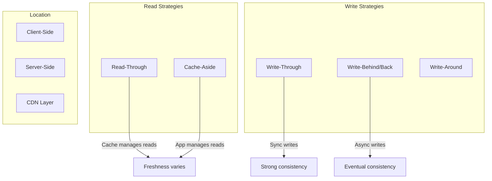

---

## Read-Through Cache

**Definition**: The cache automatically loads data from the primary storage on a cache miss. The application only talks to the cache.

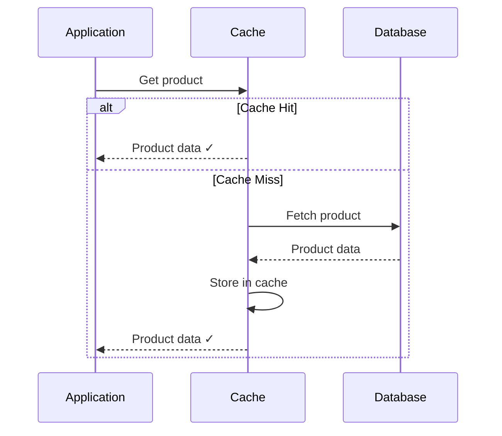

**Characteristics**:

| Aspect | Description |
|--------|-------------|
| **Read path** | App → Cache → (on miss) → DB |
| **Who loads?** | Cache automatically |
| **Transparency** | App unaware of misses |
| **Consistency** | Data may be stale until TTL expires |

**Pros**:
- Simplified application logic (only talks to cache)
- Transparent cache population
- Reduces load on primary storage for repeated reads

**Cons**:
- First request (cold cache) incurs full latency
- Cache must understand how to query the database
- Stale data until expiration or invalidation

**Use Cases**:
- Product catalogs
- User profiles
- Reference data
- Session data

---

## Cache-Aside (Lazy Loading)

**Definition**: The application manages both cache and database. On miss, app fetches from DB and populates cache.

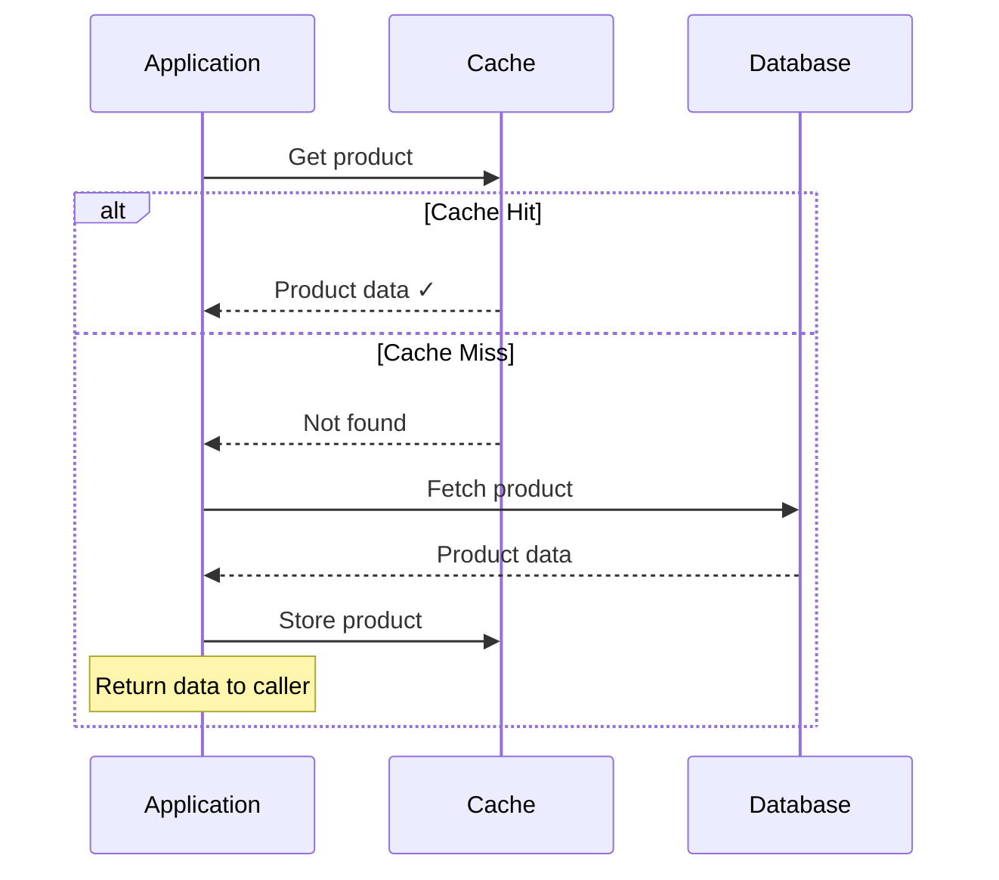

**Characteristics**:

| Aspect | Description |
|--------|-------------|
| **Read path** | App → Cache; App → DB (on miss) |
| **Who loads?** | Application |
| **Control** | Full control over caching logic |
| **Consistency** | App manages invalidation |

**Pros**:
- Application has full control over caching logic
- Only requested data is cached (no wasted space)
- Cache can be down without losing functionality

**Cons**:
- More complex application code
- Cache miss penalty on first access
- Risk of inconsistency if write-through not used

**Use Cases**:
- General-purpose caching
- When caching logic is complex
- When cache availability is not critical

---

## Write-Through Cache

**Definition**: Data is written to cache AND primary storage synchronously. Write succeeds only when both complete.

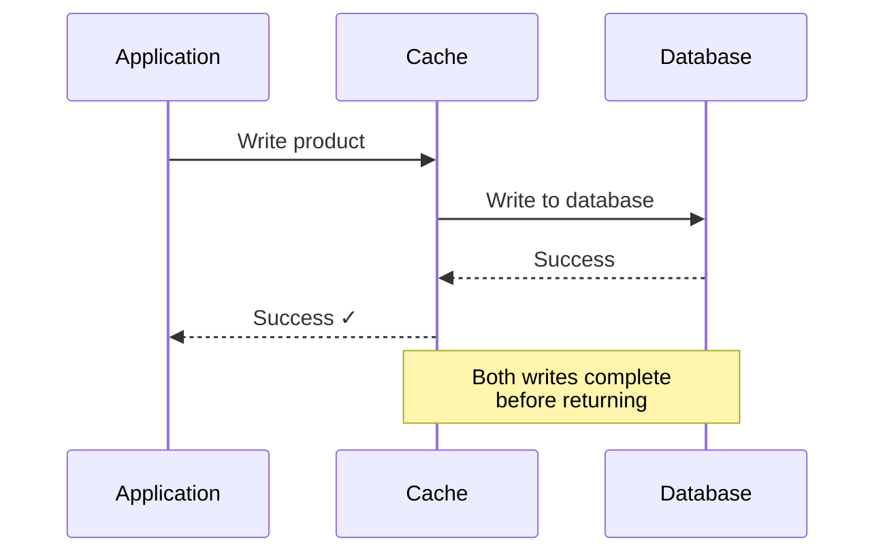

**Characteristics**:

| Aspect | Description |
|--------|-------------|
| **Write path** | App → Cache → DB (synchronous) |
| **Consistency** | Strong (cache always current) |
| **Write latency** | Higher (two writes) |
| **Data safety** | High (persisted immediately) |

**Pros**:
- Cache always has latest data (strong consistency)
- No data loss on cache failure (data in DB)
- Subsequent reads are fast and accurate

**Cons**:
- Higher write latency (must wait for both)
- Every write hits primary storage
- May cache data that's never read

**Use Cases**:
- Banking and financial transactions
- Systems requiring strong consistency
- When data integrity is critical

---

## Write-Behind (Write-Back) Cache

**Definition**: Data is written to cache immediately; writes to primary storage happen asynchronously in background.

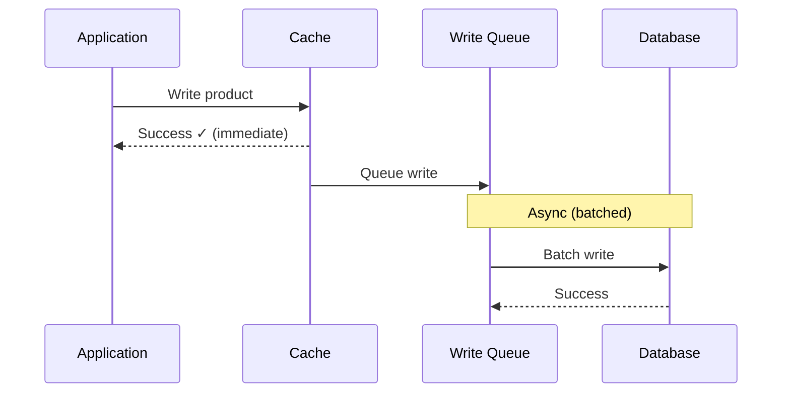

**Characteristics**:

| Aspect | Description |
|--------|-------------|
| **Write path** | App → Cache → (async) → DB |
| **Consistency** | Eventual |
| **Write latency** | Low (cache only) |
| **Data safety** | Risk of data loss if cache fails |

**Pros**:
- Very low write latency
- Writes can be batched for efficiency
- Reduced load on primary storage

**Cons**:
- Risk of data loss if cache fails before flush
- Eventual consistency only
- Complex failure handling

**Use Cases**:
- High-volume write systems
- Analytics and logging
- When write speed is critical
- Session updates

---

## Write-Around Cache

**Definition**: Writes go directly to primary storage, bypassing cache. Cache only populated on reads.

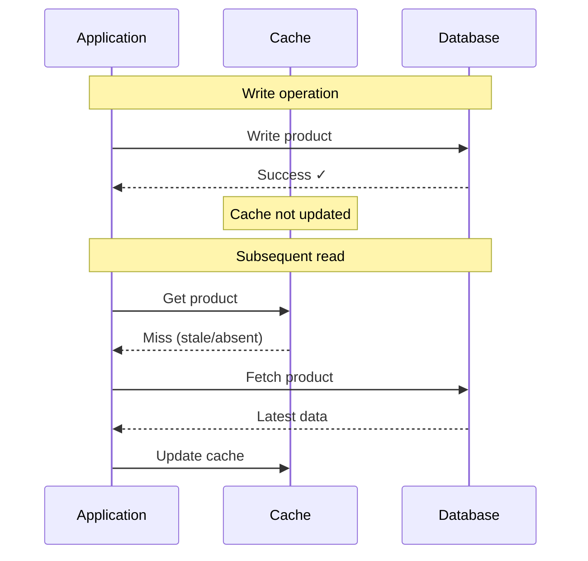

**Characteristics**:

| Aspect | Description |
|--------|-------------|
| **Write path** | App → DB (cache bypassed) |
| **Read path** | Cache-aside pattern |
| **Consistency** | Cache may be stale |
| **Use when** | Write-once, read-many data |

**Pros**:
- Avoids caching write-heavy, rarely-read data
- Cache not polluted with infrequently accessed data
- Reduced write overhead

**Cons**:
- Cache may have stale data
- Read-after-write sees stale data
- Higher read latency after writes

**Use Cases**:
- Data that's written once, rarely read
- Bulk data imports
- Archival data

---

## Server-Side vs Client-Side Caching

### Server-Side Caching

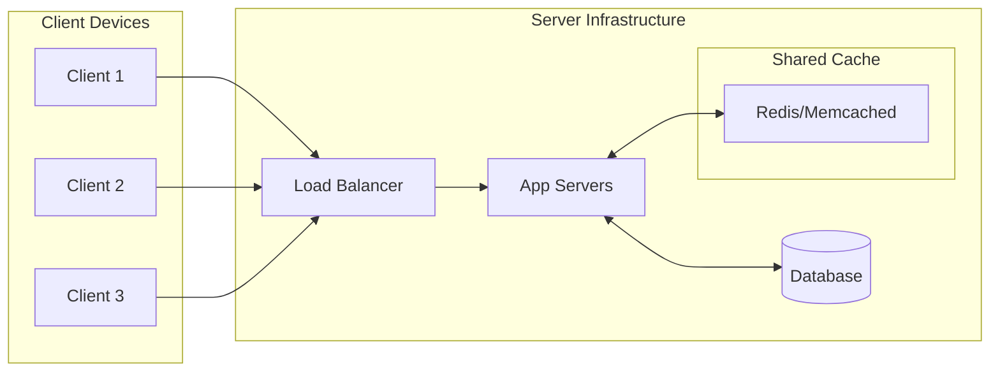

**Characteristics**:

| Aspect | Server-Side |
|--------|------------|
| **Location** | Server infrastructure |
| **Scope** | Shared across all users |
| **Control** | Full server control |
| **Types** | DB query cache, page cache, object cache |
| **Examples** | Redis, Memcached, Varnish |

**Pros**:
- Centralized management
- Benefits all users
- Larger capacity possible
- Controlled invalidation

**Cons**:
- Network latency to cache
- Single point of failure (if not distributed)
- Server resource consumption

### Client-Side Caching

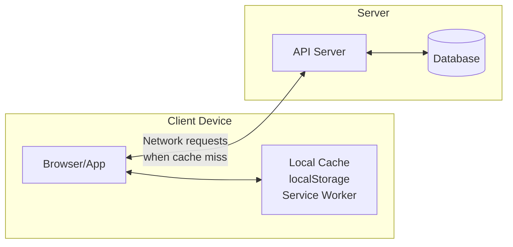

**Characteristics**:

| Aspect | Client-Side |
|--------|-------------|
| **Location** | User's device |
| **Scope** | Per-user, per-device |
| **Control** | Limited (via cache headers) |
| **Types** | Browser cache, app cache, service workers |
| **Examples** | HTTP cache, localStorage, IndexedDB |

**Pros**:
- Zero network latency for hits
- Works offline
- Reduces server load
- Personal to each user

**Cons**:
- Limited storage
- Harder to invalidate
- User can clear cache
- Stale data risk

### Comparison

| Aspect | Server-Side | Client-Side |
|--------|-------------|-------------|
| **Latency** | Low (1-10ms) | Lowest (< 1ms) |
| **Capacity** | Large (GB-TB) | Limited (MB-GB) |
| **Invalidation** | Controlled | Via headers/versioning |
| **Offline support** | No | Yes |
| **Best for** | Shared data, DB results | Static assets, user data |

---

## Cache Invalidation Strategies

The hardest problem in caching: knowing when cached data is stale.

### Time-Based (TTL)

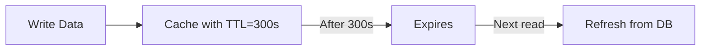

| Pros | Cons |
|------|------|
| Simple to implement | Data stale until expiry |
| Predictable behavior | Arbitrary expiry time |
| Works for any data | Cache stampede risk |

### Event-Based Invalidation

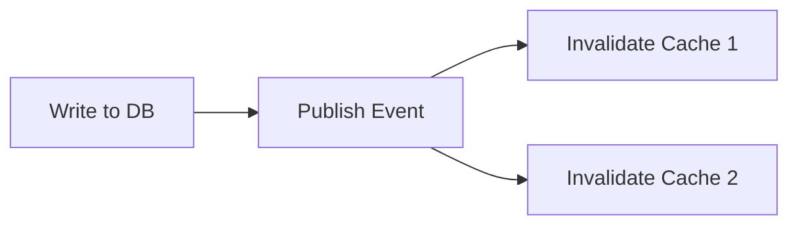

| Pros | Cons |
|------|------|
| Immediate consistency | Complex implementation |
| Precise invalidation | Requires event system |
| No arbitrary TTLs | Can miss events |

### Version-Based

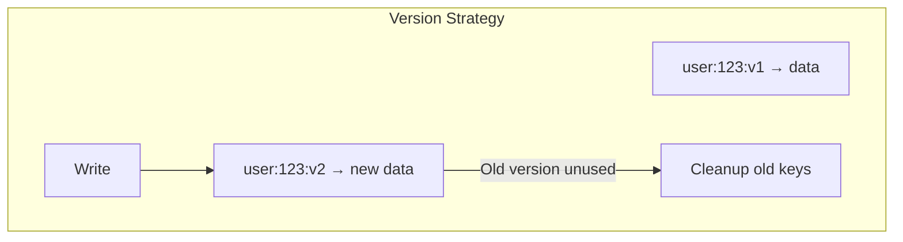

| Pros | Cons |
|------|------|
| Atomic updates | Key proliferation |
| No race conditions | Need version tracking |
| Rollback possible | Storage overhead |

---

## Common Patterns and Problems

### Cache Stampede

**Problem**: When cache expires, many requests simultaneously hit the database.

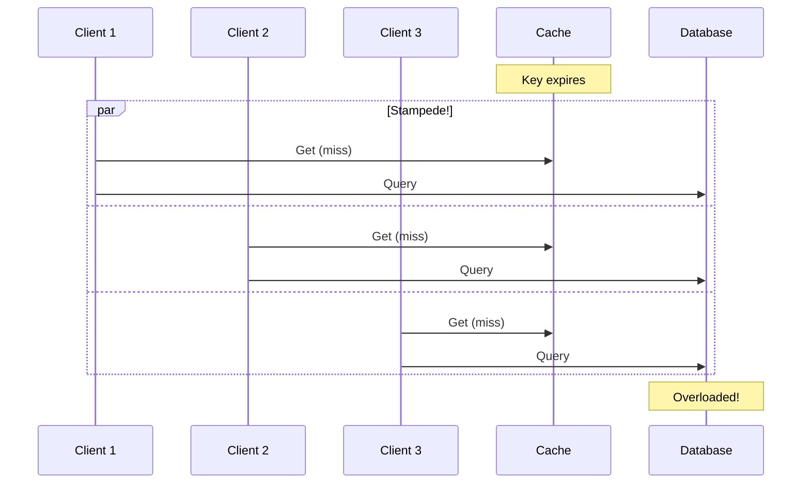

**Solutions**:

| Solution | Description |
|----------|-------------|
| **Locking** | First request gets lock, others wait |
| **Probabilistic early refresh** | Refresh before expiry with some probability |
| **Background refresh** | Refresh cache asynchronously before expiry |
| **Stale-while-revalidate** | Serve stale data while refreshing in background |

### Cache Penetration

**Problem**: Queries for non-existent data always hit the database (never cached).

**Solutions**:
- Cache negative results (with shorter TTL)
- Bloom filter to check existence before querying
- Rate limiting per key

### Hot Key Problem

**Problem**: One key gets massive traffic, overloading a single cache node.

**Solutions**:
- Replicate hot keys across nodes
- Local in-process cache for hot keys
- Key splitting (add random suffix, merge on read)

---

## Interview Patterns

### How to Discuss in 30 Seconds

> "Caching improves performance by storing frequently accessed data closer to the requester. The main strategies are read-through (cache auto-fetches on miss), write-through (sync writes to both cache and DB for consistency), and write-behind (async writes for speed). The key trade-off is freshness vs. performance—and cache invalidation is notoriously hard."

### How to Discuss in 2 Minutes

Add:
- Explain the difference between strategies with examples
- Mention cache invalidation approaches (TTL, event-based)
- Discuss cache stampede and hot key problems
- Note when to use server-side vs. client-side caching

### Common Follow-Up Questions

| Question | Key Points |
|----------|------------|
| "How do you invalidate cache?" | TTL, event-based, version-based; discuss trade-offs |
| "What about cache consistency?" | Write-through for strong; write-behind for eventual |
| "How do you handle cache failures?" | Graceful degradation, circuit breaker, fallback to DB |
| "Redis vs Memcached?" | Redis: data structures, persistence; Memcached: simpler, multi-threaded |
| "How do you size your cache?" | Working set size, hit ratio monitoring, cost analysis |

### Red Flags to Avoid

❌ Saying "just cache everything"  
✓ Be selective about what to cache based on access patterns

❌ Ignoring cache invalidation  
✓ Always discuss how stale data is handled

❌ Forgetting cache failures  
✓ Discuss graceful degradation strategy

---

## Connections to Other Concepts

| Related Topic | Connection |
|---------------|------------|
| [Consistency Models](./01_CONSISTENCY_MODELS.md) | Caching introduces eventual consistency |
| [Latency vs Throughput](./03_LATENCY_VS_THROUGHPUT.md) | Caching improves both |
| [CDN Usage](./13_CONTENT_DELIVERY.md) | CDN is a form of edge caching |
| [Read/Write Optimization](./14_READ_WRITE_OPTIMIZATION.md) | Caching is key strategy for read-heavy systems |
| [Real-Time Communication](./09_REALTIME_COMMUNICATION.md) | Cache invalidation can trigger real-time updates |

---

## Quick Reference Card

```
┌─────────────────────────────────────────────────────────────────┐
│               CACHING STRATEGIES QUICK REFERENCE                 │
├─────────────────────────────────────────────────────────────────┤
│                                                                  │
│  READ STRATEGIES                                                 │
│  ───────────────                                                 │
│  Read-Through: Cache auto-fetches on miss                        │
│  Cache-Aside:  App manages cache and DB separately               │
│                                                                  │
│  WRITE STRATEGIES                                                │
│  ────────────────                                                │
│  Write-Through: Sync writes to cache + DB (consistent)           │
│  Write-Behind:  Async writes to DB (fast, eventual)              │
│  Write-Around:  Bypass cache on writes (for write-heavy)         │
│                                                                  │
│  INVALIDATION                                                    │
│  ────────────                                                    │
│  TTL: Simple but arbitrary staleness window                      │
│  Event-based: Immediate but complex                              │
│  Version-based: Atomic but key proliferation                     │
│                                                                  │
│  DECISION MATRIX                                                 │
│  ───────────────                                                 │
│  Need consistency? → Write-through                               │
│  Need write speed? → Write-behind                                │
│  Write-heavy data? → Write-around                                │
│  Read-heavy data?  → Read-through + TTL                          │
│                                                                  │
│  WATCH OUT FOR                                                   │
│  ─────────────                                                   │
│  • Cache stampede (use locking or probabilistic refresh)         │
│  • Cache penetration (cache negative results)                    │
│  • Hot keys (replicate or split)                                 │
│                                                                  │
└─────────────────────────────────────────────────────────────────┘
```

---

*Previous: [03 - Latency vs Throughput](./03_LATENCY_VS_THROUGHPUT.md) | Next: [05 - Database Selection](./05_DATABASE_SELECTION.md)*
