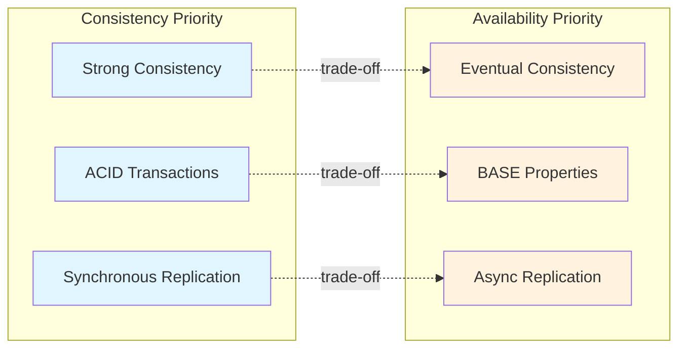
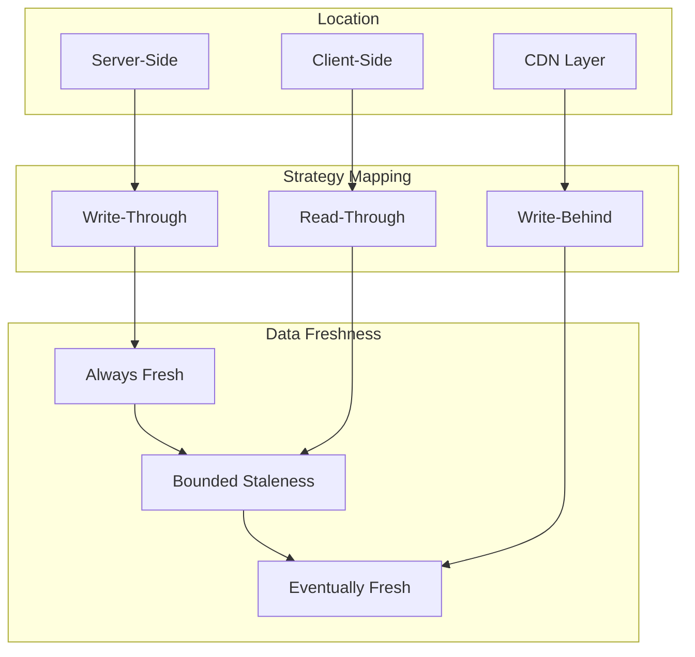
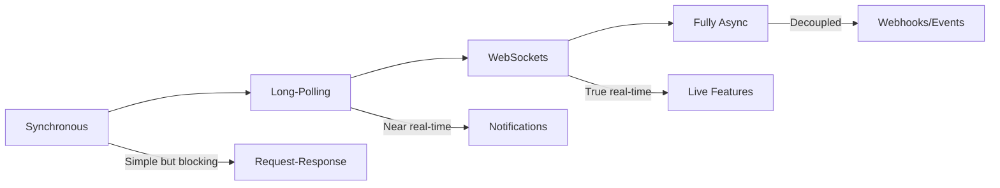
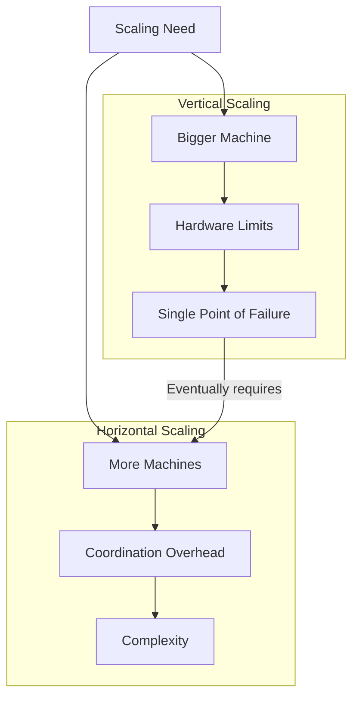

# System Design Interview Handbook

## Master Index & Conceptual Framework

---

## Purpose and Philosophy

This handbook is a structured, interview-ready reference for senior-level system design preparation. Every concept connects to others through explicit trade-offs, and each section follows a consistent pattern that supports both deep understanding and rapid review.

**Core Principle**: In system design, there are no perfect solutions—only trade-offs aligned with requirements. The goal is not to memorize answers, but to develop a systematic framework for reasoning about design decisions under constraints.

---

## The Trade-Off Framework

Every design decision in this handbook is analyzed through a consistent lens:

```
┌─────────────────────────────────────────────────────────────────┐
│                    DESIGN DECISION FRAMEWORK                     │
├─────────────────────────────────────────────────────────────────┤
│                                                                  │
│  1. WHAT problem does this solve?                               │
│     └── The fundamental need or constraint being addressed       │
│                                                                  │
│  2. WHAT do you gain?                                           │
│     └── Benefits, capabilities, guarantees                       │
│                                                                  │
│  3. WHAT do you sacrifice?                                      │
│     └── Costs, limitations, new constraints introduced           │
│                                                                  │
│  4. WHEN does this make sense?                                  │
│     └── Requirements that favor this choice                      │
│                                                                  │
│  5. HOW does it interact with other decisions?                  │
│     └── Cascading effects, complementary patterns                │
│                                                                  │
└─────────────────────────────────────────────────────────────────┘
```

---

## Document Structure

Each document in this handbook follows a consistent structure for reviewability:

| Section | Purpose |
|---------|---------|
| **Concept Overview** | What it is, why it matters |
| **Mental Model** | Intuitive understanding, analogies |
| **Technical Deep-Dive** | How it works mechanically |
| **Trade-Off Analysis** | Gains vs. sacrifices, decision criteria |
| **Interview Patterns** | How to discuss in interviews, common follow-ups |
| **Connections** | Links to related concepts |

---

## Handbook Contents

### Part I: Foundational Trade-Offs
*The fundamental tensions that shape all distributed system design*

| Document | Core Trade-Off | Key Question |
|----------|---------------|--------------|
| [01 - Consistency Models](./01_CONSISTENCY_MODELS.md) | Correctness vs. Availability | "Can my users see stale data?" |
| [02 - ACID vs BASE](./02_ACID_VS_BASE.md) | Integrity vs. Scale | "How critical is transactional correctness?" |
| [03 - Latency vs Throughput](./03_LATENCY_VS_THROUGHPUT.md) | Speed vs. Volume | "Do I optimize for individual requests or total capacity?" |

### Part II: Data Layer Patterns
*How data is stored, cached, replicated, and accessed*

| Document | Core Trade-Off | Key Question |
|----------|---------------|--------------|
| [04 - Caching Strategies](./04_CACHING_STRATEGIES.md) | Freshness vs. Speed | "How stale can my cached data be?" |
| [05 - Database Selection](./05_DATABASE_SELECTION.md) | Structure vs. Flexibility | "Do I know my data schema upfront?" |
| [06 - Replication Patterns](./06_REPLICATION_PATTERNS.md) | Consistency vs. Availability | "How should data flow between nodes?" |
| [07 - Data Optimization](./07_DATA_OPTIMIZATION.md) | Space vs. Access Speed | "How do I make storage efficient?" |

### Part III: Communication Patterns
*How components and services communicate*

| Document | Core Trade-Off | Key Question |
|----------|---------------|--------------|
| [08 - API Design](./08_API_DESIGN.md) | Simplicity vs. Flexibility | "REST, RPC, or GraphQL?" |
| [09 - Real-Time Communication](./09_REALTIME_COMMUNICATION.md) | Immediacy vs. Resources | "How instant do updates need to be?" |
| [10 - Service Exposure](./10_SERVICE_EXPOSURE.md) | Abstraction vs. Latency | "Gateway, direct, or hybrid?" |

### Part IV: Infrastructure Patterns
*Deployment, scaling, and traffic management*

| Document | Core Trade-Off | Key Question |
|----------|---------------|--------------|
| [11 - Architecture Paradigms](./11_ARCHITECTURE_PARADIGMS.md) | Control vs. Simplicity | "Serverless, containers, or VMs?" |
| [12 - Traffic Management](./12_TRAFFIC_MANAGEMENT.md) | Fairness vs. Flexibility | "How do I handle load and rate limiting?" |
| [13 - Content Delivery](./13_CONTENT_DELIVERY.md) | Latency vs. Complexity | "CDN or direct serving?" |

### Part V: Workload Patterns
*Designing for specific access patterns*

| Document | Core Trade-Off | Key Question |
|----------|---------------|--------------|
| [14 - Read vs Write Optimization](./14_READ_WRITE_OPTIMIZATION.md) | Read Speed vs. Write Speed | "Is my system read-heavy or write-heavy?" |
| [15 - Batch vs Stream Processing](./15_BATCH_VS_STREAM.md) | Latency vs. Efficiency | "Do I need real-time or can I batch?" |

---

## Conceptual Threads

These are the major themes that connect concepts across the handbook. Understanding these threads helps you navigate trade-offs during interviews.

### Thread 1: The CAP Theorem Spectrum



**Key Insight**: When you choose strong consistency, you're implicitly choosing potential unavailability during partitions. When you choose availability, you're accepting temporary inconsistency.

### Thread 2: The Caching Continuum



**Key Insight**: Every caching decision is a bet on data access patterns and staleness tolerance.

### Thread 3: The Synchronicity Spectrum



**Key Insight**: Moving right adds complexity but enables better resource utilization and responsiveness.

### Thread 4: The Scaling Axes



**Key Insight**: Vertical scaling is simpler but has limits. Horizontal scaling is more complex but enables true scale.

---

## Interview Navigation Guide

### When Interviewer Asks About...

| Topic | Start Here | Then Connect To |
|-------|-----------|-----------------|
| "How would you handle millions of users?" | Horizontal scaling, load balancing | Caching, CDN, database sharding |
| "What database would you use?" | SQL vs NoSQL analysis | Consistency requirements, access patterns |
| "How do you ensure data consistency?" | Consistency models | ACID/BASE, replication strategy |
| "How would you make this real-time?" | Real-time communication patterns | WebSockets, event-driven architecture |
| "What about caching?" | Caching strategies | Cache invalidation, consistency trade-offs |
| "How do you handle failures?" | Replication, redundancy | Consistency guarantees, fallback strategies |

### The Five Questions to Always Ask

Before diving into any design, clarify:

1. **Scale**: How many users? Requests per second? Data volume?
2. **Consistency**: Can users see stale data? For how long?
3. **Latency**: What's the acceptable response time?
4. **Availability**: What's the uptime requirement?
5. **Access Pattern**: Read-heavy? Write-heavy? Both?

---

## Quick Reference: Trade-Off Pairs

| If You Need... | Consider... | But Accept... |
|----------------|-------------|---------------|
| Strong consistency | Synchronous replication | Higher latency, lower availability |
| High availability | Eventual consistency | Temporary staleness |
| Low latency | Caching, CDN | Complexity, potential staleness |
| High throughput | Async processing, batching | Higher latency per request |
| Simplicity | Monolith, SQL, polling | Scaling limitations |
| Flexibility | Microservices, NoSQL, events | Operational complexity |
| Data integrity | ACID, strong consistency | Performance overhead |
| Scale | BASE, eventual consistency | Application-level conflict handling |

---

## How to Use This Handbook

### For Initial Learning
1. Read documents in order (Part I → Part V)
2. Focus on understanding the "why" behind each trade-off
3. Draw the diagrams from memory to test understanding

### For Interview Preparation
1. Use the Interview Navigation Guide to practice scenarios
2. For each concept, rehearse explaining it in 30 seconds, 2 minutes, and 5 minutes
3. Practice connecting concepts (e.g., "If I choose eventual consistency, that affects my caching strategy because...")

### For Quick Review
1. Scan the Quick Reference tables
2. Review the mermaid diagrams
3. Use the "Interview Patterns" section of each document

---

## Version and Updates

| Version | Date | Changes |
|---------|------|---------|
| 1.0 | 2025 | Initial handbook structure |

---

*Next: [01 - Consistency Models](./01_CONSISTENCY_MODELS.md)*
