# 06 — Consistency & Consensus

> Understanding the trade-offs between consistency, availability, and partition tolerance is central to distributed systems design.

**Prerequisites:** [01 — Foundational Concepts](./01-FOUNDATIONAL-CONCEPTS.md), [05 — Distributed Patterns](./05-DISTRIBUTED-PATTERNS.md)  
**Builds toward:** [08 — Messaging & Async](./08-MESSAGING-ASYNC.md)  
**Estimated study time:** 3-4 hours

---

## Chapter Overview

This module provides a deep dive into consistency models, the CAP and PACELC theorems, replication strategies, and how real systems make these trade-offs.

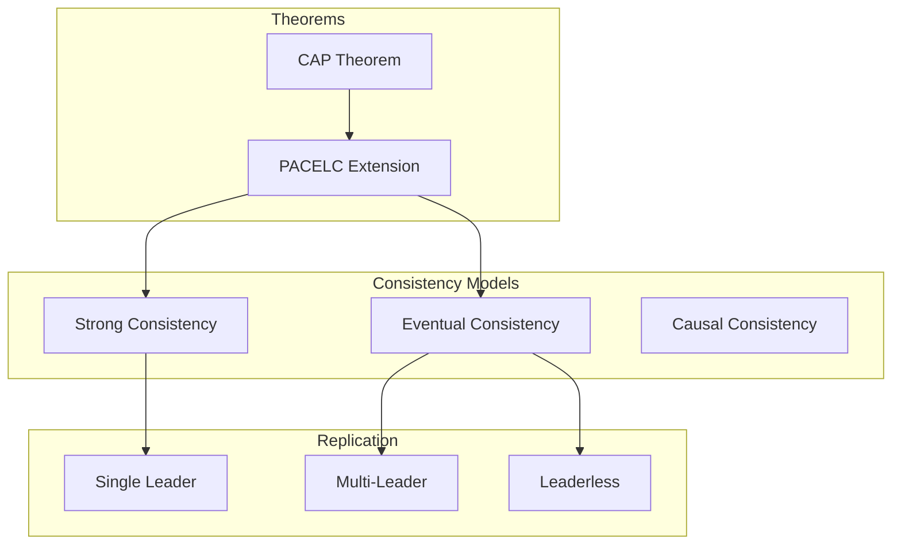

---

## 1. The CAP Theorem — Deep Dive

### The Three Properties

| Property | Definition | Practical Meaning |
|----------|------------|-------------------|
| **Consistency (C)** | All nodes see the same data at the same time | After a write completes, all reads return that value |
| **Availability (A)** | Every request receives a response | System responds even if some nodes are down |
| **Partition Tolerance (P)** | System continues despite network failures | Handles network splits between nodes |

### The Fundamental Trade-off

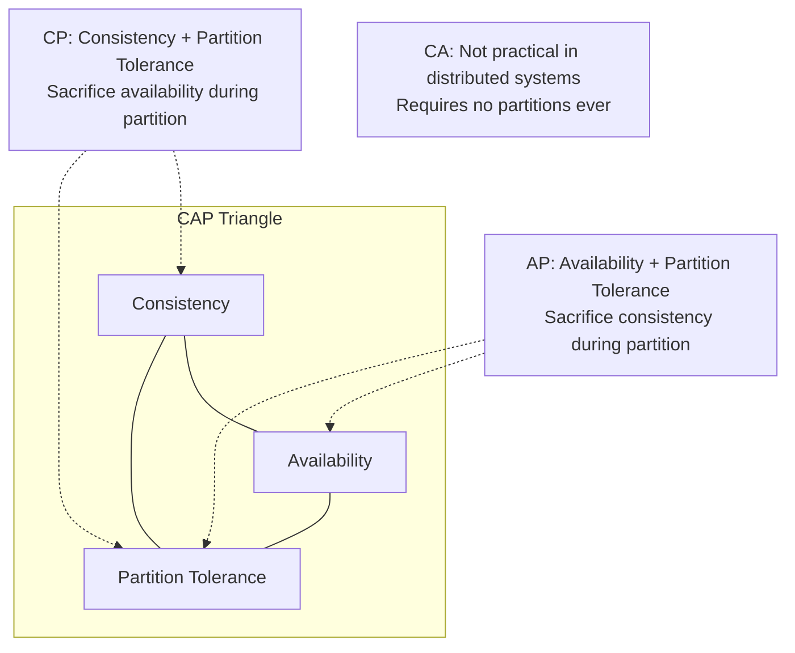

**Key insight:** Network partitions are inevitable. The real choice is: during a partition, do you sacrifice consistency (serve potentially stale data) or availability (refuse to respond)?

### CAP in Practice: A Scenario

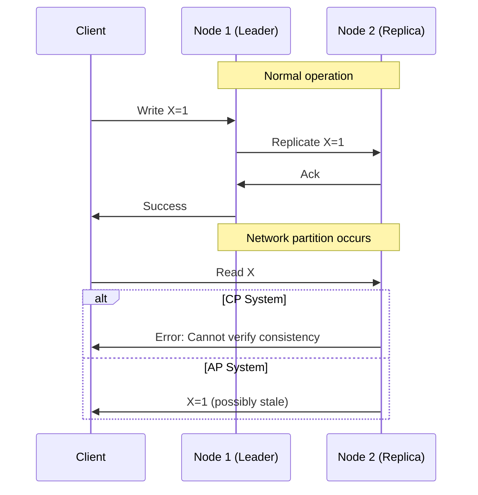

### CP Systems

**Behavior:** During partition, refuse requests that can't be consistently served.

| System | Behavior During Partition |
|--------|--------------------------|
| **HBase** | Unavailable for affected regions |
| **MongoDB (default)** | Writes fail if can't reach majority |
| **Redis Cluster** | Rejects writes to minority partition |
| **Spanner** | Waits for synchronous replication |

**Use when:**
- Data correctness is paramount
- Financial transactions
- Inventory management (no overselling)

### AP Systems

**Behavior:** During partition, serve requests but accept potential inconsistency.

| System | Behavior During Partition |
|--------|--------------------------|
| **Cassandra** | Accepts writes to available nodes |
| **DynamoDB** | Continues with available replicas |
| **CouchDB** | Allows writes, resolves conflicts later |
| **Riak** | Uses vector clocks for conflict detection |

**Use when:**
- Availability is critical
- Some staleness is acceptable
- Social media feeds, shopping carts (can reconcile later)

### CAP Misconceptions

| Misconception | Reality |
|---------------|---------|
| "Pick two of three" | Partition tolerance isn't optional; it's about behavior *during* partitions |
| "Always one or the other" | Most systems are tunable; behavior depends on configuration |
| "Applies all the time" | CAP trade-off only matters during partitions |
| "Binary choice" | Spectrum of consistency levels exists |

---

## 2. PACELC Theorem

### Beyond CAP

CAP only addresses behavior during partitions. What about normal operation?

**PACELC states:**

```
if (Partition) {
    trade-off between Availability and Consistency
} else {
    trade-off between Latency and Consistency
}
```

### The Complete Picture

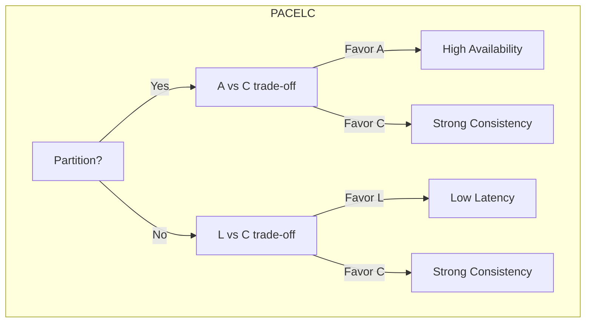

### System Classifications

| System | During Partition | Else (Normal) | Classification |
|--------|------------------|---------------|----------------|
| **Cassandra** | Availability | Latency | PA/EL |
| **DynamoDB** | Availability | Latency | PA/EL |
| **HBase** | Consistency | Consistency | PC/EC |
| **BigTable** | Consistency | Consistency | PC/EC |
| **MongoDB** | Availability | Consistency | PA/EC |
| **PNUTS** | Consistency | Latency | PC/EL |

### PA/EL Systems (Cassandra, DynamoDB)

- Optimize for availability and low latency
- Accept eventual consistency
- Best for: high-throughput, global distribution

### PC/EC Systems (HBase, Spanner)

- Prioritize consistency always
- Accept higher latency
- Best for: financial data, inventory

### PA/EC Systems (MongoDB default)

- Available during partitions
- Consistent during normal operation
- Best for: general-purpose with some consistency needs

---

## 3. Consistency Models

### The Consistency Spectrum

```
Strong ←——————————————————————————————————→ Weak
Linearizable → Sequential → Causal → Eventual
```

### Linearizability (Strongest)

Operations appear to happen atomically at some point between invocation and completion.

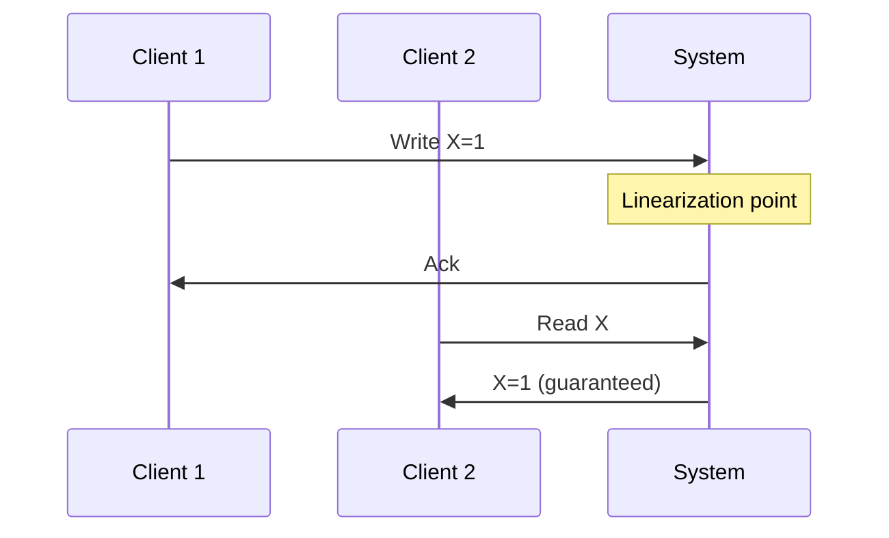

**Guarantee:** If write completes before read starts, read sees the write.

### Sequential Consistency

Operations appear in some sequential order consistent with program order of each client.

**Difference from linearizable:** Order doesn't have to match real-time order, just per-client order.

### Causal Consistency

Operations that are causally related appear in the same order to all nodes.

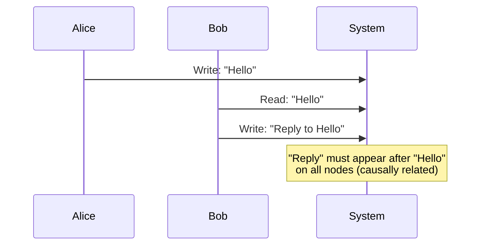

**Use case:** Social media comments must appear after their parent posts.

### Eventual Consistency

If no new updates, all replicas will eventually converge to the same value.

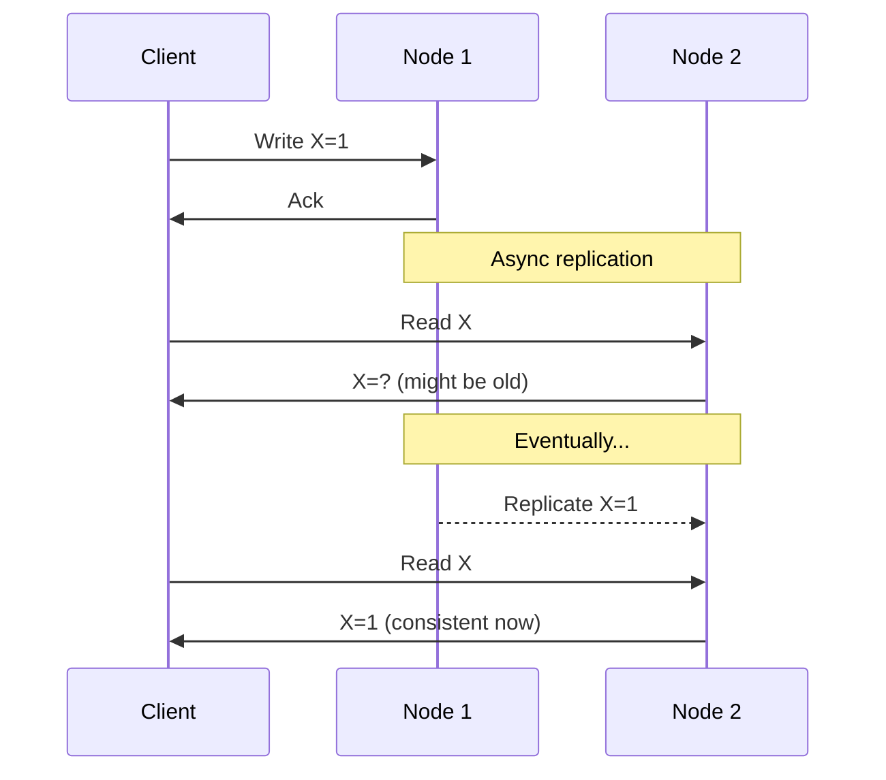

### Consistency Model Comparison

| Model | Guarantees | Performance | Use Cases |
|-------|------------|-------------|-----------|
| **Linearizable** | Real-time ordering | Slowest | Distributed locks, leader election |
| **Sequential** | Per-client ordering | Fast | Many applications |
| **Causal** | Cause-effect ordering | Fast | Social media, collaboration |
| **Eventual** | Eventual convergence | Fastest | Caching, DNS, analytics |

---

## 4. Replication Strategies

### Single-Leader Replication

One node (leader) accepts all writes; followers replicate from leader.

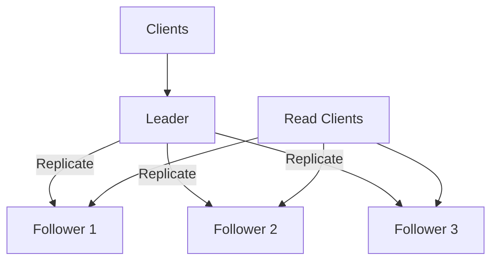

| Aspect | Description |
|--------|-------------|
| **Consistency** | Strong (reads from leader) or eventual (reads from followers) |
| **Write throughput** | Limited by single leader |
| **Failure handling** | Leader failure requires failover |

### Multi-Leader Replication

Multiple nodes accept writes; changes replicated to all leaders.

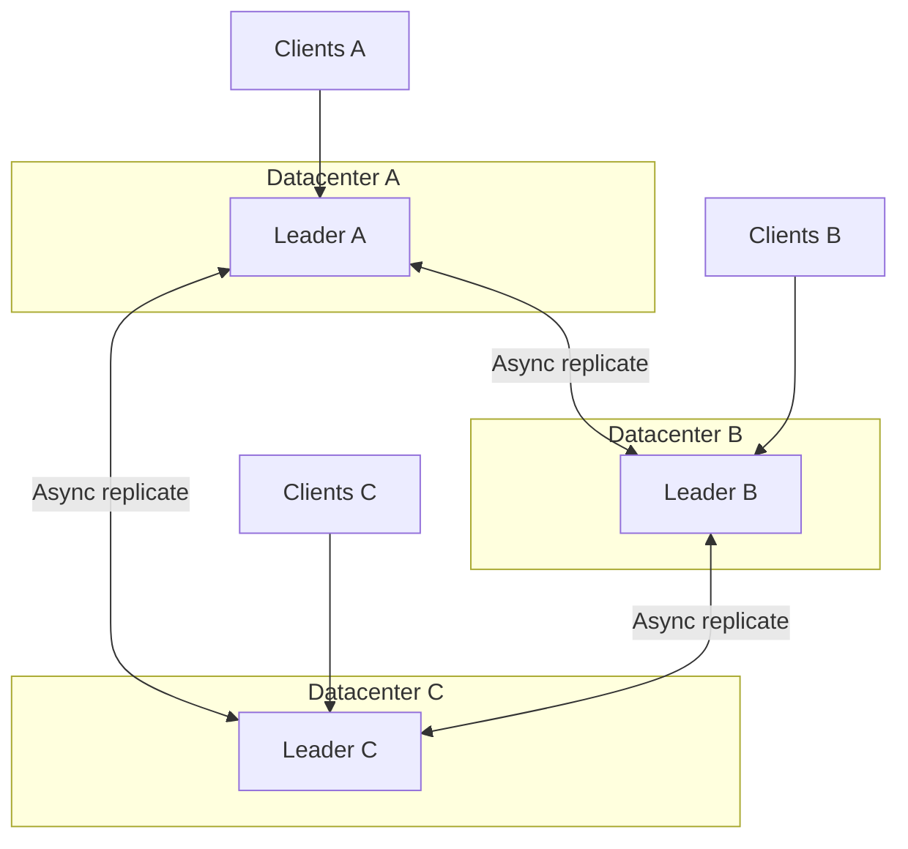

| Aspect | Description |
|--------|-------------|
| **Consistency** | Eventual (conflicts possible) |
| **Write throughput** | Higher (parallel writes) |
| **Failure handling** | Other leaders continue |

**Challenge:** Write conflicts must be resolved.

### Leaderless Replication

No single leader; clients write to multiple nodes directly.

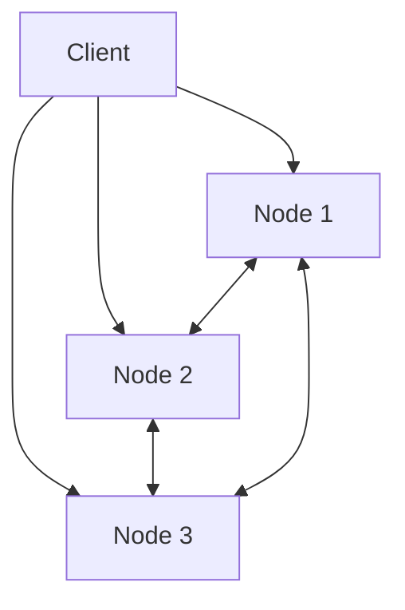

| Aspect | Description |
|--------|-------------|
| **Consistency** | Tunable via quorums |
| **Write throughput** | High (parallel to multiple nodes) |
| **Failure handling** | Automatic (no leader to fail) |

### Replication Topology Comparison

| Topology | Conflict Handling | Latency | Complexity | Use Case |
|----------|-------------------|---------|------------|----------|
| **Single-Leader** | None (serialized) | Higher for remote writes | Low | Most OLTP |
| **Multi-Leader** | Required | Lower (local writes) | High | Multi-DC |
| **Leaderless** | Required | Tunable | Medium | High availability |

---

## 5. Conflict Resolution

### Why Conflicts Occur

In multi-leader or leaderless systems, concurrent writes to the same data create conflicts.

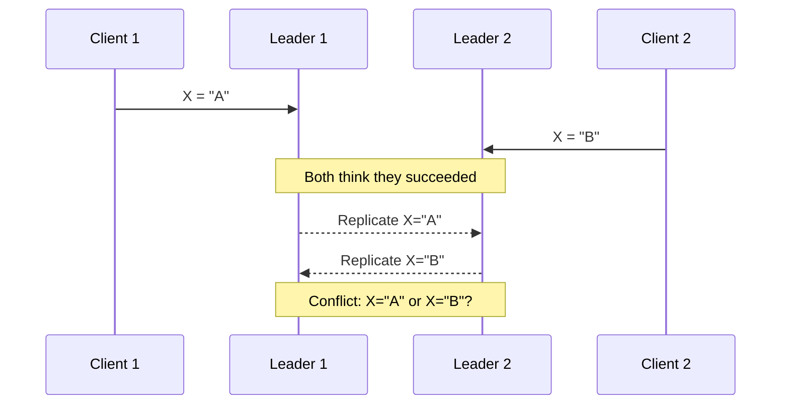

### Conflict Resolution Strategies

| Strategy | Description | Pros | Cons |
|----------|-------------|------|------|
| **Last-Write-Wins (LWW)** | Highest timestamp wins | Simple | Data loss, clock skew issues |
| **Merge** | Combine conflicting values | No data loss | May not make sense |
| **Custom resolution** | Application-specific logic | Correct semantics | Complex |
| **Keep all versions** | Store both, let user resolve | No data loss | Requires user intervention |

### Last-Write-Wins (LWW)

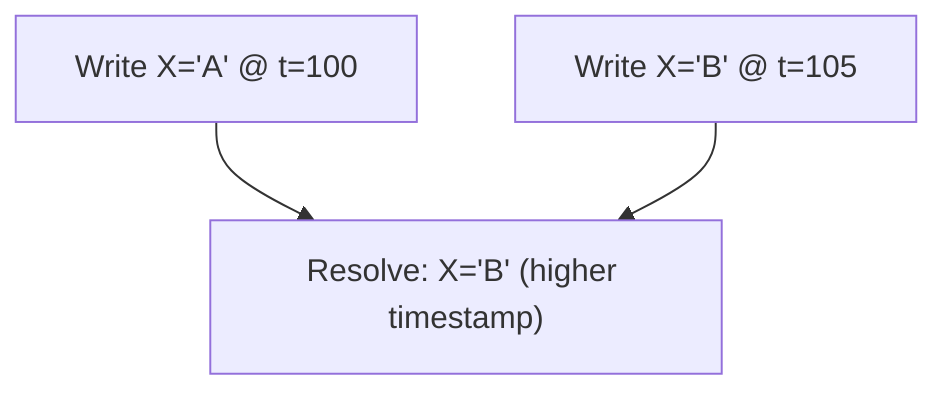

**Problem:** If clocks are skewed, "last" might not be real last.

### Vector Clocks

Track causality to detect true conflicts.

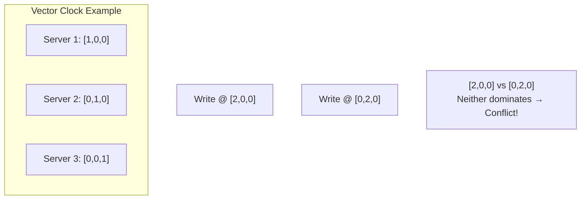

**Rule:** If all components of V1 ≤ V2, then V1 happened-before V2. Otherwise, concurrent (conflict).

### CRDTs (Conflict-free Replicated Data Types)

Data structures that automatically merge without conflicts.

| CRDT Type | Example | Merge Behavior |
|-----------|---------|----------------|
| **G-Counter** | Page views | Sum of all increments |
| **PN-Counter** | Likes/unlikes | Positive + Negative counters |
| **G-Set** | Tags | Union of sets |
| **LWW-Register** | User profile | Last-write-wins value |

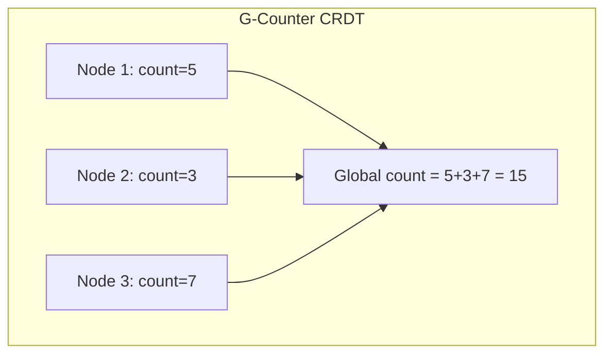

---

## 6. Read-Your-Writes Consistency

### The Problem

After writing, user reads from a replica that hasn't received the write yet.

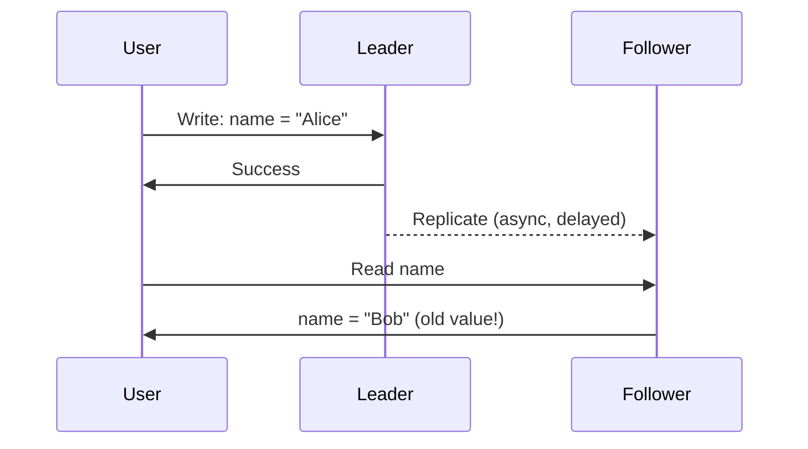

### Solutions

| Solution | Description | Trade-off |
|----------|-------------|-----------|
| **Read from leader** | After write, read from leader | Leader load |
| **Sticky sessions** | Route user to same replica | Load balancing complexity |
| **Version tracking** | Client tracks write version | Client complexity |
| **Synchronous replication** | Wait for replication | Latency |

### Monotonic Reads

Guarantee: Once you read a value, you won't see an older value.

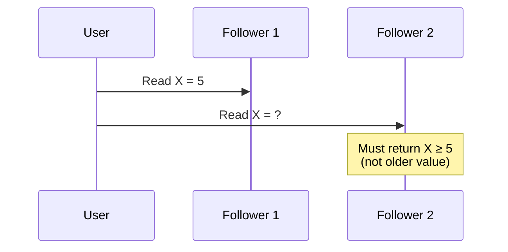

**Implementation:** Track read version, route to replicas at or ahead of that version.

---

## 7. Consensus Algorithms

### The Consensus Problem

Multiple nodes must agree on a single value, even if some nodes fail.

**Requirements:**
- **Agreement:** All non-faulty nodes decide the same value
- **Validity:** Decided value was proposed by some node
- **Termination:** All non-faulty nodes eventually decide

### Paxos

Classic consensus algorithm (complex to understand).

**Roles:**
- **Proposers:** Propose values
- **Acceptors:** Vote on proposals
- **Learners:** Learn decided value

### Raft

Understandable consensus algorithm.

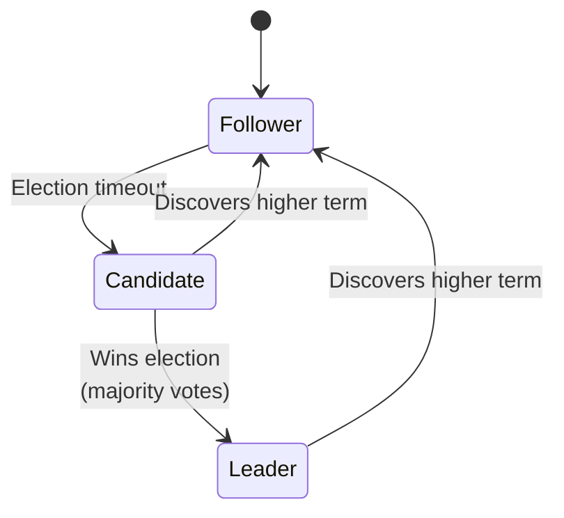

**Key mechanisms:**
1. **Leader election:** Candidates request votes, majority wins
2. **Log replication:** Leader appends entries, replicates to followers
3. **Safety:** Only leaders with up-to-date logs can be elected

### Consensus in Practice

| Use Case | Why Consensus |
|----------|---------------|
| **Leader election** | Agree on who is leader |
| **Distributed locks** | Agree on lock holder |
| **Configuration** | Agree on cluster membership |
| **Total ordering** | Agree on operation order |

---

## 8. Chapter Summary

### Key Concepts

| Concept | One-Line Definition |
|---------|---------------------|
| **CAP** | During partitions, choose consistency or availability |
| **PACELC** | Even without partitions, trade latency for consistency |
| **Linearizability** | Operations appear atomic, real-time ordered |
| **Eventual consistency** | All replicas converge given enough time |
| **Quorum** | Majority agreement for consistency |
| **Vector clock** | Logical time to detect concurrent writes |
| **CRDT** | Data type that merges without conflicts |

### Design Decision Framework

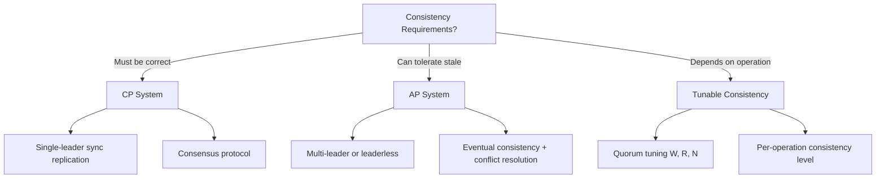

### Interview Articulation Patterns

> "Explain the CAP theorem."

"CAP states that during a network partition, a distributed system must choose between consistency (all nodes see the same data) and availability (all requests get responses). Since partitions are inevitable, the practical choice is whether to fail requests or serve potentially stale data during partitions."

> "When would you choose eventual consistency?"

"When availability and latency are more important than immediate consistency. For example, a social media feed can show slightly stale data—users tolerate seeing a post a few seconds late. But a banking system transferring money needs strong consistency to prevent double-spending."

> "How do you handle conflicts in a multi-leader setup?"

"Options include last-write-wins (simple but can lose data), vector clocks (detect conflicts, let application resolve), or CRDTs (data structures that automatically merge). The choice depends on whether data loss is acceptable and whether meaningful automatic merging is possible."

---

## Navigation

**Previous:** [05 — Distributed Patterns](./05-DISTRIBUTED-PATTERNS.md)  
**Next:** [07 — Load Balancing & Scaling](./07-LOAD-BALANCING-SCALING.md)  
**Index:** [00 — Handbook Index](./00-INDEX.md)
