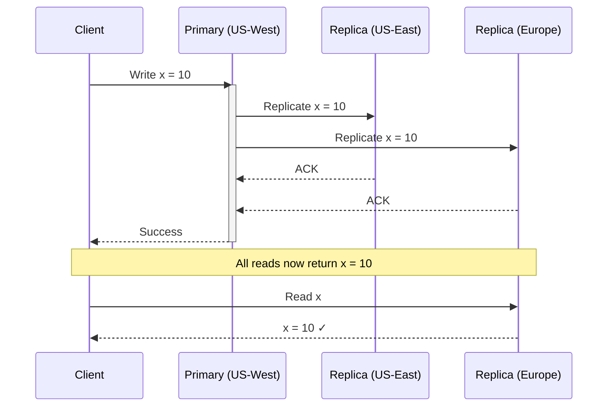
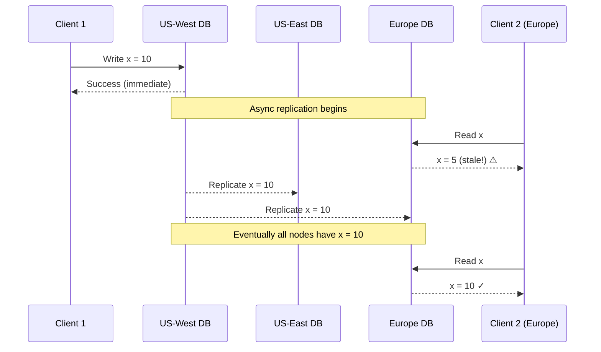
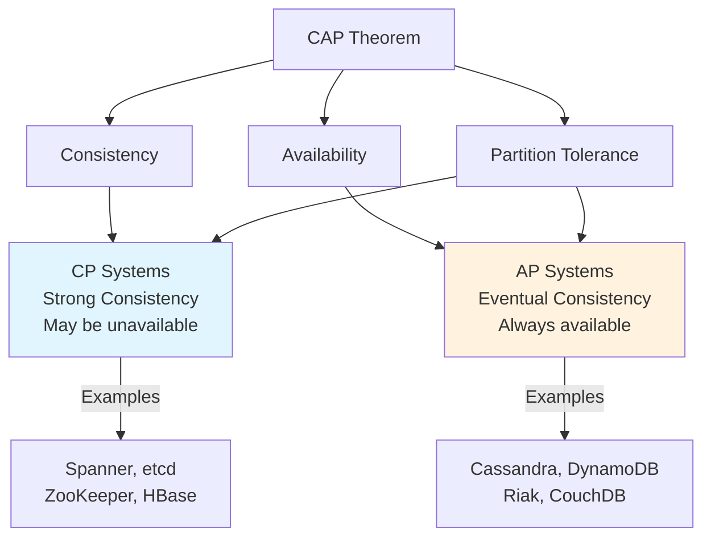
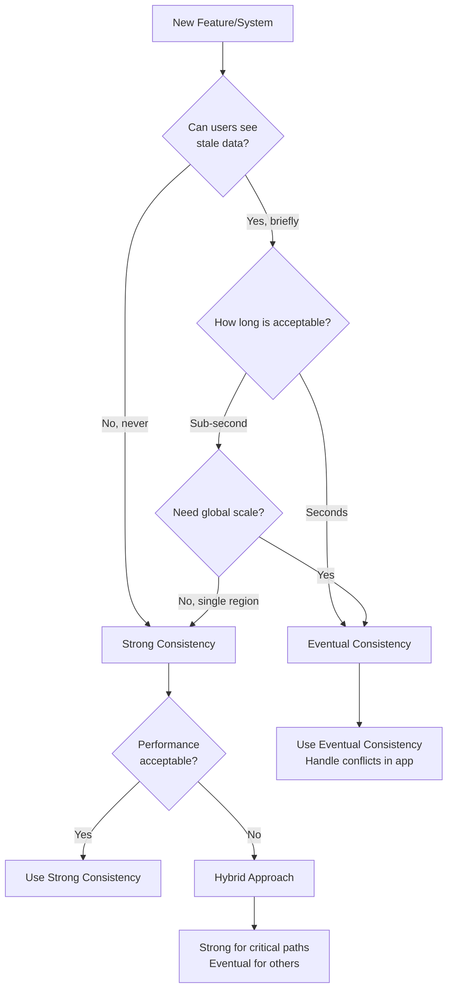
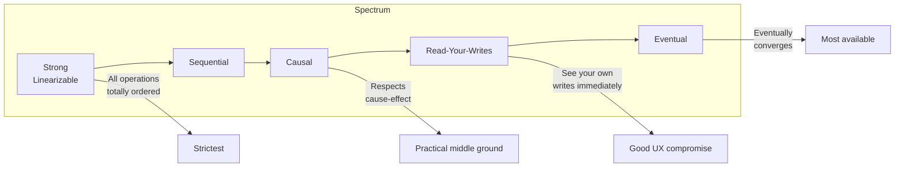

# 01 - Consistency Models

## Strong Consistency vs Eventual Consistency

---

## Concept Overview

**What is Consistency?**

In distributed systems, data consistency refers to the guarantee that all copies of data (across different servers or nodes) reflect the same state. When multiple users or services access data spread across servers, we want them all to see the same values.

**Why It Matters**

Consider an online store with inventory data replicated across servers: if one server thinks an item is in stock and another thinks it's sold out, you might accidentally sell a product that isn't available. Consistency ensures avoiding such conflicts by keeping data synchronized.

**The Fundamental Trade-Off**

```
┌────────────────────────────────────────────────────────────────────────┐
│                                                                        │
│     STRONG CONSISTENCY              vs        EVENTUAL CONSISTENCY     │
│                                                                        │
│     ✓ Always correct                          ✓ Always available       │
│     ✓ Simple to reason about                  ✓ Low latency            │
│     ✗ Higher latency                          ✗ Temporarily stale      │
│     ✗ May be unavailable                      ✗ Complex app logic      │
│                                                                        │
└────────────────────────────────────────────────────────────────────────┘
```

---

## Mental Models

### Strong Consistency: The Bank Vault

Think of a bank with multiple tellers. When you deposit money, every teller must update their records before your transaction is complete. Any teller you visit afterward will show the same balance. The trade-off: transactions take longer because everyone must synchronize.

### Eventual Consistency: The News Feed

Think of a social media post. When you publish a photo, not all friends see it at the exact same moment. One friend's app might still show the old timeline while another sees the new post. After a short while, everyone's feed catches up. The trade-off: faster posting, but temporary inconsistency.

---

## Technical Deep-Dive

### Strong Consistency (Linearizability)

**Definition**: Any read returns the most recent write. Once a write completes, all subsequent reads from any location see that update. No "stale" reads.

**Mechanism: Synchronous Replication**



**Key Properties**:
- Write is only confirmed after all (or quorum of) replicas acknowledge
- Reads may be blocked during write propagation
- Concurrent writes may be serialized or one may fail
- Feels like a single, up-to-date copy of data

**Implementation Approaches**:

| Approach | Description | Example Systems |
|----------|-------------|-----------------|
| Primary with sync replicas | All writes go through primary, replicated synchronously | Google Spanner |
| Consensus protocols | Distributed agreement (Paxos, Raft) | etcd, ZooKeeper |
| Two-phase commit | Coordinator ensures all nodes agree | Traditional SQL clusters |

### Eventual Consistency

**Definition**: If no new updates are made, all copies will *eventually* become consistent. The key word is "eventually"—there's no promise of immediate consistency.

**Mechanism: Asynchronous Replication**



**Key Properties**:
- Write confirmed after local node accepts (fast!)
- Other replicas updated in background
- Reads may return stale data during propagation window
- Conflict resolution needed (last-write-wins, vector clocks, CRDTs)

**Conflict Resolution Strategies**:

| Strategy | How It Works | Use Case |
|----------|--------------|----------|
| Last-Write-Wins (LWW) | Timestamp determines winner | Simple counters, non-critical data |
| Vector Clocks | Track causal history | Detecting conflicts |
| CRDTs | Mathematically mergeable types | Collaborative editing |
| Application-level | Custom merge logic | Domain-specific rules |

---

## Trade-Off Analysis

### Comparison Matrix

| Aspect | Strong Consistency | Eventual Consistency |
|--------|-------------------|---------------------|
| **Data Guarantee** | Every read gets latest write | Reads might be stale temporarily |
| **Read/Write Latency** | Higher (waits for coordination) | Lower (local operations) |
| **Availability** | May refuse operations during partitions | Remains available during partitions |
| **Complexity** | Simpler application logic | Requires handling staleness |
| **Scalability** | Harder to scale globally | Scales well geographically |
| **Typical Systems** | Banking, inventory, booking | Social feeds, CDN, analytics |

### The CAP Theorem Connection



**Key Insight**: In a distributed system with network partitions (which *will* happen), you must choose between consistency and availability. This is not a bug—it's physics.

### Decision Framework



---

## When to Use Which

### Use Strong Consistency When:

| Scenario | Why Strong Consistency | Example |
|----------|----------------------|---------|
| Financial transactions | Cannot risk double-spending or lost money | Bank transfers, payment processing |
| Inventory management | Overselling causes real business harm | E-commerce checkout |
| Booking/Reservation | Double-booking destroys customer trust | Hotel rooms, flight seats |
| User authentication | Security requires authoritative state | Login sessions, permissions |
| Distributed coordination | Correctness is paramount | Leader election, config management |

### Use Eventual Consistency When:

| Scenario | Why Eventual Consistency | Example |
|----------|-------------------------|---------|
| Social media feeds | Brief staleness doesn't harm UX | Timeline, likes, comments |
| Analytics/Metrics | Approximate counts are acceptable | View counts, dashboards |
| Content delivery | Speed matters more than freshness | CDN-cached content |
| Product catalog | Browsing tolerates slight delays | Product descriptions |
| Recommendations | Personalization can lag slightly | "You might also like" |

### Hybrid Approaches

Many real-world systems use **both**:

```
┌─────────────────────────────────────────────────────────────────┐
│                    E-COMMERCE EXAMPLE                           │
├─────────────────────────────────────────────────────────────────┤
│                                                                  │
│  STRONG CONSISTENCY          │    EVENTUAL CONSISTENCY          │
│  ────────────────────        │    ─────────────────────         │
│  • Payment processing        │    • Product recommendations     │
│  • Inventory count at        │    • Product view counts         │
│    checkout                  │    • "Items in stock" badge      │
│  • Order placement           │    • Search results              │
│  • User wallet balance       │    • Review aggregations         │
│                              │                                   │
└─────────────────────────────────────────────────────────────────┘
```

---

## Intermediate Consistency Models

Between strong and eventual, there's a spectrum:



| Model | Guarantee | Use Case |
|-------|-----------|----------|
| **Linearizable** | Operations appear in real-time order | Distributed locks |
| **Sequential** | Operations appear in some consistent order | Audit logs |
| **Causal** | Causally related operations in order | Social feeds |
| **Read-Your-Writes** | You see your own writes immediately | User sessions |
| **Monotonic Reads** | Never see older data after newer | Progress tracking |
| **Eventual** | Converges eventually | Caching, replication |

Some databases (Azure Cosmos DB, MongoDB) let you choose consistency level per operation.

---

## Interview Patterns

### How to Discuss in 30 Seconds

> "Strong consistency guarantees all reads see the latest write, which is essential for financial transactions but adds latency. Eventual consistency allows temporary staleness for better availability and performance—suitable for social feeds or caching. The choice depends on whether your use case can tolerate stale reads."

### How to Discuss in 2 Minutes

Add:
- Mechanism difference (sync vs async replication)
- CAP theorem connection
- One concrete example of each
- Mention that hybrid approaches are common

### Common Follow-Up Questions

| Question | Key Points to Cover |
|----------|-------------------|
| "How do you handle conflicts in eventual consistency?" | Last-write-wins, vector clocks, CRDTs, application-level resolution |
| "What's the latency impact of strong consistency?" | Cross-region round-trip time, quorum writes, potential blocking |
| "Can you have strong consistency at global scale?" | Yes (Spanner), but expensive; mention TrueTime, consensus overhead |
| "How do you test consistency guarantees?" | Jepsen testing, chaos engineering, linearizability checkers |
| "What about transactions across microservices?" | Saga pattern, eventual consistency with compensation |

### Red Flags to Avoid

❌ Saying "always use strong consistency for safety"  
✓ Recognize it's a trade-off based on requirements

❌ Ignoring the consistency requirements discussion  
✓ Always clarify staleness tolerance early in design

❌ Treating consistency as binary  
✓ Acknowledge the spectrum and tunable options

---

## Connections to Other Concepts

| Related Topic | Connection |
|---------------|------------|
| [ACID vs BASE](./02_ACID_VS_BASE.md) | ACID requires strong consistency; BASE embraces eventual |
| [Caching Strategies](./04_CACHING_STRATEGIES.md) | Cache invalidation is a consistency problem |
| [Replication Patterns](./06_REPLICATION_PATTERNS.md) | Replication strategy determines consistency guarantees |
| [Database Selection](./05_DATABASE_SELECTION.md) | SQL typically ACID; NoSQL often eventual |
| [Real-Time Communication](./09_REALTIME_COMMUNICATION.md) | Event ordering depends on consistency model |

---

## Quick Reference Card

```
┌─────────────────────────────────────────────────────────────────┐
│              CONSISTENCY MODELS QUICK REFERENCE                  │
├─────────────────────────────────────────────────────────────────┤
│                                                                  │
│  STRONG CONSISTENCY                                              │
│  ─────────────────                                               │
│  • Guarantee: All reads see latest write                         │
│  • Mechanism: Synchronous replication                            │
│  • Trade-off: Higher latency, potential unavailability           │
│  • Use for: Banking, inventory, bookings                         │
│  • Systems: Spanner, etcd, PostgreSQL (single-node)             │
│                                                                  │
│  EVENTUAL CONSISTENCY                                            │
│  ────────────────────                                            │
│  • Guarantee: Converges eventually, may read stale               │
│  • Mechanism: Asynchronous replication                           │
│  • Trade-off: Staleness, conflict resolution needed              │
│  • Use for: Social feeds, CDN, analytics                         │
│  • Systems: Cassandra, DynamoDB, Riak                           │
│                                                                  │
│  DECISION RULE                                                   │
│  ─────────────                                                   │
│  "If a user seeing stale data for a few seconds would cause"     │
│  "real harm (lost money, double-booking), use strong."           │
│  "Otherwise, eventual usually provides better UX at scale."      │
│                                                                  │
└─────────────────────────────────────────────────────────────────┘
```

---

*Previous: [00 - Index and Framework](./00_INDEX_AND_FRAMEWORK.md) | Next: [02 - ACID vs BASE](./02_ACID_VS_BASE.md)*
