# 05 - Database Selection: SQL vs NoSQL

## Overview

Database selection is one of the most consequential decisions in system design. The choice affects scalability, consistency guarantees, query flexibility, and operational complexity. This document provides a systematic framework for evaluating SQL and NoSQL databases, with emphasis on trade-offs that interviewers commonly probe.

---

## Core Mental Model

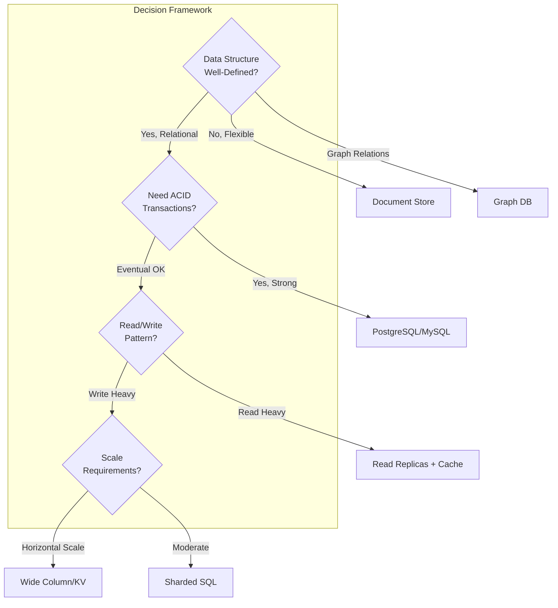

**Key Insight**: The question is rarely "SQL or NoSQL" but rather "which consistency, availability, and partition-tolerance trade-offs match my requirements?"

---

## SQL Databases

### Characteristics

| Property | Description |
|----------|-------------|
| **Schema** | Fixed, predefined structure with strong typing |
| **Relationships** | First-class support via foreign keys, JOINs |
| **Transactions** | ACID guarantees (Atomicity, Consistency, Isolation, Durability) |
| **Query Language** | Declarative SQL with optimization |
| **Scaling** | Primarily vertical; horizontal via read replicas or sharding |

### When to Choose SQL

1. **Complex queries with JOINs**: Financial reporting, analytics dashboards
2. **Strong consistency requirements**: Banking, inventory management
3. **Well-defined schema**: User accounts, orders, products
4. **Referential integrity**: Systems where data relationships must be enforced

### ACID Deep Dive

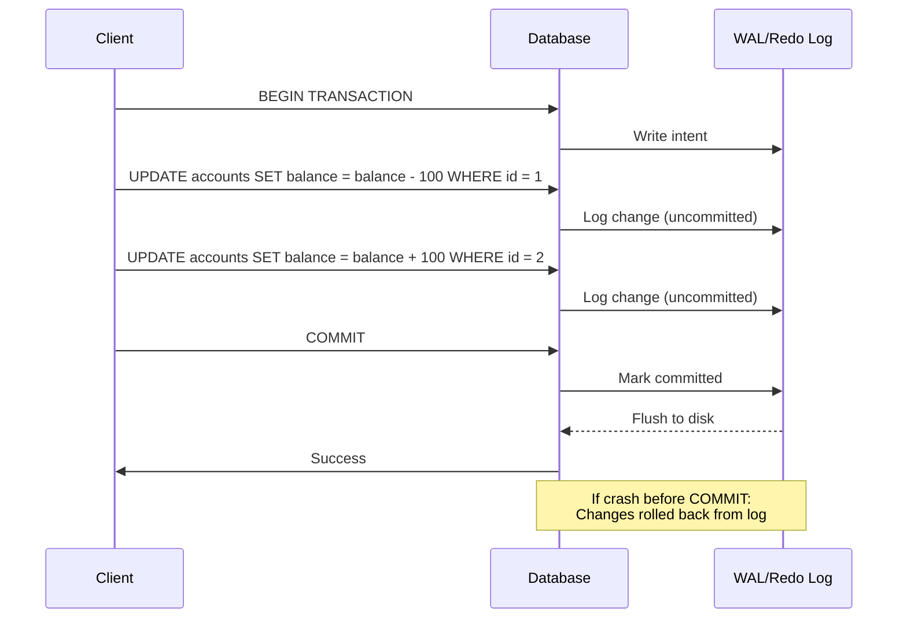

**Interview Point**: Explain how Write-Ahead Logging (WAL) ensures durability. Changes are written to the log before being applied to data pages.

### Isolation Levels

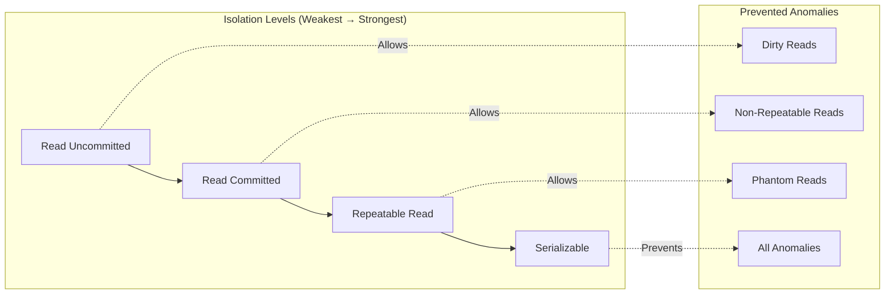

| Level | Dirty Read | Non-Repeatable Read | Phantom Read | Performance |
|-------|------------|---------------------|--------------|-------------|
| Read Uncommitted | ✓ | ✓ | ✓ | Fastest |
| Read Committed | ✗ | ✓ | ✓ | Fast |
| Repeatable Read | ✗ | ✗ | ✓ | Moderate |
| Serializable | ✗ | ✗ | ✗ | Slowest |

---

## NoSQL Categories

### Taxonomy

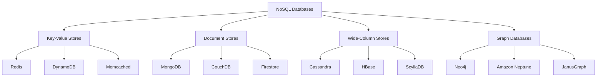

### Category Comparison

| Category | Data Model | Use Case | Trade-off |
|----------|------------|----------|-----------|
| **Key-Value** | Opaque blobs by key | Session, cache, config | No complex queries |
| **Document** | JSON/BSON documents | Content management, catalogs | Schema flexibility vs. JOIN complexity |
| **Wide-Column** | Rows with dynamic columns | Time-series, IoT, analytics | Write-optimized, read patterns must match |
| **Graph** | Nodes + edges | Social networks, recommendations | Traversal fast, aggregation slow |

---

## Document Stores Deep Dive (MongoDB)

### Data Model

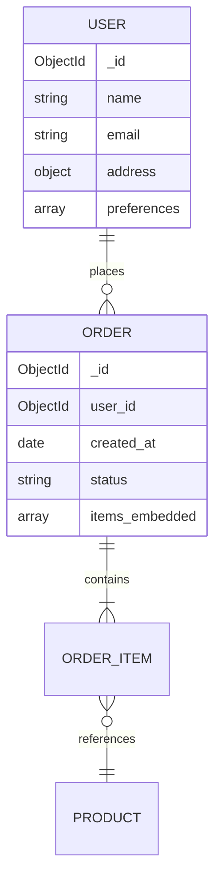

### Embedding vs. Referencing

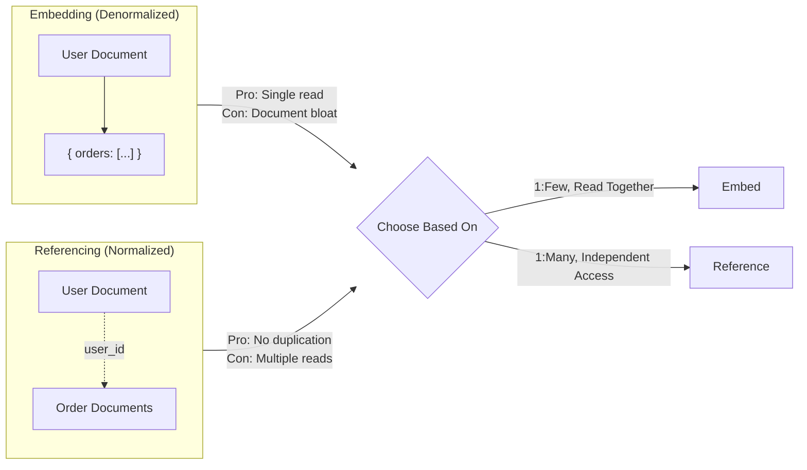

**Decision Heuristic**:
- Embed when data is always accessed together and bounded in size
- Reference when data grows unbounded or is accessed independently

---

## Wide-Column Stores Deep Dive (Cassandra)

### Data Model

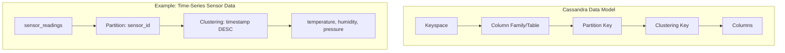

### Query Pattern Matching

```sql
-- Schema designed for specific access pattern
CREATE TABLE sensor_readings (
    sensor_id UUID,
    reading_time TIMESTAMP,
    temperature FLOAT,
    humidity FLOAT,
    PRIMARY KEY (sensor_id, reading_time)
) WITH CLUSTERING ORDER BY (reading_time DESC);

-- ✅ Supported: Query by partition key + clustering range
SELECT * FROM sensor_readings 
WHERE sensor_id = ? AND reading_time > ?;

-- ❌ Anti-pattern: Query without partition key (full scan)
SELECT * FROM sensor_readings 
WHERE temperature > 30;
```

**Interview Point**: Cassandra requires you to model data around query patterns, not around entities. This is the opposite of SQL normalization.

---

## CAP Theorem Application

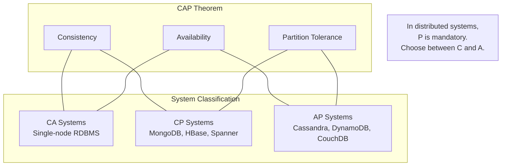

### Practical Interpretation

| Scenario | Choose CP | Choose AP |
|----------|-----------|-----------|
| Network partition occurs | Reject writes to maintain consistency | Accept writes, resolve conflicts later |
| Banking transactions | ✓ | |
| Social media posts | | ✓ |
| Inventory (low stock) | ✓ | |
| User preferences | | ✓ |

---

## Decision Framework

### Systematic Evaluation Checklist

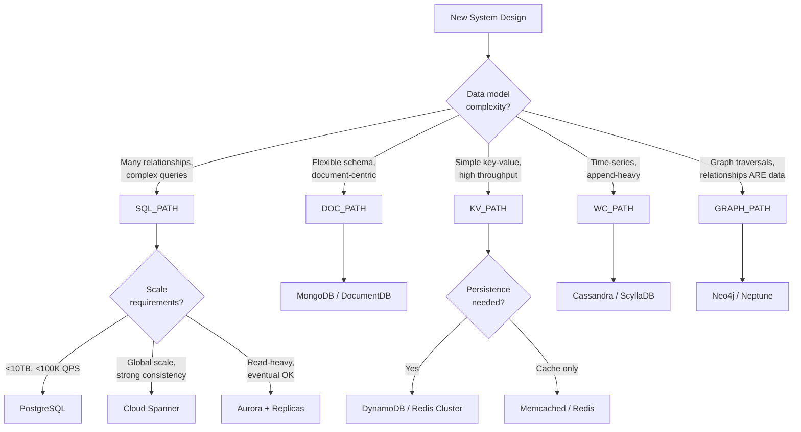

### Trade-off Matrix

| Requirement | SQL | Document | Wide-Column | Key-Value | Graph |
|-------------|-----|----------|-------------|-----------|-------|
| Complex JOINs | ★★★★★ | ★★☆☆☆ | ★☆☆☆☆ | ☆☆☆☆☆ | ★★★★☆ |
| Schema flexibility | ★★☆☆☆ | ★★★★★ | ★★★★☆ | ★★★★★ | ★★★☆☆ |
| Write throughput | ★★★☆☆ | ★★★★☆ | ★★★★★ | ★★★★★ | ★★★☆☆ |
| Horizontal scale | ★★☆☆☆ | ★★★★☆ | ★★★★★ | ★★★★★ | ★★★☆☆ |
| ACID transactions | ★★★★★ | ★★★☆☆ | ★★☆☆☆ | ★☆☆☆☆ | ★★★☆☆ |
| Operational simplicity | ★★★★☆ | ★★★☆☆ | ★★☆☆☆ | ★★★★★ | ★★★☆☆ |

---

## Common Interview Scenarios

### Scenario 1: E-Commerce Platform

**Requirements**: Product catalog, user accounts, orders, inventory

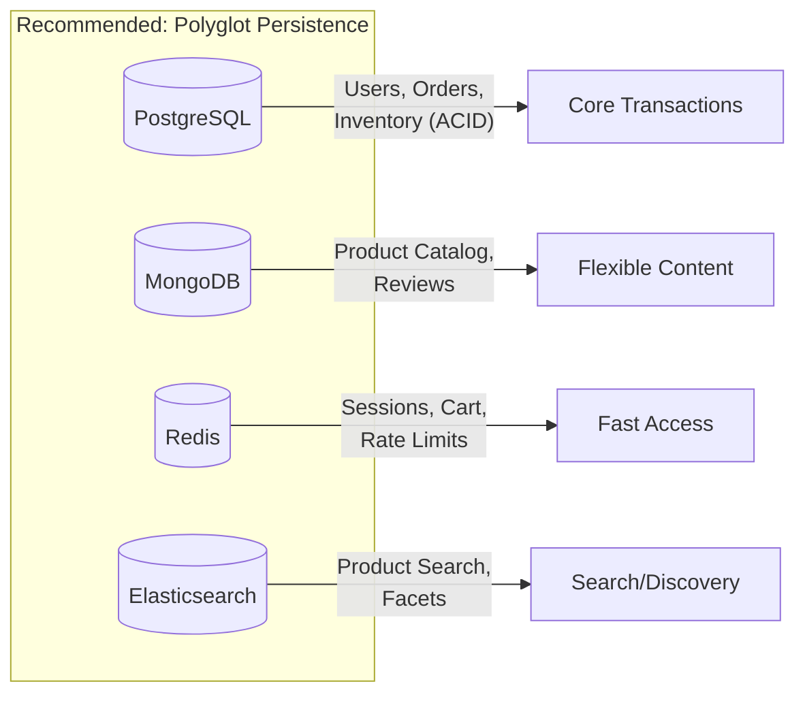

**Talking Points**:
- Orders require ACID → SQL
- Product attributes vary by category → Document store
- Session/cart data is ephemeral → Redis
- Full-text search → Elasticsearch

### Scenario 2: Social Network

**Requirements**: User profiles, posts, follows, feed generation

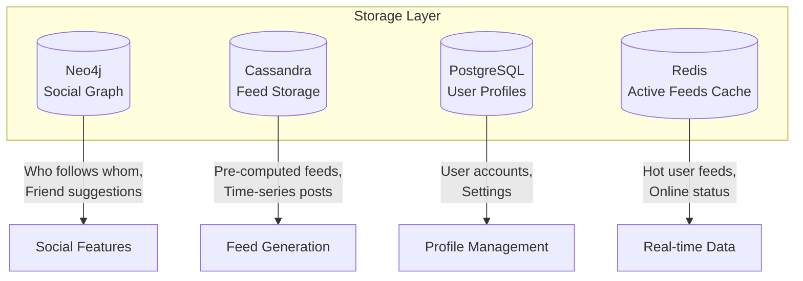

### Scenario 3: IoT Analytics

**Requirements**: Millions of sensors, time-series data, real-time dashboards

**Recommended**: Wide-column store (Cassandra/TimescaleDB)

**Why**:
- Append-only writes (perfect for LSM trees)
- Queries always include time range (partition by sensor + time)
- No complex JOINs needed
- Linear horizontal scaling

---

## Interview Tips

### What Interviewers Look For

1. **Systematic reasoning**: Don't jump to "use Postgres" without explaining why
2. **Trade-off awareness**: Every choice has costs; articulate them
3. **Real-world experience**: Mention operational concerns (backups, failover, monitoring)
4. **Polyglot thinking**: Best designs often use multiple databases

### Common Mistakes

| Mistake | Better Approach |
|---------|-----------------|
| "NoSQL scales better" | "NoSQL trades consistency for horizontal scale" |
| "MongoDB for everything" | "Document stores excel when schema flexibility matters" |
| "SQL can't scale" | "SQL scales with read replicas, sharding, or NewSQL" |
| Ignoring operational cost | Consider team expertise, managed services, vendor lock-in |

### Key Phrases to Use

- "Given the read/write ratio of X:Y..."
- "Since we need strong consistency for..."
- "The query pattern suggests..."
- "To optimize for the hot path..."
- "The trade-off here is..."

---

## Quick Reference Card

```
┌─────────────────────────────────────────────────────────────────┐
│                    DATABASE SELECTION CHEAT SHEET               │
├─────────────────────────────────────────────────────────────────┤
│ ACID Required?           → Start with SQL (PostgreSQL)          │
│ Flexible Schema?         → Document Store (MongoDB)             │
│ Simple K/V, High Speed?  → Redis / DynamoDB                     │
│ Time-Series, Write-Heavy? → Wide-Column (Cassandra)             │
│ Relationship Traversal?  → Graph DB (Neo4j)                     │
│ Global Strong Consistency? → NewSQL (Spanner, CockroachDB)      │
│ Full-Text Search?        → Elasticsearch (+ primary DB)         │
├─────────────────────────────────────────────────────────────────┤
│ REMEMBER: Most systems benefit from polyglot persistence        │
│ Use the right tool for each data type / access pattern          │
└─────────────────────────────────────────────────────────────────┘
```

---

## Practice Questions

1. Design a database schema for a ride-sharing app. Which databases would you use and why?
2. Your e-commerce site has 10M products with varying attributes. How do you store them?
3. Explain how you'd migrate from a monolithic SQL database to a microservices architecture with multiple databases.
4. A social network needs to store and query follower relationships. Compare SQL JOINs vs. graph database for this use case.
5. Your write volume is 1M events/second. Which database technology fits best?
