# 03 — Data Management

> The heart of most systems is how they store, organize, and retrieve data.

**Prerequisites:** [01 — Foundational Concepts](./01-FOUNDATIONAL-CONCEPTS.md)  
**Builds toward:** [06 — Consistency & Consensus](./06-CONSISTENCY-CONSENSUS.md)  
**Estimated study time:** 3-4 hours

---

## Chapter Overview

This module covers data storage, organization, and access patterns—the decisions that often define system behavior.

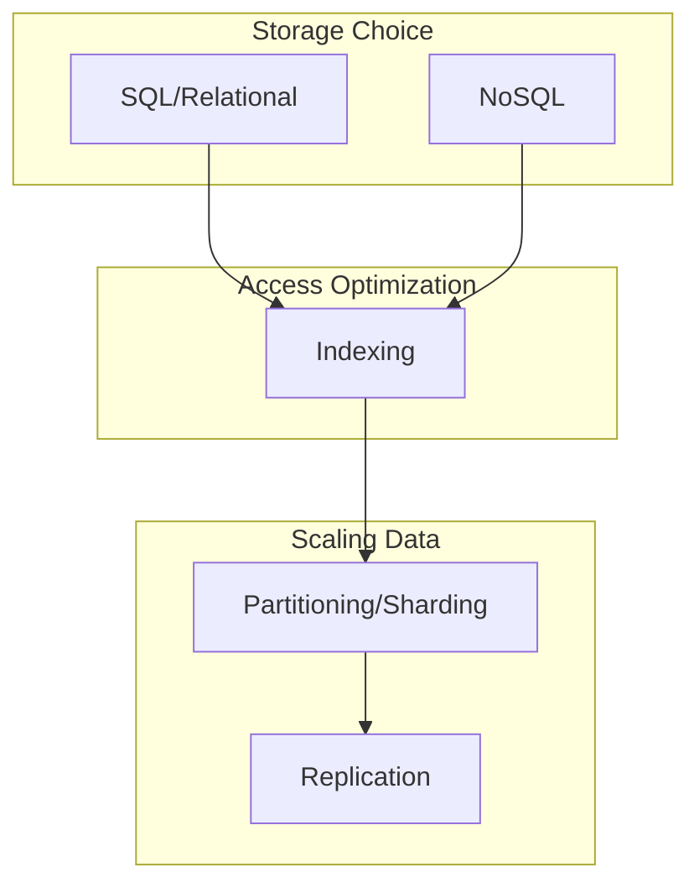

---

## 1. SQL vs NoSQL Databases

### Relational Databases (SQL)

Store data in tables with rows and columns, enforcing relationships through foreign keys.

**Core Properties (ACID):**

| Property | Meaning | Implication |
|----------|---------|-------------|
| **Atomicity** | All-or-nothing transactions | Partial updates never visible |
| **Consistency** | Data always valid per constraints | Referential integrity maintained |
| **Isolation** | Concurrent transactions don't interfere | Appears as if executed serially |
| **Durability** | Committed data survives failures | Written to persistent storage |

**When to choose SQL:**
- Data is structured with clear relationships
- Need complex queries (JOINs, aggregations)
- Require strong consistency and transactions
- Schema is stable and well-understood

### NoSQL Databases

A broad category of non-relational databases optimized for specific access patterns.

**Core Properties (BASE):**

| Property | Meaning |
|----------|---------|
| **Basically Available** | System always responds (possibly stale data) |
| **Soft state** | State may change over time without input |
| **Eventually consistent** | Data will become consistent eventually |

### NoSQL Categories

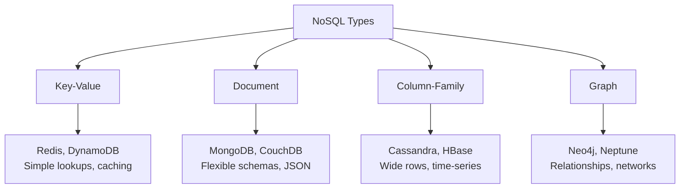

| Type | Data Model | Best For | Example |
|------|------------|----------|---------|
| **Key-Value** | Key → Value blob | Caching, sessions, simple lookups | Redis, DynamoDB |
| **Document** | Key → JSON/BSON document | Flexible schemas, nested data | MongoDB, CouchDB |
| **Column-Family** | Row key → Column families | Time-series, heavy writes | Cassandra, HBase |
| **Graph** | Nodes + Edges | Relationships, social networks | Neo4j, Neptune |

### SQL vs NoSQL Comparison

| Dimension | SQL | NoSQL |
|-----------|-----|-------|
| **Schema** | Fixed, predefined | Flexible, schema-on-read |
| **Scalability** | Vertical (typically) | Horizontal (designed for it) |
| **Consistency** | Strong (ACID) | Often eventual (BASE) |
| **Transactions** | Full support | Limited or single-document |
| **Query** | Rich SQL language | Varies by type, often simpler |
| **Relationships** | JOINs | Denormalization or app-level |

### Decision Framework

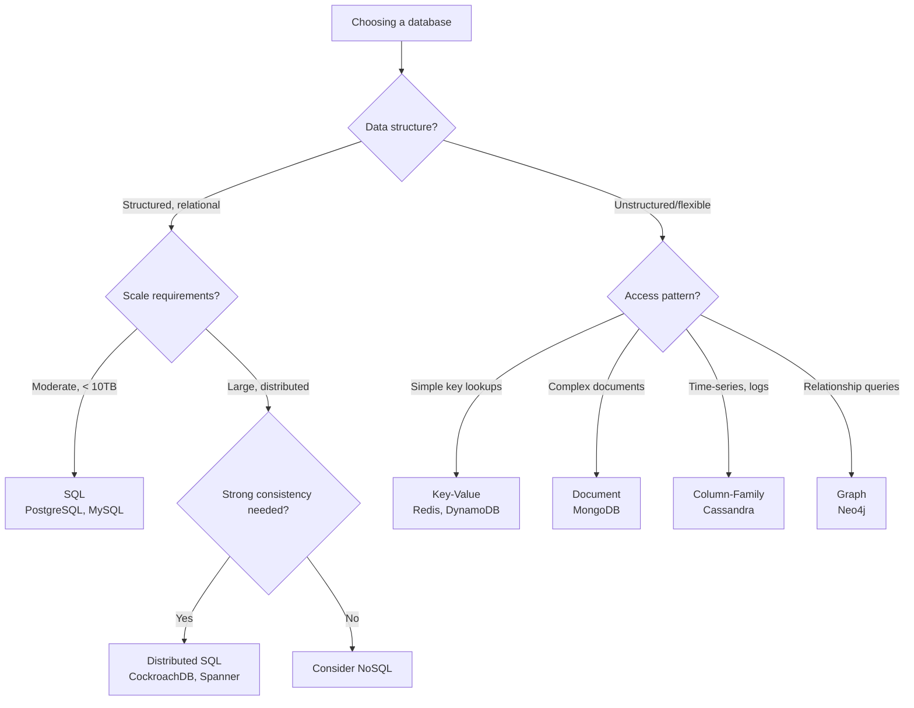

### Polyglot Persistence

Modern systems often use multiple databases, each for its strength:

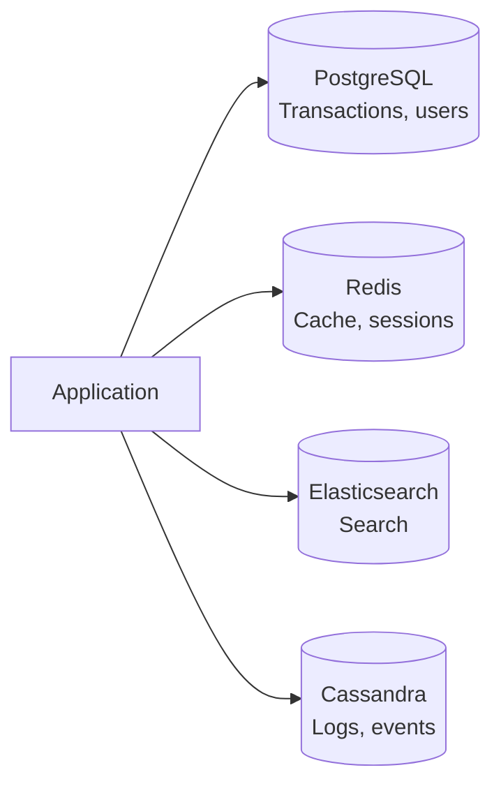

**Example: E-commerce system**
- PostgreSQL: Orders, inventory, user accounts (transactional)
- Redis: Session data, shopping carts (fast access)
- Elasticsearch: Product search (full-text)
- Cassandra: Click streams, analytics (high-volume writes)

---

## 2. Database Indexing

### What Is an Index?

An index is a data structure that improves query speed at the cost of additional storage and write overhead.

**Analogy:** Like a book's index—instead of reading every page, you look up the topic and jump directly to the page number.

```mermaid
graph LR
    subgraph "Without Index"
        T1[Table] --> Scan[Full Table Scan<br/>O(n)]
    end
    
    subgraph "With Index"
        I[Index] --> Lookup[Index Lookup<br/>O(log n)]
        Lookup --> Row[Direct Row Access]
    end
```

### Index Types

| Type | Structure | Best For | Limitation |
|------|-----------|----------|------------|
| **B-Tree** | Balanced tree | Range queries, equality | General purpose |
| **Hash** | Hash table | Equality only | No range queries |
| **Full-Text** | Inverted index | Text search | Storage overhead |
| **Composite** | Multi-column B-tree | Multi-column queries | Column order matters |

### B-Tree Index (Most Common)

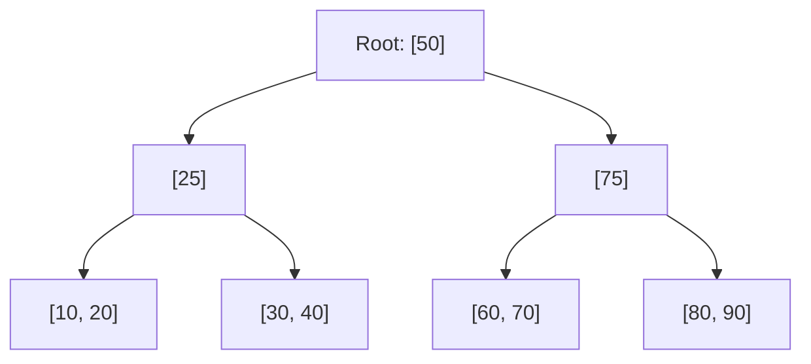

**Properties:**
- Balanced: All leaf nodes at same depth
- Sorted: Enables range queries
- Logarithmic: O(log n) lookup

### Hash Index

**How it works:** Hash function maps key to bucket location

**Pros:** O(1) for equality lookups  
**Cons:** Cannot do range queries, no ordering

```
hash("user_123") → bucket_42 → row pointer
```

**Use when:** Only doing exact-match queries on high-cardinality column

### Composite Index

Index on multiple columns. **Column order matters!**

```sql
CREATE INDEX idx_user_date ON orders(user_id, order_date);
```

**Can use this index for:**
- `WHERE user_id = 123`
- `WHERE user_id = 123 AND order_date > '2024-01-01'`

**Cannot use for:**
- `WHERE order_date > '2024-01-01'` (missing leading column)

### Indexing Trade-offs

| Aspect | Benefit | Cost |
|--------|---------|------|
| **Read speed** | Faster queries | — |
| **Write speed** | — | Slower inserts/updates |
| **Storage** | — | Additional disk space |
| **Maintenance** | — | Index fragmentation over time |

**Guideline:** Index columns that appear in:
- WHERE clauses (filtering)
- JOIN conditions
- ORDER BY clauses
- Columns with high selectivity (many unique values)

### Index Interview Questions

> "Why not index every column?"

**Answer:** Each index adds write overhead (must update index on every insert/update/delete) and storage cost. The benefit must outweigh the cost.

> "What's a covering index?"

**Answer:** An index that contains all columns needed for a query, allowing the query to be satisfied entirely from the index without accessing the table.

---

## 3. Data Partitioning (Sharding)

### Why Partition?

When a single database can't handle the data volume or request rate:
- **Scale writes:** Distribute write load across machines
- **Scale storage:** Data exceeds single machine capacity
- **Reduce query scope:** Each partition has less data to search

### Partitioning Methods

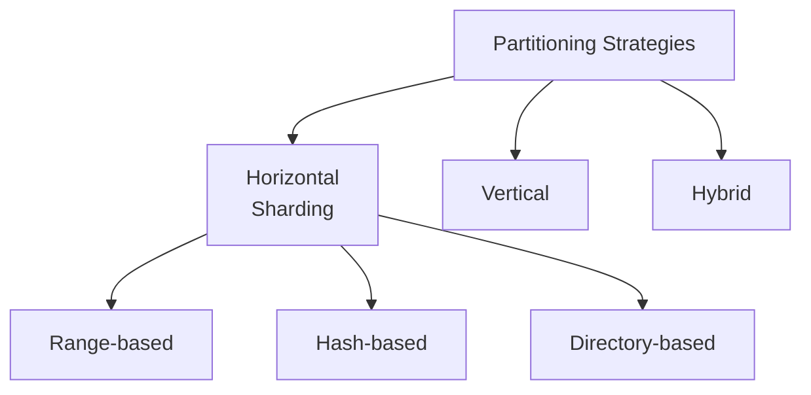

### Horizontal Partitioning (Sharding)

Divide rows across multiple databases based on a **partition key**.

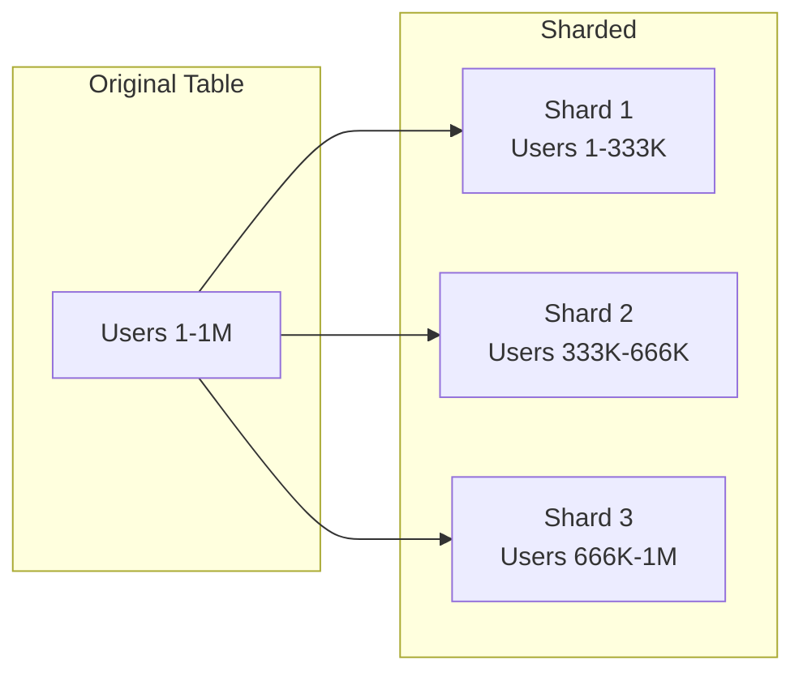

### Sharding Strategies

#### Range-Based Sharding

Partition by ranges of the partition key.

| Range | Shard |
|-------|-------|
| A-H | Shard 1 |
| I-P | Shard 2 |
| Q-Z | Shard 3 |

**Pros:** Simple, range queries possible  
**Cons:** Hot spots if data isn't evenly distributed

#### Hash-Based Sharding

Apply hash function to partition key.

```
shard_id = hash(user_id) % num_shards
```

**Pros:** Even distribution  
**Cons:** No range queries, adding shards requires rehashing

#### Directory-Based Sharding

Lookup table maps keys to shards.

```
Directory:
  user_123 → shard_2
  user_456 → shard_1
  user_789 → shard_3
```

**Pros:** Flexible, can rebalance without rehashing  
**Cons:** Directory becomes dependency, potential bottleneck

### Choosing a Partition Key

The partition key determines data distribution. Bad choices cause **hot spots**.

| Consideration | Good | Bad |
|---------------|------|-----|
| **Cardinality** | High (many unique values) | Low (few values) |
| **Distribution** | Even spread | Skewed (few values very common) |
| **Query patterns** | Often in WHERE clause | Rarely queried |

**Example: E-commerce orders**
- `user_id`: Good if users have similar order volumes
- `order_date`: Bad—recent dates get all writes
- `order_id`: Good for distribution, bad for user queries

### Vertical Partitioning

Split columns across databases (different access patterns).

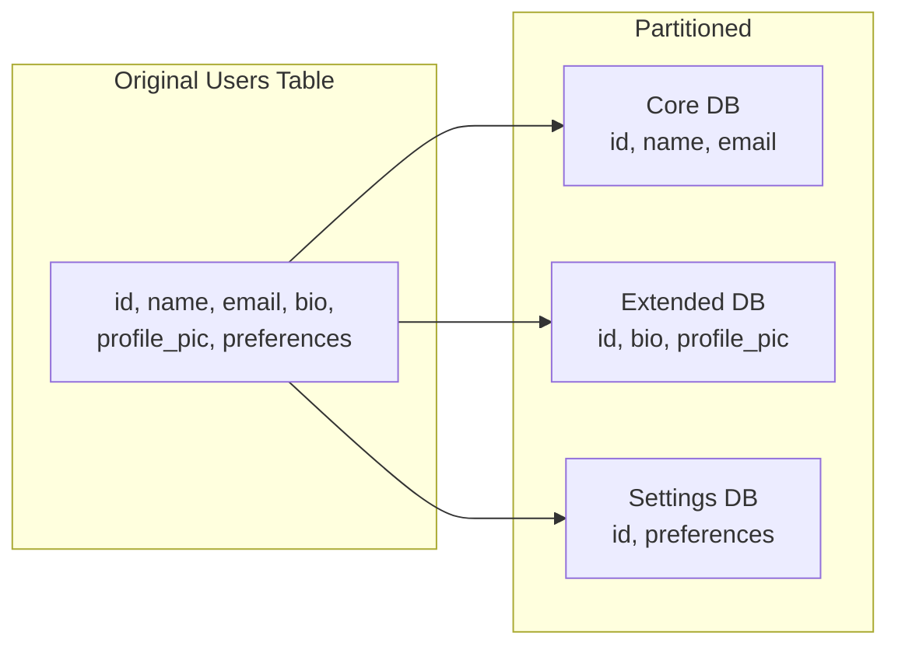

**When to use:**
- Some columns accessed far more frequently
- Some columns much larger (BLOBs)
- Different access patterns (transactional vs analytical)

### Sharding Challenges

| Challenge | Description | Mitigation |
|-----------|-------------|------------|
| **Cross-shard queries** | JOINs across shards are expensive | Denormalize, application-level joins |
| **Transactions** | ACID across shards is hard | Saga pattern, eventual consistency |
| **Rebalancing** | Adding shards moves data | Consistent hashing, directory-based |
| **Hot spots** | Uneven load | Better partition key, splitting |
| **Operational complexity** | More databases to manage | Automation, managed services |

---

## 4. Data Replication

### Why Replicate?

- **Availability:** System survives node failures
- **Durability:** Data survives disk failures
- **Performance:** Read replicas reduce load, geographic replicas reduce latency

### Replication Topologies

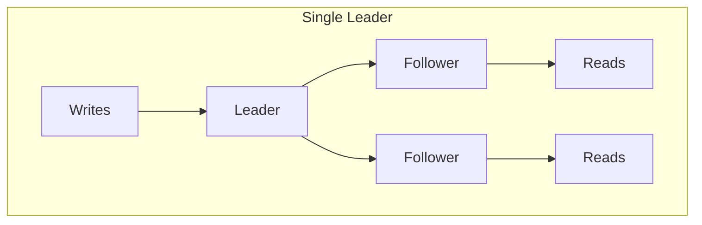

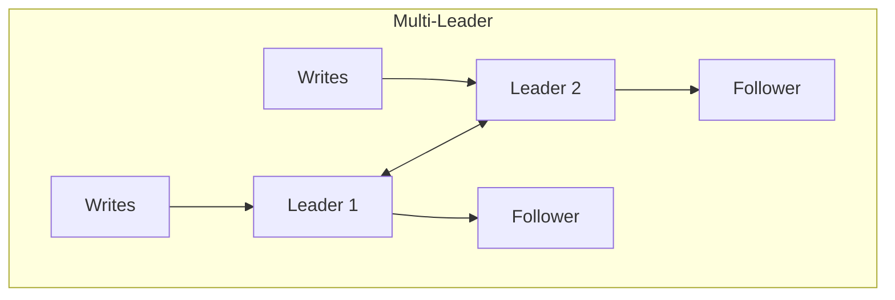

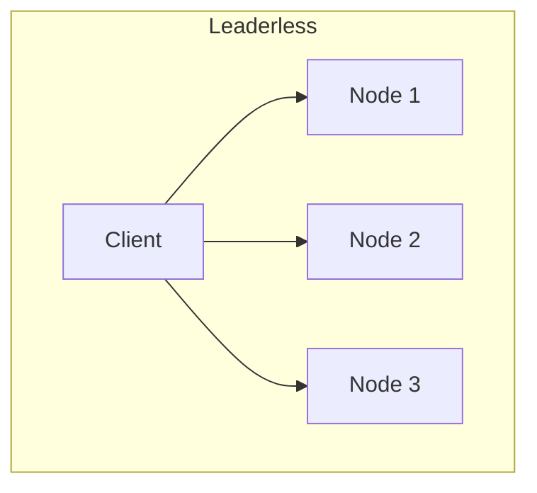

### Replication Strategies Comparison

| Topology | Consistency | Availability | Conflict | Use Case |
|----------|-------------|--------------|----------|----------|
| **Single Leader** | Strong (sync) or eventual (async) | Medium | None | Most applications |
| **Multi-Leader** | Eventual | High | Must resolve | Multi-datacenter |
| **Leaderless** | Tunable | Very High | Must resolve | High availability (Dynamo) |

### Synchronous vs Asynchronous Replication

| Aspect | Synchronous | Asynchronous |
|--------|-------------|--------------|
| **Write latency** | Higher (wait for replicas) | Lower |
| **Consistency** | Strong | Eventual |
| **Durability** | Guaranteed on commit | Potential data loss |
| **Availability** | Lower (needs quorum) | Higher |

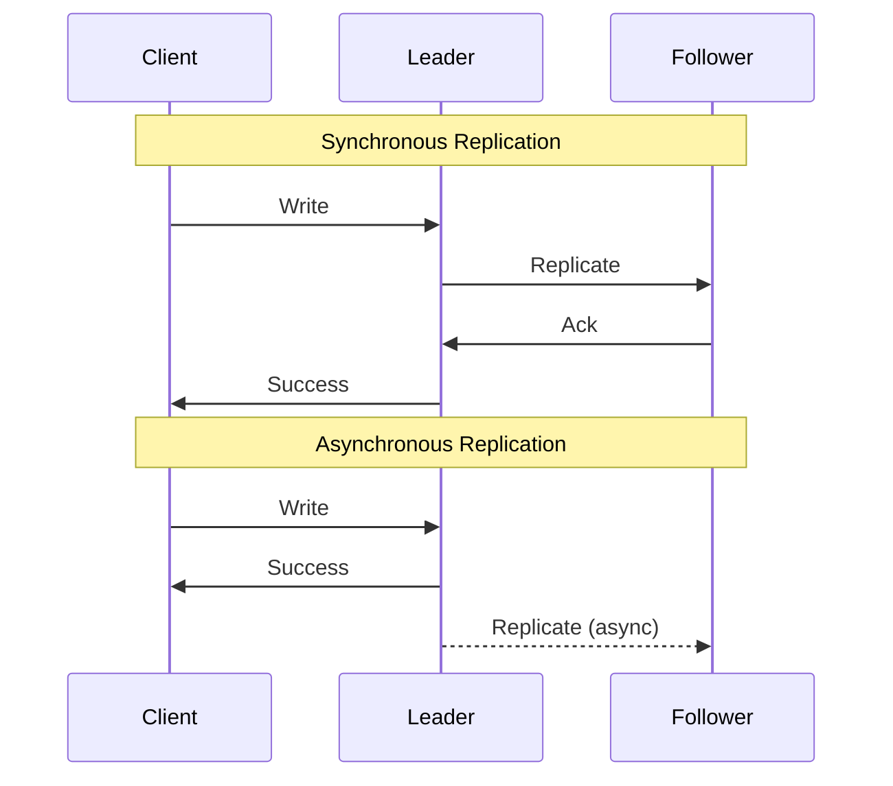

### Replication Lag

In async replication, followers may be behind the leader.

**Problems:**
- Read-your-writes inconsistency
- Stale reads
- Causality violations

**Solutions:**
- Read from leader for critical reads
- Monotonic reads (stick to one replica)
- Session consistency

---

## 5. SQL Normalization and Denormalization

### Normalization

Organizing data to reduce redundancy and dependency.

**Normal Forms:**

| Form | Rule | Example Violation |
|------|------|-------------------|
| **1NF** | Atomic values, no repeating groups | `tags: "red, blue, green"` |
| **2NF** | 1NF + no partial dependencies | Non-key depends on part of composite key |
| **3NF** | 2NF + no transitive dependencies | Non-key depends on another non-key |

**Benefits:**
- Eliminates update anomalies
- Reduces storage (no duplicate data)
- Single source of truth

**Costs:**
- More JOINs needed
- Complex queries
- Slower reads

### Denormalization

Intentionally adding redundancy to improve read performance.

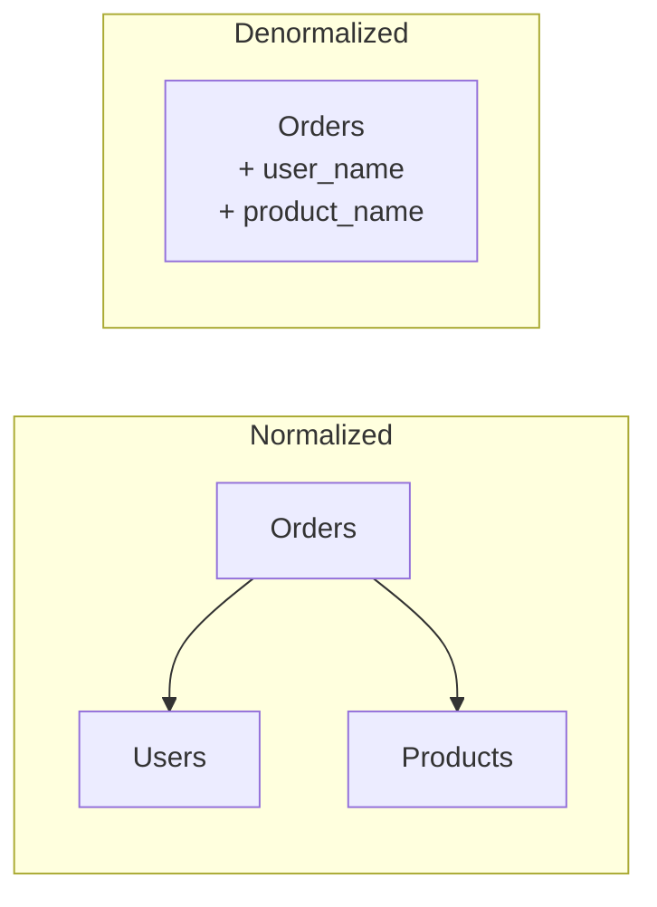

**When to denormalize:**
- Read-heavy workloads
- Performance-critical queries
- Data rarely changes

**Trade-offs:**
- Faster reads
- Slower writes (update multiple places)
- Risk of inconsistency

### Interview Pattern

> "Should we normalize or denormalize?"

**Framework:**
1. Start normalized (correct by default)
2. Identify slow queries
3. Denormalize specific hot paths
4. Accept maintenance cost for performance gain

---

## 6. Database Federation

### What Is Federation?

A single logical view across multiple autonomous databases.

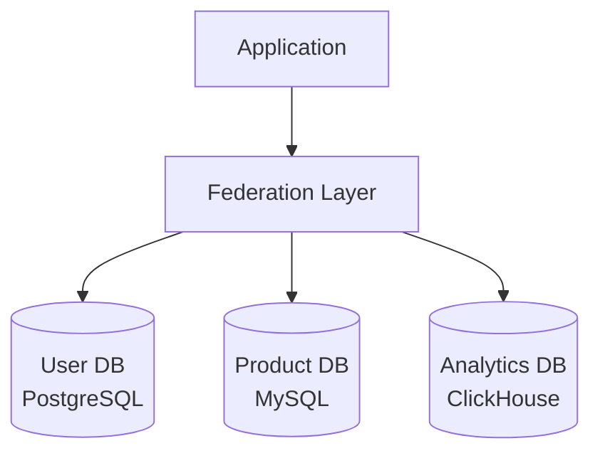

**Use cases:**
- Microservices with separate databases
- Gradual migration between systems
- Combining OLTP and OLAP

**Challenges:**
- No cross-database transactions
- Query complexity
- Consistency between systems

---

## 7. Chapter Summary

### Key Concepts

| Concept | One-Line Definition |
|---------|---------------------|
| ACID | Relational DB transaction guarantees |
| BASE | NoSQL consistency model (eventual) |
| Index | Data structure for faster queries |
| Sharding | Horizontal partitioning across machines |
| Replication | Copying data for availability/performance |
| Normalization | Reducing redundancy in schema |
| Denormalization | Adding redundancy for read performance |

### Decision Checklist

- [ ] SQL vs NoSQL: based on data structure, consistency needs, scale
- [ ] Index strategy: WHERE clauses, JOINs, selectivity
- [ ] Partition key: cardinality, distribution, query patterns
- [ ] Replication topology: consistency vs availability trade-off
- [ ] Normalize first, denormalize for performance

---

## Navigation

**Previous:** [02 — Networking & Communication](./02-NETWORKING-COMMUNICATION.md)  
**Next:** [04 — Caching & CDN](./04-CACHING-CDN.md)  
**Index:** [00 — Handbook Index](./00-INDEX.md)
