# Kafka Architecture — Deep Dive

> A distributed commit log that changed how we think about data pipelines.

**Prerequisites:** [Communication Patterns](./02_COMMUNICATION_PATTERNS.md), [Replication & Partitioning](./06_REPLICATION_AND_PARTITIONING.md)
**Related:** [Consensus Protocols](./DD_CONSENSUS_PROTOCOLS.md) (for replication), [Storage Engines](./DD_STORAGE_ENGINES.md) (for log structure)
**Estimated study time:** 2.5-3 hours

---

## Table of Contents

1. [Context & The Log Abstraction](#1-context--the-log-abstraction)
2. [Core Architecture](#2-core-architecture)
3. [Partitioning & Ordering Guarantees](#3-partitioning--ordering-guarantees)
4. [Producer Internals](#4-producer-internals)
5. [Consumer Groups & Rebalancing](#5-consumer-groups--rebalancing)
6. [Replication & Durability](#6-replication--durability)
7. [Exactly-Once Semantics](#7-exactly-once-semantics)
8. [Storage: Segments & Compaction](#8-storage-segments--compaction)
9. [Performance Deep-Dive](#9-performance-deep-dive)
10. [Production Patterns](#10-production-patterns)
11. [Failure Scenarios](#11-failure-scenarios)
12. [Interview Articulation](#12-interview-articulation)
13. [Quick Reference Card](#13-quick-reference-card)
14. [References](#references)

---

## 1. Context & The Log Abstraction

### Why Kafka Exists: LinkedIn's Scale Problem

In 2010, LinkedIn faced a data integration crisis. Activity data (page views, clicks, searches) needed to flow to multiple systems: offline analytics, real-time dashboards, search indexes, recommendation engines. The traditional approach—point-to-point connections—created an O(n²) integration nightmare.

**The problem with point-to-point**:
- M data sources × N data sinks = M×N connections
- Each connection has different protocols, formats, failure modes
- Adding one new system requires N new integrations
- Schema changes cascade through the entire graph

Kreps, Narkhede, and Rao (2011) designed Kafka to solve this by introducing a **central commit log** that decouples producers from consumers.

### The Log as Fundamental Data Structure

A log is an append-only, totally-ordered sequence of records:

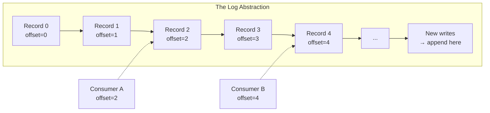
```mermaid
flowchart LR
    subgraph "The Log Abstraction"
        direction LR
        R0["Record 0<br/>offset=0"]
        R1["Record 1<br/>offset=1"]
        R2["Record 2<br/>offset=2"]
        R3["Record 3<br/>offset=3"]
        R4["Record 4<br/>offset=4"]
        FUTURE["..."]
        WRITE["New writes<br/>→ append here"]

        R0 --> R1 --> R2 --> R3 --> R4 --> FUTURE --> WRITE
    end

    READER1["Consumer A<br/>offset=2"] -.-> R2
    READER2["Consumer B<br/>offset=4"] -.-> R4
```

**Key properties**:

| Property | Implication |
|----------|-------------|
| **Append-only** | Writes are O(1), always sequential |
| **Immutable** | No in-place updates; simplifies replication |
| **Ordered** | Total ordering within partition |
| **Offset-based** | Consumers track position independently |
| **Persistent** | Survives restarts; enables replay |

### Append-Only Semantics and Immutability

Immutability is not a limitation—it's a **design choice with profound implications**:

```python
# Kafka's log model (conceptual)
class CommitLog:
    """
    Append-only commit log with immutable records.

    Immutability enables:
    1. Safe replication (no conflict resolution needed)
    2. Parallel reads (no locking)
    3. Deterministic replay (same input → same output)
    4. Efficient caching (pages never invalidate)
    """

    def __init__(self):
        self.records = []
        self.next_offset = 0

    def append(self, record: bytes) -> int:
        """
        Append record and return its offset.
        O(1) operation - always writes to end.
        """
        offset = self.next_offset
        self.records.append((offset, record))
        self.next_offset += 1
        return offset

    def read(self, offset: int, max_records: int) -> List[Tuple[int, bytes]]:
        """
        Read records starting from offset.
        O(1) seek (offset is array index) + O(k) read.
        """
        return self.records[offset:offset + max_records]

    # Note: No update() or delete() methods!
```

### Log vs Queue vs Pub-Sub Comparison

| Characteristic | Traditional Queue | Pub-Sub | Kafka Log |
|----------------|-------------------|---------|-----------|
| **Message retention** | Deleted on consume | Deleted on consume | Retained (time/size-based) |
| **Consumer model** | Competing consumers | Broadcast to all | Consumer groups |
| **Replay** | Not possible | Not possible | Full replay from offset |
| **Ordering** | Queue-level | Topic-level (often) | Partition-level |
| **Delivery guarantee** | At-most-once typical | At-most-once typical | At-least-once / exactly-once |
| **Backpressure** | Queue depth limits | Slow consumer problem | Consumer controls pace |
| **Scalability** | Vertical (mostly) | Fan-out limited | Horizontal (partitions) |

**Why the log model wins for data pipelines**:

1. **Decoupling in time**: Consumers can be offline; they catch up from their offset
2. **Decoupling in processing**: Fast consumers don't wait for slow ones
3. **Auditability**: Full history for debugging, compliance, analytics
4. **Reprocessing**: Fix bugs by replaying with corrected logic

---

## 2. Core Architecture

### Brokers, Topics, Partitions

Kafka's architecture consists of three primary concepts:

```mermaid
flowchart TB
    subgraph "Kafka Cluster"
        subgraph "Broker 1"
            TP0["Topic A<br/>Partition 0<br/>(Leader)"]
            TP1B1["Topic A<br/>Partition 1<br/>(Follower)"]
            TC0["Topic B<br/>Partition 0<br/>(Follower)"]
        end

        subgraph "Broker 2"
            TP1["Topic A<br/>Partition 1<br/>(Leader)"]
            TP2B2["Topic A<br/>Partition 2<br/>(Follower)"]
            TC0B2["Topic B<br/>Partition 0<br/>(Leader)"]
        end

        subgraph "Broker 3"
            TP2["Topic A<br/>Partition 2<br/>(Leader)"]
            TP0B3["Topic A<br/>Partition 0<br/>(Follower)"]
            TP1B3["Topic A<br/>Partition 1<br/>(Follower)"]
        end
    end

    subgraph "Coordination"
        ZK["ZooKeeper<br/>(or KRaft)"]
    end

    ZK -.->|"Metadata"| Broker 1
    ZK -.->|"Metadata"| Broker 2
    ZK -.->|"Metadata"| Broker 3
```

**Broker**: A single Kafka server that stores data and serves clients
- Handles produce/consume requests
- Manages local log segments
- Participates in replication
- Typical cluster: 3-100+ brokers

**Topic**: A category or feed name to which records are published
- Logical grouping of related messages
- Configured with retention policy, replication factor
- Examples: `user-events`, `order-updates`, `audit-logs`

**Partition**: A single ordered log within a topic
- Unit of parallelism and ordering
- Each partition is an independent log
- Partitions are distributed across brokers

### ZooKeeper's Role (and KRaft Migration)

Historically, Kafka depended on ZooKeeper for:

| Function | ZooKeeper's Role |
|----------|------------------|
| **Controller election** | Ephemeral znodes for leader election |
| **Broker membership** | Tracks live brokers via sessions |
| **Topic configuration** | Stores partition assignments, configs |
| **ACLs** | Security and authorization metadata |
| **Consumer offsets** (legacy) | Pre-0.9 offset storage |

**KRaft (Kafka Raft) Migration**:

KIP-500 introduced a self-managed metadata quorum, eliminating ZooKeeper:

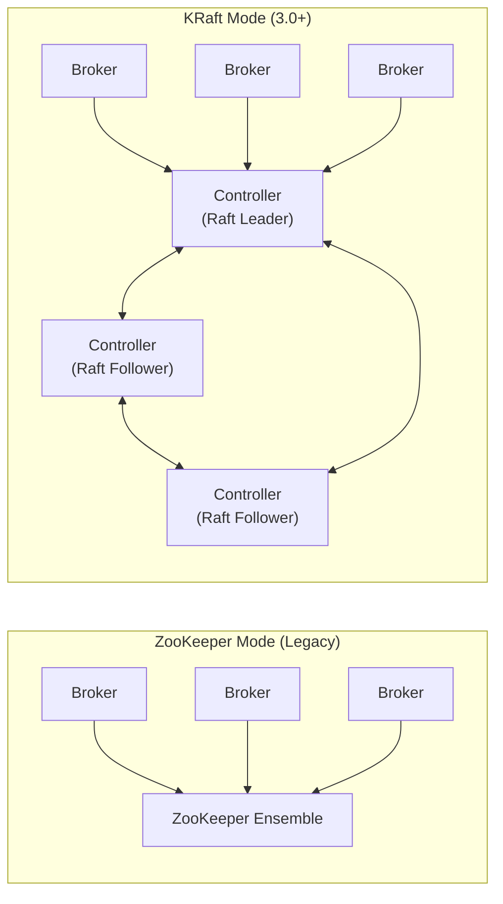
```mermaid
flowchart LR
    subgraph "ZooKeeper Mode (Legacy)"
        ZK["ZooKeeper Ensemble"]
        B1["Broker"] --> ZK
        B2["Broker"] --> ZK
        B3["Broker"] --> ZK
    end

    subgraph "KRaft Mode (3.0+)"
        C1["Controller<br/>(Raft Leader)"]
        C2["Controller<br/>(Raft Follower)"]
        C3["Controller<br/>(Raft Follower)"]

        C1 <--> C2
        C2 <--> C3
        C1 <--> C3

        B1K["Broker"] --> C1
        B2K["Broker"] --> C1
        B3K["Broker"] --> C1
    end
```

**KRaft benefits**:
- Single system to deploy and operate
- Faster controller failover (seconds vs minutes)
- Scales to millions of partitions
- Simplified security model

### Controller Election

The controller is a special broker responsible for:
- Partition leader election
- Replica state management
- Broker failure handling

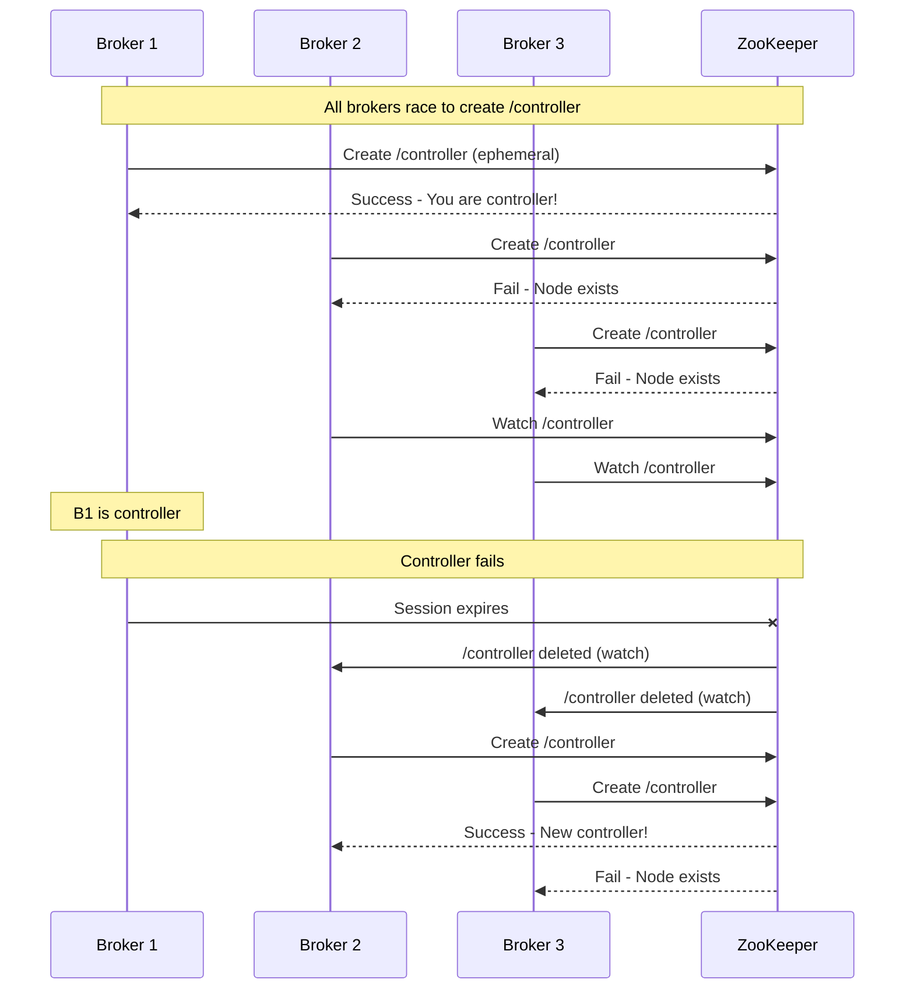
```mermaid
sequenceDiagram
    participant B1 as Broker 1
    participant B2 as Broker 2
    participant B3 as Broker 3
    participant ZK as ZooKeeper

    Note over B1,ZK: All brokers race to create /controller

    B1->>ZK: Create /controller (ephemeral)
    ZK-->>B1: Success - You are controller!

    B2->>ZK: Create /controller
    ZK-->>B2: Fail - Node exists

    B3->>ZK: Create /controller
    ZK-->>B3: Fail - Node exists

    B2->>ZK: Watch /controller
    B3->>ZK: Watch /controller

    Note over B1: B1 is controller

    Note over B1,ZK: Controller fails

    B1-xZK: Session expires
    ZK->>B2: /controller deleted (watch)
    ZK->>B3: /controller deleted (watch)

    B2->>ZK: Create /controller
    B3->>ZK: Create /controller
    ZK-->>B2: Success - New controller!
    ZK-->>B3: Fail - Node exists
```

### Metadata Management

Kafka maintains several categories of metadata:

| Metadata Type | Contents | Storage |
|---------------|----------|---------|
| **Cluster** | Broker IDs, endpoints, rack info | ZK/KRaft |
| **Topics** | Names, partition count, configs | ZK/KRaft |
| **Partitions** | Leader, replicas, ISR per partition | ZK/KRaft |
| **Offsets** | Consumer group positions | `__consumer_offsets` topic |
| **Transactions** | Transaction state, PIDs | `__transaction_state` topic |

**Metadata propagation**:
- Controller pushes updates to brokers via `UpdateMetadata` requests
- Clients fetch metadata from any broker
- Clients cache metadata locally, refresh on errors

---

## 3. Partitioning & Ordering Guarantees

### Partition as Unit of Parallelism AND Ordering

This is Kafka's fundamental design trade-off:

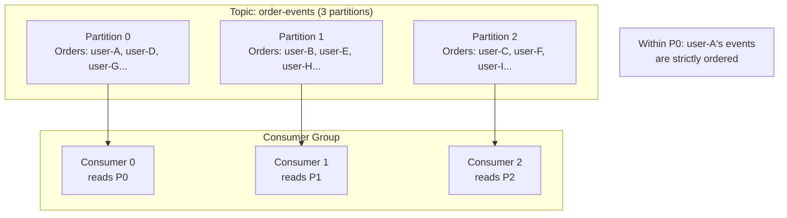
```mermaid
flowchart TB
    subgraph "Topic: order-events (3 partitions)"
        P0["Partition 0<br/>Orders: user-A, user-D, user-G..."]
        P1["Partition 1<br/>Orders: user-B, user-E, user-H..."]
        P2["Partition 2<br/>Orders: user-C, user-F, user-I..."]
    end

    subgraph "Consumer Group"
        C0["Consumer 0<br/>reads P0"]
        C1["Consumer 1<br/>reads P1"]
        C2["Consumer 2<br/>reads P2"]
    end

    P0 --> C0
    P1 --> C1
    P2 --> C2

    NOTE["Within P0: user-A's events<br/>are strictly ordered"]
```

**Key insight**: Ordering is guaranteed **only within a partition**. Events for the same entity (user, order, account) must go to the same partition.

### Key-Based Partitioning

The default partitioner uses:

```python
def partition(key: bytes, num_partitions: int) -> int:
    """
    Consistent partition assignment based on key.

    Same key always maps to same partition (assuming partition count unchanged).
    Uses murmur2 hash for uniform distribution.
    """
    if key is None:
        # No key: round-robin or sticky partitioner
        return round_robin_counter++ % num_partitions

    # Consistent hashing on key
    hash_value = murmur2(key)
    # Positive modulo
    return (hash_value & 0x7fffffff) % num_partitions
```

**Partitioning strategies**:

| Strategy | When to Use | Example |
|----------|-------------|---------|
| **Key-based** | Need ordering per entity | `user_id` for user events |
| **Round-robin** | Maximum throughput, no ordering | Log aggregation |
| **Custom** | Business logic determines partition | Geographic routing |

### Ordering Guarantees: Within Partition Only

**Guarantee**: Messages with the same key are:
1. Written to the same partition
2. Appended in producer send order (with `max.in.flight.requests.per.connection=1` or idempotence)
3. Read in that order by consumers

**Non-guarantee**: No ordering between partitions

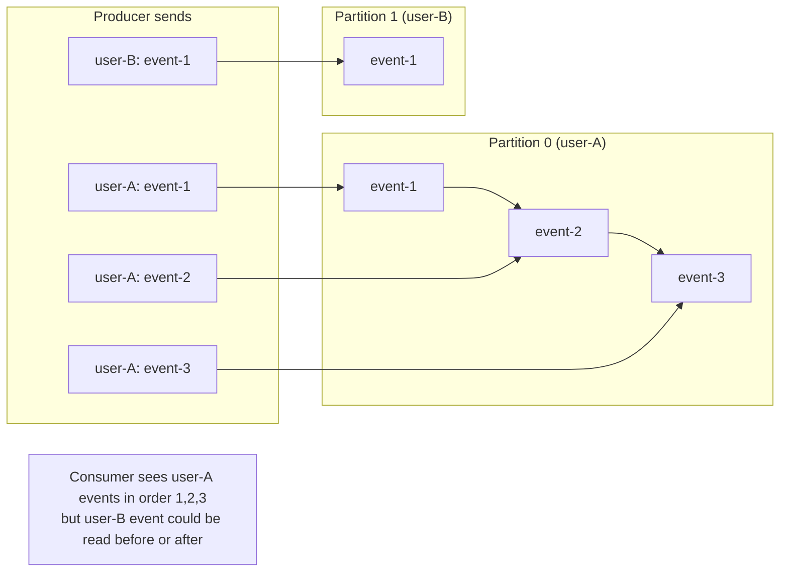
```mermaid
flowchart LR
    subgraph "Producer sends"
        E1["user-A: event-1"]
        E2["user-B: event-1"]
        E3["user-A: event-2"]
        E4["user-A: event-3"]
    end

    subgraph "Partition 0 (user-A)"
        PA1["event-1"] --> PA2["event-2"] --> PA3["event-3"]
    end

    subgraph "Partition 1 (user-B)"
        PB1["event-1"]
    end

    E1 --> PA1
    E3 --> PA2
    E4 --> PA3
    E2 --> PB1

    NOTE["Consumer sees user-A events in order 1,2,3<br/>but user-B event could be read before or after"]
```

### Partition Count Selection Criteria

| Factor | More Partitions | Fewer Partitions |
|--------|-----------------|------------------|
| **Throughput** | Higher (more parallelism) | Lower |
| **Consumer parallelism** | More consumers can help | Limited by partition count |
| **End-to-end latency** | Can be higher (more overhead) | Lower |
| **Memory usage** | Higher (buffers per partition) | Lower |
| **Rebalance time** | Slower | Faster |
| **File handles** | More (segments × partitions) | Fewer |
| **Ordering scope** | Narrower (more partitions = more entities per partition) | Broader |

**Rule of thumb**: Start with `max(num_brokers × partitions_per_broker, expected_throughput_MB/s)`

Typical: 6-12 partitions for low-volume topics, 50-200 for high-volume.

### Complexity Analysis

| Operation | Time Complexity | Notes |
|-----------|-----------------|-------|
| **Append (produce)** | O(1) | Append to end of partition log |
| **Read by offset** | O(1) | Direct seek via offset index |
| **Find by timestamp** | O(log n) | Binary search time index |
| **Partition assignment** | O(1) | Hash(key) mod partitions |

### Partition Trade-off Table

| Partition Count | Pros | Cons |
|-----------------|------|------|
| **Low (1-5)** | Simple operations, strong ordering | Limited parallelism, hot partitions |
| **Medium (10-50)** | Good balance for most use cases | Moderate operational complexity |
| **High (100+)** | Maximum throughput | Longer rebalances, more resources, ZK pressure |

---

## 4. Producer Internals

### Batching and linger.ms

Producers batch records for efficiency:

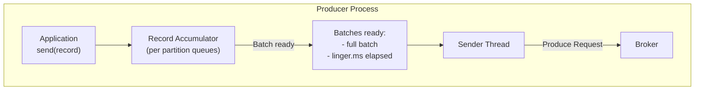
```mermaid
flowchart TB
    subgraph "Producer Process"
        APP["Application<br/>send(record)"]
        ACC["Record Accumulator<br/>(per partition queues)"]
        BATCH["Batches ready:<br/>- full batch<br/>- linger.ms elapsed"]
        SENDER["Sender Thread"]
        BROKER["Broker"]
    end

    APP --> ACC
    ACC -->|"Batch ready"| BATCH
    BATCH --> SENDER
    SENDER -->|"Produce Request"| BROKER
```

**Batching parameters**:

| Parameter | Default | Effect |
|-----------|---------|--------|
| `batch.size` | 16384 (16KB) | Max batch size in bytes |
| `linger.ms` | 0 | Time to wait for more records |
| `buffer.memory` | 33554432 (32MB) | Total memory for buffering |

```python
class RecordAccumulator:
    """
    Simplified record accumulator logic.

    Batching amortizes:
    - Network round trips
    - Compression overhead
    - Broker processing
    """

    def __init__(self, batch_size: int, linger_ms: int):
        self.batch_size = batch_size
        self.linger_ms = linger_ms
        self.batches: Dict[TopicPartition, RecordBatch] = {}

    def append(self, tp: TopicPartition, record: Record) -> Future:
        batch = self.batches.get(tp) or self._create_batch(tp)

        if batch.has_room_for(record):
            return batch.append(record)
        else:
            # Batch full - mark ready and create new
            batch.mark_ready()
            new_batch = self._create_batch(tp)
            return new_batch.append(record)

    def ready_batches(self) -> List[RecordBatch]:
        """Return batches ready to send."""
        now = time.time_ms()
        ready = []

        for tp, batch in self.batches.items():
            # Ready if: full OR linger expired
            if (batch.is_full() or
                (now - batch.created_at) >= self.linger_ms):
                ready.append(batch)

        return ready
```

### Compression

Kafka supports several compression codecs:

| Codec | Compression Ratio | CPU Cost | Use Case |
|-------|-------------------|----------|----------|
| **none** | 1:1 | None | Low latency, pre-compressed |
| **gzip** | High (~80%) | High | Archival, bandwidth-limited |
| **snappy** | Medium (~50%) | Low | Balanced (default choice) |
| **lz4** | Medium (~50%) | Very low | High throughput |
| **zstd** | High (~75%) | Medium | Best ratio/speed trade-off |

**Compression happens at batch level**, not per-record:

```
Uncompressed batch: [Header][Record1][Record2][Record3]...
Compressed batch:   [Header][COMPRESSED(Record1+Record2+Record3...)]
```

Larger batches = better compression ratios.

### Partitioner Strategies

| Strategy | Behavior | `max.in.flight` Safe |
|----------|----------|---------------------|
| **Default** | Hash(key) for keyed, round-robin for null | Yes with idempotence |
| **Round-robin** | Cycle through partitions | Yes |
| **Sticky** | Stick to partition until batch full | Yes (Kafka 2.4+) |
| **Custom** | User-defined logic | Depends on implementation |

**Sticky partitioner** (default since 2.4):
```
Without sticky: null keys spread across partitions
  → many small batches → poor compression → high overhead

With sticky: null keys stay on one partition until batch full
  → fewer, larger batches → better compression → lower latency
```

### Record Accumulator and Sender Thread

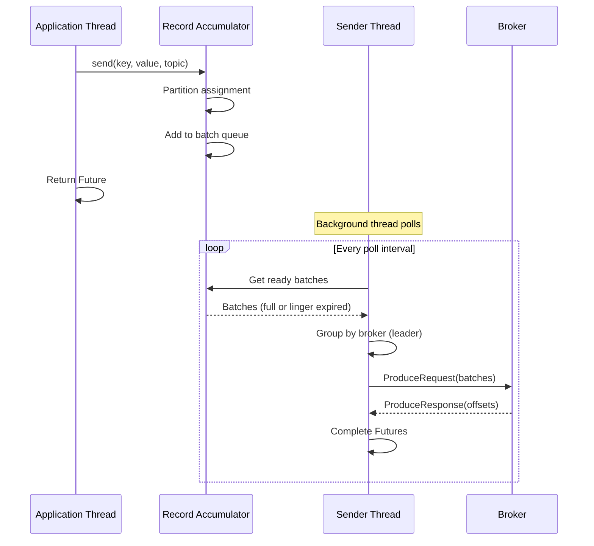
```mermaid
sequenceDiagram
    participant App as Application Thread
    participant Acc as Record Accumulator
    participant Sender as Sender Thread
    participant Broker as Broker

    App->>Acc: send(key, value, topic)
    Acc->>Acc: Partition assignment
    Acc->>Acc: Add to batch queue
    App->>App: Return Future

    Note over Sender: Background thread polls

    loop Every poll interval
        Sender->>Acc: Get ready batches
        Acc-->>Sender: Batches (full or linger expired)

        Sender->>Sender: Group by broker (leader)
        Sender->>Broker: ProduceRequest(batches)
        Broker-->>Sender: ProduceResponse(offsets)
        Sender->>Sender: Complete Futures
    end
```

### Producer Configuration Trade-offs

| Config | Low Value | High Value | Trade-off |
|--------|-----------|------------|-----------|
| `acks` | 0 (fire & forget) | all (full ISR) | Throughput vs durability |
| `batch.size` | Small batches | Large batches | Latency vs throughput |
| `linger.ms` | 0 (immediate) | Higher | Latency vs throughput |
| `compression.type` | none | zstd | CPU vs bandwidth |
| `retries` | 0 | MAX_INT | Data loss vs duplicates |
| `max.in.flight.requests` | 1 | 5 | Throughput vs ordering |

---

## 5. Consumer Groups & Rebalancing

### Consumer Group Protocol

Kafka's consumer group mechanism enables both:
- **Parallelism**: Multiple consumers share the work
- **Fault tolerance**: Failed consumer's partitions reassigned

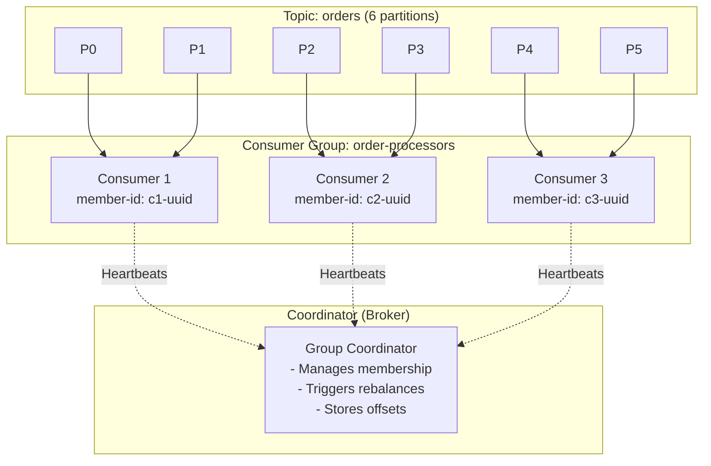
```mermaid
flowchart TB
    subgraph "Consumer Group: order-processors"
        C1["Consumer 1<br/>member-id: c1-uuid"]
        C2["Consumer 2<br/>member-id: c2-uuid"]
        C3["Consumer 3<br/>member-id: c3-uuid"]
    end

    subgraph "Topic: orders (6 partitions)"
        P0["P0"]
        P1["P1"]
        P2["P2"]
        P3["P3"]
        P4["P4"]
        P5["P5"]
    end

    subgraph "Coordinator (Broker)"
        COORD["Group Coordinator<br/>- Manages membership<br/>- Triggers rebalances<br/>- Stores offsets"]
    end

    P0 --> C1
    P1 --> C1
    P2 --> C2
    P3 --> C2
    P4 --> C3
    P5 --> C3

    C1 -.->|"Heartbeats"| COORD
    C2 -.->|"Heartbeats"| COORD
    C3 -.->|"Heartbeats"| COORD
```

**Group coordinator responsibilities**:
- Track consumer membership via heartbeats
- Detect failures (`session.timeout.ms`)
- Trigger rebalances on membership changes
- Store committed offsets in `__consumer_offsets`

### Partition Assignment Strategies

#### Range Assignor

```
Partitions: [P0, P1, P2, P3, P4, P5]
Consumers: [C1, C2, C3]

Assignment (6 partitions / 3 consumers = 2 each):
  C1: [P0, P1]
  C2: [P2, P3]
  C3: [P4, P5]
```

| Aspect | Range |
|--------|-------|
| Complexity | O(n) where n = partitions |
| Deterministic | Yes |
| Fair for multiple topics | No (same consumer gets "first" partitions) |

#### RoundRobin Assignor

```
Assignment (round-robin across sorted partitions):
  C1: [P0, P3]
  C2: [P1, P4]
  C3: [P2, P5]
```

| Aspect | RoundRobin |
|--------|------------|
| Complexity | O(n) |
| Deterministic | Yes |
| Fair for multiple topics | Yes |

#### Sticky Assignor

Preserves previous assignments when possible:

```
Initial:
  C1: [P0, P1]
  C2: [P2, P3]
  C3: [P4, P5]

C2 leaves → Rebalance:
  C1: [P0, P1, P2]  ← C1 keeps P0, P1, gains P2
  C3: [P4, P5, P3]  ← C3 keeps P4, P5, gains P3
```

| Aspect | Sticky |
|--------|--------|
| Complexity | O(n) |
| Deterministic | Yes |
| Partition movement | Minimal (affinity preserved) |
| Benefit | Reduced rebalance impact |

#### Cooperative Sticky Assignor (Incremental Rebalancing)

**The key innovation**: Avoids stop-the-world rebalancing.

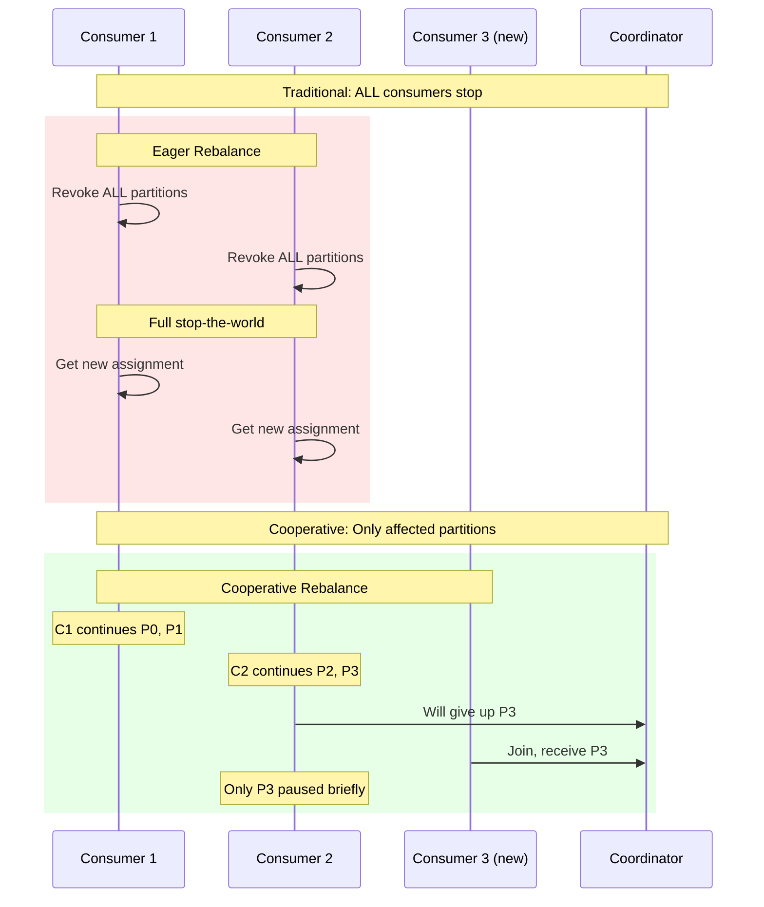
```mermaid
sequenceDiagram
    participant C1 as Consumer 1
    participant C2 as Consumer 2
    participant C3 as Consumer 3 (new)
    participant Coord as Coordinator

    Note over C1,Coord: Traditional: ALL consumers stop

    rect rgb(255, 230, 230)
        Note over C1,C2: Eager Rebalance
        C1->>C1: Revoke ALL partitions
        C2->>C2: Revoke ALL partitions
        Note over C1,C2: Full stop-the-world
        C1->>C1: Get new assignment
        C2->>C2: Get new assignment
    end

    Note over C1,Coord: Cooperative: Only affected partitions

    rect rgb(230, 255, 230)
        Note over C1,C3: Cooperative Rebalance
        Note over C1: C1 continues P0, P1
        Note over C2: C2 continues P2, P3
        C2->>Coord: Will give up P3
        C3->>Coord: Join, receive P3
        Note over C2: Only P3 paused briefly
    end
```

### Rebalance Storms and Mitigation

**Rebalance storm**: Cascading rebalances caused by consumers repeatedly timing out.

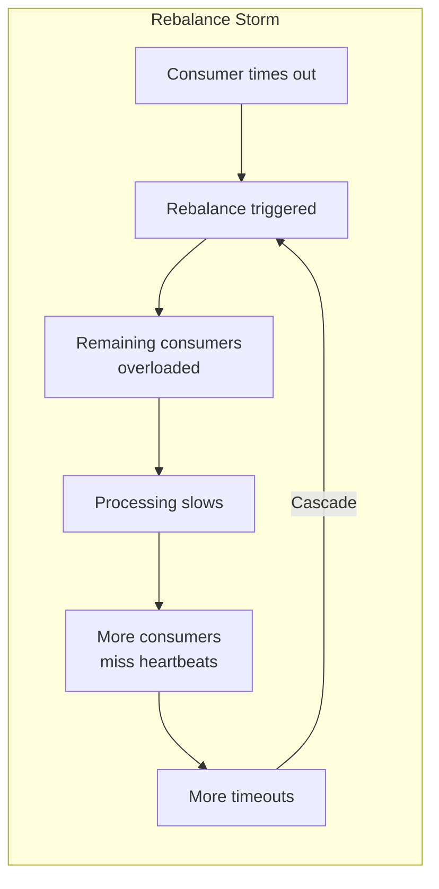
```mermaid
flowchart LR
    subgraph "Rebalance Storm"
        R1["Consumer times out"]
        R2["Rebalance triggered"]
        R3["Remaining consumers<br/>overloaded"]
        R4["Processing slows"]
        R5["More consumers<br/>miss heartbeats"]
        R6["More timeouts"]

        R1 --> R2 --> R3 --> R4 --> R5 --> R6
        R6 -->|"Cascade"| R2
    end
```

**Mitigation strategies**:

| Strategy | Configuration | Effect |
|----------|---------------|--------|
| **Increase session timeout** | `session.timeout.ms=30000` | More time before declared dead |
| **Increase heartbeat frequency** | `heartbeat.interval.ms=3000` | Faster failure detection |
| **Increase poll interval** | `max.poll.interval.ms=600000` | More processing time allowed |
| **Reduce batch size** | `max.poll.records=100` | Faster poll loop |
| **Static membership** | `group.instance.id` | Survives restarts |
| **Cooperative rebalancing** | `partition.assignment.strategy=CooperativeStickyAssignor` | Incremental |

### Static Group Membership

Static membership prevents rebalances during rolling restarts:

```python
# Without static membership
consumer = KafkaConsumer(
    group_id="my-group"
)
# Restart → new member-id → rebalance

# With static membership (Kafka 2.3+)
consumer = KafkaConsumer(
    group_id="my-group",
    group_instance_id="consumer-host-1"  # Stable identity
)
# Restart within session.timeout → no rebalance
```

### Consumer Group Rebalance Flow

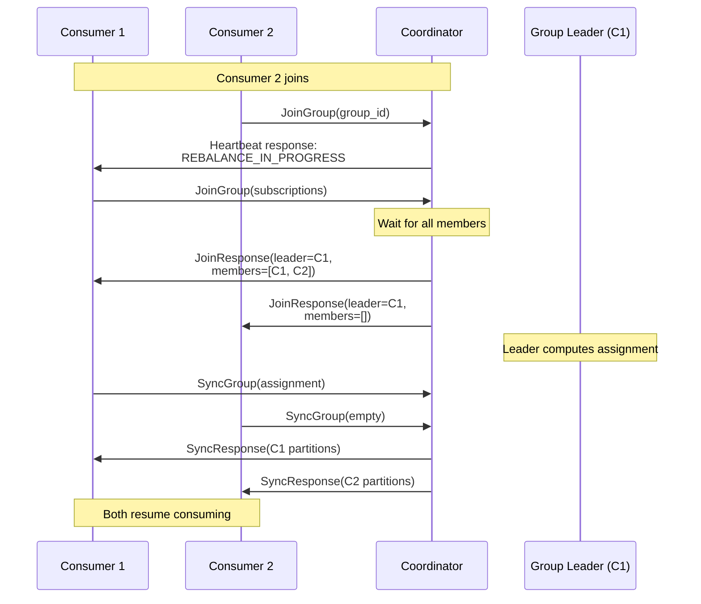
```mermaid
sequenceDiagram
    participant C1 as Consumer 1
    participant C2 as Consumer 2
    participant Coord as Coordinator
    participant Leader as Group Leader (C1)

    Note over C1,Coord: Consumer 2 joins

    C2->>Coord: JoinGroup(group_id)

    Coord->>C1: Heartbeat response:<br/>REBALANCE_IN_PROGRESS
    C1->>Coord: JoinGroup(subscriptions)

    Note over Coord: Wait for all members

    Coord->>C1: JoinResponse(leader=C1,<br/>members=[C1, C2])
    Coord->>C2: JoinResponse(leader=C1,<br/>members=[])

    Note over Leader: Leader computes assignment

    C1->>Coord: SyncGroup(assignment)
    C2->>Coord: SyncGroup(empty)

    Coord->>C1: SyncResponse(C1 partitions)
    Coord->>C2: SyncResponse(C2 partitions)

    Note over C1,C2: Both resume consuming
```

### Why Rebalancing Causes Stop-the-World (Eager Protocol)

**Critical to understand**: During eager rebalancing, **all consumers must pause**.

1. **Revocation requirement**: Consumers must commit offsets before partitions move
2. **Atomicity**: Assignment must be atomic (all-or-nothing)
3. **Ordering guarantee**: Can't have two consumers reading same partition
4. **Synchronization point**: JoinGroup acts as a barrier

**Duration impact**:
- Small groups (3-5 consumers): 1-5 seconds
- Large groups (50+ consumers): 30+ seconds
- Very large groups (100+): Minutes

This is why cooperative rebalancing was introduced—it allows incremental reassignment without full stop.

---

## 6. Replication & Durability

### Leader-Follower Replication Model

Every partition has one **leader** and zero or more **followers**:

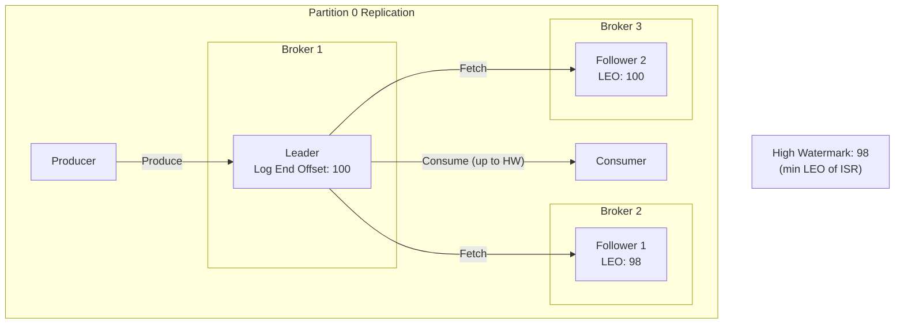
```mermaid
flowchart TB
    subgraph "Partition 0 Replication"
        PROD["Producer"]

        subgraph "Broker 1"
            L["Leader<br/>Log End Offset: 100"]
        end

        subgraph "Broker 2"
            F1["Follower 1<br/>LEO: 98"]
        end

        subgraph "Broker 3"
            F2["Follower 2<br/>LEO: 100"]
        end

        CONS["Consumer"]
    end

    PROD -->|"Produce"| L
    L -->|"Fetch"| F1
    L -->|"Fetch"| F2
    L -->|"Consume (up to HW)"| CONS

    NOTE["High Watermark: 98<br/>(min LEO of ISR)"]
```

**Key design decisions**:
- **Producers write only to leader**: Simplifies consistency
- **Followers pull from leader**: Push would require leader to track follower state
- **Consumers read only from leader**: Ensures they see committed data (pre-KIP-392)

### ISR (In-Sync Replicas) Concept

The ISR is the set of replicas that are "caught up" to the leader:

```python
class ISRManager:
    """
    In-Sync Replica management.

    A replica is in ISR if:
    1. It has fetched within replica.lag.time.max.ms (default 30s)
    2. It's not too far behind (legacy: replica.lag.max.messages)
    """

    def __init__(self, replica_lag_time_max_ms: int = 30000):
        self.replica_lag_time_max_ms = replica_lag_time_max_ms
        self.last_fetch_time: Dict[int, int] = {}  # replica_id -> timestamp
        self.isr: Set[int] = set()

    def record_fetch(self, replica_id: int, fetch_offset: int, leader_leo: int):
        """Called when follower fetches from leader."""
        self.last_fetch_time[replica_id] = current_time_ms()

        # If caught up, add to ISR
        if fetch_offset >= leader_leo:
            self.isr.add(replica_id)

    def check_isr(self):
        """Periodically check for lagging replicas."""
        now = current_time_ms()
        for replica_id, last_fetch in self.last_fetch_time.items():
            if now - last_fetch > self.replica_lag_time_max_ms:
                self.isr.discard(replica_id)
                # Shrink ISR - notify controller
```

### High Watermark and Log End Offset

Two critical markers in replication:

| Marker | Definition | Visibility |
|--------|------------|------------|
| **Log End Offset (LEO)** | Next offset to be written | Per-replica |
| **High Watermark (HW)** | Offset up to which data is committed | Leader tracks, propagates |

```
Leader log:   [0][1][2][3][4][5][6][7][8][9]
                              ↑           ↑
                              HW=5        LEO=10

Followers have replicated up to offset 5.
Offsets 6-9 are written but not committed.
Consumer can only read up to HW (offset 5).
```

**Why this matters**: If leader fails before followers replicate 6-9, those records are lost (with `acks=1`). With `acks=all`, producer waits for ISR to replicate.

### acks Configuration

| acks | Behavior | Durability | Latency |
|------|----------|------------|---------|
| `0` | Don't wait for any ack | None (fire and forget) | Lowest |
| `1` | Wait for leader ack | Leader disk only | Low |
| `all` (-1) | Wait for all ISR acks | Full ISR replication | Highest |

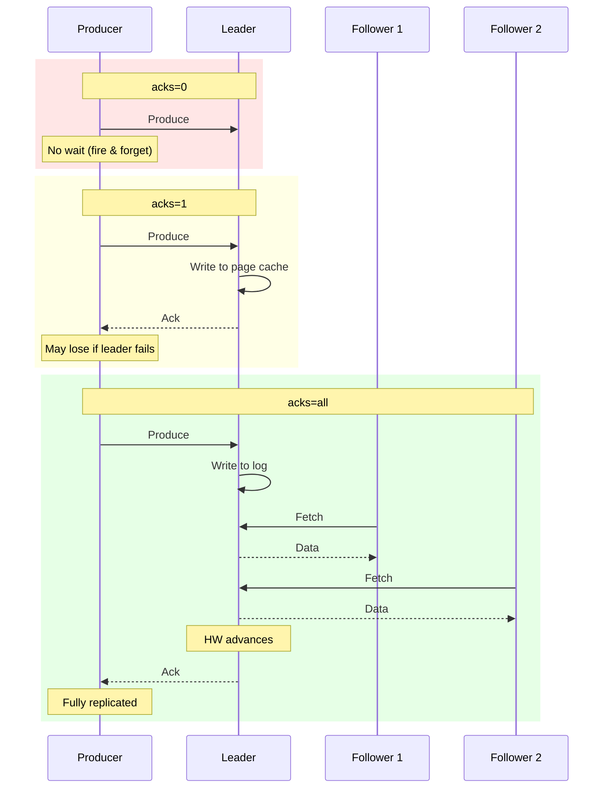
```mermaid
sequenceDiagram
    participant P as Producer
    participant L as Leader
    participant F1 as Follower 1
    participant F2 as Follower 2

    rect rgb(255, 230, 230)
        Note over P,L: acks=0
        P->>L: Produce
        Note over P: No wait (fire & forget)
    end

    rect rgb(255, 255, 230)
        Note over P,L: acks=1
        P->>L: Produce
        L->>L: Write to page cache
        L-->>P: Ack
        Note over P: May lose if leader fails
    end

    rect rgb(230, 255, 230)
        Note over P,F2: acks=all
        P->>L: Produce
        L->>L: Write to log
        F1->>L: Fetch
        L-->>F1: Data
        F2->>L: Fetch
        L-->>F2: Data
        Note over L: HW advances
        L-->>P: Ack
        Note over P: Fully replicated
    end
```

### min.insync.replicas Interaction

`min.insync.replicas` (default: 1) sets minimum ISR size for `acks=all`:

| replication.factor | min.insync.replicas | acks=all Behavior |
|--------------------|---------------------|-------------------|
| 3 | 1 | Ack when any 1 replica has data (including leader) |
| 3 | 2 | Ack when leader + 1 follower have data |
| 3 | 3 | Ack when all 3 replicas have data |

**Production recommendation**: `replication.factor=3`, `min.insync.replicas=2`

```
If RF=3, min.isr=2:
- Can tolerate 1 broker failure (2 replicas remain)
- If 2 brokers fail: writes rejected (ISR < min.isr)
- Prevents write to under-replicated partition
```

### Unclean Leader Election Trade-off

What happens when all ISR replicas are unavailable?

| `unclean.leader.election.enable` | Behavior | Trade-off |
|----------------------------------|----------|-----------|
| `false` (default) | Partition unavailable until ISR replica returns | Consistency over availability |
| `true` | Elect any replica (may have data loss) | Availability over consistency |

**When to enable unclean election**:
- Data loss acceptable (metrics, logs)
- Availability critical
- Can reconstruct from source

**When to keep disabled**:
- Financial transactions
- Audit logs
- Any data requiring strong consistency

### Replication Diagram with ISR

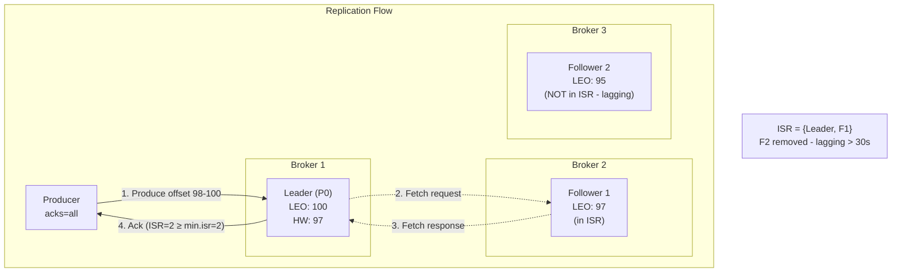
```mermaid
flowchart TB
    subgraph "Replication Flow"
        PROD["Producer<br/>acks=all"]

        subgraph "Broker 1"
            L["Leader (P0)<br/>LEO: 100<br/>HW: 97"]
        end

        subgraph "Broker 2"
            F1["Follower 1<br/>LEO: 97<br/>(in ISR)"]
        end

        subgraph "Broker 3"
            F2["Follower 2<br/>LEO: 95<br/>(NOT in ISR - lagging)"]
        end
    end

    PROD -->|"1. Produce offset 98-100"| L
    L -.->|"2. Fetch request"| F1
    F1 -.->|"3. Fetch response"| L
    L -->|"4. Ack (ISR=2 ≥ min.isr=2)"| PROD

    NOTE["ISR = {Leader, F1}<br/>F2 removed - lagging > 30s"]
```

### Comparison to Raft

Kafka's replication **predates** Raft (2014) but shares similarities:

| Aspect | Kafka | Raft |
|--------|-------|------|
| Leader election | Controller-driven | Decentralized (voting) |
| Replication | Pull (followers fetch) | Push (leader sends) |
| Commit point | High watermark (ISR-based) | Majority commit |
| Quorum | ISR (dynamic) | Fixed majority |
| Log matching | Truncate on mismatch | Truncate on mismatch |

**Key difference**: Kafka's ISR is dynamic—a slow follower drops out rather than blocking commits.

---

## 7. Exactly-Once Semantics

### The Problem: At-Least-Once Default

Default Kafka behavior is **at-least-once**:

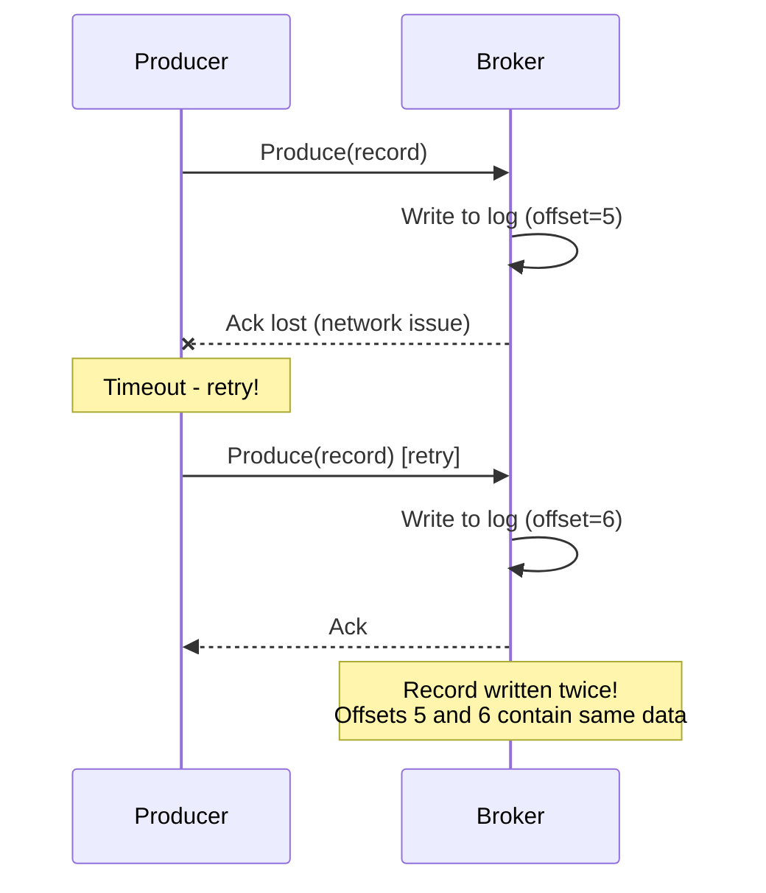
```mermaid
sequenceDiagram
    participant P as Producer
    participant B as Broker

    P->>B: Produce(record)
    B->>B: Write to log (offset=5)
    B--xP: Ack lost (network issue)

    Note over P: Timeout - retry!

    P->>B: Produce(record) [retry]
    B->>B: Write to log (offset=6)
    B-->>P: Ack

    Note over B: Record written twice!<br/>Offsets 5 and 6 contain same data
```

### Idempotent Producer (PID + Sequence Numbers)

Introduced in Kafka 0.11, enables exactly-once within a single partition:

```python
class IdempotentProducer:
    """
    Idempotent producer using Producer ID (PID) and sequence numbers.

    Broker tracks: {(PID, partition) -> last_sequence}
    Rejects duplicates or out-of-order sequences.
    """

    def __init__(self):
        self.pid = None  # Assigned by broker on init
        self.epoch = 0   # Incremented on restart
        self.sequences: Dict[TopicPartition, int] = {}  # Per-partition sequence

    def init_transactions(self):
        """
        Initialize producer.
        Broker assigns PID and epoch.
        """
        response = self.broker.init_producer_id()
        self.pid = response.producer_id
        self.epoch = response.epoch

    def send(self, topic: str, partition: int, key: bytes, value: bytes):
        """
        Send with sequence number for idempotence.
        """
        tp = TopicPartition(topic, partition)

        # Increment sequence for this partition
        self.sequences[tp] = self.sequences.get(tp, -1) + 1

        record = ProducerRecord(
            key=key,
            value=value,
            headers={
                'pid': self.pid,
                'epoch': self.epoch,
                'sequence': self.sequences[tp]
            }
        )

        return self.broker.produce(tp, record)
```

**Broker-side deduplication**:

```python
class BrokerDeduplication:
    """
    Broker maintains sequence state per (PID, partition).
    """

    def __init__(self):
        # Map: (pid, partition) -> last_sequence
        self.producer_state: Dict[Tuple[int, int], int] = {}

    def handle_produce(self, pid: int, partition: int, sequence: int, record: bytes):
        key = (pid, partition)
        last_seq = self.producer_state.get(key, -1)

        if sequence <= last_seq:
            # Duplicate - already processed
            return DuplicateSequenceError()

        if sequence != last_seq + 1:
            # Gap - out of order
            return OutOfOrderSequenceError()

        # Valid - append and update state
        self.log.append(record)
        self.producer_state[key] = sequence
        return Success()
```

### Transactional Messaging

For exactly-once **across partitions**, Kafka supports transactions:

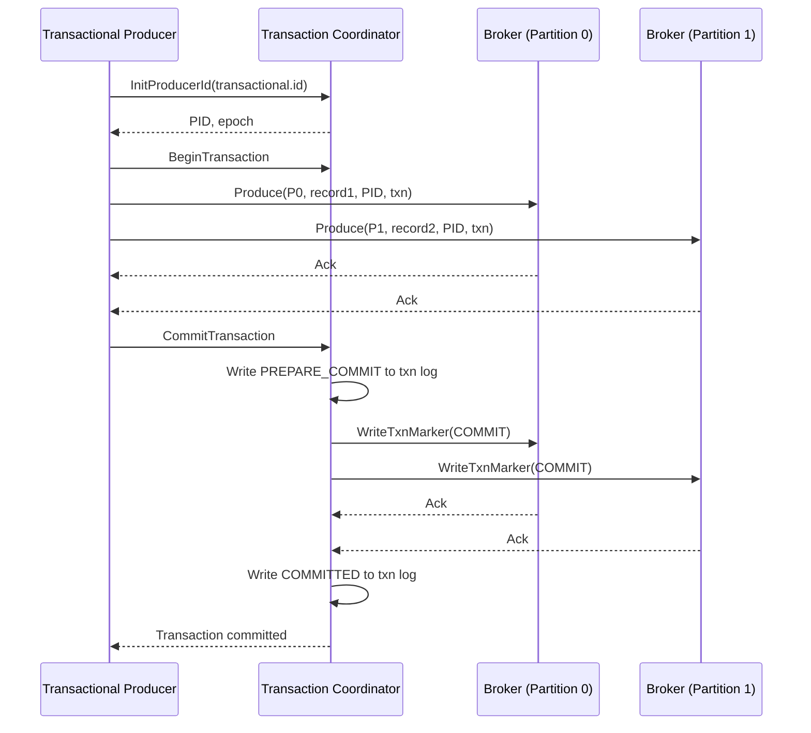
```mermaid
sequenceDiagram
    participant P as Transactional Producer
    participant TC as Transaction Coordinator
    participant B1 as Broker (Partition 0)
    participant B2 as Broker (Partition 1)

    P->>TC: InitProducerId(transactional.id)
    TC-->>P: PID, epoch

    P->>TC: BeginTransaction

    P->>B1: Produce(P0, record1, PID, txn)
    P->>B2: Produce(P1, record2, PID, txn)

    B1-->>P: Ack
    B2-->>P: Ack

    P->>TC: CommitTransaction

    TC->>TC: Write PREPARE_COMMIT to txn log
    TC->>B1: WriteTxnMarker(COMMIT)
    TC->>B2: WriteTxnMarker(COMMIT)
    B1-->>TC: Ack
    B2-->>TC: Ack
    TC->>TC: Write COMMITTED to txn log

    TC-->>P: Transaction committed
```

**Transaction states**:
```
Empty → Ongoing → PrepareCommit → Committed
                → PrepareAbort → Aborted
```

### read_committed vs read_uncommitted

| Isolation Level | Sees | Use Case |
|-----------------|------|----------|
| `read_uncommitted` | All records including uncommitted | Highest throughput, no exactly-once |
| `read_committed` | Only committed records | Exactly-once consumption |

```python
consumer = KafkaConsumer(
    isolation_level='read_committed'  # Only see committed
)
```

**How it works**: Consumer's position advances only past committed transaction markers.

### End-to-End Exactly-Once with Kafka Streams

Kafka Streams provides exactly-once for read-process-write patterns:

```java
Properties props = new Properties();
props.put(StreamsConfig.PROCESSING_GUARANTEE_CONFIG,
          StreamsConfig.EXACTLY_ONCE_V2);  // Kafka 2.5+

// This ensures:
// 1. Idempotent producer
// 2. Transactional producer for output
// 3. Consumer offset commits within transaction
// 4. read_committed isolation
```

**The atomic unit**: {consume from input, process, produce to output, commit offset}

### Transaction Overhead Analysis

| Component | Overhead |
|-----------|----------|
| **InitProducerId** | One-time per producer instance (~10-50ms) |
| **Transaction markers** | 2 markers per transaction (commit/abort) |
| **Coordinator round trips** | 2 extra RPCs per transaction |
| **Log overhead** | ~50-100 bytes per transaction marker |
| **Latency impact** | +5-20ms per transaction |

**Guidance**: Batch multiple records per transaction. Single-record transactions have high overhead.

### Exactly-Once vs At-Least-Once Trade-offs

| Aspect | At-Least-Once | Exactly-Once |
|--------|---------------|--------------|
| **Configuration** | Simple | Complex |
| **Throughput** | Higher | ~20-30% lower |
| **Latency** | Lower | Higher (txn coordination) |
| **Consumer complexity** | Must handle duplicates | Clean semantics |
| **Cross-partition atomicity** | No | Yes |
| **Failure recovery** | Fast | Slower (txn timeout) |

---

## 8. Storage: Segments & Compaction

### Log Segments and Indexes

Each partition is stored as a series of **segments**:

```
/data/kafka-logs/
└── my-topic-0/
    ├── 00000000000000000000.log     # Segment: offsets 0-999
    ├── 00000000000000000000.index   # Offset index
    ├── 00000000000000000000.timeindex  # Time index
    ├── 00000000000000001000.log     # Segment: offsets 1000-1999
    ├── 00000000000000001000.index
    ├── 00000000000000001000.timeindex
    └── leader-epoch-checkpoint
```

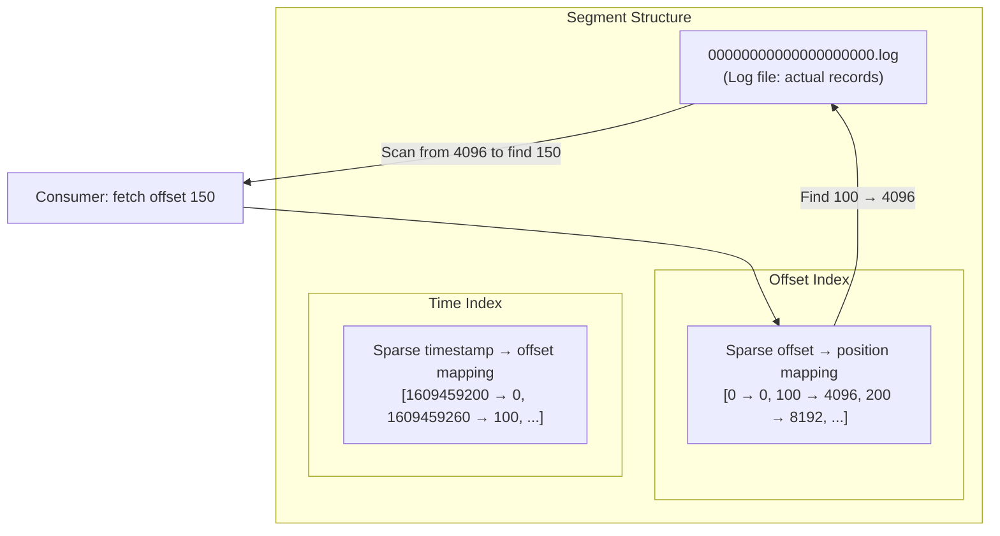
```mermaid
flowchart TB
    subgraph "Segment Structure"
        LOG["00000000000000000000.log<br/>(Log file: actual records)"]

        subgraph "Offset Index"
            IDX["Sparse offset → position mapping<br/>[0 → 0, 100 → 4096, 200 → 8192, ...]"]
        end

        subgraph "Time Index"
            TIDX["Sparse timestamp → offset mapping<br/>[1609459200 → 0, 1609459260 → 100, ...]"]
        end
    end

    CONSUMER["Consumer: fetch offset 150"] --> IDX
    IDX -->|"Find 100 → 4096"| LOG
    LOG -->|"Scan from 4096 to find 150"| CONSUMER
```

**Index design**:
- **Sparse**: Not every offset indexed (every N records or bytes)
- **Memory-mapped**: Fast access via mmap
- **Immutable**: Once segment closed, index finalized

### Time-Based vs Size-Based Retention

| Policy | Configuration | Behavior |
|--------|---------------|----------|
| **Time-based** | `retention.ms=604800000` (7 days) | Delete segments older than 7 days |
| **Size-based** | `retention.bytes=1073741824` (1GB) | Delete oldest segments when partition exceeds 1GB |
| **Both** | Both configured | Whichever triggers first |

```python
def retention_check(partition: Partition, config: RetentionConfig):
    """
    Determine which segments to delete.
    """
    deletable = []

    for segment in partition.segments[:-1]:  # Never delete active segment
        # Time-based check
        if config.retention_ms:
            age = current_time_ms() - segment.max_timestamp
            if age > config.retention_ms:
                deletable.append(segment)
                continue

        # Size-based check
        if config.retention_bytes:
            total_size = sum(s.size for s in partition.segments)
            if total_size > config.retention_bytes:
                deletable.append(segment)
                continue

    return deletable
```

### Log Compaction Mechanics

Log compaction retains only the **latest value per key**:

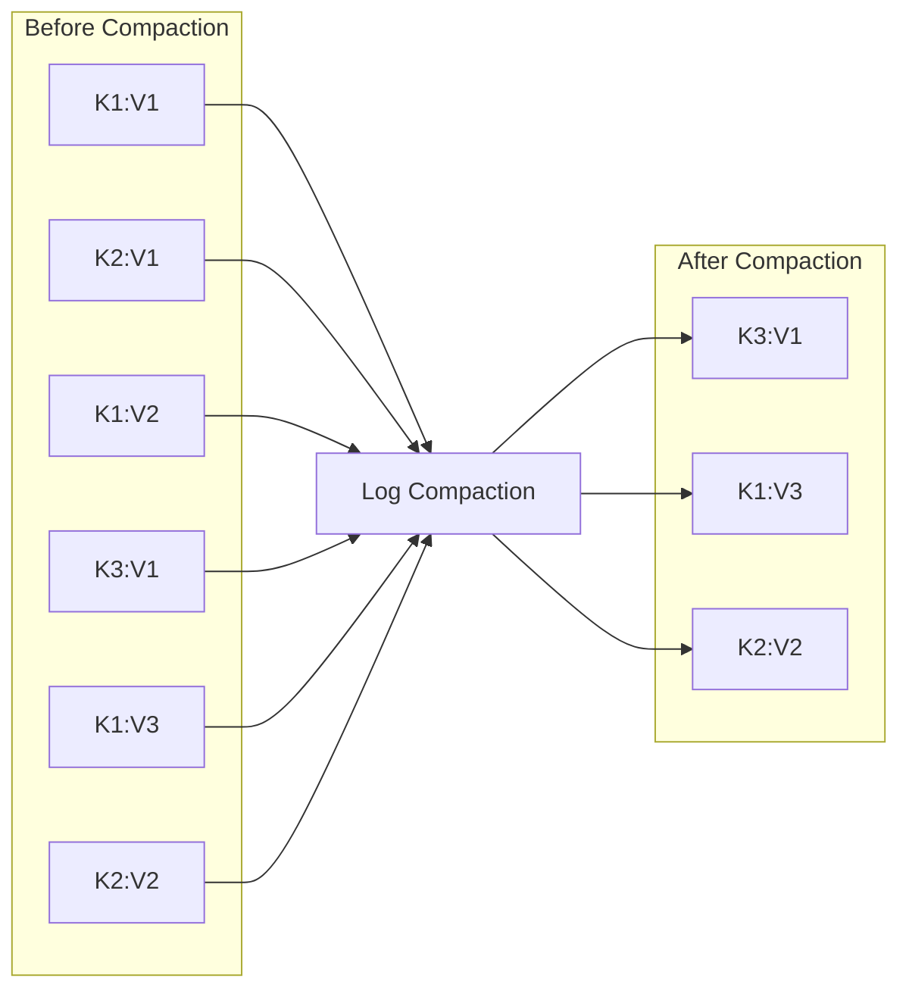
```mermaid
flowchart LR
    subgraph "Before Compaction"
        B1["K1:V1"]
        B2["K2:V1"]
        B3["K1:V2"]
        B4["K3:V1"]
        B5["K1:V3"]
        B6["K2:V2"]
    end

    COMPACT["Log Compaction"]

    subgraph "After Compaction"
        A1["K3:V1"]
        A2["K1:V3"]
        A3["K2:V2"]
    end

    B1 --> COMPACT
    B2 --> COMPACT
    B3 --> COMPACT
    B4 --> COMPACT
    B5 --> COMPACT
    B6 --> COMPACT

    COMPACT --> A1
    COMPACT --> A2
    COMPACT --> A3
```

**Compaction guarantees**:
1. Consumer starting from offset 0 sees final state of every key
2. Ordering within a key is preserved
3. Messages are never reordered across keys
4. Offset of a message never changes

### Tombstones and Cleanup

A **tombstone** is a record with null value, marking key for deletion:

```python
# Publish tombstone to delete key
producer.send('my-topic', key='user-123', value=None)

# After compaction + delete.retention.ms, key is removed entirely
```

**Tombstone lifecycle**:
1. Producer sends null value for key
2. Compaction removes older values for key
3. Tombstone retained for `delete.retention.ms` (default 24h)
4. After retention, tombstone itself removed

### LSM-Tree Influence on Design

Kafka's storage shares concepts with LSM-trees:

| LSM-Tree | Kafka |
|----------|-------|
| MemTable | Page cache (OS-managed) |
| SSTable | Log segment |
| Compaction | Log compaction |
| Write-ahead log | Kafka IS the log |

**Key difference**: Kafka optimizes for sequential access patterns, not key-value lookups. No explicit sorted index structure needed.

### Segment Structure Diagram

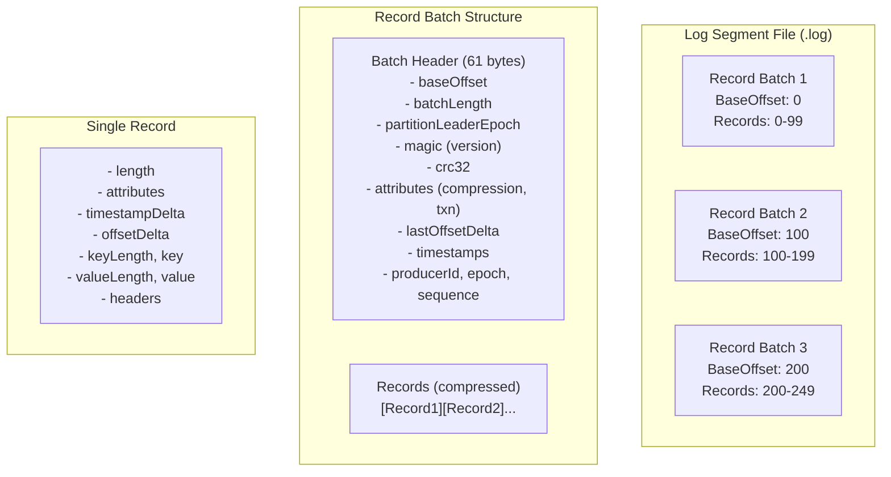
```mermaid
flowchart TB
    subgraph "Log Segment File (.log)"
        RB1["Record Batch 1<br/>BaseOffset: 0<br/>Records: 0-99"]
        RB2["Record Batch 2<br/>BaseOffset: 100<br/>Records: 100-199"]
        RB3["Record Batch 3<br/>BaseOffset: 200<br/>Records: 200-249"]
    end

    subgraph "Record Batch Structure"
        HEADER["Batch Header (61 bytes)<br/>- baseOffset<br/>- batchLength<br/>- partitionLeaderEpoch<br/>- magic (version)<br/>- crc32<br/>- attributes (compression, txn)<br/>- lastOffsetDelta<br/>- timestamps<br/>- producerId, epoch, sequence"]
        RECORDS["Records (compressed)<br/>[Record1][Record2]..."]
    end

    subgraph "Single Record"
        REC["- length<br/>- attributes<br/>- timestampDelta<br/>- offsetDelta<br/>- keyLength, key<br/>- valueLength, value<br/>- headers"]
    end
```

### Use Cases: Changelog Topics, CDC

**Changelog topics** (compacted):
- Kafka Streams state stores
- Cache invalidation
- Configuration distribution

**CDC (Change Data Capture)**:
- Debezium captures database changes
- Each row change → Kafka record (key = primary key)
- Compaction ensures latest state per row
- Consumers can rebuild database state

---

## 9. Performance Deep-Dive

### Zero-Copy with sendfile()

Traditional data transfer:
```
Disk → Kernel buffer → User buffer → Socket buffer → NIC
       (read)          (copy)         (write)
```

Kafka's zero-copy:
```
Disk → Kernel buffer → NIC
       (sendfile)
```

```python
# Pseudocode: Traditional vs Zero-copy
def traditional_send(file_path, socket):
    """4 copies, 4 context switches"""
    data = read(file_path)        # Kernel → User
    socket.send(data)             # User → Kernel → NIC

def zero_copy_send(file_path, socket):
    """2 copies (or 1 with DMA gather), 2 context switches"""
    sendfile(socket.fd, file.fd, offset, count)  # Kernel → NIC directly
```

**Performance impact**: 2-4x throughput improvement for large transfers.

### Page Cache Utilization

Kafka **delegates caching to the OS**:

```mermaid
flowchart TB
    subgraph "JVM Process"
        KAFKA["Kafka Broker<br/>(No heap storage of data)"]
    end

    subgraph "Operating System"
        PC["Page Cache<br/>(All available RAM)"]
        DISK["Disk"]
    end

    KAFKA -->|"write()"| PC
    PC -->|"Background flush"| DISK
    KAFKA -->|"sendfile()"| PC
    PC -->|"DMA to NIC"| NIC["Network"]
```

**Why this works**:
1. **No GC overhead**: Data never in JVM heap
2. **Survives restarts**: Page cache persists across broker restarts
3. **OS optimizations**: Read-ahead, write-back, LRU eviction
4. **Double-caching avoided**: If Kafka cached, OS would cache too

### Sequential I/O Optimization

Kafka's access patterns are almost entirely sequential:

| Operation | Access Pattern | Optimization |
|-----------|----------------|--------------|
| **Producer write** | Append to end | Sequential write |
| **Consumer read** | Read from offset forward | Sequential read |
| **Replication fetch** | Read from offset forward | Sequential read |
| **Compaction** | Read old, write new | Sequential read + write |

**Disk throughput comparison**:
- Random 4KB reads: ~500 IOPS = 2 MB/s
- Sequential reads: ~200 MB/s (HDD), ~3 GB/s (NVMe)

### Batching at Every Layer

```mermaid
flowchart LR
    subgraph "Batching Layers"
        P1["Producer batching<br/>(linger.ms, batch.size)"]
        N1["Network batching<br/>(multiple batches per request)"]
        B1["Broker batching<br/>(write entire request)"]
        R1["Replication batching<br/>(fetch multiple batches)"]
        C1["Consumer batching<br/>(max.poll.records)"]
    end

    P1 --> N1 --> B1 --> R1 --> C1
```

**Batching benefits**:
- Amortizes network round-trip
- Better compression ratios
- Fewer syscalls
- Efficient disk I/O (larger writes)

### Throughput Benchmarks

Reference numbers from production deployments (Kreps, 2013; Wang et al., 2015):

| Metric | Single Broker | Cluster (10 brokers) |
|--------|---------------|----------------------|
| **Producer throughput** | 200-500 MB/s | 2-5 GB/s |
| **Messages/sec** | 1-2 million | 10-20 million |
| **Consumer throughput** | 300-600 MB/s | 3-6 GB/s |
| **Latency (p99)** | 5-10 ms | 10-20 ms |

**Factors affecting throughput**:
- Message size (larger = higher MB/s, lower msg/s)
- Compression (CPU vs network trade-off)
- Replication factor (acks=all slower)
- Partition count (parallelism)
- Disk type (NVMe >> SATA SSD >> HDD)

### Performance Reference (Ousterhout et al., NSDI 2015)

The Ousterhout paper on data analytics performance identifies key bottlenecks:

1. **Network is often not the bottleneck** — contrary to common belief
2. **Serialization/deserialization** — significant CPU cost
3. **Disk I/O** — sequential access critical
4. **Scheduling overhead** — task granularity matters

Kafka's design addresses these:
- Sequential I/O eliminates seek overhead
- Batching amortizes serialization
- Zero-copy eliminates CPU in data path
- Simple scheduling (offset-based consumption)

---

## 10. Production Patterns

### Schema Registry and Evolution

Kafka doesn't enforce schemas, but Schema Registry adds governance:

```mermaid
flowchart LR
    subgraph "Producer"
        P["Producer"] --> SR1["Schema Registry<br/>Client"]
        SR1 -->|"Register/Get schema"| SR["Schema Registry"]
        P -->|"schema_id + payload"| KAFKA["Kafka"]
    end

    subgraph "Consumer"
        KAFKA -->|"schema_id + payload"| C["Consumer"]
        C --> SR2["Schema Registry<br/>Client"]
        SR2 -->|"Get schema"| SR
    end
```

**Supported formats**:
- **Avro**: Compact binary, schema evolution, most common
- **Protobuf**: Language-neutral, Google's format
- **JSON Schema**: Human-readable, larger payloads

**Schema evolution rules**:

| Change | Avro Compatibility |
|--------|-------------------|
| Add field with default | Backward + Forward |
| Remove field with default | Backward + Forward |
| Add required field | Breaking |
| Remove required field | Breaking |
| Change field type | Usually breaking |

### Dead Letter Queues for Poison Pills

When records can't be processed, route to DLQ:

```python
def process_with_dlq(consumer, dlq_producer, handler):
    """
    Process records with dead letter queue for failures.
    """
    for record in consumer:
        try:
            handler.process(record)
        except DeserializationError as e:
            # Can't even parse - definitely send to DLQ
            dlq_producer.send(
                topic='my-topic.dlq',
                key=record.key,
                value=record.value,
                headers={
                    'error': str(e),
                    'original_topic': record.topic,
                    'original_partition': record.partition,
                    'original_offset': record.offset
                }
            )
        except ProcessingError as e:
            # Retriable error - maybe retry first
            if record.retry_count < MAX_RETRIES:
                retry_topic.send(record.with_incremented_retry())
            else:
                dlq_producer.send(...)
```

### Consumer Lag Monitoring

Consumer lag = latest offset - consumer's current offset

```mermaid
flowchart LR
    subgraph "Lag Monitoring"
        LATEST["Latest offset: 1000"]
        CURRENT["Consumer offset: 850"]
        LAG["Lag: 150 messages"]

        LATEST --> LAG
        CURRENT --> LAG
    end

    subgraph "Alerting"
        LAG --> BURROW["Burrow / Kafka Exporter"]
        BURROW --> PROM["Prometheus"]
        PROM --> ALERT["Alert if lag > threshold"]
    end
```

**Monitoring tools**:
- **Burrow**: LinkedIn's consumer lag checker
- **Kafka Exporter**: Prometheus metrics
- **Confluent Control Center**: Commercial
- **Built-in**: `kafka-consumer-groups.sh --describe`

**Alert thresholds**:
- **Warning**: Lag > 1000 or lag increasing for 5 minutes
- **Critical**: Lag > 10000 or consumer not making progress

### Cluster Sizing Guidelines

| Factor | Guideline |
|--------|-----------|
| **Brokers** | Start with 3, scale based on throughput/storage |
| **Partitions per broker** | 2000-4000 max (more with KRaft) |
| **Replication factor** | 3 for production (tolerates 1 failure) |
| **Disk** | 70% utilization target, monitor closely |
| **Memory** | 32-64 GB, mostly for page cache |
| **CPU** | 8-16 cores, more if heavy compression |
| **Network** | 10 Gbps minimum for high throughput |

**Partition count formula**:
```
partitions = max(
    throughput_required / throughput_per_partition,
    consumer_count_expected
)
```

### Multi-Datacenter: MirrorMaker 2

MirrorMaker 2 (MM2) replicates across clusters:

```mermaid
flowchart LR
    subgraph "DC West"
        KW["Kafka Cluster West"]
        MM2W["MirrorMaker 2"]
    end

    subgraph "DC East"
        KE["Kafka Cluster East"]
        MM2E["MirrorMaker 2"]
    end

    KW -->|"Replicate"| MM2W -->|"Produce"| KE
    KE -->|"Replicate"| MM2E -->|"Produce"| KW
```

**MM2 features**:
- Automatic topic creation with source naming (`us-west.orders`)
- Offset translation (consumer migration)
- Heartbeat topics for monitoring
- Config sync

**Replication topologies**:
- **Active-passive**: One-way, disaster recovery
- **Active-active**: Bidirectional, multi-region writes
- **Fan-out**: Central to regional
- **Aggregation**: Regional to central

---

## 11. Failure Scenarios

### Broker Failure with ISR

**Scenario**: Leader broker dies

```mermaid
sequenceDiagram
    participant C as Controller
    participant B1 as Broker 1 (Leader) 💀
    participant B2 as Broker 2 (ISR)
    participant B3 as Broker 3 (ISR)

    Note over B1: Broker 1 crashes

    B2->>C: No heartbeat from B1
    B3->>C: No heartbeat from B1

    C->>C: Detect failure (session timeout)
    C->>C: Select new leader from ISR (B2)

    C->>B2: LeaderAndIsr(leader=B2)
    C->>B3: LeaderAndIsr(leader=B2)

    B2->>B2: Become leader
    B3->>B2: Start fetching from new leader

    Note over B2,B3: Service restored<br/>No data loss (ISR was up to date)
```

**Recovery time**: Typically 5-30 seconds depending on:
- `session.timeout.ms` (ZK) or controller detection
- Number of partitions to reassign
- Metadata propagation

### Consumer Failure Mid-Batch

**Scenario**: Consumer crashes after processing some records, before commit

```mermaid
sequenceDiagram
    participant C as Consumer
    participant K as Kafka
    participant Coord as Coordinator

    C->>K: poll() returns [offset 100-109]
    C->>C: Process 100, 101, 102, 103
    Note over C: CRASH!

    Note over Coord: Heartbeat timeout

    Coord->>Coord: Rebalance, assign partition to new consumer

    participant C2 as New Consumer

    C2->>Coord: Where should I start?
    Coord-->>C2: Last committed: 100
    C2->>K: poll() from offset 100

    Note over C2: Reprocesses 100-103<br/>(duplicates!)
```

**Mitigation**:
- Process records idempotently
- Use exactly-once semantics
- Commit more frequently (trade-off with overhead)

### Network Partition Handling

**Scenario**: Network partition isolates leader from followers

```mermaid
flowchart TB
    subgraph "Partition A (Leader)"
        L["Leader<br/>ISR: {L, F1, F2}"]
    end

    subgraph "Partition B (Followers)"
        F1["Follower 1"]
        F2["Follower 2"]
        CTRL["Controller"]
    end

    L -.->|"❌ Network partition"| F1
    L -.->|"❌ Network partition"| F2

    NOTE1["Leader: ISR shrinks to {L}<br/>If min.isr=2: writes rejected"]
    NOTE2["Controller: Elects new leader<br/>from F1, F2"]
```

**Outcome depends on configuration**:
- `min.insync.replicas=1`: Leader continues accepting writes (risk: data loss if leader partition unrecoverable)
- `min.insync.replicas=2`: Leader rejects writes (availability sacrifice)
- Controller elects new leader in reachable partition

### Split-Brain Prevention

Kafka prevents split-brain through:

1. **Controller epoch**: Brokers reject commands from old controllers
2. **Leader epoch**: Followers reject produce from old leaders
3. **ISR membership**: Leader only acks writes replicated to ISR
4. **Fencing**: Old leaders fenced via controller commands

```python
def handle_produce_request(request, partition_state):
    """
    Broker validates leader epoch to prevent split-brain.
    """
    if request.leader_epoch < partition_state.leader_epoch:
        # Request from old leader - reject
        return NotLeaderError(
            f"Leader epoch {request.leader_epoch} < current {partition_state.leader_epoch}"
        )

    if not partition_state.is_leader:
        return NotLeaderError("I am not the leader")

    # Valid - process the write
    return do_produce(request)
```

---

## 12. Interview Articulation

### 30-Second Version

> "Kafka is a distributed commit log that decouples producers from consumers. Data is published to topics, which are split into partitions for parallelism. Each partition is an ordered, append-only log where messages are identified by offset. Partitions are replicated across brokers for fault tolerance, with one leader handling all reads and writes. Consumers track their position independently, enabling replay and multiple consumer groups. The key insight is treating data infrastructure as a log—writes are always sequential, making Kafka extremely fast, handling millions of messages per second."

### 2-Minute Version

> "Kafka was designed at LinkedIn to solve their data integration problem—dozens of systems needing the same data created an O(n²) mess of point-to-point connections. The solution was a central commit log that decouples producers from consumers.
>
> The core abstraction is the **log**—an append-only, immutable sequence of records. Topics are logical categories, partitioned for parallelism. Each partition is an independent log with strict ordering. Producers choose partitions via key hashing, ensuring records for the same entity stay ordered.
>
> For durability, partitions are replicated with a leader-follower model. The leader handles all reads and writes; followers pull to stay in sync. The ISR (in-sync replicas) determines when data is committed—with `acks=all`, a write isn't acknowledged until the entire ISR has it.
>
> Consumers use **consumer groups** for parallel processing—each partition goes to exactly one consumer in the group. Rebalancing redistributes partitions when consumers join or leave, though this can cause stop-the-world pauses with the eager protocol. Cooperative rebalancing in newer versions makes this incremental.
>
> Performance comes from several optimizations: sequential I/O everywhere, zero-copy with sendfile(), batching at every layer, and using the OS page cache instead of JVM heap.
>
> For exactly-once semantics, Kafka uses idempotent producers with sequence numbers to prevent duplicates, and transactions for atomic writes across partitions.
>
> Common production patterns include Schema Registry for data governance, consumer lag monitoring, and MirrorMaker 2 for cross-datacenter replication."

### Common Follow-Up Questions

| Question | Key Points |
|----------|------------|
| **"How does Kafka guarantee ordering?"** | Ordering is per-partition only. Same key → same partition → ordered. Use `max.in.flight.requests=1` or enable idempotence for producer ordering. |
| **"What happens if a consumer dies?"** | Group coordinator detects via missed heartbeats, triggers rebalance, reassigns partitions. Last committed offset determines restart position—may reprocess records. |
| **"How would you achieve exactly-once?"** | Enable `idempotence=true` for deduplication. For cross-partition atomicity, use transactions with `transactional.id`. Consumers use `isolation.level=read_committed`. |
| **"Kafka vs RabbitMQ vs SQS?"** | RabbitMQ: traditional message broker, message deleted on consume, complex routing. SQS: managed queue, simple, no ordering guarantee (except FIFO). Kafka: log-based, message retained, replay possible, higher throughput, better for streaming. |
| **"How does replication work?"** | Leader accepts writes, followers fetch to replicate. ISR tracks which followers are caught up. High watermark = committed offset (replicated to ISR). `acks=all` waits for ISR before ack. |
| **"What's a partition?"** | Unit of parallelism and ordering. Independent log. Distributed across brokers. Consumer group assigns one consumer per partition. More partitions = more parallelism but more overhead. |

---

## 13. Quick Reference Card

### Configuration Cheat Sheet

| Config | Default | Production | Purpose |
|--------|---------|------------|---------|
| `acks` | 1 | all | Durability guarantee |
| `retries` | MAX_INT | MAX_INT | Retry on failure |
| `max.in.flight.requests.per.connection` | 5 | 5 (with idempotence) | Ordering vs throughput |
| `enable.idempotence` | true (2.8+) | true | Exactly-once producer |
| `batch.size` | 16384 | 65536+ | Batching for throughput |
| `linger.ms` | 0 | 5-100 | Wait for batch to fill |
| `compression.type` | none | lz4 or zstd | Network/storage savings |
| `replication.factor` | 1 | 3 | Fault tolerance |
| `min.insync.replicas` | 1 | 2 | Minimum for acks=all |
| `session.timeout.ms` | 45000 | 30000-45000 | Consumer failure detection |
| `max.poll.interval.ms` | 300000 | 300000-600000 | Processing time allowed |

### Partition Count Formula

```
partitions = max(
    target_throughput_MB/s / per_partition_throughput_MB/s,
    expected_consumer_instances,
    ceil(data_size_GB / partition_size_target_GB)
)

# Typical values:
# - per_partition_throughput: 10-50 MB/s
# - partition_size_target: 10-100 GB
```

### Consumer Group Checklist

- [ ] Set meaningful `group.id`
- [ ] Configure `auto.offset.reset` (earliest/latest)
- [ ] Set appropriate `max.poll.records`
- [ ] Handle rebalance with `ConsumerRebalanceListener`
- [ ] Commit offsets appropriately (auto or manual)
- [ ] Monitor consumer lag
- [ ] Consider static membership for stable deployments
- [ ] Use cooperative sticky assignor (2.4+)

### Durability Guarantees Summary

| Configuration | Guarantee | Data Loss Risk |
|---------------|-----------|----------------|
| `acks=0` | None | Any failure loses data |
| `acks=1` | Leader persisted | Leader failure before replication |
| `acks=all, min.isr=1` | One replica | All replicas fail simultaneously |
| `acks=all, min.isr=2` | Two replicas | Two replicas fail simultaneously |
| `acks=all, min.isr=2, RF=3` | Strong | Extremely unlikely (2 of 3 fail) |

### Complexity Summary

| Operation | Time | Notes |
|-----------|------|-------|
| Produce | O(1) | Append to log |
| Consume by offset | O(1) | Direct seek |
| Consume by timestamp | O(log n) | Binary search time index |
| Rebalance | O(n) | n = partitions in group |
| Leader election | O(1) | Controller selects from ISR |

---

## References

### Academic Papers

- **Kreps, J., Narkhede, N., Rao, J. (2011)** — "Kafka: a Distributed Messaging System for Log Processing." *NetDB Workshop.* — Original Kafka paper
- **Kreps, J. (2013)** — "The Log: What every software engineer should know about real-time data's unifying abstraction." — Foundational essay on log-centric architecture
- **Wang, G. et al. (2015)** — "Building LinkedIn's Real-time Activity Data Pipeline." *IEEE Data Engineering Bulletin.* — Production deployment experience
- **Ousterhout, K. et al. (2015)** — "Making Sense of Performance in Data Analytics Frameworks." *NSDI.* — Performance analysis relevant to Kafka design

### Kafka Documentation

- [Apache Kafka Documentation](https://kafka.apache.org/documentation/)
- [Kafka Design](https://kafka.apache.org/documentation/#design)
- [Kafka Protocol](https://kafka.apache.org/protocol)
- [KIP-500: Replace ZooKeeper with Self-Managed Metadata Quorum](https://cwiki.apache.org/confluence/display/KAFKA/KIP-500)

### Confluent Engineering

- [Exactly-Once Semantics in Apache Kafka](https://www.confluent.io/blog/exactly-once-semantics-are-possible-heres-how-apache-kafka-does-it/)
- [Transactions in Apache Kafka](https://www.confluent.io/blog/transactions-apache-kafka/)
- [Incremental Cooperative Rebalancing](https://www.confluent.io/blog/incremental-cooperative-rebalancing-in-kafka/)
- [How to Choose the Number of Topics/Partitions](https://www.confluent.io/blog/how-choose-number-topics-partitions-kafka-cluster/)

### Books

- **Narkhede, N., Shapira, G., Palino, T.** — *Kafka: The Definitive Guide* (O'Reilly)
- **Kleppmann, M.** — *Designing Data-Intensive Applications* (O'Reilly) — Chapter 11 on stream processing

---

## Revision History

| Date | Change |
|------|--------|
| 2025-01 | Initial deep-dive document covering architecture, replication, exactly-once semantics, performance optimizations, and production patterns |

---

## Navigation

**Prerequisites:** [Communication Patterns](./02_COMMUNICATION_PATTERNS.md), [Replication & Partitioning](./06_REPLICATION_AND_PARTITIONING.md)
**Related:** [Consensus Protocols](./DD_CONSENSUS_PROTOCOLS.md), [Storage Engines](./DD_STORAGE_ENGINES.md)
**Index:** [README](./README.md)
