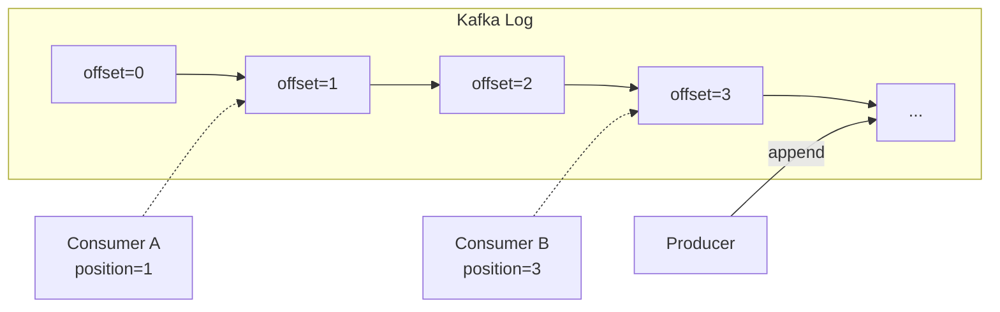
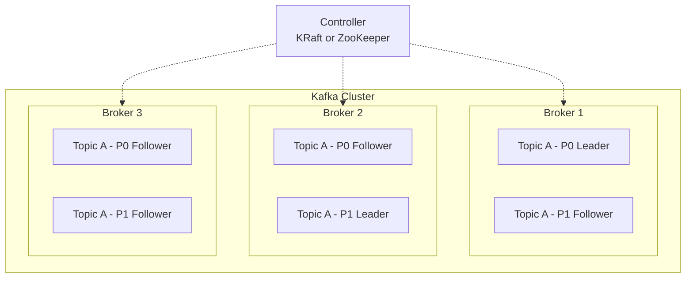
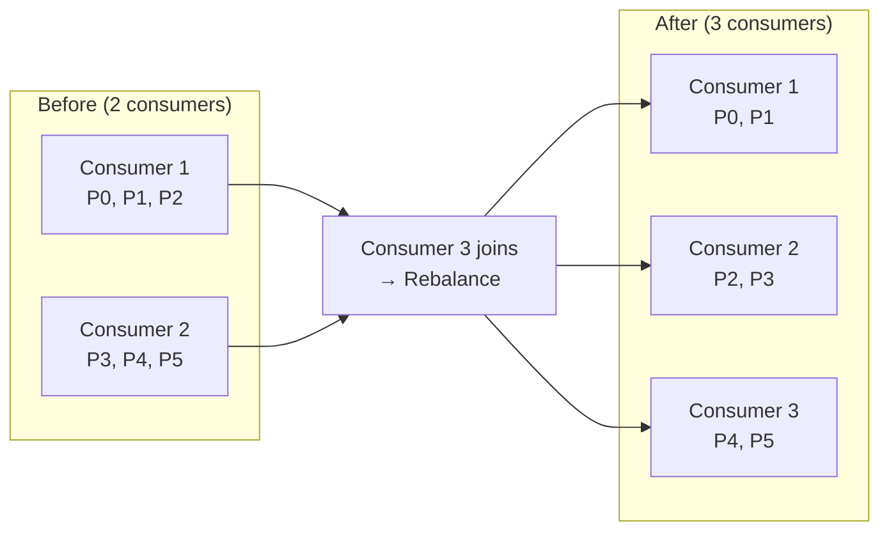
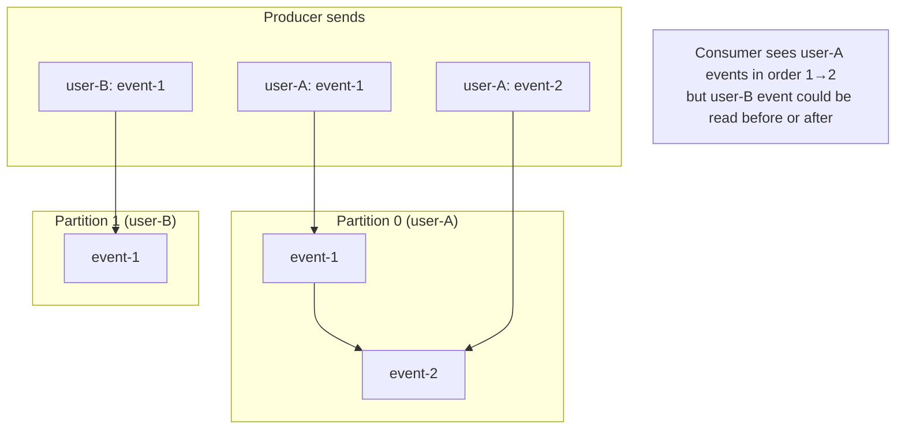
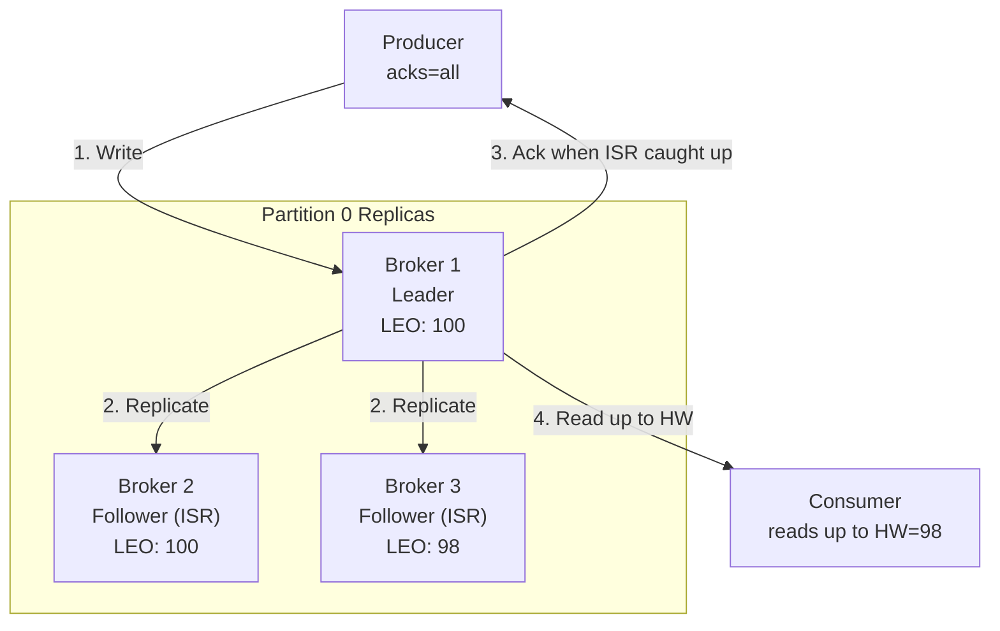
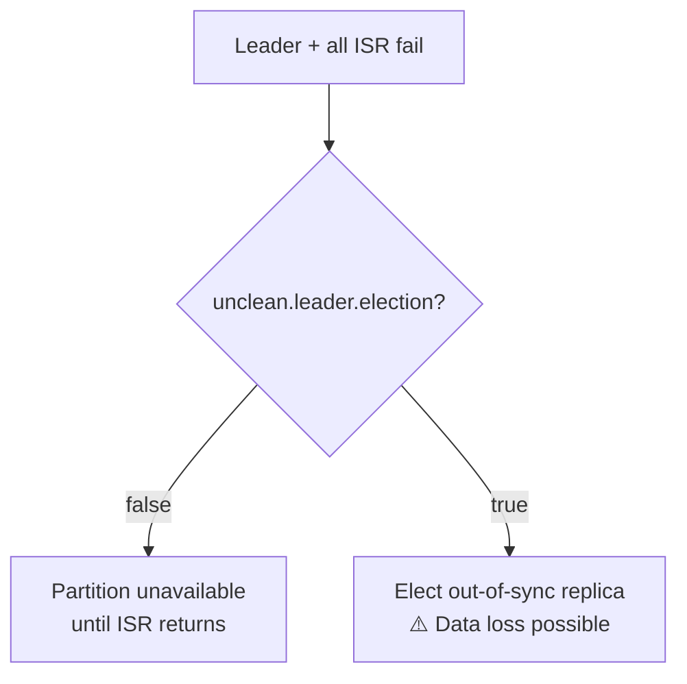
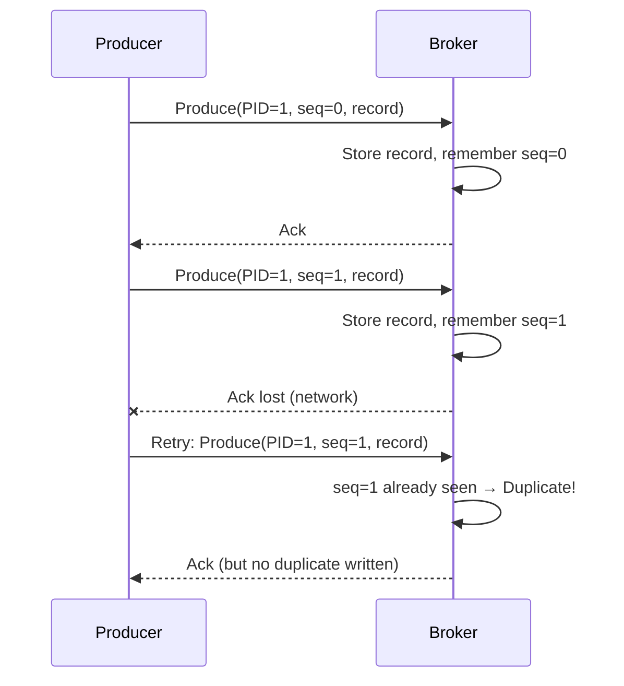
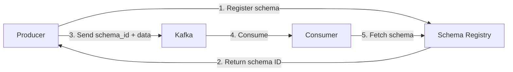

# Kafka Architecture — Deep Dive

> Practical patterns for producers, consumers, partitioning, and reliability configuration.

**Prerequisites:** [Communication Patterns](./02_COMMUNICATION_PATTERNS.md), [Replication & Partitioning](./06_REPLICATION_AND_PARTITIONING.md)
**Related:** [Consensus Protocols](./DD_CONSENSUS_PROTOCOLS.md), [Storage Engines](./DD_STORAGE_ENGINES.md)

---

## Document Navigation

| Section | Focus | Interview Relevance |
|---------|-------|---------------------|
| [Core Concepts](#1-core-concepts) | Brokers, topics, partitions, offsets | "How does Kafka work?" |
| [Producer Patterns](#2-producer-patterns) | acks, idempotence, batching configs | "Configure producer for durability" |
| [Consumer Patterns](#3-consumer-patterns) | Consumer groups, offset management | "Handle consumer failures" |
| [Partition Design](#4-partition-design) | Key selection, ordering guarantees | "Design keys for ordering" |
| [Reliability Configuration](#5-reliability-configuration) | Replication, ISR, min.insync.replicas | "Prevent data loss" |
| [Exactly-Once Semantics](#6-exactly-once-semantics) | Idempotent producers, transactions | "Achieve exactly-once delivery" |
| [Operations & Monitoring](#7-operations--monitoring) | Lag monitoring, schema registry, DLQ | "Monitor Kafka in production" |
| [Common Pitfalls](#8-common-pitfalls) | Anti-patterns and solutions | Avoid interview red flags |
| [Interview Articulation](#9-interview-articulation) | 30-second and 2-minute versions | Concise explanations |
| [Quick Reference Card](#10-quick-reference-card) | Configuration cheat sheet | Quick lookup |

---

## 1. Core Concepts

### The Log Abstraction

Kafka is a distributed **append-only commit log**. Messages are written to the end of a log and read sequentially by offset. This enables high throughput (sequential I/O), replay (consumers track their own position), and decoupling (producers and consumers operate independently).



### Brokers, Topics, Partitions



| Concept | Description |
|---------|-------------|
| **Broker** | Single Kafka server storing partitions and serving clients |
| **Topic** | Logical category for messages (e.g., `orders`, `user-events`) |
| **Partition** | Ordered log within a topic; unit of parallelism |
| **Offset** | Sequential ID for each message within a partition |
| **Consumer Group** | Set of consumers that share partition assignments |
| **ISR** | In-Sync Replicas; followers caught up to the leader |

### Key Terminology Quick Reference

| Term | Meaning |
|------|---------|
| **Leader** | Partition replica that handles all reads/writes |
| **Follower** | Replica that pulls from leader to stay in sync |
| **High Watermark** | Offset up to which data is replicated to ISR (committed) |
| **Log End Offset (LEO)** | Next offset to be written on a replica |
| **Consumer Lag** | Difference between latest offset and consumer's current position |

---

## 2. Producer Patterns

### Pattern 1: Fire-and-Forget (Maximum Throughput)

```python
producer = KafkaProducer(
    bootstrap_servers='localhost:9092',
    acks=0  # Don't wait for any acknowledgment
)

# Send and don't wait for response
producer.send('metrics', key=b'cpu', value=b'75')
```

| Configuration | Value |
|---------------|-------|
| `acks` | `0` |
| **Durability** | None (messages may be lost) |
| **Throughput** | Highest |
| **Use Case** | Metrics, logs where loss is acceptable |

### Pattern 2: Leader Acknowledged (Balanced)

```python
producer = KafkaProducer(
    bootstrap_servers='localhost:9092',
    acks=1  # Wait for leader acknowledgment
)

future = producer.send('orders', key=b'user-123', value=b'order-data')
result = future.get(timeout=10)  # Block until ack
```

| Configuration | Value |
|---------------|-------|
| `acks` | `1` |
| **Durability** | Leader only (loss if leader fails before replication) |
| **Throughput** | High |
| **Use Case** | Most applications, acceptable small loss window |

### Pattern 3: Fully Durable (Maximum Safety)

```python
producer = KafkaProducer(
    bootstrap_servers='localhost:9092',
    acks='all',  # Wait for all ISR replicas
    retries=3,
    retry_backoff_ms=100
)

future = producer.send('payments', key=b'txn-456', value=b'payment-data')
result = future.get(timeout=30)
```

| Configuration | Value |
|---------------|-------|
| `acks` | `all` (or `-1`) |
| **Durability** | Full ISR replication |
| **Throughput** | Lower (waits for replication) |
| **Use Case** | Financial data, audit logs, critical events |

### Pattern 4: Idempotent Producer (Exactly-Once within Partition)

```python
producer = KafkaProducer(
    bootstrap_servers='localhost:9092',
    acks='all',
    enable_idempotence=True,  # Enable exactly-once
    max_in_flight_requests_per_connection=5  # Safe with idempotence
)

# Retries won't create duplicates
producer.send('orders', key=b'order-789', value=b'order-data')
```

| Configuration | Value |
|---------------|-------|
| `enable.idempotence` | `true` |
| `acks` | `all` (required) |
| **Guarantee** | No duplicates on retry within partition |
| **Use Case** | Any application where duplicates are problematic |

### Producer Configuration Decision Table

| Requirement | acks | enable.idempotence | retries | Notes |
|-------------|------|-------------------|---------|-------|
| Maximum throughput, loss OK | `0` | `false` | `0` | Metrics, debug logs |
| Balanced (default for most) | `1` | `true` | `MAX_INT` | General purpose |
| No data loss | `all` | `true` | `MAX_INT` | Combine with `min.insync.replicas=2` |
| Exactly-once (partition) | `all` | `true` | `MAX_INT` | Default since Kafka 3.0 |

### Batching Configuration

```python
producer = KafkaProducer(
    batch_size=65536,  # 64KB batches (default 16KB)
    linger_ms=10,      # Wait up to 10ms for batch to fill
    compression_type='lz4'  # Compress batches
)
```

| Config | Default | Tuning Guidance |
|--------|---------|-----------------|
| `batch.size` | 16384 | Increase for throughput (64KB-256KB) |
| `linger.ms` | 0 | Increase for better batching (5-100ms) |
| `compression.type` | none | `lz4` (fast), `zstd` (best ratio) |

---

## 3. Consumer Patterns

### Pattern 1: Simple Consumer (Auto-Commit)

```python
consumer = KafkaConsumer(
    'orders',
    bootstrap_servers='localhost:9092',
    group_id='order-processors',
    auto_offset_reset='earliest',  # Start from beginning if no committed offset
    enable_auto_commit=True,       # Commit offsets automatically
    auto_commit_interval_ms=5000   # Every 5 seconds
)

for message in consumer:
    process(message)
    # Offset committed automatically in background
```

| Configuration | Value |
|---------------|-------|
| `enable.auto.commit` | `true` |
| **Guarantee** | At-least-once (may reprocess on crash) |
| **Simplicity** | Highest |
| **Use Case** | Idempotent processing, simple workloads |

### Pattern 2: Manual Offset Commit (Control)

```python
consumer = KafkaConsumer(
    'orders',
    bootstrap_servers='localhost:9092',
    group_id='order-processors',
    enable_auto_commit=False  # Manual control
)

for message in consumer:
    try:
        process(message)
        consumer.commit()  # Commit after successful processing
    except ProcessingError:
        # Don't commit - will retry on next poll
        log_error(message)
```

| Configuration | Value |
|---------------|-------|
| `enable.auto.commit` | `false` |
| **Guarantee** | At-least-once with controlled semantics |
| **Use Case** | When you need to ensure processing before commit |

### Pattern 3: Batch Processing with Manual Commit

```python
consumer = KafkaConsumer(
    'orders',
    bootstrap_servers='localhost:9092',
    group_id='batch-processors',
    enable_auto_commit=False,
    max_poll_records=100  # Process up to 100 records per poll
)

while True:
    records = consumer.poll(timeout_ms=1000)
    if records:
        batch = []
        for tp, messages in records.items():
            batch.extend(messages)

        process_batch(batch)  # Process entire batch
        consumer.commit()     # Commit after batch succeeds
```

### Pattern 4: Exactly-Once Processing (with Transactions)

```python
consumer = KafkaConsumer(
    'input-topic',
    bootstrap_servers='localhost:9092',
    group_id='exactly-once-processors',
    enable_auto_commit=False,
    isolation_level='read_committed'  # Only read committed messages
)

producer = KafkaProducer(
    bootstrap_servers='localhost:9092',
    transactional_id='my-transactional-producer'
)
producer.init_transactions()

for message in consumer:
    producer.begin_transaction()
    try:
        result = transform(message)
        producer.send('output-topic', value=result)

        # Commit offset as part of transaction
        producer.send_offsets_to_transaction(
            {TopicPartition(message.topic, message.partition):
             OffsetAndMetadata(message.offset + 1)},
            consumer.group_id
        )
        producer.commit_transaction()
    except Exception:
        producer.abort_transaction()
```

### Consumer Group Rebalancing

When consumers join or leave, partitions are redistributed:



### Minimizing Rebalance Impact

| Configuration | Value | Effect |
|---------------|-------|--------|
| `partition.assignment.strategy` | `CooperativeStickyAssignor` | Incremental rebalancing (no stop-the-world) |
| `group.instance.id` | `"consumer-host-1"` | Static membership (survives restarts) |
| `session.timeout.ms` | `30000` | Time before consumer declared dead |
| `max.poll.interval.ms` | `300000` | Max time between polls before rebalance |
| `max.poll.records` | `100-500` | Smaller batches = faster polls |

```python
# Recommended consumer configuration for stability
consumer = KafkaConsumer(
    'orders',
    bootstrap_servers='localhost:9092',
    group_id='stable-processors',
    group_instance_id='processor-host-1',  # Static membership
    partition_assignment_strategy=['CooperativeStickyAssignor'],
    session_timeout_ms=30000,
    max_poll_interval_ms=300000,
    max_poll_records=200
)
```

---

## 4. Partition Design

### Partition Key Selection

**Key Insight**: Messages with the same key always go to the same partition, guaranteeing ordering.

```python
# Good: Order events ordered per user
producer.send('orders', key=b'user-123', value=order_data)

# Good: All events for an order stay together
producer.send('order-events', key=b'order-456', value=event_data)

# Bad: No key = round-robin = no ordering guarantee
producer.send('orders', value=order_data)  # Different partitions each time
```

### Partition Key Patterns

#### Pattern 1: Entity ID

```python
# Events for same entity are ordered
key = f"user:{user_id}".encode()
key = f"order:{order_id}".encode()
key = f"device:{device_id}".encode()
```

**Use when**: You need ordering per entity.

#### Pattern 2: Composite Key (Namespace)

```python
# Multi-tenant with tenant-level ordering
key = f"tenant:{tenant_id}:user:{user_id}".encode()
```

**Use when**: Multi-tenant systems needing isolation.

#### Pattern 3: No Key (Maximum Parallelism)

```python
# Round-robin across partitions
producer.send('logs', value=log_data)  # No key
```

**Use when**: Ordering doesn't matter, want maximum throughput.

### Ordering Guarantees

| Scenario | Ordering Guarantee |
|----------|-------------------|
| Same key, same partition | **Yes** - strict order |
| Same key, different partitions | Not possible (same key = same partition) |
| Different keys, same partition | **Yes** - order within partition |
| Different keys, different partitions | **No** - no cross-partition ordering |



### Partition Count Guidelines

| Factor | More Partitions | Fewer Partitions |
|--------|-----------------|------------------|
| **Throughput** | Higher parallelism | Lower |
| **Consumer scaling** | More consumers can help | Limited by count |
| **Rebalance time** | Slower | Faster |
| **Memory/file handles** | Higher | Lower |
| **End-to-end latency** | Can increase | Lower |

**Rule of Thumb**:
- Start with `max(expected_throughput_MB/s, expected_consumer_count)`
- Typical: 6-12 for low-volume, 30-100 for high-volume topics
- Maximum recommended: ~4000 partitions per broker

---

## 5. Reliability Configuration

### Replication Model



### acks + min.insync.replicas Decision Matrix

| acks | min.insync.replicas | replication.factor | Behavior | Data Loss Risk |
|------|---------------------|-------------------|----------|----------------|
| `0` | N/A | Any | Fire and forget | High |
| `1` | N/A | Any | Leader ack only | Medium (leader failure) |
| `all` | `1` | 3 | Wait for any replica | Low (all replicas fail) |
| `all` | `2` | 3 | Wait for leader + 1 follower | Very low |
| `all` | `3` | 3 | Wait for all replicas | Lowest (but reduced availability) |

### Recommended Production Configuration

```properties
# Topic configuration
replication.factor=3
min.insync.replicas=2

# Producer configuration
acks=all
enable.idempotence=true
retries=2147483647
```

**Trade-off**: With `min.insync.replicas=2` and `RF=3`:
- Can tolerate 1 broker failure for reads AND writes
- 2 broker failures = writes rejected (availability sacrifice for safety)

### Unclean Leader Election

| `unclean.leader.election.enable` | Behavior | When to Use |
|----------------------------------|----------|-------------|
| `false` (default) | Partition unavailable if no ISR replica | Financial, audit, critical data |
| `true` | Elect any replica (may lose data) | Metrics, logs, availability > consistency |



---

## 6. Exactly-Once Semantics

### When You Need It vs When You Don't

| Scenario | Recommendation |
|----------|---------------|
| Idempotent consumers (database upserts) | At-least-once is fine |
| Metrics, logs | At-least-once or even at-most-once |
| Financial transactions | Exactly-once |
| Stream processing (read-process-write) | Exactly-once |
| Event sourcing (replay must be deterministic) | Exactly-once |

### How Idempotent Producer Works



### Configuration Steps

**1. Enable Idempotent Producer** (default in Kafka 3.0+)

```python
producer = KafkaProducer(
    enable_idempotence=True,
    acks='all'
)
```

**2. For Cross-Partition Atomicity, Use Transactions**

```python
producer = KafkaProducer(
    transactional_id='order-processor-1',
    enable_idempotence=True
)
producer.init_transactions()

producer.begin_transaction()
try:
    producer.send('topic-a', value=b'data1')
    producer.send('topic-b', value=b'data2')
    producer.commit_transaction()
except:
    producer.abort_transaction()
```

**3. Consumer Reads Only Committed**

```python
consumer = KafkaConsumer(
    'topic-a',
    isolation_level='read_committed'  # Skip uncommitted/aborted
)
```

### Transaction Overhead

| Component | Overhead |
|-----------|----------|
| InitProducerId | ~10-50ms (once per producer) |
| Transaction markers | 2 per transaction |
| Coordinator RPCs | +2 round trips per transaction |
| Latency | +5-20ms per transaction |
| Throughput | ~20-30% lower |

**Guidance**: Batch multiple records per transaction. Single-record transactions have high overhead.

---

## 7. Operations & Monitoring

### Essential Metrics

| Metric | Alert Threshold | Meaning |
|--------|-----------------|---------|
| **Consumer lag** | > 10000 or increasing for 5 min | Consumer can't keep up |
| **Under-replicated partitions** | > 0 | Replicas not in sync |
| **ISR shrink rate** | > 0 | Followers falling behind |
| **Request latency (p99)** | > 100ms | Broker overloaded |
| **Offline partitions** | > 0 | Partition unavailable |

### Monitoring Consumer Lag

```bash
# CLI check
kafka-consumer-groups.sh --bootstrap-server localhost:9092 \
    --describe --group my-consumer-group

# Key metrics
# LAG = LOG-END-OFFSET - CURRENT-OFFSET
# If LAG increasing → consumer too slow
```

### Dead Letter Queue Pattern

```python
def process_with_dlq(consumer, dlq_producer, max_retries=3):
    for record in consumer:
        retries = int(record.headers.get('retry_count', 0))

        try:
            process(record)
            consumer.commit()
        except RetryableError:
            if retries < max_retries:
                # Send back to main topic with retry count
                producer.send(
                    record.topic,
                    key=record.key,
                    value=record.value,
                    headers={'retry_count': str(retries + 1)}
                )
            else:
                send_to_dlq(dlq_producer, record)
            consumer.commit()
        except NonRetryableError:
            send_to_dlq(dlq_producer, record)
            consumer.commit()

def send_to_dlq(dlq_producer, record):
    dlq_producer.send(
        f'{record.topic}.dlq',
        key=record.key,
        value=record.value,
        headers={
            'original_topic': record.topic,
            'error': str(error),
            'timestamp': str(time.time())
        }
    )
```

### Schema Registry Basics



**Key Points**:
- Store Avro/Protobuf/JSON schemas centrally
- Enforce compatibility rules (backward, forward, full)
- Producers register, consumers lookup by ID
- Prevents breaking changes in production

### Multi-Datacenter Considerations

| Pattern | Description | Use Case |
|---------|-------------|----------|
| **Active-Passive** | One-way replication for DR | Disaster recovery |
| **Active-Active** | Bidirectional replication | Multi-region writes |
| **Aggregation** | Regional → Central | Analytics, reporting |

Use MirrorMaker 2 for cross-cluster replication with automatic offset translation.

---

## 8. Common Pitfalls

### Anti-Pattern 1: Wrong Partition Key (Hot Partitions)

```python
# Bad: Low cardinality key
key = f"date:{today}".encode()  # All today's data in one partition!

# Good: High cardinality key
key = f"order:{order_id}".encode()  # Distributed across partitions
```

**Symptom**: One partition has much more data/traffic than others.
**Fix**: Use high-cardinality keys or add a random suffix for write-heavy scenarios.

### Anti-Pattern 2: Ignoring Consumer Lag

```python
# Bad: No lag monitoring
for message in consumer:
    slow_database_operation(message)  # Lag grows silently

# Good: Monitor lag and alert
# Set up Prometheus/Grafana alerting on kafka_consumer_lag
# Alert if lag > 10000 or increasing for 5 minutes
```

**Symptom**: Consumers fall behind, eventual memory issues, stale data.
**Fix**: Monitor lag, scale consumers, optimize processing.

### Anti-Pattern 3: Auto-Commit with Long Processing

```python
# Bad: Auto-commit with slow processing
consumer = KafkaConsumer(
    'orders',
    enable_auto_commit=True,
    auto_commit_interval_ms=5000
)
for message in consumer:
    slow_operation(message)  # Takes 10 seconds
    # Offset committed before processing finishes!
    # If crash: message lost

# Good: Manual commit after processing
consumer = KafkaConsumer(
    'orders',
    enable_auto_commit=False
)
for message in consumer:
    slow_operation(message)
    consumer.commit()  # Only after success
```

**Symptom**: Messages "lost" (actually skipped) on consumer crash.
**Fix**: Use manual commit or ensure processing is faster than commit interval.

### Anti-Pattern 4: Too Many Partitions

```python
# Bad: Creating topic with 1000 partitions "just in case"
# → Slow rebalances, high memory usage, many file handles

# Good: Start small, increase as needed
# 6-12 partitions for most topics
# Partitions can be added (not removed!)
```

**Symptom**: Slow rebalances, high broker resource usage.
**Fix**: Start with fewer partitions, scale based on actual throughput needs.

### Anti-Pattern 5: Treating Kafka as a Database

```python
# Bad: Expecting Kafka to store data forever
retention_ms = -1  # Infinite retention
# Then querying Kafka for historical lookups

# Good: Kafka for streaming, sink to database for queries
# Set reasonable retention (7-30 days typical)
# Use Kafka Connect to sink to database/data warehouse
```

**Symptom**: Unbounded storage growth, slow consumer startup from offset 0.
**Fix**: Use Kafka for streaming, sink to proper databases for queries.

### Anti-Pattern 6: No Idempotent Consumers

```python
# Bad: Consumer that can't handle duplicates
def process(message):
    db.insert(message)  # Fails on retry!

# Good: Idempotent processing
def process(message):
    db.upsert(
        key=message.key,
        value=message.value
    )  # Safe to retry
```

**Symptom**: Duplicate data, constraint violations on retries.
**Fix**: Design consumers to handle duplicates (upserts, deduplication checks).

---

## 9. Interview Articulation

### 30-Second Version

> "Kafka is a distributed commit log that decouples producers from consumers. Data is published to topics, split into partitions for parallelism. Each partition is an ordered, append-only log. Partitions are replicated across brokers with one leader handling reads and writes. Consumers in a group share partitions, tracking their position via offsets. The key insight: treating data as a log enables sequential I/O, replay capability, and millions of messages per second."

### Common Interview Questions

| Question | Key Points |
|----------|------------|
| "How does Kafka guarantee ordering?" | Ordering within partition only. Same key → same partition. Enable idempotence for producer ordering guarantees. |
| "What happens if a consumer dies?" | Coordinator detects via heartbeat timeout, triggers rebalance, reassigns partitions. Consumer restarts from last committed offset (may reprocess). |
| "How would you achieve exactly-once?" | Idempotent producer (`enable.idempotence=true`), transactions for cross-partition atomicity, consumers with `read_committed` isolation. |
| "Kafka vs RabbitMQ?" | Kafka: log-based, retains messages, replay possible, higher throughput, better for streaming. RabbitMQ: traditional broker, message deleted on consume, complex routing. |
| "How does replication work?" | Leader accepts writes, followers pull to replicate. ISR tracks caught-up replicas. High watermark = committed offset. `acks=all` waits for ISR replication. |
| "What's a partition?" | Ordered log within a topic. Unit of parallelism. Distributed across brokers. One consumer per partition per group. More partitions = more parallelism but more overhead. |

---

## 10. Quick Reference Card

### Producer Configuration Cheat Sheet

| Config | Default | Production | Purpose |
|--------|---------|------------|---------|
| `acks` | `1` | `all` | Durability guarantee |
| `enable.idempotence` | `true` (3.0+) | `true` | Prevent duplicates |
| `retries` | `MAX_INT` | `MAX_INT` | Retry on failure |
| `batch.size` | `16384` | `65536` | Batching for throughput |
| `linger.ms` | `0` | `5-20` | Wait for batch to fill |
| `compression.type` | `none` | `lz4` | Network/storage savings |

### Consumer Configuration Cheat Sheet

| Config | Default | Guidance |
|--------|---------|----------|
| `auto.offset.reset` | `latest` | `earliest` if you need all data |
| `enable.auto.commit` | `true` | `false` for exactly-once |
| `max.poll.records` | `500` | Lower for slow processing |
| `session.timeout.ms` | `45000` | Balance detection vs false positives |
| `partition.assignment.strategy` | `RangeAssignor` | `CooperativeStickyAssignor` |

### Topic/Broker Configuration Cheat Sheet

| Config | Default | Production |
|--------|---------|------------|
| `replication.factor` | `1` | `3` |
| `min.insync.replicas` | `1` | `2` |
| `unclean.leader.election.enable` | `false` | Keep `false` for critical data |
| `retention.ms` | `604800000` (7d) | Based on use case |

### Durability Guarantees Summary

```
┌─────────────────────────────────────────────────────────────────┐
│  DURABILITY CONFIGURATION QUICK REFERENCE                        │
├─────────────────────────────────────────────────────────────────┤
│                                                                  │
│  acks=0                 → No guarantee (fire and forget)        │
│  acks=1                 → Leader only (may lose on failure)     │
│  acks=all, min.isr=1    → At least 1 replica                    │
│  acks=all, min.isr=2    → At least 2 replicas (recommended)     │
│                                                                  │
│  FORMULA FOR FAULT TOLERANCE:                                    │
│  • Can lose (RF - min.isr) brokers and still WRITE              │
│  • Can lose (RF - 1) brokers and still READ                     │
│                                                                  │
│  EXAMPLE (RF=3, min.isr=2):                                      │
│  • Lose 1 broker → writes continue (2 ISR remaining)            │
│  • Lose 2 brokers → writes blocked (only 1 ISR < min.isr)       │
│                                                                  │
└─────────────────────────────────────────────────────────────────┘
```

### Consumer Checklist

- [ ] Set meaningful `group.id`
- [ ] Configure `auto.offset.reset` (earliest vs latest)
- [ ] Choose commit strategy (auto vs manual)
- [ ] Set appropriate `max.poll.records` for processing time
- [ ] Use `CooperativeStickyAssignor` for smoother rebalances
- [ ] Consider static membership (`group.instance.id`) for stable deployments
- [ ] Monitor consumer lag
- [ ] Implement idempotent processing

---

## References

### Official Documentation

- [Apache Kafka Documentation](https://kafka.apache.org/documentation/)
- [Kafka Configuration Reference](https://kafka.apache.org/documentation/#configuration)
- [Kafka Design](https://kafka.apache.org/documentation/#design)

### Confluent Engineering

- [Exactly-Once Semantics](https://www.confluent.io/blog/exactly-once-semantics-are-possible-heres-how-apache-kafka-does-it/)
- [Incremental Cooperative Rebalancing](https://www.confluent.io/blog/incremental-cooperative-rebalancing-in-kafka/)
- [Choosing Partition Count](https://www.confluent.io/blog/how-choose-number-topics-partitions-kafka-cluster/)

### Books

- Narkhede, Shapira, Palino — *Kafka: The Definitive Guide* (O'Reilly)
- Kleppmann — *Designing Data-Intensive Applications*, Chapter 11 (O'Reilly)

---

## Revision History

| Date | Change |
|------|--------|
| 2025-01 | Refactored for practical focus: patterns, configurations, common pitfalls |

---

## Navigation

**Prerequisites:** [Communication Patterns](./02_COMMUNICATION_PATTERNS.md), [Replication & Partitioning](./06_REPLICATION_AND_PARTITIONING.md)
**Related:** [Consensus Protocols](./DD_CONSENSUS_PROTOCOLS.md), [Storage Engines](./DD_STORAGE_ENGINES.md)
**Index:** [README](./README.md)
