# DD — Redis Internals

> More than a cache: a data structure server that redefined in-memory computing.

**Prerequisites:** [Caching & Content Delivery](./05_CACHING_AND_CONTENT_DELIVERY.md), [Replication & Partitioning](./06_REPLICATION_AND_PARTITIONING.md)
**Related:** [Consistent Hashing](./DD_CONSISTENT_HASHING.md) (for clustering), [Consensus Protocols](./DD_CONSENSUS_PROTOCOLS.md) (for Sentinel)
**Estimated study time:** 2.5-3 hours

---

## Table of Contents

1. [Context & Design Philosophy](#1-context--design-philosophy)
2. [Core Data Structures with Complexity](#2-core-data-structures-with-complexity)
3. [Memory Management](#3-memory-management)
4. [Persistence Mechanisms](#4-persistence-mechanisms)
5. [Replication](#5-replication)
6. [Redis Sentinel](#6-redis-sentinel)
7. [Redis Cluster](#7-redis-cluster)
8. [Distributed Locking (Redlock)](#8-distributed-locking-redlock)
9. [Lua Scripting & Transactions](#9-lua-scripting--transactions)
10. [Performance Optimization](#10-performance-optimization)
11. [Production Patterns](#11-production-patterns)
12. [Failure Scenarios](#12-failure-scenarios)
13. [Interview Articulation](#13-interview-articulation)
14. [Quick Reference Card](#14-quick-reference-card)
15. [References](#references)

---

## 1. Context & Design Philosophy

### Why Redis Exists

Redis (Remote Dictionary Server) was created by Salvatore Sanfilippo in 2009 to solve a specific problem: LLOOGG, a real-time log analyzer, needed faster data access than MySQL could provide. The insight was simple yet powerful—keep data in memory, but provide rich data structures beyond simple key-value pairs.

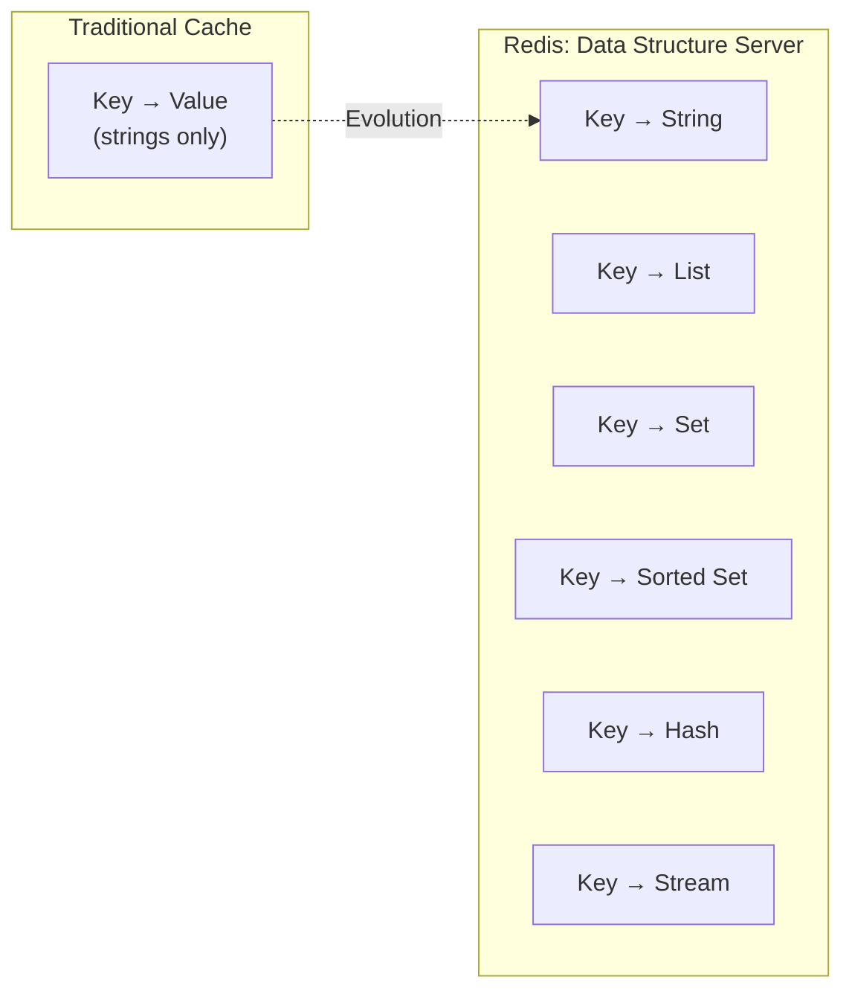
```mermaid
flowchart LR
    subgraph "Traditional Cache"
        TC["Key → Value<br/>(strings only)"]
    end

    subgraph "Redis: Data Structure Server"
        DS1["Key → String"]
        DS2["Key → List"]
        DS3["Key → Set"]
        DS4["Key → Sorted Set"]
        DS5["Key → Hash"]
        DS6["Key → Stream"]
    end

    TC -.->|"Evolution"| DS1
```

### The Single-Threaded Event Loop

Redis processes commands in a single thread using an event loop model (similar to Node.js). This is not a limitation—it's a deliberate design choice.

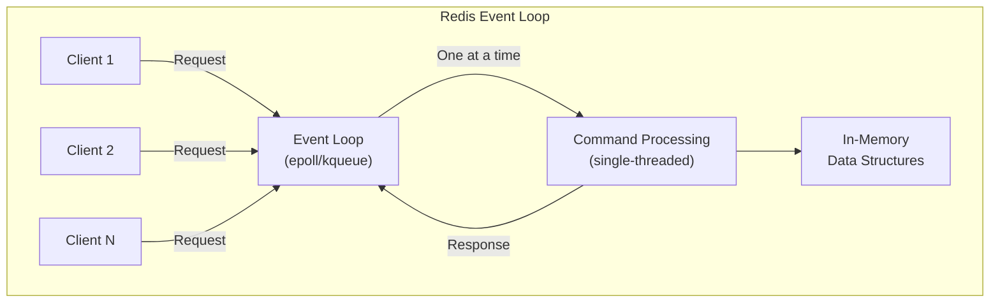
```mermaid
flowchart TB
    subgraph "Redis Event Loop"
        EL["Event Loop<br/>(epoll/kqueue)"]

        C1["Client 1"]
        C2["Client 2"]
        C3["Client N"]

        CMD["Command Processing<br/>(single-threaded)"]

        MEM["In-Memory<br/>Data Structures"]

        C1 -->|"Request"| EL
        C2 -->|"Request"| EL
        C3 -->|"Request"| EL

        EL -->|"One at a time"| CMD
        CMD --> MEM
        CMD -->|"Response"| EL
    end
```

**Why single-threaded works:**

| Aspect | Benefit |
|--------|---------|
| No locks | Operations are atomic by design |
| No context switches | Predictable latency |
| Simpler reasoning | Easier to debug and maintain |
| CPU efficiency | Memory bandwidth is the bottleneck, not CPU |

**The trade-off:** Cannot utilize multiple cores for command processing. Redis 6.0+ added I/O threading for network operations, but command execution remains single-threaded.

### Memory-First with Optional Persistence

Redis is fundamentally an in-memory database with persistence as an option, not the other way around. This inverts the traditional database model:

| Traditional DB | Redis |
|---------------|-------|
| Disk is primary, memory is cache | Memory is primary, disk is backup |
| Durability by default | Speed by default |
| Reads may hit disk | Reads always from memory |

### "Data Structure Server" vs "Key-Value Store"

Calling Redis a "key-value store" undersells its capabilities. The distinction matters:

```python
# Simple key-value (Memcached style)
cache.set("user:1:name", "Alice")
name = cache.get("user:1:name")

# Redis: Rich data structures
redis.hset("user:1", {"name": "Alice", "email": "alice@example.com"})
redis.hincrby("user:1", "login_count", 1)
redis.zadd("leaderboard", {"Alice": 1000, "Bob": 950})
redis.lpush("user:1:notifications", "New message!")
```

The server-side data manipulation eliminates round-trips and reduces network overhead—a critical insight that makes Redis more than a cache.

---

## 2. Core Data Structures with Complexity

Redis implements data structures with careful attention to both time and space complexity. Each structure has multiple internal encodings optimized for different sizes.

### Strings

The foundational type, implemented using Simple Dynamic Strings (SDS).

**Internal Structure:**
```c
struct sdshdr {
    int len;      // Used length
    int free;     // Free space
    char buf[];   // Actual string data
}
```

**Why SDS over C strings:**
- O(1) length retrieval (not O(n) strlen)
- Binary safe (can store any data)
- Buffer overflow prevention
- Reduced reallocations via preallocation

| Operation | Complexity | Notes |
|-----------|------------|-------|
| `GET key` | O(1) | Direct memory access |
| `SET key value` | O(1) | May trigger memory allocation |
| `APPEND key value` | O(1) amortized | Preallocation reduces reallocations |
| `GETRANGE key start end` | O(n) | n = length of substring |
| `INCR key` | O(1) | Atomic increment |

**Use cases:** Caching objects (serialized JSON), counters, rate limiting tokens, session data.

### Lists

Implemented as **quicklists**—a linked list of ziplists (compressed arrays).

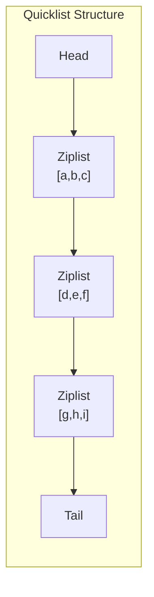
```mermaid
flowchart LR
    subgraph "Quicklist Structure"
        HEAD["Head"] --> Z1["Ziplist<br/>[a,b,c]"]
        Z1 --> Z2["Ziplist<br/>[d,e,f]"]
        Z2 --> Z3["Ziplist<br/>[g,h,i]"]
        Z3 --> TAIL["Tail"]
    end
```

**Why quicklist:**
- Linked list: O(1) head/tail operations
- Ziplists: Cache-friendly, memory-efficient for small sequences
- Hybrid: Best of both worlds

| Operation | Complexity | Notes |
|-----------|------------|-------|
| `LPUSH/RPUSH` | O(1) | Add to head/tail |
| `LPOP/RPOP` | O(1) | Remove from head/tail |
| `LINDEX key index` | O(n) | Must traverse |
| `LRANGE key start stop` | O(S+N) | S = start offset, N = elements returned |
| `LLEN key` | O(1) | Cached length |

**Use cases:** Message queues, activity feeds, recent items lists.

### Sets

Two encodings based on size and content:

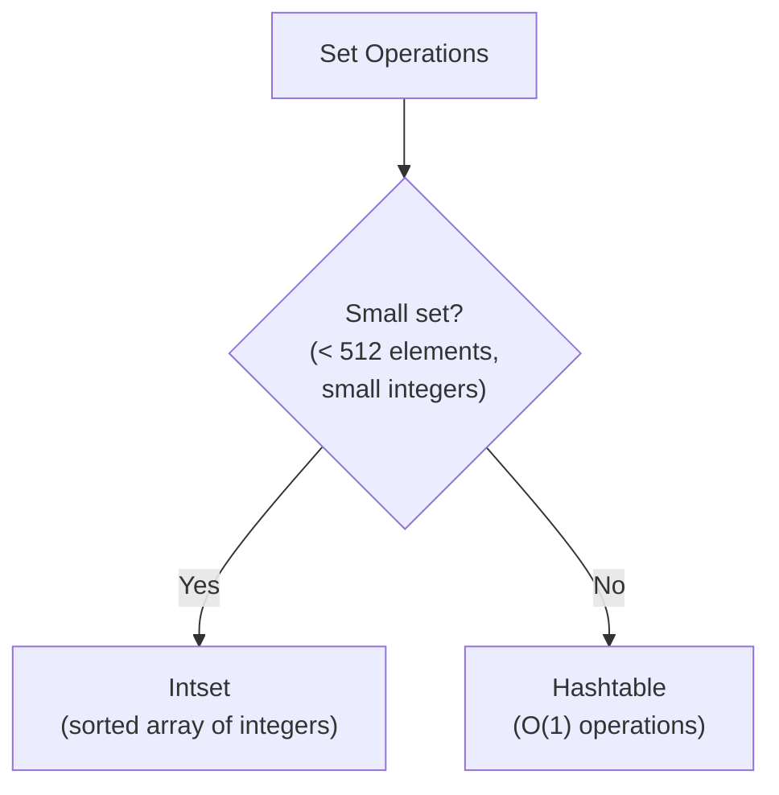
```mermaid
flowchart TD
    SET["Set Operations"]

    SET --> SMALL{"Small set?<br/>(< 512 elements,<br/>small integers)"}

    SMALL -->|"Yes"| INTSET["Intset<br/>(sorted array of integers)"]
    SMALL -->|"No"| HASHTABLE["Hashtable<br/>(O(1) operations)"]
```

| Operation | Complexity | Notes |
|-----------|------------|-------|
| `SADD key member` | O(1) | Hashtable; O(n) for intset insert |
| `SISMEMBER key member` | O(1) | |
| `SMEMBERS key` | O(n) | Returns all members |
| `SINTER key1 key2` | O(N*M) | N = smallest set, M = number of sets |
| `SUNION key1 key2` | O(N) | N = total elements |
| `SCARD key` | O(1) | Cardinality |

**Use cases:** Unique visitors, tags, social graph (followers/following), deduplication.

### Sorted Sets (ZSET)

The most sophisticated structure—dual data structure combining a skip list and a hashtable.

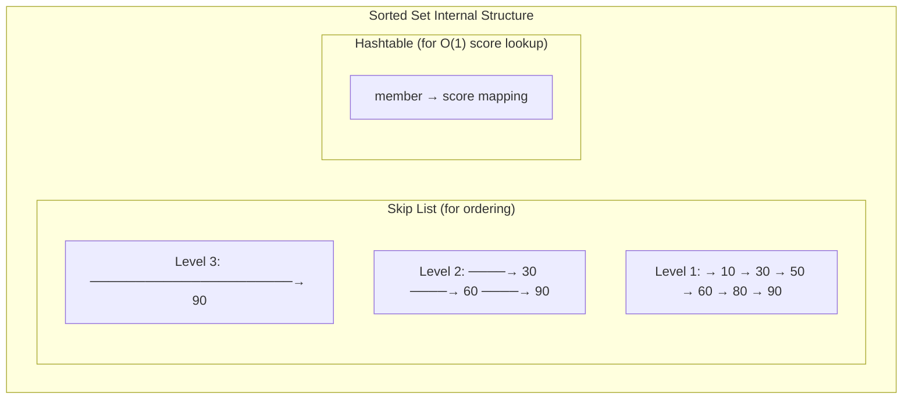
```mermaid
flowchart TB
    subgraph "Sorted Set Internal Structure"
        subgraph "Skip List (for ordering)"
            L3["Level 3: ──────────────────────→ 90"]
            L2["Level 2: ────→ 30 ────→ 60 ────→ 90"]
            L1["Level 1: → 10 → 30 → 50 → 60 → 80 → 90"]
        end

        subgraph "Hashtable (for O(1) score lookup)"
            HT["member → score mapping"]
        end
    end
```

**Skip List** (Pugh, 1990): A probabilistic data structure providing O(log n) search, insert, and delete with simpler implementation than balanced trees.

| Operation | Complexity | Notes |
|-----------|------------|-------|
| `ZADD key score member` | O(log n) | Skip list insertion |
| `ZRANK key member` | O(log n) | Position in sorted order |
| `ZSCORE key member` | O(1) | Via hashtable |
| `ZRANGE key start stop` | O(log n + m) | m = elements returned |
| `ZRANGEBYSCORE key min max` | O(log n + m) | Score-based range |
| `ZCOUNT key min max` | O(log n) | Count in score range |

**Reference:** Pugh, W. (1990). "Skip Lists: A Probabilistic Alternative to Balanced Trees." *Communications of the ACM*, 33(6), 668-676.

**Use cases:** Leaderboards, priority queues, rate limiting with sliding windows, time-based event scheduling.

### Hashes

Object storage with field-level access.

| Size | Encoding | Notes |
|------|----------|-------|
| Small (< 512 fields, < 64 bytes values) | Ziplist | Linear scan, but cache-friendly |
| Large | Hashtable | O(1) field access |

| Operation | Complexity | Notes |
|-----------|------------|-------|
| `HSET key field value` | O(1) | |
| `HGET key field` | O(1) | |
| `HMSET key f1 v1 f2 v2` | O(n) | n = fields being set |
| `HGETALL key` | O(n) | n = total fields |
| `HINCRBY key field delta` | O(1) | Atomic increment |

**Use cases:** Object storage, session data, user profiles, configuration.

### Streams

Redis 5.0 introduced streams—an append-only log data structure inspired by Kafka.

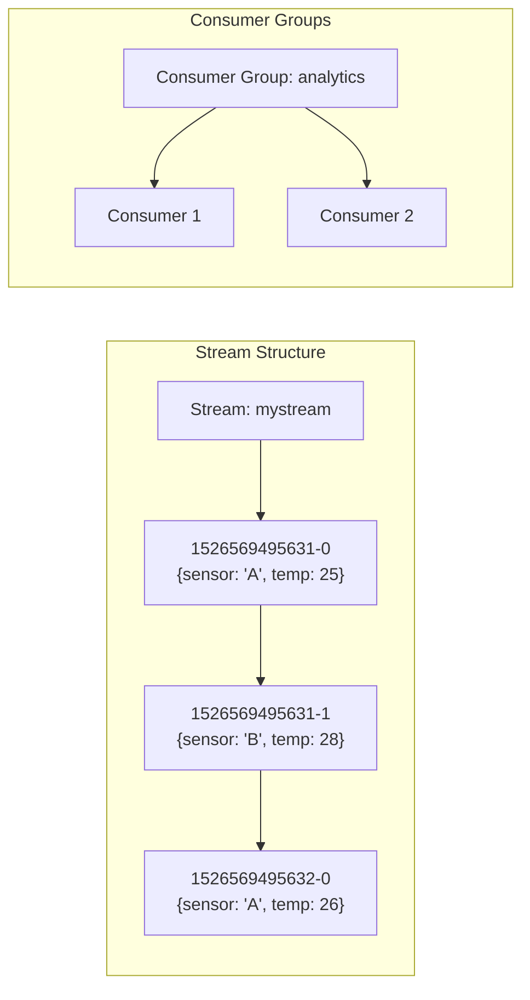
```mermaid
flowchart LR
    subgraph "Stream Structure"
        STREAM["Stream: mystream"]

        E1["1526569495631-0<br/>{sensor: 'A', temp: 25}"]
        E2["1526569495631-1<br/>{sensor: 'B', temp: 28}"]
        E3["1526569495632-0<br/>{sensor: 'A', temp: 26}"]

        STREAM --> E1 --> E2 --> E3
    end

    subgraph "Consumer Groups"
        CG["Consumer Group: analytics"]
        C1["Consumer 1"]
        C2["Consumer 2"]

        CG --> C1
        CG --> C2
    end
```

**Internal implementation:** Radix tree with listpack-encoded entries.

| Operation | Complexity | Notes |
|-----------|------------|-------|
| `XADD stream * field value` | O(1) | Append entry |
| `XREAD STREAMS stream id` | O(n) | n = entries returned |
| `XRANGE stream start end` | O(n) | n = entries in range |
| `XLEN stream` | O(1) | |
| `XACK stream group id` | O(1) | Acknowledge processing |

**Use cases:** Event sourcing, message queues with acknowledgment, activity streams, audit logs.

### HyperLogLog

Probabilistic cardinality estimation using the HyperLogLog algorithm.

**Key properties:**
- Constant memory: 12KB per HyperLogLog
- Standard error: 0.81%
- Counts up to 2^64 unique elements

| Operation | Complexity | Notes |
|-----------|------------|-------|
| `PFADD key element` | O(1) | Add element |
| `PFCOUNT key` | O(1) | Get cardinality estimate |
| `PFMERGE dest key1 key2` | O(n) | Merge multiple HLLs |

**Reference:** Flajolet, P., Fusy, E., Gandouet, O., & Meunier, F. (2007). "HyperLogLog: the analysis of a near-optimal cardinality estimation algorithm." *Discrete Mathematics and Theoretical Computer Science*.

**Use cases:** Unique visitors, unique searches, cardinality of any high-volume set where exact count isn't required.

### Comprehensive Complexity Table

| Data Type | Add | Access | Update | Delete | Iteration |
|-----------|-----|--------|--------|--------|-----------|
| String | O(1) | O(1) | O(1) | O(1) | N/A |
| List (ends) | O(1) | O(n) | O(n) | O(1) | O(n) |
| Set | O(1) | O(1) | O(1) | O(1) | O(n) |
| Sorted Set | O(log n) | O(1)/O(log n)* | O(log n) | O(log n) | O(log n + m) |
| Hash | O(1) | O(1) | O(1) | O(1) | O(n) |
| Stream | O(1) | O(n) | N/A | O(1)** | O(n) |
| HyperLogLog | O(1) | O(1) | N/A | N/A | N/A |

*Score lookup O(1), rank lookup O(log n)
**XTRIM only

---

## 3. Memory Management

### Memory Allocator: jemalloc

Redis uses jemalloc (Jason Evans' malloc) by default, chosen for:
- Reduced fragmentation
- Better multi-threaded performance
- Predictable allocation patterns

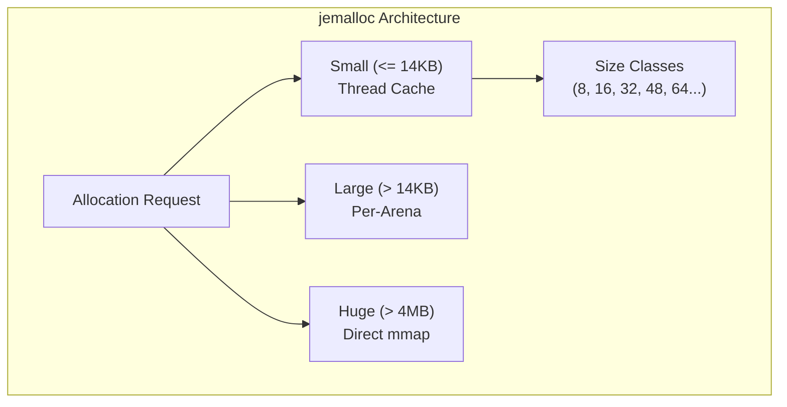
```mermaid
flowchart TB
    subgraph "jemalloc Architecture"
        ALLOC["Allocation Request"]

        SMALL["Small (<= 14KB)<br/>Thread Cache"]
        LARGE["Large (> 14KB)<br/>Per-Arena"]
        HUGE["Huge (> 4MB)<br/>Direct mmap"]

        ALLOC --> SMALL
        ALLOC --> LARGE
        ALLOC --> HUGE

        BINS["Size Classes<br/>(8, 16, 32, 48, 64...)"]
        SMALL --> BINS
    end
```

### Object Encoding Optimizations

Redis automatically selects optimal encodings based on data characteristics:

| Type | Small Encoding | Large Encoding | Threshold |
|------|----------------|----------------|-----------|
| String | `int` or `embstr` | `raw` | 44 bytes |
| List | `quicklist` | `quicklist` | Configurable node size |
| Set | `intset` | `hashtable` | 512 elements or non-integers |
| Sorted Set | `listpack` | `skiplist` | 128 elements or 64-byte members |
| Hash | `listpack` | `hashtable` | 512 fields or 64-byte values |

**Checking encoding:**
```redis
DEBUG OBJECT mykey
```

### Memory Fragmentation

Fragmentation occurs when allocated memory exceeds used memory:

```
Fragmentation Ratio = used_memory_rss / used_memory
```

| Ratio | Interpretation |
|-------|----------------|
| < 1.0 | Swapping occurring (bad!) |
| 1.0-1.5 | Healthy |
| > 1.5 | Significant fragmentation |
| > 2.0 | Critical—consider defragmentation |

**Active defragmentation** (Redis 4.0+):
```redis
CONFIG SET activedefrag yes
CONFIG SET active-defrag-ignore-bytes 100mb
CONFIG SET active-defrag-threshold-lower 10
CONFIG SET active-defrag-threshold-upper 100
```

### Maxmemory Policies

When memory limit is reached, Redis evicts keys according to policy:

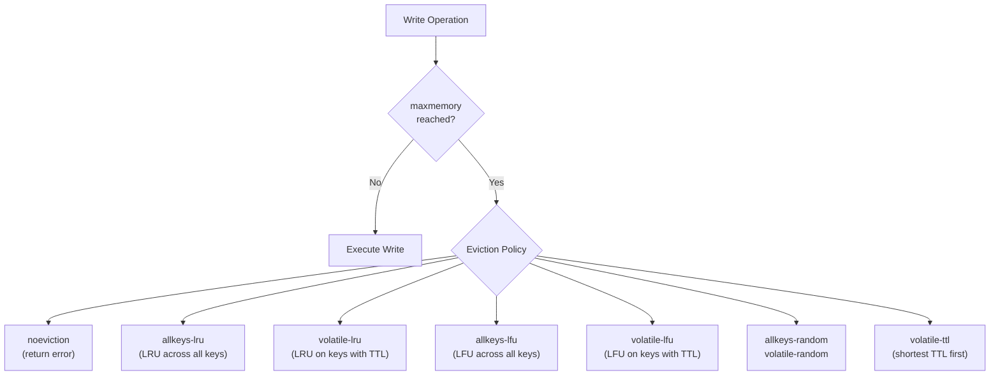
```mermaid
flowchart TD
    WRITE["Write Operation"] --> CHECK{"maxmemory<br/>reached?"}

    CHECK -->|"No"| PROCEED["Execute Write"]
    CHECK -->|"Yes"| POLICY{"Eviction Policy"}

    POLICY --> NOEVICT["noeviction<br/>(return error)"]
    POLICY --> ALLKEYS_LRU["allkeys-lru<br/>(LRU across all keys)"]
    POLICY --> VOLATILE_LRU["volatile-lru<br/>(LRU on keys with TTL)"]
    POLICY --> ALLKEYS_LFU["allkeys-lfu<br/>(LFU across all keys)"]
    POLICY --> VOLATILE_LFU["volatile-lfu<br/>(LFU on keys with TTL)"]
    POLICY --> RANDOM["allkeys-random<br/>volatile-random"]
    POLICY --> TTL["volatile-ttl<br/>(shortest TTL first)"]
```

### LRU vs LFU Trade-offs

| Policy | Behavior | Best For |
|--------|----------|----------|
| LRU | Evict least recently accessed | Recency matters (sessions, recent data) |
| LFU | Evict least frequently accessed | Frequency matters (popular items stay) |

**LFU implementation:** Redis uses an approximation based on a logarithmic counter with decay:

```
counter = min(counter + 1, 255)  // On access
counter = counter - (minutes_since_access * decay_factor)  // Over time
```

Configure with:
```redis
lfu-log-factor 10      # Higher = slower counter growth
lfu-decay-time 1       # Minutes before counter decrements
```

### Memory Efficiency Tips

1. **Use hashes for objects** instead of many keys:
   ```redis
   # Bad: 1000 keys, ~1000 * overhead
   SET user:1:name "Alice"
   SET user:1:email "alice@example.com"

   # Good: 1 key with fields
   HSET user:1 name "Alice" email "alice@example.com"
   ```

2. **Use short key names** in high-volume scenarios

3. **Enable compression** for large values (application-level)

4. **Set TTLs** to prevent unbounded growth

5. **Monitor memory** continuously:
   ```redis
   INFO memory
   MEMORY DOCTOR
   MEMORY STATS
   ```

---

## 4. Persistence Mechanisms

Redis offers multiple persistence options, each with distinct durability/performance trade-offs.

### RDB (Snapshotting)

Point-in-time snapshots saved to disk.

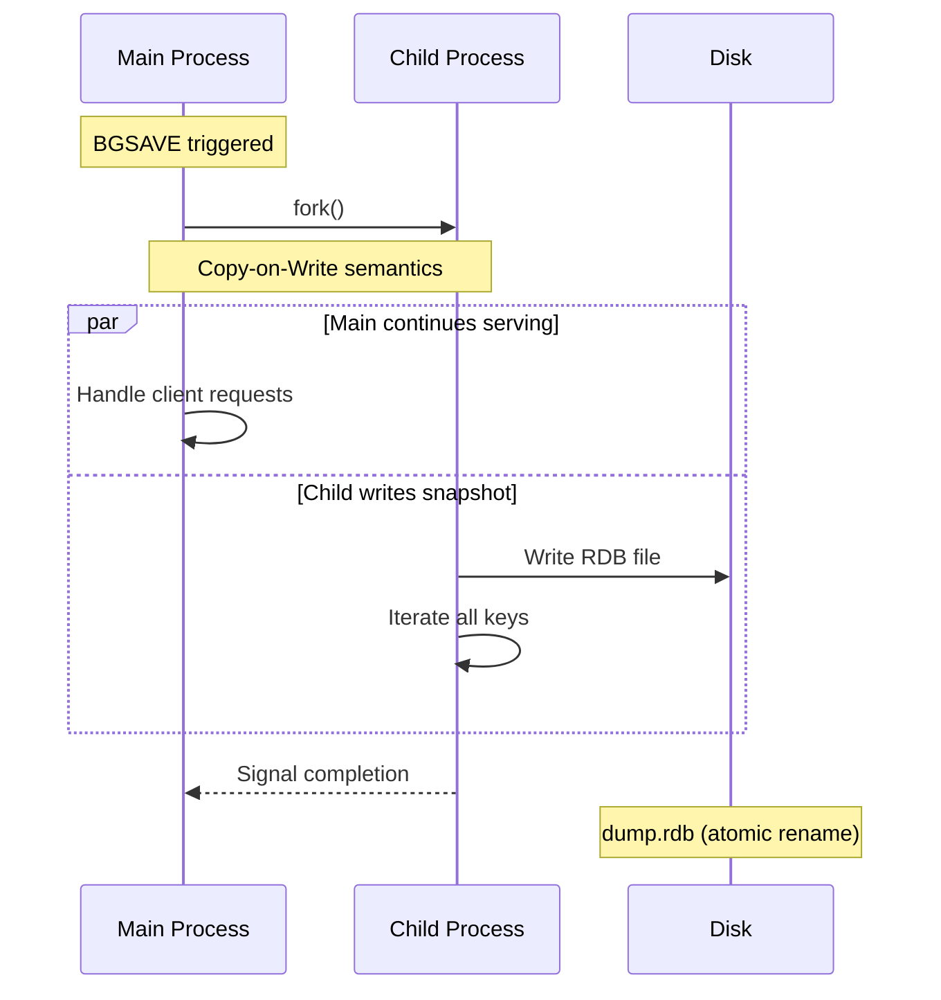
```mermaid
sequenceDiagram
    participant Main as Main Process
    participant Fork as Child Process
    participant Disk as Disk

    Note over Main: BGSAVE triggered

    Main->>Fork: fork()
    Note over Main,Fork: Copy-on-Write semantics

    par Main continues serving
        Main->>Main: Handle client requests
    and Child writes snapshot
        Fork->>Disk: Write RDB file
        Fork->>Fork: Iterate all keys
    end

    Fork-->>Main: Signal completion
    Note over Disk: dump.rdb (atomic rename)
```

**How fork + COW works:**
1. `fork()` creates child process
2. Initially, parent and child share memory pages
3. When parent modifies a page, kernel copies it (Copy-on-Write)
4. Child sees consistent snapshot of data at fork time

**Configuration:**
```redis
save 900 1      # Save if 1+ keys changed in 900 seconds
save 300 10     # Save if 10+ keys changed in 300 seconds
save 60 10000   # Save if 10000+ keys changed in 60 seconds

rdbcompression yes
rdbchecksum yes
dbfilename dump.rdb
```

**Trade-offs:**

| Pros | Cons |
|------|------|
| Compact single file | Data loss since last snapshot |
| Fast restarts | Fork can cause latency spike |
| Perfect for backups | Memory overhead during fork |

### AOF (Append-Only File)

Logs every write operation for replay on restart.

```
AOF File Format:
*3\r\n$3\r\nSET\r\n$5\r\nmykey\r\n$7\r\nmyvalue\r\n
*2\r\n$4\r\nINCR\r\n$7\r\ncounter\r\n
...
```

**Write modes:**

| Mode | Behavior | Durability | Performance |
|------|----------|------------|-------------|
| `always` | fsync after every command | No data loss | Slowest |
| `everysec` | fsync every second | Up to 1 second loss | Good balance |
| `no` | OS decides when to flush | OS-dependent loss | Fastest |

**AOF Rewrite:**

Over time, AOF grows large. Rewrite compacts it:

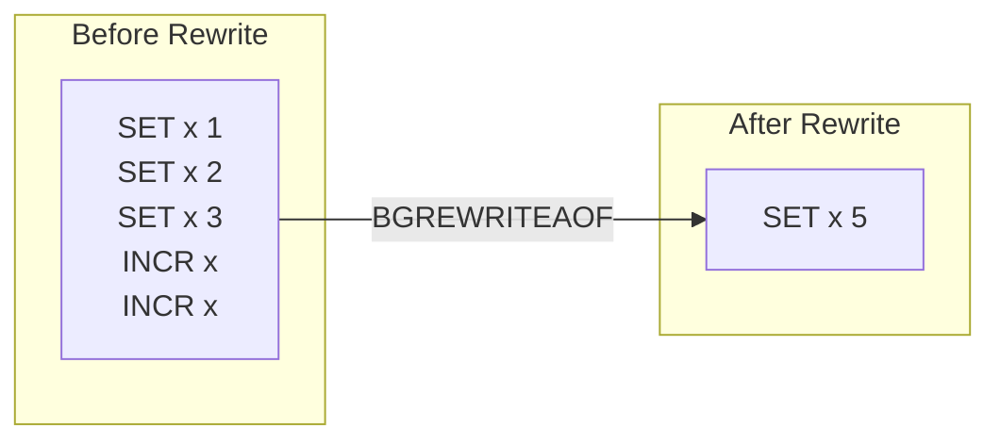
```mermaid
flowchart LR
    subgraph "Before Rewrite"
        OLD["SET x 1<br/>SET x 2<br/>SET x 3<br/>INCR x<br/>INCR x"]
    end

    subgraph "After Rewrite"
        NEW["SET x 5"]
    end

    OLD -->|"BGREWRITEAOF"| NEW
```

**Configuration:**
```redis
appendonly yes
appendfilename "appendonly.aof"
appendfsync everysec

auto-aof-rewrite-percentage 100    # Rewrite when AOF is 2x base size
auto-aof-rewrite-min-size 64mb     # Minimum size to trigger rewrite
```

### Hybrid Persistence (RDB + AOF)

Redis 4.0+ allows combining both approaches:

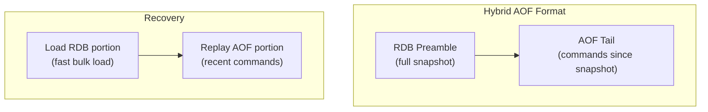
```mermaid
flowchart TB
    subgraph "Hybrid AOF Format"
        RDB_PART["RDB Preamble<br/>(full snapshot)"]
        AOF_PART["AOF Tail<br/>(commands since snapshot)"]

        RDB_PART --> AOF_PART
    end

    subgraph "Recovery"
        LOAD_RDB["Load RDB portion<br/>(fast bulk load)"]
        REPLAY_AOF["Replay AOF portion<br/>(recent commands)"]

        LOAD_RDB --> REPLAY_AOF
    end
```

**Enable hybrid:**
```redis
aof-use-rdb-preamble yes
```

### Persistence Decision Matrix

| Scenario | Recommended | Why |
|----------|-------------|-----|
| Pure cache | No persistence | Speed, simplicity |
| Can tolerate minutes of loss | RDB only | Simple, fast recovery |
| Minimal data loss required | AOF (everysec) | Good durability/performance balance |
| No data loss acceptable | AOF (always) | Every command synced |
| Best recovery time + durability | RDB + AOF hybrid | Fast load + minimal loss |

### Persistence Decision Flow

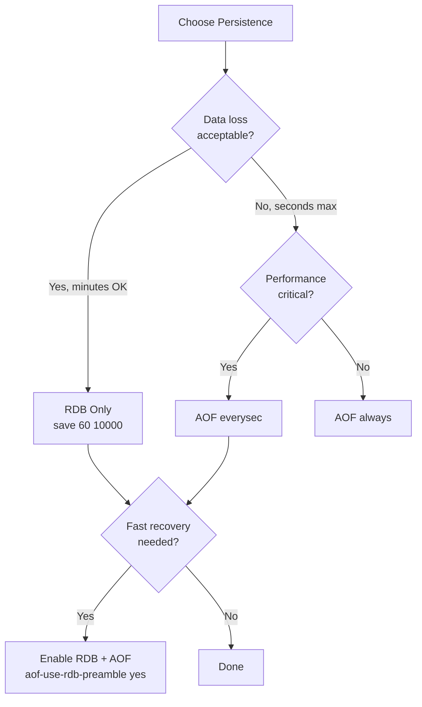
```mermaid
flowchart TD
    START["Choose Persistence"] --> Q1{"Data loss<br/>acceptable?"}

    Q1 -->|"Yes, minutes OK"| RDB["RDB Only<br/>save 60 10000"]
    Q1 -->|"No, seconds max"| Q2{"Performance<br/>critical?"}

    Q2 -->|"Yes"| AOF_SEC["AOF everysec"]
    Q2 -->|"No"| AOF_ALWAYS["AOF always"]

    RDB --> Q3{"Fast recovery<br/>needed?"}
    AOF_SEC --> Q3

    Q3 -->|"Yes"| HYBRID["Enable RDB + AOF<br/>aof-use-rdb-preamble yes"]
    Q3 -->|"No"| DONE["Done"]
```

---

## 5. Replication

Redis uses asynchronous, leader-follower replication.

### Replication Flow

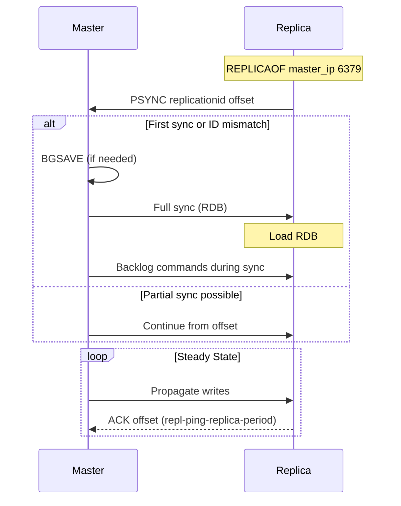
```mermaid
sequenceDiagram
    participant Master as Master
    participant Replica as Replica

    Note over Replica: REPLICAOF master_ip 6379

    Replica->>Master: PSYNC replicationid offset

    alt First sync or ID mismatch
        Master->>Master: BGSAVE (if needed)
        Master->>Replica: Full sync (RDB)
        Note over Replica: Load RDB
        Master->>Replica: Backlog commands during sync
    else Partial sync possible
        Master->>Replica: Continue from offset
    end

    loop Steady State
        Master->>Replica: Propagate writes
        Replica-->>Master: ACK offset (repl-ping-replica-period)
    end
```

### Full vs Partial Synchronization

**Full sync (SYNC):**
1. Master creates RDB snapshot
2. Master sends RDB to replica
3. Master buffers commands during transfer
4. Replica loads RDB
5. Master sends buffered commands

**Partial sync (PSYNC):**
- Uses replication backlog (circular buffer)
- Replica reconnects and requests offset
- If offset still in backlog, only missing commands sent

```redis
# Configure backlog
repl-backlog-size 1mb         # Size of circular buffer
repl-backlog-ttl 3600         # Seconds to keep backlog after disconnect
```

### Replication Lag Monitoring

```redis
INFO replication
# master_repl_offset: 12345
# slave0:ip=10.0.0.2,port=6379,offset=12300,lag=0

# Offset difference indicates lag:
# lag = master_repl_offset - replica_offset
```

### The WAIT Command

For stronger guarantees, use `WAIT` to block until replicas acknowledge:

```redis
SET key value
WAIT 2 5000   # Wait for 2 replicas, timeout 5000ms
```

**Caution:** This provides synchronous replication semantics but doesn't guarantee durability—replicas may have received but not persisted the data.

### Critical Understanding: Replication is NOT Consensus

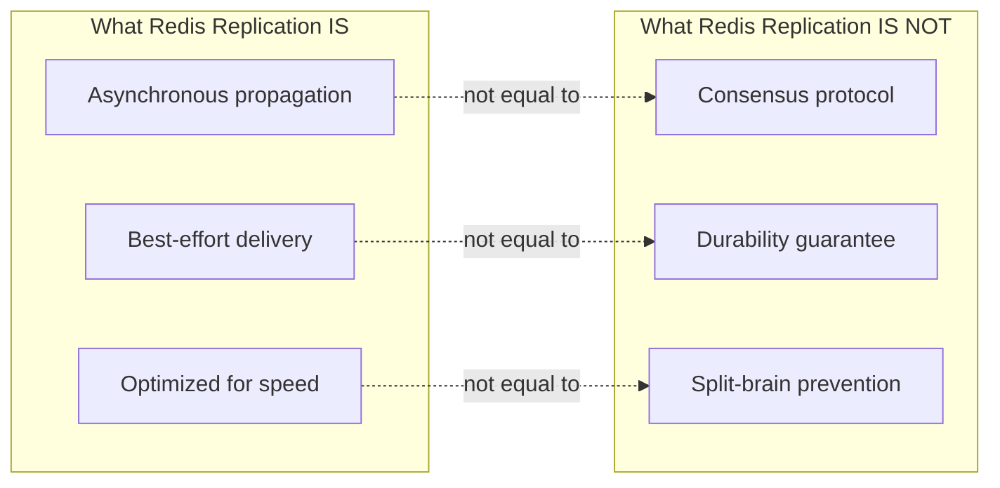
```mermaid
flowchart LR
    subgraph "What Redis Replication IS"
        ASYNC["Asynchronous propagation"]
        BESTEFF["Best-effort delivery"]
        SPEED["Optimized for speed"]
    end

    subgraph "What Redis Replication IS NOT"
        CONSENSUS["Consensus protocol"]
        GUARANTEE["Durability guarantee"]
        SPLIT["Split-brain prevention"]
    end

    ASYNC -.->|"not equal to"| CONSENSUS
    BESTEFF -.->|"not equal to"| GUARANTEE
    SPEED -.->|"not equal to"| SPLIT
```

**Data loss scenario:**
1. Client writes to master
2. Master acknowledges
3. Master fails before replicating
4. Replica promoted—write is lost

This is a fundamental design choice, not a bug. Redis prioritizes performance over strong consistency.

---

## 6. Redis Sentinel

Sentinel provides high availability through monitoring, notification, and automatic failover.

### Architecture

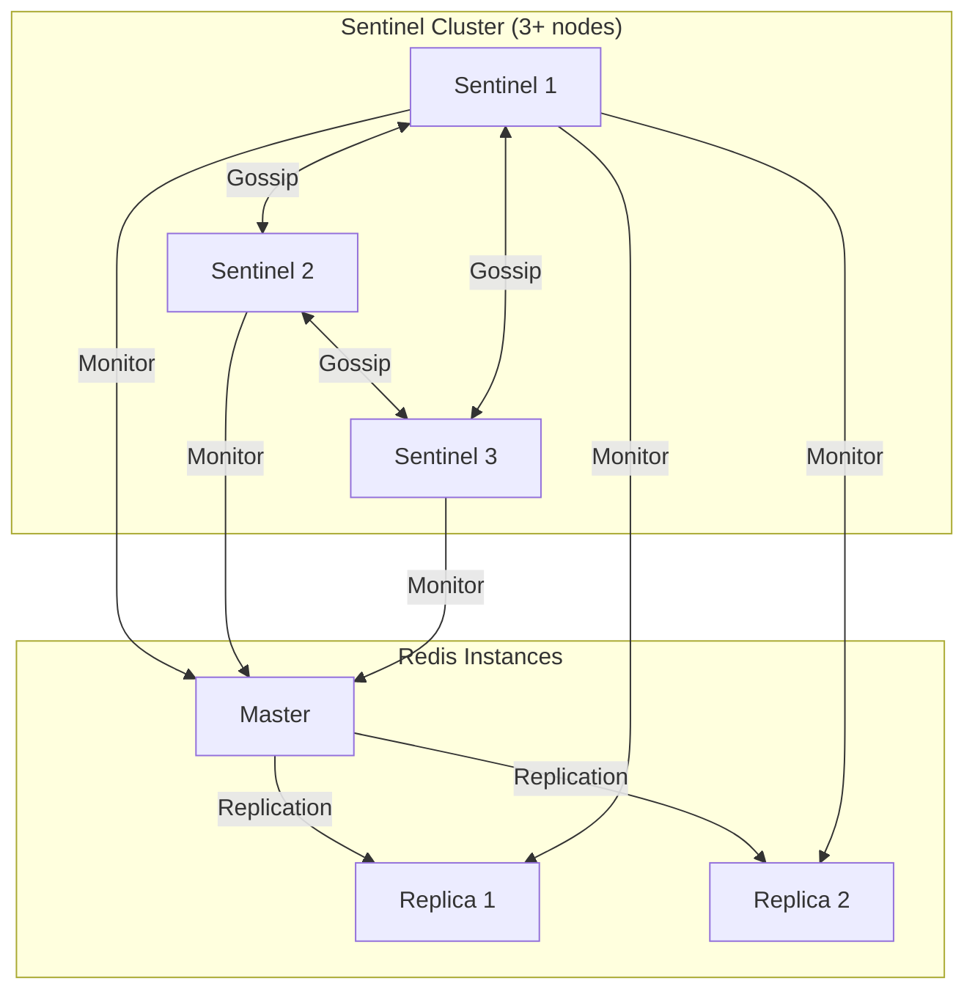
```mermaid
flowchart TB
    subgraph "Sentinel Cluster (3+ nodes)"
        S1["Sentinel 1"]
        S2["Sentinel 2"]
        S3["Sentinel 3"]

        S1 <-->|"Gossip"| S2
        S2 <-->|"Gossip"| S3
        S3 <-->|"Gossip"| S1
    end

    subgraph "Redis Instances"
        M["Master"]
        R1["Replica 1"]
        R2["Replica 2"]

        M -->|"Replication"| R1
        M -->|"Replication"| R2
    end

    S1 -->|"Monitor"| M
    S1 -->|"Monitor"| R1
    S1 -->|"Monitor"| R2
    S2 -->|"Monitor"| M
    S3 -->|"Monitor"| M
```

### SDOWN vs ODOWN

| State | Meaning | Trigger |
|-------|---------|---------|
| **SDOWN** (Subjectively Down) | One Sentinel thinks master is down | No response for `down-after-milliseconds` |
| **ODOWN** (Objectively Down) | Quorum agrees master is down | `quorum` Sentinels report SDOWN |

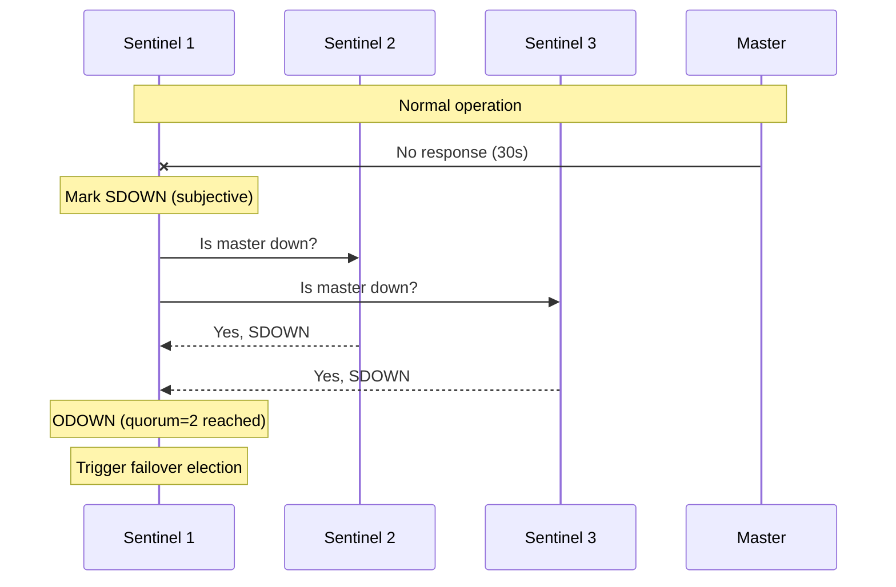
```mermaid
sequenceDiagram
    participant S1 as Sentinel 1
    participant S2 as Sentinel 2
    participant S3 as Sentinel 3
    participant M as Master

    Note over S1,M: Normal operation

    M-xS1: No response (30s)
    Note over S1: Mark SDOWN (subjective)

    S1->>S2: Is master down?
    S1->>S3: Is master down?

    S2-->>S1: Yes, SDOWN
    S3-->>S1: Yes, SDOWN

    Note over S1: ODOWN (quorum=2 reached)
    Note over S1: Trigger failover election
```

### Failover Process

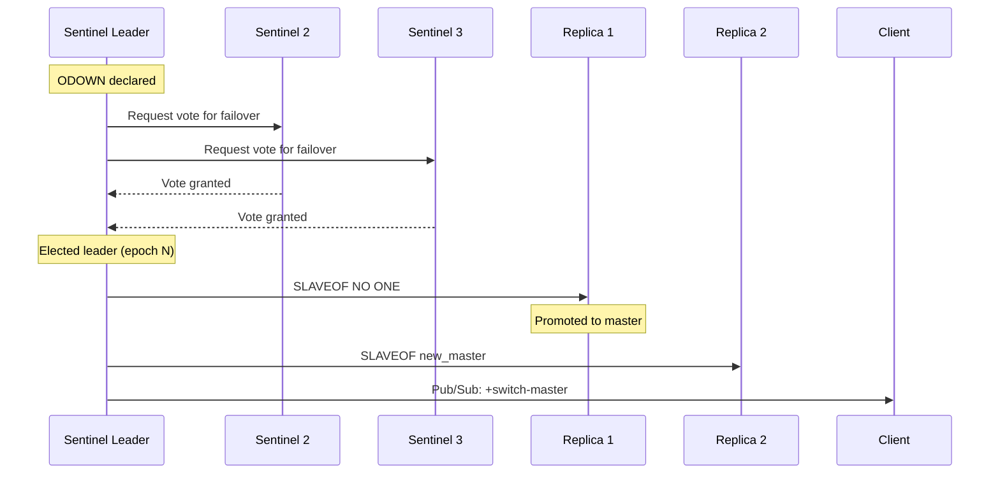
```mermaid
sequenceDiagram
    participant S1 as Sentinel Leader
    participant S2 as Sentinel 2
    participant S3 as Sentinel 3
    participant R1 as Replica 1
    participant R2 as Replica 2
    participant C as Client

    Note over S1: ODOWN declared

    S1->>S2: Request vote for failover
    S1->>S3: Request vote for failover
    S2-->>S1: Vote granted
    S3-->>S1: Vote granted

    Note over S1: Elected leader (epoch N)

    S1->>R1: SLAVEOF NO ONE
    Note over R1: Promoted to master

    S1->>R2: SLAVEOF new_master

    S1->>C: Pub/Sub: +switch-master
```

### Configuration

```redis
# sentinel.conf
sentinel monitor mymaster 127.0.0.1 6379 2
sentinel down-after-milliseconds mymaster 30000
sentinel parallel-syncs mymaster 1
sentinel failover-timeout mymaster 180000

# Notification
sentinel notification-script mymaster /var/redis/notify.sh
sentinel client-reconfig-script mymaster /var/redis/reconfig.sh
```

| Parameter | Purpose | Recommendation |
|-----------|---------|----------------|
| `quorum` | ODOWN threshold | (N/2)+1 for N Sentinels |
| `down-after-milliseconds` | SDOWN detection time | 5000-30000ms |
| `parallel-syncs` | Replicas syncing simultaneously | 1 (minimize unavailability) |
| `failover-timeout` | Max failover time | 180000ms |

### Split-Brain Scenarios

Sentinel mitigates but doesn't fully prevent split-brain:

```mermaid
flowchart TB
    subgraph "Network Partition"
        subgraph "Partition A"
            M["Old Master"]
            S1["Sentinel 1"]
            C1["Client A"]
        end

        subgraph "Partition B"
            R1["Replica promoted to New Master"]
            S2["Sentinel 2"]
            S3["Sentinel 3"]
            C2["Client B"]
        end
    end

    C1 -->|"Writes"| M
    C2 -->|"Writes"| R1

    Note over M,R1: Both accepting writes!<br/>Data divergence
```

**Mitigation:**
```redis
# On master
min-replicas-to-write 1
min-replicas-max-lag 10
```
Master rejects writes if fewer than `min-replicas-to-write` replicas with lag <= `min-replicas-max-lag` seconds.

### Comparison to Raft

| Aspect | Sentinel | Raft |
|--------|----------|------|
| Consensus strength | Weaker (leader election only) | Stronger (replicated log) |
| Data safety | Can lose acknowledged writes | No acknowledged write loss |
| Complexity | Simpler | More complex |
| Use case | HA for Redis | General consensus |

**Reference:** See [Consensus Protocols](./DD_CONSENSUS_PROTOCOLS.md) for Raft details.

---

## 7. Redis Cluster

Redis Cluster provides horizontal scaling through automatic sharding across multiple masters.

### Hash Slots

Redis Cluster uses 16,384 hash slots (fixed, not configurable):

```
HASH_SLOT = CRC16(key) mod 16384
```

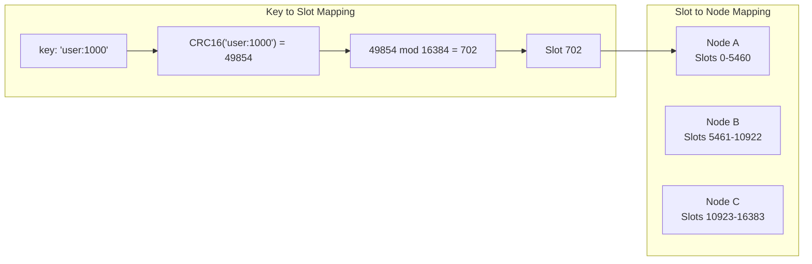
```mermaid
flowchart LR
    subgraph "Key to Slot Mapping"
        KEY["key: 'user:1000'"]
        CRC["CRC16('user:1000') = 49854"]
        MOD["49854 mod 16384 = 702"]
        SLOT["Slot 702"]

        KEY --> CRC --> MOD --> SLOT
    end

    subgraph "Slot to Node Mapping"
        N1["Node A<br/>Slots 0-5460"]
        N2["Node B<br/>Slots 5461-10922"]
        N3["Node C<br/>Slots 10923-16383"]

        SLOT --> N1
    end
```

**Why 16,384 slots?**
- Small enough: Gossip messages with slot bitmap are ~2KB
- Large enough: Supports 1000+ nodes
- Power of 2: Efficient modulo

### Hash Tags

Force related keys to the same slot using `{tag}`:

```redis
SET {user:1000}:profile "..."
SET {user:1000}:settings "..."
# Both hash to slot for "user:1000"

# Multi-key operations now work:
MGET {user:1000}:profile {user:1000}:settings
```

### MOVED vs ASK Redirections

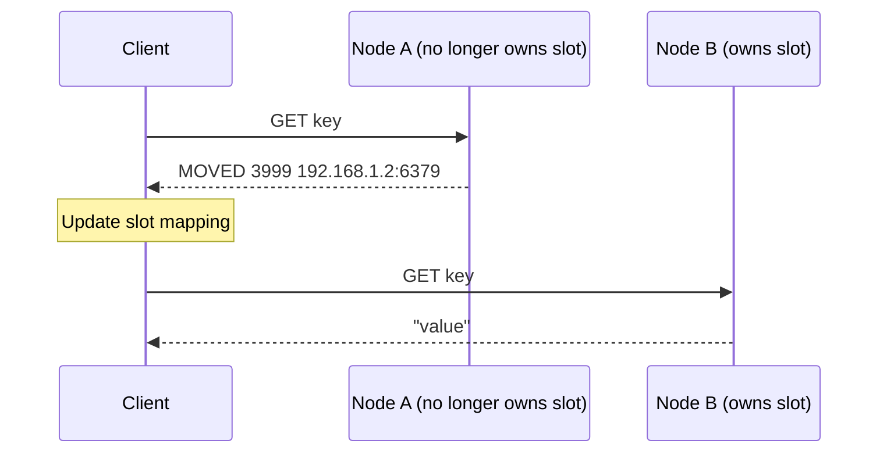
```mermaid
sequenceDiagram
    participant Client
    participant NodeA as Node A (no longer owns slot)
    participant NodeB as Node B (owns slot)

    Client->>NodeA: GET key
    NodeA-->>Client: MOVED 3999 192.168.1.2:6379
    Note over Client: Update slot mapping
    Client->>NodeB: GET key
    NodeB-->>Client: "value"
```

| Redirection | Meaning | Client Action |
|-------------|---------|---------------|
| `MOVED slot ip:port` | Slot permanently moved | Update slot -> node mapping |
| `ASK slot ip:port` | Slot being migrated | One-time redirect, don't update mapping |

### Resharding Process

```mermaid
sequenceDiagram
    participant Source as Source Node
    participant Target as Target Node
    participant Client as Client

    Note over Source,Target: Migration of slot 3999

    Source->>Source: CLUSTER SETSLOT 3999 MIGRATING target-id
    Target->>Target: CLUSTER SETSLOT 3999 IMPORTING source-id

    loop For each key in slot
        Source->>Target: MIGRATE key
    end

    Note over Source: Queries to slot 3999

    alt Key exists locally
        Source-->>Client: Response
    else Key migrated
        Source-->>Client: ASK 3999 target:port
        Client->>Target: ASKING
        Client->>Target: GET key
        Target-->>Client: Response
    end

    Source->>Source: CLUSTER SETSLOT 3999 NODE target-id
    Target->>Target: CLUSTER SETSLOT 3999 NODE target-id
```

### Gossip Protocol

Cluster nodes exchange state via gossip messages:

```mermaid
flowchart TB
    subgraph "Gossip Message"
        PING["PING/PONG contains:"]
        STATE["- Node's view of cluster state"]
        SLOTS["- Slot ownership bitmap"]
        FAIL["- Known failures"]
        EPOCH["- Config epoch"]
    end

    subgraph "Failure Detection"
        PFAIL["PFAIL: Suspected failure<br/>(single node's view)"]
        FAIL_STATE["FAIL: Confirmed failure<br/>(majority consensus)"]

        PFAIL -->|"Majority agrees"| FAIL_STATE
    end
```

**Gossip timing:**
- `cluster-node-timeout`: Base timeout (15000ms default)
- Random node pinged every second
- After timeout/2, ping any node not recently contacted

### Cluster Topology

```mermaid
flowchart TB
    subgraph "Minimal Production Cluster"
        subgraph "Shard 1"
            M1["Master 1<br/>Slots 0-5460"]
            R1["Replica 1"]
            M1 --> R1
        end

        subgraph "Shard 2"
            M2["Master 2<br/>Slots 5461-10922"]
            R2["Replica 2"]
            M2 --> R2
        end

        subgraph "Shard 3"
            M3["Master 3<br/>Slots 10923-16383"]
            R3["Replica 3"]
            M3 --> R3
        end
    end

    M1 <-.->|"Gossip"| M2
    M2 <-.->|"Gossip"| M3
    M3 <-.->|"Gossip"| M1
```

### Cluster vs Consistent Hashing

| Aspect | Redis Cluster | Consistent Hashing |
|--------|---------------|-------------------|
| Hash space | 16384 fixed slots | Virtual ring (2^32 or 2^128) |
| Key -> node mapping | Slot table | Ring position |
| Rebalancing | Manual slot migration | Automatic via ring |
| Lookup complexity | O(1) via slot table | O(log n) via ring |
| Client requirements | Cluster-aware | Load balancer or smart client |

**Reference:** See [Consistent Hashing](./DD_CONSISTENT_HASHING.md) for ring-based approaches.

---

## 8. Distributed Locking (Redlock)

### Single-Instance Locking

Basic distributed lock with a single Redis instance:

```python
def acquire_lock(redis, lock_name, lock_value, expire_seconds):
    """
    Acquire lock using SET NX EX pattern.

    lock_value should be unique per client (e.g., UUID)
    to ensure only the owner can release.
    """
    return redis.set(
        lock_name,
        lock_value,
        nx=True,       # Only set if not exists
        ex=expire_seconds  # Automatic expiration
    )

def release_lock(redis, lock_name, lock_value):
    """
    Release lock only if we own it (Lua for atomicity).
    """
    lua_script = """
    if redis.call("GET", KEYS[1]) == ARGV[1] then
        return redis.call("DEL", KEYS[1])
    else
        return 0
    end
    """
    return redis.eval(lua_script, 1, lock_name, lock_value)
```

**Problem:** Single point of failure. If Redis fails, lock is lost.

### The Redlock Algorithm

Antirez proposed Redlock for fault-tolerant distributed locking across N independent Redis instances.

```mermaid
sequenceDiagram
    participant Client
    participant R1 as Redis 1
    participant R2 as Redis 2
    participant R3 as Redis 3
    participant R4 as Redis 4
    participant R5 as Redis 5

    Note over Client: Start time T1

    par Acquire from all
        Client->>R1: SET lock UUID NX PX 10000
        Client->>R2: SET lock UUID NX PX 10000
        Client->>R3: SET lock UUID NX PX 10000
        Client->>R4: SET lock UUID NX PX 10000
        Client->>R5: SET lock UUID NX PX 10000
    end

    R1-->>Client: OK
    R2-->>Client: OK
    R3-->>Client: OK
    R4-->>Client: (failed)
    R5-->>Client: OK

    Note over Client: Time T2, elapsed = T2-T1
    Note over Client: 4/5 acquired (> N/2+1 = 3)
    Note over Client: validity = TTL - elapsed - drift

    Note over Client: LOCK ACQUIRED
```

**Algorithm:**
1. Get current time T1
2. Sequentially acquire lock on all N instances with same key, value, TTL
3. Calculate elapsed time
4. Lock acquired if:
   - Majority (N/2 + 1) locks obtained
   - Elapsed time < TTL
5. Effective validity = TTL - elapsed - clock_drift

### Kleppmann's Critique

Martin Kleppmann's 2016 analysis identified fundamental problems with Redlock:

```mermaid
flowchart TB
    subgraph "Problem 1: GC Pause"
        ACQUIRE["Client acquires lock"]
        GC["Long GC pause"]
        EXPIRE["Lock expires on Redis"]
        OTHER["Other client acquires lock"]
        RESUME["First client resumes,<br/>thinks it has lock"]
        CONFLICT["Both clients operate<br/>on shared resource!"]

        ACQUIRE --> GC --> EXPIRE --> OTHER --> RESUME --> CONFLICT
    end
```

**Key issues identified:**

| Issue | Description |
|-------|-------------|
| **GC pauses** | Client pauses after acquiring lock, lock expires, resumes thinking it still holds lock |
| **Clock drift** | Redlock relies on bounded clock drift; real clocks can jump |
| **Network delays** | Async network can deliver "success" after lock actually expired |
| **Not linearizable** | Doesn't provide the safety guarantees of true consensus |

**Reference:** Kleppmann, M. (2016). "How to do distributed locking." https://martin.kleppmann.com/2016/02/08/how-to-do-distributed-locking.html

### Antirez's Response

Salvatore Sanfilippo (antirez) argued:
- Redlock is designed for efficiency, not safety-critical systems
- Clock drift bounds are reasonable in practice
- Combined with fencing tokens, provides adequate safety

### Fencing Tokens: The Proper Solution

```mermaid
sequenceDiagram
    participant C1 as Client 1
    participant C2 as Client 2
    participant Lock as Lock Service
    participant Resource as Storage

    C1->>Lock: Acquire lock
    Lock-->>C1: Token 33

    Note over C1: Long pause
    Note over Lock: Lock expires

    C2->>Lock: Acquire lock
    Lock-->>C2: Token 34

    C2->>Resource: Write (token=34)
    Resource->>Resource: Accept (34 > last seen)

    Note over C1: Resumes
    C1->>Resource: Write (token=33)
    Resource->>Resource: Reject (33 < 34)
```

**Key insight:** The resource being protected must validate monotonically increasing tokens, rejecting stale requests.

### Verdict: When to Use Redlock

| Scenario | Recommendation |
|----------|----------------|
| Efficiency locking (prevent duplicate work) | Redlock acceptable |
| Correctness locking (data integrity critical) | Use proper consensus (Zookeeper, etcd) |
| Single Redis available | Single-instance lock + fencing tokens |
| Need true linearizability | Avoid Redis locking entirely |

---

## 9. Lua Scripting & Transactions

### MULTI/EXEC Transactions

Redis transactions batch commands for atomic execution:

```redis
MULTI
SET user:1:balance 100
DECRBY user:1:balance 30
INCRBY user:2:balance 30
EXEC
```

**Important: Not ACID!**

| ACID Property | Redis Transactions |
|--------------|-------------------|
| Atomicity | Partial—all or nothing execution, but no rollback on error |
| Consistency | Application responsibility |
| Isolation | Yes—no interleaving with other commands |
| Durability | Depends on persistence config |

```mermaid
flowchart LR
    subgraph "Redis Transaction"
        MULTI["MULTI"]
        QUEUE["Commands queued<br/>(not executed)"]
        EXEC["EXEC<br/>(all executed)"]

        MULTI --> QUEUE --> EXEC
    end

    subgraph "On Error During EXEC"
        ERR1["Syntax error:<br/>Entire tx rejected"]
        ERR2["Runtime error:<br/>Other commands still run!"]
    end
```

### WATCH for Optimistic Locking

```redis
WATCH user:1:balance
val = GET user:1:balance
# Check if sufficient balance
MULTI
DECRBY user:1:balance 100
EXEC
# Returns nil if user:1:balance changed since WATCH
```

### Lua Scripting

Lua scripts execute atomically (blocking other commands):

```lua
-- rate_limit.lua
-- KEYS[1] = rate limit key
-- ARGV[1] = limit
-- ARGV[2] = window in seconds

local current = tonumber(redis.call('GET', KEYS[1]) or 0)

if current >= tonumber(ARGV[1]) then
    return 0  -- Rate limited
end

redis.call('INCR', KEYS[1])
if current == 0 then
    redis.call('EXPIRE', KEYS[1], ARGV[2])
end

return 1  -- Allowed
```

**Usage:**
```python
# Load script (returns SHA)
sha = redis.script_load(lua_script)

# Execute with EVALSHA (cached)
result = redis.evalsha(sha, 1, "rate:user:1", 100, 60)
```

### Script Atomicity

**Critical understanding:** Lua scripts block the entire Redis server:

```mermaid
flowchart LR
    subgraph "Timeline"
        C1["Client 1: EVALSHA script"]
        BLOCK["All other clients blocked"]
        C2["Client 2: GET key (waiting)"]
        C3["Client 3: SET key (waiting)"]
        DONE["Script completes"]
        RESUME["Clients resume"]

        C1 --> BLOCK --> DONE --> RESUME
        C2 -.->|"blocked"| DONE
        C3 -.->|"blocked"| DONE
    end
```

**Guidelines:**
- Keep scripts short (< 100ms)
- Avoid O(n) operations on large collections in scripts
- Use `lua-time-limit` to detect long-running scripts

---

## 10. Performance Optimization

### Pipelining

Reduce round-trips by batching commands:

```mermaid
sequenceDiagram
    participant Client
    participant Redis

    Note over Client,Redis: Without pipelining
    Client->>Redis: SET key1 val1
    Redis-->>Client: OK
    Client->>Redis: SET key2 val2
    Redis-->>Client: OK
    Client->>Redis: SET key3 val3
    Redis-->>Client: OK
    Note over Client,Redis: 6 network round-trips

    Note over Client,Redis: With pipelining
    Client->>Redis: SET key1 val1<br/>SET key2 val2<br/>SET key3 val3
    Redis-->>Client: OK<br/>OK<br/>OK
    Note over Client,Redis: 1 network round-trip
```

**Python example:**
```python
pipe = redis.pipeline()
for i in range(1000):
    pipe.set(f"key:{i}", f"value:{i}")
results = pipe.execute()  # Single round-trip
```

**Performance gain:** 5-10x throughput improvement for batched operations.

### Connection Pooling

Reuse connections to avoid TCP overhead:

```python
# Bad: New connection per operation
for i in range(1000):
    r = Redis(host='localhost', port=6379)
    r.set(f"key:{i}", "value")
    r.close()

# Good: Connection pool
pool = ConnectionPool(host='localhost', port=6379, max_connections=50)
r = Redis(connection_pool=pool)
for i in range(1000):
    r.set(f"key:{i}", "value")
```

### SCAN vs KEYS

| Command | Behavior | Production Use |
|---------|----------|----------------|
| `KEYS pattern` | Blocks until complete; O(n) | NEVER in production |
| `SCAN cursor [MATCH pattern]` | Iterative, O(1) per call | Safe for production |

```redis
# Bad - blocks Redis
KEYS user:*

# Good - incremental iteration
SCAN 0 MATCH user:* COUNT 100
# Returns: cursor, [keys...]
# Continue with new cursor until cursor = 0
```

### Big Key Anti-Patterns

**Detection:**
```redis
redis-cli --bigkeys
# Or
MEMORY USAGE keyname
DEBUG OBJECT keyname
```

**Problems with big keys:**

| Issue | Description |
|-------|-------------|
| Latency spikes | Single operation on large key blocks server |
| Replication lag | Large keys cause replication delays |
| Memory fragmentation | Large allocations cause fragmentation |
| Cluster migration | Slot migration stuck on big keys |

**Solutions:**
1. Split into smaller keys (e.g., `user:1:data:chunk:0`, `user:1:data:chunk:1`)
2. Use hashes with fields instead of large strings
3. Use `UNLINK` instead of `DEL` for async deletion

### Hot Key Mitigation

```mermaid
flowchart TB
    subgraph "Hot Key Problem"
        HOT["Key: trending_post"]
        S1["Server 1"]
        S2["Server 2"]
        S3["Server 3"]

        S1 -->|"All requests"| HOT
        S2 -->|"All requests"| HOT
        S3 -->|"All requests"| HOT

        CPU["CPU: 100%"]
    end

    subgraph "Solutions"
        REP["Local caching<br/>(client-side)"]
        SHARD["Key sharding<br/>(trending_post:0, :1, :2)"]
        READ_REP["Read from replicas<br/>(READONLY)"]
    end
```

### Performance Numbers

**Single Redis instance (typical hardware):**

| Operation | Throughput | Latency (p50) |
|-----------|------------|---------------|
| GET/SET | 100K-200K ops/sec | < 1ms |
| LPUSH/LPOP | 100K ops/sec | < 1ms |
| ZADD | 50K-100K ops/sec | < 1ms |
| Lua script (simple) | 50K-100K ops/sec | < 1ms |
| Pipelined batch (1000) | 500K-1M ops/sec | 10-20ms total |

---

## 11. Production Patterns

### Cache-Aside Pattern

```mermaid
sequenceDiagram
    participant App
    participant Cache as Redis
    participant DB as Database

    App->>Cache: GET user:1
    alt Cache hit
        Cache-->>App: {user data}
    else Cache miss
        Cache-->>App: nil
        App->>DB: SELECT * FROM users WHERE id=1
        DB-->>App: {user data}
        App->>Cache: SET user:1 {user data} EX 3600
        Note over App: Return to caller
    end
```

### Read-Through / Write-Through

Application doesn't interact with database directly:

```python
class RedisCacheThrough:
    def __init__(self, redis, db):
        self.redis = redis
        self.db = db

    def get(self, key):
        # Read-through
        value = self.redis.get(key)
        if value is None:
            value = self.db.get(key)
            if value:
                self.redis.set(key, value, ex=3600)
        return value

    def set(self, key, value):
        # Write-through
        self.db.set(key, value)
        self.redis.set(key, value, ex=3600)
```

### Rate Limiting with Sliding Window

```lua
-- sliding_window_rate_limit.lua
-- KEYS[1] = rate limit key
-- ARGV[1] = current timestamp (ms)
-- ARGV[2] = window size (ms)
-- ARGV[3] = max requests

local key = KEYS[1]
local now = tonumber(ARGV[1])
local window = tonumber(ARGV[2])
local limit = tonumber(ARGV[3])

-- Remove old entries
redis.call('ZREMRANGEBYSCORE', key, 0, now - window)

-- Count current entries
local count = redis.call('ZCARD', key)

if count >= limit then
    return 0  -- Rate limited
end

-- Add new entry
redis.call('ZADD', key, now, now .. '-' .. math.random())
redis.call('EXPIRE', key, math.ceil(window / 1000))

return 1  -- Allowed
```

### Session Storage

```python
# Store session
session_id = str(uuid.uuid4())
redis.hset(f"session:{session_id}", mapping={
    "user_id": user.id,
    "email": user.email,
    "created_at": datetime.now().isoformat()
})
redis.expire(f"session:{session_id}", 86400)  # 24 hours

# Retrieve session
session = redis.hgetall(f"session:{session_id}")
```

### Pub/Sub for Real-Time

```mermaid
flowchart LR
    subgraph "Publishers"
        P1["Service A"]
        P2["Service B"]
    end

    subgraph "Redis"
        CHANNEL["Channel: notifications"]
    end

    subgraph "Subscribers"
        S1["WebSocket Server 1"]
        S2["WebSocket Server 2"]
    end

    P1 -->|"PUBLISH"| CHANNEL
    P2 -->|"PUBLISH"| CHANNEL
    CHANNEL -->|"Message"| S1
    CHANNEL -->|"Message"| S2
```

**Limitations:**
- Fire-and-forget (no persistence)
- No acknowledgment
- Subscribers must be connected to receive

For persistent messaging, use **Streams** instead.

---

## 12. Failure Scenarios

### Master Failure with Async Replication

```mermaid
flowchart TB
    subgraph "Timeline"
        T1["T1: Client writes to master"]
        T2["T2: Master acknowledges"]
        T3["T3: Master fails before replicating"]
        T4["T4: Sentinel promotes replica"]
        T5["T5: Write is LOST"]

        T1 --> T2 --> T3 --> T4 --> T5
    end

    subgraph "Data Loss Window"
        WINDOW["Window = Time between<br/>master ack and replication"]
    end
```

**Mitigation:** Use `WAIT` for critical writes, or accept potential loss.

### Network Partition in Cluster

```mermaid
flowchart TB
    subgraph "Partition A"
        M1["Master 1 (minority)"]
        C1["Clients A"]
    end

    subgraph "Partition B (majority)"
        M2["Master 2"]
        M3["Master 3"]
        R1["Replica 1 promoted"]
        C2["Clients B"]
    end

    C1 -->|"Writes"| M1

    Note over M1: Rejects writes after<br/>cluster-node-timeout<br/>(no majority)

    Note over R1: Promoted for M1's slots
```

**Cluster behavior:**
- Minority partition eventually rejects writes
- `cluster-require-full-coverage yes` (default): Cluster stops if any slots uncovered
- Data written to minority side before rejection is lost

### Memory Exhaustion

```mermaid
flowchart TD
    OOM["Memory limit reached"]

    OOM --> POLICY{"Eviction policy?"}

    POLICY -->|"noeviction"| ERROR["OOM error on writes"]
    POLICY -->|"allkeys-*"| EVICT_ALL["Evict from all keys"]
    POLICY -->|"volatile-*"| EVICT_TTL["Evict keys with TTL only"]

    EVICT_TTL --> CHECK{"Keys with TTL<br/>available?"}
    CHECK -->|"No"| ERROR
    CHECK -->|"Yes"| SUCCESS["Write succeeds"]
```

### Persistence Failure

| Scenario | Impact | Recovery |
|----------|--------|----------|
| RDB save fails | No backup; old RDB remains | Check disk space, permissions |
| AOF write fails | Data loss on crash | Check disk, `redis-check-aof --fix` |
| AOF corruption | Won't restart | `redis-check-aof --fix` |
| Fork fails (OOM) | No background save | Reduce memory or increase swap |

---

## 13. Interview Articulation

### 30-Second Version

> "Redis is an in-memory data structure server, not just a cache. Its single-threaded event loop processes commands atomically, achieving 100K+ ops/sec with sub-millisecond latency. It supports rich data types—strings, lists, sets, sorted sets, hashes, streams, and HyperLogLog—each with optimized internal encodings. For durability, it offers RDB snapshots and AOF logging. For availability, Sentinel provides automatic failover, while Cluster enables horizontal scaling via hash slot sharding across 16,384 slots. The main trade-off is that replication is asynchronous, so acknowledged writes can be lost on master failure—it's not a consensus-based system."

### 2-Minute Version

> "Redis is fundamentally an in-memory data structure server. While often used as a cache, its rich data types—strings, lists, sets, sorted sets with O(log n) operations, hashes, streams, and probabilistic structures like HyperLogLog—make it much more powerful than a simple key-value store.
>
> The single-threaded architecture is a deliberate choice: no locks needed, commands are atomic by design, and memory bandwidth—not CPU—is the bottleneck. A single Redis instance handles 100K+ operations per second with sub-millisecond latency. Redis 6+ added I/O threading, but command execution remains single-threaded.
>
> For persistence, RDB provides point-in-time snapshots using fork and copy-on-write, ideal for backups. AOF logs every write, configurable from fsync-per-command to once-per-second. Hybrid mode combines both for fast recovery with minimal data loss.
>
> High availability comes from Sentinel, which monitors masters and performs automatic failover via quorum-based leader election. For horizontal scaling, Redis Cluster shards data across masters using 16,384 hash slots. Clients must be cluster-aware to handle MOVED and ASK redirections during resharding.
>
> The critical understanding is that Redis replication is asynchronous—it's not consensus-based. Acknowledged writes can be lost if the master fails before replicating. For distributed locking, the Redlock algorithm provides fault tolerance across multiple instances, but it's been critiqued for not being truly linearizable. For correctness-critical locking, systems like Zookeeper or etcd are more appropriate.
>
> In production, key patterns include cache-aside, rate limiting with Lua scripts for atomicity, and session storage. Watch out for big keys blocking the server, hot keys overwhelming single nodes, and always use SCAN instead of KEYS."

### Common Follow-Up Questions

| Question | Key Points |
|----------|------------|
| "Redis vs Memcached?" | Redis: data structures, persistence, replication, Lua scripting. Memcached: simpler, multi-threaded, pure caching. Redis wins for complex use cases. |
| "How does Redis achieve high performance?" | In-memory storage, single-threaded (no locks), efficient data structures, I/O multiplexing (epoll/kqueue), pipelining. |
| "Is Redis single-threaded? Why?" | Command execution: yes. I/O: threaded in Redis 6+. Single-threaded commands = atomic operations, no lock overhead, predictable latency. |
| "How would you implement distributed locking?" | Single instance: SET NX EX + Lua for release. Multi-instance: Redlock across N independent nodes. Critical safety: use fencing tokens. For true correctness: use Zookeeper/etcd. |
| "What happens when Redis runs out of memory?" | Depends on maxmemory-policy: noeviction returns errors, LRU/LFU evict keys, volatile-* variants only evict keys with TTL. |
| "How do you handle hot keys?" | Local caching, key sharding (append suffix), read from replicas (READONLY mode), application-level caching. |

---

## 14. Quick Reference Card

### Data Structure Selection Guide

| Need | Use | Why |
|------|-----|-----|
| Simple caching | String | O(1) get/set |
| Object with fields | Hash | Field-level access |
| Queue | List (LPUSH/RPOP) | O(1) ends |
| Unique collection | Set | O(1) membership |
| Ranked data | Sorted Set | O(log n) rank ops |
| Unique count | HyperLogLog | 12KB fixed memory |
| Event log | Stream | Consumer groups |

### Complexity Cheat Sheet

| Type | Insert | Lookup | Range | Delete |
|------|--------|--------|-------|--------|
| String | O(1) | O(1) | O(n) | O(1) |
| List | O(1)* | O(n) | O(S+N) | O(1)* |
| Set | O(1) | O(1) | O(n) | O(1) |
| Sorted Set | O(log n) | O(1)/O(log n) | O(log n+m) | O(log n) |
| Hash | O(1) | O(1) | O(n) | O(1) |

*At head/tail only

### Configuration Essentials

```redis
# Memory
maxmemory 4gb
maxmemory-policy allkeys-lfu

# Persistence (choose one)
save 900 1 300 10 60 10000        # RDB
appendonly yes                     # AOF
appendfsync everysec

# Replication
replicaof master_ip 6379
replica-read-only yes
min-replicas-to-write 1
min-replicas-max-lag 10

# Cluster
cluster-enabled yes
cluster-node-timeout 15000
cluster-require-full-coverage yes
```

### Cluster vs Sentinel Decision

```mermaid
flowchart TD
    START["Need Redis HA/Scaling"] --> Q1{"Data exceeds<br/>single node memory?"}

    Q1 -->|"Yes"| CLUSTER["Redis Cluster<br/>(horizontal scaling)"]
    Q1 -->|"No"| Q2{"Need automatic failover?"}

    Q2 -->|"Yes"| SENTINEL["Redis Sentinel<br/>(HA only)"]
    Q2 -->|"No"| SINGLE["Single instance<br/>(with persistence)"]

    CLUSTER --> CLUSTER_NOTE["Min 6 nodes<br/>(3 masters + 3 replicas)"]
    SENTINEL --> SENTINEL_NOTE["Min 3 Sentinels<br/>+ 1 master + N replicas"]
```

---

## References

### Primary Sources

- **Sanfilippo, S.** (2009-present). Redis Documentation and Design Decisions. https://redis.io/docs/
- **Sanfilippo, S.** (2014). "Redis Cluster Specification." https://redis.io/docs/reference/cluster-spec/
- **Sanfilippo, S.** (2016). "Is Redlock safe?" http://antirez.com/news/101

### Critical Analysis

- **Kleppmann, M.** (2016). "How to do distributed locking." https://martin.kleppmann.com/2016/02/08/how-to-do-distributed-locking.html
- **Kingsbury, K.** (Jepsen). "Redis" and "Redis Raft" analyses. https://jepsen.io/analyses

### Academic Papers

- **Pugh, W.** (1990). "Skip Lists: A Probabilistic Alternative to Balanced Trees." *Communications of the ACM*, 33(6), 668-676.
- **Flajolet, P., Fusy, E., Gandouet, O., & Meunier, F.** (2007). "HyperLogLog: the analysis of a near-optimal cardinality estimation algorithm." *Discrete Mathematics and Theoretical Computer Science*.

### Production Resources

- Redis Enterprise Documentation: https://redis.com/redis-enterprise/
- AWS ElastiCache for Redis: https://docs.aws.amazon.com/AmazonElastiCache/latest/red-ug/
- Google Cloud Memorystore for Redis: https://cloud.google.com/memorystore/docs/redis

---

## Revision History

| Date | Change |
|------|--------|
| 2025-01 | Initial deep-dive document with data structures, persistence, replication, Sentinel, Cluster, Redlock analysis, production patterns |

---

## Navigation

**Parent:** [Caching & Content Delivery](./05_CACHING_AND_CONTENT_DELIVERY.md)
**Related:** [Consistent Hashing](./DD_CONSISTENT_HASHING.md), [Consensus Protocols](./DD_CONSENSUS_PROTOCOLS.md)
**Previous:** [Storage Engines](./DD_STORAGE_ENGINES.md)
**Index:** [README](./README.md)
