# Search Engines & Inverted Indexes — Deep Dive

> Finding needles in haystacks at scale: the architecture behind modern search.

**Prerequisites:** [Data Storage & Access](./04_DATA_STORAGE_AND_ACCESS.md), [Sharding & Partitioning](./DD_SHARDING_PARTITIONING.md)
**Related:** [Storage Engines](./DD_STORAGE_ENGINES.md) (for segment merging), [Caching & Content Delivery](./05_CACHING_AND_CONTENT_DELIVERY.md)

---

## Table of Contents

1. [Context & Problem Statement](#1-context--problem-statement)
2. [The Inverted Index](#2-the-inverted-index)
3. [Text Analysis Pipeline](#3-text-analysis-pipeline)
4. [Relevance Scoring](#4-relevance-scoring)
5. [Index Lifecycle & Segments](#5-index-lifecycle--segments)
6. [Distributed Search Architecture](#6-distributed-search-architecture)
7. [Query Types & Execution](#7-query-types--execution)
8. [Elasticsearch Specifics](#8-elasticsearch-specifics)
9. [Performance Optimization](#9-performance-optimization)
10. [Production Patterns](#10-production-patterns)
11. [Failure Scenarios](#11-failure-scenarios)
12. [Comparison: Elasticsearch vs Alternatives](#12-comparison-elasticsearch-vs-alternatives)
13. [Interview Articulation](#13-interview-articulation)
14. [Quick Reference Card](#14-quick-reference-card)
15. [References](#references)

---

## 1. Context & Problem Statement

### Why Full-Text Search Is Hard

Full-text search fundamentally differs from exact-match database lookups. When a user searches for "distributed systems design," they expect to find documents containing "distributed system" (singular), "designing distributed systems," or even "system design for distributed applications." This semantic flexibility that humans take for granted is computationally challenging.

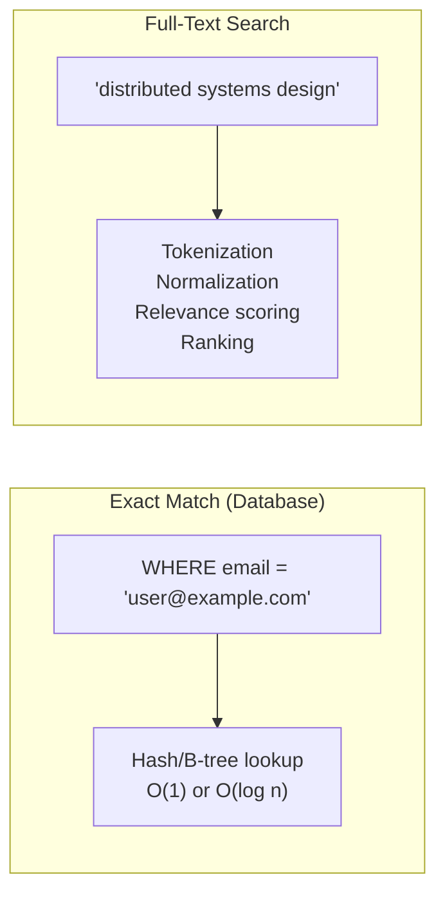
```mermaid
flowchart LR
    subgraph "Exact Match (Database)"
        Q1["WHERE email = 'user@example.com'"]
        R1["Hash/B-tree lookup<br/>O(1) or O(log n)"]
    end

    subgraph "Full-Text Search"
        Q2["'distributed systems design'"]
        R2["Tokenization<br/>Normalization<br/>Relevance scoring<br/>Ranking"]
    end

    Q1 --> R1
    Q2 --> R2
```

### B-Tree Limitations for Text Search

B-tree indexes, the workhorses of relational databases, fail at text search for several reasons:

| Problem | B-Tree Behavior | Search Requirement |
|---------|-----------------|-------------------|
| **Prefix-only matching** | `LIKE 'search%'` works | `LIKE '%search%'` requires full scan |
| **Word boundaries** | No concept of "words" | Must match individual terms |
| **Relevance ranking** | Returns all matches equally | Must rank by relevance |
| **Fuzzy matching** | Exact match only | Handle typos, synonyms |
| **Scalability** | Single-node optimized | Must scale horizontally |

Consider a naive approach using SQL:

```sql
-- This requires a full table scan on large datasets
SELECT * FROM documents
WHERE content LIKE '%distributed%'
  AND content LIKE '%systems%';

-- No index can help with infix matching
-- On 10M documents, this takes seconds to minutes
```

### The Information Retrieval Challenge

Information Retrieval (IR) addresses the fundamental question: given a query, which documents are most relevant, and in what order?

> **Reference:** Baeza-Yates, R., Ribeiro-Neto, B. (2011). "Modern Information Retrieval: The Concepts and Technology Behind Search." Addison-Wesley.

Key IR challenges include:

1. **Vocabulary mismatch**: Users may search "car" but documents say "automobile"
2. **Ambiguity**: "Apple" could mean fruit or company
3. **Relevance subjectivity**: What's "relevant" varies by user intent
4. **Scale**: Billions of documents, millions of queries per second
5. **Freshness**: Index must stay current with document changes

### Search Engine vs Database Trade-offs

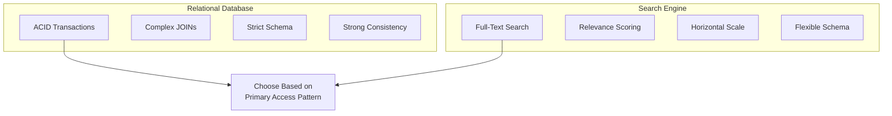
```mermaid
flowchart TD
    subgraph "Relational Database"
        DB_ACID["ACID Transactions"]
        DB_JOIN["Complex JOINs"]
        DB_SCHEMA["Strict Schema"]
        DB_CONS["Strong Consistency"]
    end

    subgraph "Search Engine"
        SE_TEXT["Full-Text Search"]
        SE_REL["Relevance Scoring"]
        SE_SCALE["Horizontal Scale"]
        SE_FLEX["Flexible Schema"]
    end

    CHOICE[Choose Based on<br/>Primary Access Pattern]

    DB_ACID --> CHOICE
    SE_TEXT --> CHOICE
```

| Aspect | Database (PostgreSQL) | Search Engine (Elasticsearch) |
|--------|----------------------|------------------------------|
| **Primary use** | Transactional data | Text search, analytics |
| **Consistency** | Strong (ACID) | Eventual (NRT) |
| **Schema** | Fixed, enforced | Dynamic, flexible |
| **Joins** | Native, optimized | Limited, expensive |
| **Full-text** | Basic (tsvector) | Advanced, feature-rich |
| **Scale model** | Vertical primary | Horizontal native |

### Common Use Cases

| Use Case | Characteristics | Example Systems |
|----------|-----------------|-----------------|
| **Product search** | Faceted navigation, autocomplete, typo tolerance | E-commerce sites |
| **Log analytics** | High write volume, time-series, aggregations | ELK stack (Elastic, Logstash, Kibana) |
| **Document search** | Large documents, relevance critical | Enterprise search, legal discovery |
| **Site search** | Mixed content types, personalization | Website internal search |
| **Geo-search** | Location-based filtering and sorting | Maps, local business search |

---

## 2. The Inverted Index

### Forward Index vs Inverted Index

The key insight behind search engines is the **inverted index**—a data structure that maps terms to documents, rather than documents to terms.

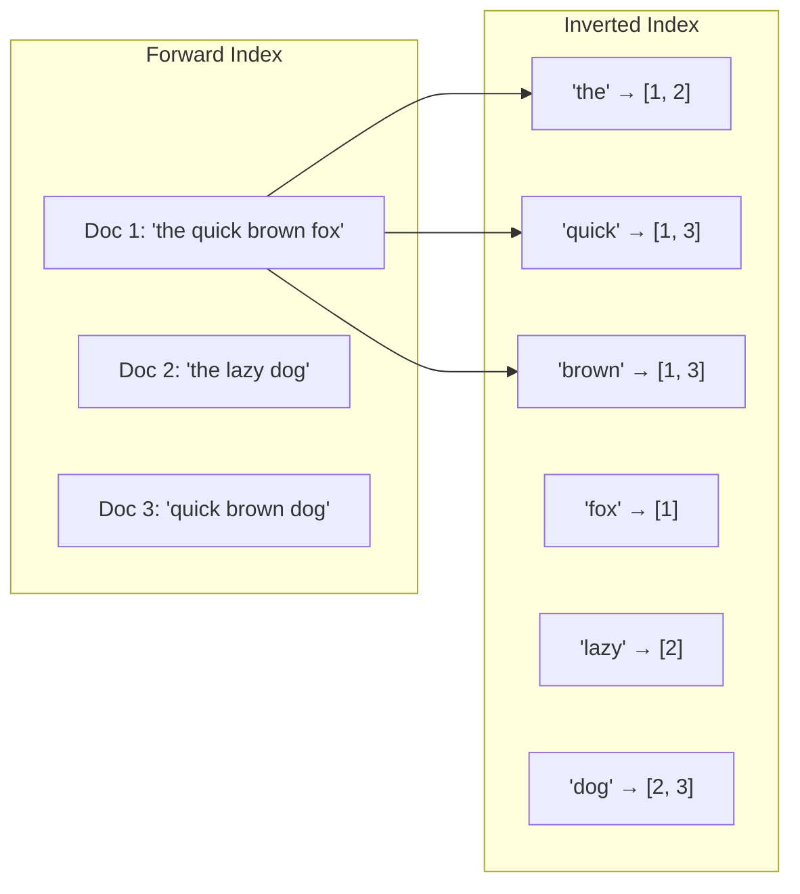
```mermaid
flowchart LR
    subgraph "Forward Index"
        D1["Doc 1: 'the quick brown fox'"]
        D2["Doc 2: 'the lazy dog'"]
        D3["Doc 3: 'quick brown dog'"]
    end

    subgraph "Inverted Index"
        T1["'the' → [1, 2]"]
        T2["'quick' → [1, 3]"]
        T3["'brown' → [1, 3]"]
        T4["'fox' → [1]"]
        T5["'lazy' → [2]"]
        T6["'dog' → [2, 3]"]
    end

    D1 --> T1
    D1 --> T2
    D1 --> T3
```

> **Reference:** Zobel, J., Moffat, A. (2006). "Inverted Files for Text Search Engines." ACM Computing Surveys, 38(2).

### Inverted Index Structure

A production inverted index contains more than just document IDs. Each posting includes:

```
Term → PostingList
       └── [DocID, TermFrequency, Positions[], FieldInfo]

Example for term "distributed":
"distributed" → [
    {doc_id: 42, tf: 3, positions: [5, 23, 156], field: "title"},
    {doc_id: 107, tf: 1, positions: [89], field: "body"},
    {doc_id: 203, tf: 7, positions: [2, 45, 67, 89, 123, 178, 201], field: "body"}
]
```

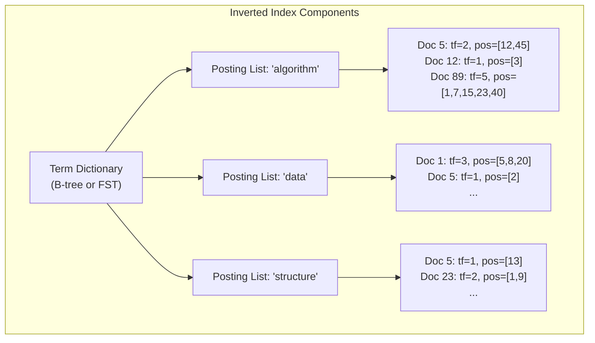
```mermaid
flowchart TB
    subgraph "Inverted Index Components"
        DICT["Term Dictionary<br/>(B-tree or FST)"]

        DICT --> PL1["Posting List: 'algorithm'"]
        DICT --> PL2["Posting List: 'data'"]
        DICT --> PL3["Posting List: 'structure'"]

        PL1 --> POST1["Doc 5: tf=2, pos=[12,45]<br/>Doc 12: tf=1, pos=[3]<br/>Doc 89: tf=5, pos=[1,7,15,23,40]"]
        PL2 --> POST2["Doc 1: tf=3, pos=[5,8,20]<br/>Doc 5: tf=1, pos=[2]<br/>..."]
        PL3 --> POST3["Doc 5: tf=1, pos=[13]<br/>Doc 23: tf=2, pos=[1,9]<br/>..."]
    end
```

### Complexity Analysis

| Operation | Time Complexity | Notes |
|-----------|-----------------|-------|
| Term lookup | O(1) or O(log V) | Hash table or B-tree/FST |
| Posting list traversal | O(k) | k = number of matching documents |
| AND query (intersection) | O(min(k₁, k₂)) | With skip lists |
| OR query (union) | O(k₁ + k₂) | Merge sorted lists |
| Phrase query | O(k × p) | k = docs, p = phrase length |

*V = vocabulary size, k = posting list length*

### Posting List Compression

Raw posting lists consume enormous space. Compression techniques dramatically reduce storage and I/O:

#### Delta Encoding for Document IDs

```
Original DocIDs:    [100, 150, 152, 200, 1000]
Delta Encoded:      [100, 50, 2, 48, 800]

Insight: Deltas are smaller numbers, requiring fewer bits
```

#### Variable Byte Encoding (VByte)

```python
def vbyte_encode(number):
    """
    Encode integer using variable-length bytes.

    Each byte uses 7 bits for data, 1 bit as continuation flag.
    Small numbers use 1 byte, large numbers use more.

    Examples:
        127 → [0x7F]           (1 byte)
        128 → [0x80, 0x01]     (2 bytes)
        16383 → [0xFF, 0x7F]   (2 bytes)
    """
    result = []
    while number >= 128:
        result.append((number & 0x7F) | 0x80)  # Set continuation bit
        number >>= 7
    result.append(number)  # Final byte without continuation
    return bytes(result)
```

#### Frame of Reference (FOR) Encoding

```
Block of DocIDs: [1000, 1002, 1003, 1007, 1008, 1010]

1. Find minimum: 1000
2. Calculate frame: [0, 2, 3, 7, 8, 10]
3. Find max bits needed: 4 bits (for value 10)
4. Pack: Store base (1000) + 6 values × 4 bits = 24 bits

Original: 6 × 32 bits = 192 bits
Compressed: 32 + 24 = 56 bits (3.4x compression)
```

### Skip Lists in Posting Lists

For efficient intersection of posting lists, skip pointers enable jumping over irrelevant sections:

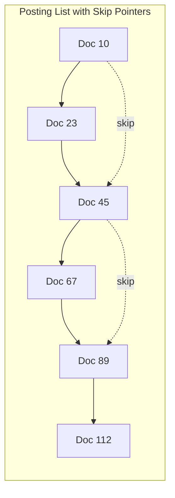
```mermaid
flowchart LR
    subgraph "Posting List with Skip Pointers"
        N1["Doc 10"] --> N2["Doc 23"]
        N2 --> N3["Doc 45"]
        N3 --> N4["Doc 67"]
        N4 --> N5["Doc 89"]
        N5 --> N6["Doc 112"]

        N1 -.->|"skip"| N3
        N3 -.->|"skip"| N5
    end
```

```python
def intersect_with_skips(list1, list2):
    """
    Intersect two posting lists using skip pointers.

    Complexity: O(min(n, m)) average case with skips
    vs O(n + m) without skips
    """
    result = []
    i, j = 0, 0

    while i < len(list1) and j < len(list2):
        if list1[i].doc_id == list2[j].doc_id:
            result.append(list1[i].doc_id)
            i += 1
            j += 1
        elif list1[i].doc_id < list2[j].doc_id:
            # Try to skip in list1
            if list1[i].skip and list1[i].skip.doc_id <= list2[j].doc_id:
                while list1[i].skip and list1[i].skip.doc_id <= list2[j].doc_id:
                    i = list1[i].skip_index
            else:
                i += 1
        else:
            # Try to skip in list2
            if list2[j].skip and list2[j].skip.doc_id <= list1[i].doc_id:
                while list2[j].skip and list2[j].skip.doc_id <= list1[i].doc_id:
                    j = list2[j].skip_index
            else:
                j += 1

    return result
```

**Skip pointer placement**: Typically every sqrt(n) postings, balancing skip overhead with traversal savings.

---

## 3. Text Analysis Pipeline

### Overview

Before text can be indexed or searched, it must be transformed through an **analysis pipeline**. The same pipeline must be applied consistently at both index time and query time.

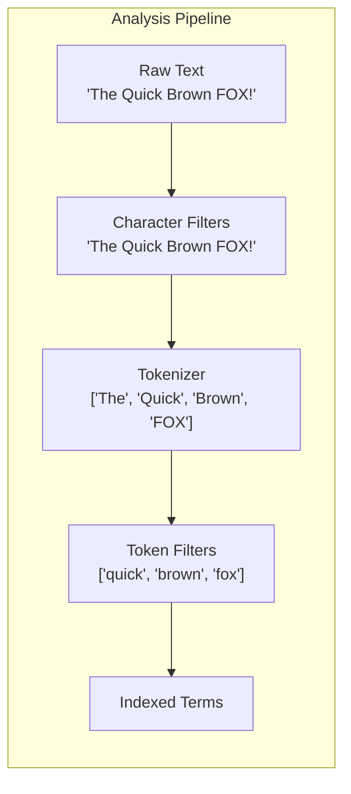
```mermaid
flowchart LR
    subgraph "Analysis Pipeline"
        RAW["Raw Text<br/>'The Quick Brown FOX!'"]

        CHAR["Character Filters<br/>'The Quick Brown FOX!'"]

        TOK["Tokenizer<br/>['The', 'Quick', 'Brown', 'FOX']"]

        FILTER["Token Filters<br/>['quick', 'brown', 'fox']"]

        TERMS["Indexed Terms"]
    end

    RAW --> CHAR --> TOK --> FILTER --> TERMS
```

### Tokenization

Tokenization splits text into individual terms. This is more complex than splitting on whitespace:

| Challenge | Example | Solution |
|-----------|---------|----------|
| **Punctuation** | "U.S.A." vs "U.S.A" | Domain-aware rules |
| **Hyphenation** | "state-of-the-art" | Decompose or preserve |
| **Numbers** | "3.14159" vs "3,14159" | Locale-aware parsing |
| **CJK languages** | "東京都" (no spaces) | Dictionary-based segmentation |
| **Compound words** | "Lebensversicherung" (German) | Decomposition algorithms |

```python
# Standard tokenizer behavior
text = "The quick-brown fox's email: fox@example.com visited U.S.A."

# Whitespace tokenizer (naive)
# → ["The", "quick-brown", "fox's", "email:", "fox@example.com", "visited", "U.S.A."]

# Standard tokenizer (Lucene)
# → ["The", "quick", "brown", "fox's", "email", "fox", "example.com", "visited", "U.S.A"]

# UAX29 URL Email tokenizer
# → ["The", "quick", "brown", "fox's", "email", "fox@example.com", "visited", "U.S.A"]
```

#### CJK Tokenization Challenge

Chinese, Japanese, and Korean languages don't use spaces between words:

```
Chinese: "我喜欢吃苹果" (I like to eat apples)

Character-based: ["我", "喜", "欢", "吃", "苹", "果"]
Dictionary-based: ["我", "喜欢", "吃", "苹果"]
N-gram (bigram): ["我喜", "喜欢", "欢吃", "吃苹", "苹果"]
```

### Normalization

Transform tokens to a canonical form for matching:

```python
class TextNormalizer:
    """Common normalization operations."""

    def lowercase(self, token):
        """Case folding: 'SEARCH' → 'search'"""
        return token.lower()

    def ascii_folding(self, token):
        """Accent removal: 'café' → 'cafe', 'naïve' → 'naive'"""
        import unicodedata
        return ''.join(
            c for c in unicodedata.normalize('NFD', token)
            if unicodedata.category(c) != 'Mn'
        )

    def unicode_normalize(self, token):
        """
        Handle Unicode equivalence.
        'fi' (single char) → 'fi' (two chars)
        """
        return unicodedata.normalize('NFKC', token)
```

### Stop Words

Common words with little semantic value that may be removed:

```python
ENGLISH_STOP_WORDS = {
    'the', 'a', 'an', 'and', 'or', 'but', 'in', 'on', 'at', 'to', 'for',
    'of', 'with', 'by', 'from', 'is', 'are', 'was', 'were', 'be', 'been',
    'being', 'have', 'has', 'had', 'do', 'does', 'did', 'will', 'would',
    'could', 'should', 'may', 'might', 'must', 'shall', 'can', 'this',
    'that', 'these', 'those', 'i', 'you', 'he', 'she', 'it', 'we', 'they'
}

# Trade-off: "To be or not to be" becomes meaningless without stop words
# Modern approach: Keep stop words, let relevance scoring handle them
```

### Stemming and Lemmatization

Reduce words to their root form to match variations:

| Technique | Input | Output | Approach |
|-----------|-------|--------|----------|
| **Stemming** | "running", "runs", "ran" | "run" | Rule-based truncation |
| **Lemmatization** | "running", "runs", "ran" | "run" | Dictionary + morphology |

```python
# Porter Stemmer (algorithmic, fast, aggressive)
from nltk.stem import PorterStemmer
stemmer = PorterStemmer()

words = ['running', 'runs', 'ran', 'runner', 'easily', 'fairly']
stemmed = [stemmer.stem(w) for w in words]
# → ['run', 'run', 'ran', 'runner', 'easili', 'fairli']

# Snowball Stemmer (improved Porter, language-aware)
from nltk.stem import SnowballStemmer
stemmer = SnowballStemmer('english')
# Better handling of edge cases

# Lemmatization (slower, more accurate)
from nltk.stem import WordNetLemmatizer
lemmatizer = WordNetLemmatizer()

lemmatizer.lemmatize('running', pos='v')  # → 'run'
lemmatizer.lemmatize('better', pos='a')   # → 'good'
```

### N-grams and Shingles

Generate subsequences for partial matching and phrase detection:

```python
def generate_ngrams(text, n):
    """
    Character n-grams for fuzzy matching.

    'search' with n=3 → ['sea', 'ear', 'arc', 'rch']
    Enables matching 'serch' (typo) via shared trigrams
    """
    return [text[i:i+n] for i in range(len(text) - n + 1)]

def generate_shingles(tokens, k):
    """
    Word shingles for near-duplicate detection.

    ['the', 'quick', 'brown', 'fox'] with k=2
    → ['the quick', 'quick brown', 'brown fox']
    """
    return [' '.join(tokens[i:i+k]) for i in range(len(tokens) - k + 1)]
```

### Analyzer Types

| Analyzer | Use Case | Operations |
|----------|----------|------------|
| **Standard** | General text | Tokenize, lowercase, stop words |
| **Keyword** | Exact match | No tokenization (entire value is one token) |
| **Simple** | Basic text | Split on non-letters, lowercase |
| **Whitespace** | Preserve structure | Split on whitespace only |
| **Pattern** | Custom delimiters | Regex-based splitting |
| **Language-specific** | Locale support | Stemming, stop words per language |

### Recall vs Precision Trade-off

Analysis choices directly affect search quality:

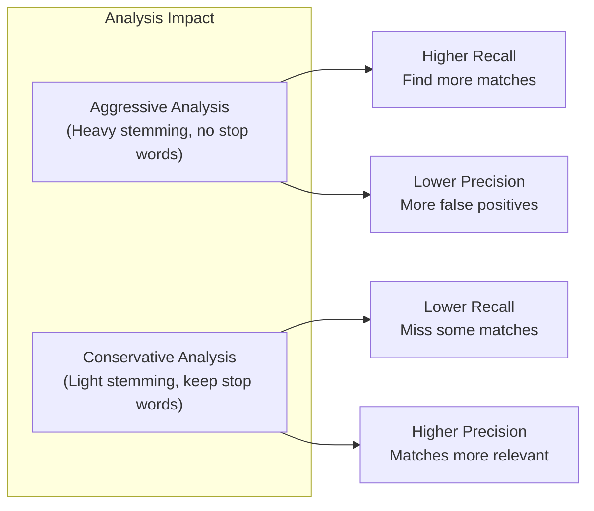
```mermaid
flowchart LR
    subgraph "Analysis Impact"
        AGG["Aggressive Analysis<br/>(Heavy stemming, no stop words)"]
        CON["Conservative Analysis<br/>(Light stemming, keep stop words)"]
    end

    AGG --> HIGH_RECALL["Higher Recall<br/>Find more matches"]
    AGG --> LOW_PREC["Lower Precision<br/>More false positives"]

    CON --> LOW_RECALL["Lower Recall<br/>Miss some matches"]
    CON --> HIGH_PREC["Higher Precision<br/>Matches more relevant"]
```

| Configuration | Recall | Precision | Use Case |
|---------------|--------|-----------|----------|
| Heavy stemming + synonyms | High | Low | E-commerce (don't miss products) |
| Light stemming, exact matching | Low | High | Legal search (precision critical) |
| Balanced | Medium | Medium | General web search |

---

## 4. Relevance Scoring

### TF-IDF (Term Frequency - Inverse Document Frequency)

The foundation of relevance scoring, TF-IDF balances term importance within a document against rarity across the corpus.

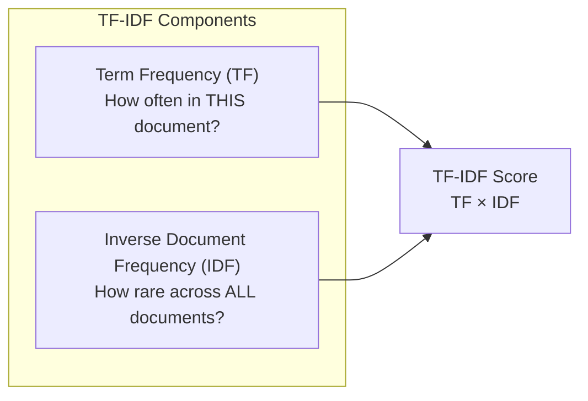
```mermaid
flowchart LR
    subgraph "TF-IDF Components"
        TF["Term Frequency (TF)<br/>How often in THIS document?"]
        IDF["Inverse Document Frequency (IDF)<br/>How rare across ALL documents?"]
    end

    TF --> SCORE["TF-IDF Score<br/>TF × IDF"]
    IDF --> SCORE
```

**Mathematical Formulation:**

```
TF(t, d) = count of term t in document d

IDF(t) = log(N / df(t))
         where N = total documents
               df(t) = documents containing term t

TF-IDF(t, d) = TF(t, d) × IDF(t)
```

```python
import math

def tf_idf(term, document, corpus):
    """
    Calculate TF-IDF score for a term in a document.

    Complexity: O(|corpus|) for IDF computation (cached in practice)
    """
    # Term Frequency
    tf = document.count(term) / len(document)

    # Document Frequency
    df = sum(1 for doc in corpus if term in doc)

    # Inverse Document Frequency (with smoothing)
    idf = math.log((len(corpus) + 1) / (df + 1)) + 1

    return tf * idf

# Example
corpus = [
    ['the', 'quick', 'brown', 'fox'],
    ['the', 'lazy', 'dog'],
    ['quick', 'brown', 'dog', 'jumps']
]

# 'the' appears in 2/3 docs → lower IDF (common word)
# 'fox' appears in 1/3 docs → higher IDF (distinctive)
```

**Complexity:** O(terms × matching_docs) for scoring a query

### BM25 (Best Matching 25)

BM25, also known as Okapi BM25, is the industry standard for relevance scoring. It improves upon TF-IDF with:

1. **Term frequency saturation**: Diminishing returns for repeated terms
2. **Document length normalization**: Penalize unnaturally long documents
3. **Tunable parameters**: k₁ and b for workload optimization

> **Reference:** Robertson, S., Zaragoza, H. (2009). "The Probabilistic Relevance Framework: BM25 and Beyond." Foundations and Trends in Information Retrieval.

**BM25 Formula:**

```
score(D, Q) = Σ IDF(qi) × (f(qi, D) × (k1 + 1)) / (f(qi, D) + k1 × (1 - b + b × |D|/avgdl))

where:
  D = document
  Q = query (terms q1...qn)
  f(qi, D) = frequency of term qi in document D
  |D| = document length
  avgdl = average document length in corpus
  k1 = term frequency saturation parameter (typically 1.2-2.0)
  b = length normalization parameter (typically 0.75)
```

```python
import math

class BM25:
    """
    BM25 scoring implementation.

    Reference: Lucene's BM25Similarity
    """

    def __init__(self, corpus, k1=1.2, b=0.75):
        self.k1 = k1
        self.b = b
        self.corpus = corpus
        self.doc_lengths = [len(doc) for doc in corpus]
        self.avgdl = sum(self.doc_lengths) / len(corpus)
        self.doc_count = len(corpus)

        # Pre-compute IDF for all terms
        self.idf = {}
        self._compute_idf()

    def _compute_idf(self):
        """Compute IDF for all terms in corpus."""
        df = {}  # document frequency
        for doc in self.corpus:
            for term in set(doc):
                df[term] = df.get(term, 0) + 1

        for term, freq in df.items():
            # IDF with smoothing (Lucene formula)
            self.idf[term] = math.log(1 + (self.doc_count - freq + 0.5) / (freq + 0.5))

    def score(self, query_terms, doc_index):
        """
        Score a document for a query.

        Args:
            query_terms: List of query terms
            doc_index: Index of document in corpus

        Returns:
            BM25 score
        """
        doc = self.corpus[doc_index]
        doc_len = self.doc_lengths[doc_index]

        score = 0.0
        for term in query_terms:
            if term not in self.idf:
                continue

            # Term frequency in document
            tf = doc.count(term)

            # BM25 term score
            idf = self.idf[term]
            tf_component = (tf * (self.k1 + 1)) / (
                tf + self.k1 * (1 - self.b + self.b * doc_len / self.avgdl)
            )

            score += idf * tf_component

        return score
```

**Parameter Tuning:**

| Parameter | Effect of Increasing | Typical Range |
|-----------|---------------------|---------------|
| **k1** | More weight to term frequency | 1.2 - 2.0 |
| **b** | More penalty for long documents | 0.5 - 0.75 |

**Why BM25 over TF-IDF?**

| Aspect | TF-IDF | BM25 |
|--------|--------|------|
| TF saturation | Linear (unbounded) | Saturates (diminishing returns) |
| Length normalization | None | Configurable via b |
| Theoretical basis | Heuristic | Probabilistic model |
| Industry adoption | Legacy | Standard (Elasticsearch default) |

### Vector Space Model

Documents and queries represented as vectors in term-space:

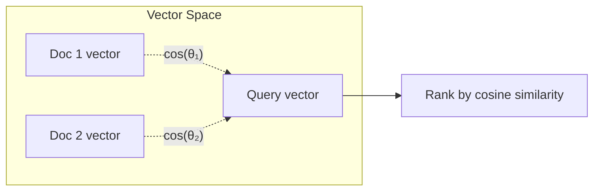
```mermaid
flowchart LR
    subgraph "Vector Space"
        D1["Doc 1 vector"]
        D2["Doc 2 vector"]
        Q["Query vector"]

        D1 -.->|"cos(θ₁)"| Q
        D2 -.->|"cos(θ₂)"| Q
    end

    RANK["Rank by cosine similarity"]

    Q --> RANK
```

```python
import numpy as np

def cosine_similarity(vec1, vec2):
    """
    Compute cosine similarity between two vectors.

    cos(θ) = (A · B) / (||A|| × ||B||)

    Range: [-1, 1] for general vectors
           [0, 1] for non-negative TF-IDF vectors
    """
    dot_product = np.dot(vec1, vec2)
    norm1 = np.linalg.norm(vec1)
    norm2 = np.linalg.norm(vec2)

    if norm1 == 0 or norm2 == 0:
        return 0.0

    return dot_product / (norm1 * norm2)
```

**Limitations for semantic search:**
- Vocabulary mismatch: "car" and "automobile" are orthogonal vectors
- No semantic understanding
- Sparse vectors (mostly zeros) for large vocabularies

### Modern: Dense Vector Search (Brief Overview)

Neural embedding models project text into dense vector spaces where semantic similarity corresponds to geometric proximity:

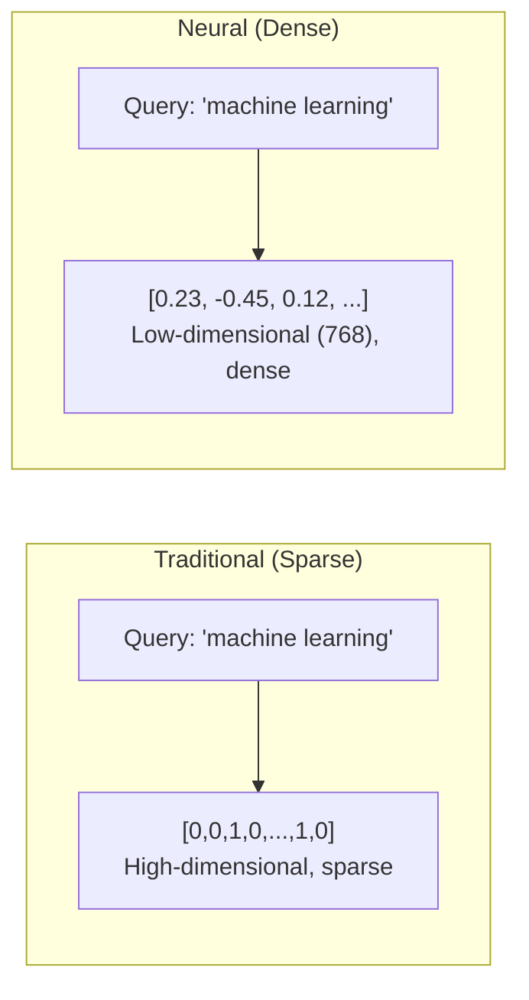
```mermaid
flowchart LR
    subgraph "Traditional (Sparse)"
        SPARSE_Q["Query: 'machine learning'"]
        SPARSE_V["[0,0,1,0,...,1,0]<br/>High-dimensional, sparse"]
    end

    subgraph "Neural (Dense)"
        DENSE_Q["Query: 'machine learning'"]
        DENSE_V["[0.23, -0.45, 0.12, ...]<br/>Low-dimensional (768), dense"]
    end

    SPARSE_Q --> SPARSE_V
    DENSE_Q --> DENSE_V
```

**Approximate Nearest Neighbor (ANN) Algorithms:**
- HNSW (Hierarchical Navigable Small World)
- IVF (Inverted File Index)
- Product Quantization

**Hybrid Search (BM25 + Vectors):**
```python
def hybrid_search(query, alpha=0.7):
    """
    Combine BM25 and vector scores.

    Final_score = alpha × BM25_score + (1-alpha) × vector_score
    """
    bm25_results = bm25_search(query)
    vector_results = vector_search(embed(query))

    # Normalize and combine
    return combine_scores(bm25_results, vector_results, alpha)
```

### Scoring Methods Comparison

| Method | Strengths | Weaknesses | Use Case |
|--------|-----------|------------|----------|
| **TF-IDF** | Simple, interpretable | No length normalization | Legacy systems |
| **BM25** | Robust, tunable | Vocabulary dependent | Primary ranking (standard) |
| **Vector Space** | Mathematical foundation | Sparse, no semantics | Baseline comparisons |
| **Dense Vectors** | Semantic understanding | Expensive, opaque | Semantic search, QA |
| **Hybrid** | Best of both worlds | Complexity, tuning | Production systems |

---

## 5. Index Lifecycle & Segments

### Write Path: Buffer to Segment to Merge

Search engine indexing follows a pattern similar to LSM-trees (see [Storage Engines](./DD_STORAGE_ENGINES.md)):

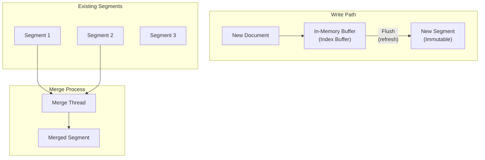
```mermaid
flowchart TB
    subgraph "Write Path"
        DOC["New Document"]
        BUFFER["In-Memory Buffer<br/>(Index Buffer)"]
        SEG_NEW["New Segment<br/>(Immutable)"]

        DOC --> BUFFER
        BUFFER -->|"Flush<br/>(refresh)"| SEG_NEW
    end

    subgraph "Existing Segments"
        SEG1["Segment 1"]
        SEG2["Segment 2"]
        SEG3["Segment 3"]
    end

    subgraph "Merge Process"
        MERGE["Merge Thread"]
        SEG_MERGED["Merged Segment"]

        SEG1 --> MERGE
        SEG2 --> MERGE
        MERGE --> SEG_MERGED
    end
```

> **Reference:** Cutting, D., Pedersen, J. (1990). "Optimizations for Dynamic Inverted Index Maintenance." SIGIR Proceedings.

### Segment Immutability

Once written, segments are **never modified**. This design enables:

1. **Lock-free reads**: No coordination needed between readers
2. **Crash safety**: No partial writes possible
3. **Efficient caching**: Segments are cache-friendly
4. **Simple replication**: Copy immutable files

```python
class Segment:
    """
    An immutable segment containing indexed documents.

    Components:
    - Inverted index (term → posting lists)
    - Stored fields (document source)
    - Doc values (columnar for sorting/aggregations)
    - Norms (length normalization factors)
    """

    def __init__(self, path):
        self.path = path
        self.inverted_index = self._load_inverted_index()
        self.stored_fields = self._load_stored_fields()
        self.doc_values = self._load_doc_values()
        self.deleted_docs = BitSet()  # Only mutation allowed

    def search(self, term):
        """Search is read-only, no locking required."""
        return self.inverted_index.get(term, [])

    def delete(self, doc_id):
        """
        'Delete' by marking in deleted bitmap.
        Document still exists until merge.
        """
        self.deleted_docs.set(doc_id)
```

### Near-Real-Time (NRT) Search

Elasticsearch provides NRT search through a **refresh** operation:

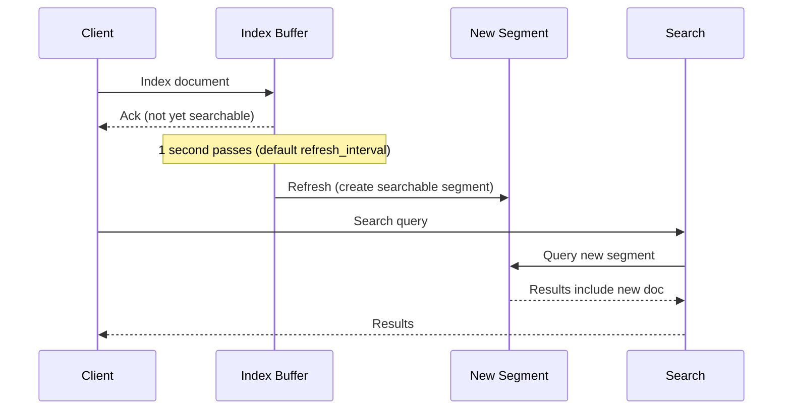
```mermaid
sequenceDiagram
    participant Client
    participant Buffer as Index Buffer
    participant Segment as New Segment
    participant Search as Search

    Client->>Buffer: Index document
    Buffer-->>Client: Ack (not yet searchable)

    Note over Buffer: 1 second passes (default refresh_interval)

    Buffer->>Segment: Refresh (create searchable segment)

    Client->>Search: Search query
    Search->>Segment: Query new segment
    Segment-->>Search: Results include new doc
    Search-->>Client: Results
```

### Refresh vs Flush vs Commit

| Operation | What It Does | Durability | Searchable |
|-----------|--------------|------------|------------|
| **Index** | Add to buffer | Translog only | No |
| **Refresh** | Buffer → segment | Translog only | Yes |
| **Flush** | Segment → disk + clear translog | Full durability | Already was |
| **Force Merge** | Combine segments | N/A | Already was |

```
Timeline:
[Index]──────[Index]──────[Index]──────[Refresh]──────[Index]──────[Flush]
                                           │                          │
                                      Searchable               Durable on disk
                                      (in memory)              (translog cleared)
```

### Merge Policies

As segments accumulate, background merging keeps segment count manageable:

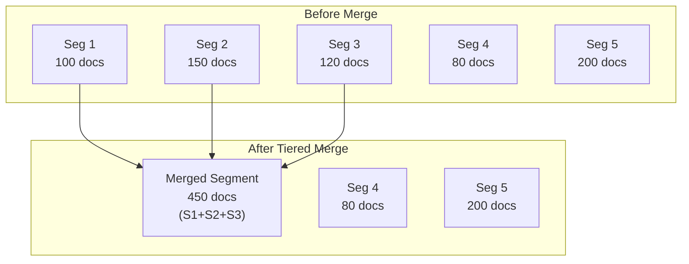
```mermaid
flowchart TB
    subgraph "Before Merge"
        S1["Seg 1<br/>100 docs"]
        S2["Seg 2<br/>150 docs"]
        S3["Seg 3<br/>120 docs"]
        S4["Seg 4<br/>80 docs"]
        S5["Seg 5<br/>200 docs"]
    end

    subgraph "After Tiered Merge"
        S_MERGED["Merged Segment<br/>450 docs<br/>(S1+S2+S3)"]
        S4B["Seg 4<br/>80 docs"]
        S5B["Seg 5<br/>200 docs"]
    end

    S1 --> S_MERGED
    S2 --> S_MERGED
    S3 --> S_MERGED
```

**Tiered Merge Policy (Elasticsearch default):**
- Groups segments by size
- Merges segments of similar size together
- Caps maximum segment size (default 5GB)
- Limits segments per tier

**Log Merge Policy:**
- Merges based on segment count threshold
- Simpler but less efficient

### Write Amplification Analysis

Like LSM-trees, search engines suffer write amplification:

```
Document written once →
  Appears in translog (1x) +
  Appears in initial segment (1x) +
  Merged into larger segment (1x) +
  Merged again (1x) +
  ...

Total write amplification: O(log(N/S))
  where N = total docs, S = segment size threshold
```

| Configuration | Write Amp | Merge Overhead | Search Perf |
|---------------|-----------|----------------|-------------|
| Small segments, frequent merge | High | High | Better (fewer segments) |
| Large segments, rare merge | Low | Low | Worse (many segments) |
| Balanced (default) | Medium | Medium | Good |

---

## 6. Distributed Search Architecture

### Sharding Strategies

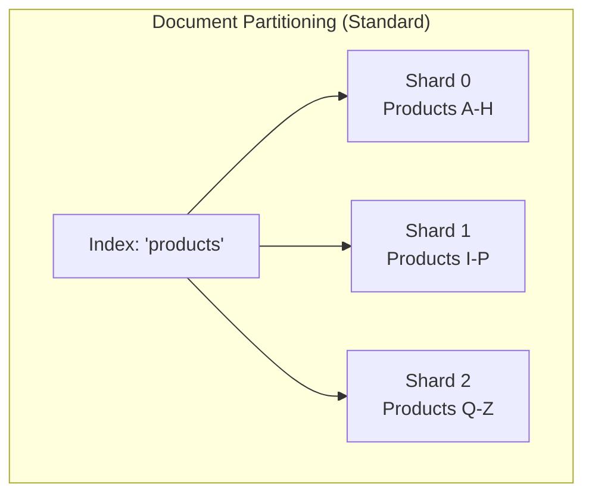
```mermaid
flowchart TB
    subgraph "Document Partitioning (Standard)"
        INDEX["Index: 'products'"]

        S0["Shard 0<br/>Products A-H"]
        S1["Shard 1<br/>Products I-P"]
        S2["Shard 2<br/>Products Q-Z"]

        INDEX --> S0
        INDEX --> S1
        INDEX --> S2
    end
```

**Document Partitioning (default):**
- Documents distributed by routing key (usually _id)
- Each shard contains complete inverted indexes for its documents
- Queries hit all shards (scatter-gather)

**Term Partitioning (specialized, rare):**
- Each shard holds specific terms' posting lists
- Better for specific term lookups
- Complex for multi-term queries

### Shard Sizing Guidelines

| Metric | Recommendation | Rationale |
|--------|----------------|-----------|
| **Shard size** | 20-40 GB | Balance search latency and recovery time |
| **Shards per node** | < 20 per GB heap | JVM overhead per shard |
| **Documents per shard** | 200M max | Lucene limits, practical performance |
| **Primary shards** | Set at creation, immutable | Cannot change without reindex |

```
Example sizing:
- Expected data: 500 GB
- Target shard size: 25 GB
- Primary shards needed: 500 / 25 = 20 primary shards
- With 1 replica: 40 total shards
- Minimum nodes: 3 (for HA with 1 replica)
```

### Query Execution: Scatter-Gather

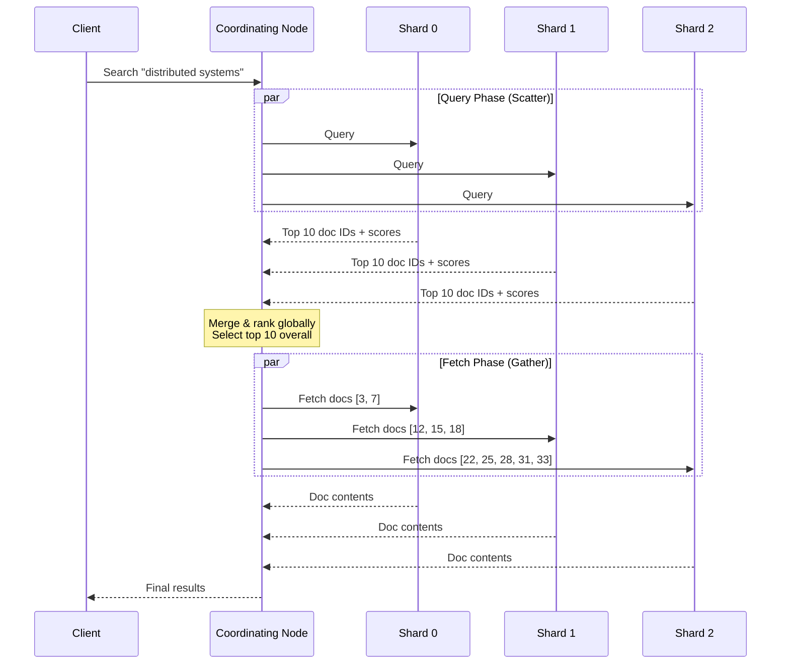
```mermaid
sequenceDiagram
    participant C as Client
    participant COORD as Coordinating Node
    participant S0 as Shard 0
    participant S1 as Shard 1
    participant S2 as Shard 2

    C->>COORD: Search "distributed systems"

    par Query Phase (Scatter)
        COORD->>S0: Query
        COORD->>S1: Query
        COORD->>S2: Query
    end

    S0-->>COORD: Top 10 doc IDs + scores
    S1-->>COORD: Top 10 doc IDs + scores
    S2-->>COORD: Top 10 doc IDs + scores

    Note over COORD: Merge & rank globally<br/>Select top 10 overall

    par Fetch Phase (Gather)
        COORD->>S0: Fetch docs [3, 7]
        COORD->>S1: Fetch docs [12, 15, 18]
        COORD->>S2: Fetch docs [22, 25, 28, 31, 33]
    end

    S0-->>COORD: Doc contents
    S1-->>COORD: Doc contents
    S2-->>COORD: Doc contents

    COORD-->>C: Final results
```

**Complexity:**
- Query phase: O(shards) network calls
- Fetch phase: O(shards) network calls
- Total: O(2 × shards) minimum latency contribution

### Replication

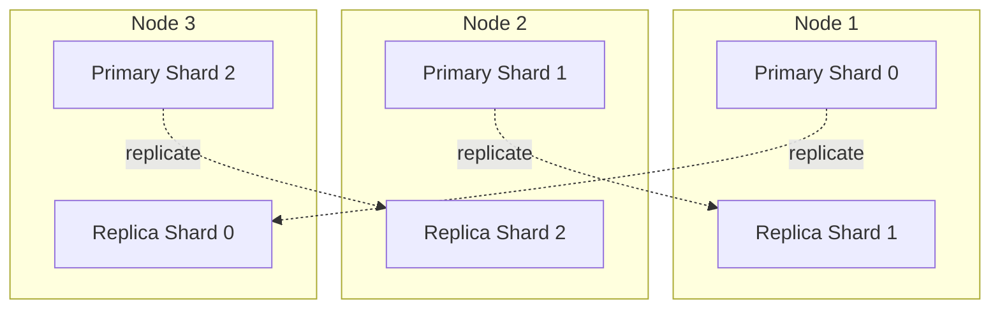
```mermaid
flowchart TB
    subgraph "Node 1"
        P0["Primary Shard 0"]
        R1["Replica Shard 1"]
    end

    subgraph "Node 2"
        P1["Primary Shard 1"]
        R2["Replica Shard 2"]
    end

    subgraph "Node 3"
        P2["Primary Shard 2"]
        R0["Replica Shard 0"]
    end

    P0 -.->|"replicate"| R0
    P1 -.->|"replicate"| R1
    P2 -.->|"replicate"| R2
```

**Search Load Balancing:**
- Queries can be served by primary OR replica
- Coordinating node round-robins across copies
- Automatic failover if a copy is unavailable

**Write Consistency:**
- Writes go to primary first
- Primary replicates to replicas
- Configurable wait_for_active_shards

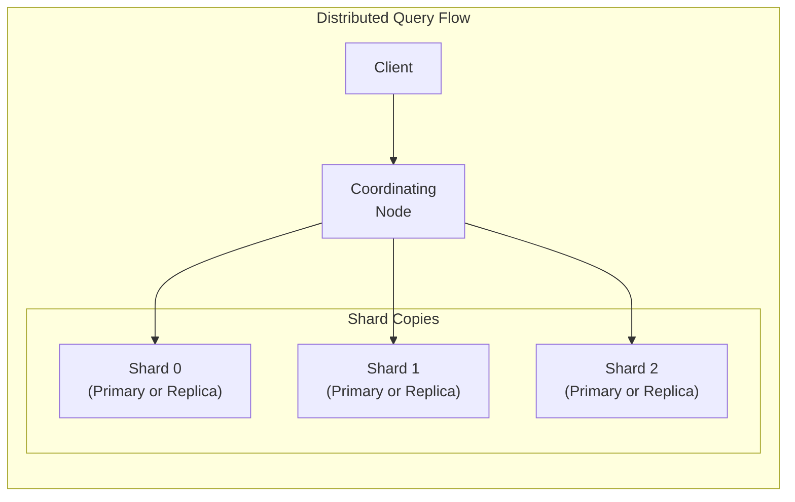
```mermaid
flowchart LR
    subgraph "Distributed Query Flow"
        CLIENT["Client"]
        COORD["Coordinating<br/>Node"]

        subgraph "Shard Copies"
            P0_R0["Shard 0<br/>(Primary or Replica)"]
            P1_R1["Shard 1<br/>(Primary or Replica)"]
            P2_R2["Shard 2<br/>(Primary or Replica)"]
        end
    end

    CLIENT --> COORD
    COORD --> P0_R0
    COORD --> P1_R1
    COORD --> P2_R2
```

---

## 7. Query Types & Execution

### Query DSL Overview

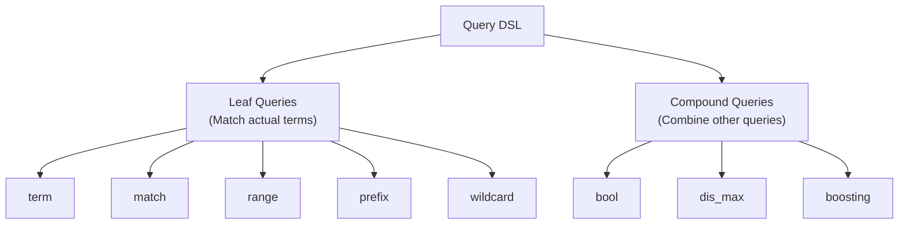
```mermaid
flowchart TB
    QUERY["Query DSL"]

    QUERY --> LEAF["Leaf Queries<br/>(Match actual terms)"]
    QUERY --> COMPOUND["Compound Queries<br/>(Combine other queries)"]

    LEAF --> TERM["term"]
    LEAF --> MATCH["match"]
    LEAF --> RANGE["range"]
    LEAF --> PREFIX["prefix"]
    LEAF --> WILDCARD["wildcard"]

    COMPOUND --> BOOL["bool"]
    COMPOUND --> DIS_MAX["dis_max"]
    COMPOUND --> BOOSTING["boosting"]
```

### Term Query (Exact Match)

```json
{
  "query": {
    "term": {
      "status": "published"
    }
  }
}
```

**Complexity:** O(1) dictionary lookup + O(k) posting list traversal

**Use case:** Keyword fields, exact matching (status, category, ID)

### Match Query (Analyzed)

```json
{
  "query": {
    "match": {
      "title": "distributed systems"
    }
  }
}
```

**What happens:**
1. Query text analyzed: "distributed systems" → ["distributed", "systems"]
2. Term queries for each token
3. Results combined (OR by default)

**Complexity:** O(terms) × O(posting list length)

### Bool Query

```json
{
  "query": {
    "bool": {
      "must": [
        { "match": { "title": "elasticsearch" } }
      ],
      "should": [
        { "match": { "tags": "search" } },
        { "match": { "tags": "distributed" } }
      ],
      "must_not": [
        { "term": { "status": "draft" } }
      ],
      "filter": [
        { "range": { "date": { "gte": "2024-01-01" } } }
      ]
    }
  }
}
```

| Clause | Behavior | Affects Score |
|--------|----------|---------------|
| **must** | Required match | Yes |
| **should** | Optional match | Yes |
| **must_not** | Required exclusion | No |
| **filter** | Required match | No (cached) |

### Query vs Filter Context

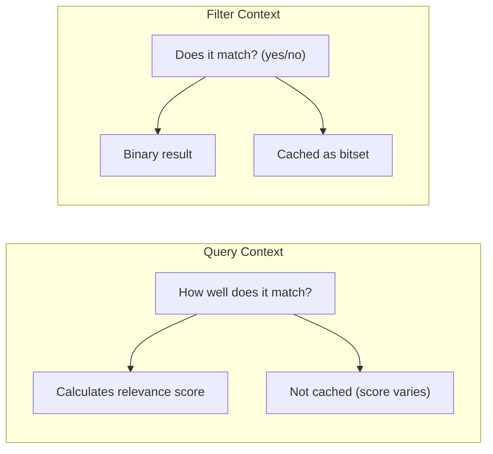
```mermaid
flowchart LR
    subgraph "Query Context"
        QC["How well does it match?"]
        QC --> SCORE["Calculates relevance score"]
        QC --> NOCACHE["Not cached (score varies)"]
    end

    subgraph "Filter Context"
        FC["Does it match? (yes/no)"]
        FC --> BINARY["Binary result"]
        FC --> CACHED["Cached as bitset"]
    end
```

```python
# Filter caching illustrated
class FilterCache:
    """
    Filters are cached as bitsets for reuse.

    First execution: O(n) to evaluate
    Subsequent: O(1) bitset lookup
    """

    def __init__(self):
        self.cache = {}  # filter_hash → BitSet

    def get_or_compute(self, filter_query, index):
        cache_key = hash(filter_query)

        if cache_key in self.cache:
            return self.cache[cache_key]  # O(1)

        # Compute bitset
        bitset = BitSet(index.doc_count)
        for doc_id in filter_query.execute(index):
            bitset.set(doc_id)

        self.cache[cache_key] = bitset
        return bitset
```

### Range Queries

```json
{
  "query": {
    "range": {
      "price": {
        "gte": 100,
        "lte": 500
      }
    }
  }
}
```

**Complexity:** Depends on field type:
- Numeric: O(log n) for BKD tree lookup + O(k) matches
- Keyword: O(log n) dictionary lookup + O(k) posting traversal

### Aggregations

```json
{
  "aggs": {
    "categories": {
      "terms": {
        "field": "category",
        "size": 10
      }
    },
    "price_histogram": {
      "histogram": {
        "field": "price",
        "interval": 50
      }
    },
    "avg_price": {
      "avg": {
        "field": "price"
      }
    }
  }
}
```

| Aggregation Type | Description | Data Structure |
|------------------|-------------|----------------|
| **terms** | Top-N values | Global ordinals |
| **histogram** | Numeric buckets | Doc values |
| **date_histogram** | Time buckets | Doc values |
| **avg, sum, min, max** | Metrics | Doc values |
| **cardinality** | Unique count | HyperLogLog |

### Query Complexity Summary

| Query Type | Time Complexity | Cacheable |
|------------|-----------------|-----------|
| term | O(1) + O(k) | As filter |
| match | O(terms) × O(k) | No |
| bool (must) | O(intersection) | No |
| bool (filter) | O(intersection) | Yes (bitset) |
| range | O(log n) + O(k) | As filter |
| wildcard | O(matching terms) × O(k) | As filter |
| aggregations | O(matching docs) | Varies |

---

## 8. Elasticsearch Specifics

### Cluster Architecture

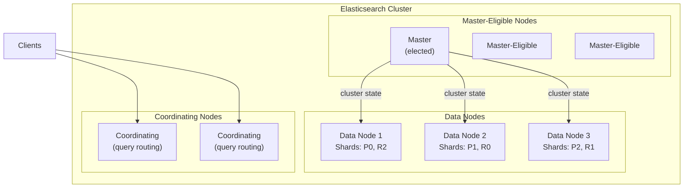
```mermaid
flowchart TB
    subgraph "Elasticsearch Cluster"
        subgraph "Master-Eligible Nodes"
            M1["Master<br/>(elected)"]
            M2["Master-Eligible"]
            M3["Master-Eligible"]
        end

        subgraph "Data Nodes"
            D1["Data Node 1<br/>Shards: P0, R2"]
            D2["Data Node 2<br/>Shards: P1, R0"]
            D3["Data Node 3<br/>Shards: P2, R1"]
        end

        subgraph "Coordinating Nodes"
            C1["Coordinating<br/>(query routing)"]
            C2["Coordinating<br/>(query routing)"]
        end
    end

    CLIENT["Clients"] --> C1
    CLIENT --> C2

    M1 -->|"cluster state"| D1
    M1 -->|"cluster state"| D2
    M1 -->|"cluster state"| D3
```

| Node Role | Responsibility | Scaling Pattern |
|-----------|----------------|-----------------|
| **Master** | Cluster state, shard allocation | 3-5 dedicated (HA) |
| **Data** | Store data, execute queries | Scale with data size |
| **Coordinating** | Route queries, aggregate results | Scale with query load |
| **Ingest** | Pre-process documents | Scale with indexing load |

### Index Templates and Mappings

```json
{
  "index_patterns": ["logs-*"],
  "template": {
    "settings": {
      "number_of_shards": 3,
      "number_of_replicas": 1,
      "refresh_interval": "5s"
    },
    "mappings": {
      "properties": {
        "timestamp": { "type": "date" },
        "message": { "type": "text", "analyzer": "standard" },
        "level": { "type": "keyword" },
        "host": { "type": "keyword" },
        "response_time": { "type": "integer" }
      }
    }
  }
}
```

### Dynamic vs Explicit Mapping

| Approach | Behavior | Trade-off |
|----------|----------|-----------|
| **Dynamic** | Auto-detect field types | Convenient, may guess wrong |
| **Explicit** | Define all fields upfront | Control, requires maintenance |
| **Strict** | Reject unknown fields | Safety, less flexible |

```json
{
  "mappings": {
    "dynamic": "strict",
    "properties": {
      "known_field": { "type": "text" }
    }
  }
}
```

### Index Lifecycle Management (ILM)

```mermaid
flowchart LR
    HOT["Hot Phase<br/>Active indexing<br/>Fast storage"]
    WARM["Warm Phase<br/>Read-only<br/>Standard storage"]
    COLD["Cold Phase<br/>Infrequent access<br/>Slow storage"]
    DELETE["Delete Phase<br/>Remove data"]

    HOT -->|"7 days"| WARM
    WARM -->|"30 days"| COLD
    COLD -->|"90 days"| DELETE
```

```json
{
  "policy": {
    "phases": {
      "hot": {
        "min_age": "0ms",
        "actions": {
          "rollover": {
            "max_size": "50gb",
            "max_age": "1d"
          }
        }
      },
      "warm": {
        "min_age": "7d",
        "actions": {
          "shrink": { "number_of_shards": 1 },
          "forcemerge": { "max_num_segments": 1 }
        }
      },
      "cold": {
        "min_age": "30d",
        "actions": {
          "allocate": {
            "require": { "data": "cold" }
          }
        }
      },
      "delete": {
        "min_age": "90d",
        "actions": {
          "delete": {}
        }
      }
    }
  }
}
```

### Hot-Warm-Cold Architecture

```mermaid
flowchart TB
    subgraph "Hot Tier (SSD)"
        H1["Hot Node 1"]
        H2["Hot Node 2"]
        H3["Hot Node 3"]
    end

    subgraph "Warm Tier (HDD)"
        W1["Warm Node 1"]
        W2["Warm Node 2"]
    end

    subgraph "Cold Tier (Object Storage)"
        FROZEN["Frozen Tier<br/>Searchable Snapshots"]
    end

    H1 -->|"age out"| W1
    H2 -->|"age out"| W2
    W1 -->|"age out"| FROZEN
    W2 -->|"age out"| FROZEN
```

### Cross-Cluster Search

```json
{
  "persistent": {
    "cluster": {
      "remote": {
        "cluster_west": {
          "seeds": ["west-node1:9300", "west-node2:9300"]
        },
        "cluster_east": {
          "seeds": ["east-node1:9300", "east-node2:9300"]
        }
      }
    }
  }
}
```

```json
// Search across clusters
GET /cluster_west:logs-*,cluster_east:logs-*,logs-*/_search
{
  "query": {
    "match": { "message": "error" }
  }
}
```

---

## 9. Performance Optimization

### Mapping Optimization

| Field Type | Use Case | Storage | Searchable |
|------------|----------|---------|------------|
| **text** | Full-text search | Inverted index | Yes (analyzed) |
| **keyword** | Exact match, aggregations | Inverted index + doc values | Yes (not analyzed) |
| **integer, long** | Numeric operations | BKD tree + doc values | Yes |
| **date** | Time operations | BKD tree + doc values | Yes |

**Common mistake:** Using text for everything

```json
{
  "properties": {
    "status": { "type": "keyword" },
    "user_id": { "type": "keyword" },
    "created_at": { "type": "date" },
    "description": { "type": "text" },
    "title": {
      "type": "text",
      "fields": {
        "keyword": { "type": "keyword" }
      }
    }
  }
}
```

### Doc Values for Sorting and Aggregations

```mermaid
flowchart LR
    subgraph "Without Doc Values"
        INV["Inverted Index<br/>term → docs"]
        UNINVERT["Uninvert at query time<br/>doc → terms"]
        SLOW["Slow aggregations"]

        INV --> UNINVERT --> SLOW
    end

    subgraph "With Doc Values"
        DV["Doc Values<br/>doc → terms<br/>(columnar)"]
        FAST["Fast aggregations"]

        DV --> FAST
    end
```

### Query Caching

| Cache | What's Cached | Invalidation |
|-------|---------------|--------------|
| **Query Cache** | Filter results (bitsets) | Segment refresh |
| **Request Cache** | Full aggregation results | Index refresh |
| **Fielddata Cache** | Text field aggregations | Memory pressure |

### Avoiding Deep Pagination

```python
# PROBLEM: Deep pagination is expensive
# GET /products/_search?from=10000&size=10
# Requires coordination of 10,010 docs from each shard

# SOLUTION 1: search_after (cursor-based)
{
    "size": 10,
    "sort": [
        {"created_at": "desc"},
        {"_id": "asc"}
    ],
    "search_after": ["2024-01-15T10:30:00Z", "abc123"]
}

# SOLUTION 2: Point in Time (PIT) + search_after
# 1. Open PIT
# POST /products/_pit?keep_alive=5m
# Returns: { "id": "..." }

# 2. Search with PIT
{
    "pit": { "id": "...", "keep_alive": "5m" },
    "size": 10,
    "sort": [{"_shard_doc": "asc"}],
    "search_after": [1234567]
}
```

### Bulk Indexing Best Practices

```python
from elasticsearch import Elasticsearch, helpers

def bulk_index_optimal(es: Elasticsearch, documents, index_name):
    """
    Optimal bulk indexing configuration.

    Guidelines:
    - Batch size: 5-15 MB or 1000-5000 docs
    - Disable refresh during bulk: refresh_interval=-1
    - Increase index buffer: indices.memory.index_buffer_size
    - Multiple bulk threads (but not too many)
    """

    # Disable refresh during bulk load
    es.indices.put_settings(
        index=index_name,
        body={"refresh_interval": "-1"}
    )

    try:
        actions = [
            {
                "_index": index_name,
                "_source": doc
            }
            for doc in documents
        ]

        # Bulk with optimal settings
        helpers.bulk(
            es,
            actions,
            chunk_size=1000,           # Documents per batch
            max_chunk_bytes=10485760,  # 10MB max per batch
            request_timeout=60
        )
    finally:
        # Re-enable refresh
        es.indices.put_settings(
            index=index_name,
            body={"refresh_interval": "1s"}
        )

        # Force refresh to make data searchable
        es.indices.refresh(index=index_name)
```

### Typical Performance Numbers

| Operation | Expected Latency | Notes |
|-----------|------------------|-------|
| Simple query | 1-10 ms | Single term, filter |
| Complex query | 10-100 ms | Multiple clauses, scoring |
| Aggregation (small) | 10-50 ms | Terms on low-cardinality field |
| Aggregation (large) | 100-500 ms | High cardinality, multiple levels |
| Bulk indexing | 10-50 MB/s per node | With optimization |

---

## 10. Production Patterns

### Log Analytics (ELK Stack)

```mermaid
flowchart LR
    subgraph "Sources"
        APP1["App Servers"]
        APP2["Web Servers"]
        APP3["Microservices"]
    end

    subgraph "Collection"
        BEAT["Filebeat<br/>Log shipping"]
        LOGSTASH["Logstash<br/>Transform"]
    end

    subgraph "Storage"
        ES["Elasticsearch<br/>Index & Search"]
    end

    subgraph "Visualization"
        KIBANA["Kibana<br/>Dashboards"]
    end

    APP1 --> BEAT
    APP2 --> BEAT
    APP3 --> BEAT
    BEAT --> LOGSTASH
    LOGSTASH --> ES
    ES --> KIBANA
```

**Index naming:** `logs-{application}-{YYYY.MM.dd}`

**Retention:** ILM with hot/warm/cold/delete phases

### E-commerce Product Search

```json
{
  "mappings": {
    "properties": {
      "name": {
        "type": "text",
        "analyzer": "english",
        "fields": {
          "autocomplete": {
            "type": "text",
            "analyzer": "autocomplete_analyzer"
          }
        }
      },
      "category": { "type": "keyword" },
      "brand": { "type": "keyword" },
      "price": { "type": "float" },
      "in_stock": { "type": "boolean" },
      "rating": { "type": "float" },
      "attributes": {
        "type": "nested",
        "properties": {
          "name": { "type": "keyword" },
          "value": { "type": "keyword" }
        }
      }
    }
  }
}
```

### Autocomplete/Suggest

```json
{
  "settings": {
    "analysis": {
      "analyzer": {
        "autocomplete_analyzer": {
          "type": "custom",
          "tokenizer": "standard",
          "filter": ["lowercase", "autocomplete_filter"]
        }
      },
      "filter": {
        "autocomplete_filter": {
          "type": "edge_ngram",
          "min_gram": 2,
          "max_gram": 20
        }
      }
    }
  }
}
```

**Alternative: Completion Suggester**
```json
{
  "suggest": {
    "product-suggest": {
      "prefix": "ela",
      "completion": {
        "field": "suggest",
        "fuzzy": { "fuzziness": 1 }
      }
    }
  }
}
```

### Faceted Navigation

```json
{
  "query": {
    "bool": {
      "must": [
        { "match": { "name": "laptop" } }
      ],
      "filter": [
        { "term": { "brand": "apple" } },
        { "range": { "price": { "gte": 1000, "lte": 2000 } } }
      ]
    }
  },
  "aggs": {
    "brands": {
      "terms": { "field": "brand", "size": 20 }
    },
    "price_ranges": {
      "range": {
        "field": "price",
        "ranges": [
          { "to": 500 },
          { "from": 500, "to": 1000 },
          { "from": 1000, "to": 2000 },
          { "from": 2000 }
        ]
      }
    },
    "categories": {
      "terms": { "field": "category", "size": 10 }
    }
  }
}
```

### Geo-Search

```json
{
  "mappings": {
    "properties": {
      "location": { "type": "geo_point" }
    }
  }
}
```

```json
{
  "query": {
    "bool": {
      "must": { "match_all": {} },
      "filter": {
        "geo_distance": {
          "distance": "10km",
          "location": {
            "lat": 40.7128,
            "lon": -74.0060
          }
        }
      }
    }
  },
  "sort": [
    {
      "_geo_distance": {
        "location": { "lat": 40.7128, "lon": -74.0060 },
        "order": "asc"
      }
    }
  ]
}
```

### Percolator (Reverse Search)

Instead of "which documents match this query," ask "which queries match this document":

```json
// Register a query
PUT /alerts/_doc/1
{
  "query": {
    "match": { "message": "error" }
  },
  "alert_type": "ops-team"
}

// Percolate a document against stored queries
GET /alerts/_search
{
  "query": {
    "percolate": {
      "field": "query",
      "document": {
        "message": "Application error occurred in production"
      }
    }
  }
}
// Returns: alert 1 matches
```

**Use cases:** Alerting, saved searches, prospective search

---

## 11. Failure Scenarios

### Split-Brain Prevention

**Problem:** Network partition causes cluster to elect two masters

```mermaid
flowchart TB
    subgraph "Partition A"
        M1["Master 1"]
        D1["Data Node"]
    end

    subgraph "Partition B"
        M2["Master 2?"]
        D2["Data Node"]
        D3["Data Node"]
    end

    M1 x--x M2
```

**Solution:** Quorum-based master election

```yaml
# elasticsearch.yml
# Minimum master-eligible nodes for election
discovery.zen.minimum_master_nodes: 2  # (N/2) + 1 for N master-eligible

# In ES 7+: Cluster coordination is automatic
cluster.initial_master_nodes: ["master-1", "master-2", "master-3"]
```

**Formula:** `minimum_master_nodes = (master_eligible_nodes / 2) + 1`

### Shard Allocation Failures

| Symptom | Cause | Resolution |
|---------|-------|------------|
| Unassigned primary | Disk full, node failed | Add capacity, restore from replica |
| Unassigned replica | Not enough nodes | Add nodes, reduce replicas |
| YELLOW status | Replica allocation blocked | Check disk watermarks, node health |
| RED status | Primary shard missing | Data loss possible, restore backup |

```bash
# Diagnose allocation issues
GET /_cluster/allocation/explain
{
  "index": "my-index",
  "shard": 0,
  "primary": true
}
```

### Cluster State Size Issues

**Problem:** Very large cluster state causes slow cluster operations

**Causes:**
- Too many indices (>1000)
- Too many shards (>10,000)
- Large mapping definitions
- Many ingest pipelines

**Solutions:**
- Index lifecycle management (delete old indices)
- Use index templates (reduce unique mappings)
- Rollover indices (time-based)
- Data streams (ES 7.9+)

### Mapping Explosion

**Problem:** Dynamic mapping creates thousands of fields

```json
// Problematic: User-generated field names
{
  "user_preference_12345": "value1",
  "user_preference_67890": "value2",
  // ... thousands more
}
```

**Solutions:**
```json
// Solution 1: Disable dynamic mapping
{ "mappings": { "dynamic": "strict" } }

// Solution 2: Use flattened type
{
  "mappings": {
    "properties": {
      "user_preferences": { "type": "flattened" }
    }
  }
}

// Solution 3: Set field limit
{
  "settings": {
    "index.mapping.total_fields.limit": 1000
  }
}
```

---

## 12. Comparison: Elasticsearch vs Alternatives

| Feature | Elasticsearch | Solr | OpenSearch | Meilisearch | Typesense |
|---------|--------------|------|------------|-------------|-----------|
| **Based on** | Lucene | Lucene | ES fork | Rust | C++ |
| **License** | SSPL/Elastic | Apache 2.0 | Apache 2.0 | MIT | GPL-3.0 |
| **Schema** | Dynamic | Schema/Schemaless | Dynamic | Schemaless | Required |
| **Real-time** | NRT (~1s) | NRT | NRT | Real-time | Real-time |
| **Scaling** | Automatic | Manual | Automatic | Limited | Manual |
| **Aggregations** | Excellent | Excellent | Excellent | Basic | Basic |
| **ML features** | Built-in | Plugins | Forks | None | None |
| **Ease of use** | Medium | Complex | Medium | Simple | Simple |
| **Typo tolerance** | Via fuzzy | Via fuzzy | Via fuzzy | Built-in | Built-in |

### When to Choose Each

| Choose | When |
|--------|------|
| **Elasticsearch** | Enterprise search, log analytics, complex aggregations |
| **Solr** | Existing Solr investment, Apache ecosystem preference |
| **OpenSearch** | Elasticsearch alternative, AWS integration, true open source |
| **Meilisearch** | Simple instant search, typo tolerance critical, small-medium scale |
| **Typesense** | Simple API, instant search, self-hosted simplicity |

### Decision Framework

```mermaid
flowchart TD
    START["Search Engine Choice"] --> Q1{Scale?}

    Q1 -->|"Large (TB+)<br/>Complex queries"| Q2{License concern?}
    Q1 -->|"Small-Medium<br/>Simple search"| Q3{Ops complexity?}

    Q2 -->|"Yes"| OPENSEARCH["OpenSearch"]
    Q2 -->|"No"| ELASTICSEARCH["Elasticsearch"]

    Q3 -->|"Minimize"| Q4{Primary use?}
    Q3 -->|"OK with complexity"| ELASTICSEARCH

    Q4 -->|"Instant search<br/>Typo tolerance"| MEILISEARCH["Meilisearch"]
    Q4 -->|"API simplicity"| TYPESENSE["Typesense"]
```

---

## 13. Interview Articulation

### 30-Second Version

> "Search engines use inverted indexes—a data structure that maps terms to documents, enabling O(1) term lookup and efficient posting list intersection. The key insight is that unlike B-trees which map documents to terms, inverted indexes invert this relationship. Modern engines like Elasticsearch add relevance scoring with BM25, distributed execution with scatter-gather across shards, and near-real-time indexing through segment-based architecture similar to LSM-trees. The main trade-offs are eventual consistency (not ACID), and the need to denormalize data since joins are expensive."

### 2-Minute Version

> "Full-text search fundamentally differs from database queries. When someone searches 'distributed systems,' they expect to find 'distributed system' (singular), relevant variations, and ranked results—not just exact matches.
>
> The core data structure is the inverted index: a mapping from terms to posting lists containing document IDs, term frequencies, and positions. This enables O(1) term lookup. For a query like 'distributed AND systems', we intersect posting lists, optimized with skip pointers to O(min(k₁, k₂)).
>
> Before indexing, text goes through an analysis pipeline: tokenization splits text into terms, normalization handles case and accents, and stemming reduces words to roots. The same analysis must apply at both index and query time.
>
> Relevance scoring uses BM25—an improvement over TF-IDF that adds term frequency saturation and document length normalization. The formula balances how often a term appears in a document against how rare it is across the corpus.
>
> Architecturally, Elasticsearch distributes data across shards using document partitioning. Queries execute via scatter-gather: the coordinating node sends queries to all shards, collects top-N results, merges globally, then fetches full documents. This is O(shards) network calls minimum.
>
> The indexing model uses immutable segments, similar to LSM-trees. New documents go to an in-memory buffer, then flush to segments. Background merging controls segment count. Deletes mark documents in a bitmap until merge removes them.
>
> Key trade-offs: eventual consistency (NRT means ~1 second delay), no transactions across documents, and cross-shard operations are expensive. For these reasons, search engines complement rather than replace databases."

### Common Follow-Up Questions

| Question | Key Points |
|----------|------------|
| "How does full-text search work?" | Inverted index: term → doc IDs; analysis pipeline; BM25 scoring |
| "Explain inverted index" | Maps terms to posting lists; O(1) lookup; compression with delta encoding |
| "How would you design autocomplete?" | Edge n-grams, completion suggester, or prefix queries; trade-off index size vs latency |
| "Elasticsearch vs database full-text search?" | ES: distributed, advanced scoring, aggregations; DB: ACID, joins, simpler ops |
| "How to handle typos?" | Fuzzy queries (edit distance), n-gram indexes, phonetic analyzers |
| "Scaling challenges?" | Shard sizing (20-40GB), avoid deep pagination, hot/warm/cold tiering |

---

## 14. Quick Reference Card

### Inverted Index Structure

```
Term Dictionary (FST/B-tree)
    ↓
"search" → PostingList [
    {doc_id: 1, tf: 3, positions: [5, 12, 89]},
    {doc_id: 7, tf: 1, positions: [23]},
    ...
]
```

### BM25 Formula

```
score(D, Q) = Σ IDF(qi) × (f(qi, D) × (k1 + 1)) / (f(qi, D) + k1 × (1 - b + b × |D|/avgdl))

k1 = 1.2 (term frequency saturation)
b = 0.75 (length normalization)
```

### Shard Sizing Guidelines

| Metric | Target | Hard Limit |
|--------|--------|------------|
| Shard size | 20-40 GB | 50 GB |
| Docs per shard | 10-50 M | 200 M |
| Shards per GB heap | < 20 | - |

### Query Type Selection Guide

| Need | Query Type |
|------|------------|
| Exact match (keyword) | `term` |
| Full-text search | `match` |
| Multiple conditions | `bool` |
| Non-scoring filter | `filter` context |
| Numeric range | `range` |
| Prefix autocomplete | `prefix` or completion suggester |

### Mapping Best Practices

```json
{
  "status": { "type": "keyword" },
  "description": { "type": "text" },
  "title": {
    "type": "text",
    "fields": { "keyword": { "type": "keyword" } }
  },
  "created_at": { "type": "date" },
  "price": { "type": "float", "doc_values": true }
}
```

### Common Pitfalls

| Pitfall | Solution |
|---------|----------|
| Deep pagination (from: 10000) | Use search_after + PIT |
| Too many shards | Target 20-40GB per shard |
| Dynamic mapping explosion | Set explicit mappings or flattened type |
| Text field aggregations | Use keyword field or doc_values |
| Split brain | 3+ master-eligible nodes with quorum |

---

## References

### Academic Papers

- **Zobel, J., Moffat, A. (2006)** — "Inverted Files for Text Search Engines." ACM Computing Surveys, 38(2). — Comprehensive survey of inverted index techniques
- **Baeza-Yates, R., Ribeiro-Neto, B. (2011)** — "Modern Information Retrieval: The Concepts and Technology Behind Search." Addison-Wesley. — Foundational IR textbook
- **Robertson, S., Zaragoza, H. (2009)** — "The Probabilistic Relevance Framework: BM25 and Beyond." Foundations and Trends in Information Retrieval. — BM25 theoretical foundation
- **Cutting, D., Pedersen, J. (1990)** — "Optimizations for Dynamic Inverted Index Maintenance." SIGIR Proceedings. — Segment-based indexing
- **Porter, M.F. (1980)** — "An Algorithm for Suffix Stripping." Program, 14(3). — Porter stemming algorithm

### Production Documentation

- **Elasticsearch** — [The Definitive Guide](https://www.elastic.co/guide/en/elasticsearch/reference/current/index.html)
- **Apache Lucene** — [Core Documentation](https://lucene.apache.org/core/)
- **Elasticsearch Internals** — [Elasticsearch: The Definitive Guide (Legacy)](https://www.elastic.co/guide/en/elasticsearch/guide/current/index.html)

### Implementation References

- **Lucene Segment Architecture** — [IndexWriter Implementation](https://lucene.apache.org/core/9_0_0/core/org/apache/lucene/index/IndexWriter.html)
- **BM25 in Lucene** — [BM25Similarity](https://lucene.apache.org/core/9_0_0/core/org/apache/lucene/search/similarities/BM25Similarity.html)

---

## Revision History

| Date | Change |
|------|--------|
| 2025-01 | Initial deep-dive document with inverted indexes, BM25, distributed architecture, Elasticsearch specifics |

---

## Navigation

**Parent:** [Data Storage & Access](./04_DATA_STORAGE_AND_ACCESS.md)
**Related:** [Storage Engines](./DD_STORAGE_ENGINES.md), [Sharding & Partitioning](./DD_SHARDING_PARTITIONING.md)
**Index:** [README](./README.md)
