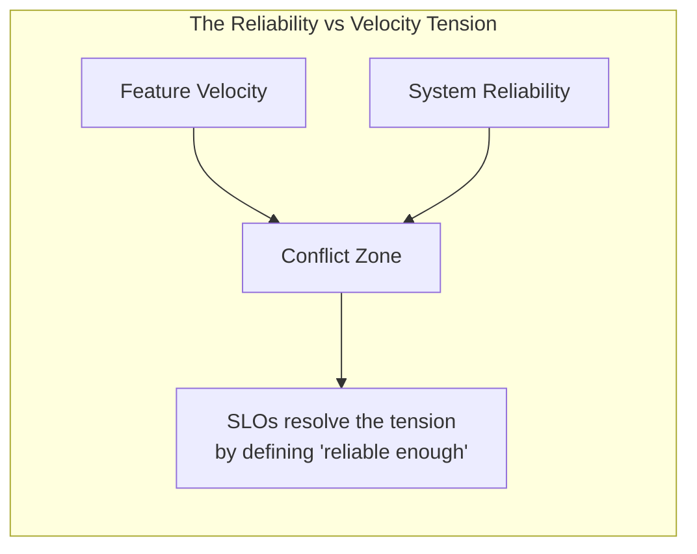
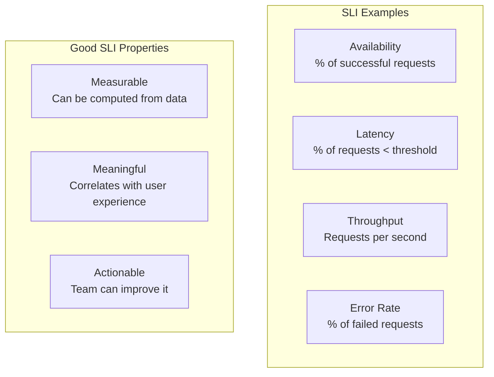
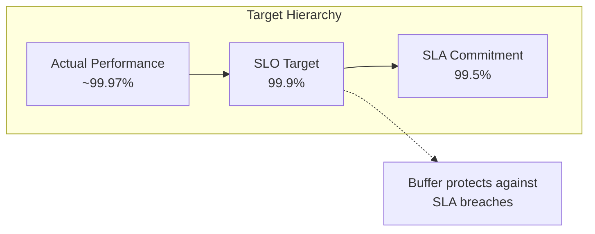
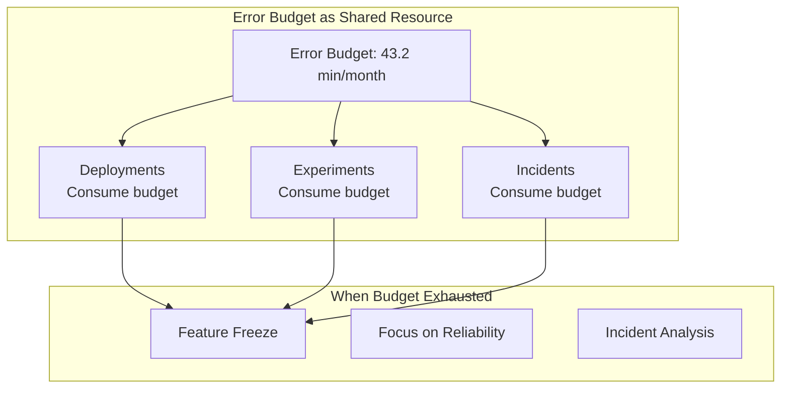
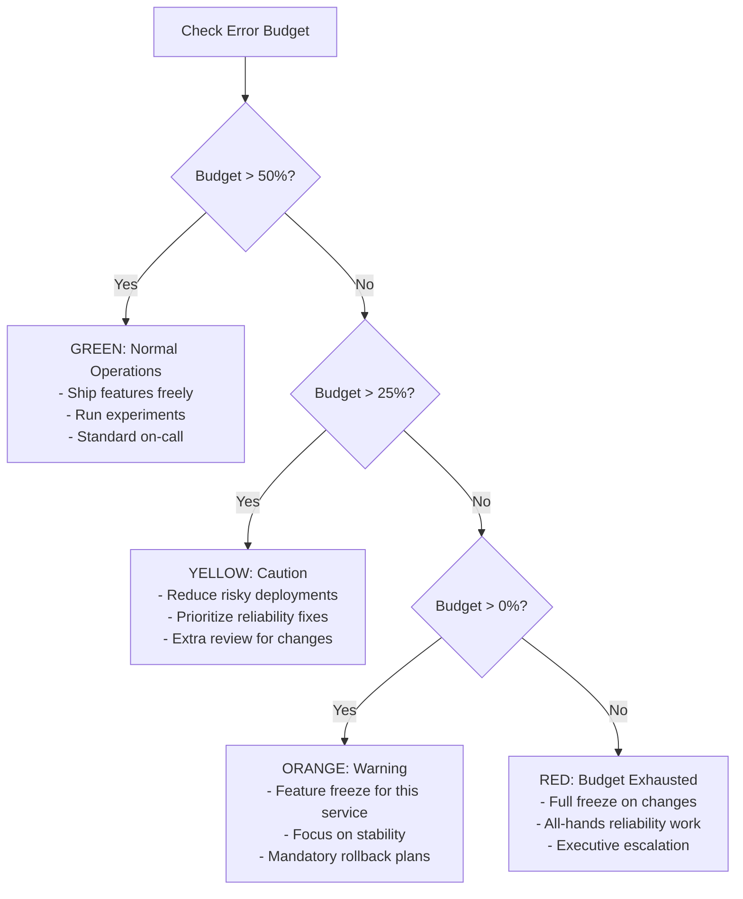
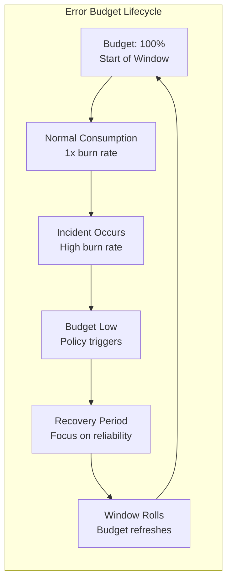
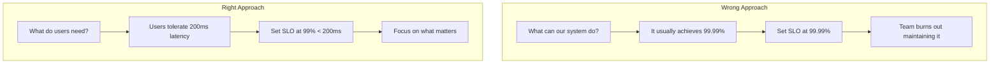
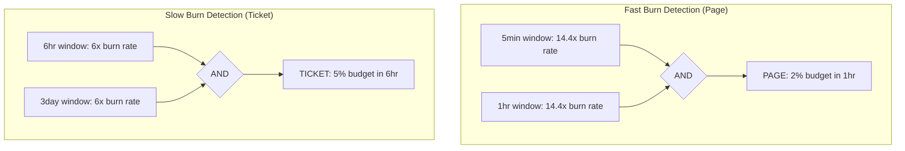

# Service Level Objectives — Deep Dive

> Defining reliability targets that balance user expectations with engineering velocity.

**Prerequisites:** [Foundational Concepts](./01_FOUNDATIONAL_CONCEPTS.md)
**Related:** [Resilience Patterns](./08_RESILIENCE_PATTERNS.md), [Scaling & Infrastructure](./09_SCALING_AND_INFRASTRUCTURE.md)
**Estimated study time:** 1.5-2 hours

---

## Table of Contents

1. [Context & Problem Statement](#1-context--problem-statement)
2. [SLI, SLO, SLA Definitions](#2-sli-slo-sla-definitions)
3. [Error Budgets](#3-error-budgets)
4. [Setting Good SLOs](#4-setting-good-slos)
5. [SLO-Based Alerting](#5-slo-based-alerting)
6. [Production Examples](#6-production-examples)
7. [Interview Articulation](#7-interview-articulation)
8. [Quick Reference Card](#8-quick-reference-card)
9. [References](#references)

---

## 1. Context & Problem Statement

### Why SLOs Matter

Every production system faces a fundamental tension: users want perfect reliability, but engineering teams need to ship features and make changes. Without a shared framework, this tension creates conflict:

- **Operations teams** become gatekeepers, blocking deployments to prevent incidents
- **Development teams** push back, frustrated by slow release cycles
- **Management** lacks visibility into whether the system is "reliable enough"



### The Cost of Over-Reliability

Pursuing 100% reliability is not just impractical—it's actively harmful:

| Availability | Downtime/Year | Cost Multiplier | Practical Impact |
|--------------|---------------|-----------------|------------------|
| 99% | 3.65 days | 1x (baseline) | Acceptable for internal tools |
| 99.9% | 8.76 hours | ~10x | Standard for most services |
| 99.99% | 52.6 minutes | ~100x | Critical financial systems |
| 99.999% | 5.26 minutes | ~1000x | Rarely justified |

Each "nine" costs roughly 10x more in engineering effort, infrastructure, and operational overhead. The goal is not maximum reliability—it's the right level of reliability.

### When to Define SLOs

SLOs become critical when:

- **Multiple teams depend on a service**: SLOs create contracts between teams
- **User experience directly correlates with service health**: SLOs tie technical metrics to user satisfaction
- **You need to make trade-off decisions**: SLOs provide objective criteria for risk-taking
- **Incident response feels reactive**: SLOs shift focus from fighting fires to maintaining targets

The core insight of SRE philosophy: **reliability is a feature**, and like any feature, it requires explicit prioritization and measurement.

---

## 2. SLI, SLO, SLA Definitions

### Service Level Indicator (SLI)

An SLI is a **quantitative measure** of a specific aspect of service behavior. It answers: "How is the service performing right now?"



**Common SLI Types:**

| SLI Type | Definition | Example |
|----------|------------|---------|
| **Availability** | Proportion of successful requests | 99.95% of requests return non-5xx |
| **Latency** | Proportion of requests faster than threshold | 99% of requests complete in < 200ms |
| **Throughput** | Rate of successful operations | System handles 10,000 RPS |
| **Error rate** | Proportion of failed requests | < 0.1% of requests fail |
| **Freshness** | Proportion of data updated recently | 99% of data < 1 minute old |
| **Durability** | Proportion of data retained | 99.999999999% of objects preserved |

**SLI Specification vs Implementation:**

```python
# SLI Specification (what we want to measure)
"""
Latency SLI: The proportion of valid requests served in under 200ms,
measured at the load balancer.
"""

# SLI Implementation (how we measure it)
def calculate_latency_sli(start_time, end_time):
    """
    Calculate latency SLI for a time window.

    Returns: float between 0.0 and 1.0
    """
    total_requests = query_metrics(
        'sum(http_requests_total{status!~"5.."})',
        start_time, end_time
    )
    fast_requests = query_metrics(
        'sum(http_request_duration_seconds_bucket{le="0.2",status!~"5.."})',
        start_time, end_time
    )
    return fast_requests / total_requests if total_requests > 0 else 1.0
```

### Service Level Objective (SLO)

An SLO is a **target value** for an SLI over a specific time window. It answers: "How reliable should the service be?"

**Key characteristics:**
- Internal commitment, not a contract with external parties
- Defines "good enough" reliability
- Creates the basis for error budgets
- Should be achievable but meaningful

**SLO Examples:**

| Service | SLI | SLO Target | Window |
|---------|-----|------------|--------|
| API Gateway | Availability | 99.9% | 30 days |
| API Gateway | p99 Latency < 200ms | 99% | 30 days |
| Payment Service | Availability | 99.95% | 30 days |
| Search Index | Freshness < 10s | 99.5% | 7 days |
| Object Storage | Durability | 99.999999999% | Annual |

**SLO Structure:**

```
SLO = SLI meets threshold for X% of [time window]

Example: "99.9% of requests complete successfully over a 30-day rolling window"
         |___|           |_______|            |______________|
         Target          SLI                  Time Window
```

### Service Level Agreement (SLA)

An SLA is a **contract** with explicit consequences for missing targets. It answers: "What happens if we fail?"

**Key differences from SLO:**

| Aspect | SLO | SLA |
|--------|-----|-----|
| Audience | Internal teams | External customers |
| Enforcement | Error budget policies | Legal/financial penalties |
| Targets | Aggressive (push the team) | Conservative (avoid penalties) |
| Flexibility | Can be adjusted iteratively | Contractual, hard to change |

**Critical relationship:** SLA targets should be **looser than SLO targets**.



**Why the gap matters:**
- SLO breach triggers internal response (freeze features, investigate)
- SLA breach triggers contractual consequences (credits, penalties)
- The gap provides time to recover before SLA breach

### Comparison Table

| Aspect | SLI | SLO | SLA |
|--------|-----|-----|-----|
| What it is | Measurement | Target | Contract |
| Format | Metric value | Target + window | Legal document |
| Audience | Engineers | Engineering + Product | Customers + Legal |
| Consequence of miss | Data point | Error budget consumption | Financial/legal penalty |
| Example | "99.95% availability now" | "99.9% over 30 days" | "99.5% or service credits" |

---

## 3. Error Budgets

### Definition and Purpose

An **error budget** is the inverse of an SLO—it quantifies the acceptable amount of unreliability.

```
Error Budget = 100% - SLO Target

Example: 99.9% SLO → 0.1% error budget
         In a 30-day window: 43.2 minutes of allowed downtime
```

**Why error budgets work:**
- They make reliability **fungible** with other priorities
- They create a **shared resource** that dev and ops manage together
- They provide **objective criteria** for risk decisions



### Error Budget Calculation

**Example: API Service with 99.9% Availability SLO**

```python
def calculate_error_budget(slo_target: float, window_days: int) -> dict:
    """
    Calculate error budget metrics.

    Args:
        slo_target: SLO as decimal (e.g., 0.999 for 99.9%)
        window_days: Rolling window in days

    Returns:
        Dictionary with budget metrics
    """
    error_budget_percent = 1 - slo_target  # 0.001 = 0.1%

    window_minutes = window_days * 24 * 60
    budget_minutes = window_minutes * error_budget_percent

    # If measuring in requests
    requests_per_day = 1_000_000  # Example: 1M requests/day
    total_requests = requests_per_day * window_days
    budget_requests = total_requests * error_budget_percent

    return {
        'error_budget_percent': error_budget_percent * 100,
        'budget_minutes': budget_minutes,
        'budget_requests': budget_requests,
        'window_days': window_days
    }

# Example output for 99.9% SLO over 30 days:
# {
#     'error_budget_percent': 0.1,
#     'budget_minutes': 43.2,
#     'budget_requests': 30000,
#     'window_days': 30
# }
```

**Budget consumption example:**

| Event | Duration | Budget Consumed | Remaining |
|-------|----------|-----------------|-----------|
| Start of month | - | 0% | 43.2 min (100%) |
| Deployment rollback | 5 min | 11.6% | 38.2 min (88.4%) |
| Database failover | 2 min | 4.6% | 36.2 min (83.8%) |
| Major incident | 15 min | 34.7% | 21.2 min (49.1%) |
| Config error | 8 min | 18.5% | 13.2 min (30.6%) |

### Error Budget Policy

An **error budget policy** defines actions based on budget consumption:



**Sample error budget policy document:**

| Budget Remaining | State | Allowed Actions | Required Actions |
|------------------|-------|-----------------|------------------|
| > 50% | Green | All deployments, experiments | None |
| 25-50% | Yellow | Standard deployments | Review upcoming risks |
| 10-25% | Orange | Critical fixes only | Freeze features, prioritize reliability |
| 0-10% | Red | Emergency fixes only | All hands on reliability |
| Exhausted | Frozen | None without VP approval | Mandatory incident review |

### Burn Rate

**Burn rate** measures how quickly the error budget is being consumed relative to the expected rate.

```
Burn Rate = (Actual Error Rate) / (Allowed Error Rate)

Example:
- Allowed: 0.1% errors over 30 days
- Actual this hour: 0.5% errors
- Burn Rate = 0.5 / 0.1 = 5x

At 5x burn rate, a 30-day budget would be exhausted in 6 days.
```

**Fast burn vs slow burn:**

| Burn Rate | Time to Exhaust 30-day Budget | Severity | Response |
|-----------|-------------------------------|----------|----------|
| 1x | 30 days (normal) | None | Normal operations |
| 2x | 15 days | Low | Monitor closely |
| 6x | 5 days | Medium | Investigate, may need action |
| 14.4x | 2 days | High | Page on-call, likely incident |
| 36x | 20 hours | Critical | Immediate response required |
| 720x | 1 hour | Severe | Major outage, all hands |



### Multi-Window Burn Rate Analysis

Different windows catch different problems:

| Window | Detects | Example |
|--------|---------|---------|
| 5 minutes | Acute incidents | Complete outage |
| 1 hour | Significant issues | Degraded performance |
| 6 hours | Sustained problems | Slow memory leak |
| 24 hours | Trends | Gradual degradation |

---

## 4. Setting Good SLOs

### Start with User Expectations

SLOs should be derived from **user experience**, not system capabilities:



### SLO Setting Methodology

**Step 1: Identify Critical User Journeys**

Map the paths users take through your system:

| Journey | Description | Importance |
|---------|-------------|------------|
| Checkout | User completes purchase | Critical (revenue) |
| Search | User finds products | High (engagement) |
| Browse | User views pages | Medium (experience) |
| Account | User manages settings | Low (infrequent) |

**Step 2: Define SLIs for Each Journey**

For each journey, identify measurable indicators:

| Journey | SLI Type | Measurement Point |
|---------|----------|-------------------|
| Checkout | Availability | Payment API success rate |
| Checkout | Latency | Time to payment confirmation |
| Search | Latency | p99 search response time |
| Search | Quality | Results contain relevant items |

**Step 3: Analyze Historical Data**

```python
def analyze_historical_performance(metric_name: str, days: int = 90) -> dict:
    """
    Analyze historical data to inform SLO targets.
    """
    data = fetch_metrics(metric_name, days)

    return {
        'p50': percentile(data, 50),
        'p90': percentile(data, 90),
        'p99': percentile(data, 99),
        'p99_9': percentile(data, 99.9),
        'worst_day': min(daily_averages(data)),
        'best_day': max(daily_averages(data)),
        'trend': calculate_trend(data)
    }

# Example output:
# Availability over 90 days:
# - p50: 99.98%, p99: 99.85%, worst day: 99.7%
# - Suggests SLO of 99.9% is achievable but meaningful
```

**Step 4: Set Initial Targets Conservatively**

Start with targets you can consistently meet:

| Historical Performance | Recommended Initial SLO |
|------------------------|-------------------------|
| 99.95% (worst day: 99.8%) | 99.5% (conservative start) |
| After 3 months stable | 99.7% (tighten if appropriate) |
| After 6 months stable | 99.9% (if justified by user needs) |

**Step 5: Iterate Based on Error Budget Consumption**

| Observation | Action |
|-------------|--------|
| Budget always at 100% | SLO may be too loose; consider tightening |
| Budget frequently exhausted | SLO may be too tight; investigate causes |
| Budget hovers around 30-70% | SLO is well-calibrated |

### Common Mistakes

| Mistake | Problem | Solution |
|---------|---------|----------|
| Too aggressive targets | Team burns out, always in crisis | Start conservative, tighten gradually |
| Too many SLOs | Diluted focus, alert fatigue | 3-5 SLOs per service maximum |
| Wrong SLIs | Measuring system, not user experience | Measure at user-facing boundaries |
| No error budget policy | SLOs become toothless metrics | Define and enforce policies |
| Copying others' SLOs | Misaligned with your users | Derive from your user research |

### SLO Review Cadence

| Review Type | Frequency | Participants | Agenda |
|-------------|-----------|--------------|--------|
| Budget check | Weekly | On-call engineer | Current consumption, upcoming risks |
| SLO review | Monthly | Team leads | Target appropriateness, policy adherence |
| Strategic review | Quarterly | Engineering + Product | User needs, target adjustments |

---

## 5. SLO-Based Alerting

### Problems with Traditional Alerting

Traditional threshold-based alerting has significant issues:

| Problem | Example | Impact |
|---------|---------|--------|
| Alert fatigue | "CPU > 80%" fires constantly | Real issues get missed |
| Symptom vs cause | Alerting on every error | Hundreds of alerts for one incident |
| No context | "5 errors in 1 minute" | Is this 5 of 10 or 5 of 1 million? |
| Delayed response | Alert on slow degradation | Budget exhausted before alert |

### Alert on Burn Rate

Instead of alerting on instantaneous values, alert when error budget is being consumed too quickly:

```python
# Traditional (bad): Alert when error rate exceeds threshold
alert: HighErrorRate
expr: error_rate > 0.01  # 1% errors
# Problem: Fires on any spike, even brief ones

# SLO-based (good): Alert when burning budget too fast
alert: HighBurnRate
expr: |
  (
    sum(rate(http_requests_total{status=~"5.."}[5m]))
    /
    sum(rate(http_requests_total[5m]))
  ) > (14.4 * 0.001)  # 14.4x burn rate for 0.1% budget
# Meaning: At this rate, 30-day budget exhausted in 2 days
```

### Multi-Window, Multi-Burn-Rate Alerting

Use multiple windows to catch different failure modes:



**Why multiple windows:**
- Short window alone: Too sensitive, false positives
- Long window alone: Too slow, delayed response
- Both required: Confirms sustained issue, reduces noise

### Alerting Rules Example

```yaml
# Prometheus alerting rules for 99.9% SLO (0.1% error budget)

groups:
  - name: slo-alerts
    rules:
      # Fast burn - pages immediately
      - alert: SLOBurnRateCritical
        expr: |
          (
            sum(rate(http_requests_total{status=~"5.."}[5m]))
            / sum(rate(http_requests_total[5m]))
          ) > 0.0144  # 14.4x burn rate
          and
          (
            sum(rate(http_requests_total{status=~"5.."}[1h]))
            / sum(rate(http_requests_total[1h]))
          ) > 0.0144
        for: 2m
        labels:
          severity: critical
        annotations:
          summary: "SLO burn rate critical - 2% budget consumed in 1 hour"
          description: "Service {{ $labels.service }} burning error budget at 14.4x rate"

      # Slow burn - creates ticket
      - alert: SLOBurnRateWarning
        expr: |
          (
            sum(rate(http_requests_total{status=~"5.."}[6h]))
            / sum(rate(http_requests_total[6h]))
          ) > 0.006  # 6x burn rate
          and
          (
            sum(rate(http_requests_total{status=~"5.."}[3d]))
            / sum(rate(http_requests_total[3d]))
          ) > 0.006
        for: 30m
        labels:
          severity: warning
        annotations:
          summary: "SLO burn rate elevated - 5% budget consumed in 6 hours"
          description: "Service {{ $labels.service }} burning error budget at 6x rate"

      # Budget exhaustion approaching
      - alert: SLOBudgetLow
        expr: |
          1 - (
            sum(increase(http_requests_total{status=~"5.."}[30d]))
            / sum(increase(http_requests_total[30d]))
          ) < 0.999 * 0.25  # Less than 25% of 99.9% SLO budget remaining
        for: 10m
        labels:
          severity: warning
        annotations:
          summary: "Error budget below 25%"
```

### Alert Severity Based on Budget Consumption

| Burn Rate | Budget Impact | Severity | Response |
|-----------|---------------|----------|----------|
| 14.4x | 2% per hour | Page | Immediate investigation |
| 6x | 5% per 6 hours | Ticket (urgent) | Next business day |
| 3x | 10% per day | Ticket | Within week |
| 1x | Normal | None | Business as usual |

---

## 6. Production Examples

### Google's Approach

From the SRE book, Google's SLO philosophy:

| Principle | Implementation |
|-----------|----------------|
| User-centric SLIs | Measure at user-facing edge |
| Error budgets fund velocity | Product and SRE share budget |
| SLOs drive prioritization | Reliability work competes with features |
| Quarterly reviews | Adjust targets based on data |

**Google's typical SLO structure:**

```
Service: Cloud Spanner
- Availability: 99.999% (regional), 99.9999% (multi-regional)
- Latency (read): 99th percentile < 10ms
- Latency (write): 99th percentile < 10ms
```

### Typical SLOs by Service Type

**API Service:**

| SLI | Target | Window | Rationale |
|-----|--------|--------|-----------|
| Availability | 99.9% | 30 days | External dependency, impacts users |
| Latency (p50) | < 50ms | 30 days | Good user experience |
| Latency (p99) | < 200ms | 30 days | Tail latency matters for UX |

**Data Pipeline:**

| SLI | Target | Window | Rationale |
|-----|--------|--------|-----------|
| Freshness | 99.5% data < 5min old | 7 days | Business decisions need recent data |
| Completeness | 99.9% records processed | 7 days | Missing data causes downstream issues |
| Correctness | 99.99% accurate | 30 days | Bad data is worse than no data |

**Storage Service:**

| SLI | Target | Window | Rationale |
|-----|--------|--------|-----------|
| Durability | 99.999999999% | Annual | Data loss is catastrophic |
| Availability | 99.95% | 30 days | Can tolerate brief unavailability |
| Latency (p99) | < 100ms | 30 days | Acceptable for storage operations |

**Real-Time Messaging:**

| SLI | Target | Window | Rationale |
|-----|--------|--------|-----------|
| Delivery latency (p99) | < 500ms | 7 days | Users expect near-instant delivery |
| Delivery success | 99.99% | 30 days | Lost messages cause user frustration |
| Ordering | 100% within conversation | 30 days | Out-of-order messages confuse users |

---

## 7. Interview Articulation

### 30-Second Version

> "SLOs—Service Level Objectives—define how reliable a service needs to be. They're based on SLIs, which are quantitative metrics like availability or latency. The key insight is the error budget: if your SLO is 99.9% availability, you have 0.1% budget for errors. This budget becomes a shared resource—teams can 'spend' it on deployments and experiments, but when it's exhausted, reliability work takes priority. This aligns development and operations around a common goal rather than creating conflict between shipping fast and staying stable."

### 2-Minute Version

> "SLOs are part of a hierarchy: SLIs, SLOs, and SLAs. SLIs are the metrics themselves—things like availability, latency percentiles, or error rates. SLOs are targets for those metrics, like '99.9% of requests succeed over a 30-day window.' SLAs are external contracts with consequences for missing targets.
>
> The key concept is the error budget. If your SLO is 99.9%, you have 0.1% to spend—that's about 43 minutes of downtime per month. This budget becomes a shared resource between development and operations. When there's plenty of budget, teams can take risks: deploy frequently, run experiments, try new things. When the budget is low, reliability work takes priority.
>
> For alerting, instead of alerting on every error, you alert on burn rate—how fast you're consuming the budget. A 14x burn rate means you'd exhaust a 30-day budget in about 2 days, which warrants a page. A 6x burn rate creates a ticket for next-day investigation.
>
> When setting SLOs, start with user expectations, not system capabilities. Identify critical user journeys, define SLIs for each, analyze historical data, then set conservative initial targets. Review quarterly and adjust based on error budget consumption patterns.
>
> The goal isn't maximum reliability—it's the right level of reliability that balances user needs with engineering velocity."

### Common Follow-Up Questions

| Question | Key Points |
|----------|------------|
| "How do you choose SLO targets?" | Start with user research, analyze historical data, set conservatively, iterate based on budget consumption |
| "What happens when the error budget is exhausted?" | Error budget policy triggers: feature freeze, focus on reliability, potentially escalation |
| "How is this different from traditional monitoring?" | Alert on burn rate not thresholds, focus on user impact not system metrics, provides objective trade-off framework |
| "What if stakeholders want 99.99% for everything?" | Explain cost curve (each nine is 10x more expensive), align to actual user needs, pilot with critical services first |
| "How do you handle dependencies?" | Your SLO can only be as good as your dependencies; factor in dependency SLOs when setting targets |
| "What's the relationship between SLO and SLA?" | SLA should be looser than SLO; the gap provides buffer to fix issues before contractual breach |

---

## 8. Quick Reference Card

### SLI/SLO/SLA Comparison

| Aspect | SLI | SLO | SLA |
|--------|-----|-----|-----|
| Type | Metric | Target | Contract |
| Question | "How are we doing?" | "How should we do?" | "What did we promise?" |
| Audience | Engineers | Team + Product | Customers + Legal |
| Consequence | Data point | Budget consumption | Financial penalty |
| Example | "99.95% now" | "99.9% over 30d" | "99.5% or credits" |

### Error Budget Formula

```
Error Budget % = 100% - SLO Target %

Error Budget (time) = Window Duration x Error Budget %

Example:
- SLO: 99.9% over 30 days
- Budget: 0.1% = 43.2 minutes
```

### Burn Rate Formula

```
Burn Rate = Actual Error Rate / Allowed Error Rate

Time to Exhaust = Window Duration / Burn Rate

Example:
- Allowed: 0.1% errors (30-day budget)
- Actual: 0.5% errors this hour
- Burn Rate: 5x
- Time to exhaust: 30 days / 5 = 6 days
```

### Common SLO Targets by Service Type

| Service Type | Availability | Latency (p99) | Notes |
|--------------|--------------|---------------|-------|
| API Gateway | 99.9% | < 200ms | User-facing, high visibility |
| Payment Service | 99.95% | < 500ms | Revenue-critical |
| Internal API | 99.5% | < 1s | Lower bar acceptable |
| Data Pipeline | N/A | N/A | Use freshness/completeness SLIs |
| Storage | 99.95% | < 100ms | Durability is primary concern |

### Multi-Window Burn Rate Alerting

| Detection Goal | Windows | Burn Rate | Severity |
|----------------|---------|-----------|----------|
| Fast burn | 5min AND 1hr | 14.4x | Page |
| Medium burn | 30min AND 6hr | 6x | Urgent ticket |
| Slow burn | 6hr AND 3d | 3x | Ticket |

### Error Budget Policy Quick Reference

| Budget Remaining | Status | Deployment Policy |
|------------------|--------|-------------------|
| > 50% | Green | Normal operations |
| 25-50% | Yellow | Extra review required |
| 10-25% | Orange | Critical fixes only |
| < 10% | Red | Emergency freeze |

---

## References

### Books

- **Beyer, B. et al. (2016).** *Site Reliability Engineering: How Google Runs Production Systems.* O'Reilly Media. Chapters 4 (Service Level Objectives) and 5 (Eliminating Toil).
- **Beyer, B. et al. (2018).** *The Site Reliability Workbook: Practical Ways to Implement SRE.* O'Reilly Media. Chapters 2-5 (SLOs, Alerting, Error Budgets).
- **Murphy, N. R. et al. (2020).** *Building Secure and Reliable Systems.* O'Reilly Media.

### Online Resources

- **Google Cloud SRE Documentation** — [https://sre.google/](https://sre.google/)
- **Google SLO Workbook** — [https://sre.google/workbook/implementing-slos/](https://sre.google/workbook/implementing-slos/)
- **Atlassian SLO Guide** — [https://www.atlassian.com/incident-management/kpis/sla-vs-slo-vs-sli](https://www.atlassian.com/incident-management/kpis/sla-vs-slo-vs-sli)

### Tools

- **Prometheus** — Time-series database with SLO alerting capabilities
- **Grafana** — SLO dashboards and burn rate visualization
- **Sloth** — Prometheus SLO generator ([https://github.com/slok/sloth](https://github.com/slok/sloth))
- **OpenSLO** — Open specification for SLOs ([https://openslo.com/](https://openslo.com/))

---

## Revision History

| Date | Change |
|------|--------|
| 2025-01 | Initial deep-dive document covering SLI/SLO/SLA definitions, error budgets, burn rates, multi-window alerting, production examples |

---

## Navigation

**Parent:** [Foundational Concepts](./01_FOUNDATIONAL_CONCEPTS.md)
**Related:** [Resilience Patterns](./08_RESILIENCE_PATTERNS.md), [Scaling & Infrastructure](./09_SCALING_AND_INFRASTRUCTURE.md)
**Index:** [README](./README.md)
