# 05 — Distributed System Patterns

> Recurring solutions to common problems in distributed systems.

**Prerequisites:** [01 — Foundational Concepts](./01-FOUNDATIONAL-CONCEPTS.md), [03 — Data Management](./03-DATA-MANAGEMENT.md)  
**Builds toward:** [06 — Consistency & Consensus](./06-CONSISTENCY-CONSENSUS.md)  
**Estimated study time:** 3-4 hours

---

## Chapter Overview

This module covers fundamental patterns that appear repeatedly in distributed systems: how nodes find each other, agree on leaders, detect failures, and distribute data.

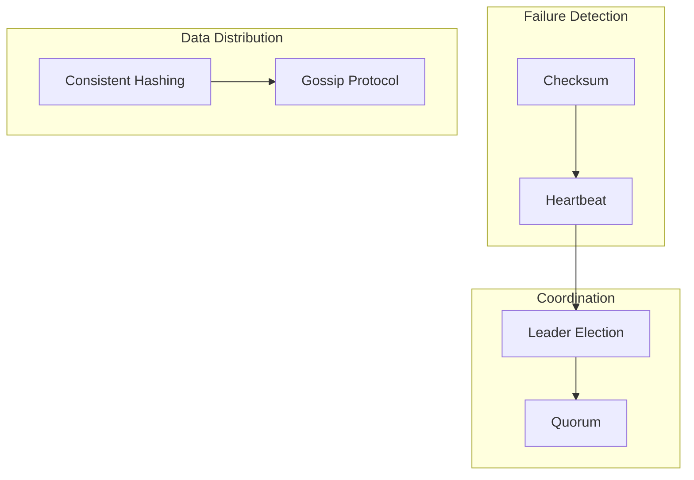

---

## 1. Consistent Hashing

### The Problem

Standard hash-based distribution breaks when nodes are added or removed.

**Naive approach:** `server = hash(key) % N`

```
N = 3 servers
hash("user:123") % 3 = 1 → Server 1
hash("user:456") % 3 = 2 → Server 2

# Add a 4th server (N = 4)
hash("user:123") % 4 = 1 → Server 1 (same)
hash("user:456") % 4 = 0 → Server 0 (MOVED!)
```

**Problem:** When N changes, most keys remap to different servers → massive data movement.

### Consistent Hashing Solution

Arrange hash space as a ring. Both servers and keys are hashed onto this ring.

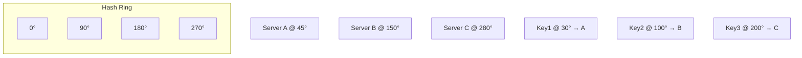

**Rule:** Key is assigned to the first server encountered moving clockwise from the key's position.

### Adding/Removing Nodes

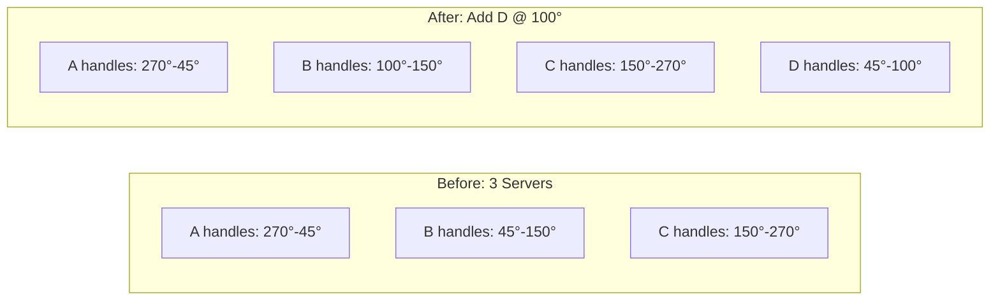

**Key insight:** Only keys between the new node and its predecessor move. All other keys stay put.

| Operation | Keys Moved | Naive Hashing |
|-----------|------------|---------------|
| Add 1 node to N | ~1/N of keys | ~(N-1)/N of keys |
| Remove 1 node from N | ~1/N of keys | ~(N-1)/N of keys |

### Virtual Nodes (Vnodes)

**Problem:** Physical nodes may be unevenly distributed on the ring, causing load imbalance.

**Solution:** Each physical node owns multiple virtual nodes spread across the ring.

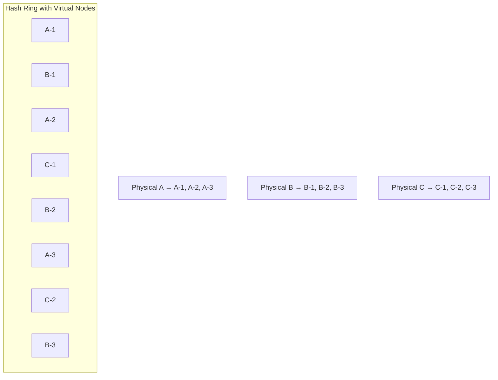

**Benefits:**
- More even key distribution
- Heterogeneous nodes: powerful nodes get more vnodes
- Smoother rebalancing when nodes join/leave

### Consistent Hashing in Practice

| System | Usage |
|--------|-------|
| **Cassandra** | Partitioning data across nodes |
| **DynamoDB** | Key distribution |
| **Memcached** | Client-side distribution |
| **Nginx** | Upstream server selection |

---

## 2. Leader Election

### Why Leaders?

Distributed systems often need a single coordinator to:
- Serialize writes to avoid conflicts
- Coordinate distributed transactions
- Make authoritative decisions

### The Challenge

How do N nodes agree on exactly one leader without central authority?

**Requirements:**
- **Safety:** At most one leader at any time
- **Liveness:** Eventually elect a leader
- **Fault tolerance:** Survive node/network failures

### Bully Algorithm

Simple algorithm where highest-ranked alive node becomes leader.

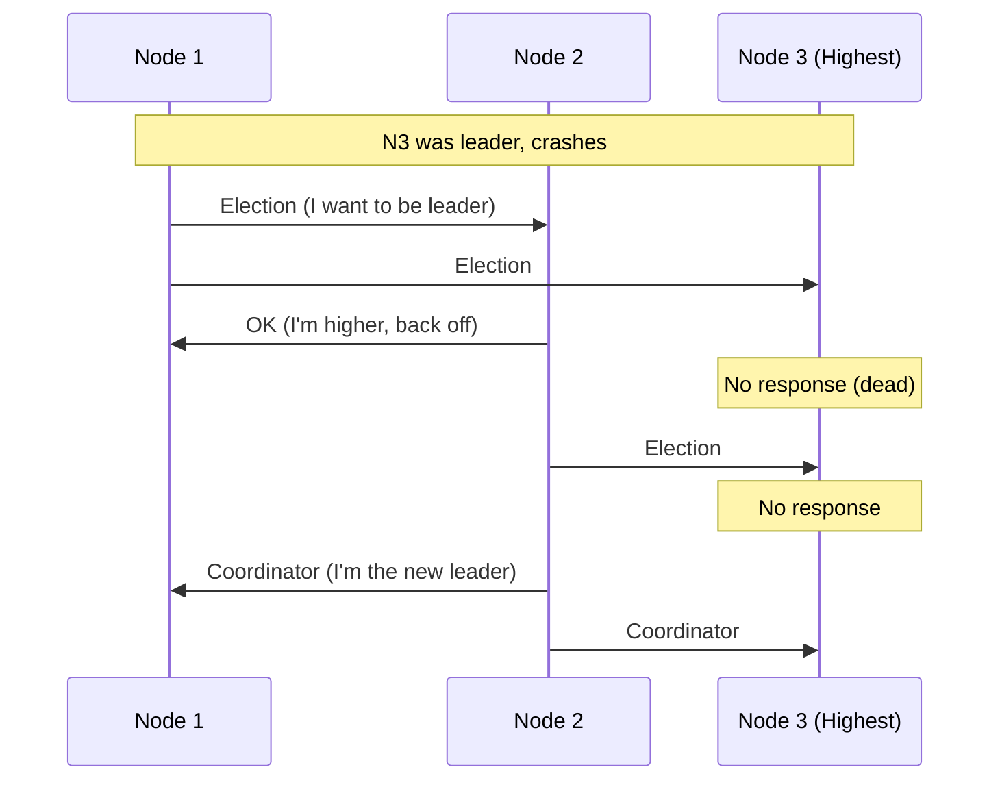

**Pros:** Simple to understand  
**Cons:** Not partition tolerant, high message complexity

### Raft Consensus

Modern, understandable consensus algorithm. Nodes in three states: Follower, Candidate, Leader.

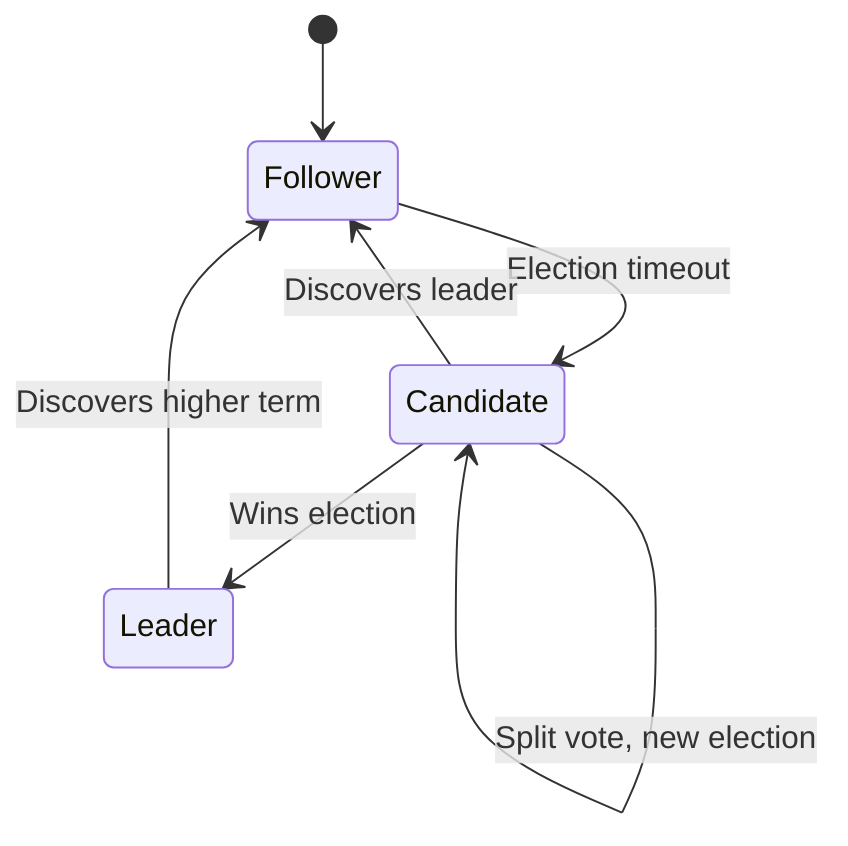

**Election process:**

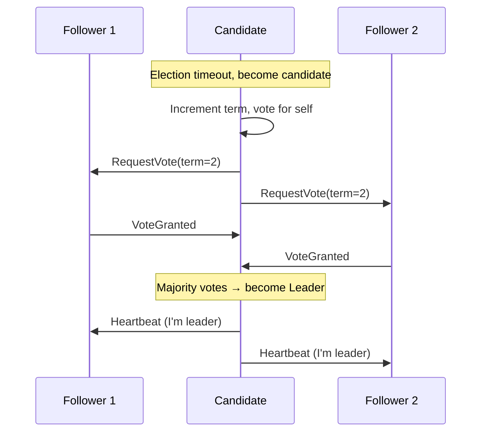

**Key mechanisms:**
- **Terms:** Logical time, incremented on elections
- **Heartbeats:** Leader sends periodic heartbeats to maintain authority
- **Randomized timeouts:** Prevent split votes

### Leader Election via External Service

Use ZooKeeper, etcd, or Consul for leader election:

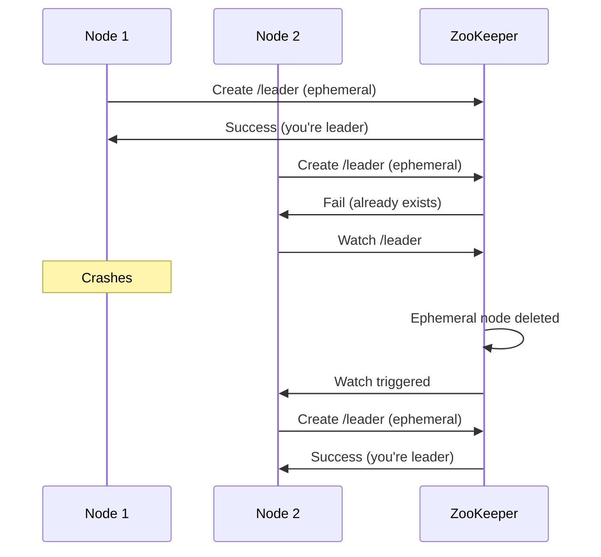

**Pros:** Battle-tested, handles edge cases  
**Cons:** Additional infrastructure dependency

---

## 3. Quorum

### The Concept

A quorum is the minimum number of nodes that must participate in an operation for it to be valid.

**Purpose:** Ensure any two operations have overlapping participants, guaranteeing they see each other's effects.

### Read/Write Quorums

For a system with N replicas:
- **W:** Write quorum (nodes that must acknowledge a write)
- **R:** Read quorum (nodes that must respond to a read)

**Consistency guarantee:** If W + R > N, reads and writes overlap → strong consistency possible

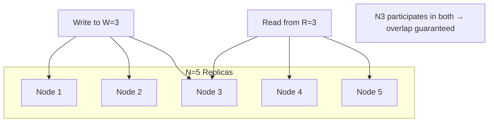

### Quorum Configurations

| W | R | Constraint | Trade-off |
|---|---|------------|-----------|
| N | 1 | W + R > N ✓ | Fast reads, slow writes |
| 1 | N | W + R > N ✓ | Fast writes, slow reads |
| (N+1)/2 | (N+1)/2 | W + R > N ✓ | Balanced (majority quorum) |

### Quorum Math

For N replicas:
- **Majority quorum:** ⌊N/2⌋ + 1
- **Tolerate F failures:** Need N ≥ 2F + 1 nodes

| Nodes (N) | Majority | Failures Tolerated |
|-----------|----------|-------------------|
| 3 | 2 | 1 |
| 5 | 3 | 2 |
| 7 | 4 | 3 |

### Sloppy Quorum

When strict quorum nodes unavailable, use any available nodes temporarily.

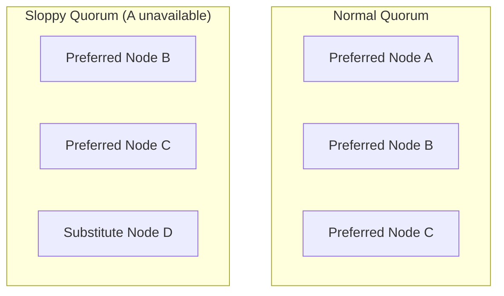

**Hinted handoff:** When A recovers, D sends data to A and deletes its copy.

**Trade-off:** Higher availability, weaker consistency guarantee.

---

## 4. Heartbeat and Failure Detection

### The Problem

In distributed systems, we can't distinguish between:
- Node crashed
- Network partitioned
- Node slow (high load)

### Heartbeat Pattern

Nodes periodically send "I'm alive" messages.

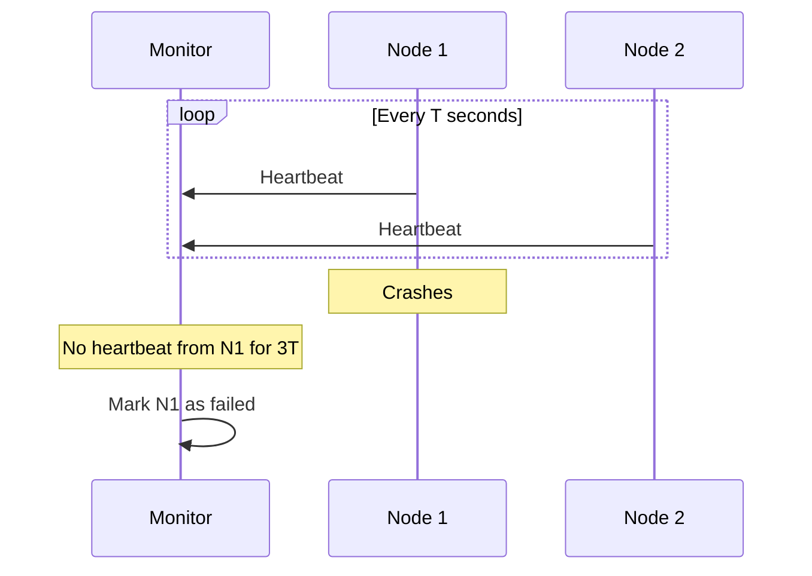

### Heartbeat Topologies

| Topology | Description | Pros | Cons |
|----------|-------------|------|------|
| **Centralized** | All nodes → central monitor | Simple | Monitor is SPOF |
| **Ring** | Each node monitors next | No SPOF | Slow detection |
| **All-to-all** | Every node monitors every other | Fast, robust | O(N²) messages |
| **Gossip** | Random subset monitoring | Scalable | Probabilistic |

### Failure Detection Parameters

| Parameter | Effect of Increase |
|-----------|-------------------|
| **Heartbeat interval** | Less network traffic, slower detection |
| **Timeout threshold** | Fewer false positives, slower detection |
| **Retry count** | More accurate, slower detection |

**Trade-off:** Speed of detection vs. false positive rate

### Phi Accrual Failure Detector

Instead of binary (alive/dead), output a suspicion level (φ).

```
φ = 0-1: Probably alive
φ = 1-2: Suspicious
φ > 2: Probably dead
```

**Adaptive:** Adjusts thresholds based on observed heartbeat arrival times.

---

## 5. Checksum and Data Integrity

### The Problem

Data can be corrupted during:
- Storage (disk errors)
- Transmission (network errors)
- Processing (software bugs)

### Checksum Basics

A checksum is a fixed-size digest computed from data. If data changes, checksum changes.

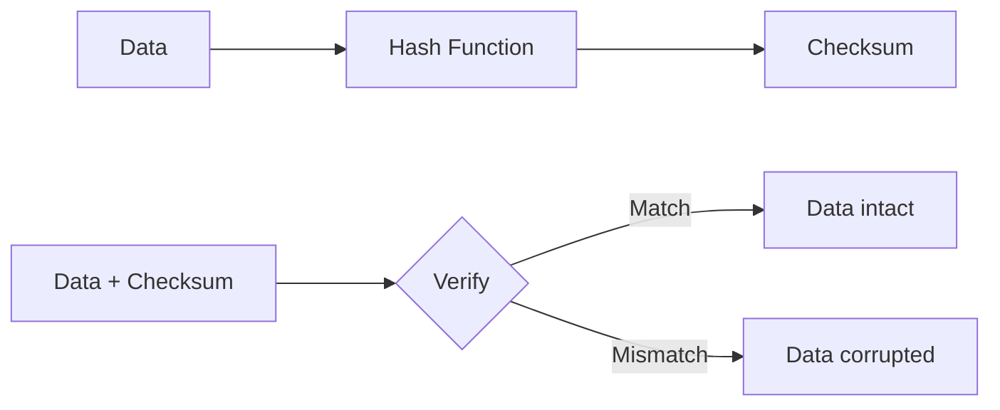

### Common Checksum Algorithms

| Algorithm | Output Size | Speed | Collision Resistance |
|-----------|-------------|-------|---------------------|
| CRC32 | 32 bits | Very fast | Low |
| MD5 | 128 bits | Fast | Broken (crypto) |
| SHA-1 | 160 bits | Fast | Weak (crypto) |
| SHA-256 | 256 bits | Moderate | Strong |
| xxHash | 64/128 bits | Very fast | Non-cryptographic |

**Guidelines:**
- **Data integrity:** CRC32 or xxHash (fast, good error detection)
- **Security/deduplication:** SHA-256 (collision resistant)

### Checksum in Distributed Systems

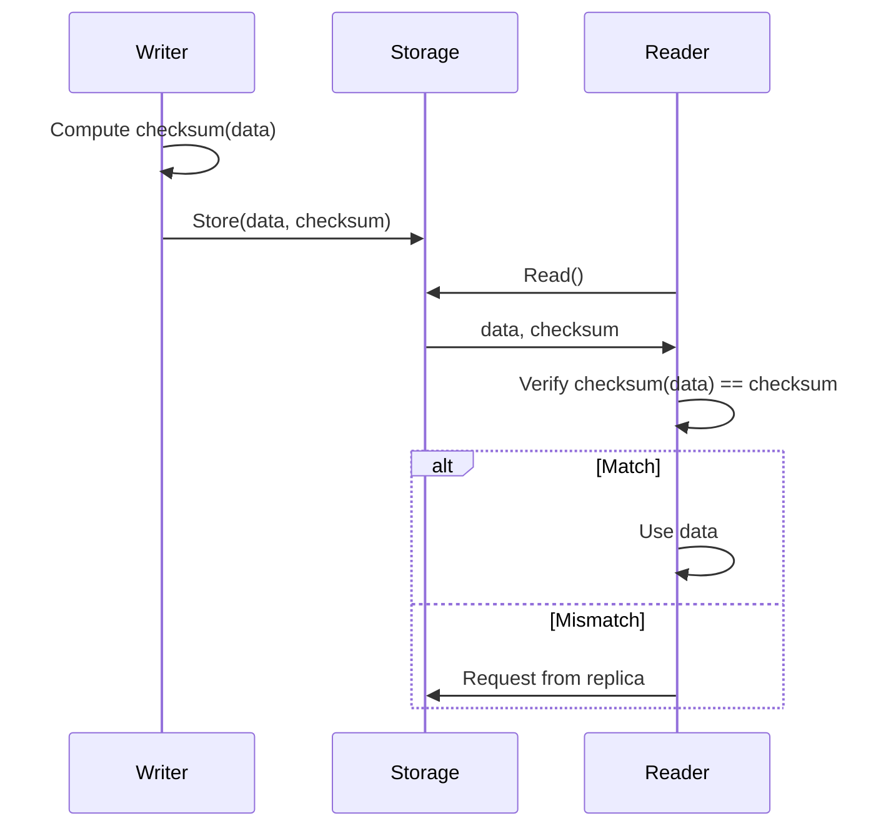

### Merkle Trees

Hierarchical checksums for efficient verification of large datasets.

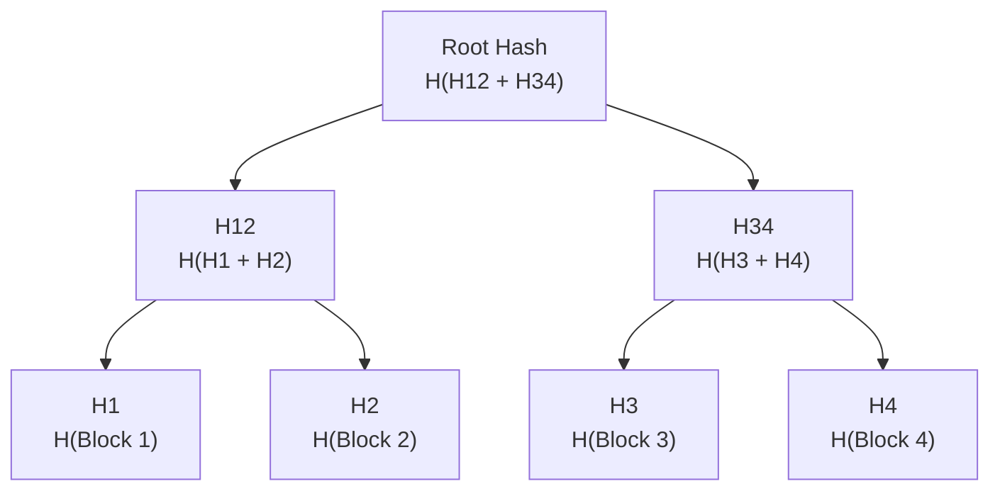

**Benefits:**
- Compare large datasets by comparing root hashes
- Identify differing blocks in O(log N) comparisons
- Used in: Git, BitTorrent, Cassandra anti-entropy

---

## 6. Gossip Protocol

### The Concept

Nodes periodically exchange information with random peers, spreading updates like rumors.

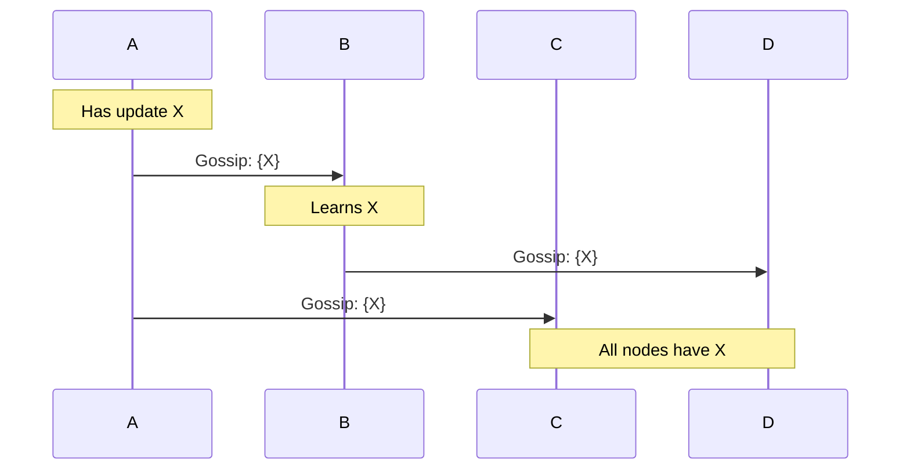

### Gossip Properties

| Property | Description |
|----------|-------------|
| **Scalable** | O(log N) rounds to reach all nodes |
| **Fault tolerant** | Works despite node failures |
| **Decentralized** | No single point of failure |
| **Eventually consistent** | All nodes converge to same state |

### Gossip Protocol Types

| Type | What's Shared | Use Case |
|------|---------------|----------|
| **Anti-entropy** | Full state comparison | Replica synchronization |
| **Rumor mongering** | Recent updates only | Event dissemination |
| **Aggregation** | Computed values (count, sum) | Cluster monitoring |

### Gossip in Practice

| System | Gossip Usage |
|--------|--------------|
| **Cassandra** | Cluster membership, failure detection |
| **Consul** | Service discovery, health checking |
| **Amazon S3** | Replica synchronization |
| **Bitcoin** | Transaction propagation |

---

## 7. The Leader-Follower Pattern

### Architecture

One leader handles writes; followers replicate and serve reads.

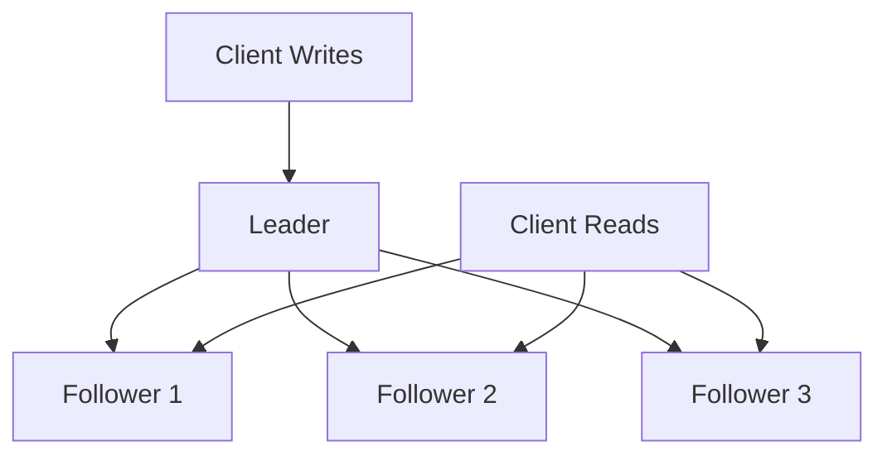

### Replication Modes

| Mode | Behavior | Consistency | Availability |
|------|----------|-------------|--------------|
| **Synchronous** | Wait for all followers | Strong | Lower |
| **Semi-synchronous** | Wait for one follower | Strong | Medium |
| **Asynchronous** | Don't wait | Eventual | Higher |

### Failover Process

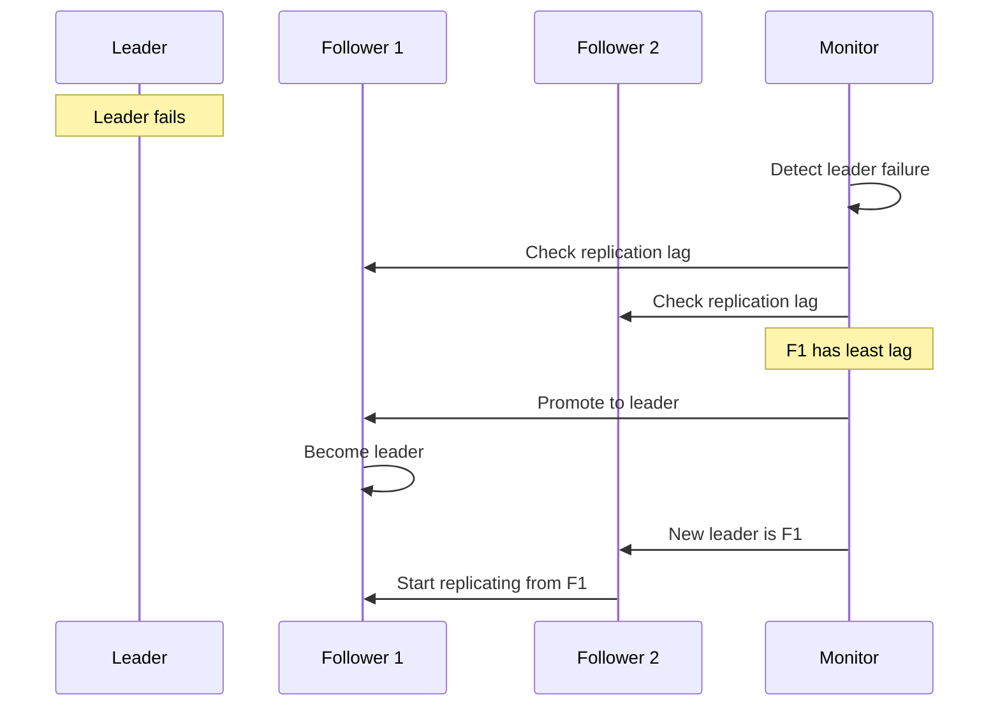

### Challenges

| Challenge | Description | Mitigation |
|-----------|-------------|------------|
| **Split brain** | Two nodes think they're leader | Fencing, quorum |
| **Replication lag** | Followers behind leader | Sync replication, read-your-writes |
| **Failover data loss** | Async writes not replicated | Semi-sync, accept loss |

---

## 8. Chapter Summary

### Key Patterns

| Pattern | Purpose | Key Trade-off |
|---------|---------|---------------|
| **Consistent Hashing** | Distribute data, minimize movement | Complexity vs stability |
| **Leader Election** | Coordinate distributed operations | Consistency vs availability |
| **Quorum** | Ensure overlap between operations | Consistency vs latency |
| **Heartbeat** | Detect node failures | Detection speed vs false positives |
| **Checksum** | Verify data integrity | CPU cost vs corruption detection |
| **Gossip** | Disseminate information | Consistency vs scalability |

### Pattern Selection Guide

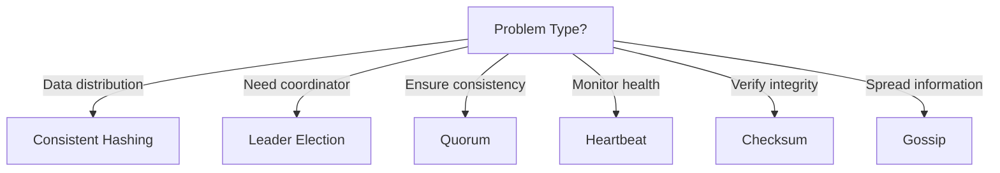

### Interview Articulation Patterns

> "How does consistent hashing help with scaling?"

"Consistent hashing maps both keys and servers to a ring. When servers are added or removed, only keys adjacent to the change point need to move—roughly K/N keys instead of most keys. Virtual nodes further improve load distribution."

> "How do you detect failures in a distributed system?"

"Typically through heartbeats with timeouts. The trade-off is between detection speed and false positives. Shorter timeouts detect failures faster but may incorrectly mark slow nodes as failed. Production systems often use adaptive failure detectors like Phi Accrual."

> "Why use quorums?"

"Quorums ensure any two operations (like a write and subsequent read) have overlapping participants. With W + R > N, at least one node participates in both, guaranteeing the read sees the write. We tune W and R based on whether we optimize for read or write latency."

---

## Navigation

**Previous:** [04 — Caching & CDN](./04-CACHING-CDN.md)  
**Next:** [06 — Consistency & Consensus](./06-CONSISTENCY-CONSENSUS.md)  
**Index:** [00 — Handbook Index](./00-INDEX.md)
