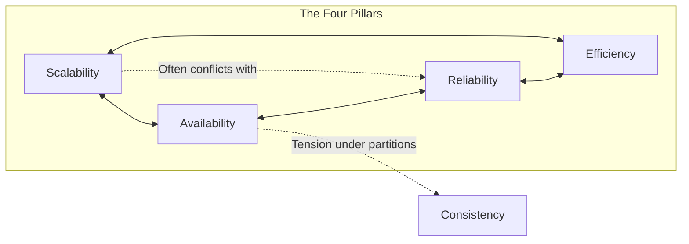
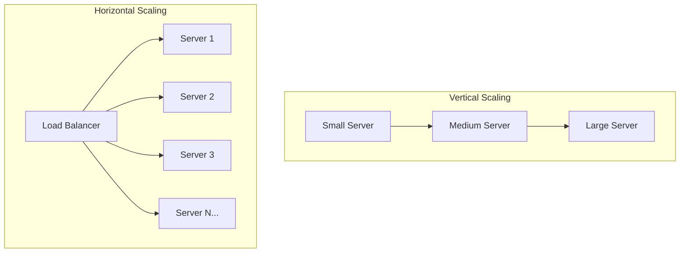
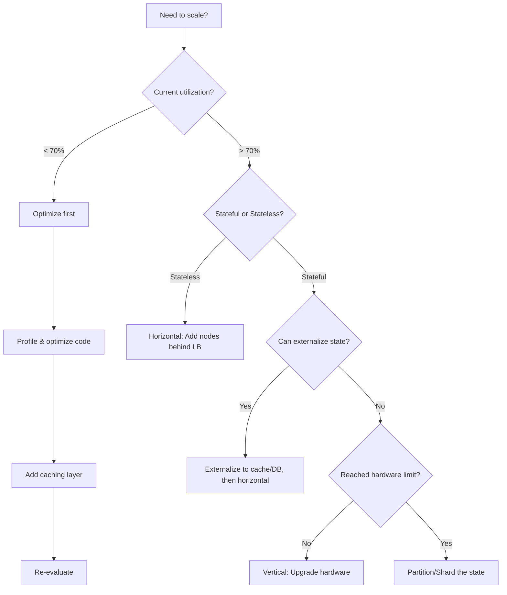
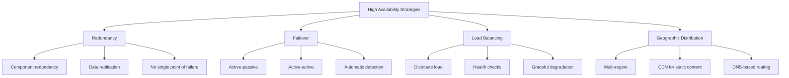
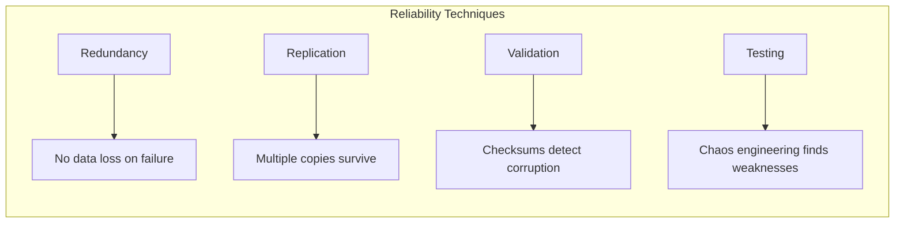
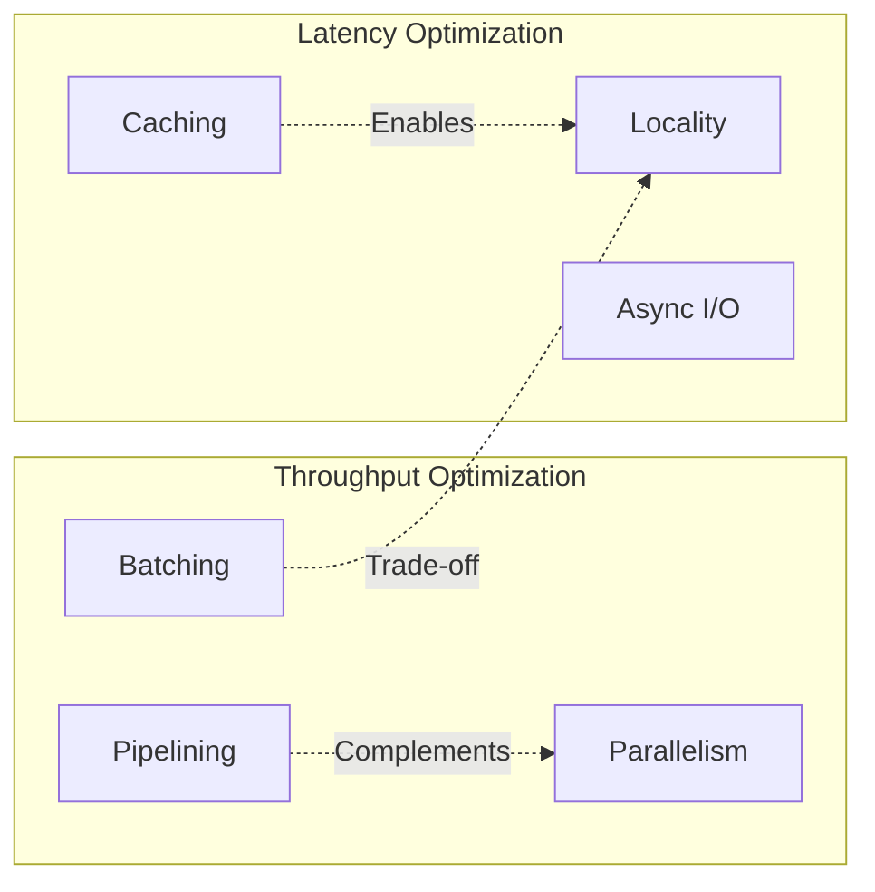
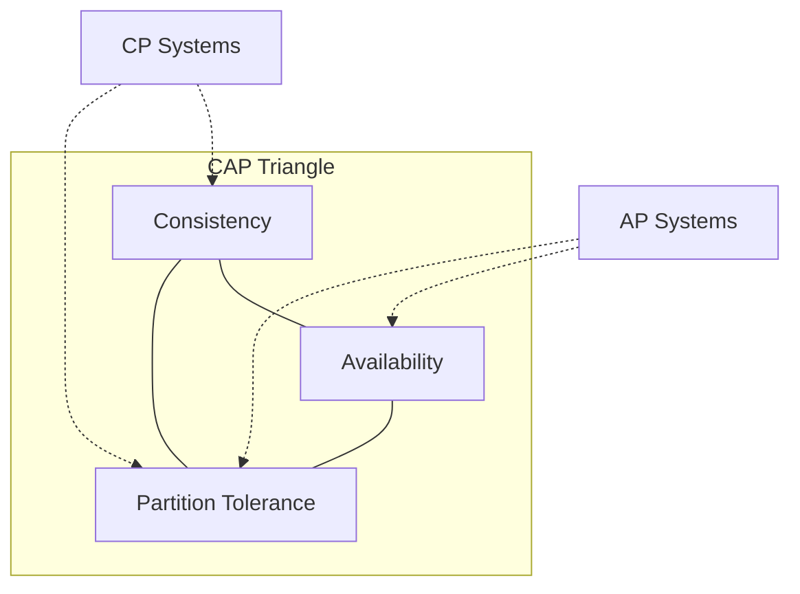
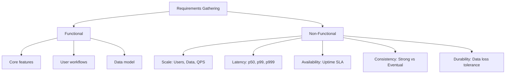

# 01 — Foundational Concepts

> The vocabulary and mental models that recur throughout distributed systems design.

**Prerequisites:** None  
**Builds toward:** All other modules  
**Estimated study time:** 2-3 hours

---

## Chapter Overview

This module establishes the core properties we optimize for in distributed systems. Every design decision is ultimately a trade-off among these properties.



---

## 1. Scalability

### Definition
Scalability is the capability of a system to handle a growing amount of work by adding resources. A scalable system can accommodate growth—in users, data, or transactions—without degradation in performance.

### The Two Dimensions

| Dimension | Mechanism | When to Use | Limits |
|-----------|-----------|-------------|--------|
| **Vertical** | Add CPU, RAM, storage to existing machine | Quick fix, simpler architecture | Hardware ceiling, single point of failure |
| **Horizontal** | Add more machines | Sustained growth, fault tolerance | Coordination complexity, data consistency |



### Scaling Decision Framework



### Interview Prompt
> "When would you choose vertical over horizontal scaling?"

**Strong answer pattern:**
- Vertical when: development speed matters, state is hard to distribute, workload is predictable
- Horizontal when: need fault tolerance, expect unbounded growth, workload is parallelizable
- Always mention: "Vertical has a ceiling; horizontal requires distributed systems complexity"

---

## 2. Availability

### Definition
Availability is the proportion of time a system is operational and accessible. Measured as a percentage of uptime over a period.

### The Nines of Availability

| Availability | Downtime/Year | Downtime/Month | Typical Use Case |
|--------------|---------------|----------------|------------------|
| 99% (two 9s) | 3.65 days | 7.3 hours | Internal tools |
| 99.9% (three 9s) | 8.76 hours | 43.8 minutes | Business applications |
| 99.99% (four 9s) | 52.6 minutes | 4.38 minutes | E-commerce, SaaS |
| 99.999% (five 9s) | 5.26 minutes | 26.3 seconds | Financial systems, critical infra |

### Availability vs Reliability

| Aspect | Availability | Reliability |
|--------|--------------|-------------|
| **Measures** | Is the system accessible? | Does it produce correct results? |
| **Scope** | Uptime percentage | Correctness over time |
| **Can have** | High availability + low reliability | High reliability + low availability |

**Key insight:** A system can be highly available (always responding) but unreliable (sometimes returning wrong data). Reliability implies availability, but not vice versa.

### Strategies for High Availability



### Single Points of Failure (SPOF)

**Invariant:** Any component whose failure causes system-wide failure is a SPOF and must be eliminated for high availability.

Common SPOFs and mitigations:

| SPOF | Mitigation |
|------|------------|
| Single database | Primary-replica replication |
| Single load balancer | Active-passive LB pair |
| Single data center | Multi-region deployment |
| Single DNS provider | Multiple DNS providers |

---

## 3. Reliability

### Definition
Reliability is the probability that a system will perform its intended function without failure over a specified period under stated conditions.

### Reliability vs Fault Tolerance

| Concept | Focus | Measurement |
|---------|-------|-------------|
| **Reliability** | Prevent failures | MTBF (Mean Time Between Failures) |
| **Fault Tolerance** | Survive failures | Recovery time, data integrity |

### Building Reliable Systems



**Example:** Amazon's shopping cart
- Requirement: Never lose cart data due to server failure
- Solution: Replicate cart state across multiple servers
- Trade-off: Pay storage and consistency costs for reliability

---

## 4. Efficiency

### Definition
Efficiency measures how well a system uses resources to perform its function. The two primary metrics are:

| Metric | Definition | Unit |
|--------|------------|------|
| **Latency** | Time to complete a single operation | ms, μs |
| **Throughput** | Operations completed per time unit | req/s, MB/s |

### Latency vs Throughput Trade-offs

These metrics often conflict:
- **Batching** increases throughput but adds latency (wait for batch to fill)
- **Caching** reduces latency but adds memory cost
- **Compression** reduces bandwidth but adds CPU latency



### Latency Numbers Every Engineer Should Know

| Operation | Latency |
|-----------|---------|
| L1 cache reference | 0.5 ns |
| L2 cache reference | 7 ns |
| Main memory reference | 100 ns |
| SSD random read | 150 μs |
| HDD seek | 10 ms |
| Same datacenter round trip | 0.5 ms |
| Cross-region round trip | 50-150 ms |

**Rule of thumb:** Each layer of indirection adds ~10x latency. Design to minimize hops for latency-critical paths.

---

## 5. CAP Theorem — Introduction

> Detailed treatment in [06-Consistency & Consensus](./06-CONSISTENCY-CONSENSUS.md)

### The Theorem
In a distributed system, during a **network partition**, you must choose between:

| Property | Definition |
|----------|------------|
| **Consistency (C)** | All nodes see the same data at the same time |
| **Availability (A)** | Every request receives a response |
| **Partition Tolerance (P)** | System continues despite network failures |

**Key insight:** Since network partitions are inevitable, the real choice is **C vs A during partitions**.



### System Classification

| Type | During Partition | Examples |
|------|------------------|----------|
| **CP** | Sacrifice availability for consistency | HBase, MongoDB (default), Redis Cluster |
| **AP** | Sacrifice consistency for availability | Cassandra, DynamoDB, CouchDB |

---

## 6. PACELC Theorem — Introduction

> Detailed treatment in [06-Consistency & Consensus](./06-CONSISTENCY-CONSENSUS.md)

### Beyond CAP
CAP only addresses partition scenarios. PACELC adds: **Even without partitions, there's a trade-off between Latency and Consistency.**

```
If Partition (P):
    Choose Availability (A) or Consistency (C)
Else (E):
    Choose Latency (L) or Consistency (C)
```

### System Classification

| System | During Partition | Normal Operation |
|--------|------------------|------------------|
| **PA/EL** | Availability | Latency |
| **PC/EC** | Consistency | Consistency |
| **PA/EC** | Availability | Consistency |

**Examples:**
- Dynamo, Cassandra: PA/EL — optimize for availability and speed
- HBase, BigTable: PC/EC — always prefer consistency
- MongoDB (default): PA/EC — available during partition, consistent otherwise

---

## 7. Serviceability and Manageability

### Definition
How easy is it to operate, maintain, diagnose, and update the system?

### Key Considerations

| Aspect | Questions to Ask |
|--------|------------------|
| **Observability** | Can we see what's happening inside? (logs, metrics, traces) |
| **Debuggability** | Can we diagnose problems quickly? |
| **Deployability** | Can we update without downtime? |
| **Configurability** | Can we change behavior without code changes? |

### Operational Complexity Trade-offs

| Choice | Simpler to Build | Simpler to Operate |
|--------|------------------|-------------------|
| Monolith vs Microservices | Monolith | Depends on scale |
| Single DB vs Sharded | Single DB | Single DB (until it doesn't scale) |
| Custom vs Managed Service | Managed | Managed |

---

## 8. Functional vs Non-Functional Requirements

### Definitions

| Type | Definition | Examples |
|------|------------|----------|
| **Functional** | What the system should do | "Users can post messages", "System sends notifications" |
| **Non-Functional** | How the system should behave | "99.9% availability", "< 100ms p99 latency" |

### Interview Framework

When given a design problem, explicitly identify both:



### Common Non-Functional Requirements

| Requirement | Typical Values | Affects |
|-------------|----------------|---------|
| **Throughput** | 1K-1M req/s | Scaling strategy |
| **Latency** | 50-500ms p99 | Caching, architecture |
| **Availability** | 99.9-99.999% | Redundancy, failover |
| **Durability** | No data loss | Replication, backups |
| **Consistency** | Strong/Eventual | Database choice, complexity |

---

## 9. Back-of-Envelope Estimation

### Why It Matters
Estimation demonstrates you can reason about scale and make informed architecture decisions. It's not about exact numbers—it's about order of magnitude.

### Core Formulas

**Requests per second:**
```
Daily Active Users (DAU) × Actions per User per Day
─────────────────────────────────────────────────────
              Seconds per Day (86,400)
```

**Storage:**
```
Users × Data per User × Retention Period
```

**Bandwidth:**
```
Requests per Second × Average Request Size
```

### Powers of 2 Reference

| Power | Value | Approximate |
|-------|-------|-------------|
| 2^10 | 1,024 | ~1 Thousand (KB) |
| 2^20 | 1,048,576 | ~1 Million (MB) |
| 2^30 | 1,073,741,824 | ~1 Billion (GB) |
| 2^40 | | ~1 Trillion (TB) |

### Time Conversions

| Period | Seconds |
|--------|---------|
| 1 minute | 60 |
| 1 hour | 3,600 |
| 1 day | 86,400 (~100K) |
| 1 month | 2.6M (~2.5M) |
| 1 year | 31.5M (~30M) |

### Example: Social Media Platform

**Given:**
- 100M DAU
- 10 posts per user per day
- 1 KB per post

**Calculate:**
```
Posts per day: 100M × 10 = 1B posts/day
Posts per second: 1B / 86,400 ≈ 11,500 posts/sec

Storage per day: 1B × 1KB = 1TB/day
Storage per year: 1TB × 365 ≈ 365TB/year
```

---

## 10. Chapter Summary

### Key Concepts

| Concept | One-Line Definition |
|---------|---------------------|
| Scalability | Ability to handle growth by adding resources |
| Availability | Percentage of time system is operational |
| Reliability | Probability of correct operation over time |
| Efficiency | Resource utilization (latency + throughput) |
| CAP | During partition: choose consistency or availability |
| PACELC | Always: consistency vs latency trade-off |

### Interview Checklist

- [ ] Can explain vertical vs horizontal scaling trade-offs
- [ ] Know the "nines" of availability and their implications
- [ ] Distinguish reliability from availability with examples
- [ ] Perform back-of-envelope calculations fluently
- [ ] Articulate CAP/PACELC implications for design choices

---

## Navigation

**Next:** [02 — Networking & Communication](./02-NETWORKING-COMMUNICATION.md)  
**Index:** [00 — Handbook Index](./00-INDEX.md)
