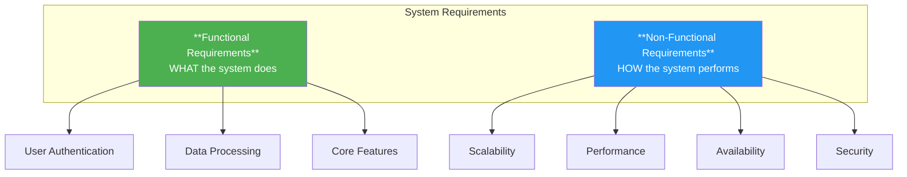
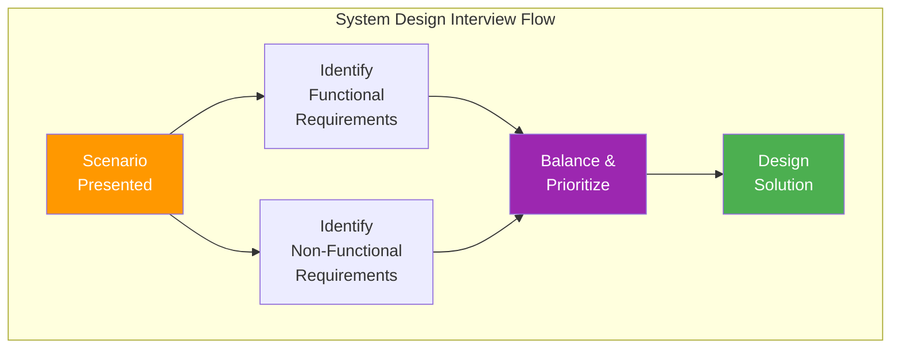
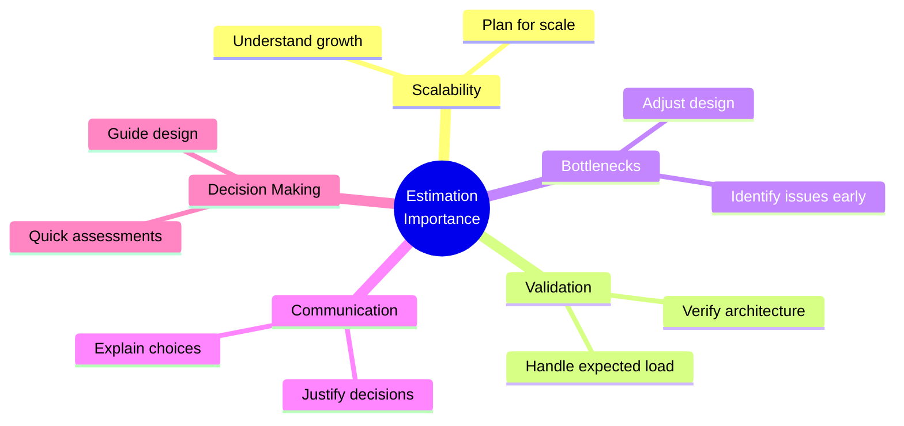
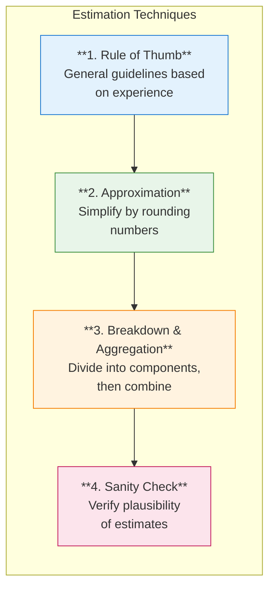
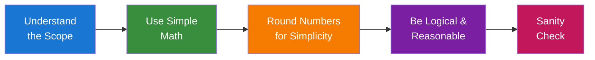
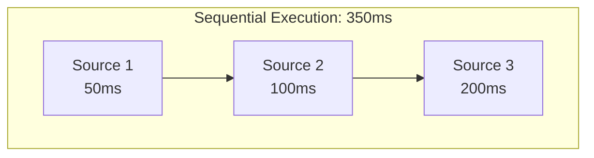
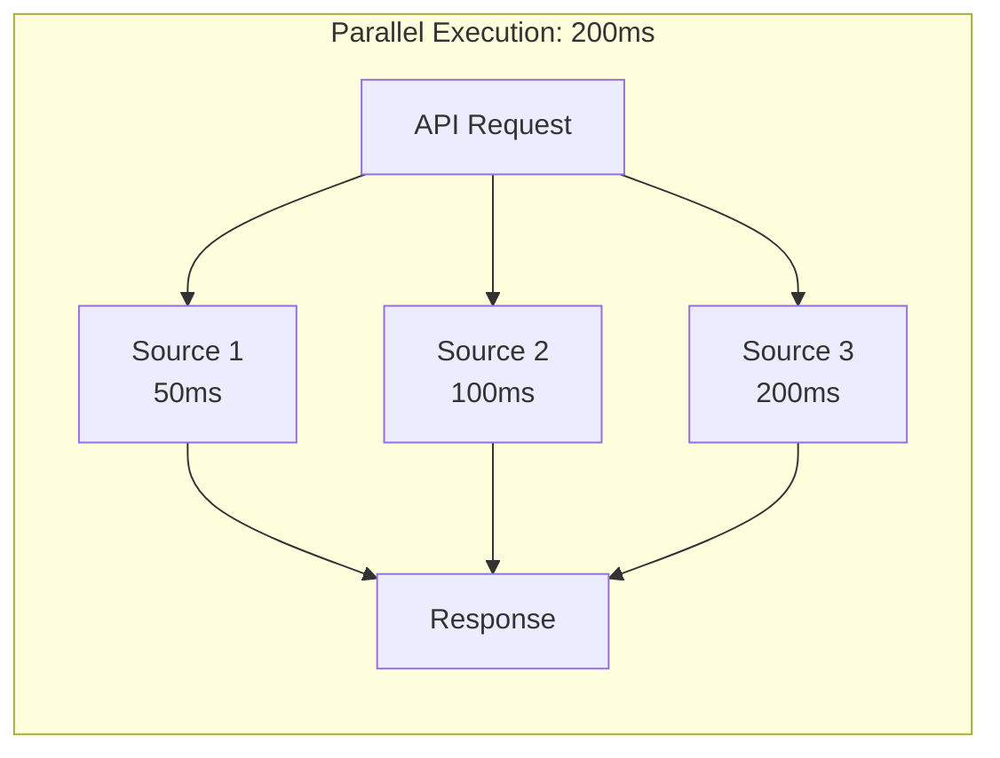
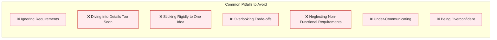
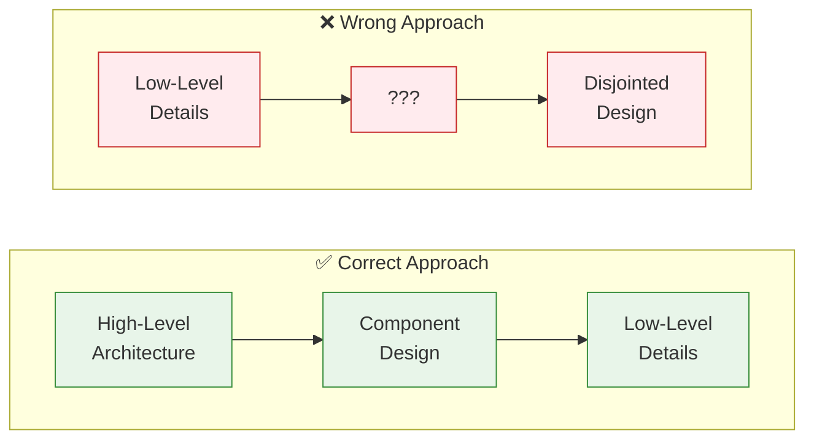
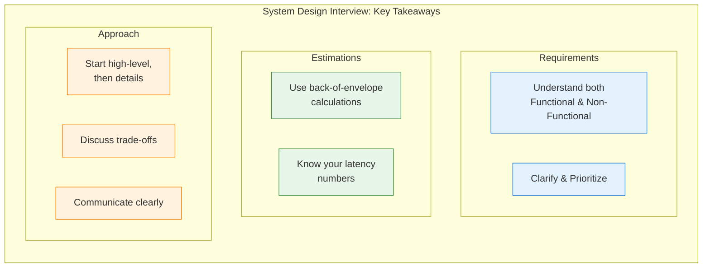

# System Design Interview: Introduction Guide

---

## 1. Functional vs. Non-Functional Requirements

In the context of system design interviews, understanding functional and non-functional requirements is key to showcasing your ability to design a system that meets both the specific actions it should perform and how it should perform them.



### Functional Requirements

**Definition:** These are the requirements that define what a system is supposed to do. They describe the various functions that the system must perform.

**Examples:**
- A user authentication system must validate user credentials and provide access levels.
- An e-commerce website should allow users to browse products, add them to a cart, and complete purchases.
- A report generation system must collect data, process it, and generate timely reports.

#### Importance in Interviews

| Aspect | Why It Matters |
|--------|----------------|
| **Demonstrates Understanding of Core Features** | Shows you know what the system needs to do to satisfy its primary objectives |
| **Basis for System Design** | Functional requirements often form the backbone of your system design |

### Non-Functional Requirements

**Definition:** These requirements describe how the system performs a task, rather than what tasks it performs. They are related to the quality attributes of the system.

**Examples:**

| Requirement | Description |
|-------------|-------------|
| **Scalability** | The system should handle growth in users or data |
| **Performance** | The system should process transactions within a specified time |
| **Availability** | The system should be up and running a defined percentage of time |
| **Security** | The system must protect sensitive data and resist unauthorized access |

#### Importance in Interviews

| Aspect | Why It Matters |
|--------|----------------|
| **Showcases Depth of Design Knowledge** | Demonstrates your understanding of the broader implications of system design |
| **Highlights System Robustness and Quality** | Reflects how well your system design can meet real-world constraints and user expectations |

### Integrating Both in Interviews



- **Scenario-Based Discussions:** When presented with a scenario, identify both the functional (what the system should do) and non-functional (how the system should do it) requirements.
- **Balancing Act:** Exhibit your ability to balance both types of requirements, showing that you can design a system that not only meets its functional goals but also performs effectively, securely, and reliably.

### In System Design Interviews

When you're in a system design interview, here's how you can handle these requirements:

1. **Clarify Requirements:** Start by asking questions to understand both functional and non-functional requirements. Interviewers often leave these vague to see if you'll probe for more details.

2. **Prioritize:** Not all requirements are equally important. Identify which ones are critical for the system's success.

3. **Trade-offs:** Discuss trade-offs related to different architectural decisions, especially concerning non-functional requirements. For example, a system highly optimized for read operations might have slower write operations.

4. **Use Real-World Examples:** If you can, relate your points to real-world systems or your past experiences. This shows practical understanding.

5. **Balance:** Ensure you're not focusing too much on one type of requirement over the other. A well-rounded approach is often necessary.

> **Remember:** In system design interviews, interviewers are often interested in seeing how you think and approach problems, not just your final solution. Demonstrating a clear understanding of both functional and non-functional requirements is key to showing your comprehensive knowledge in system design.

---

## 2. Back-of-the-Envelope Estimations

Back of the envelope estimations in system design interviews are like quick, rough calculations you might do on a napkin during lunch - they're not detailed or exact, but give you a good ballpark figure. These rough calculations help you quickly assess the feasibility of a proposed solution, estimate its performance, and identify potential bottlenecks.

### Purpose

Back-of-the-envelope estimation is a technique used to quickly approximate values and make rough calculations using simple arithmetic and basic assumptions. This method is particularly useful in system design interviews, where interviewers expect candidates to make informed decisions and trade-offs based on rough estimates.

### Why is Estimation Important in System Design Interviews?

During a system design interview, you'll be asked to design a scalable and reliable system based on a set of requirements. Your ability to make quick estimations is essential for several reasons:



- **Indicates System Scalability:** Highlights your understanding of how the system can grow or adapt.
- **Validate Proposed Solutions:** Estimation helps you ensure that your proposed architecture meets the requirements and can handle the expected load.
- **Identify Bottlenecks:** Quick calculations help you identify potential performance bottlenecks and make necessary adjustments to your design.
- **Demonstrate Your Thought Process:** Estimation showcases your ability to make informed decisions and trade-offs based on a set of assumptions and constraints.
- **Communicate Effectively:** Providing estimates helps you effectively communicate your design choices and their implications to the interviewer.
- **Quick Decision Making:** Reflects your ability to make swift estimations to guide your design decisions.

### Estimation Techniques



#### 1. Rule of Thumb
Rules of thumb are general guidelines or principles that can be applied to make quick and reasonably accurate estimations. They are based on experience and observation, and while not always precise, they can provide valuable insights in the absence of detailed information. For example, estimating that a user will generate 1 MB of data per day on a social media platform can serve as a starting point for capacity planning.

#### 2. Approximation
Approximation involves simplifying complex calculations by rounding numbers or using easier-to-compute values. This technique can help derive rough estimates quickly and with minimal effort. For instance, assuming 1,000 users instead of 1,024 when estimating storage requirements can simplify calculations and still provide a reasonable approximation.

#### 3. Breakdown and Aggregation
Breaking down a problem into smaller components and estimating each separately can make it easier to derive an overall estimate. This technique involves identifying the key components of a system, estimating their individual requirements, and then aggregating these estimates to determine the total system requirements.

#### 4. Sanity Check
A sanity check is a quick evaluation of an estimate to ensure its plausibility and reasonableness. This step helps identify potential errors or oversights in the estimation process and can lead to more accurate and reliable results.

### Types of Estimations

| Type | Description |
|------|-------------|
| **Load Estimation** | Predict the expected number of requests per second, data volume, or user traffic |
| **Storage Estimation** | Estimate the amount of storage required to handle the data generated |
| **Bandwidth Estimation** | Determine the network bandwidth needed to support expected traffic |
| **Latency Estimation** | Predict the response time and latency based on architecture |
| **Resource Estimation** | Estimate servers, CPUs, or memory required to handle load |

### Process



1. **Understand the Scope:** Clarify the scale of the problem - how many users, how much data, etc.
2. **Use Simple Math:** Utilize basic arithmetic to estimate the scale of data and resources.
3. **Round Numbers for Simplicity:** Use round numbers to make calculations easier and faster.
4. **Be Logical and Reasonable:** Ensure your estimations make sense given the context of the problem.

### Practical Examples

#### 1. Load Estimation

Suppose you're asked to design a social media platform with 100 million daily active users (DAU) and an average of 10 posts per user per day:

```
100 million DAU × 10 posts/user = 1 billion posts/day
1 billion posts/day ÷ 86,400 seconds/day ≈ 11,574 requests/second
```

#### 2. Storage Estimation

Consider a photo-sharing app with 500 million users and an average of 2 photos uploaded per user per day. Each photo has an average size of 2 MB:

```
500 million users × 2 photos/user × 2 MB/photo = 2,000,000,000 MB/day
                                                = 2 PB/day
```

#### 3. Bandwidth Estimation

For a video streaming service with 10 million users streaming 1080p videos at 4 Mbps:

```
10 million users × 4 Mbps = 40,000,000 Mbps = 40 Tbps
```

#### 4. Latency Estimation

Suppose you're designing an API that fetches data from multiple sources with average latencies of 50 ms, 100 ms, and 200 ms:

```
Sequential: 50 ms + 100 ms + 200 ms = 350 ms
Parallel:   max(50 ms, 100 ms, 200 ms) = 200 ms
```





#### 5. Resource Estimation

Imagine a web application receiving 10,000 requests per second, with each request requiring 10 ms of CPU time:

```
10,000 requests/second × 10 ms/request = 100,000 ms/second
100,000 ms/second ÷ 1,000 ms/core = 100 cores needed
```

### Latency Reference Table

Use these common latency values as assumptions in your estimations:

| Operation | Time |
|-----------|------|
| L1 cache reference | 0.5 ns |
| Branch mispredict | 5 ns |
| L2 cache reference | 7 ns |
| Mutex lock/unlock | 100 ns |
| Main memory reference | 100 ns |
| Compress 1K bytes with Zippy | 10 μs |
| Send 2K bytes over 1 Gbps network | 20 μs |
| Read 1 MB sequentially from memory | 250 μs |
| Round trip within same datacenter | 500 μs |
| Disk seek | 10 ms |
| Read 1 MB sequentially from network | 10 ms |
| Read 1 MB sequentially from disk | 30 ms |
| Send packet CA → Netherlands → CA | 150 ms |

### Tips for Successful Estimation

- **Break down the problem:** When faced with a complex system design problem, break it down into smaller, more manageable components.
- **Use reasonable assumptions:** Make reasonable assumptions based on your knowledge of similar systems, industry standards, or user behavior patterns. Clearly state your assumptions to the interviewer.
- **Leverage your experience:** Drawing from your past experiences can be beneficial when estimating system requirements.
- **Be prepared to adjust:** As you progress through the interview, be prepared to adapt and revise your estimations based on new information.
- **Ask clarifying questions:** Don't hesitate to ask the interviewer clarifying questions if you're unsure about a requirement or assumption.
- **Communicate your thought process:** Explain how you arrived at your estimations and the assumptions you made along the way.

---

## 3. Things to Avoid During System Design Interviews

In a system design interview, while it's important to showcase your skills and knowledge, it's equally crucial to be aware of common pitfalls. Avoiding these mistakes can greatly improve your chances of success.



### 1. Don't Ignore the Requirements

- **Neglecting to Clarify:** Failing to ask questions or clarify requirements can lead to a design that misses the mark.
- **Oversimplifying the Problem:** Don't oversimplify the problem or ignore the complexities involved.

### 2. Don't Dive into Details Too Soon

- **Rushing into Low-Level Details:** Starting with low-level details before establishing the high-level design can make your solution seem disjointed.
- **Losing Sight of the Big Picture:** Focus first on the overall architecture and how different components interact.



### 3. Don't Stick Rigidly to One Idea

- **Being Inflexible:** Being too rigid with your initial idea can prevent you from considering better alternatives.
- **Ignoring Interviewer's Hints:** The interviewer might provide hints or feedback; not adapting your design accordingly can be seen as a lack of collaboration or adaptability.

### 4. Don't Overlook Trade-offs

- **Ignoring Trade-offs:** Every design decision has trade-offs. Not discussing these can show a lack of depth in your understanding.
- **Failing to Justify Decisions:** Be prepared to explain why you chose one approach over another.

### 5. Don't Neglect Non-Functional Requirements

- **Overlooking Scalability, Reliability, etc.:** Focusing solely on functional aspects and neglecting non-functional requirements like scalability and reliability is a common mistake.
- **Not Considering System Constraints:** Real-world constraints such as cost, time, and existing technology stack should be considered.

### 6. Don't Under-Communicate

- **Poor Explanation:** Failing to clearly articulate your thoughts can leave interviewers unsure about your understanding and approach.
- **Not Engaging the Interviewer:** This is a dialogue, not a monologue. Engage with the interviewer, ask questions, and be receptive to feedback.

### 7. Don't Be Overconfident or Arrogant

- **Overconfidence:** Being overly confident can lead to dismissing valuable feedback or overlooking key aspects of the problem.
- **Not Acknowledging What You Don't Know:** It's okay not to know everything. Being open about areas you are unsure of is better than providing incorrect information.

---

## Summary



> **Final Thought:** A system design interview is not just about getting the right answer. It's about demonstrating your problem-solving approach, your ability to adapt, and how you communicate and collaborate. Mastering requirements gathering, estimation techniques, and avoiding common pitfalls will help you present yourself as a well-rounded candidate capable of handling the complexities of real-world system design.
