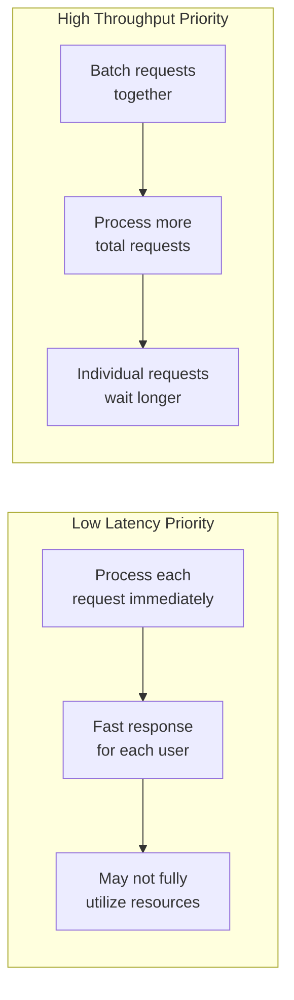
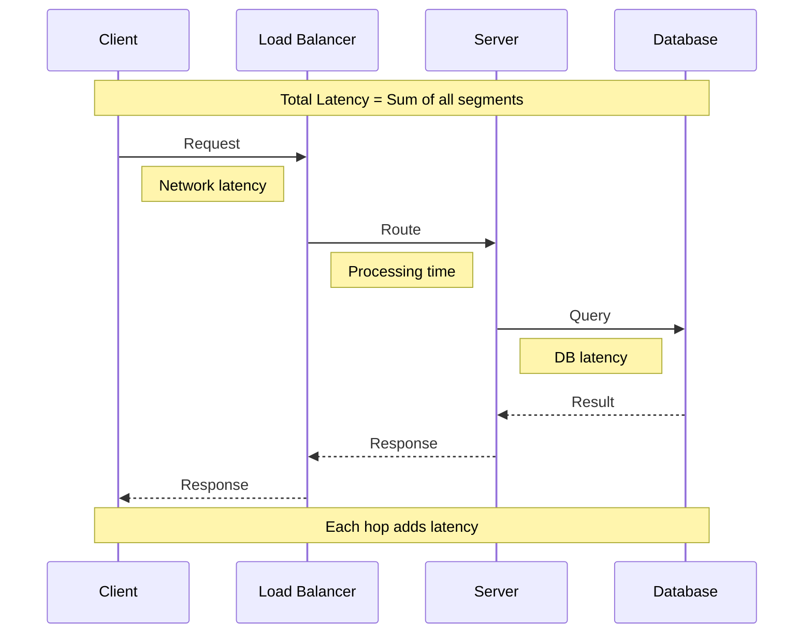
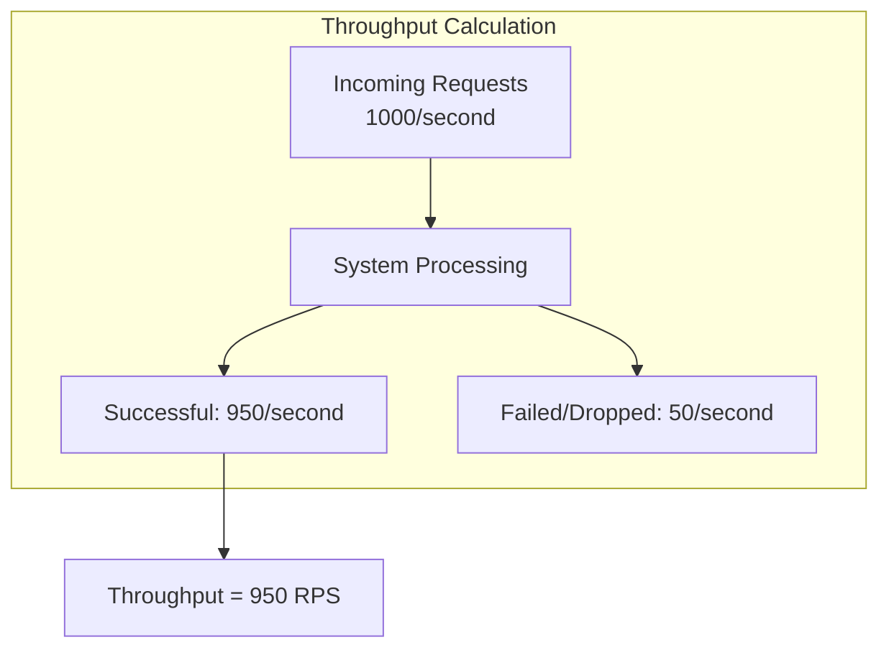
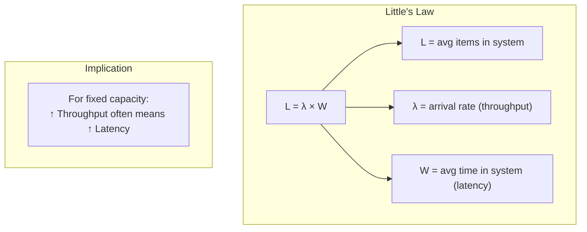
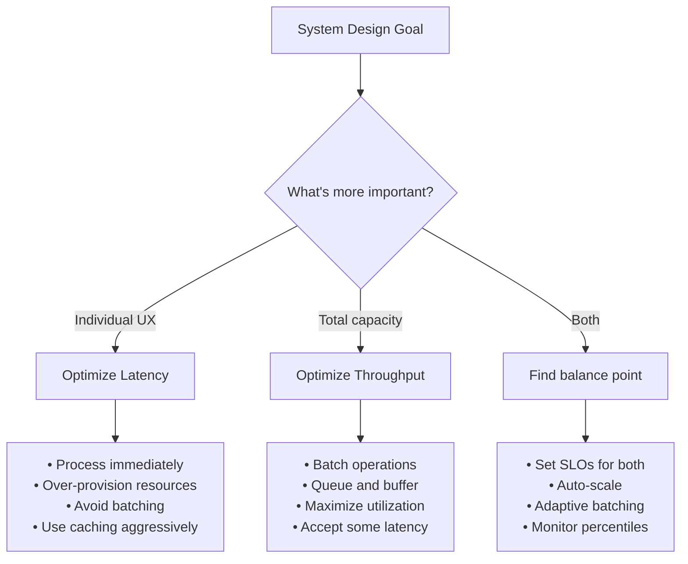
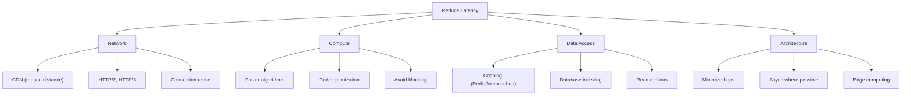
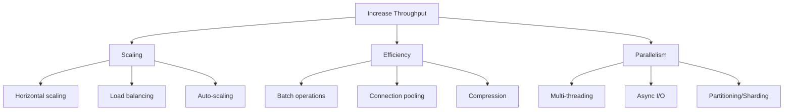
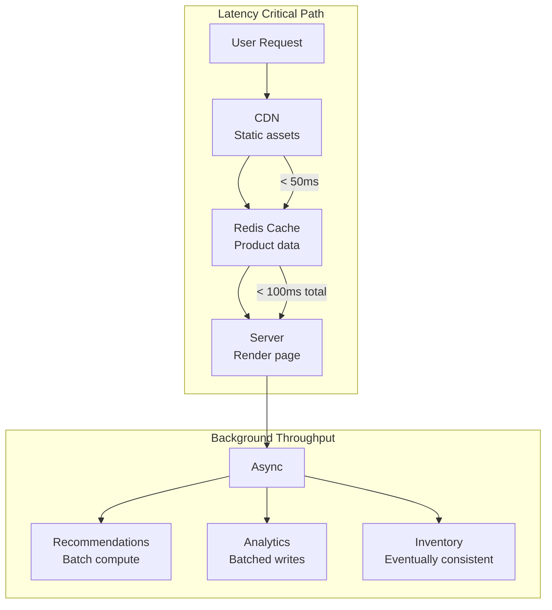
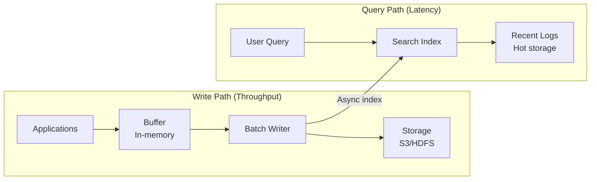

# 03 - Latency vs Throughput

## Performance Trade-Offs in System Design

---

## Concept Overview

**What Are They?**

- **Latency**: How long it takes for a single request to complete (the delay)
- **Throughput**: How many requests the system can handle per unit time (the volume)

**Why They Often Conflict**

Optimizing for one frequently impacts the other. Understanding this tension is fundamental to system design.

```
┌────────────────────────────────────────────────────────────────────────┐
│                                                                        │
│          LATENCY                             vs        THROUGHPUT      │
│    (Time per request)                           (Requests per second)  │
│                                                                        │
│    "How fast is each request?"               "How many can we handle?" │
│                                                                        │
│    ✓ Better user experience                  ✓ Better resource use     │
│    ✓ Real-time responsiveness                ✓ Higher capacity         │
│    ✗ May underutilize resources              ✗ May increase wait time  │
│                                                                        │
└────────────────────────────────────────────────────────────────────────┘
```

---

## Mental Models

### Latency: The Drive-Thru Experience

Latency is like the time you wait at a fast-food drive-thru to get your order. From the moment you order to when you receive your food—that's the latency. You want this to be as short as possible.

### Throughput: The Restaurant's Capacity

Throughput is how many customers the restaurant can serve per hour. A restaurant might serve 100 customers/hour. They could potentially increase this by batching orders (cooking multiple burgers at once), but individual wait times might go up.

### The Trade-Off Illustrated



---

## Technical Deep-Dive

### Understanding Latency

**Definition**: The time elapsed from when a request is initiated to when the response is received.



**Latency Components**:

| Component | Description | Typical Range |
|-----------|-------------|---------------|
| Network RTT | Round-trip through network | 1-100+ ms |
| Processing | Server computation time | 1-1000 ms |
| Database | Query execution | 1-100+ ms |
| Serialization | Data encoding/decoding | 0.1-10 ms |
| Queue wait | Time in request queue | 0-∞ ms |

**Latency Percentiles** (Critical for SLAs):

```
┌─────────────────────────────────────────────────────────────────┐
│                    LATENCY DISTRIBUTION                          │
├─────────────────────────────────────────────────────────────────┤
│                                                                  │
│  p50 (median)  ▓▓▓▓▓░░░░░░░░░░░░░░░░░░  "Typical" experience    │
│  p90           ▓▓▓▓▓▓▓▓▓░░░░░░░░░░░░░░  90% of requests         │
│  p95           ▓▓▓▓▓▓▓▓▓▓▓░░░░░░░░░░░░  Important for UX        │
│  p99           ▓▓▓▓▓▓▓▓▓▓▓▓▓▓░░░░░░░░░  The "long tail"         │
│  p99.9         ▓▓▓▓▓▓▓▓▓▓▓▓▓▓▓▓▓░░░░░░  Worst experiences       │
│                                                                  │
│  Rule: Don't just measure average—measure percentiles!           │
│        p99 often matters more than p50 for user satisfaction.    │
│                                                                  │
└─────────────────────────────────────────────────────────────────┘
```

### Understanding Throughput

**Definition**: The number of requests processed per unit time (e.g., requests per second, transactions per minute).



**Throughput Factors**:

| Factor | Impact on Throughput |
|--------|---------------------|
| CPU cores | More cores → more parallel processing |
| Memory | More RAM → larger working sets |
| I/O bandwidth | Faster disk/network → less waiting |
| Connection pooling | Reuse connections → less overhead |
| Batch processing | Group operations → fewer round-trips |

### The Relationship



**Little's Law**: `L = λ × W`
- L = average number of items in the system
- λ = average arrival rate (throughput)
- W = average time in system (latency)

**Practical Implication**: As you push more traffic (↑λ) through a system with fixed capacity, items spend more time waiting (↑W), increasing latency.

---

## Trade-Off Analysis

### When They Conflict



### Comparison Table

| Aspect | Latency Optimization | Throughput Optimization |
|--------|---------------------|------------------------|
| **Resource use** | May underutilize (always ready) | Maximizes utilization |
| **Batching** | Avoid (adds delay) | Use heavily |
| **Queuing** | Minimize | Accept as buffer |
| **Scaling** | Scale out aggressively | Scale to capacity |
| **Caching** | Critical (avoid computation) | Helpful (reduce load) |
| **Async** | Avoid for user-facing | Use for background work |

### Industry Benchmarks

| Use Case | Latency Target | Throughput Target |
|----------|---------------|-------------------|
| Web page load | < 2 seconds | 10K+ RPS |
| API response | < 100ms p99 | 50K+ RPS |
| Search results | < 200ms | 100K+ QPS |
| Payment processing | < 500ms | 1K+ TPS |
| Real-time gaming | < 50ms | 100K+ msgs/sec |
| HFT trading | < 1ms | 1M+ orders/sec |
| Video streaming | Start < 2s | Gbps per user |

---

## Optimization Strategies

### Improving Latency



**Key Techniques**:

| Technique | How It Helps | Trade-off |
|-----------|-------------|-----------|
| **CDN** | Content closer to users | Cost, cache invalidation |
| **Caching** | Avoid repeated work | Staleness, memory |
| **Indexing** | Faster queries | Write overhead, storage |
| **Connection pooling** | Avoid setup overhead | Memory for connections |
| **HTTP/2+** | Multiplexing, compression | Compatibility |
| **Read replicas** | Distribute read load | Consistency lag |
| **Async processing** | Don't block on slow ops | Complexity |

### Improving Throughput



**Key Techniques**:

| Technique | How It Helps | Trade-off |
|-----------|-------------|-----------|
| **Horizontal scaling** | More machines = more capacity | Coordination, cost |
| **Batching** | Amortize overhead | Increased latency |
| **Sharding** | Parallelize across partitions | Complexity, cross-shard queries |
| **Async/Non-blocking** | Don't wait on I/O | Complexity, debugging |
| **Compression** | More data per transfer | CPU overhead |
| **Load balancing** | Distribute evenly | Single point of failure |

### Techniques That Help Both

| Technique | Latency Benefit | Throughput Benefit |
|-----------|-----------------|-------------------|
| **Caching** | Avoid slow operations | Reduce backend load |
| **Connection pooling** | No connection setup | Fewer resources |
| **Efficient serialization** | Less processing | Smaller payloads |
| **Database indexing** | Faster queries | More queries/sec |
| **Code optimization** | Faster processing | More capacity |

---

## Interview Patterns

### How to Discuss in 30 Seconds

> "Latency is how long each request takes; throughput is how many requests per second we can handle. They often trade off: batching improves throughput but increases individual latency. For user-facing features, I prioritize latency with caching and CDNs. For background jobs, I optimize throughput with batching. The key is measuring both with percentiles, not just averages."

### How to Discuss in 2 Minutes

Add:
- Explain Little's Law relationship
- Give concrete examples (web page vs. batch job)
- Mention p99 latency matters more than average
- Discuss the specific strategies for each

### Common Follow-Up Questions

| Question | Key Points to Cover |
|----------|---------------------|
| "How do you measure latency?" | Percentiles (p50, p95, p99), distributed tracing, not averages |
| "What's an acceptable latency?" | Depends on use case; mention 100ms for APIs, 2s for pages |
| "How do you handle a spike in traffic?" | Auto-scaling, load shedding, circuit breakers, queueing |
| "What's the relationship between the two?" | Little's Law; increasing load → increased latency |
| "How do you improve both simultaneously?" | Caching, better algorithms, proper indexing |

### Scenario-Based Questions

**Scenario 1**: "Your API is returning 200ms average but users are complaining."
> "I'd look at p99 latency—the average hides the long tail. If p99 is 2 seconds, 1% of users have terrible experience. I'd investigate those slow requests with distributed tracing."

**Scenario 2**: "We need to process 10x more requests without 10x cost."
> "I'd look at batching (database writes, API calls), caching (reduce repeated work), and async processing. Also check for inefficient queries or algorithms that scale poorly."

### Red Flags to Avoid

❌ Only mentioning average latency  
✓ Discuss percentiles, especially p99

❌ Treating them as independent  
✓ Acknowledge the trade-off relationship

❌ Suggesting "just add more servers"  
✓ Discuss efficiency first, then scaling

---

## Practical Examples

### Example 1: E-commerce Product Page



**Design Decisions**:
- Critical path optimized for latency (< 100ms)
- Secondary features computed asynchronously
- Analytics batched for throughput

### Example 2: Log Processing System



**Design Decisions**:
- Writes optimized for throughput (batch, buffer)
- Queries optimized for latency (indexed, hot storage)
- Accept latency of indexing for write throughput

---

## Connections to Other Concepts

| Related Topic | Connection |
|---------------|------------|
| [Caching Strategies](./04_CACHING_STRATEGIES.md) | Caching improves both latency (faster) and throughput (less load) |
| [Batch vs Stream](./15_BATCH_VS_STREAM.md) | Batch = throughput focus; Stream = latency focus |
| [CDN Usage](./13_CONTENT_DELIVERY.md) | CDNs reduce latency via geographic proximity |
| [Read/Write Optimization](./14_READ_WRITE_OPTIMIZATION.md) | Different strategies for read latency vs write throughput |
| [Traffic Management](./12_TRAFFIC_MANAGEMENT.md) | Rate limiting protects throughput; load balancing reduces latency |

---

## Quick Reference Card

```
┌─────────────────────────────────────────────────────────────────┐
│              LATENCY vs THROUGHPUT QUICK REFERENCE               │
├─────────────────────────────────────────────────────────────────┤
│                                                                  │
│  LATENCY                                                         │
│  ───────                                                         │
│  • What: Time per request (ms)                                   │
│  • Measure: p50, p95, p99 (not average!)                         │
│  • Improve: CDN, caching, indexing, async, fewer hops            │
│  • Priority: User-facing, real-time features                     │
│                                                                  │
│  THROUGHPUT                                                      │
│  ──────────                                                      │
│  • What: Requests per second (RPS)                               │
│  • Measure: Max sustainable RPS before degradation               │
│  • Improve: Batching, parallelism, scaling, connection pooling   │
│  • Priority: Background jobs, data processing                    │
│                                                                  │
│  RELATIONSHIP (Little's Law)                                     │
│  ───────────────────────────                                     │
│  L = λ × W                                                       │
│  • More throughput with fixed capacity → higher latency          │
│  • To improve both: better efficiency, then scale                │
│                                                                  │
│  DECISION FRAMEWORK                                              │
│  ──────────────────                                              │
│  1. What's user-facing? → Optimize latency                       │
│  2. What's background? → Optimize throughput                     │
│  3. Always measure percentiles, not averages                     │
│                                                                  │
└─────────────────────────────────────────────────────────────────┘
```

---

*Previous: [02 - ACID vs BASE](./02_ACID_VS_BASE.md) | Next: [04 - Caching Strategies](./04_CACHING_STRATEGIES.md)*
