# 07 — Load Balancing & Scaling

> Distributing work efficiently across resources is fundamental to building systems that handle growth.

**Prerequisites:** [01 — Foundational Concepts](./01-FOUNDATIONAL-CONCEPTS.md), [02 — Networking & Communication](./02-NETWORKING-COMMUNICATION.md)  
**Builds toward:** [09 — Quick Reference](./09-QUICK-REFERENCE.md)  
**Estimated study time:** 3-4 hours

---

## Chapter Overview

This module covers load balancing algorithms, types of load balancers, API gateways, and strategies for scaling systems horizontally and vertically.

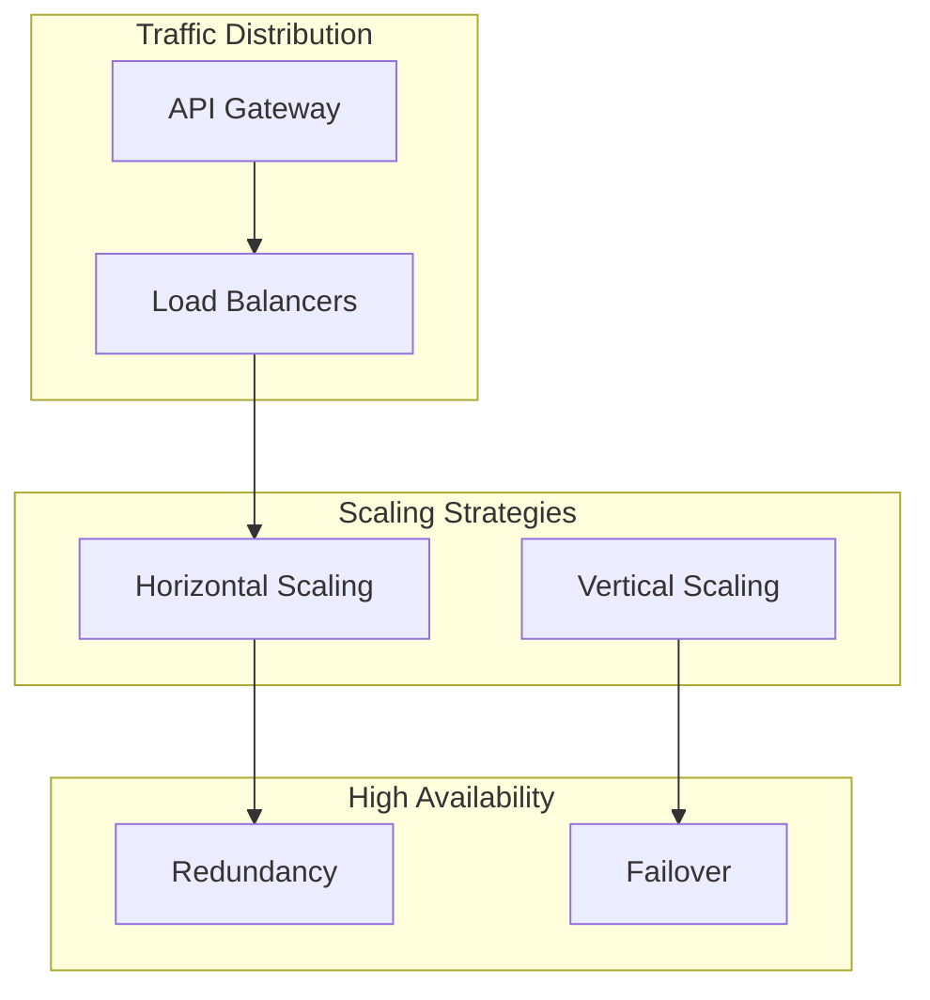

---

## 1. Load Balancing Fundamentals

### What Is a Load Balancer?

A load balancer distributes incoming traffic across multiple servers to:
- **Improve throughput:** Parallelize request handling
- **Increase availability:** No single point of failure
- **Enable scaling:** Add/remove servers dynamically
- **Reduce latency:** Route to fastest/nearest server

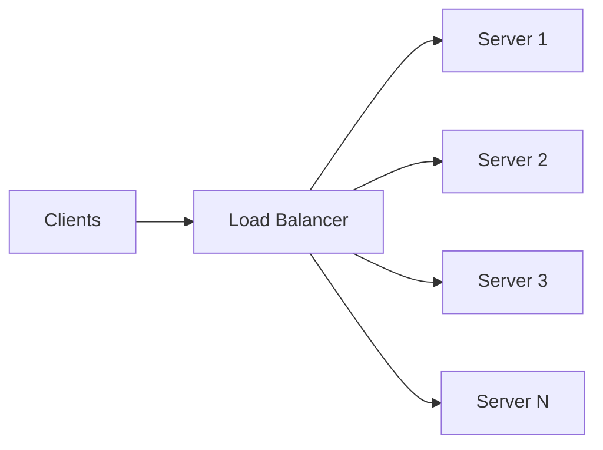

### Load Balancer Placement

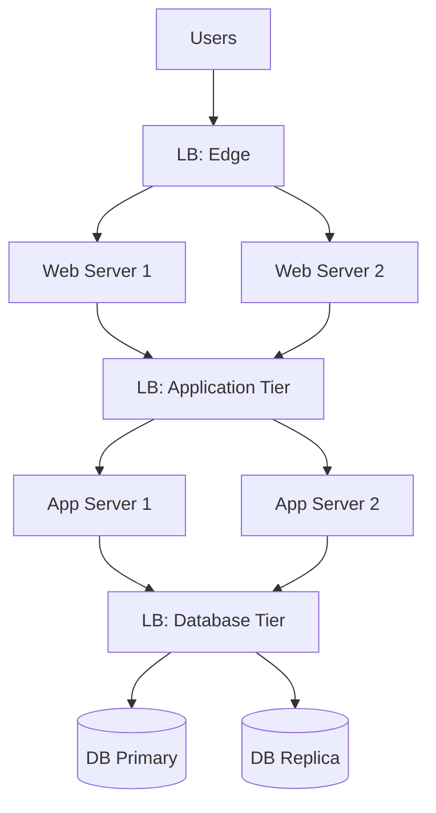

**Key positions:**
1. Between users and web servers
2. Between web and application servers
3. Between application and database servers

---

## 2. Load Balancing Algorithms

### Algorithm Overview

| Algorithm | State | Complexity | Best For |
|-----------|-------|------------|----------|
| Round Robin | Stateless | O(1) | Homogeneous servers |
| Weighted Round Robin | Stateless | O(1) | Heterogeneous servers |
| Least Connections | Stateful | O(n) or O(log n) | Variable request duration |
| Weighted Least Connections | Stateful | O(n) | Heterogeneous + variable duration |
| IP Hash | Stateless | O(1) | Session affinity |
| Least Response Time | Stateful | O(n) | Latency-sensitive |
| Random | Stateless | O(1) | Simple, surprisingly effective |

### Round Robin

Distribute requests in circular order: 1 → 2 → 3 → 1 → 2 → 3...

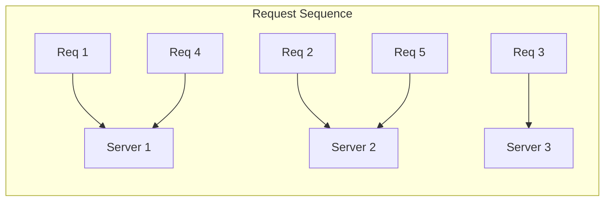

| Pros | Cons |
|------|------|
| Simple to implement | Ignores server capacity |
| No state needed | Ignores current load |
| Fair distribution | Bad for long-lived connections |

### Weighted Round Robin

Like round robin, but servers get traffic proportional to their weight.

```
Server A (weight=5): Gets 5 requests per cycle
Server B (weight=3): Gets 3 requests per cycle
Server C (weight=2): Gets 2 requests per cycle
```

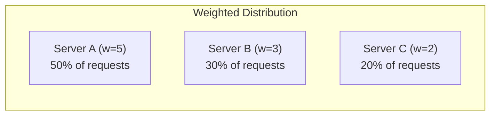

**Use when:** Servers have different capacities (CPU, memory).

### Least Connections

Route to server with fewest active connections.

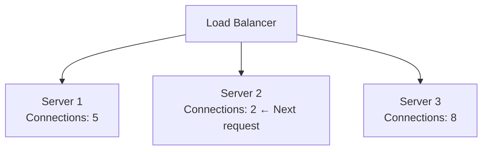

| Pros | Cons |
|------|------|
| Adapts to server load | Requires connection tracking |
| Good for variable request times | Doesn't consider capacity |
| Prevents overload | New servers may be overwhelmed |

### Weighted Least Connections

Combines weights with connection count:

```
Score = Active Connections / Weight
Route to lowest score
```

**Example:**
- Server A: 10 connections, weight 5 → Score = 2.0
- Server B: 4 connections, weight 2 → Score = 2.0
- Server C: 3 connections, weight 3 → Score = 1.0 ← Selected

### IP Hash

Hash client IP to determine server. Same IP always goes to same server.

```
server_index = hash(client_ip) % num_servers
```

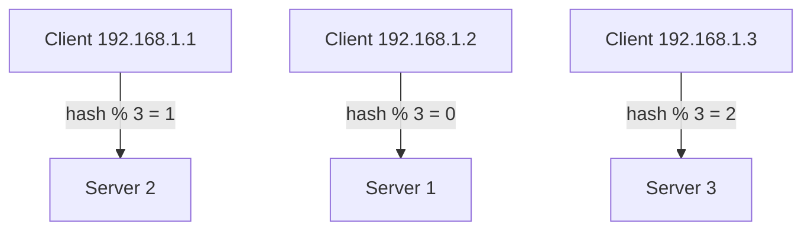

| Pros | Cons |
|------|------|
| Session affinity (sticky sessions) | Uneven if IPs not distributed |
| No session state needed at LB | Adding servers breaks mapping |
| Simple | Ignores server load |

**Use when:** Need stateful sessions without session store.

### Least Response Time

Route to server with lowest recent response time.

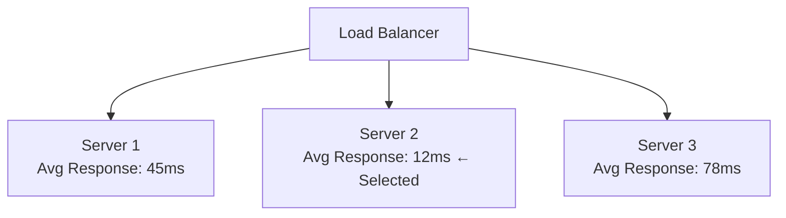

| Pros | Cons |
|------|------|
| Optimizes for user latency | Requires response time tracking |
| Adapts to server performance | Can oscillate |
| Good for heterogeneous servers | Doesn't account for throughput |

### Algorithm Selection Guide

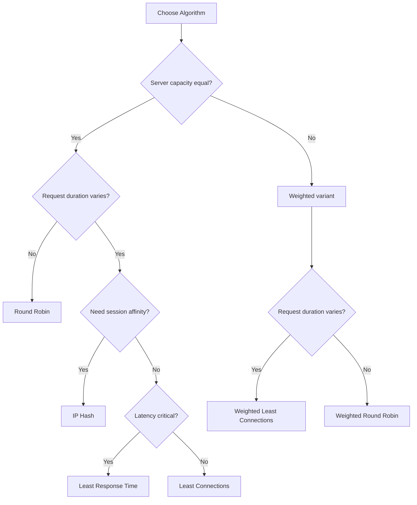

---

## 3. Layer 4 vs Layer 7 Load Balancing

### OSI Layer Reference

| Layer | Name | Data Unit | LB Visibility |
|-------|------|-----------|---------------|
| 7 | Application | HTTP, gRPC | Headers, content, cookies |
| 4 | Transport | TCP/UDP | IP, port, connection |

### Layer 4 (Transport) Load Balancing

Operates on TCP/UDP connections. Cannot see application content.

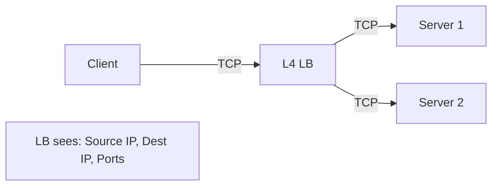

| Pros | Cons |
|------|------|
| Very fast (no parsing) | No content-based routing |
| Protocol agnostic | Limited health checks |
| Low latency | No URL-based decisions |

### Layer 7 (Application) Load Balancing

Operates on HTTP requests. Can inspect headers, URLs, content.

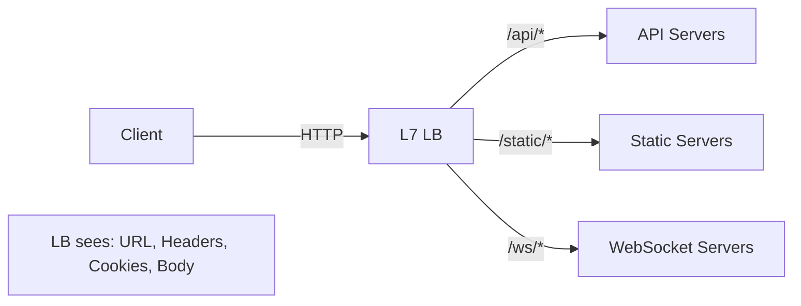

| Pros | Cons |
|------|------|
| Content-based routing | Higher latency (parsing) |
| URL/header decisions | More CPU intensive |
| SSL termination | Protocol specific |
| Caching, compression | Complex configuration |

### Comparison Table

| Feature | Layer 4 | Layer 7 |
|---------|---------|---------|
| **Speed** | Faster | Slower |
| **Routing decisions** | IP/Port | URL, headers, cookies |
| **SSL termination** | Pass-through | Yes |
| **Caching** | No | Yes |
| **Health checks** | TCP connect | HTTP status |
| **Use case** | High throughput | Content routing |

---

## 4. Load Balancer Types

### Hardware Load Balancers

Physical appliances (F5, Citrix, A10).

| Pros | Cons |
|------|------|
| Very high performance | Expensive |
| Specialized hardware | Proprietary |
| Enterprise support | Less flexible |

### Software Load Balancers

Software running on commodity hardware.

| Software | Type | Features |
|----------|------|----------|
| **Nginx** | L7 | HTTP, reverse proxy, caching |
| **HAProxy** | L4/L7 | High performance, battle-tested |
| **Envoy** | L7 | Service mesh, observability |
| **Traefik** | L7 | Auto-discovery, Kubernetes native |

### Cloud Load Balancers

Managed services from cloud providers.

| Provider | L4 Service | L7 Service |
|----------|------------|------------|
| **AWS** | NLB (Network) | ALB (Application) |
| **GCP** | Network LB | HTTP(S) LB |
| **Azure** | Load Balancer | Application Gateway |

| Pros | Cons |
|------|------|
| Managed, auto-scaling | Cost |
| Integrated with cloud | Vendor lock-in |
| Global distribution | Less control |

### DNS Load Balancing

DNS returns different IPs to distribute traffic.

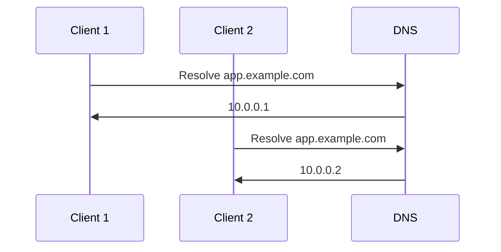

| Pros | Cons |
|------|------|
| Simple | Slow propagation (TTL) |
| Geographic routing | No health awareness |
| No infrastructure | Limited algorithms |

---

## 5. Health Checks and Failover

### Health Check Types

| Type | What It Checks | Pros | Cons |
|------|---------------|------|------|
| **TCP** | Port is open | Simple, fast | Server might be unhealthy |
| **HTTP** | Returns 2xx | Application-aware | Slower |
| **Custom script** | Application logic | Most accurate | Complex |

### Health Check Configuration

```yaml
# Example HAProxy configuration
backend servers
    option httpchk GET /health
    http-check expect status 200
    
    server server1 10.0.0.1:8080 check inter 5s fall 3 rise 2
    server server2 10.0.0.2:8080 check inter 5s fall 3 rise 2
```

**Parameters:**
- **interval:** How often to check
- **timeout:** How long to wait for response
- **fall:** Failures before marking unhealthy
- **rise:** Successes before marking healthy

### Failover Patterns

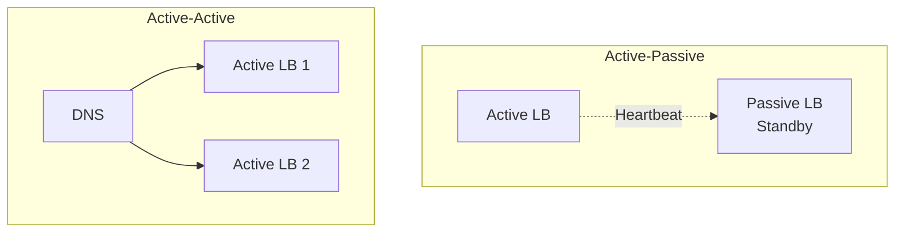

---

## 6. API Gateway

### API Gateway vs Load Balancer

| Feature | Load Balancer | API Gateway |
|---------|---------------|-------------|
| **Primary function** | Distribute traffic | Manage API lifecycle |
| **Awareness** | Connection/request | API semantics |
| **Authentication** | Basic | Full (OAuth, JWT, API keys) |
| **Rate limiting** | Basic | Per-user, per-endpoint |
| **Transformation** | No | Request/response modification |
| **Analytics** | Basic metrics | API-level analytics |

### API Gateway Functions

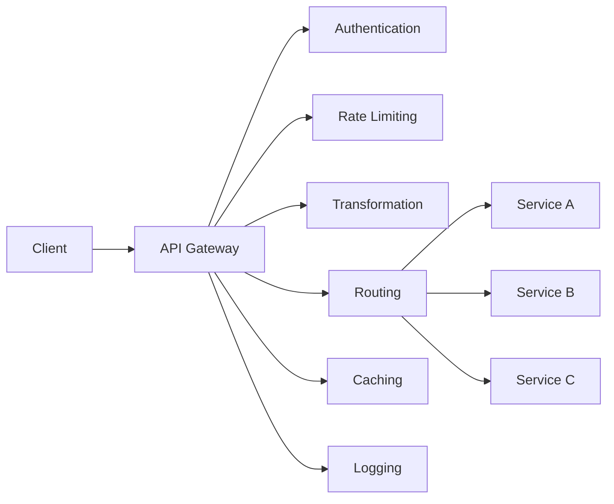

### Key Capabilities

| Capability | Description | Example |
|------------|-------------|---------|
| **Request routing** | Route based on path, method | `/users/*` → User Service |
| **Authentication** | Verify identity | Validate JWT token |
| **Authorization** | Check permissions | User can access resource? |
| **Rate limiting** | Prevent abuse | 100 req/min per user |
| **Request transformation** | Modify requests | Add headers, change format |
| **Response transformation** | Modify responses | Filter fields, format |
| **Caching** | Cache responses | Cache GET responses |
| **Circuit breaker** | Handle failures | Stop calling failing service |

### API Gateway Patterns

#### Backend for Frontend (BFF)

Different gateways for different clients.

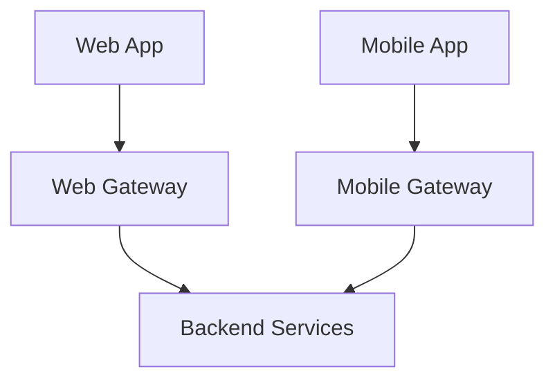

**Why:** Different clients need different data shapes, authentication, rate limits.

#### Gateway Aggregation

Gateway combines multiple service calls.

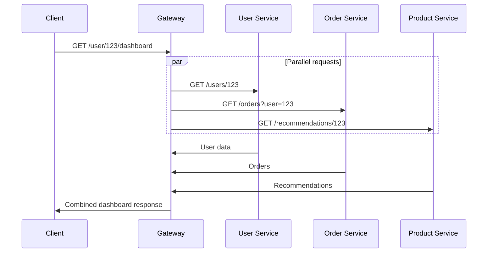

---

## 7. Scaling Strategies

### Vertical Scaling (Scale Up)

Add more resources to existing machine.

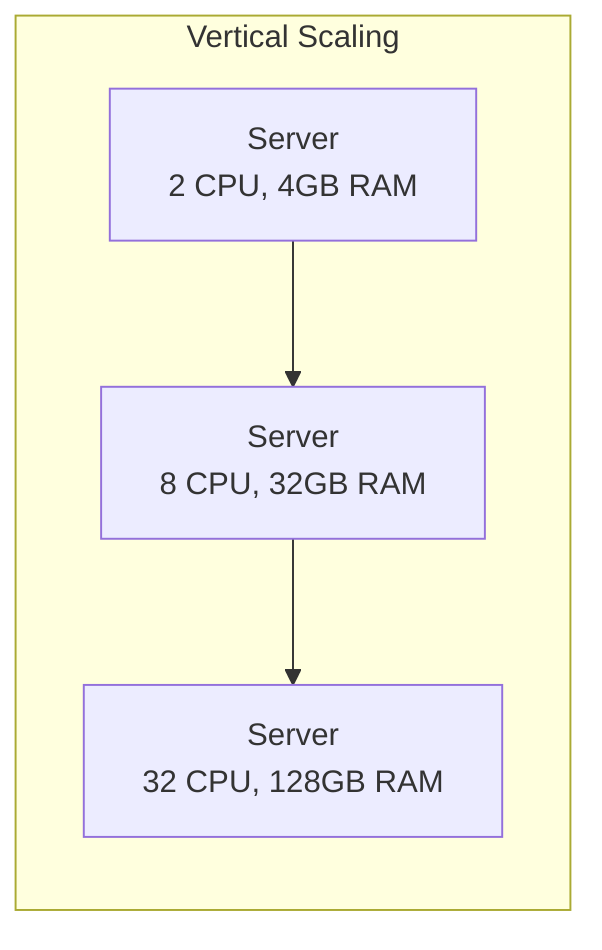

| Pros | Cons |
|------|------|
| Simple | Hardware limits |
| No code changes | Single point of failure |
| No distributed complexity | Expensive at scale |

### Horizontal Scaling (Scale Out)

Add more machines.

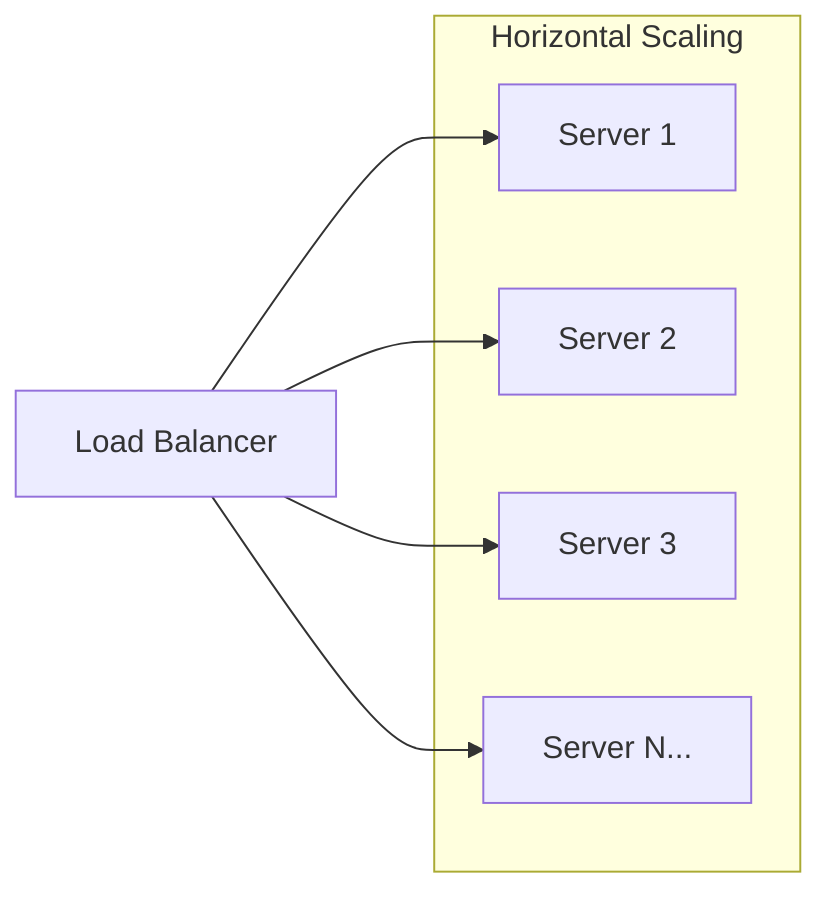

| Pros | Cons |
|------|------|
| Near-infinite scale | Distributed system complexity |
| Fault tolerance | State management challenges |
| Cost-effective | Load balancing needed |

### Stateless vs Stateful Services

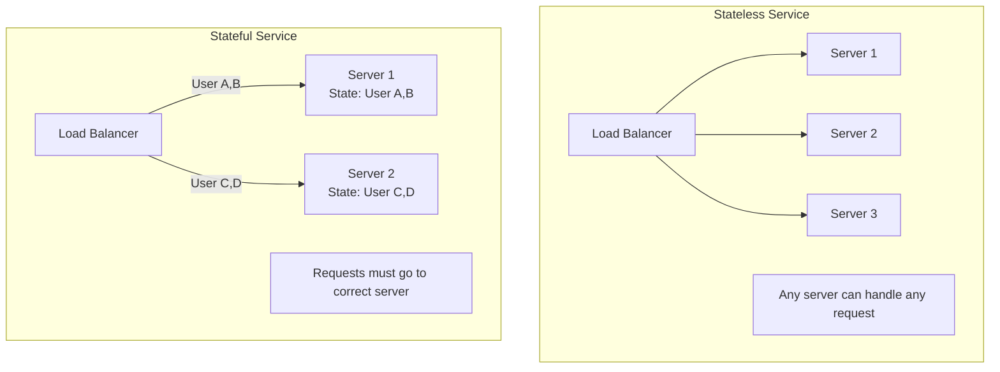

**Guideline:** Make services stateless. Externalize state to:
- Redis/Memcached for sessions
- Database for persistent state
- Message queues for async state

### Auto-Scaling

Automatically adjust capacity based on demand.

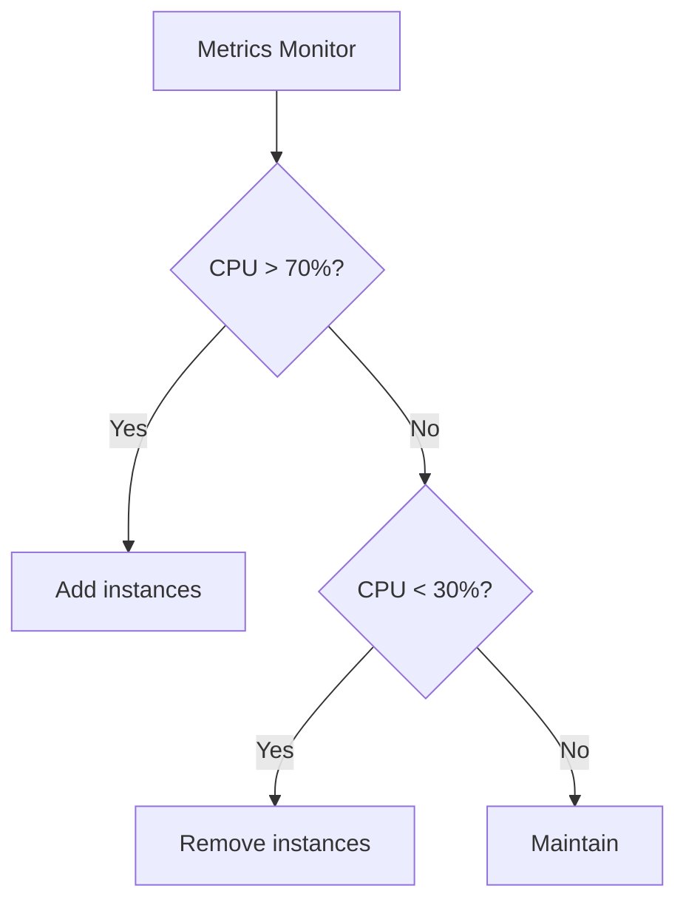

**Scaling triggers:**
- CPU utilization
- Memory utilization
- Request count
- Queue depth
- Custom metrics

---

## 8. High Availability for Load Balancers

### Eliminating the SPOF

Load balancers can become single points of failure. Solutions:

#### Active-Passive (Failover)

```mermaid
graph TD
    VIP[Virtual IP] --> Active[Active LB]
    Active -.->|Heartbeat| Passive[Passive LB]
    
    Active --> S1[Servers]
    Passive -.->|Failover| S1
```

**How it works:**
1. Active LB owns the VIP
2. Passive monitors via heartbeat
3. If Active fails, Passive takes VIP

#### Active-Active

```mermaid
graph TD
    DNS[DNS] --> LB1[LB 1]
    DNS --> LB2[LB 2]
    
    LB1 --> Servers[Server Pool]
    LB2 --> Servers
```

**How it works:**
1. DNS returns both LB IPs
2. Traffic splits between both
3. Either can handle full load

---

## 9. Chapter Summary

### Key Concepts

| Concept | One-Line Definition |
|---------|---------------------|
| **Round Robin** | Distribute sequentially across servers |
| **Least Connections** | Route to server with fewest active connections |
| **Layer 4 LB** | Balance based on IP/port (fast, simple) |
| **Layer 7 LB** | Balance based on HTTP content (flexible, slower) |
| **API Gateway** | Manage API lifecycle: auth, rate limit, transform |
| **Horizontal scaling** | Add more machines |
| **Vertical scaling** | Add resources to existing machines |

### Algorithm Selection Cheat Sheet

| Scenario | Recommended Algorithm |
|----------|----------------------|
| Homogeneous servers, similar requests | Round Robin |
| Heterogeneous servers | Weighted Round Robin |
| Long-lived connections | Least Connections |
| Need session affinity | IP Hash |
| Latency-critical | Least Response Time |

### Interview Articulation Patterns

> "How would you scale this system?"

"First, I'd make the service stateless by externalizing session state to Redis. Then I'd add a load balancer in front and horizontally scale by adding instances. Auto-scaling based on CPU would handle traffic spikes. For the database, I'd add read replicas and consider sharding if write throughput becomes a bottleneck."

> "Why use an API Gateway instead of just a load balancer?"

"An API Gateway provides application-level features that a basic load balancer doesn't: authentication, rate limiting per user, request/response transformation, and API versioning. If I just need to distribute traffic, a load balancer is simpler. But for managing APIs with different access patterns, authentication, and client-specific needs, an API Gateway is more appropriate."

---

## Navigation

**Previous:** [06 — Consistency & Consensus](./06-CONSISTENCY-CONSENSUS.md)  
**Next:** [08 — Messaging & Async](./08-MESSAGING-ASYNC.md)  
**Index:** [00 — Handbook Index](./00-INDEX.md)
