# 08 — Messaging & Asynchronous Processing

> Decoupling components through messaging enables scalability, resilience, and flexibility.

**Prerequisites:** [01 — Foundational Concepts](./01-FOUNDATIONAL-CONCEPTS.md), [05 — Distributed Patterns](./05-DISTRIBUTED-PATTERNS.md)  
**Estimated study time:** 2-3 hours

---

## 1. Why Asynchronous Messaging?

### Synchronous vs Asynchronous

| Aspect | Synchronous | Asynchronous |
|--------|-------------|--------------|
| **Coupling** | Tight (caller waits) | Loose (fire and forget) |
| **Failure handling** | Cascading failures | Isolated failures |
| **Scalability** | Limited by slowest component | Independent scaling |
| **Latency** | Sum of all calls | Only initial acknowledgment |

### Benefits of Messaging

| Benefit | How It Helps |
|---------|--------------|
| **Decoupling** | Producer doesn't know consumers |
| **Resilience** | Messages persist if consumer down |
| **Scalability** | Add consumers for throughput |
| **Traffic smoothing** | Queue absorbs spikes |

---

## 2. Message Queue vs Pub/Sub

### Message Queue (Point-to-Point)

Each message consumed by exactly one consumer.

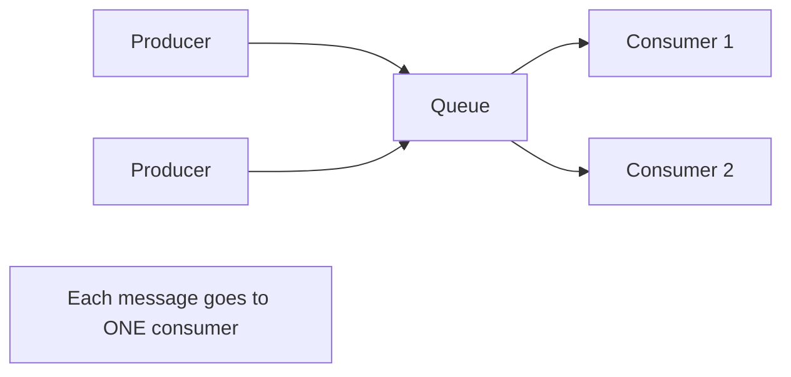

**Use when:** Work distribution, task processing, load leveling.

### Publish/Subscribe

Each message delivered to all subscribers.

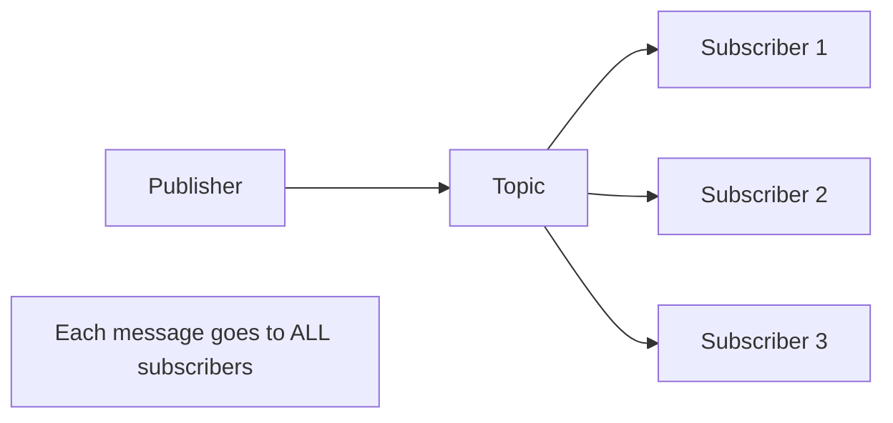

**Use when:** Event broadcasting, notifications, data replication.

### Comparison

| Aspect | Message Queue | Pub/Sub |
|--------|---------------|---------|
| **Delivery** | One consumer | All subscribers |
| **Use case** | Task distribution | Event broadcasting |
| **Scaling** | Add consumers (competing) | Add subscribers (independent) |
| **Example** | Job processing | Event notifications |

---

## 3. Delivery Guarantees

### Guarantee Levels

| Guarantee | Meaning | Trade-off |
|-----------|---------|-----------|
| **At-most-once** | May lose messages | Fastest, simplest |
| **At-least-once** | May duplicate messages | Requires idempotent consumers |
| **Exactly-once** | No loss, no duplicates | Complex, slower |

### At-Least-Once Pattern

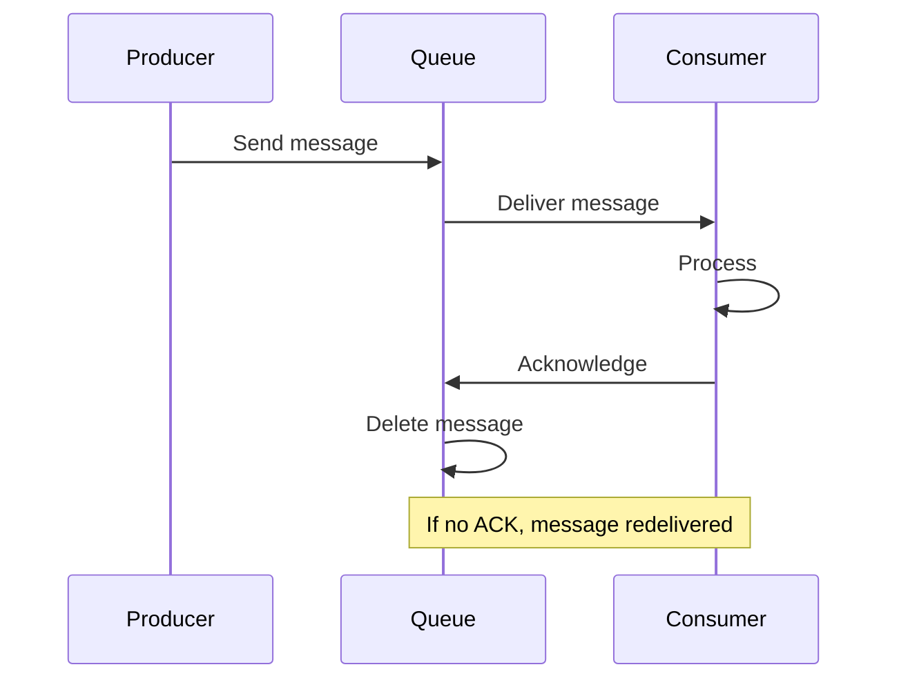

### Idempotency for At-Least-Once

Since messages may be delivered multiple times, consumers must be idempotent.

```python
# Idempotent consumer pattern
def process_message(message):
    message_id = message.id
    
    # Check if already processed
    if db.exists(f"processed:{message_id}"):
        return  # Skip duplicate
    
    # Process message
    do_work(message)
    
    # Mark as processed
    db.set(f"processed:{message_id}", True)
```

---

## 4. Message Queue Technologies

### Comparison Table

| Feature | Kafka | RabbitMQ | AWS SQS |
|---------|-------|----------|---------|
| **Model** | Log-based | Queue-based | Queue-based |
| **Ordering** | Per-partition | Per-queue | Best-effort (FIFO available) |
| **Retention** | Configurable (days) | Until consumed | 14 days max |
| **Throughput** | Very high | High | High |
| **Replay** | Yes | No | No |
| **Managed** | Confluent, MSK | CloudAMQP | Native AWS |

### Apache Kafka

Distributed log-based messaging system.

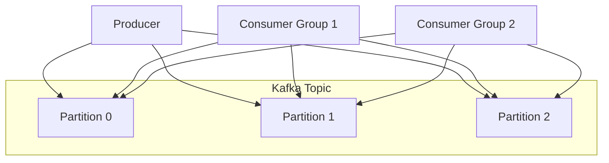

**Key concepts:**
- **Topic:** Category of messages
- **Partition:** Ordered, immutable log
- **Consumer Group:** Consumers sharing partition load
- **Offset:** Position in partition log

**Strengths:** High throughput, replay capability, durability  
**Use cases:** Event streaming, log aggregation, stream processing

### RabbitMQ

Traditional message broker with rich routing.

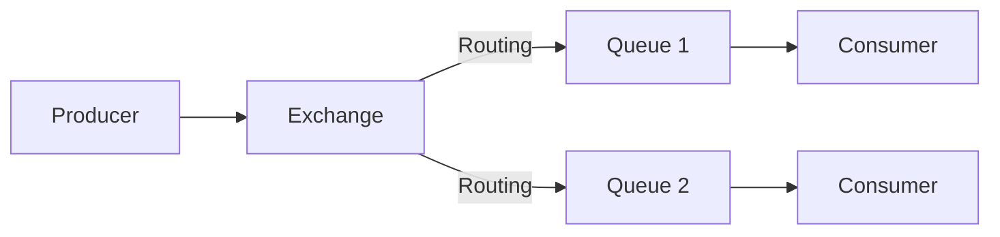

**Exchange types:**
- **Direct:** Route by exact routing key
- **Topic:** Route by pattern matching
- **Fanout:** Broadcast to all queues
- **Headers:** Route by message headers

**Strengths:** Flexible routing, mature, wide protocol support  
**Use cases:** Task queues, RPC, complex routing

### AWS SQS

Fully managed queue service.

**Types:**
- **Standard:** Best-effort ordering, at-least-once
- **FIFO:** Strict ordering, exactly-once

**Strengths:** Serverless, auto-scaling, no management  
**Use cases:** Decoupling AWS services, simple queuing

---

## 5. Stream vs Batch Processing

### Batch Processing

Process large volumes of data at scheduled intervals.

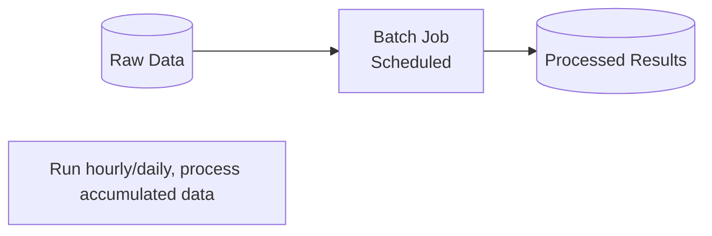

| Pros | Cons |
|------|------|
| Efficient for large volumes | High latency |
| Simpler error handling | Not real-time |
| Optimized throughput | Stale results |

**Use cases:** ETL, reports, ML training, data warehousing

### Stream Processing

Process data continuously as it arrives.

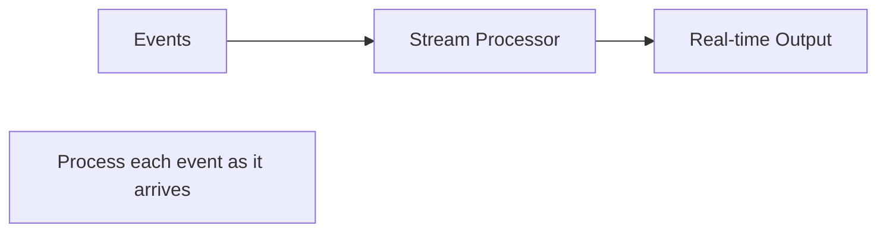

| Pros | Cons |
|------|------|
| Low latency | Complex state management |
| Real-time insights | Harder error recovery |
| Continuous output | Resource intensive |

**Use cases:** Real-time analytics, fraud detection, monitoring

### Comparison

| Aspect | Batch | Stream |
|--------|-------|--------|
| **Latency** | Minutes to hours | Milliseconds to seconds |
| **Data scope** | Bounded dataset | Unbounded stream |
| **Processing** | Complete dataset | Event at a time |
| **State** | Simple | Complex (windowing) |
| **Tools** | Spark, Hadoop | Kafka Streams, Flink |

### Lambda Architecture

Combine batch and stream for best of both.

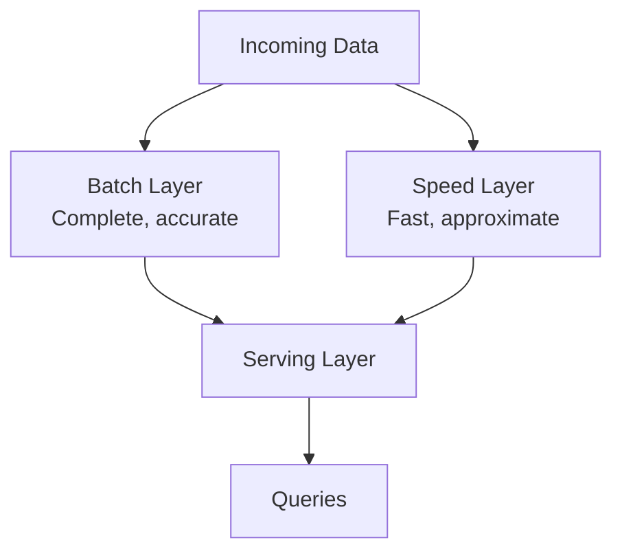

---

## 6. Message Ordering

### Why Ordering Matters

Some operations must be processed in order:
- Bank transactions for same account
- User events (signup before purchase)
- State machine transitions

### Ordering Strategies

| Strategy | Guarantee | Trade-off |
|----------|-----------|-----------|
| **Single partition** | Total order | Limited throughput |
| **Partition by key** | Order per key | Good balance |
| **No ordering** | None | Maximum throughput |

### Partition Key Pattern (Kafka)

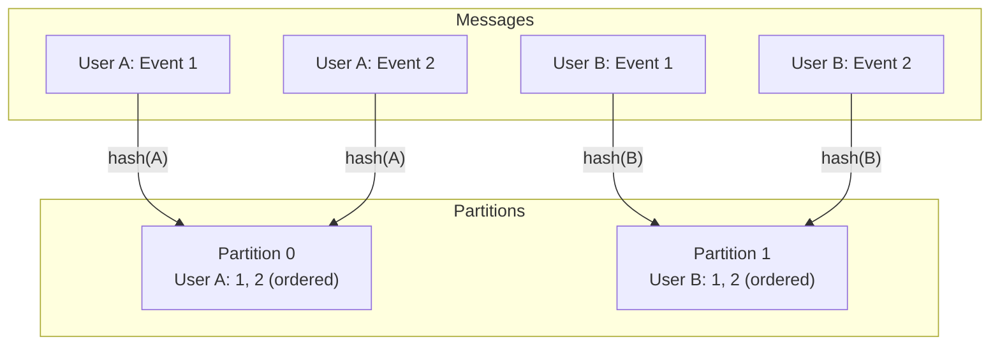

**Key insight:** Same key → same partition → guaranteed order for that key.

---

## 7. Dead Letter Queues

### The Problem

What happens to messages that can't be processed?

### Dead Letter Queue Pattern

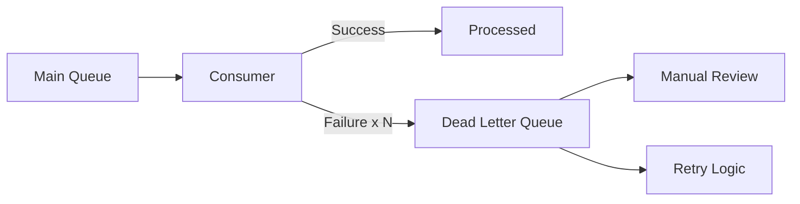

**Configuration:**
- Max retry attempts before DLQ
- Separate monitoring for DLQ
- Process for handling DLQ messages

---

## 8. Chapter Summary

### Key Concepts

| Concept | Definition |
|---------|------------|
| **Message Queue** | Point-to-point, one consumer per message |
| **Pub/Sub** | Broadcast to all subscribers |
| **At-least-once** | May duplicate, never lose |
| **Idempotency** | Same operation, same result |
| **Partition** | Ordered subset of topic |
| **Consumer Group** | Consumers sharing load |

### Technology Selection

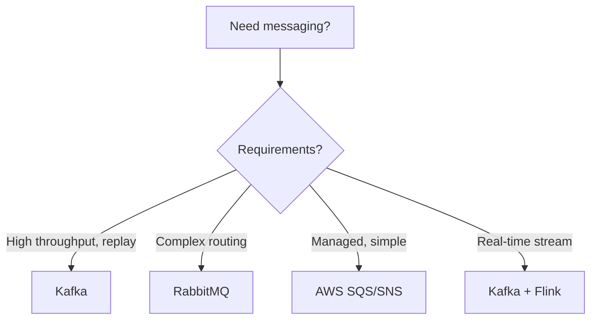

### Interview Patterns

> "When would you use a message queue?"

"When I need to decouple services, handle traffic spikes, or process work asynchronously. For example, sending emails after user signup—the user doesn't need to wait for email delivery."

> "How do you handle message ordering?"

"I'd partition by a key that requires ordering (like user_id). All messages for the same user go to the same partition, preserving order. Different users can be processed in parallel across partitions."

---

## Navigation

**Previous:** [07 — Load Balancing & Scaling](./07-LOAD-BALANCING-SCALING.md)  
**Next:** [09 — Quick Reference](./09-QUICK-REFERENCE.md)  
**Index:** [00 — Handbook Index](./00-INDEX.md)
