# 02 — Networking & Communication

> Understanding how components talk to each other is fundamental to distributed systems design.

**Prerequisites:** [01 — Foundational Concepts](./01-FOUNDATIONAL-CONCEPTS.md)  
**Builds toward:** [05 — Distributed Patterns](./05-DISTRIBUTED-PATTERNS.md), [07 — Load Balancing](./07-LOAD-BALANCING-SCALING.md)  
**Estimated study time:** 2-3 hours

---

## Chapter Overview

This module covers the communication layer of distributed systems—from basic protocols to real-time communication patterns.

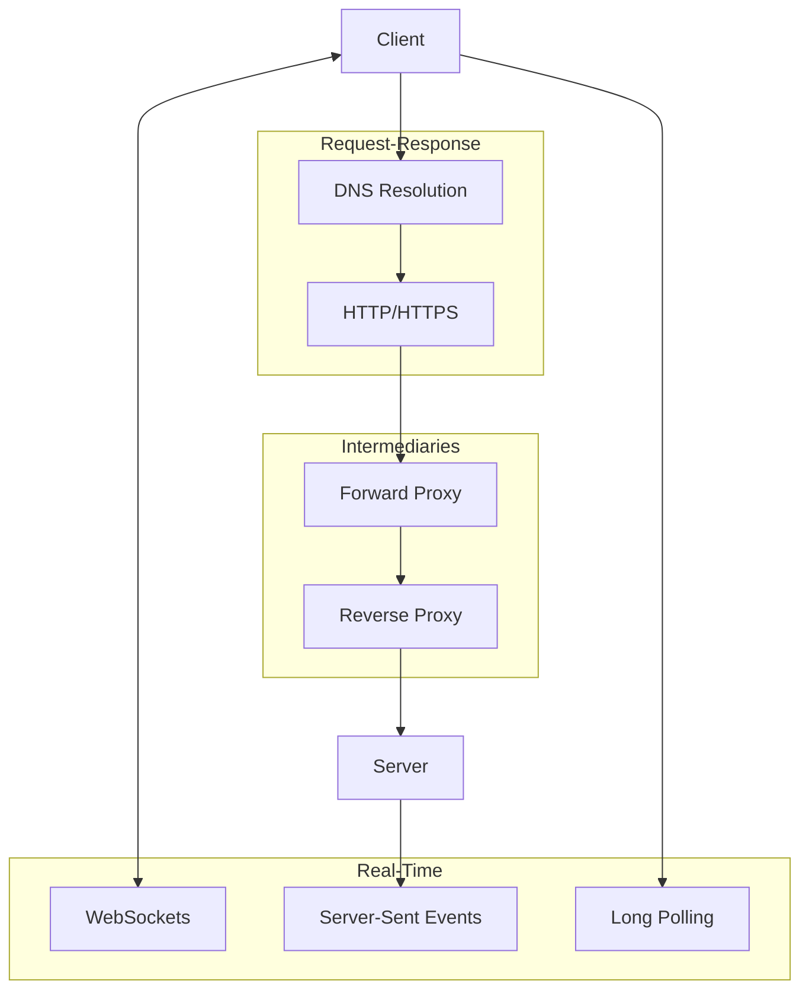

---

## 1. HTTP and HTTPS

### HTTP Fundamentals

HTTP (Hypertext Transfer Protocol) is the foundation of web communication—a stateless, request-response protocol.

| Aspect | Description |
|--------|-------------|
| **Model** | Request-Response |
| **State** | Stateless (each request independent) |
| **Connection** | TCP-based |
| **Default Port** | 80 (HTTP), 443 (HTTPS) |

### HTTP Methods and Their Semantics

| Method | Idempotent | Safe | Use Case |
|--------|------------|------|----------|
| GET | ✓ | ✓ | Retrieve resource |
| POST | ✗ | ✗ | Create resource, submit data |
| PUT | ✓ | ✗ | Replace resource entirely |
| PATCH | ✗ | ✗ | Partial update |
| DELETE | ✓ | ✗ | Remove resource |
| HEAD | ✓ | ✓ | Get headers only |
| OPTIONS | ✓ | ✓ | Get allowed methods |

**Idempotent:** Multiple identical requests have same effect as single request  
**Safe:** Does not modify server state

### HTTP Status Codes

| Range | Category | Key Codes |
|-------|----------|-----------|
| 1xx | Informational | 101 Switching Protocols |
| 2xx | Success | 200 OK, 201 Created, 204 No Content |
| 3xx | Redirection | 301 Permanent, 302 Found, 304 Not Modified |
| 4xx | Client Error | 400 Bad Request, 401 Unauthorized, 403 Forbidden, 404 Not Found, 429 Too Many Requests |
| 5xx | Server Error | 500 Internal Error, 502 Bad Gateway, 503 Service Unavailable, 504 Gateway Timeout |

### HTTPS

HTTPS = HTTP + TLS (Transport Layer Security)

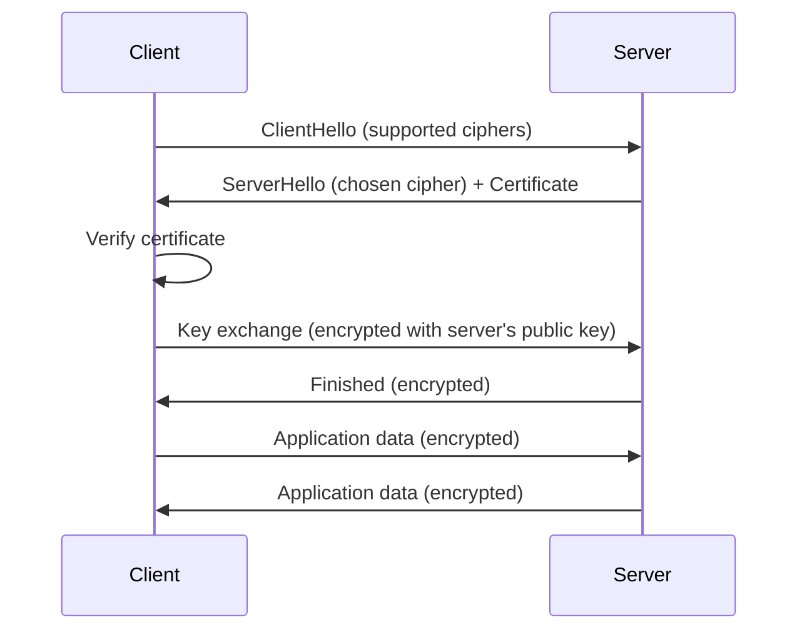

**Why HTTPS matters:**
- **Confidentiality:** Data encrypted in transit
- **Integrity:** Tampering detected
- **Authentication:** Server identity verified

### HTTP Evolution

| Version | Key Features | Connection Model |
|---------|--------------|------------------|
| HTTP/1.0 | Basic request-response | New connection per request |
| HTTP/1.1 | Keep-alive, pipelining, chunked transfer | Persistent connections |
| HTTP/2 | Multiplexing, header compression, server push | Single connection, multiple streams |
| HTTP/3 | QUIC (UDP-based), faster handshake | Built-in encryption, 0-RTT |

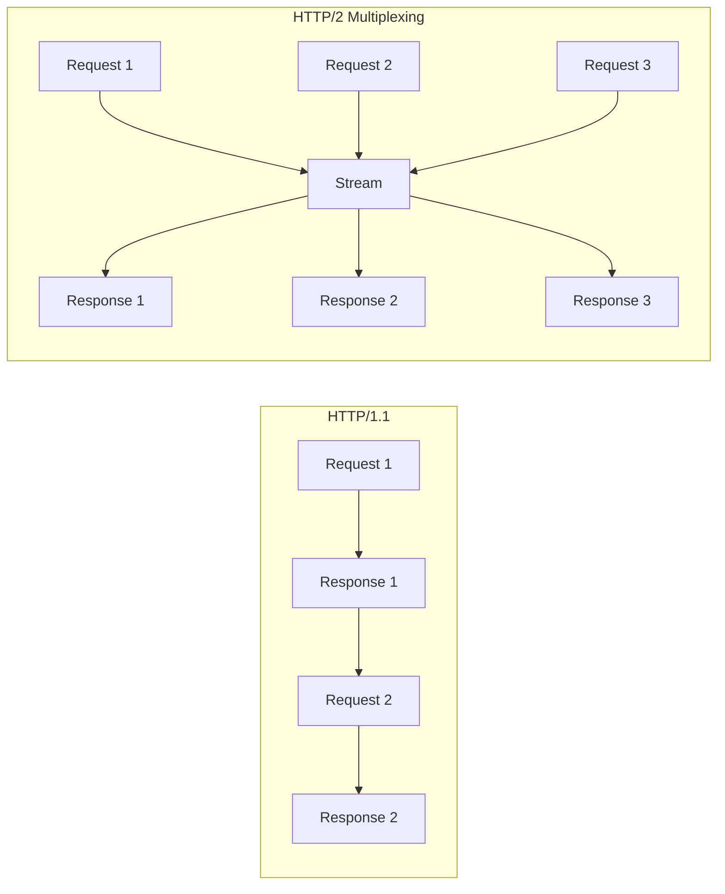

---

## 2. DNS (Domain Name System)

### What DNS Does
DNS translates human-readable domain names to IP addresses.

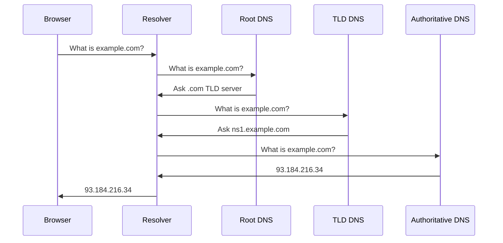

### DNS Record Types

| Type | Purpose | Example |
|------|---------|---------|
| **A** | IPv4 address | example.com → 93.184.216.34 |
| **AAAA** | IPv6 address | example.com → 2606:2800:220:1:... |
| **CNAME** | Alias to another domain | www.example.com → example.com |
| **MX** | Mail server | example.com → mail.example.com |
| **NS** | Nameserver | example.com → ns1.example.com |
| **TXT** | Text records | SPF, DKIM, verification |

### DNS Caching Hierarchy

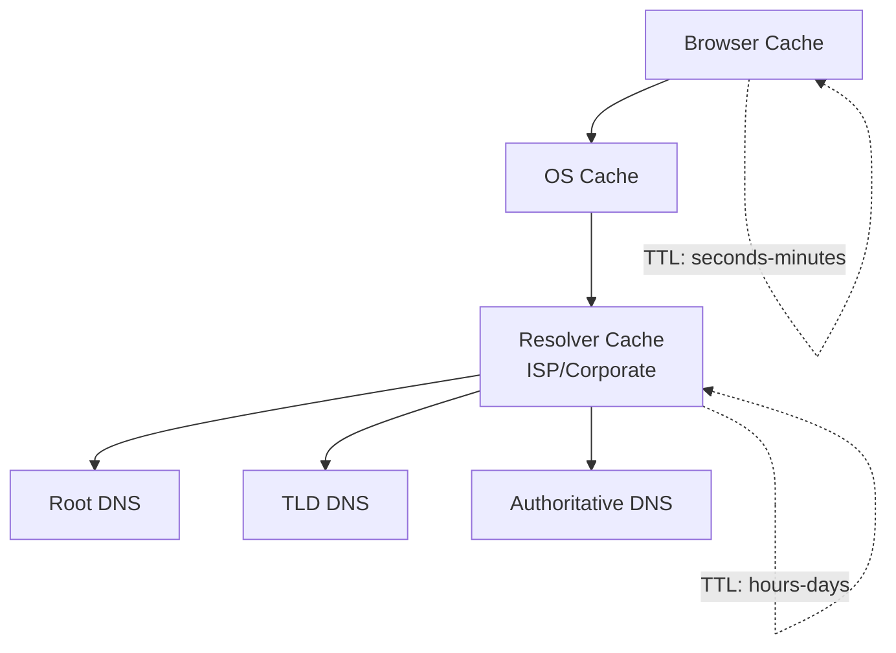

**TTL (Time To Live):** How long to cache before re-querying

### DNS for Load Balancing

DNS can distribute traffic by returning different IPs:

| Technique | How It Works | Trade-offs |
|-----------|--------------|------------|
| **Round Robin** | Return IPs in rotating order | Simple, but ignores server health |
| **Weighted** | Return IPs based on capacity weights | Better distribution, manual config |
| **Geo-based** | Return nearest IP by location | Lower latency, requires geo database |
| **Latency-based** | Return fastest-responding IP | Best performance, complex to implement |

**Limitation:** DNS caching means changes propagate slowly (TTL-dependent).

---

## 3. Proxies

### Forward Proxy

A forward proxy sits between clients and the internet, acting on behalf of clients.

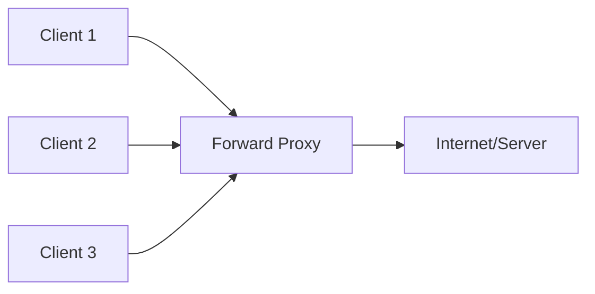

**Use cases:**
- **Anonymity:** Hide client IP from servers
- **Caching:** Cache responses to reduce bandwidth
- **Filtering:** Block access to certain sites
- **Logging:** Audit client requests

### Reverse Proxy

A reverse proxy sits in front of servers, acting on behalf of servers.

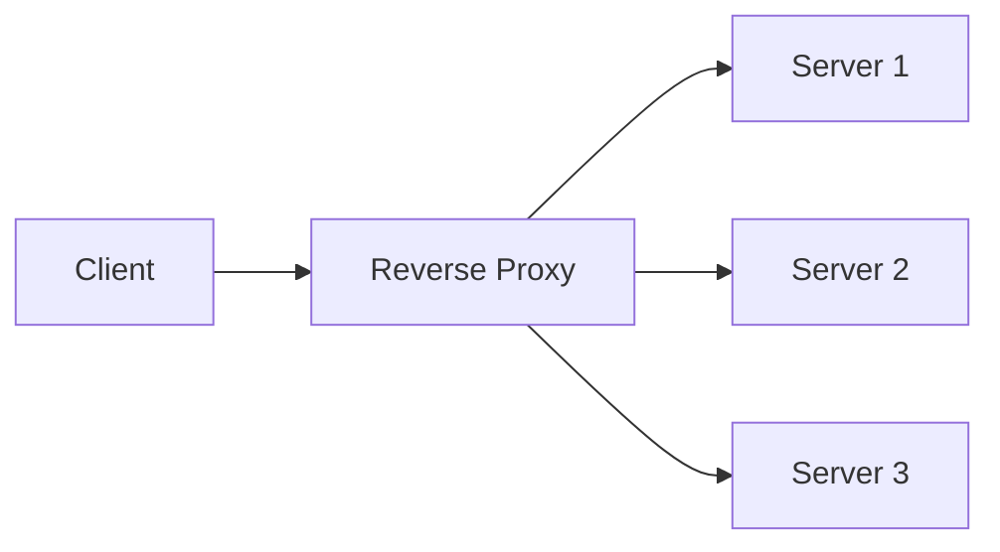

**Use cases:**
- **Load balancing:** Distribute requests across servers
- **SSL termination:** Handle encryption/decryption
- **Caching:** Cache responses for static content
- **Compression:** Compress responses
- **Security:** Hide server topology, WAF

### Forward vs Reverse Proxy Comparison

| Aspect | Forward Proxy | Reverse Proxy |
|--------|---------------|---------------|
| **Protects** | Clients | Servers |
| **Hides** | Client identity | Server identity |
| **Typical Location** | Client network | Server network |
| **Configured by** | Clients | Server operators |
| **Examples** | Squid, corporate proxies | Nginx, HAProxy, Cloudflare |

### Collapsed Forwarding

An optimization where a proxy combines identical concurrent requests:

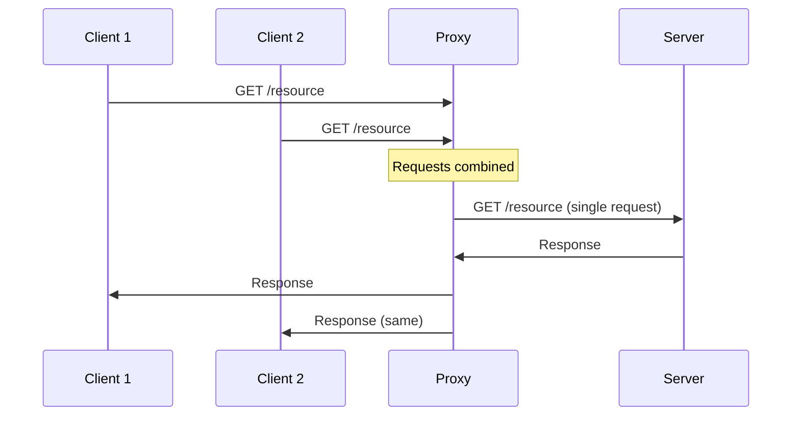

---

## 4. Real-Time Communication Patterns

### The Problem with HTTP for Real-Time

HTTP is request-response: clients must ask for data. For real-time updates, we need the server to push data.

| Pattern | Direction | Connection | Latency | Overhead |
|---------|-----------|------------|---------|----------|
| Polling | Client → Server | Multiple | High | High |
| Long Polling | Client → Server | Held open | Medium | Medium |
| SSE | Server → Client | Persistent | Low | Low |
| WebSocket | Bidirectional | Persistent | Very Low | Very Low |

### Regular Polling

Client repeatedly requests updates at fixed intervals.

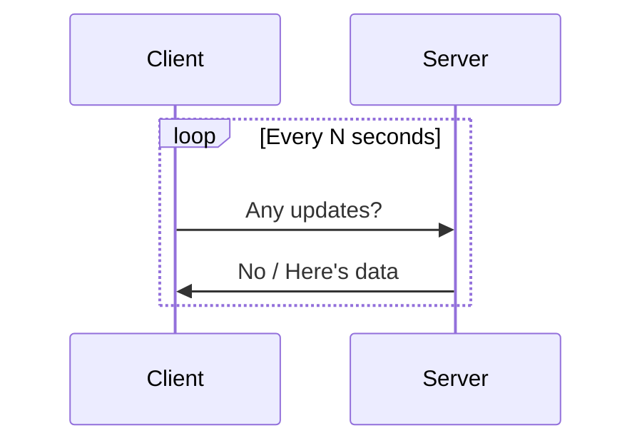

**Pros:** Simple, works everywhere  
**Cons:** High overhead, delayed updates, wasted requests

### Long Polling

Client makes request; server holds it open until data available or timeout.

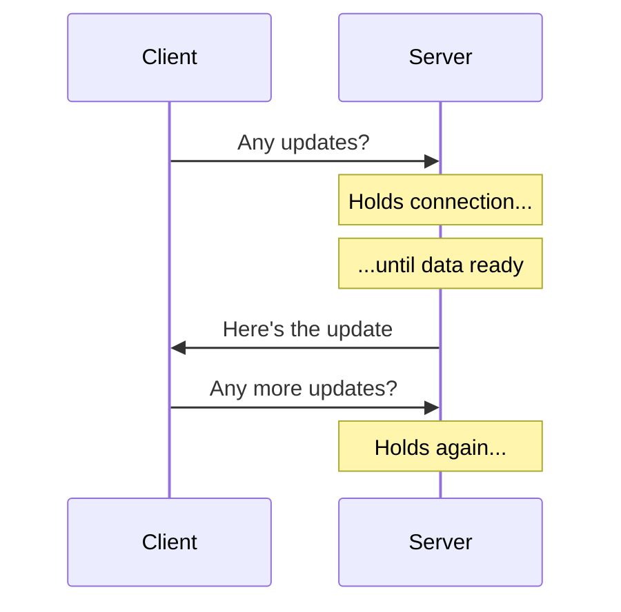

**Pros:** Lower latency than polling, works through most firewalls  
**Cons:** Server resource usage (held connections), not truly real-time

### Server-Sent Events (SSE)

Server pushes updates over a persistent HTTP connection (text/event-stream).

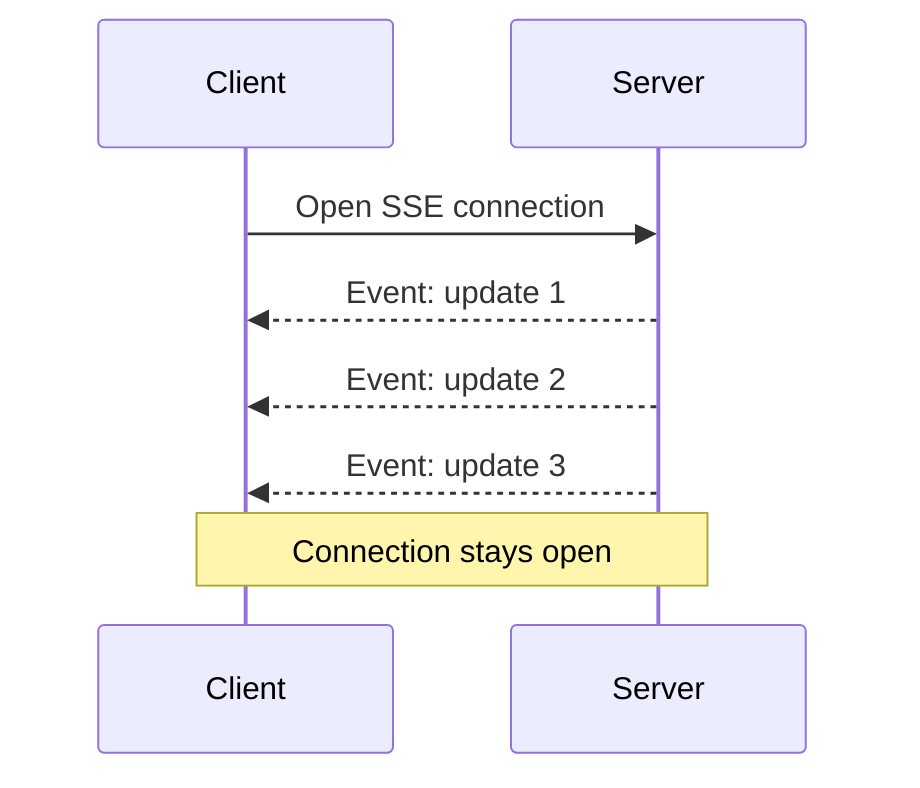

**Pros:** Simple API, automatic reconnection, works with HTTP/2  
**Cons:** Unidirectional (server to client only), limited browser connections per domain

**Best for:** News feeds, stock tickers, notifications—server-to-client only

### WebSockets

Full-duplex, bidirectional communication over a single TCP connection.

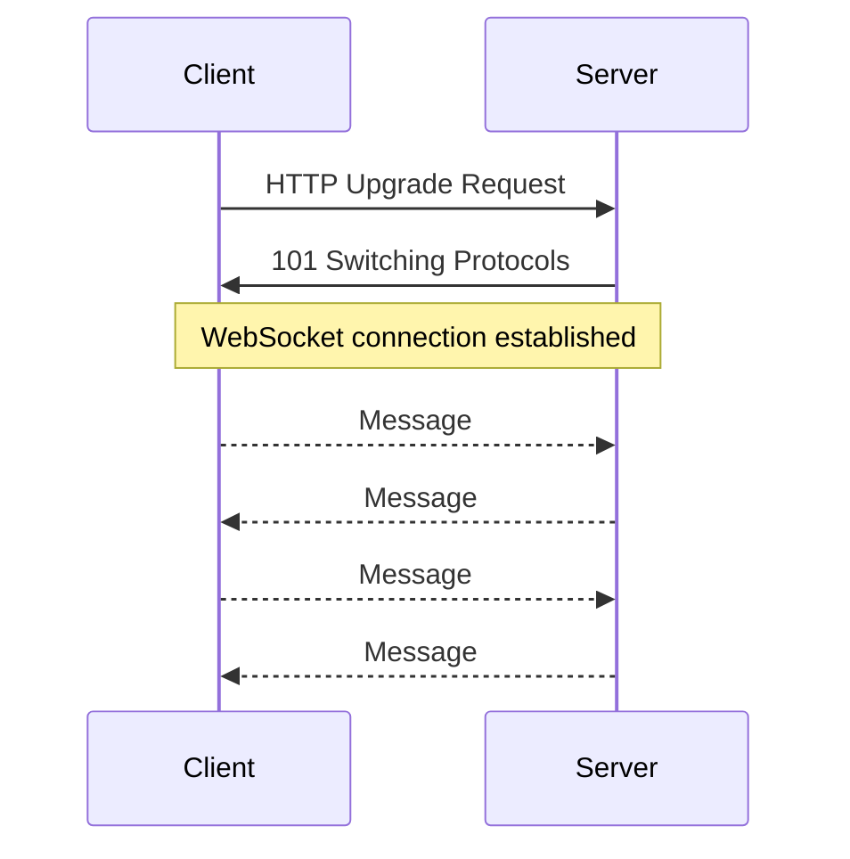

**Handshake:**
1. Client sends HTTP request with `Upgrade: websocket`
2. Server responds with `101 Switching Protocols`
3. Connection upgraded to WebSocket protocol

**Pros:** True bidirectional, low latency, low overhead after handshake  
**Cons:** Stateful (harder to scale), may need proxy configuration

**Best for:** Chat, gaming, collaborative editing—anything bidirectional

### Real-Time Pattern Decision Tree

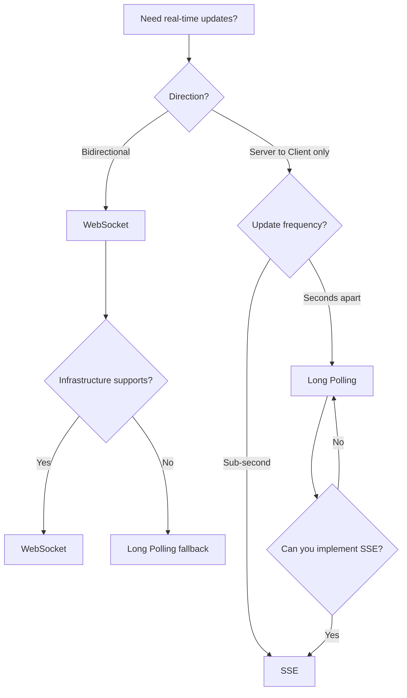

### Comparison Summary

| Feature | Polling | Long Polling | SSE | WebSocket |
|---------|---------|--------------|-----|-----------|
| Latency | High | Medium | Low | Very Low |
| Server load | High | Medium | Low | Low |
| Bidirectional | No | No | No | Yes |
| Browser support | Universal | Universal | Good | Good |
| HTTP/2 compatible | Yes | Yes | Yes | No (separate) |
| Auto-reconnect | Manual | Manual | Built-in | Manual |

---

## 5. API Design Considerations

### REST API Best Practices

| Principle | Description | Example |
|-----------|-------------|---------|
| **Resources as nouns** | URLs represent things, not actions | `/users`, not `/getUsers` |
| **HTTP verbs for actions** | GET, POST, PUT, DELETE | `DELETE /users/123` |
| **Plural resource names** | Consistency | `/users`, not `/user` |
| **Nested resources** | Show relationships | `/users/123/posts` |
| **Query params for filtering** | Don't embed in URL | `/users?status=active` |
| **Versioning** | API evolution | `/v1/users`, `/v2/users` |

### API Gateway Functions

An API Gateway is a single entry point that handles cross-cutting concerns:

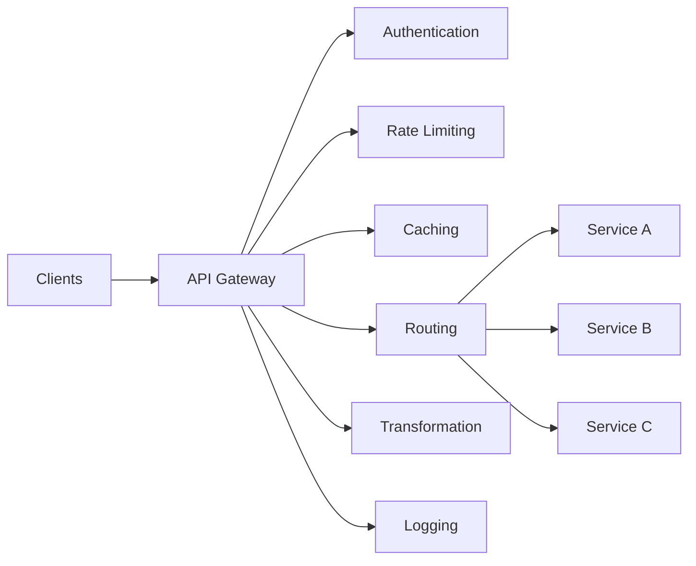

**Key responsibilities:**
- **Authentication/Authorization:** Verify identity, check permissions
- **Rate limiting:** Prevent abuse, ensure fair usage
- **Request routing:** Direct to appropriate service
- **Protocol translation:** HTTP ↔ gRPC, REST ↔ GraphQL
- **Response aggregation:** Combine multiple service responses
- **Caching:** Reduce backend load
- **SSL termination:** Handle encryption at the edge

### API Gateway vs Load Balancer

| Aspect | API Gateway | Load Balancer |
|--------|-------------|---------------|
| **Layer** | Application (L7) | Transport (L4) or Application (L7) |
| **Awareness** | Request content | Connection/packet |
| **Functions** | Auth, rate limit, transform | Traffic distribution |
| **Typical position** | Edge, in front of services | In front of server pools |

---

## 6. Rate Limiting

### Why Rate Limit?
- **Prevent abuse:** Stop malicious users from overwhelming the system
- **Ensure fairness:** Prevent one user from consuming all resources
- **Cost control:** Limit expensive operations
- **Maintain SLAs:** Protect service quality for all users

### Rate Limiting Algorithms

| Algorithm | Description | Pros | Cons |
|-----------|-------------|------|------|
| **Token Bucket** | Tokens added at fixed rate, request costs token | Allows bursts, smooth | Memory per user |
| **Leaky Bucket** | Requests processed at fixed rate, excess queued | Consistent output | No burst handling |
| **Fixed Window** | Count requests in fixed time windows | Simple | Burst at window edges |
| **Sliding Window** | Rolling time window | Smooth, no edge bursts | More computation |

### Token Bucket Visualization

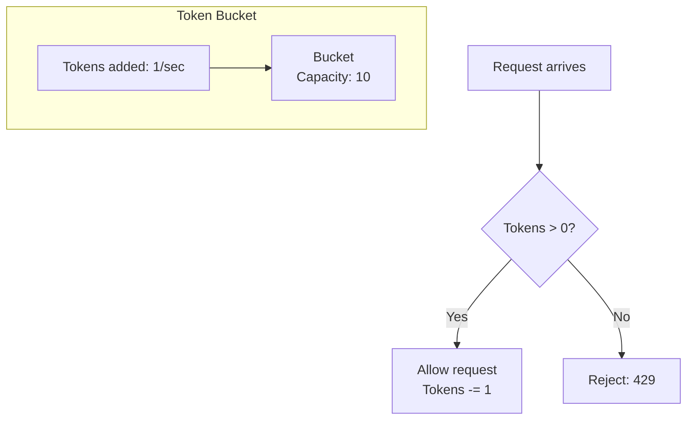

**Parameters:**
- **Bucket size:** Max burst capacity
- **Refill rate:** Sustained request rate

---

## 7. Chapter Summary

### Key Concepts

| Concept | One-Line Definition |
|---------|---------------------|
| HTTP | Stateless request-response protocol |
| HTTPS | HTTP with TLS encryption |
| DNS | Translates domain names to IP addresses |
| Forward Proxy | Acts on behalf of clients |
| Reverse Proxy | Acts on behalf of servers |
| Long Polling | Server holds request until data ready |
| SSE | Server pushes events over HTTP |
| WebSocket | Bidirectional persistent connection |

### Decision Framework

```
For client-server communication:
├── One-time request? → HTTP
├── Real-time server updates only? → SSE
├── Real-time bidirectional? → WebSocket
└── Must work everywhere? → Long Polling fallback
```

### Interview Checklist

- [ ] Explain HTTP method semantics (idempotent, safe)
- [ ] Describe DNS resolution flow
- [ ] Compare forward vs reverse proxy
- [ ] Choose between SSE, WebSocket, and Long Polling
- [ ] Explain rate limiting algorithms and trade-offs

---

## Navigation

**Previous:** [01 — Foundational Concepts](./01-FOUNDATIONAL-CONCEPTS.md)  
**Next:** [03 — Data Management](./03-DATA-MANAGEMENT.md)  
**Index:** [00 — Handbook Index](./00-INDEX.md)
