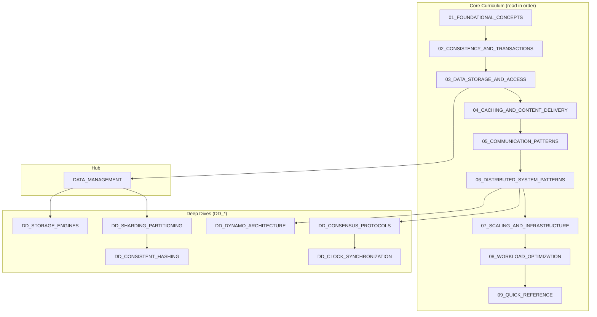

# System Design Interview Handbook

> Senior-level preparation for system design interviews. Trade-off focused, interview-ready.

---

## Core Principle

```
In system design, there are no perfect solutions—only trade-offs aligned with requirements.
```

---

## Quick Start

| Goal | Start Here |
|------|------------|
| **First time** | [01_FOUNDATIONAL_CONCEPTS](./01_FOUNDATIONAL_CONCEPTS.md) |
| **Interview tomorrow** | [09_QUICK_REFERENCE](./09_QUICK_REFERENCE.md) |
| **Deep-dive on topic** | See Document Map below |

---

## Document Map



---

## Document Index

### Core Curriculum

| # | Document | Topic | Key Question |
|---|----------|-------|--------------|
| 01 | [FOUNDATIONAL_CONCEPTS](./01_FOUNDATIONAL_CONCEPTS.md) | Scalability, CAP, Latency, Queuing Theory | "What properties am I optimizing for?" |
| 02 | [CONSISTENCY_AND_TRANSACTIONS](./02_CONSISTENCY_AND_TRANSACTIONS.md) | ACID, Isolation, Linearizability, 2PC | "How consistent must my data be?" |
| 03 | [DATA_STORAGE_AND_ACCESS](./03_DATA_STORAGE_AND_ACCESS.md) | SQL vs NoSQL, Indexing, NewSQL | "How do I store and query data?" |
| 04 | [CACHING_AND_CONTENT_DELIVERY](./04_CACHING_AND_CONTENT_DELIVERY.md) | Cache Strategies, CDN, Bloom Filters | "Where and how should I cache?" |
| 05 | [COMMUNICATION_PATTERNS](./05_COMMUNICATION_PATTERNS.md) | REST, gRPC, Kafka, WebSockets | "How do components communicate?" |
| 06 | [DISTRIBUTED_SYSTEM_PATTERNS](./06_DISTRIBUTED_SYSTEM_PATTERNS.md) | Locks, Sagas, CQRS, Replication | "How do I coordinate distributed state?" |
| 07 | [SCALING_AND_INFRASTRUCTURE](./07_SCALING_AND_INFRASTRUCTURE.md) | Load Balancing, Rate Limiting, HA | "How do I scale and protect the system?" |
| 08 | [WORKLOAD_OPTIMIZATION](./08_WORKLOAD_OPTIMIZATION.md) | Read/Write Patterns, Lambda/Kappa | "How do I optimize for my workload?" |
| 09 | [QUICK_REFERENCE](./09_QUICK_REFERENCE.md) | Latency Numbers, Formulas, Checklists | "What do I need to know for interviews?" |

### Deep Dives (DD_*)

| Document | Topic | When to Read |
|----------|-------|--------------|
| [DATA_MANAGEMENT](./DATA_MANAGEMENT.md) | Hub: Storage decisions framework | After 03, before deep dives |
| [DD_STORAGE_ENGINES](./DD_STORAGE_ENGINES.md) | B-Tree vs LSM, WAL, Compaction | Need to discuss storage internals |
| [DD_SHARDING_PARTITIONING](./DD_SHARDING_PARTITIONING.md) | Range, Hash, Consistent, Directory | Designing for horizontal scale |
| [DD_CONSISTENT_HASHING](./DD_CONSISTENT_HASHING.md) | Ring, Jump, Maglev, Bounded Load | Load balancers, distributed caches |
| [DD_DYNAMO_ARCHITECTURE](./DD_DYNAMO_ARCHITECTURE.md) | Vector Clocks, Sloppy Quorum, Gossip | AP systems, eventual consistency |
| [DD_CONSENSUS_PROTOCOLS](./DD_CONSENSUS_PROTOCOLS.md) | Paxos, Raft, Zab | CP systems, leader election |
| [DD_CLOCK_SYNCHRONIZATION](./DD_CLOCK_SYNCHRONIZATION.md) | Lamport, Vector, HLC, TrueTime | Ordering, causality, timestamps |

---

## Key Trade-Offs

| If You Need... | Choose... | Accept... |
|----------------|-----------|-----------|
| Strong consistency | Sync replication, single leader | Higher latency, lower availability |
| High availability | Eventual consistency, multi-leader | Staleness, conflict resolution |
| Low latency | Caching, CDN, read replicas | Staleness, invalidation complexity |
| High throughput | Async processing, sharding | Complexity, eventual consistency |
| Simplicity | Monolith, SQL, sync calls | Scaling limits |
| Flexibility | Microservices, NoSQL, events | Operational complexity |

---

## Interview Navigation

| When Asked About... | Start Here | Then Read |
|---------------------|------------|-----------|
| Scale to millions of users | 01 (scaling) | 07 → DD_SHARDING |
| Database selection | 03 | DATA_MANAGEMENT |
| Data consistency | 02 | DD_CONSENSUS |
| Real-time features | 05 | 06 (patterns) |
| Caching strategy | 04 | 03 (storage) |
| Handling failures | 06 | DD_DYNAMO |
| Rate limiting | 07 | 06 (circuit breaker) |

---

## Version History

| Version | Date | Changes |
|---------|------|---------|
| 2.2 | 2025-01 | Deep dives renamed with DD_ prefix; README streamlined |
| 2.0 | 2025-01 | 7 deep-dive documents added (~150K content) |
| 1.0 | 2025-01 | Initial handbook with 9 core documents |
