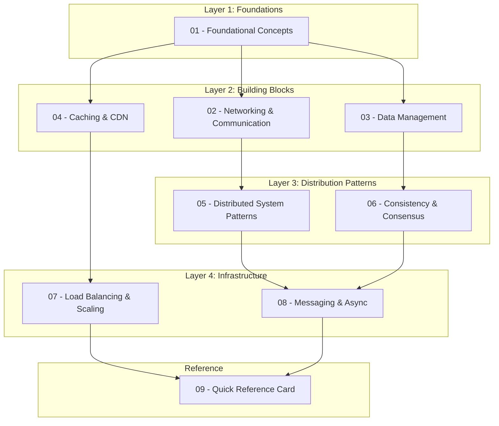
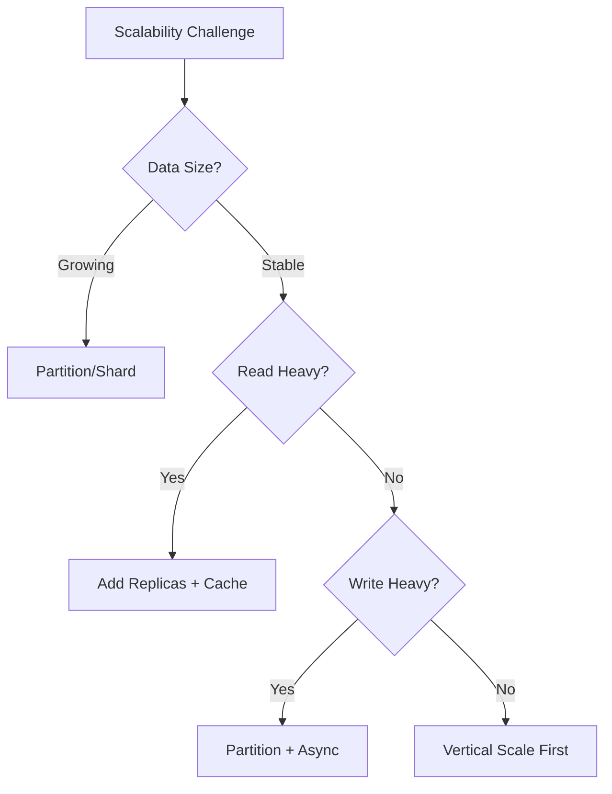

# System Design Interview Handbook

> A comprehensive, interview-ready reference for Senior-level System Design preparation.

## Purpose

This handbook distills distributed systems knowledge into a reviewable, progressively structured format designed for:

- **Systematic study** — concepts build upon each other with explicit cross-references
- **Interview rehearsal** — each topic includes trade-off analysis and articulation prompts
- **Quick reference** — diagrams encode invariants; tables summarize decision criteria

---

## How to Use This Handbook

### Before Deep Study
Start with [01-Foundational Concepts](./01-FOUNDATIONAL-CONCEPTS.md) to establish the vocabulary and mental models that recur throughout distributed systems.

### During Preparation
Work through modules in order. Each document is self-contained but references related concepts. Pay attention to:
- **Trade-off Tables** — memorize the axes of comparison
- **Mermaid Diagrams** — reconstruct them from memory as practice
- **Interview Prompts** — practice articulating decisions aloud

### Before an Interview
Review the [Quick Reference Card](./09-QUICK-REFERENCE.md) and practice back-of-envelope calculations.

---

## Document Map



---

## Module Overview

| # | Module | Core Topics | Key Trade-offs |
|---|--------|-------------|----------------|
| 01 | [Foundational Concepts](./01-FOUNDATIONAL-CONCEPTS.md) | Scalability, Availability, Reliability, Efficiency, CAP/PACELC | Consistency vs Availability, Latency vs Throughput |
| 02 | [Networking & Communication](./02-NETWORKING-COMMUNICATION.md) | HTTP/HTTPS, DNS, Proxies, WebSockets, SSE, Long-Polling | Real-time vs Polling, Forward vs Reverse Proxy |
| 03 | [Data Management](./03-DATA-MANAGEMENT.md) | SQL vs NoSQL, Indexing, Partitioning/Sharding, Replication | Normalization vs Denormalization, Horizontal vs Vertical |
| 04 | [Caching & CDN](./04-CACHING-CDN.md) | Cache strategies, Invalidation, CDN architecture, Bloom Filters | Cache-aside vs Write-through, Push vs Pull CDN |
| 05 | [Distributed Patterns](./05-DISTRIBUTED-PATTERNS.md) | Leader Election, Quorum, Heartbeat, Consistent Hashing | Strong vs Eventual Consistency, Single vs Multi-Leader |
| 06 | [Consistency & Consensus](./06-CONSISTENCY-CONSENSUS.md) | CAP deep-dive, PACELC, Replication strategies, Conflict resolution | CP vs AP systems, Sync vs Async replication |
| 07 | [Load Balancing & Scaling](./07-LOAD-BALANCING-SCALING.md) | LB algorithms, API Gateway, Horizontal/Vertical scaling | Stateful vs Stateless, L4 vs L7 balancing |
| 08 | [Messaging & Async](./08-MESSAGING-ASYNC.md) | Message Queues, Pub/Sub, Kafka, Stream vs Batch processing | At-least-once vs Exactly-once, Queue vs Topic |
| 09 | [Quick Reference](./09-QUICK-REFERENCE.md) | Estimation formulas, Latency numbers, Decision trees | — |

---

## Cross-Cutting Themes

These concepts appear across multiple modules. Understanding them deeply is essential:

### The Consistency Spectrum
```
Strong ←————————————————————————→ Eventual
Consistency                      Consistency

- Single leader sync         - Multi-leader async
- Linearizable reads         - Read-your-writes
- Higher latency             - Lower latency
- Lower availability         - Higher availability
```

### The Scalability Triangle


### Trade-off Vocabulary
When articulating design decisions, use these frames:

| Frame | Example |
|-------|---------|
| "We trade X for Y" | "We trade consistency for availability by using eventual consistency" |
| "This optimizes for X at the cost of Y" | "This optimizes for read latency at the cost of write complexity" |
| "The constraint here is X, so we choose Y" | "The constraint is sub-100ms latency, so we choose in-memory caching" |

---

## Interview Articulation Patterns

### Opening a Design Discussion
1. **Clarify requirements** — functional and non-functional
2. **Establish constraints** — scale, latency, consistency needs
3. **State assumptions** — user behavior, traffic patterns
4. **Propose high-level approach** — name the architectural style

### Defending a Decision
```
"I chose [COMPONENT] because:
 1. Our requirement for [PROPERTY] rules out [ALTERNATIVE]
 2. The trade-off of [COST] is acceptable given [CONSTRAINT]
 3. This aligns with how [REAL SYSTEM] solves similar problems"
```

### Acknowledging Limitations
```
"The weakness of this approach is [LIMITATION].
 To mitigate this, we could [MITIGATION].
 Alternatively, if [CONDITION] changes, we'd revisit [DECISION]."
```

---

## Revision History

| Date | Change |
|------|--------|
| 2025-01 | Initial handbook creation |

---

*Navigate to individual modules using the links above, or start with [01-Foundational Concepts](./01-FOUNDATIONAL-CONCEPTS.md).*
