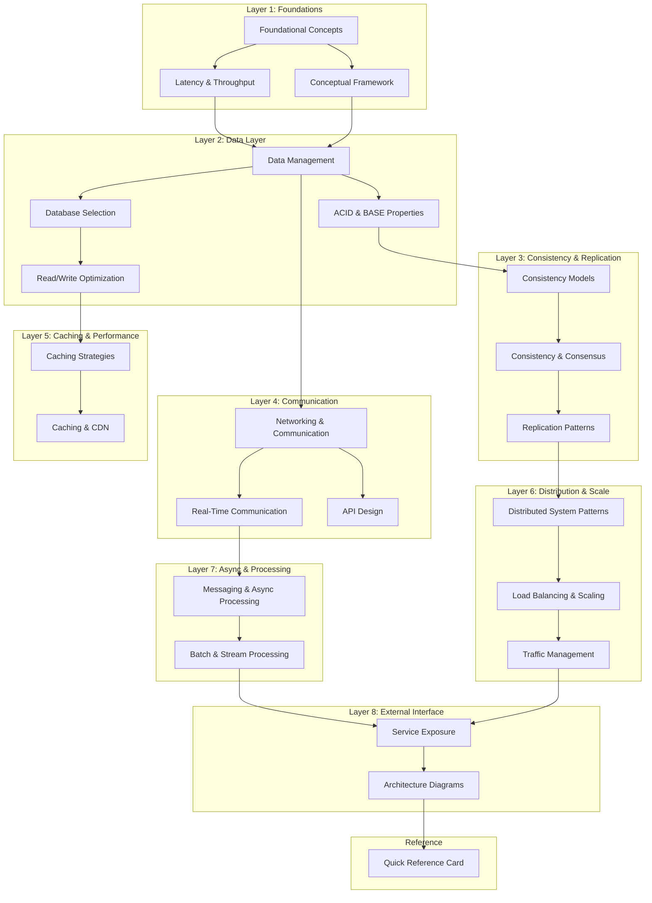
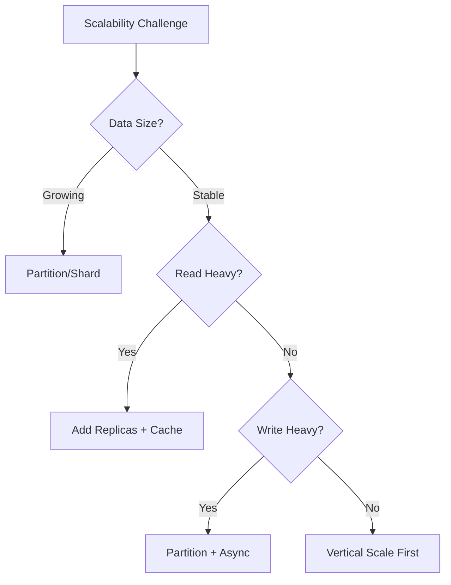

# System Design Interview Handbook

> A comprehensive, interview-ready reference for Senior-level System Design preparation.

## Purpose

This handbook distills distributed systems knowledge into a reviewable, progressively structured format designed for:

- **Systematic reference** — concepts build upon each other with explicit cross-references
- **Interview rehearsal** — each topic includes trade-off analysis and articulation prompts
- **Quick lookup** — diagrams encode invariants; tables summarize decision criteria

---

## How to Use This Handbook

### Conceptual Entry Point
Start with [Foundational Concepts](./FOUNDATIONAL_CONCEPTS.md) and [Conceptual Framework](./CONCEPTUAL_FRAMEWORK.md) to establish the vocabulary and mental models that recur throughout distributed systems.

### Reference Navigation
Documents are organized by conceptual dependency, not by reading order. Each document is self-contained but references related concepts. When studying any topic, pay attention to:
- **Trade-off Tables** — internalize the axes of comparison
- **Mermaid Diagrams** — be able to reconstruct them from memory and explain the trade-offs aloud
- **Interview Prompts** — practice articulating decisions verbally

### Quick Recall
The [Quick Reference Card](./QUICK_REFERENCE_CARD.md) consolidates estimation formulas and decision heuristics for rapid review.

---

## Conceptual Dependency Order

```
Foundations → Data → Consistency → Communication → Infrastructure → Integration
```

This ordering reflects conceptual prerequisites, not a prescribed study sequence. Master earlier concepts before relying on later ones.

---

## Document Map



---

## Module Index

### Layer 1: Foundations

| Module | Core Topics | Key Trade-offs |
|--------|-------------|----------------|
| [Foundational Concepts](./FOUNDATIONAL_CONCEPTS.md) | Scalability, Availability, Reliability, Efficiency, CAP/PACELC | Consistency vs Availability, Latency vs Throughput |
| [Conceptual Framework](./CONCEPTUAL_FRAMEWORK.md) | Mental models, Architectural thinking, Problem decomposition | Simplicity vs Flexibility |
| [Latency & Throughput](./LATENCY_AND_THROUGHPUT.md) | Performance metrics, Bottleneck analysis, SLOs/SLAs | Latency vs Throughput optimization |

### Layer 2: Data Layer

| Module | Core Topics | Key Trade-offs |
|--------|-------------|----------------|
| [Data Management](./DATA_MANAGEMENT.md) | SQL vs NoSQL, Indexing, Partitioning/Sharding | Normalization vs Denormalization |
| [Database Selection](./DATABASE_SELECTION.md) | Database categories, Selection criteria, Use case mapping | Specialization vs Generalization |
| [ACID & BASE Properties](./ACID_AND_BASE_PROPERTIES.md) | Transaction guarantees, Isolation levels, BASE semantics | Strong vs Eventual consistency |
| [Read/Write Optimization](./READ_WRITE_OPTIMIZATION.md) | Read replicas, Write scaling, CQRS patterns | Read vs Write optimization |

### Layer 3: Consistency & Replication

| Module | Core Topics | Key Trade-offs |
|--------|-------------|----------------|
| [Consistency Models](./CONSISTENCY_MODELS.md) | Linearizability, Sequential, Causal, Eventual | Consistency strength vs Performance |
| [Consistency & Consensus](./CONSISTENCY_AND_CONCENSUS.md) | CAP deep-dive, PACELC, Consensus protocols | CP vs AP systems |
| [Replication Patterns](./REPLICATION_PATTERNS.md) | Single-leader, Multi-leader, Leaderless, Conflict resolution | Availability vs Consistency |

### Layer 4: Communication

| Module | Core Topics | Key Trade-offs |
|--------|-------------|----------------|
| [Networking & Communication](./NETWORKING_AND_COMMUNICATION.md) | HTTP/HTTPS, DNS, Proxies, TCP/UDP | Reliability vs Performance |
| [Real-Time Communication](./REAL_TIME_COMMUNICATION.md) | WebSockets, SSE, Long-Polling, gRPC streaming | Real-time vs Polling |
| [API Design](./API_DESIGN.md) | REST, GraphQL, gRPC, API versioning | Flexibility vs Simplicity |

### Layer 5: Caching & Performance

| Module | Core Topics | Key Trade-offs |
|--------|-------------|----------------|
| [Caching Strategies](./CACHING_STRATEGIES.md) | Cache patterns, Eviction policies, Cache coherence | Hit rate vs Freshness |
| [Caching & CDN](./CACHING_AND_CDN.md) | CDN architecture, Edge caching, Invalidation | Push vs Pull CDN |

### Layer 6: Distribution & Scale

| Module | Core Topics | Key Trade-offs |
|--------|-------------|----------------|
| [Distributed System Patterns](./DISTRIBUTED_SYSTEM_PATTERNS.md) | Leader Election, Quorum, Heartbeat, Consistent Hashing | Coordination overhead vs Fault tolerance |
| [Load Balancing & Scaling](./LOAD_BALANCING_AND_SCALING.md) | LB algorithms, Horizontal/Vertical scaling | Stateful vs Stateless |
| [Traffic Management](./TRAFFIC_MANAGEMENT.md) | Rate limiting, Circuit breakers, Backpressure | Protection vs Availability |

### Layer 7: Async & Processing

| Module | Core Topics | Key Trade-offs |
|--------|-------------|----------------|
| [Messaging & Async Processing](./MESSAGING_AND_SYNCHRONOUS_PROCESSING.md) | Message Queues, Pub/Sub, Delivery guarantees | At-least-once vs Exactly-once |
| [Batch & Stream Processing](./BATCH_AND_STREAM_PROCESSING.md) | Batch vs Stream, Lambda/Kappa architecture | Latency vs Throughput |

### Layer 8: External Interface

| Module | Core Topics | Key Trade-offs |
|--------|-------------|----------------|
| [Service Exposure](./SERVICE_EXPOSURE.md) | API Gateway, Service mesh, Authentication | Security vs Performance |
| [Architecture Diagrams](./ARCHITECTURE_DIAGRAMS.md) | System visualization, Component interaction, Data flow | Abstraction level vs Detail |

### Reference

| Module | Core Topics |
|--------|-------------|
| [Quick Reference Card](./QUICK_REFERENCE_CARD.md) | Estimation formulas, Latency numbers, Decision trees |

---

## Cross-Cutting Themes

These concepts appear across multiple modules. Deep understanding of these is essential:

### The Consistency Spectrum
```
Strong ←────────────────────────────→ Eventual
Consistency                           Consistency

- Single leader sync              - Multi-leader async
- Linearizable reads              - Read-your-writes
- Higher latency                  - Lower latency
- Lower availability              - Higher availability
```

### The Scalability Decision Tree


### Trade-off Vocabulary

When articulating design decisions, use these frames:

| Frame | Example |
|-------|---------|
| "We trade X for Y" | "We trade consistency for availability by using eventual consistency" |
| "This optimizes for X at the cost of Y" | "This optimizes for read latency at the cost of write complexity" |
| "The constraint here is X, so we choose Y" | "The constraint is sub-100ms latency, so we choose in-memory caching" |

---

## Interview Articulation Patterns

### Opening a Design Discussion
1. **Clarify requirements** — functional and non-functional
2. **Establish constraints** — scale, latency, consistency needs
3. **State assumptions** — user behavior, traffic patterns
4. **Propose high-level approach** — name the architectural style

### Defending a Decision
```
"I chose [COMPONENT] because:
 1. Our requirement for [PROPERTY] rules out [ALTERNATIVE]
 2. The trade-off of [COST] is acceptable given [CONSTRAINT]
 3. This aligns with how [REAL SYSTEM] solves similar problems"
```

### Acknowledging Limitations
```
"The weakness of this approach is [LIMITATION].
 To mitigate this, we could [MITIGATION].
 Alternatively, if [CONDITION] changes, we'd revisit [DECISION]."
```

---

## Practice Heuristics

For each module:
- Be able to reconstruct core diagrams from memory and explain the trade-offs aloud
- Articulate when you would choose one approach over another
- Name a real-world system that exemplifies each pattern
- Identify the failure modes and mitigations for each design choice

---

## Revision History

| Version | Change |
|---------|--------|
| v1.0 | Initial handbook creation |
| v1.1 | Expanded to 22 modules, removed temporal study guidance |

---

*Navigate to individual modules using the links above, or start with [Foundational Concepts](./FOUNDATIONAL_CONCEPTS.md).*
