# 14 - Read/Write Optimization

## Overview

Optimizing read and write operations is fundamental to building performant systems. The strategies differ significantly based on whether your workload is read-heavy, write-heavy, or balanced. This document covers optimization techniques, caching strategies, and how to reason about read/write trade-offs in system design.

---

## Core Mental Model

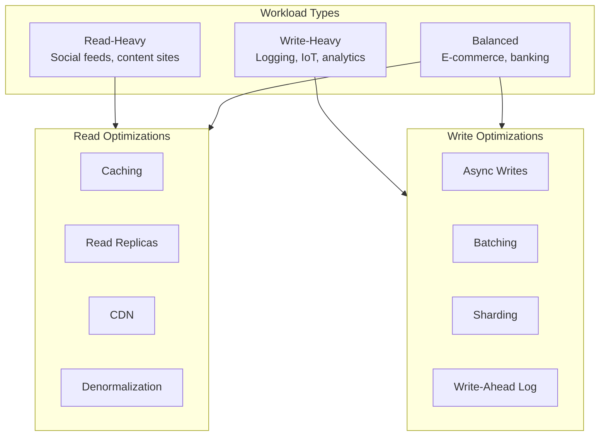
```mermaid
flowchart TD
    subgraph Workloads["Workload Types"]
        ReadHeavy["Read-Heavy<br/>Social feeds, content sites"]
        WriteHeavy["Write-Heavy<br/>Logging, IoT, analytics"]
        Balanced["Balanced<br/>E-commerce, banking"]
    end
    
    subgraph ReadOpt["Read Optimizations"]
        Cache[Caching]
        Replica[Read Replicas]
        CDN[CDN]
        Denorm[Denormalization]
    end
    
    subgraph WriteOpt["Write Optimizations"]
        Async[Async Writes]
        Batch[Batching]
        Shard[Sharding]
        WAL[Write-Ahead Log]
    end
    
    ReadHeavy --> ReadOpt
    WriteHeavy --> WriteOpt
    Balanced --> ReadOpt
    Balanced --> WriteOpt
```

---

## Read Optimization Strategies

### 1. Caching

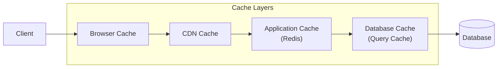
```mermaid
flowchart LR
    subgraph CacheLayers["Cache Layers"]
        Browser["Browser Cache"]
        CDN2["CDN Cache"]
        AppCache["Application Cache<br/>(Redis)"]
        DBCache["Database Cache<br/>(Query Cache)"]
    end
    
    Client --> Browser
    Browser --> CDN2
    CDN2 --> AppCache
    AppCache --> DBCache
    DBCache --> DB[(Database)]
```

#### Cache-Aside Pattern

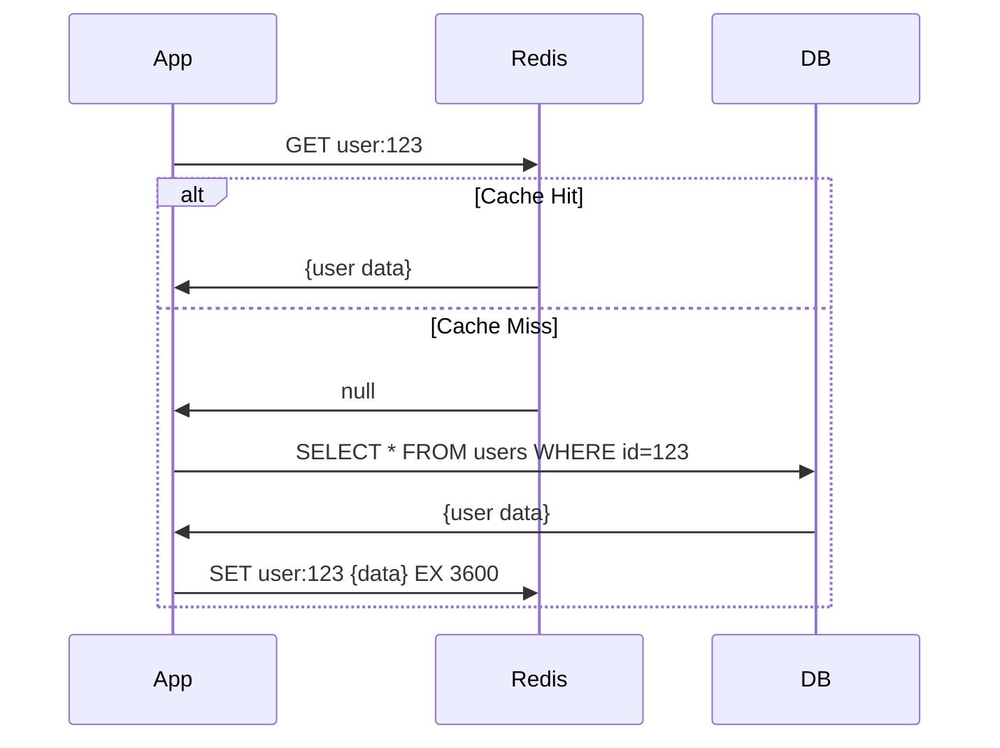
```mermaid
sequenceDiagram
    participant App
    participant Cache as Redis
    participant DB
    
    App->>Cache: GET user:123
    alt Cache Hit
        Cache->>App: {user data}
    else Cache Miss
        Cache->>App: null
        App->>DB: SELECT * FROM users WHERE id=123
        DB->>App: {user data}
        App->>Cache: SET user:123 {data} EX 3600
    end
```

```python
class CacheAside:
    def __init__(self, cache, db):
        self.cache = cache
        self.db = db
    
    def get(self, key: str):
        # Try cache first
        value = self.cache.get(key)
        if value:
            return value
        
        # Cache miss - fetch from DB
        value = self.db.query(key)
        if value:
            self.cache.set(key, value, ex=3600)
        return value
    
    def update(self, key: str, value):
        # Update DB first
        self.db.update(key, value)
        # Invalidate cache
        self.cache.delete(key)
```

#### Read-Through Cache

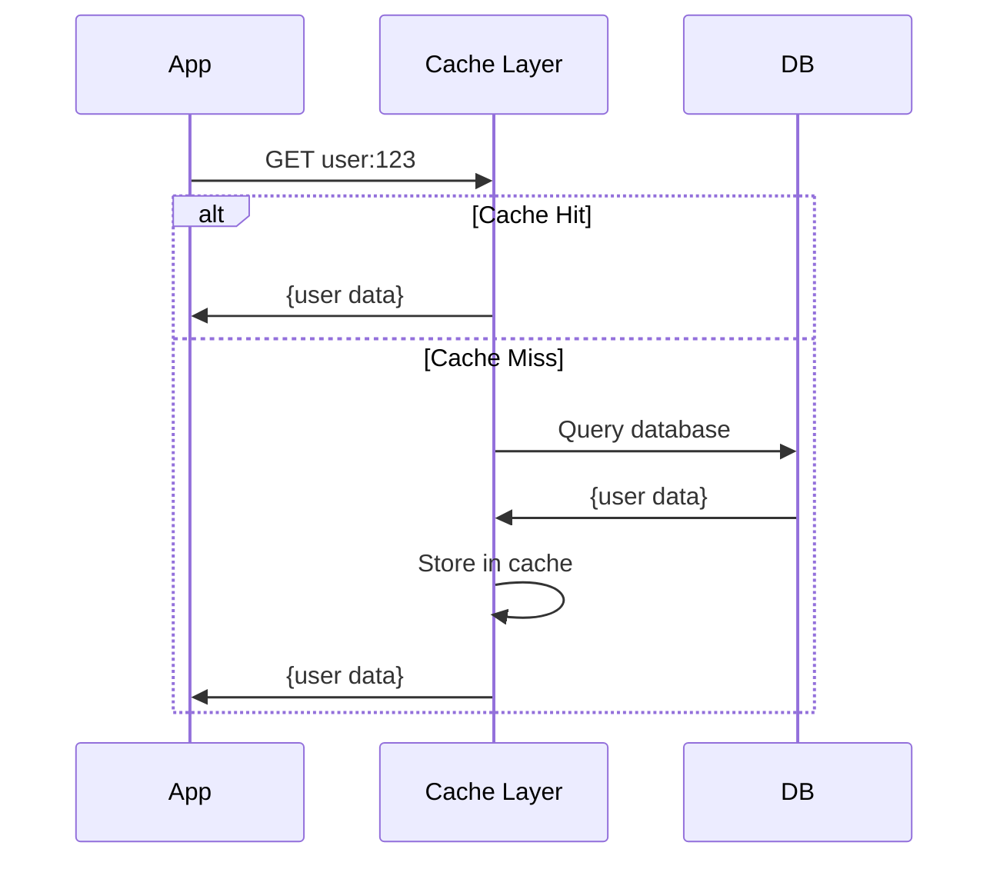
```mermaid
sequenceDiagram
    participant App
    participant Cache as Cache Layer
    participant DB
    
    App->>Cache: GET user:123
    alt Cache Hit
        Cache->>App: {user data}
    else Cache Miss
        Cache->>DB: Query database
        DB->>Cache: {user data}
        Cache->>Cache: Store in cache
        Cache->>App: {user data}
    end
```

#### Write-Through Cache

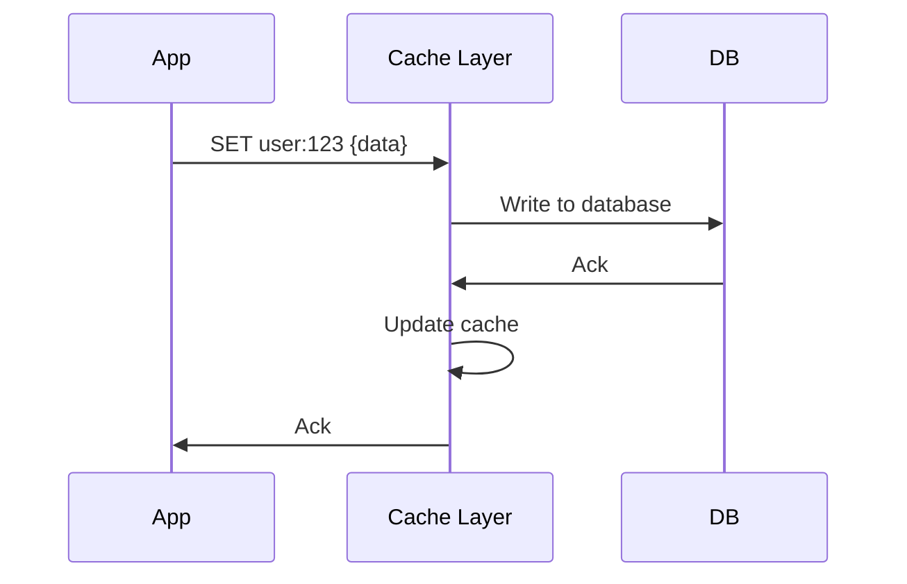
```mermaid
sequenceDiagram
    participant App
    participant Cache as Cache Layer
    participant DB
    
    App->>Cache: SET user:123 {data}
    Cache->>DB: Write to database
    DB->>Cache: Ack
    Cache->>Cache: Update cache
    Cache->>App: Ack
```

#### Write-Behind (Write-Back) Cache

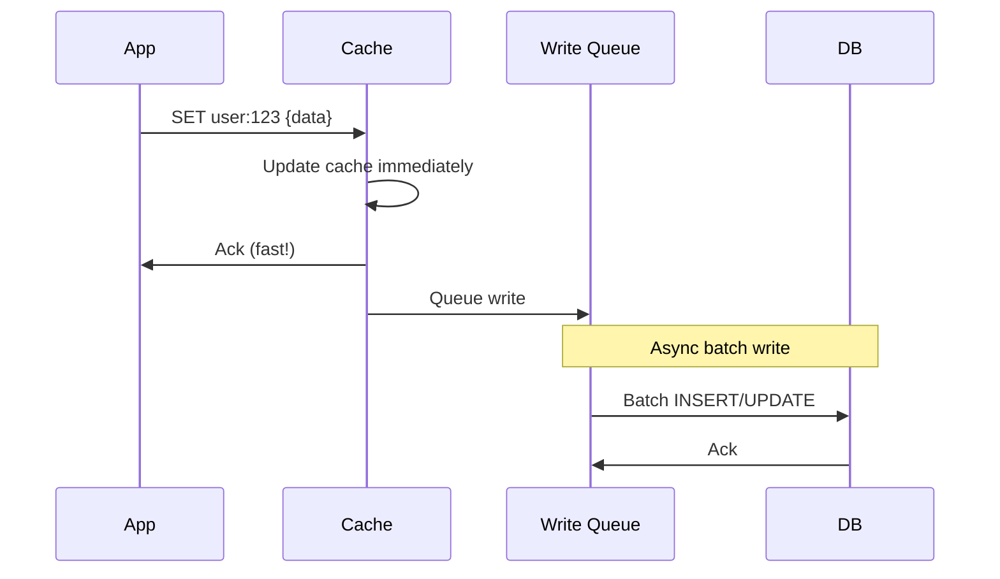
```mermaid
sequenceDiagram
    participant App
    participant Cache
    participant Queue as Write Queue
    participant DB
    
    App->>Cache: SET user:123 {data}
    Cache->>Cache: Update cache immediately
    Cache->>App: Ack (fast!)
    Cache->>Queue: Queue write
    
    Note over Queue,DB: Async batch write
    Queue->>DB: Batch INSERT/UPDATE
    DB->>Queue: Ack
```

| Pattern | Read Perf | Write Perf | Consistency | Use Case |
|---------|-----------|------------|-------------|----------|
| Cache-Aside | Good | Good | App manages | General purpose |
| Read-Through | Best | N/A | Auto-managed | Read-heavy |
| Write-Through | Good | Slower | Strong | Consistency critical |
| Write-Behind | Good | Best | Eventually | Write-heavy |

### 2. Read Replicas

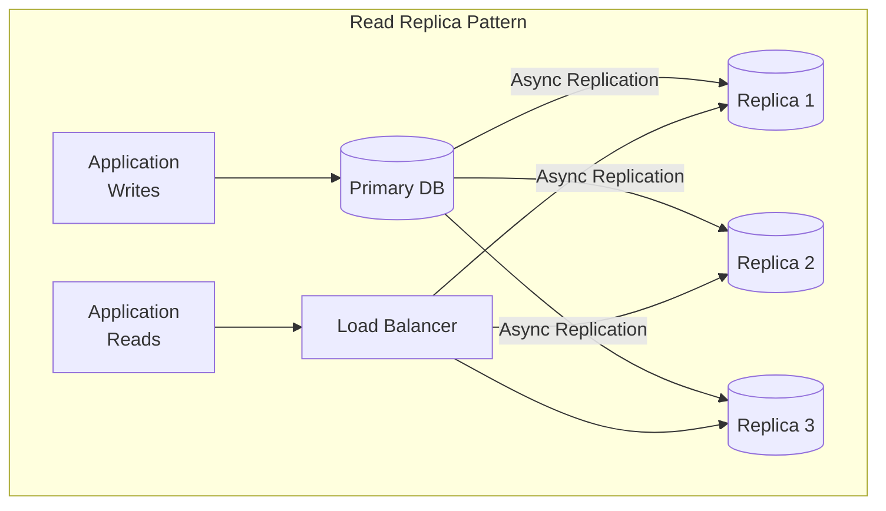
```mermaid
flowchart TB
    subgraph Replication["Read Replica Pattern"]
        Writer[Application<br/>Writes] --> Primary[(Primary DB)]
        Primary -->|"Async Replication"| R1[(Replica 1)]
        Primary -->|"Async Replication"| R2[(Replica 2)]
        Primary -->|"Async Replication"| R3[(Replica 3)]
        
        Reader[Application<br/>Reads] --> LB[Load Balancer]
        LB --> R1
        LB --> R2
        LB --> R3
    end
```

### 3. Denormalization

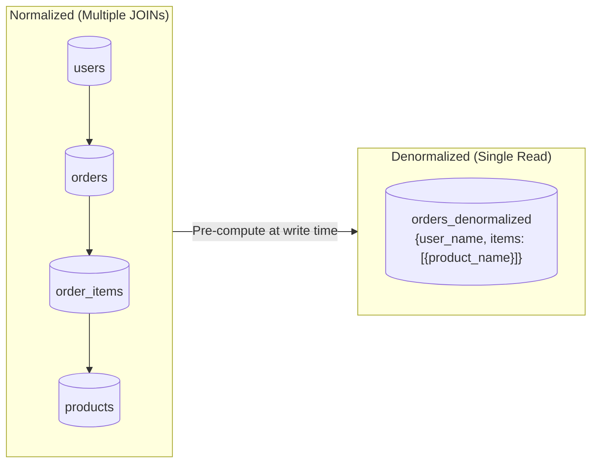
```mermaid
flowchart LR
    subgraph Normalized["Normalized (Multiple JOINs)"]
        Users[(users)]
        Orders[(orders)]
        Products[(products)]
        OrderItems[(order_items)]
        
        Users --> Orders
        Orders --> OrderItems
        OrderItems --> Products
    end
    
    subgraph Denormalized["Denormalized (Single Read)"]
        OrdersDenorm[("orders_denormalized<br/>{user_name, items: [{product_name}]}")]
    end
    
    Normalized -->|"Pre-compute at write time"| Denormalized
```

```sql
-- Normalized: 4 JOINs
SELECT o.id, u.name, p.name, oi.quantity
FROM orders o
JOIN users u ON o.user_id = u.id
JOIN order_items oi ON oi.order_id = o.id
JOIN products p ON oi.product_id = p.id
WHERE o.id = 123;

-- Denormalized: Single read
SELECT * FROM orders_denormalized WHERE id = 123;
```

| Aspect | Normalized | Denormalized |
|--------|------------|--------------|
| Read Performance | Slower (JOINs) | Faster (single read) |
| Write Performance | Faster | Slower (update multiple places) |
| Storage | Less | More (duplicated data) |
| Consistency | Automatic | Must be maintained |

---

## Write Optimization Strategies

### 1. Async Writes

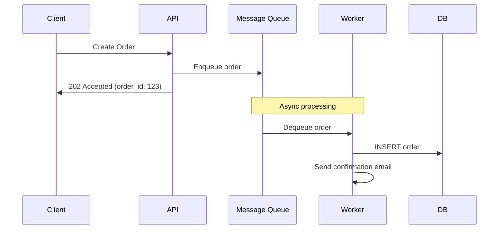
```mermaid
sequenceDiagram
    participant Client
    participant API
    participant Queue as Message Queue
    participant Worker
    participant DB
    
    Client->>API: Create Order
    API->>Queue: Enqueue order
    API->>Client: 202 Accepted (order_id: 123)
    
    Note over Queue,Worker: Async processing
    
    Queue->>Worker: Dequeue order
    Worker->>DB: INSERT order
    Worker->>Worker: Send confirmation email
```

### 2. Batching

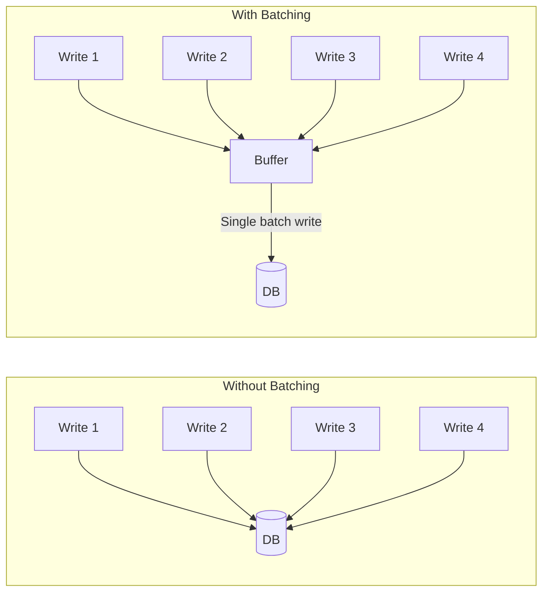
```mermaid
flowchart LR
    subgraph WithoutBatch["Without Batching"]
        W1[Write 1] --> DB1[(DB)]
        W2[Write 2] --> DB1
        W3[Write 3] --> DB1
        W4[Write 4] --> DB1
    end
    
    subgraph WithBatch["With Batching"]
        W5[Write 1] --> Buffer[Buffer]
        W6[Write 2] --> Buffer
        W7[Write 3] --> Buffer
        W8[Write 4] --> Buffer
        Buffer -->|"Single batch write"| DB2[(DB)]
    end
```

```python
class BatchWriter:
    def __init__(self, db, batch_size=100, flush_interval=1.0):
        self.db = db
        self.batch_size = batch_size
        self.flush_interval = flush_interval
        self.buffer = []
        self.last_flush = time.time()
    
    def write(self, record):
        self.buffer.append(record)
        
        if (len(self.buffer) >= self.batch_size or 
            time.time() - self.last_flush >= self.flush_interval):
            self.flush()
    
    def flush(self):
        if self.buffer:
            self.db.bulk_insert(self.buffer)
            self.buffer = []
            self.last_flush = time.time()
```

### 3. Write-Ahead Log (WAL)

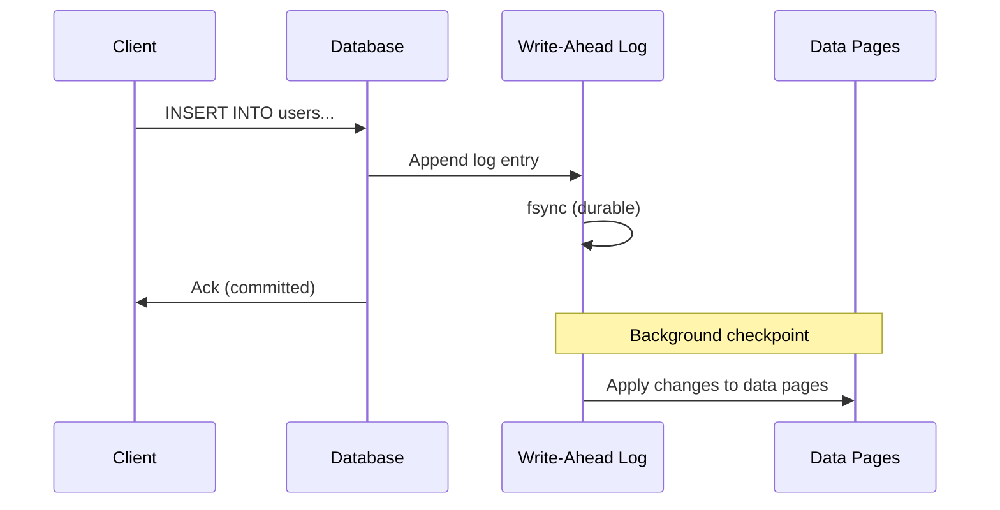
```mermaid
sequenceDiagram
    participant Client
    participant DB as Database
    participant WAL as Write-Ahead Log
    participant DataFiles as Data Pages
    
    Client->>DB: INSERT INTO users...
    DB->>WAL: Append log entry
    WAL->>WAL: fsync (durable)
    DB->>Client: Ack (committed)
    
    Note over WAL,DataFiles: Background checkpoint
    WAL->>DataFiles: Apply changes to data pages
```

### 4. LSM Trees (Log-Structured Merge Trees)

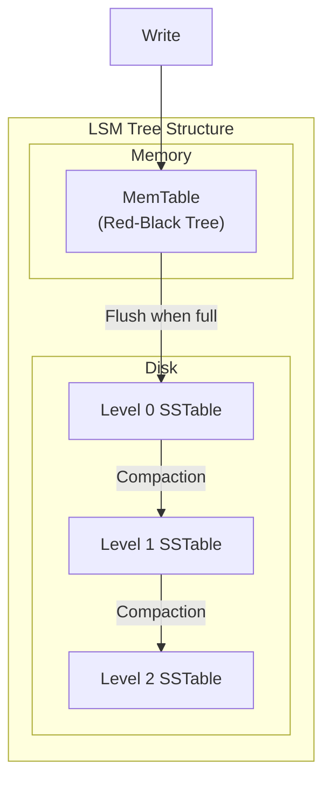
```mermaid
flowchart TB
    subgraph LSM["LSM Tree Structure"]
        subgraph Memory["Memory"]
            MemTable["MemTable<br/>(Red-Black Tree)"]
        end
        
        subgraph Disk["Disk"]
            L0["Level 0 SSTable"]
            L1["Level 1 SSTable"]
            L2["Level 2 SSTable"]
        end
    end
    
    Write[Write] --> MemTable
    MemTable -->|"Flush when full"| L0
    L0 -->|"Compaction"| L1
    L1 -->|"Compaction"| L2
```

**Write Path**: Write to memory (fast) → flush to disk as sorted files

**Read Path**: Check memory → check each level (can be slow)

| LSM Trees | B+ Trees |
|-----------|----------|
| Write-optimized | Read-optimized |
| Sequential writes | Random writes |
| Compaction overhead | No compaction |
| Used in: Cassandra, LevelDB | Used in: MySQL, PostgreSQL |

---

## Sharding for Write Scalability

### Horizontal Partitioning

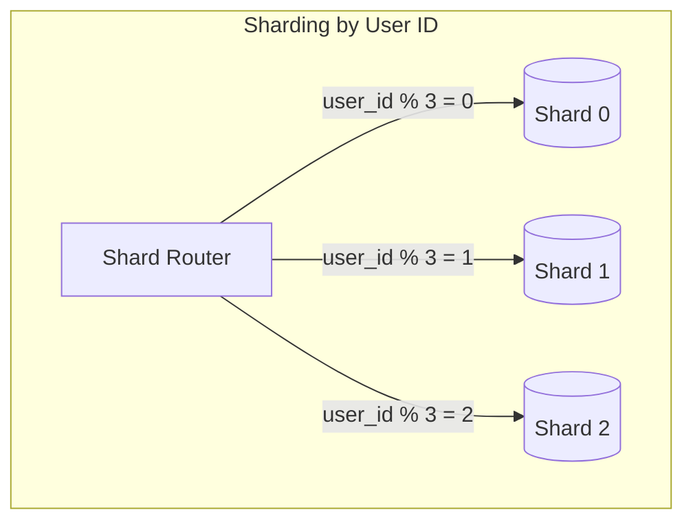
```mermaid
flowchart TB
    subgraph Sharding["Sharding by User ID"]
        Router[Shard Router]
        
        Router -->|"user_id % 3 = 0"| S0[(Shard 0)]
        Router -->|"user_id % 3 = 1"| S1[(Shard 1)]
        Router -->|"user_id % 3 = 2"| S2[(Shard 2)]
    end
```

### Sharding Strategies

| Strategy | Description | Pros | Cons |
|----------|-------------|------|------|
| **Hash-based** | hash(key) % N | Even distribution | Hard to add shards |
| **Range-based** | key ranges | Range queries | Hotspots possible |
| **Directory-based** | Lookup table | Flexible | Lookup overhead |
| **Consistent hashing** | Hash ring | Easy to add/remove | Uneven with few nodes |

### Consistent Hashing

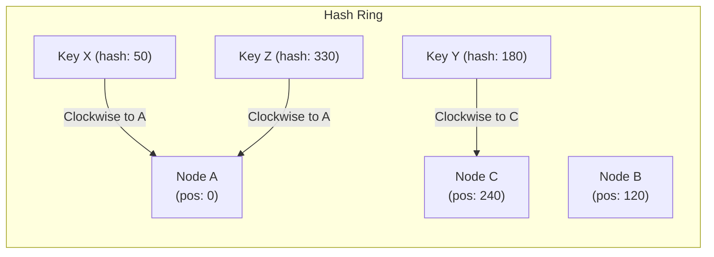
```mermaid
flowchart TB
    subgraph Ring["Hash Ring"]
        direction TB
        N1["Node A<br/>(pos: 0)"]
        N2["Node B<br/>(pos: 120)"]
        N3["Node C<br/>(pos: 240)"]
        
        K1["Key X (hash: 50)"]
        K2["Key Y (hash: 180)"]
        K3["Key Z (hash: 330)"]
    end
    
    K1 -->|"Clockwise to A"| N1
    K2 -->|"Clockwise to C"| N3
    K3 -->|"Clockwise to A"| N1
```

When Node B is removed, only keys between A and B move to C.

---

## CQRS (Command Query Responsibility Segregation)

### Pattern

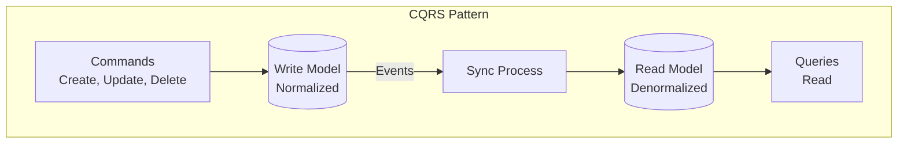
```mermaid
flowchart TB
    subgraph CQRS["CQRS Pattern"]
        Commands[Commands<br/>Create, Update, Delete]
        Queries[Queries<br/>Read]
        
        Commands --> WriteModel[(Write Model<br/>Normalized)]
        WriteModel -->|"Events"| Sync[Sync Process]
        Sync --> ReadModel[(Read Model<br/>Denormalized)]
        ReadModel --> Queries
    end
```

### Implementation Example

```python
# Command side
class OrderCommandHandler:
    def __init__(self, write_db, event_bus):
        self.write_db = write_db
        self.event_bus = event_bus
    
    def create_order(self, order_data):
        # Write to normalized database
        order = self.write_db.orders.insert(order_data)
        
        # Publish event for read model sync
        self.event_bus.publish('OrderCreated', {
            'order_id': order.id,
            'user_id': order.user_id,
            'items': order.items,
            'total': order.total
        })
        return order.id

# Query side
class OrderQueryHandler:
    def __init__(self, read_db):
        self.read_db = read_db  # Denormalized read model
    
    def get_user_orders(self, user_id):
        # Fast read from denormalized view
        return self.read_db.user_orders.find({'user_id': user_id})

# Event handler to sync read model
class OrderEventHandler:
    def __init__(self, read_db):
        self.read_db = read_db
    
    def handle_order_created(self, event):
        # Update denormalized read model
        self.read_db.user_orders.upsert({
            'user_id': event['user_id'],
            'orders': {'$push': {
                'order_id': event['order_id'],
                'total': event['total'],
                'item_count': len(event['items'])
            }}
        })
```

---

## Indexing Strategies

### Index Types

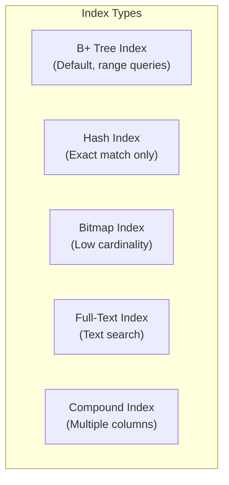
```mermaid
flowchart TB
    subgraph Indexes["Index Types"]
        BTree["B+ Tree Index<br/>(Default, range queries)"]
        Hash["Hash Index<br/>(Exact match only)"]
        Bitmap["Bitmap Index<br/>(Low cardinality)"]
        FullText["Full-Text Index<br/>(Text search)"]
        Compound["Compound Index<br/>(Multiple columns)"]
    end
```

### Compound Index Ordering

```sql
-- Index on (status, created_at)

-- ✅ Uses index
SELECT * FROM orders WHERE status = 'pending' AND created_at > '2024-01-01';
SELECT * FROM orders WHERE status = 'pending';

-- ❌ Cannot use index efficiently
SELECT * FROM orders WHERE created_at > '2024-01-01';  -- Status not specified
```

**Rule**: Leftmost prefix of compound index must be used.

### Covering Index

```sql
-- Query only needs indexed columns
CREATE INDEX idx_covering ON orders(user_id, status, total);

-- This query is "covered" - no table lookup needed
SELECT status, total FROM orders WHERE user_id = 123;
```

---

## Read/Write Trade-off Patterns

### Pattern Comparison

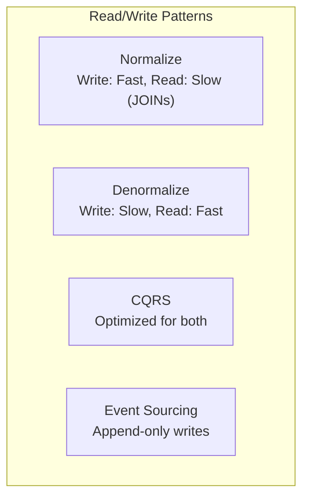
```mermaid
flowchart TB
    subgraph Patterns["Read/Write Patterns"]
        P1["Normalize<br/>Write: Fast, Read: Slow (JOINs)"]
        P2["Denormalize<br/>Write: Slow, Read: Fast"]
        P3["CQRS<br/>Optimized for both"]
        P4["Event Sourcing<br/>Append-only writes"]
    end
```

### Decision Framework

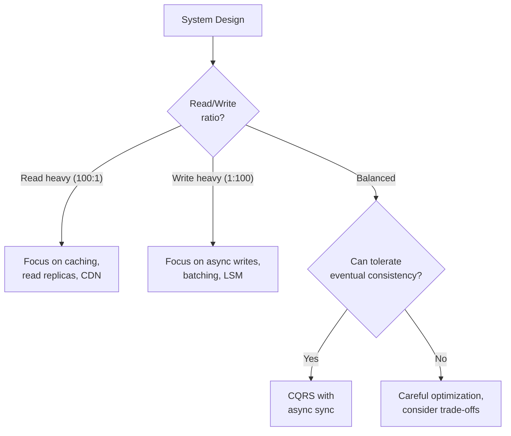
```mermaid
flowchart TD
    Start[System Design] --> Q1{Read/Write<br/>ratio?}
    
    Q1 -->|"Read heavy (100:1)"| R1[Focus on caching,<br/>read replicas, CDN]
    Q1 -->|"Write heavy (1:100)"| W1[Focus on async writes,<br/>batching, LSM]
    Q1 -->|"Balanced"| B1{Can tolerate<br/>eventual consistency?}
    
    B1 -->|Yes| CQRS[CQRS with<br/>async sync]
    B1 -->|No| Careful[Careful optimization,<br/>consider trade-offs]
```

---

## Interview Scenarios

### Scenario 1: Social Media Feed

**Requirements**: 1B users, 10K reads/sec, 100 writes/sec per user

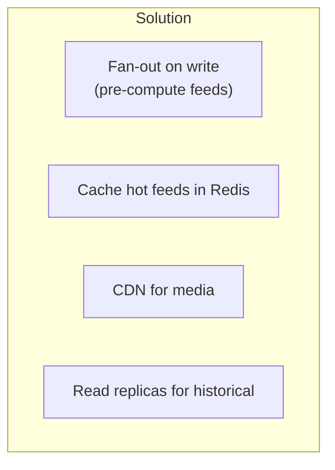
```mermaid
flowchart TB
    subgraph Solution
        S1["Fan-out on write<br/>(pre-compute feeds)"]
        S2["Cache hot feeds in Redis"]
        S3["CDN for media"]
        S4["Read replicas for historical"]
    end
```

**Talking Points**:
- Fan-out on write: Pre-compute feeds on post
- Cache recent feeds in Redis
- Lazy load historical posts
- Hybrid: Fan-out for regular users, fan-out on read for celebrities

### Scenario 2: Analytics Dashboard

**Requirements**: Billions of events/day, complex aggregations

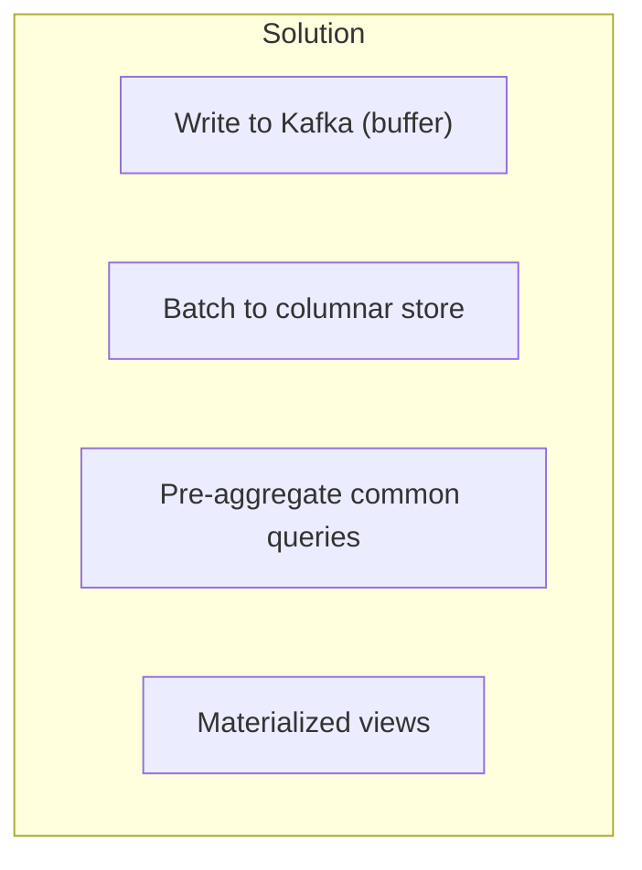
```mermaid
flowchart TB
    subgraph Solution
        S1["Write to Kafka (buffer)"]
        S2["Batch to columnar store"]
        S3["Pre-aggregate common queries"]
        S4["Materialized views"]
    end
```

**Talking Points**:
- LSM-tree storage (Cassandra, ClickHouse)
- Pre-aggregation at write time
- Materialized views for common queries
- Tiered storage (hot/warm/cold)

### Scenario 3: E-Commerce Inventory

**Requirements**: Strong consistency, high read/write

```mermaid
flowchart TB
    subgraph Solution
        S1["Optimistic locking"]
        S2["Read-through cache"]
        S3["Invalidate on write"]
        S4["Separate read replicas for catalog"]
    end
```

---

## Quick Reference

```
┌─────────────────────────────────────────────────────────────────┐
│              READ/WRITE OPTIMIZATION CHEAT SHEET                │
├─────────────────────────────────────────────────────────────────┤
│ READ OPTIMIZATIONS:                                             │
│   • Caching (Redis, Memcached, CDN)                             │
│   • Read replicas (distribute load)                             │
│   • Denormalization (trade storage for speed)                   │
│   • Indexing (B+ tree, covering indexes)                        │
├─────────────────────────────────────────────────────────────────┤
│ WRITE OPTIMIZATIONS:                                            │
│   • Async writes (queue + workers)                              │
│   • Batching (buffer + bulk insert)                             │
│   • LSM trees (append-only, compact later)                      │
│   • Sharding (horizontal scaling)                               │
├─────────────────────────────────────────────────────────────────┤
│ CACHING PATTERNS:                                               │
│   • Cache-Aside: App manages cache                              │
│   • Read-Through: Cache loads on miss                           │
│   • Write-Through: Write to cache + DB                          │
│   • Write-Behind: Write to cache, async to DB                   │
├─────────────────────────────────────────────────────────────────┤
│ DECISION:                                                       │
│   • Read-heavy? → Cache + replicas + denormalize                │
│   • Write-heavy? → Async + batch + LSM + shard                  │
│   • Both? → CQRS with separate models                           │
└─────────────────────────────────────────────────────────────────┘
```

---

## Practice Questions

1. Design a caching strategy for an e-commerce product catalog with 10M products.
2. How would you handle cache invalidation in a distributed system?
3. Compare fan-out on write vs. fan-out on read for a social media feed.
4. Design the write path for a system ingesting 1M events per second.
5. Explain when you would use CQRS and what are its trade-offs.
