# 09 - Real-Time Communication: Polling, WebSockets, Webhooks

## Overview

Real-time communication enables systems to push updates to clients or other services without waiting for explicit requests. The choice between polling, long-polling, Server-Sent Events (SSE), WebSockets, and webhooks depends on latency requirements, connection overhead, and architectural constraints. This document provides a systematic framework for evaluating real-time patterns.

---

## Core Mental Model

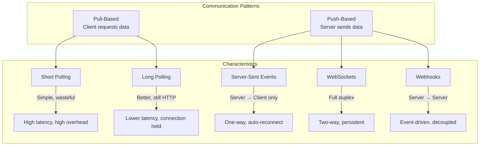
```mermaid
flowchart TD
    subgraph Patterns["Communication Patterns"]
        Pull[Pull-Based<br/>Client requests data]
        Push[Push-Based<br/>Server sends data]
    end
    
    Pull --> Polling[Short Polling]
    Pull --> LongPoll[Long Polling]
    
    Push --> SSE[Server-Sent Events]
    Push --> WS[WebSockets]
    Push --> Webhook[Webhooks]
    
    subgraph Characteristics
        Polling -->|"Simple, wasteful"| C1[High latency, high overhead]
        LongPoll -->|"Better, still HTTP"| C2[Lower latency, connection held]
        SSE -->|"Server → Client only"| C3[One-way, auto-reconnect]
        WS -->|"Full duplex"| C4[Two-way, persistent]
        Webhook -->|"Server → Server"| C5[Event-driven, decoupled]
    end
```

**Key Insight**: The spectrum ranges from simple (polling) to complex (WebSockets). Choose the simplest approach that meets your latency and efficiency requirements.

---

## Short Polling

### Mechanism

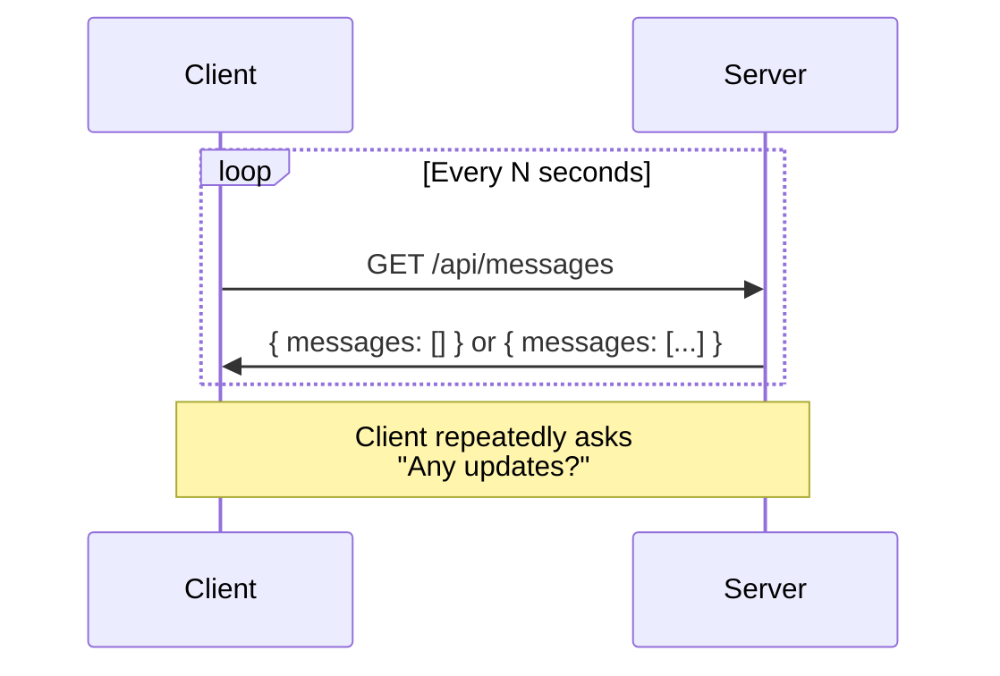
```mermaid
sequenceDiagram
    participant Client
    participant Server
    
    loop Every N seconds
        Client->>Server: GET /api/messages
        Server->>Client: { messages: [] } or { messages: [...] }
    end
    
    Note over Client,Server: Client repeatedly asks<br/>"Any updates?"
```

### Implementation

```javascript
// Client-side polling
function pollForUpdates() {
    setInterval(async () => {
        try {
            const response = await fetch('/api/messages?since=' + lastTimestamp);
            const data = await response.json();
            if (data.messages.length > 0) {
                handleNewMessages(data.messages);
                lastTimestamp = data.messages[data.messages.length - 1].timestamp;
            }
        } catch (error) {
            console.error('Polling failed:', error);
        }
    }, 5000); // Poll every 5 seconds
}
```

### Characteristics

| Aspect | Value |
|--------|-------|
| **Latency** | High (up to polling interval) |
| **Server Load** | High (constant requests even without updates) |
| **Complexity** | Very Low |
| **Scalability** | Poor (N clients = N requests/interval) |
| **Use Case** | Dashboards with minute-level freshness, legacy systems |

---

## Long Polling

### Mechanism

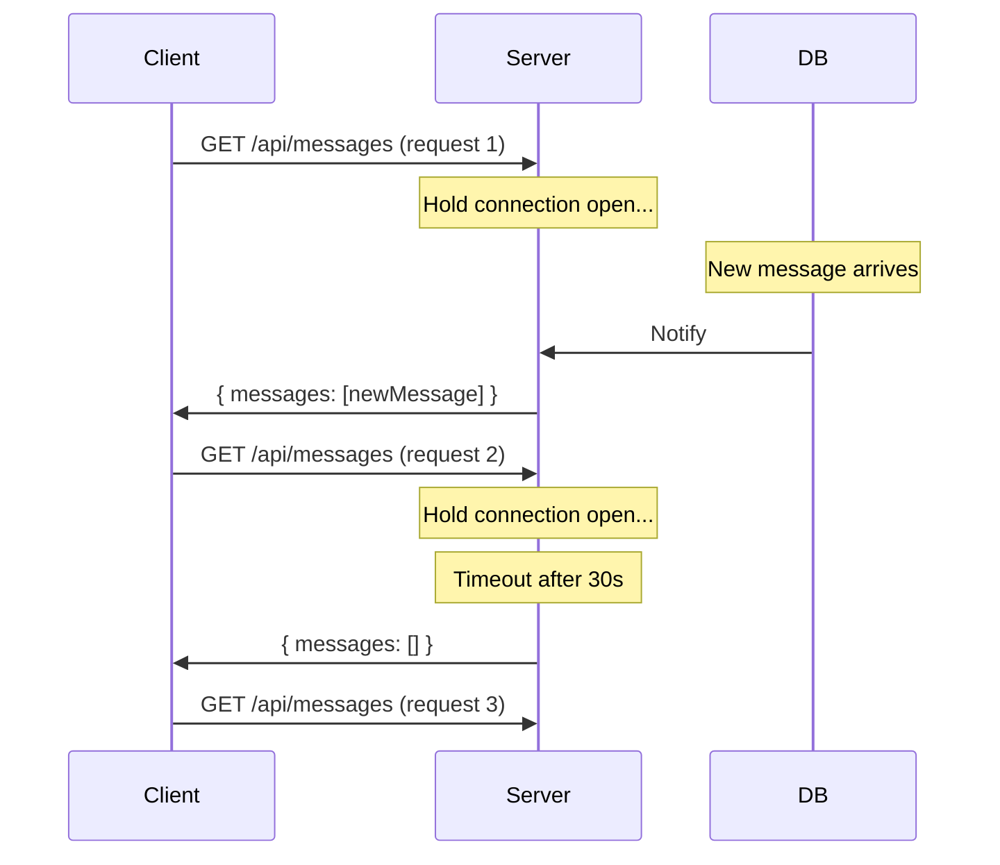
```mermaid
sequenceDiagram
    participant Client
    participant Server
    participant DB
    
    Client->>Server: GET /api/messages (request 1)
    Note over Server: Hold connection open...
    
    Note over DB: New message arrives
    DB->>Server: Notify
    Server->>Client: { messages: [newMessage] }
    
    Client->>Server: GET /api/messages (request 2)
    Note over Server: Hold connection open...
    Note over Server: Timeout after 30s
    Server->>Client: { messages: [] }
    
    Client->>Server: GET /api/messages (request 3)
```

### Implementation

```python
# Server-side (Flask example)
import time
from flask import Flask, jsonify
from queue import Queue, Empty

app = Flask(__name__)
message_queues = {}  # client_id -> Queue

@app.route('/api/messages/<client_id>')
def long_poll(client_id):
    if client_id not in message_queues:
        message_queues[client_id] = Queue()
    
    queue = message_queues[client_id]
    
    try:
        # Block for up to 30 seconds waiting for message
        message = queue.get(timeout=30)
        return jsonify({'messages': [message]})
    except Empty:
        # Timeout - return empty and let client reconnect
        return jsonify({'messages': []})
```

### Characteristics

| Aspect | Value |
|--------|-------|
| **Latency** | Low (near real-time when events occur) |
| **Server Load** | Medium (connections held open) |
| **Complexity** | Medium |
| **Scalability** | Moderate (connection pool limits) |
| **Use Case** | Chat applications, notification systems |

---

## Server-Sent Events (SSE)

### Mechanism

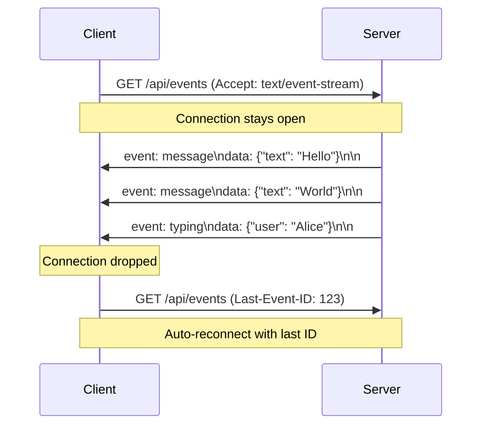
```mermaid
sequenceDiagram
    participant Client
    participant Server
    
    Client->>Server: GET /api/events (Accept: text/event-stream)
    Note over Client,Server: Connection stays open
    
    Server->>Client: event: message\ndata: {"text": "Hello"}\n\n
    Server->>Client: event: message\ndata: {"text": "World"}\n\n
    Server->>Client: event: typing\ndata: {"user": "Alice"}\n\n
    
    Note over Client: Connection dropped
    Client->>Server: GET /api/events (Last-Event-ID: 123)
    Note over Client,Server: Auto-reconnect with last ID
```

### Implementation

```javascript
// Server-side (Node.js/Express)
app.get('/api/events', (req, res) => {
    res.setHeader('Content-Type', 'text/event-stream');
    res.setHeader('Cache-Control', 'no-cache');
    res.setHeader('Connection', 'keep-alive');
    
    // Send event
    const sendEvent = (event, data) => {
        res.write(`event: ${event}\n`);
        res.write(`data: ${JSON.stringify(data)}\n\n`);
    };
    
    // Subscribe to updates
    const subscription = eventEmitter.on('update', (data) => {
        sendEvent('message', data);
    });
    
    // Heartbeat to keep connection alive
    const heartbeat = setInterval(() => {
        res.write(': heartbeat\n\n');
    }, 15000);
    
    // Cleanup on disconnect
    req.on('close', () => {
        clearInterval(heartbeat);
        subscription.unsubscribe();
    });
});

// Client-side
const eventSource = new EventSource('/api/events');

eventSource.addEventListener('message', (event) => {
    const data = JSON.parse(event.data);
    handleMessage(data);
});

eventSource.addEventListener('error', (event) => {
    console.log('Connection error, will auto-reconnect');
});
```

### SSE Protocol Format

```
: This is a comment (used for heartbeats)

event: message
id: 123
data: {"text": "Hello"}
data: {"continued": true}

event: notification
data: {"type": "alert"}

retry: 5000
```

| Field | Purpose |
|-------|---------|
| `event` | Event type (client filters by this) |
| `data` | Payload (can span multiple lines) |
| `id` | Event ID (for resuming after disconnect) |
| `retry` | Reconnection interval in ms |
| `:` | Comment (often used for keepalive) |

### Characteristics

| Aspect | Value |
|--------|-------|
| **Latency** | Very Low (true push) |
| **Direction** | Server → Client only |
| **Protocol** | HTTP (works through proxies) |
| **Auto-reconnect** | Built-in with Last-Event-ID |
| **Browser Support** | All modern browsers |
| **Use Case** | News feeds, stock tickers, notifications |

---

## WebSockets

### Mechanism

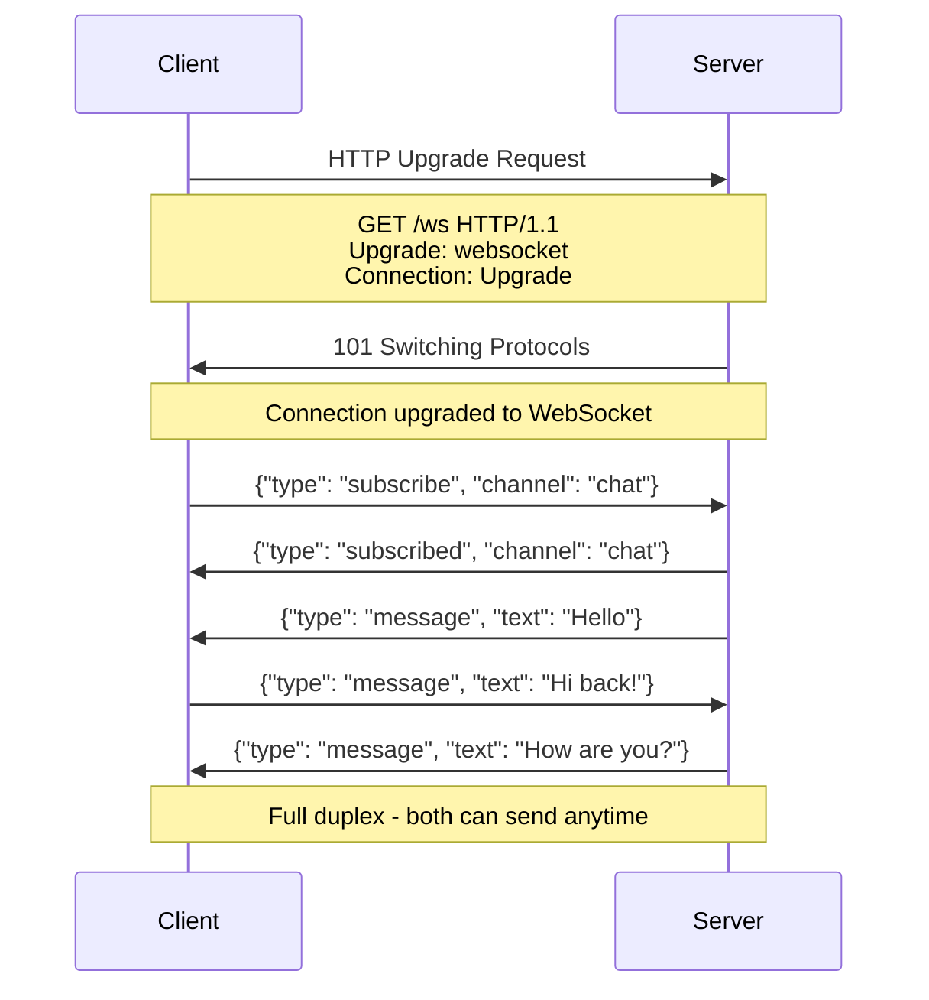
```mermaid
sequenceDiagram
    participant Client
    participant Server
    
    Client->>Server: HTTP Upgrade Request
    Note over Client,Server: GET /ws HTTP/1.1<br/>Upgrade: websocket<br/>Connection: Upgrade
    
    Server->>Client: 101 Switching Protocols
    Note over Client,Server: Connection upgraded to WebSocket
    
    Client->>Server: {"type": "subscribe", "channel": "chat"}
    Server->>Client: {"type": "subscribed", "channel": "chat"}
    
    Server->>Client: {"type": "message", "text": "Hello"}
    Client->>Server: {"type": "message", "text": "Hi back!"}
    Server->>Client: {"type": "message", "text": "How are you?"}
    
    Note over Client,Server: Full duplex - both can send anytime
```

### Connection Lifecycle

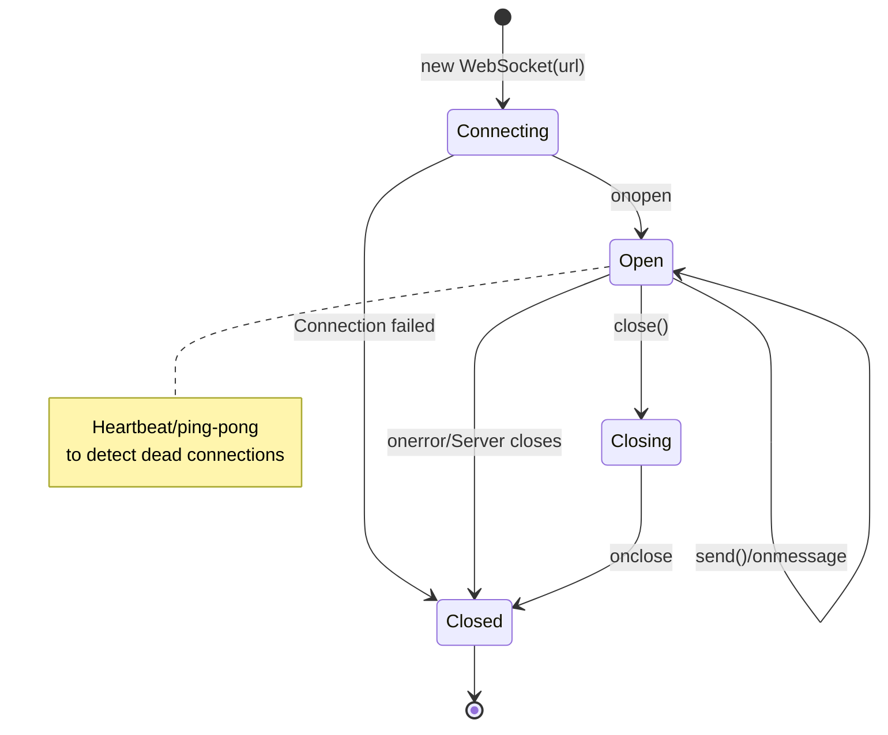
```mermaid
stateDiagram-v2
    [*] --> Connecting: new WebSocket(url)
    Connecting --> Open: onopen
    Connecting --> Closed: Connection failed
    
    Open --> Open: send()/onmessage
    Open --> Closing: close()
    Open --> Closed: onerror/Server closes
    
    Closing --> Closed: onclose
    Closed --> [*]
    
    note right of Open
        Heartbeat/ping-pong
        to detect dead connections
    end note
```

### Implementation

```javascript
// Server-side (Node.js with ws library)
const WebSocket = require('ws');
const wss = new WebSocket.Server({ port: 8080 });

const clients = new Map(); // userId -> WebSocket

wss.on('connection', (ws, req) => {
    const userId = authenticateFromRequest(req);
    clients.set(userId, ws);
    
    // Heartbeat to detect dead connections
    ws.isAlive = true;
    ws.on('pong', () => { ws.isAlive = true; });
    
    ws.on('message', (message) => {
        const data = JSON.parse(message);
        handleMessage(userId, data);
    });
    
    ws.on('close', () => {
        clients.delete(userId);
    });
});

// Heartbeat interval
setInterval(() => {
    wss.clients.forEach((ws) => {
        if (!ws.isAlive) return ws.terminate();
        ws.isAlive = false;
        ws.ping();
    });
}, 30000);

// Broadcast to all clients
function broadcast(data) {
    const message = JSON.stringify(data);
    wss.clients.forEach((client) => {
        if (client.readyState === WebSocket.OPEN) {
            client.send(message);
        }
    });
}
```

```javascript
// Client-side with reconnection
class WebSocketClient {
    constructor(url) {
        this.url = url;
        this.reconnectDelay = 1000;
        this.maxReconnectDelay = 30000;
        this.connect();
    }
    
    connect() {
        this.ws = new WebSocket(this.url);
        
        this.ws.onopen = () => {
            console.log('Connected');
            this.reconnectDelay = 1000; // Reset delay on success
        };
        
        this.ws.onmessage = (event) => {
            const data = JSON.parse(event.data);
            this.handleMessage(data);
        };
        
        this.ws.onclose = () => {
            console.log('Disconnected, reconnecting...');
            setTimeout(() => this.connect(), this.reconnectDelay);
            this.reconnectDelay = Math.min(
                this.reconnectDelay * 2,
                this.maxReconnectDelay
            );
        };
    }
    
    send(data) {
        if (this.ws.readyState === WebSocket.OPEN) {
            this.ws.send(JSON.stringify(data));
        }
    }
}
```

### Scaling WebSockets

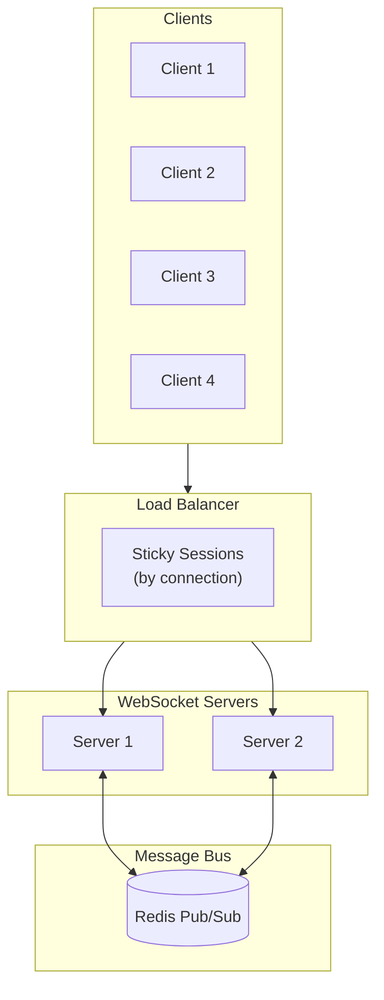
```mermaid
flowchart TB
    subgraph Clients["Clients"]
        C1[Client 1]
        C2[Client 2]
        C3[Client 3]
        C4[Client 4]
    end
    
    subgraph LB["Load Balancer"]
        Sticky["Sticky Sessions<br/>(by connection)"]
    end
    
    subgraph Servers["WebSocket Servers"]
        S1[Server 1]
        S2[Server 2]
    end
    
    subgraph PubSub["Message Bus"]
        Redis[(Redis Pub/Sub)]
    end
    
    Clients --> LB
    LB --> S1
    LB --> S2
    
    S1 <--> Redis
    S2 <--> Redis
```

**Challenge**: WebSocket connections are stateful. A message for User B must reach the server holding User B's connection.

**Solution**: Use a pub/sub system (Redis, Kafka) for cross-server messaging.

---

## Webhooks

### Mechanism

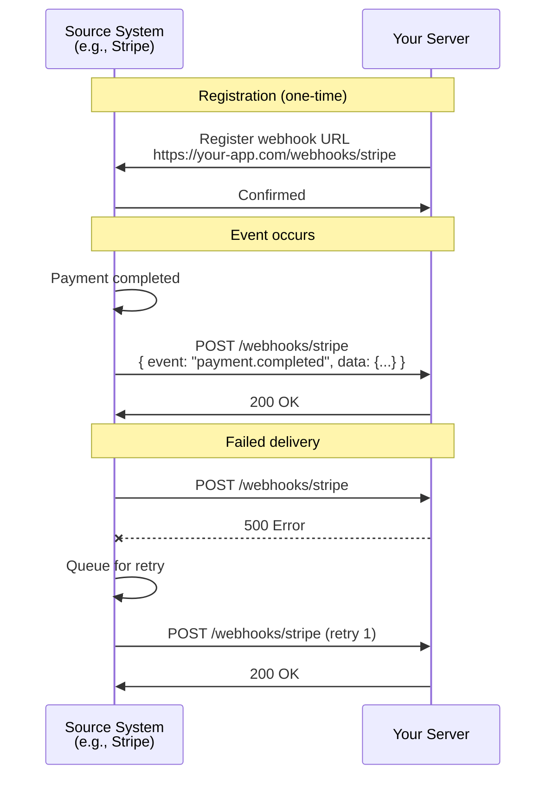
```mermaid
sequenceDiagram
    participant Source as Source System<br/>(e.g., Stripe)
    participant Your as Your Server
    
    Note over Source,Your: Registration (one-time)
    Your->>Source: Register webhook URL<br/>https://your-app.com/webhooks/stripe
    Source->>Your: Confirmed
    
    Note over Source,Your: Event occurs
    Source->>Source: Payment completed
    Source->>Your: POST /webhooks/stripe<br/>{ event: "payment.completed", data: {...} }
    Your->>Source: 200 OK
    
    Note over Source,Your: Failed delivery
    Source->>Your: POST /webhooks/stripe
    Your--xSource: 500 Error
    Source->>Source: Queue for retry
    Source->>Your: POST /webhooks/stripe (retry 1)
    Your->>Source: 200 OK
```

### Implementation

```python
# Server-side webhook receiver
from flask import Flask, request, jsonify
import hmac
import hashlib

app = Flask(__name__)
WEBHOOK_SECRET = 'your-secret-key'

@app.route('/webhooks/stripe', methods=['POST'])
def handle_stripe_webhook():
    # Verify signature
    signature = request.headers.get('Stripe-Signature')
    payload = request.data
    
    expected_sig = hmac.new(
        WEBHOOK_SECRET.encode(),
        payload,
        hashlib.sha256
    ).hexdigest()
    
    if not hmac.compare_digest(signature, expected_sig):
        return jsonify({'error': 'Invalid signature'}), 401
    
    # Parse event
    event = request.json
    
    # Idempotency: Check if already processed
    if is_event_processed(event['id']):
        return jsonify({'status': 'already_processed'}), 200
    
    # Process event (queue for async processing in production)
    try:
        if event['type'] == 'payment.completed':
            handle_payment_completed(event['data'])
        elif event['type'] == 'subscription.cancelled':
            handle_subscription_cancelled(event['data'])
        
        mark_event_processed(event['id'])
        return jsonify({'status': 'processed'}), 200
    
    except Exception as e:
        # Return 500 to trigger retry
        return jsonify({'error': str(e)}), 500
```

### Webhook Best Practices

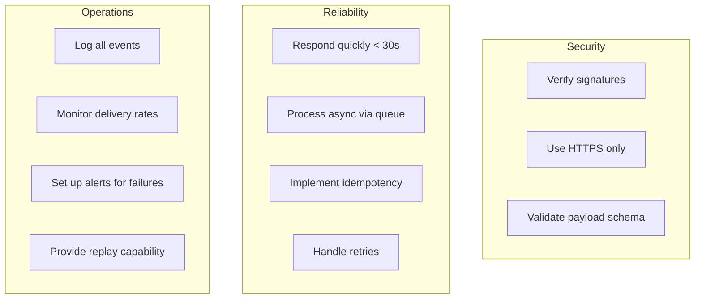
```mermaid
flowchart TB
    subgraph Security["Security"]
        S1[Verify signatures]
        S2[Use HTTPS only]
        S3[Validate payload schema]
    end
    
    subgraph Reliability["Reliability"]
        R1[Respond quickly < 30s]
        R2[Process async via queue]
        R3[Implement idempotency]
        R4[Handle retries]
    end
    
    subgraph Operations["Operations"]
        O1[Log all events]
        O2[Monitor delivery rates]
        O3[Set up alerts for failures]
        O4[Provide replay capability]
    end
```

| Best Practice | Why |
|---------------|-----|
| **Verify signatures** | Prevent spoofed requests |
| **Respond < 30s** | Avoid timeout-based retries |
| **Idempotent processing** | Webhooks may be delivered multiple times |
| **Queue for processing** | Don't block the HTTP response |
| **Log everything** | Debug delivery issues |

---

## Comparison Matrix

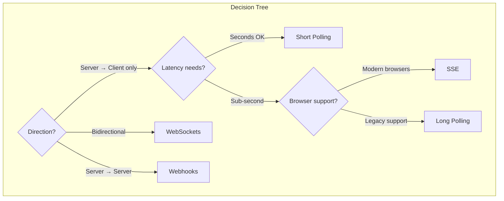
```mermaid
flowchart TD
    subgraph Decision["Decision Tree"]
        Q1{Direction?}
        Q1 -->|"Server → Client only"| Q2{Latency needs?}
        Q1 -->|"Bidirectional"| WS_Choice[WebSockets]
        Q1 -->|"Server → Server"| WH_Choice[Webhooks]
        
        Q2 -->|"Seconds OK"| Poll_Choice[Short Polling]
        Q2 -->|"Sub-second"| Q3{Browser support?}
        
        Q3 -->|"Modern browsers"| SSE_Choice[SSE]
        Q3 -->|"Legacy support"| LP_Choice[Long Polling]
    end
```

| Aspect | Short Polling | Long Polling | SSE | WebSockets | Webhooks |
|--------|---------------|--------------|-----|------------|----------|
| **Direction** | Pull | Pull (simulated push) | Push | Bidirectional | Push |
| **Latency** | High | Low | Very Low | Very Low | Event-driven |
| **Connection** | Short-lived | Held | Persistent | Persistent | Per-event |
| **Protocol** | HTTP | HTTP | HTTP | WS over HTTP | HTTP |
| **Server resources** | Low per request | Medium | Medium | High | Low |
| **Complexity** | Very Low | Low | Low | Medium | Medium |
| **Proxy/firewall** | Always works | Usually works | Usually works | May need config | Always works |

---

## Scaling Real-Time Systems

### Architecture Pattern

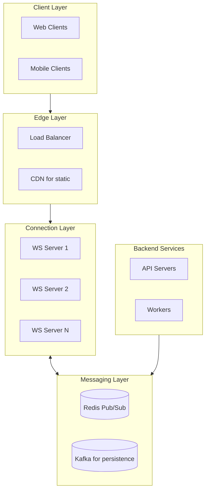
```mermaid
flowchart TB
    subgraph Clients["Client Layer"]
        Web[Web Clients]
        Mobile[Mobile Clients]
    end
    
    subgraph Edge["Edge Layer"]
        LB[Load Balancer]
        CDN[CDN for static]
    end
    
    subgraph Connection["Connection Layer"]
        WS1[WS Server 1]
        WS2[WS Server 2]
        WS3[WS Server N]
    end
    
    subgraph Messaging["Messaging Layer"]
        Redis[(Redis Pub/Sub)]
        Kafka[(Kafka for persistence)]
    end
    
    subgraph Backend["Backend Services"]
        API[API Servers]
        Worker[Workers]
    end
    
    Clients --> Edge
    Edge --> Connection
    Connection <--> Messaging
    Backend --> Messaging
```

### Connection Server Design

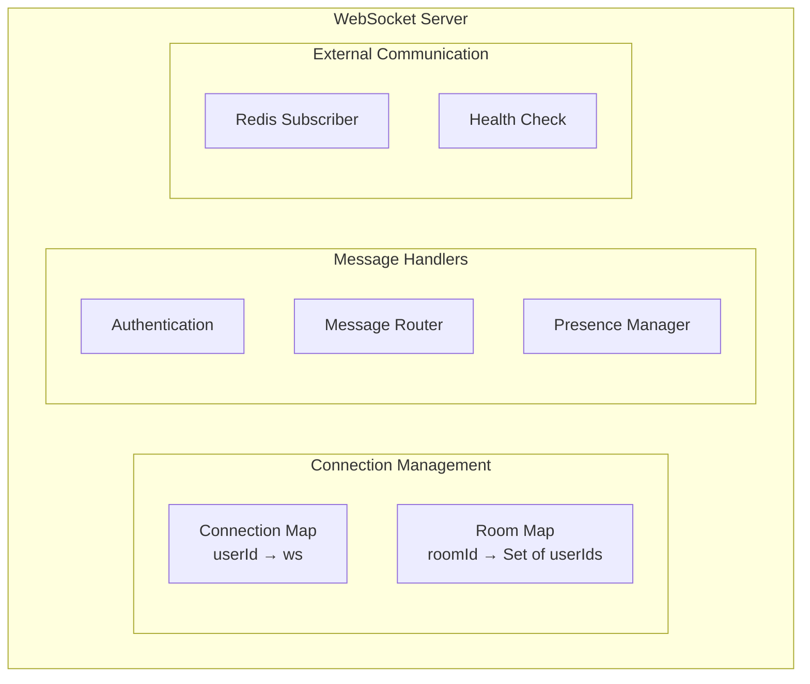
```mermaid
flowchart TB
    subgraph Server["WebSocket Server"]
        subgraph Connections["Connection Management"]
            ConnMap["Connection Map<br/>userId → ws"]
            RoomMap["Room Map<br/>roomId → Set of userIds"]
        end
        
        subgraph Handlers["Message Handlers"]
            Auth[Authentication]
            Route[Message Router]
            Presence[Presence Manager]
        end
        
        subgraph External["External Communication"]
            PubSub[Redis Subscriber]
            Health[Health Check]
        end
    end
```

### Presence System

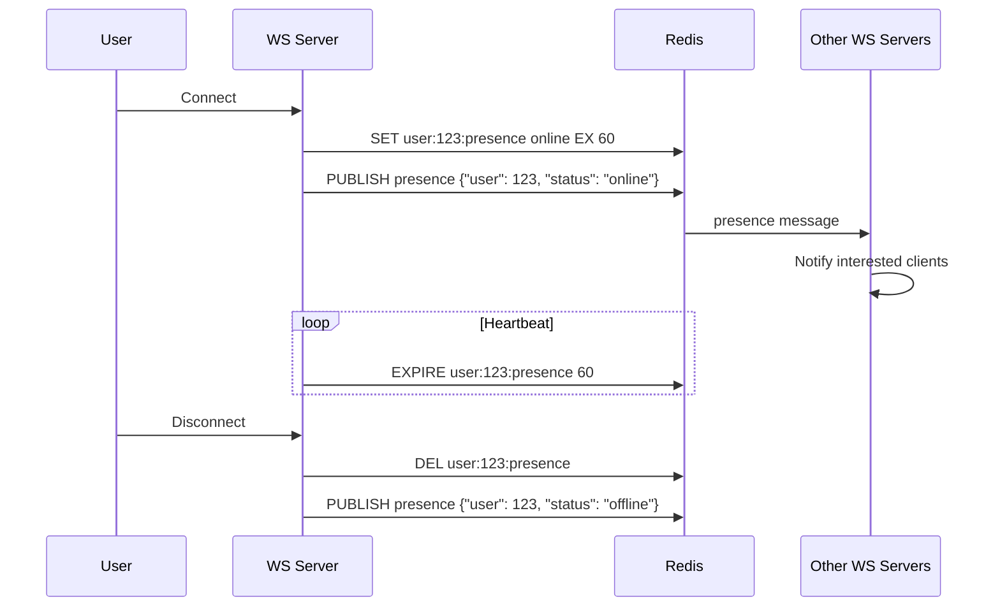
```mermaid
sequenceDiagram
    participant User
    participant WSServer as WS Server
    participant Redis
    participant OtherServer as Other WS Servers
    
    User->>WSServer: Connect
    WSServer->>Redis: SET user:123:presence online EX 60
    WSServer->>Redis: PUBLISH presence {"user": 123, "status": "online"}
    Redis->>OtherServer: presence message
    OtherServer->>OtherServer: Notify interested clients
    
    loop Heartbeat
        WSServer->>Redis: EXPIRE user:123:presence 60
    end
    
    User->>WSServer: Disconnect
    WSServer->>Redis: DEL user:123:presence
    WSServer->>Redis: PUBLISH presence {"user": 123, "status": "offline"}
```

---

## Interview Scenarios

### Scenario 1: Chat Application

**Requirements**: Real-time messaging, typing indicators, read receipts

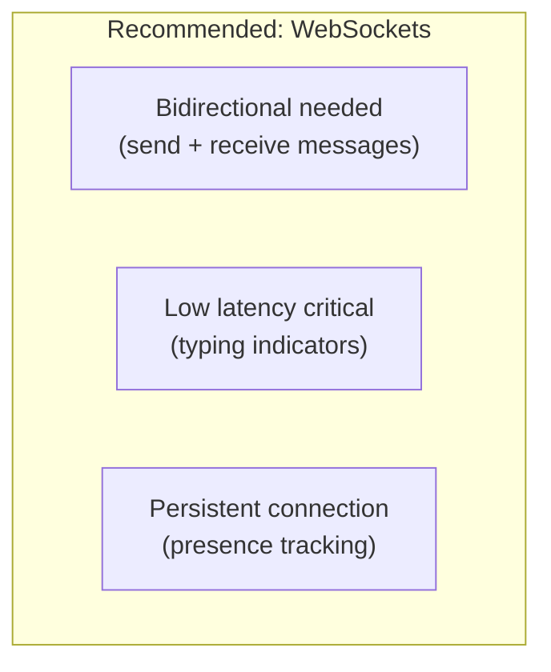
```mermaid
flowchart TB
    subgraph Recommendation["Recommended: WebSockets"]
        R1["Bidirectional needed<br/>(send + receive messages)"]
        R2["Low latency critical<br/>(typing indicators)"]
        R3["Persistent connection<br/>(presence tracking)"]
    end
```

**Architecture**:
- WebSockets for real-time messaging
- Redis Pub/Sub for cross-server messaging
- Message queue for persistence
- HTTP API for history, search

### Scenario 2: Live Sports Scores

**Requirements**: Push updates to millions of users, updates every few seconds

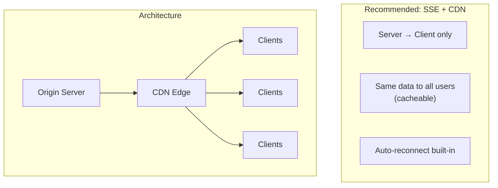
```mermaid
flowchart TB
    subgraph Recommendation["Recommended: SSE + CDN"]
        R1["Server → Client only"]
        R2["Same data to all users<br/>(cacheable)"]
        R3["Auto-reconnect built-in"]
    end
    
    subgraph Architecture
        Origin[Origin Server] --> CDN[CDN Edge]
        CDN --> C1[Clients]
        CDN --> C2[Clients]
        CDN --> C3[Clients]
    end
```

**Why SSE**:
- Unidirectional (server → client)
- Can be cached at CDN edge
- Native browser support
- Simpler than WebSockets

### Scenario 3: Payment Processing Webhook

**Requirements**: Receive payment notifications from Stripe

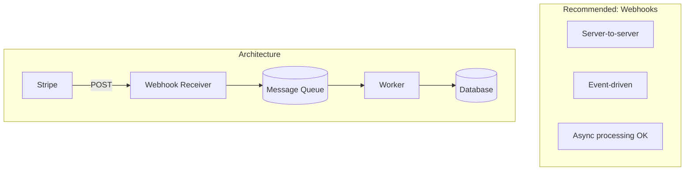
```mermaid
flowchart TB
    subgraph Recommendation["Recommended: Webhooks"]
        R1["Server-to-server"]
        R2["Event-driven"]
        R3["Async processing OK"]
    end
    
    subgraph Architecture
        Stripe[Stripe] -->|"POST"| Receiver[Webhook Receiver]
        Receiver --> Queue[(Message Queue)]
        Queue --> Worker[Worker]
        Worker --> DB[(Database)]
    end
```

**Key Points**:
- Verify webhook signatures
- Respond quickly (< 5s)
- Process asynchronously
- Idempotent handling

---

## Failure Handling

### Client Reconnection Strategy

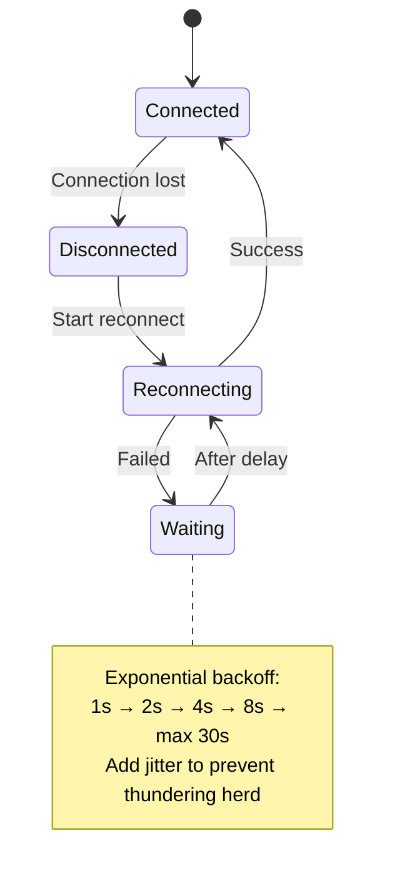
```mermaid
stateDiagram-v2
    [*] --> Connected
    Connected --> Disconnected: Connection lost
    Disconnected --> Reconnecting: Start reconnect
    Reconnecting --> Connected: Success
    Reconnecting --> Waiting: Failed
    Waiting --> Reconnecting: After delay
    
    note right of Waiting
        Exponential backoff:
        1s → 2s → 4s → 8s → max 30s
        Add jitter to prevent thundering herd
    end note
```

```javascript
class ReconnectingWebSocket {
    constructor(url) {
        this.url = url;
        this.reconnectAttempts = 0;
        this.maxReconnectDelay = 30000;
        this.connect();
    }
    
    connect() {
        this.ws = new WebSocket(this.url);
        
        this.ws.onopen = () => {
            this.reconnectAttempts = 0;
        };
        
        this.ws.onclose = (event) => {
            if (!event.wasClean) {
                this.scheduleReconnect();
            }
        };
    }
    
    scheduleReconnect() {
        const delay = this.calculateDelay();
        setTimeout(() => this.connect(), delay);
    }
    
    calculateDelay() {
        // Exponential backoff with jitter
        const exponentialDelay = Math.min(
            1000 * Math.pow(2, this.reconnectAttempts),
            this.maxReconnectDelay
        );
        const jitter = Math.random() * 1000;
        this.reconnectAttempts++;
        return exponentialDelay + jitter;
    }
}
```

### Server-Side Graceful Shutdown

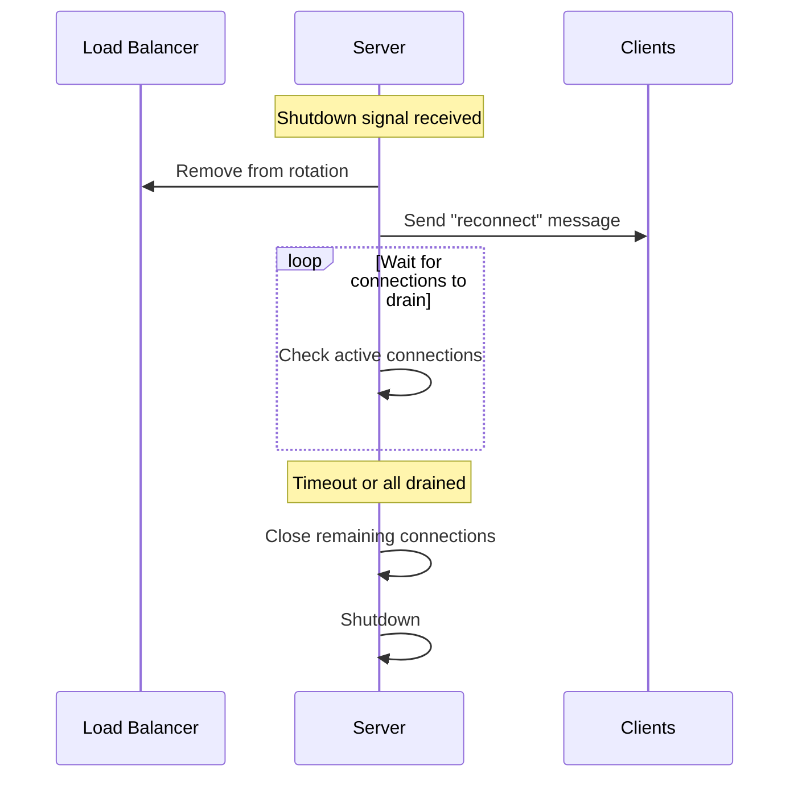
```mermaid
sequenceDiagram
    participant LB as Load Balancer
    participant Server
    participant Clients
    
    Note over Server: Shutdown signal received
    Server->>LB: Remove from rotation
    Server->>Clients: Send "reconnect" message
    
    loop Wait for connections to drain
        Server->>Server: Check active connections
    end
    
    Note over Server: Timeout or all drained
    Server->>Server: Close remaining connections
    Server->>Server: Shutdown
```

---

## Quick Reference Card

```
┌─────────────────────────────────────────────────────────────────┐
│              REAL-TIME COMMUNICATION CHEAT SHEET                │
├─────────────────────────────────────────────────────────────────┤
│ SHORT POLLING:                                                  │
│   • Simple, wasteful, high latency                              │
│   • Use for: Low-priority dashboards, legacy systems            │
├─────────────────────────────────────────────────────────────────┤
│ LONG POLLING:                                                   │
│   • Connection held until data available                        │
│   • Use for: Notifications, when SSE/WS not available           │
├─────────────────────────────────────────────────────────────────┤
│ SERVER-SENT EVENTS (SSE):                                       │
│   • Server → Client only, auto-reconnect                        │
│   • Use for: News feeds, stock tickers, notifications           │
├─────────────────────────────────────────────────────────────────┤
│ WEBSOCKETS:                                                     │
│   • Full duplex, persistent connection                          │
│   • Use for: Chat, gaming, collaborative apps                   │
├─────────────────────────────────────────────────────────────────┤
│ WEBHOOKS:                                                       │
│   • Server → Server push on events                              │
│   • Use for: Payment notifications, CI/CD, integrations         │
├─────────────────────────────────────────────────────────────────┤
│ DECISION HEURISTIC:                                             │
│   • Need bidirectional? → WebSockets                            │
│   • Server-to-client only? → SSE                                │
│   • Server-to-server events? → Webhooks                         │
│   • Simple/legacy? → Long Polling                               │
└─────────────────────────────────────────────────────────────────┘
```

---

## Practice Questions

1. Design a notification system for a mobile app. Which real-time pattern would you use and why?
2. How would you scale WebSocket connections to handle 1 million concurrent users?
3. Explain how you would implement a "user is typing" indicator in a chat application.
4. Compare the trade-offs of SSE vs. WebSockets for a live dashboard.
5. Design a webhook system with guaranteed delivery. How do you handle failures and retries?
