# 06 - Replication Patterns

## Overview

Replication is the process of keeping copies of data on multiple machines. It serves three primary purposes: high availability (the system continues operating when nodes fail), read scalability (distributing read load across replicas), and latency reduction (placing data geographically closer to users). This document covers replication strategies, their trade-offs, and how to reason about them in system design interviews.

---

## Core Mental Model

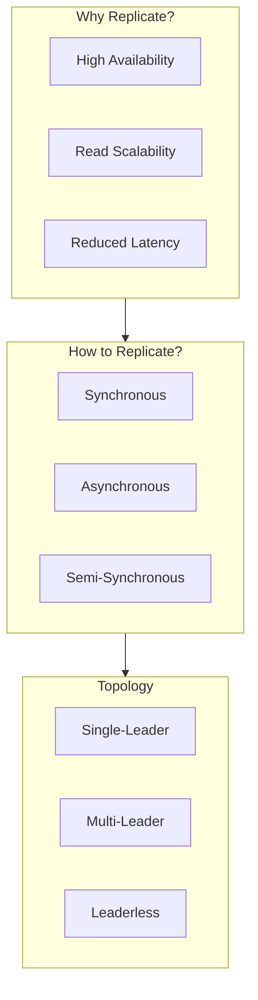
```mermaid
flowchart TD
    subgraph Why["Why Replicate?"]
        HA[High Availability]
        Scale[Read Scalability]
        Latency[Reduced Latency]
    end
    
    subgraph How["How to Replicate?"]
        Sync[Synchronous]
        Async[Asynchronous]
        Semi[Semi-Synchronous]
    end
    
    subgraph Topology["Topology"]
        Single[Single-Leader]
        Multi[Multi-Leader]
        Leaderless[Leaderless]
    end
    
    Why --> How
    How --> Topology
```

**Key Trade-off**: Replication involves an inherent tension between consistency, availability, and latency. Stronger consistency requires more coordination, which increases latency and reduces availability during failures.

---

## Single-Leader Replication

### Architecture

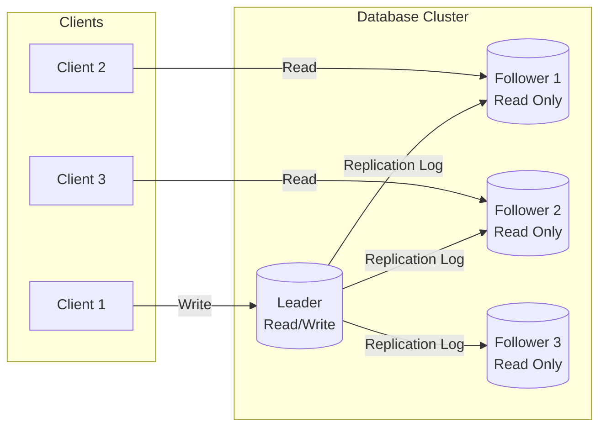
```mermaid
flowchart LR
    subgraph Clients
        C1[Client 1]
        C2[Client 2]
        C3[Client 3]
    end
    
    subgraph Database Cluster
        Leader[(Leader<br/>Read/Write)]
        F1[(Follower 1<br/>Read Only)]
        F2[(Follower 2<br/>Read Only)]
        F3[(Follower 3<br/>Read Only)]
    end
    
    C1 -->|Write| Leader
    C2 -->|Read| F1
    C3 -->|Read| F2
    
    Leader -->|Replication Log| F1
    Leader -->|Replication Log| F2
    Leader -->|Replication Log| F3
```

### Replication Log Mechanism

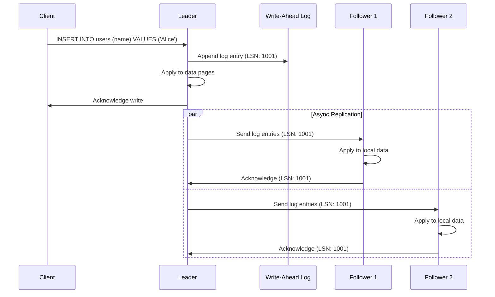
```mermaid
sequenceDiagram
    participant C as Client
    participant L as Leader
    participant WAL as Write-Ahead Log
    participant F1 as Follower 1
    participant F2 as Follower 2
    
    C->>L: INSERT INTO users (name) VALUES ('Alice')
    L->>WAL: Append log entry (LSN: 1001)
    L->>L: Apply to data pages
    L->>C: Acknowledge write
    
    par Async Replication
        L->>F1: Send log entries (LSN: 1001)
        F1->>F1: Apply to local data
        F1->>L: Acknowledge (LSN: 1001)
    and
        L->>F2: Send log entries (LSN: 1001)
        F2->>F2: Apply to local data
        F2->>L: Acknowledge (LSN: 1001)
    end
```

### Synchronous vs. Asynchronous


```mermaid
flowchart TB
    subgraph Sync["Synchronous Replication"]
        S1[Write to Leader] --> S2[Replicate to Followers]
        S2 --> S3[Wait for ALL Acks]
        S3 --> S4[Acknowledge Client]
    end
    
    subgraph Async["Asynchronous Replication"]
        A1[Write to Leader] --> A2[Acknowledge Client]
        A2 --> A3[Replicate in Background]
    end
    
    subgraph Semi["Semi-Synchronous"]
        M1[Write to Leader] --> M2[Replicate to Followers]
        M2 --> M3[Wait for ONE Ack]
        M3 --> M4[Acknowledge Client]
    end
```

| Mode | Durability | Latency | Availability |
|------|------------|---------|--------------|
| **Synchronous** | Strong (no data loss) | High (wait for slowest replica) | Lower (blocked if replica down) |
| **Asynchronous** | Weak (may lose recent writes) | Low (immediate ack) | Higher (tolerates replica failures) |
| **Semi-Synchronous** | Moderate (at least one backup) | Medium | Medium |

**Interview Point**: PostgreSQL uses synchronous_commit settings, MySQL uses semi-sync replication plugin. Know that "durability" and "consistency" have different meanings.

---

## Handling Leader Failure

### Failover Process

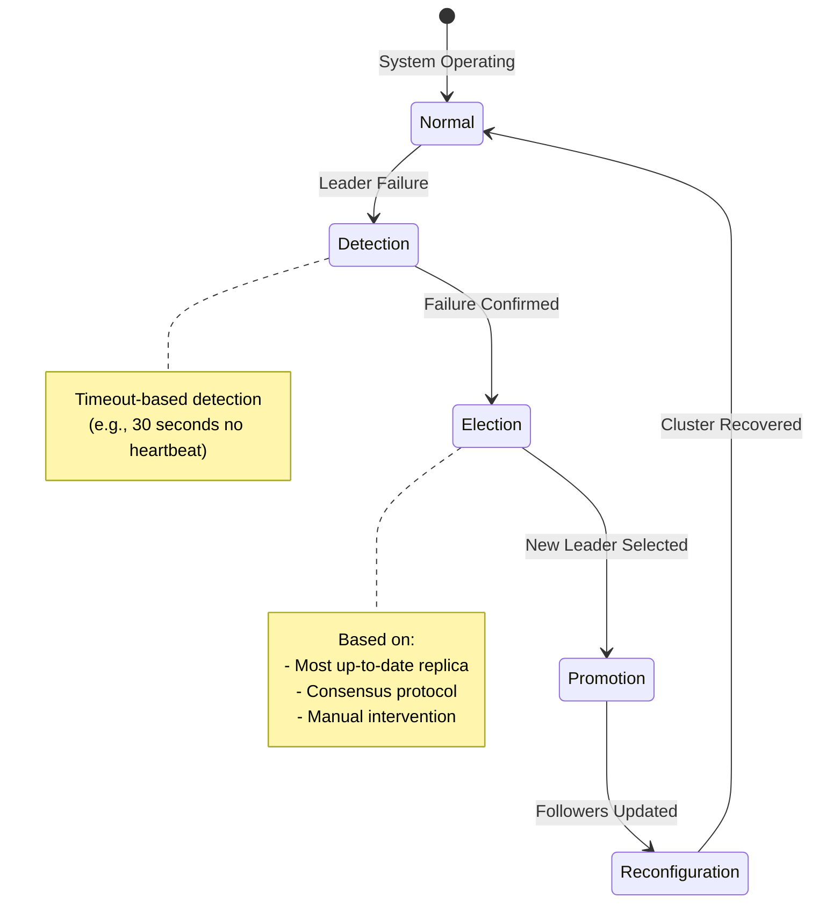
```mermaid
stateDiagram-v2
    [*] --> Normal: System Operating
    Normal --> Detection: Leader Failure
    Detection --> Election: Failure Confirmed
    Election --> Promotion: New Leader Selected
    Promotion --> Reconfiguration: Followers Updated
    Reconfiguration --> Normal: Cluster Recovered
    
    note right of Detection
        Timeout-based detection
        (e.g., 30 seconds no heartbeat)
    end note
    
    note right of Election
        Based on:
        - Most up-to-date replica
        - Consensus protocol
        - Manual intervention
    end note
```

### Failover Challenges

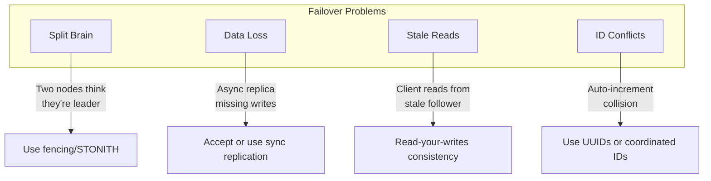
```mermaid
flowchart TD
    subgraph Problems["Failover Problems"]
        P1[Split Brain]
        P2[Data Loss]
        P3[Stale Reads]
        P4[ID Conflicts]
    end
    
    P1 -->|"Two nodes think<br/>they're leader"| S1[Use fencing/STONITH]
    P2 -->|"Async replica<br/>missing writes"| S2[Accept or use sync replication]
    P3 -->|"Client reads from<br/>stale follower"| S3[Read-your-writes consistency]
    P4 -->|"Auto-increment<br/>collision"| S4[Use UUIDs or coordinated IDs]
```

### Split Brain Prevention

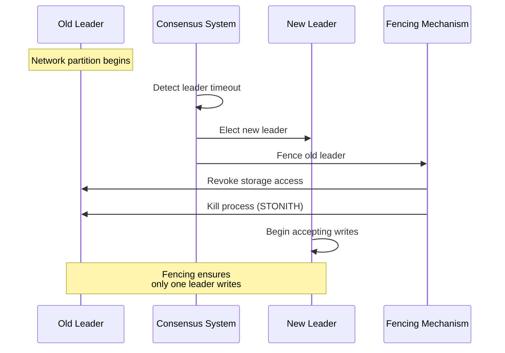
```mermaid
sequenceDiagram
    participant OldLeader as Old Leader
    participant Consensus as Consensus System
    participant NewLeader as New Leader
    participant Fence as Fencing Mechanism
    
    Note over OldLeader: Network partition begins
    Consensus->>Consensus: Detect leader timeout
    Consensus->>NewLeader: Elect new leader
    Consensus->>Fence: Fence old leader
    Fence->>OldLeader: Revoke storage access
    Fence->>OldLeader: Kill process (STONITH)
    NewLeader->>NewLeader: Begin accepting writes
    
    Note over OldLeader,NewLeader: Fencing ensures<br/>only one leader writes
```

**STONITH**: "Shoot The Other Node In The Head" — forcibly power off the old leader to prevent split-brain.

---

## Multi-Leader Replication

### Architecture

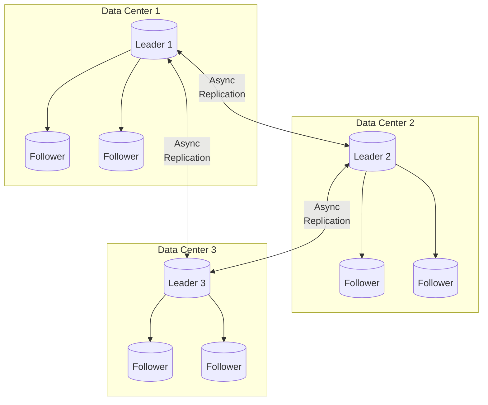
```mermaid
flowchart TB
    subgraph DC1["Data Center 1"]
        L1[(Leader 1)]
        F1a[(Follower)]
        F1b[(Follower)]
        L1 --> F1a
        L1 --> F1b
    end
    
    subgraph DC2["Data Center 2"]
        L2[(Leader 2)]
        F2a[(Follower)]
        F2b[(Follower)]
        L2 --> F2a
        L2 --> F2b
    end
    
    subgraph DC3["Data Center 3"]
        L3[(Leader 3)]
        F3a[(Follower)]
        F3b[(Follower)]
        L3 --> F3a
        L3 --> F3b
    end
    
    L1 <-->|"Async<br/>Replication"| L2
    L2 <-->|"Async<br/>Replication"| L3
    L1 <-->|"Async<br/>Replication"| L3
```

### Use Cases

| Use Case | Why Multi-Leader |
|----------|------------------|
| Multi-datacenter deployment | Low latency for local writes |
| Offline-capable applications | Each client acts as a leader |
| Collaborative editing | Multiple users editing simultaneously |

### Conflict Resolution

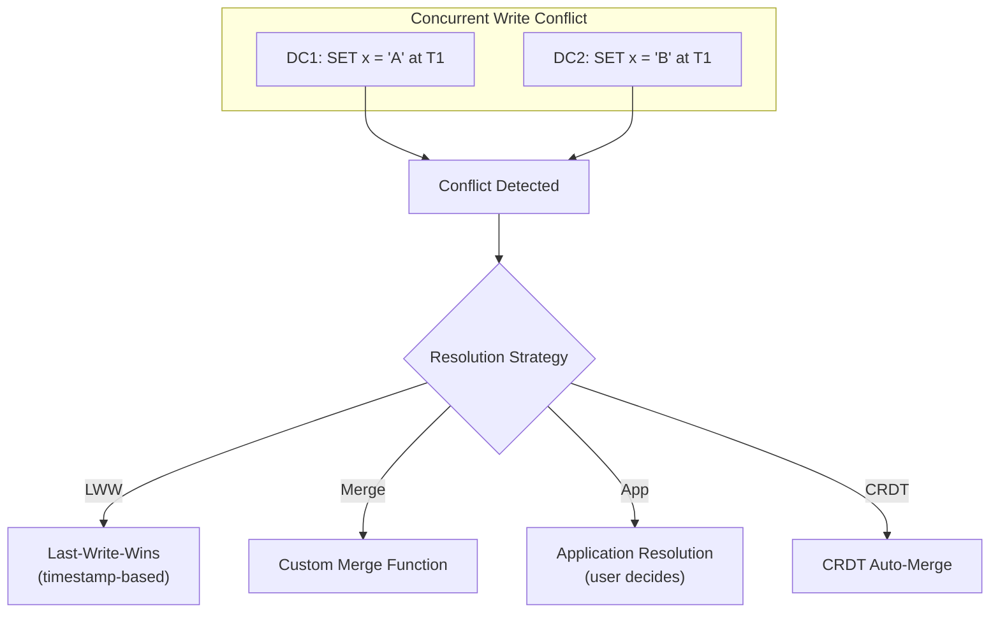
```mermaid
flowchart TD
    subgraph Conflict["Concurrent Write Conflict"]
        DC1_Write["DC1: SET x = 'A' at T1"]
        DC2_Write["DC2: SET x = 'B' at T1"]
    end
    
    DC1_Write --> Detect[Conflict Detected]
    DC2_Write --> Detect
    
    Detect --> Strategies{Resolution Strategy}
    
    Strategies -->|LWW| LWW["Last-Write-Wins<br/>(timestamp-based)"]
    Strategies -->|Merge| Merge["Custom Merge Function"]
    Strategies -->|App| App["Application Resolution<br/>(user decides)"]
    Strategies -->|CRDT| CRDT["CRDT Auto-Merge"]
```

### Conflict Resolution Strategies

#### Last-Write-Wins (LWW)

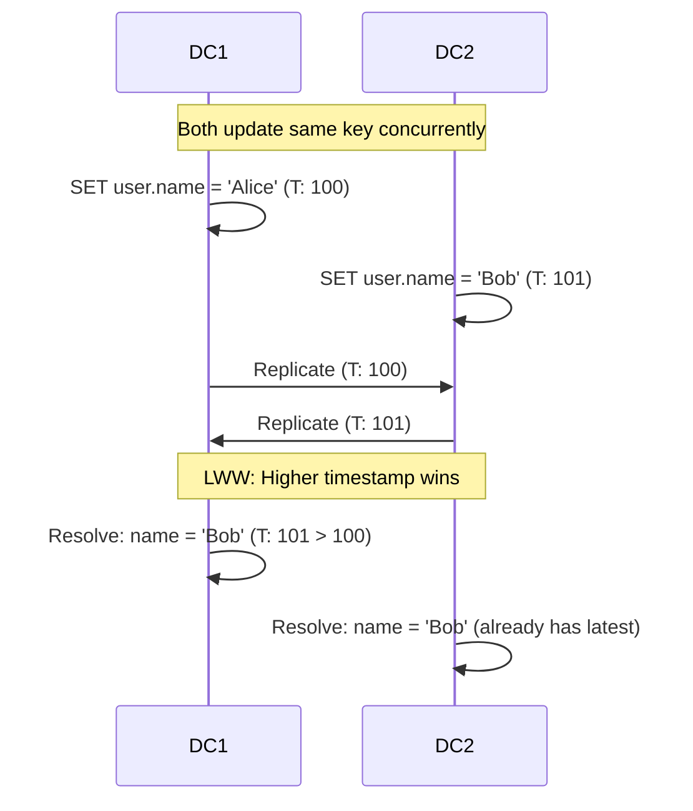
```mermaid
sequenceDiagram
    participant DC1
    participant DC2
    
    Note over DC1,DC2: Both update same key concurrently
    DC1->>DC1: SET user.name = 'Alice' (T: 100)
    DC2->>DC2: SET user.name = 'Bob' (T: 101)
    
    DC1->>DC2: Replicate (T: 100)
    DC2->>DC1: Replicate (T: 101)
    
    Note over DC1,DC2: LWW: Higher timestamp wins
    DC1->>DC1: Resolve: name = 'Bob' (T: 101 > 100)
    DC2->>DC2: Resolve: name = 'Bob' (already has latest)
```

**Warning**: LWW silently discards writes. Use only when data loss is acceptable.

#### CRDTs (Conflict-free Replicated Data Types)

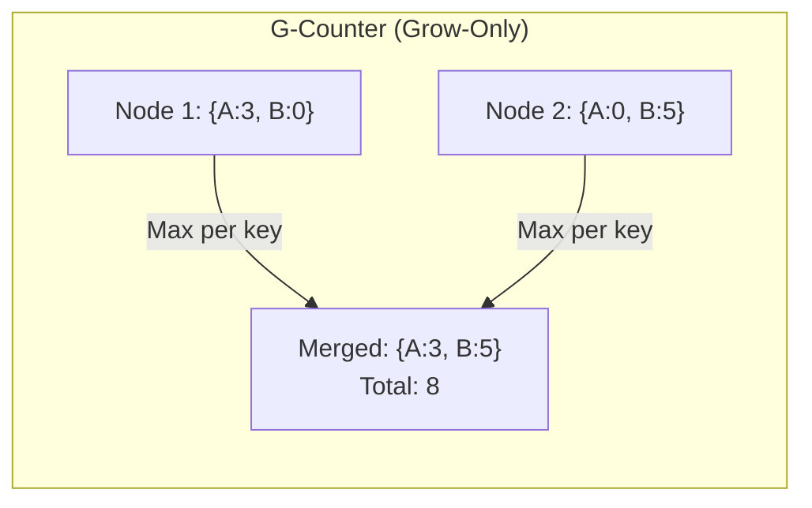
```mermaid
flowchart LR
    subgraph G_Counter["G-Counter (Grow-Only)"]
        Node1["Node 1: {A:3, B:0}"]
        Node2["Node 2: {A:0, B:5}"]
        Merged["Merged: {A:3, B:5}<br/>Total: 8"]
    end
    
    Node1 -->|Max per key| Merged
    Node2 -->|Max per key| Merged
```

CRDTs guarantee convergence without coordination:
- **G-Counter**: Grow-only counter (each node tracks its additions)
- **PN-Counter**: Positive-negative counter
- **G-Set**: Grow-only set
- **LWW-Register**: Last-write-wins register
- **OR-Set**: Observed-remove set

---

## Leaderless Replication

### Architecture (Dynamo-Style)

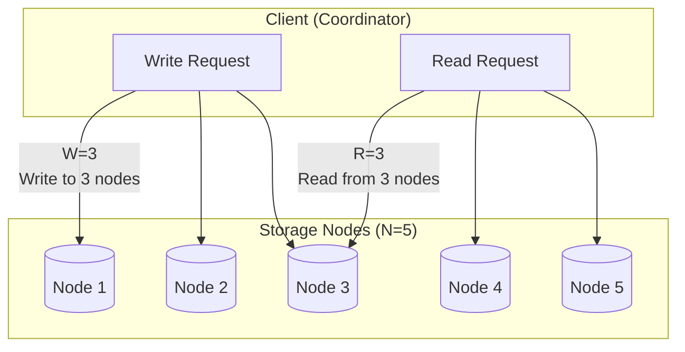
```mermaid
flowchart TB
    subgraph Client["Client (Coordinator)"]
        CW[Write Request]
        CR[Read Request]
    end
    
    subgraph Nodes["Storage Nodes (N=5)"]
        N1[(Node 1)]
        N2[(Node 2)]
        N3[(Node 3)]
        N4[(Node 4)]
        N5[(Node 5)]
    end
    
    CW -->|"W=3<br/>Write to 3 nodes"| N1
    CW --> N2
    CW --> N3
    
    CR -->|"R=3<br/>Read from 3 nodes"| N3
    CR --> N4
    CR --> N5
```

### Quorum Consensus

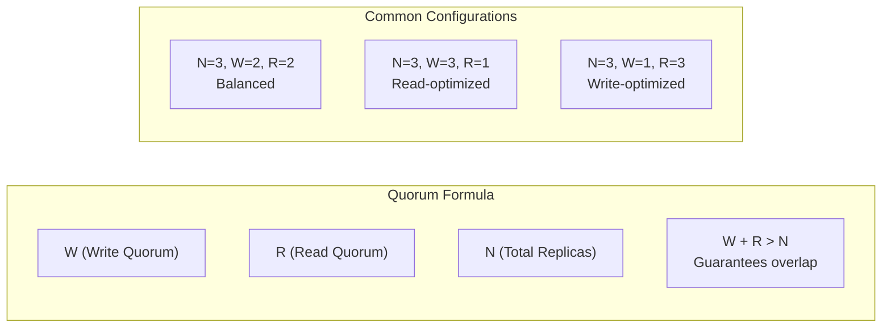
```mermaid
flowchart LR
    subgraph Quorum["Quorum Formula"]
        W["W (Write Quorum)"]
        R["R (Read Quorum)"]
        N["N (Total Replicas)"]
        Formula["W + R > N<br/>Guarantees overlap"]
    end
    
    subgraph Configs["Common Configurations"]
        C1["N=3, W=2, R=2<br/>Balanced"]
        C2["N=3, W=3, R=1<br/>Read-optimized"]
        C3["N=3, W=1, R=3<br/>Write-optimized"]
    end
```

| Configuration | Write Latency | Read Latency | Consistency | Availability |
|---------------|---------------|--------------|-------------|--------------|
| W=N, R=1 | Slow | Fast | Strong | Low (any failure blocks writes) |
| W=1, R=N | Fast | Slow | Strong | Low (any failure blocks reads) |
| W=⌈(N+1)/2⌉, R=⌈(N+1)/2⌉ | Balanced | Balanced | Strong | Moderate |
| W=1, R=1 | Fast | Fast | Eventual | High |

### Read Repair and Anti-Entropy

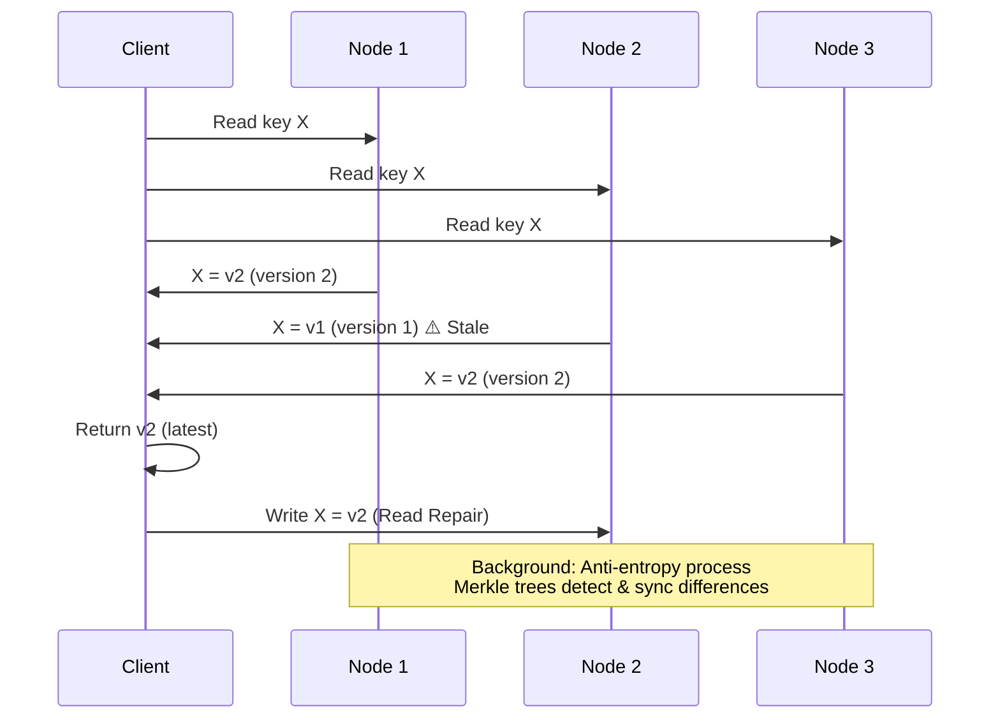
```mermaid
sequenceDiagram
    participant C as Client
    participant N1 as Node 1
    participant N2 as Node 2
    participant N3 as Node 3
    
    C->>N1: Read key X
    C->>N2: Read key X
    C->>N3: Read key X
    
    N1->>C: X = v2 (version 2)
    N2->>C: X = v1 (version 1) ⚠️ Stale
    N3->>C: X = v2 (version 2)
    
    C->>C: Return v2 (latest)
    C->>N2: Write X = v2 (Read Repair)
    
    Note over N1,N3: Background: Anti-entropy process<br/>Merkle trees detect & sync differences
```

### Sloppy Quorums and Hinted Handoff

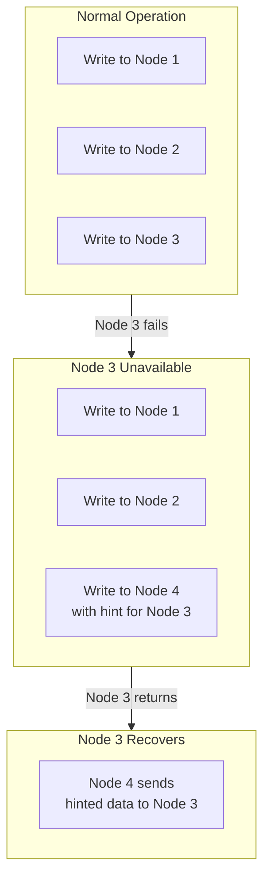
```mermaid
flowchart TD
    subgraph Normal["Normal Operation"]
        W1[Write to Node 1]
        W2[Write to Node 2]
        W3[Write to Node 3]
    end
    
    subgraph Failure["Node 3 Unavailable"]
        W1b[Write to Node 1]
        W2b[Write to Node 2]
        W4[Write to Node 4<br/>with hint for Node 3]
    end
    
    subgraph Recovery["Node 3 Recovers"]
        N4_Hint[Node 4 sends<br/>hinted data to Node 3]
    end
    
    Normal -->|"Node 3 fails"| Failure
    Failure -->|"Node 3 returns"| Recovery
```

**Sloppy Quorum**: Accept writes on any N nodes (not just the designated ones). Improves availability but weakens consistency guarantees.

---

## Consistency Models

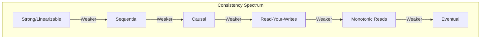
```mermaid
flowchart TB
    subgraph Spectrum["Consistency Spectrum"]
        Strong[Strong/Linearizable]
        Sequential[Sequential]
        Causal[Causal]
        ReadYourWrites[Read-Your-Writes]
        Monotonic[Monotonic Reads]
        Eventual[Eventual]
    end
    
    Strong -->|Weaker| Sequential
    Sequential -->|Weaker| Causal
    Causal -->|Weaker| ReadYourWrites
    ReadYourWrites -->|Weaker| Monotonic
    Monotonic -->|Weaker| Eventual
```

### Read-Your-Writes Consistency

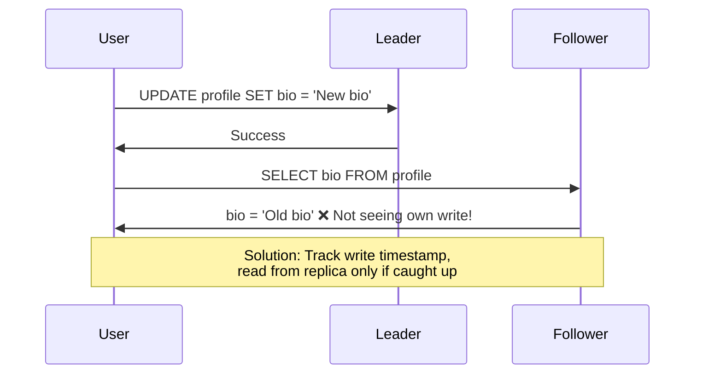
```mermaid
sequenceDiagram
    participant User
    participant Leader
    participant Follower
    
    User->>Leader: UPDATE profile SET bio = 'New bio'
    Leader->>User: Success
    
    User->>Follower: SELECT bio FROM profile
    Follower->>User: bio = 'Old bio' ❌ Not seeing own write!
    
    Note over User,Follower: Solution: Track write timestamp,<br/>read from replica only if caught up
```

**Implementation Strategies**:
1. Always read own writes from leader
2. Track client's last write timestamp, ensure replica is caught up
3. Use sticky sessions to same replica

### Monotonic Reads

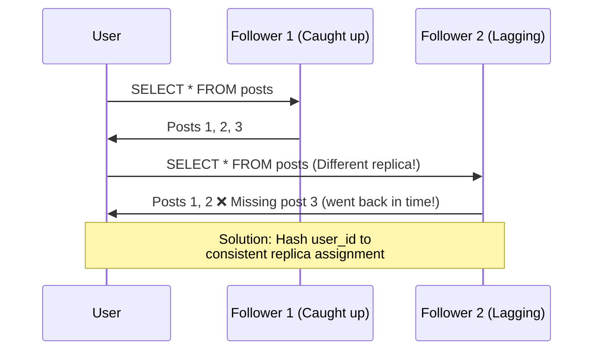
```mermaid
sequenceDiagram
    participant User
    participant F1 as Follower 1 (Caught up)
    participant F2 as Follower 2 (Lagging)
    
    User->>F1: SELECT * FROM posts
    F1->>User: Posts 1, 2, 3
    
    User->>F2: SELECT * FROM posts (Different replica!)
    F2->>User: Posts 1, 2 ❌ Missing post 3 (went back in time!)
    
    Note over User,F2: Solution: Hash user_id to<br/>consistent replica assignment
```

---

## Replication Lag and Its Effects

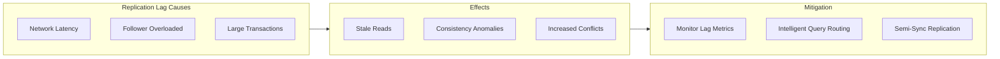
```mermaid
flowchart LR
    subgraph Lag["Replication Lag Causes"]
        Network[Network Latency]
        Load[Follower Overloaded]
        Batch[Large Transactions]
    end
    
    subgraph Effects["Effects"]
        Stale[Stale Reads]
        Anomaly[Consistency Anomalies]
        Conflict[Increased Conflicts]
    end
    
    subgraph Mitigation["Mitigation"]
        Monitor[Monitor Lag Metrics]
        Route[Intelligent Query Routing]
        Sync[Semi-Sync Replication]
    end
    
    Lag --> Effects
    Effects --> Mitigation
```

### Measuring Replication Lag

```sql
-- PostgreSQL: Check replication lag
SELECT 
    client_addr,
    state,
    sent_lsn,
    write_lsn,
    flush_lsn,
    replay_lsn,
    pg_wal_lsn_diff(sent_lsn, replay_lsn) AS lag_bytes
FROM pg_stat_replication;

-- MySQL: Check seconds behind master
SHOW SLAVE STATUS\G
-- Look for: Seconds_Behind_Master
```

---

## Interview Scenarios

### Scenario 1: Global E-Commerce Platform

**Requirements**: Users worldwide, low latency, handle region failures

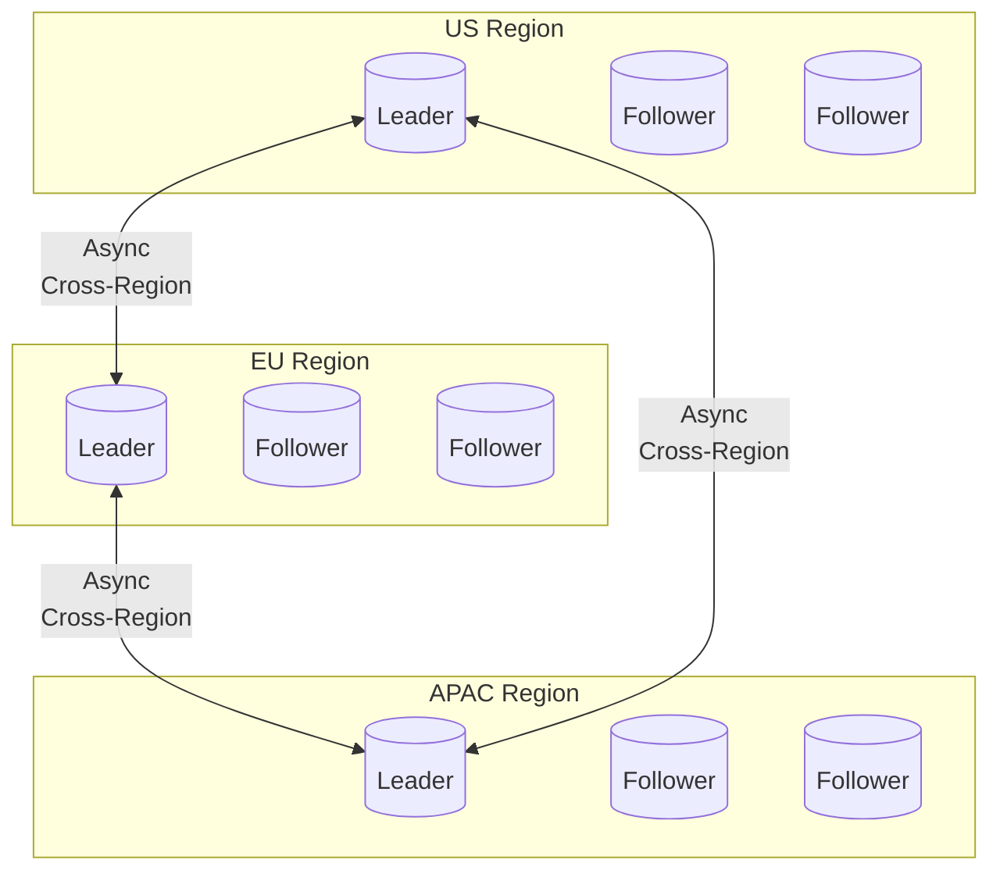
```mermaid
flowchart TB
    subgraph US["US Region"]
        US_L[(Leader)]
        US_F1[(Follower)]
        US_F2[(Follower)]
    end
    
    subgraph EU["EU Region"]
        EU_L[(Leader)]
        EU_F1[(Follower)]
        EU_F2[(Follower)]
    end
    
    subgraph APAC["APAC Region"]
        APAC_L[(Leader)]
        APAC_F1[(Follower)]
        APAC_F2[(Follower)]
    end
    
    US_L <-->|"Async<br/>Cross-Region"| EU_L
    EU_L <-->|"Async<br/>Cross-Region"| APAC_L
    US_L <-->|"Async<br/>Cross-Region"| APAC_L
```

**Recommended**: Multi-leader with conflict resolution
- Local writes for low latency
- Async cross-region replication
- LWW for non-critical data (cart, preferences)
- Application-level conflict resolution for orders

### Scenario 2: Banking Ledger

**Requirements**: No data loss, strong consistency, audit trail

```mermaid
flowchart LR
    subgraph Primary["Primary Region"]
        Leader[(Leader<br/>PostgreSQL)]
        Sync1[(Sync Standby 1)]
    end
    
    subgraph DR["DR Region"]
        Async1[(Async Standby)]
    end
    
    Leader -->|"Synchronous"| Sync1
    Leader -->|"Asynchronous"| Async1
```

**Recommended**: Single-leader with synchronous replication
- Synchronous to at least one follower (semi-sync)
- All writes through leader
- Strong consistency at cost of latency
- Async replica for disaster recovery

### Scenario 3: Social Media Feed

**Requirements**: High read throughput, eventual consistency acceptable

```mermaid
flowchart TB
    Leader[(Leader)] 
    
    subgraph Followers["Read Replicas (20+)"]
        F1[(F1)]
        F2[(F2)]
        F3[(F3)]
        Fdot[...]
        F20[(F20)]
    end
    
    subgraph Cache["Cache Layer"]
        Redis1[(Redis)]
        Redis2[(Redis)]
    end
    
    Leader -->|Async| Followers
    Followers --> Cache
```

**Recommended**: Single-leader with many async followers
- Scale reads horizontally
- Cache layer absorbs hot reads
- Eventual consistency fine for feeds
- Use read-your-writes for own content

---

## Comparison Summary

```mermaid
flowchart TD
    subgraph Choose["Replication Strategy Selection"]
        Q1{Write<br/>Geography?}
        Q1 -->|"Single region"| Q2{Consistency<br/>needs?}
        Q1 -->|"Multi-region"| Q3{Latency<br/>critical?}
        
        Q2 -->|"Strong"| SL1[Single-Leader<br/>Sync Replication]
        Q2 -->|"Eventual OK"| SL2[Single-Leader<br/>Async + Read Replicas]
        
        Q3 -->|"Yes"| ML[Multi-Leader<br/>+ Conflict Resolution]
        Q3 -->|"No"| SL3[Single-Leader<br/>Cross-Region Async]
        
        Q1 -->|"Extreme availability"| LL[Leaderless<br/>Quorum-based]
    end
```

| Aspect | Single-Leader | Multi-Leader | Leaderless |
|--------|---------------|--------------|------------|
| **Consistency** | Strong (sync) to eventual (async) | Eventual + conflicts | Tunable via quorums |
| **Write latency** | Higher (single point) | Low (local leader) | Low (any node) |
| **Failover complexity** | Moderate | Complex | None (no leader) |
| **Conflict handling** | None needed | Required | Required (concurrent writes) |
| **Use case** | Most applications | Multi-region, offline | High availability, analytics |

---

## Quick Reference Card

```
┌─────────────────────────────────────────────────────────────────┐
│                  REPLICATION PATTERNS CHEAT SHEET               │
├─────────────────────────────────────────────────────────────────┤
│ SINGLE-LEADER:                                                  │
│   • All writes to one node → simple conflict handling           │
│   • Sync: Strong consistency, higher latency                    │
│   • Async: Lower latency, potential data loss on failover       │
│   • Use for: Most OLTP workloads                                │
├─────────────────────────────────────────────────────────────────┤
│ MULTI-LEADER:                                                   │
│   • Writes to multiple leaders → must handle conflicts          │
│   • Good for: Multi-datacenter, offline-capable apps            │
│   • Conflict strategies: LWW, merge functions, CRDTs            │
├─────────────────────────────────────────────────────────────────┤
│ LEADERLESS:                                                     │
│   • No single leader → any node accepts writes                  │
│   • Quorum: W + R > N for consistency                           │
│   • Read repair + anti-entropy for convergence                  │
│   • Use for: High availability, Dynamo-style systems            │
├─────────────────────────────────────────────────────────────────┤
│ KEY FORMULAS:                                                   │
│   • Quorum read/write: W + R > N                                │
│   • Strong consistency: W = N or R = N                          │
│   • Availability: Can tolerate N - W write failures             │
└─────────────────────────────────────────────────────────────────┘
```

---

## Practice Questions

1. Your system uses async replication and the leader fails. How do you handle potential data loss?
2. Design a replication strategy for a collaborative document editor where users can edit offline.
3. Explain how you would implement read-your-writes consistency in a system with async replication.
4. Compare the trade-offs of synchronous vs. asynchronous replication for a payment processing system.
5. How would you detect and resolve replication lag that exceeds acceptable thresholds?
