# 10 - Service Exposure: API Gateway and Proxies

## Overview

Service exposure determines how clients access backend services. API Gateways and proxies provide a unified entry point, handling cross-cutting concerns like authentication, rate limiting, routing, and protocol translation. This document covers the patterns, trade-offs, and implementation considerations for exposing services in modern architectures.

---

## Core Mental Model

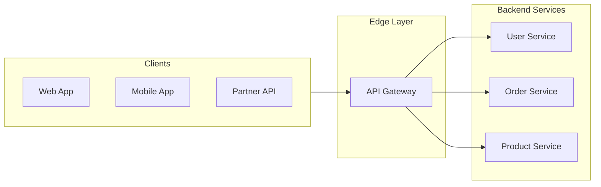

**Key Insight**: The API Gateway is the "front door" to your microservices. It centralizes cross-cutting concerns and provides a stable interface even as backend services evolve.

---

## Proxy Types

### Taxonomy

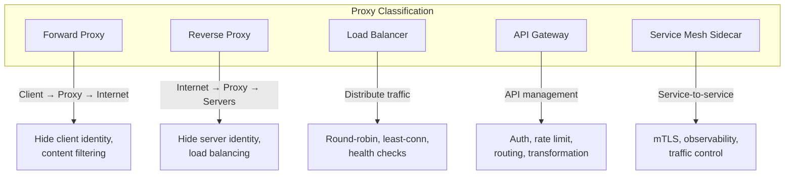

### Forward vs Reverse Proxy

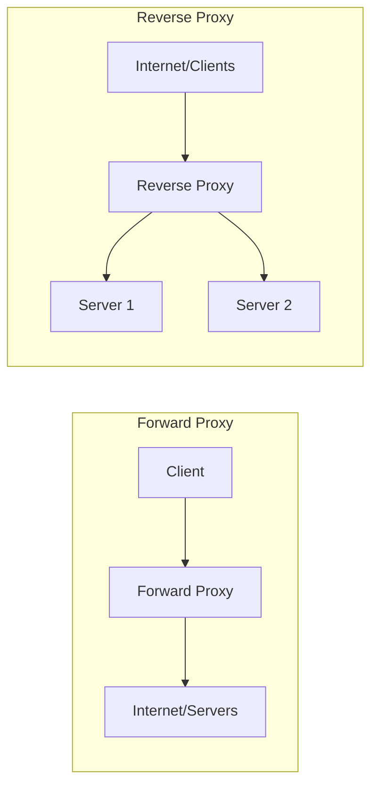

| Type | Direction | Purpose | Examples |
|------|-----------|---------|----------|
| **Forward Proxy** | Client → Proxy → Server | Anonymity, caching, filtering | Squid, corporate proxies |
| **Reverse Proxy** | Client → Proxy → Backend | Load balancing, SSL termination | Nginx, HAProxy |

---

## API Gateway

### Core Responsibilities

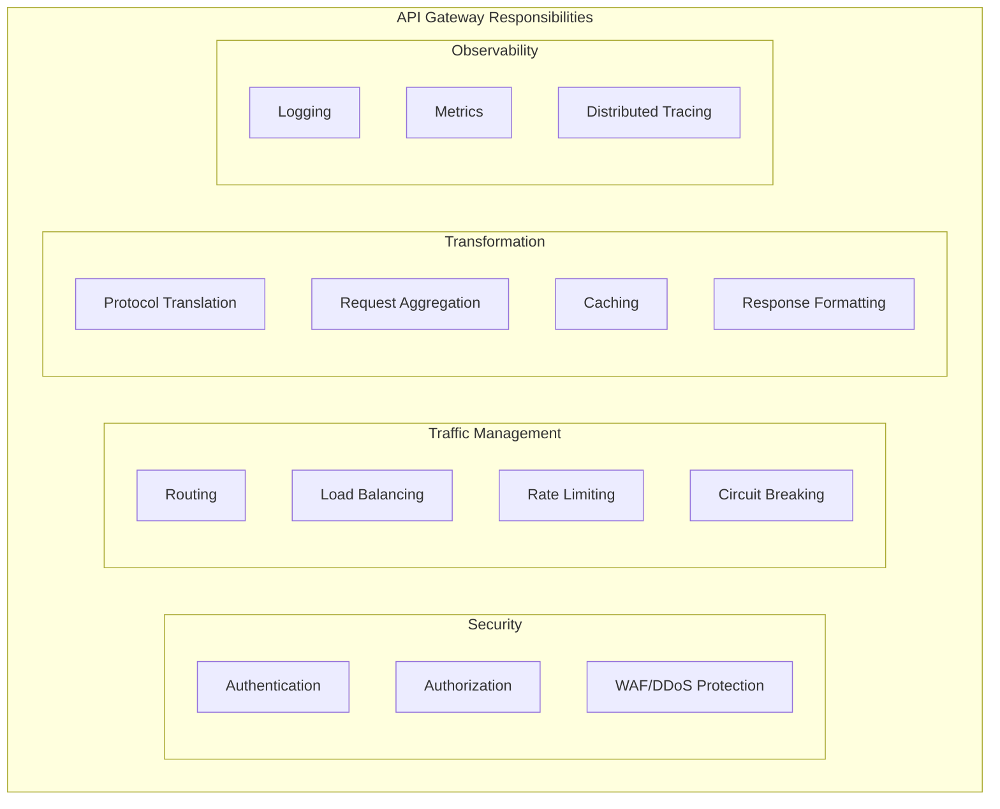

### Request Flow

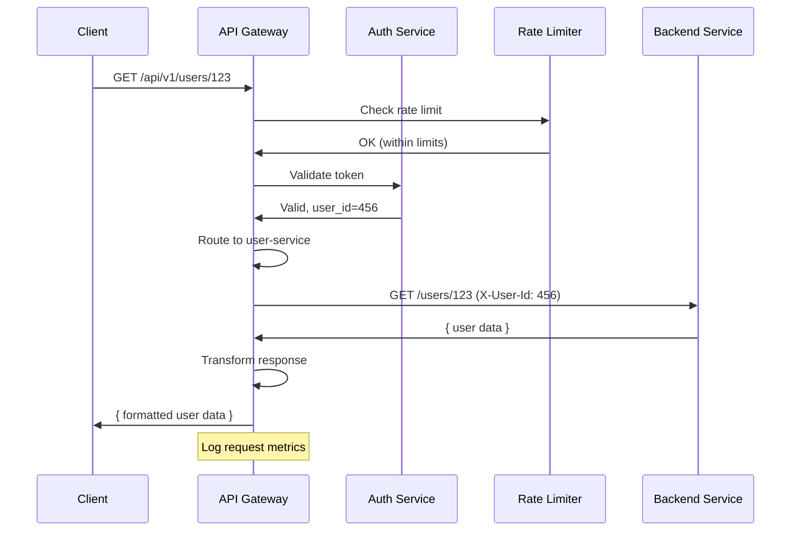

### Routing Strategies

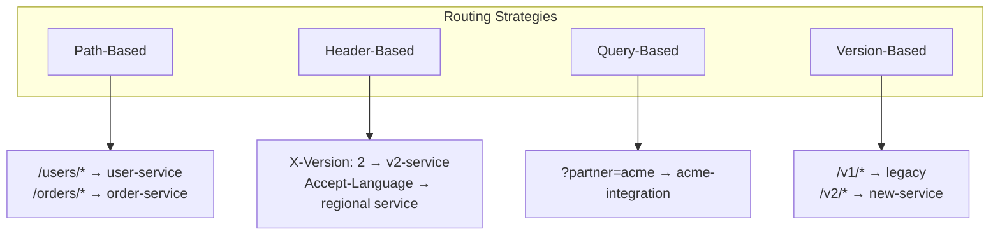

```yaml
# Kong declarative config example
services:
  - name: user-service
    url: http://user-svc:8080
    routes:
      - name: user-routes
        paths:
          - /api/v1/users
        methods:
          - GET
          - POST
        
  - name: order-service
    url: http://order-svc:8080
    routes:
      - name: order-routes
        paths:
          - /api/v1/orders
        headers:
          X-API-Version:
            - "2"
```

---

## Load Balancing

### Algorithms

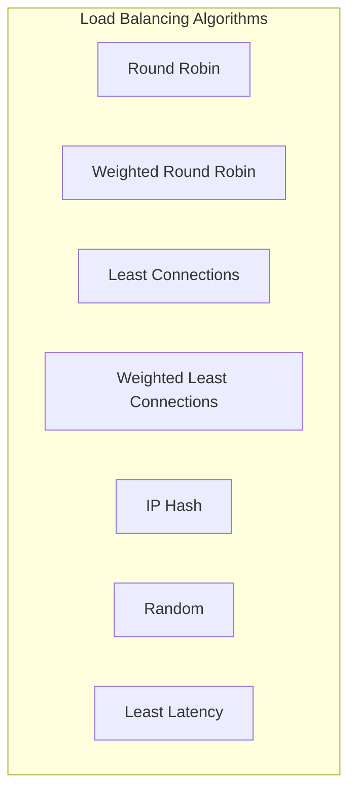

| Algorithm | Description | Best For |
|-----------|-------------|----------|
| **Round Robin** | Cycle through servers sequentially | Equal capacity servers |
| **Weighted Round Robin** | RR with server weights | Mixed capacity servers |
| **Least Connections** | Route to server with fewest active connections | Long-lived connections |
| **IP Hash** | Hash client IP to server | Session affinity needs |
| **Least Latency** | Route to fastest responding server | Latency-sensitive apps |
| **Random** | Random selection | Simple, stateless |

### Health Checking

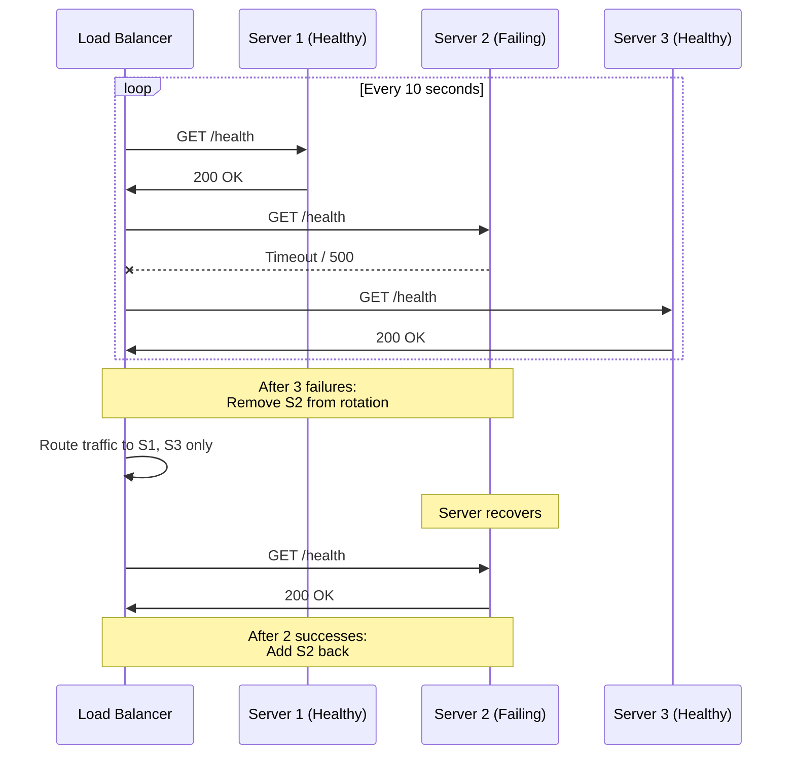

### Health Check Types

| Type | Description | Use Case |
|------|-------------|----------|
| **TCP** | Can establish connection | Basic availability |
| **HTTP** | Returns 2xx status | Application-level health |
| **gRPC** | gRPC health protocol | gRPC services |
| **Script** | Custom check script | Complex conditions |

```nginx
# Nginx upstream health check
upstream backend {
    server backend1.example.com:8080;
    server backend2.example.com:8080;
    server backend3.example.com:8080 backup;
    
    health_check interval=10s fails=3 passes=2;
}
```

---

## Authentication at the Gateway

### Patterns

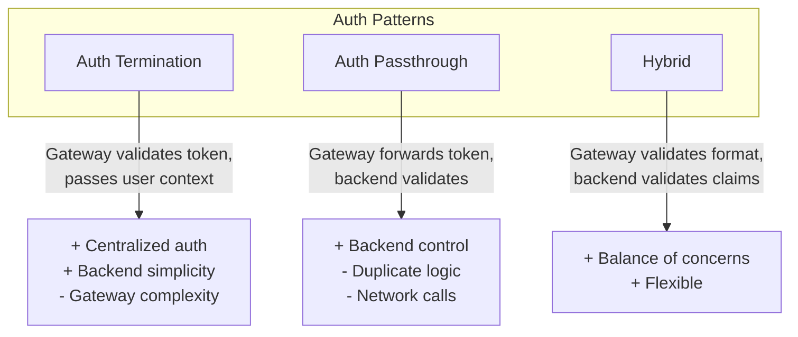

### JWT Validation Flow

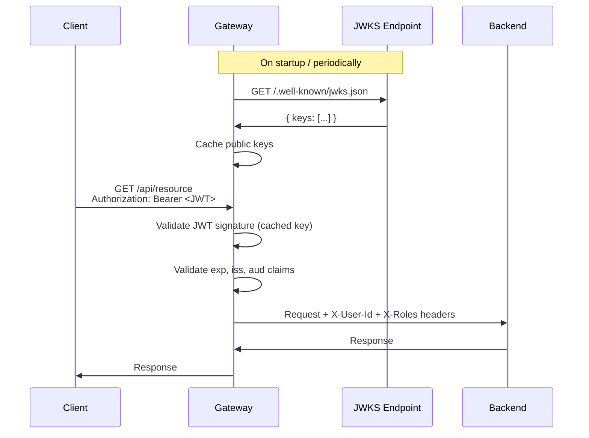

```javascript
// Gateway JWT validation middleware (Node.js)
const jwt = require('jsonwebtoken');
const jwksClient = require('jwks-rsa');

const client = jwksClient({
    jwksUri: 'https://auth.example.com/.well-known/jwks.json',
    cache: true,
    rateLimit: true
});

async function validateJWT(req, res, next) {
    const token = req.headers.authorization?.split(' ')[1];
    if (!token) return res.status(401).json({ error: 'No token' });
    
    try {
        const decoded = jwt.decode(token, { complete: true });
        const key = await client.getSigningKey(decoded.header.kid);
        const publicKey = key.getPublicKey();
        
        const payload = jwt.verify(token, publicKey, {
            issuer: 'https://auth.example.com',
            audience: 'my-api'
        });
        
        // Pass user context to backend
        req.headers['X-User-Id'] = payload.sub;
        req.headers['X-Roles'] = payload.roles.join(',');
        next();
    } catch (err) {
        res.status(401).json({ error: 'Invalid token' });
    }
}
```

---

## Rate Limiting at the Gateway

### Algorithms

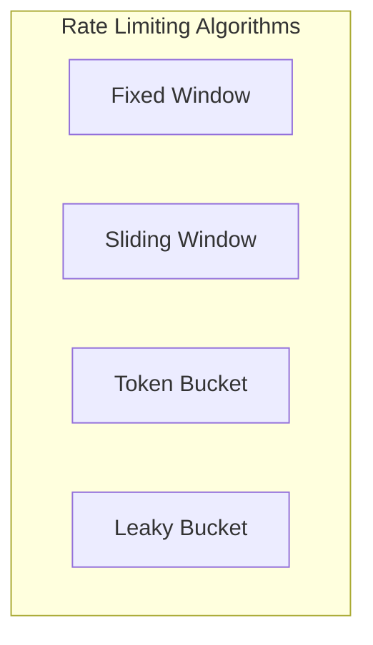

*Note: See Document 12 (Traffic Management) for detailed algorithm explanations.*

### Implementation Pattern

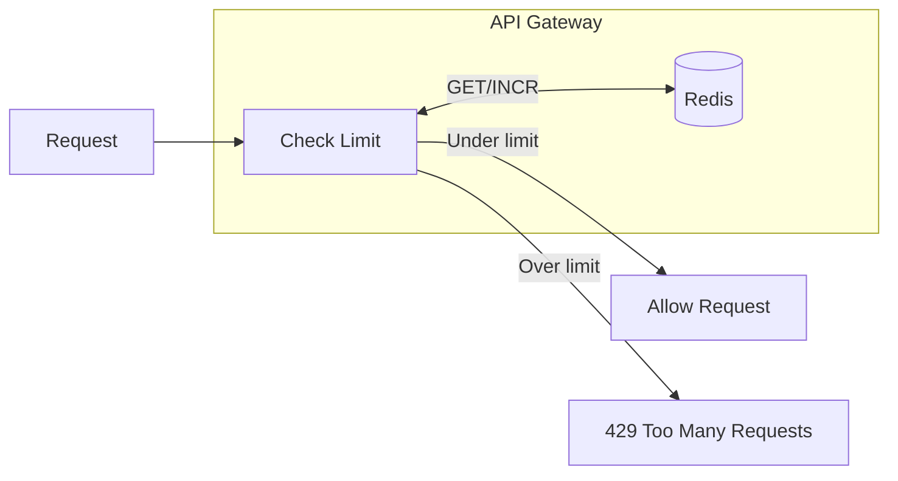

```lua
-- Nginx + Lua rate limiting
local limit = require "resty.limit.req"
local lim, err = limit.new("rate_limit_store", 100, 50)  -- 100 req/s, burst 50

if not lim then
    ngx.log(ngx.ERR, "failed to instantiate limiter: ", err)
    return ngx.exit(500)
end

local key = ngx.var.remote_addr  -- or API key, user ID
local delay, err = lim:incoming(key, true)

if not delay then
    if err == "rejected" then
        ngx.header["Retry-After"] = 1
        return ngx.exit(429)
    end
    return ngx.exit(500)
end

if delay >= 0.001 then
    ngx.sleep(delay)  -- Throttle (leaky bucket behavior)
end
```

---

## Backend for Frontend (BFF)

### Pattern

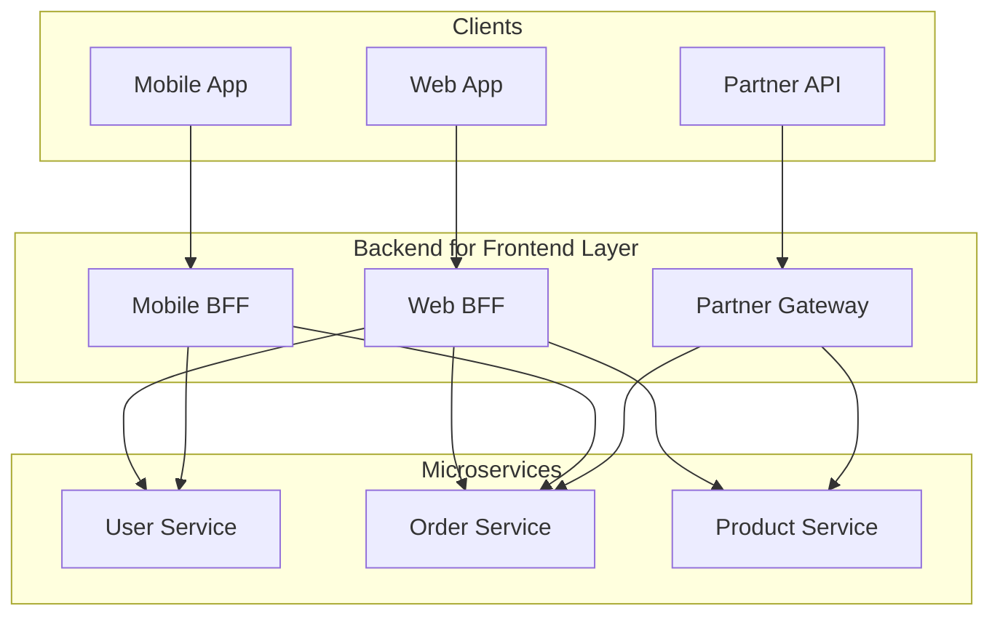

### Why BFF?

| Concern | Single Gateway | BFF per Client |
|---------|----------------|----------------|
| **Response format** | One size fits all | Tailored per client |
| **Aggregation** | Complex, generic | Optimized for UI |
| **Versioning** | Hard to evolve | Independent evolution |
| **Team ownership** | Central team bottleneck | Frontend teams own |
| **Performance** | May overfetch | Exactly what's needed |

### BFF Implementation

```javascript
// Mobile BFF - optimized for mobile screens
app.get('/api/home-feed', async (req, res) => {
    // Aggregate multiple services into one response
    const [user, recentOrders, recommendations] = await Promise.all([
        userService.getBasicProfile(req.userId),  // Minimal fields
        orderService.getRecent(req.userId, 3),    // Only last 3
        productService.getRecommendations(req.userId, 5)  // Top 5
    ]);
    
    // Mobile-optimized response
    res.json({
        user: { name: user.name, avatarUrl: user.avatarUrl },
        orders: recentOrders.map(o => ({
            id: o.id,
            status: o.status,
            thumbnail: o.items[0].thumbnailUrl
        })),
        recommendations: recommendations.map(p => ({
            id: p.id,
            name: p.name,
            price: p.price,
            imageUrl: p.mobileImageUrl  // Mobile-sized image
        }))
    });
});
```

---

## Service Mesh

### Architecture

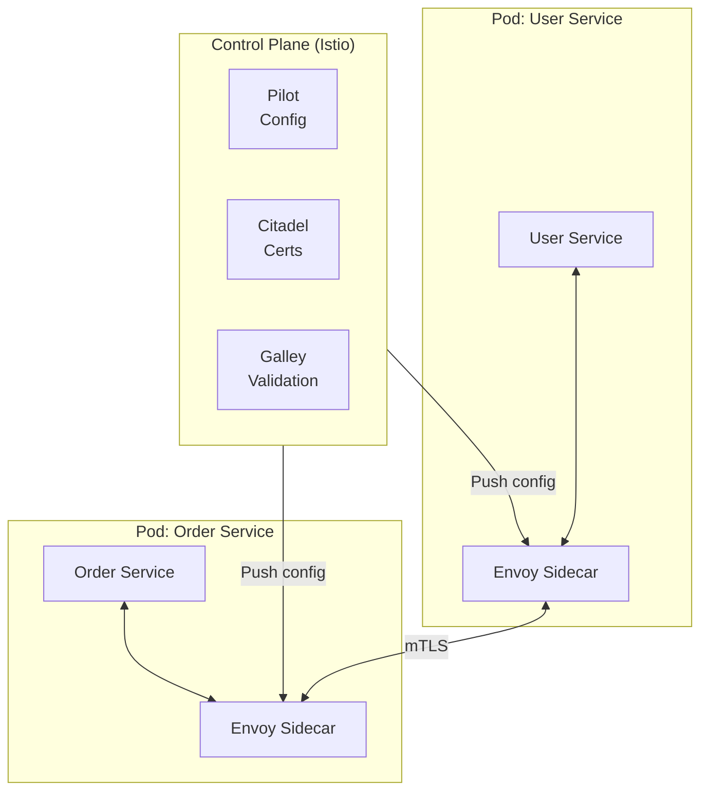

### Service Mesh vs API Gateway

| Aspect | API Gateway | Service Mesh |
|--------|-------------|--------------|
| **Position** | Edge (north-south traffic) | Internal (east-west traffic) |
| **Focus** | External API management | Service-to-service communication |
| **Auth** | External client auth | mTLS between services |
| **Features** | Rate limiting, API versioning | Observability, traffic shifting |
| **Implementation** | Centralized | Distributed (sidecars) |
| **Examples** | Kong, AWS API Gateway | Istio, Linkerd |

### When to Use Both

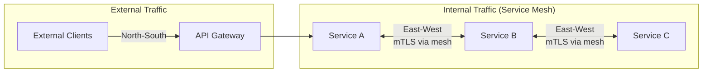

---

## SSL/TLS Termination

### Termination Points

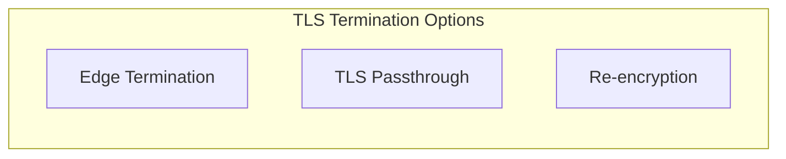

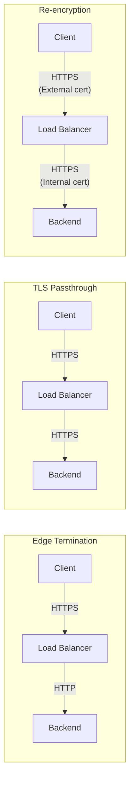

| Strategy | Performance | Security | Complexity |
|----------|-------------|----------|------------|
| **Edge Termination** | Best (single TLS handshake) | Internal traffic unencrypted | Low |
| **TLS Passthrough** | Moderate (backend handles TLS) | End-to-end encryption | Medium |
| **Re-encryption** | Worst (two TLS handshakes) | End-to-end + gateway inspection | High |

---

## Gateway Patterns

### Request Aggregation (API Composition)

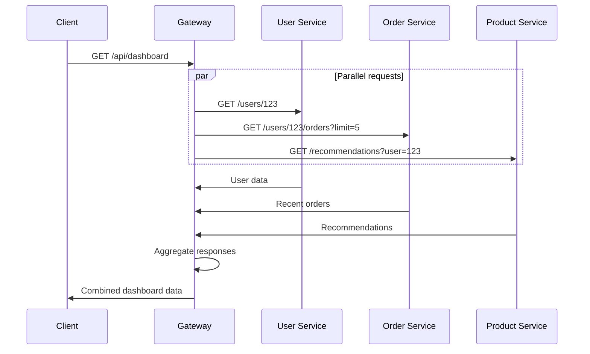

### Circuit Breaker at Gateway

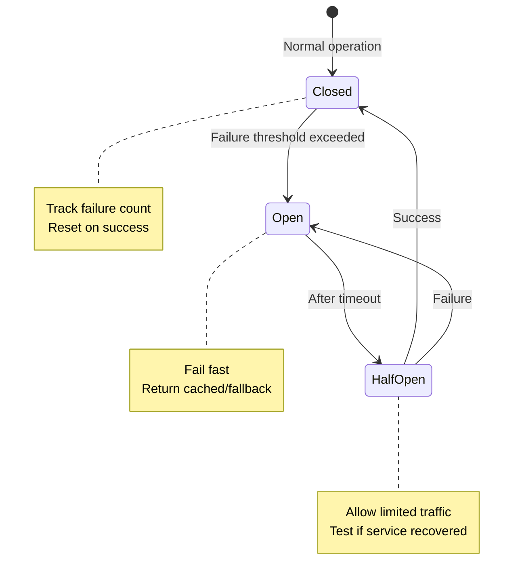

---

## Interview Scenarios

### Scenario 1: Public API for Third-Party Developers

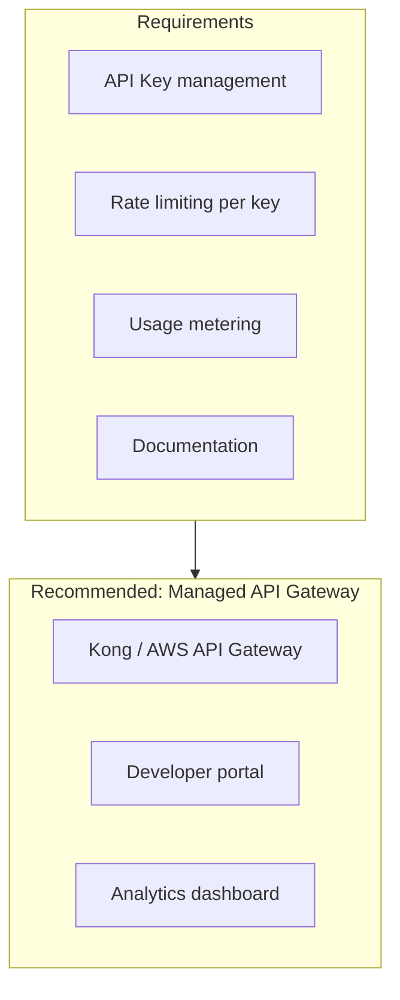

**Talking Points**:
- API key authentication and management
- Per-key rate limiting and quotas
- Usage tracking for billing
- Developer portal for documentation
- Versioning strategy (URL path versioning)

### Scenario 2: Microservices with Multiple Clients

```mermaid
flowchart TB
    subgraph Clients
        Web[Web App]
        iOS[iOS App]
        Android[Android App]
    end
    
    subgraph Solution["Recommended: BFF Pattern"]
        WebBFF[Web BFF]
        MobileBFF[Mobile BFF]
    end
    
    subgraph Services
        MS1[Service 1]
        MS2[Service 2]
        MS3[Service 3]
    end
    
    Web --> WebBFF
    iOS --> MobileBFF
    Android --> MobileBFF
    
    WebBFF --> MS1
    WebBFF --> MS2
    MobileBFF --> MS1
    MobileBFF --> MS3
```

**Talking Points**:
- Different data needs per client type
- Response aggregation at BFF layer
- Frontend teams can own their BFF
- Consider GraphQL as alternative

### Scenario 3: Zero-Trust Internal Communication

```mermaid
flowchart TB
    subgraph Solution["Recommended: Service Mesh"]
        direction TB
        Mesh[Istio / Linkerd]
        mTLS[mTLS everywhere]
        Policy[Policy enforcement]
        Observe[Distributed tracing]
    end
```

**Talking Points**:
- Service mesh for east-west traffic
- mTLS for service-to-service encryption
- Policy-based access control
- Observability (traces, metrics)
- API Gateway for north-south traffic

---

## Quick Reference Card

```
┌─────────────────────────────────────────────────────────────────┐
│                SERVICE EXPOSURE CHEAT SHEET                      │
├─────────────────────────────────────────────────────────────────┤
│ REVERSE PROXY (Nginx, HAProxy):                                 │
│   • Load balancing, SSL termination, caching                    │
│   • Simple routing, no API management                           │
├─────────────────────────────────────────────────────────────────┤
│ API GATEWAY (Kong, AWS API Gateway):                            │
│   • Authentication, rate limiting, routing                      │
│   • Request/response transformation                             │
│   • Developer portal, analytics                                 │
│   • Use for: External APIs, public-facing services              │
├─────────────────────────────────────────────────────────────────┤
│ BFF (Backend for Frontend):                                     │
│   • Client-specific aggregation and formatting                  │
│   • Owned by frontend teams                                     │
│   • Use for: Multiple client types with different needs         │
├─────────────────────────────────────────────────────────────────┤
│ SERVICE MESH (Istio, Linkerd):                                  │
│   • Service-to-service communication                            │
│   • mTLS, observability, traffic control                        │
│   • Use for: Internal microservices, zero-trust                 │
├─────────────────────────────────────────────────────────────────┤
│ DECISION HEURISTIC:                                             │
│   • External API consumers? → API Gateway                       │
│   • Multiple client types? → BFF + Gateway                      │
│   • Internal microservices? → Service Mesh                      │
│   • Simple routing/LB? → Reverse Proxy                          │
└─────────────────────────────────────────────────────────────────┘
```

---

## Practice Questions

1. Design the gateway architecture for a multi-tenant SaaS platform with per-tenant rate limits.
2. How would you implement canary deployments using an API gateway?
3. Compare the trade-offs of a single API gateway vs. BFF pattern for a company with web, iOS, and Android apps.
4. Explain how you would handle authentication for both external partners and internal services.
5. Design a system where the API gateway needs to aggregate responses from 5 microservices within 100ms SLA.
