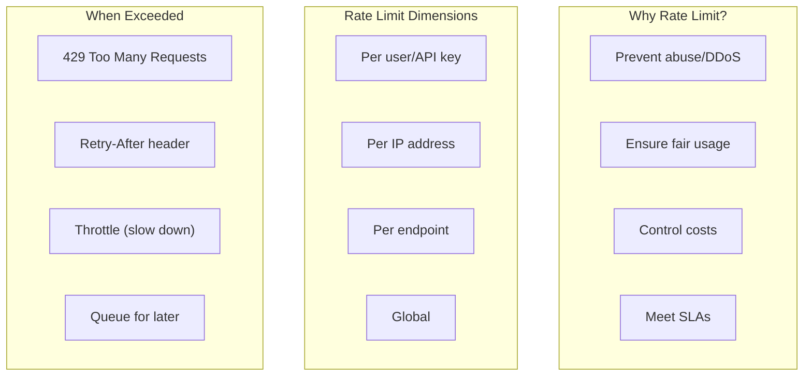
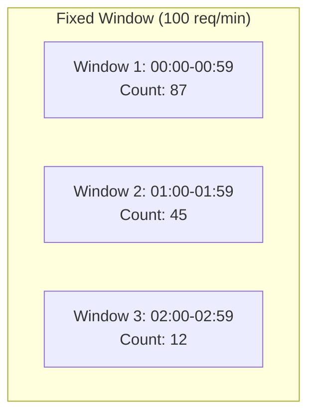
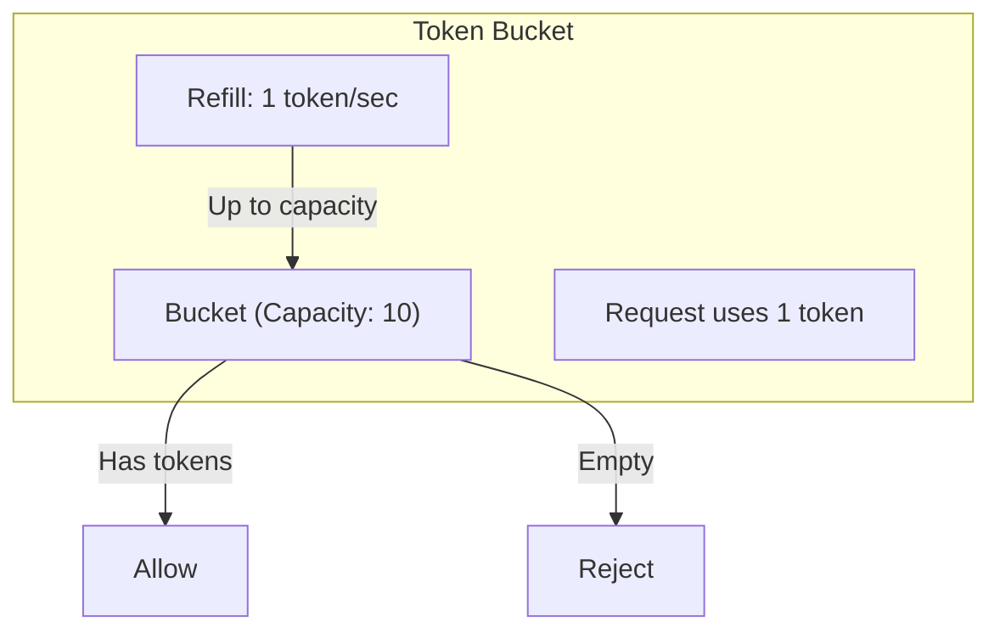
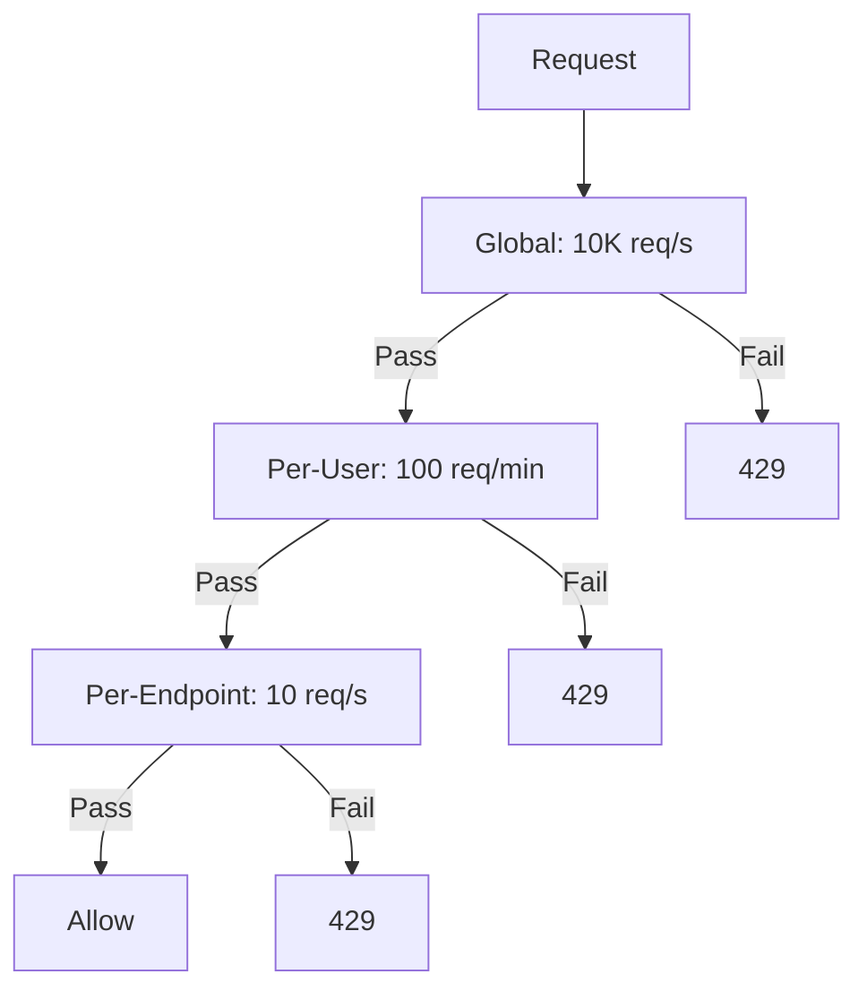
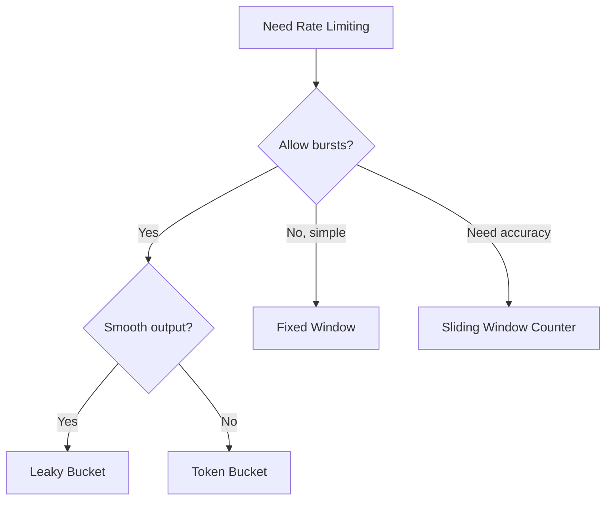

# 12 - Traffic Management: Rate Limiting Algorithms

## Overview

Rate limiting is a critical traffic management technique that protects services from abuse, ensures fair resource allocation, and maintains system stability under load. This document covers rate limiting algorithms, their implementations, and how to reason about them in system design interviews.

---

## Core Mental Model



**Key Insight**: Rate limiting is about balancing protection (limiting bad actors) with user experience (allowing legitimate traffic).

---

## Rate Limiting Algorithms

| Algorithm | Burst Handling | Memory | Accuracy | Complexity |
|-----------|---------------|--------|----------|------------|
| Fixed Window | Poor | O(1) | Low | Simple |
| Sliding Window Log | Good | O(n) | High | Medium |
| Sliding Window Counter | Good | O(1) | Medium | Medium |
| Token Bucket | Excellent | O(1) | High | Medium |
| Leaky Bucket | Smooths bursts | O(1) | High | Medium |

---

## Fixed Window Counter

### Concept



### Implementation

```python
import time
import redis

class FixedWindowRateLimiter:
    def __init__(self, redis_client, limit=100, window_seconds=60):
        self.redis = redis_client
        self.limit = limit
        self.window = window_seconds
    
    def is_allowed(self, key: str) -> bool:
        current_window = int(time.time() // self.window)
        redis_key = f"rate_limit:{key}:{current_window}"
        current_count = self.redis.incr(redis_key)
        if current_count == 1:
            self.redis.expire(redis_key, self.window)
        return current_count <= self.limit
```

### The Boundary Problem

At window boundaries, a client can get 2x the rate limit (50 at 00:59 + 100 at 01:00 = 150 in 1 minute).

---

## Sliding Window Counter

### Concept

Weights overlapping windows:
```
Estimated = curr_count + (prev_count × (1 - window_elapsed%))
```

### Implementation

```python
class SlidingWindowCounterRateLimiter:
    def __init__(self, redis_client, limit=100, window_seconds=60):
        self.redis = redis_client
        self.limit = limit
        self.window = window_seconds
    
    def is_allowed(self, key: str) -> bool:
        now = time.time()
        current_window = int(now // self.window)
        prev_window = current_window - 1
        window_elapsed = (now % self.window) / self.window
        
        curr_key = f"rate_limit:{key}:{current_window}"
        prev_key = f"rate_limit:{key}:{prev_window}"
        
        curr_count = int(self.redis.get(curr_key) or 0)
        prev_count = int(self.redis.get(prev_key) or 0)
        
        prev_weight = 1 - window_elapsed
        estimated_count = curr_count + (prev_count * prev_weight)
        
        if estimated_count >= self.limit:
            return False
        
        self.redis.incr(curr_key)
        self.redis.expire(curr_key, self.window * 2)
        return True
```

---

## Token Bucket

### Concept



### Implementation

```python
class TokenBucketRateLimiter:
    def __init__(self, redis_client, capacity=10, refill_rate=1):
        self.redis = redis_client
        self.capacity = capacity
        self.refill_rate = refill_rate
    
    def is_allowed(self, key: str, tokens_needed: int = 1) -> bool:
        now = time.time()
        bucket_key = f"token_bucket:{key}"
        
        data = self.redis.hgetall(bucket_key)
        if data:
            tokens = float(data[b'tokens'])
            last_refill = float(data[b'last_refill'])
        else:
            tokens = self.capacity
            last_refill = now
        
        time_passed = now - last_refill
        tokens = min(self.capacity, tokens + time_passed * self.refill_rate)
        
        if tokens >= tokens_needed:
            tokens -= tokens_needed
            allowed = True
        else:
            allowed = False
        
        self.redis.hset(bucket_key, mapping={'tokens': tokens, 'last_refill': now})
        return allowed
```

---

## Leaky Bucket

### Concept

Queue with constant drain rate — smooths traffic to constant output.

### Token vs Leaky Bucket

| Token Bucket | Leaky Bucket |
|--------------|--------------|
| Allows bursts up to capacity | Smooths all traffic |
| Variable output rate | Constant output rate |
| Good for APIs with burst tolerance | Good for stream processing |

---

## Distributed Rate Limiting

### Challenge

With multiple servers, local counters undercount (each server sees partial traffic).

### Solution: Centralized Store

```python
# Lua script for atomic Redis operation
lua_script = """
local key = KEYS[1]
local now = tonumber(ARGV[1])
local window_start = tonumber(ARGV[2])
local limit = tonumber(ARGV[3])

redis.call('ZREMRANGEBYSCORE', key, 0, window_start)
local count = redis.call('ZCARD', key)

if count < limit then
    redis.call('ZADD', key, now, now .. '-' .. math.random())
    return {1, count + 1, limit}
else
    return {0, count, limit}
end
"""
```

---

## Rate Limiting Headers

```http
HTTP/1.1 200 OK
X-RateLimit-Limit: 100
X-RateLimit-Remaining: 45
X-RateLimit-Reset: 1640000000

HTTP/1.1 429 Too Many Requests
Retry-After: 30
```

---

## Multi-Level Rate Limiting



---

## Algorithm Selection



---

## Quick Reference

```
┌─────────────────────────────────────────────────────────────────┐
│                RATE LIMITING CHEAT SHEET                         │
├─────────────────────────────────────────────────────────────────┤
│ FIXED WINDOW: Simple, O(1), but 2x at boundaries               │
│ SLIDING WINDOW COUNTER: Good balance, O(1), most common        │
│ TOKEN BUCKET: Allows bursts, configurable capacity/rate        │
│ LEAKY BUCKET: Smooths to constant rate, good for streaming     │
├─────────────────────────────────────────────────────────────────┤
│ DISTRIBUTED: Use Redis with Lua for atomicity                  │
│ HEADERS: X-RateLimit-Limit, Remaining, Reset, Retry-After      │
└─────────────────────────────────────────────────────────────────┘
```

---

## Practice Questions

1. Design a rate limiter for 10,000 req/s across 100 servers.
2. How would you implement tier-based limits (free vs premium)?
3. Explain the boundary problem and how sliding windows solve it.
4. What's your fallback when Redis is unavailable?
5. Design rate limiting for 1 million unique users.
